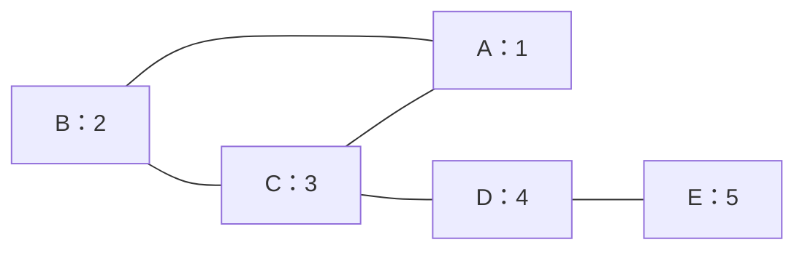
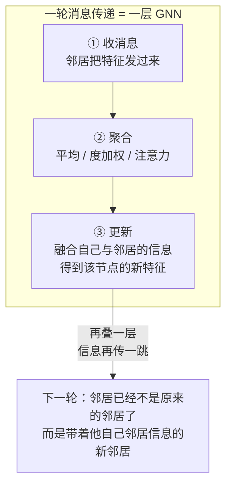

# GNN 核心模型

> **一句话理解**：图神经网络（GNN）的发动机只有一个动作——**消息传递（Message Passing）**：每个节点收集邻居的特征、聚合成一条消息、用它更新自己；重复几轮后，每个节点的向量就"泡透"了周围几跳的结构信息——但这个动作做太多轮会把所有节点搅成同一锅粥（过平滑），做太大范围会让计算组合爆炸（邻居爆炸），一切设计都在这两面墙之间腾挪。

[⬆️ 返回总目录](../../../README.md) · [⬆️ 返回本篇](../README.md) · [⬅️ 返回本章目录](./README.md)

| 属性 | 说明 |
|------|------|
| 难度 | ⭐⭐⭐⭐（高阶） |
| 所属分支 | 图 |
| 前置知识 | [图数据入门](./01-图数据入门.md)；[Transformer 与注意力机制](../07-自然语言处理与LLM/02-Transformer与注意力机制.md)（读懂 GAT 时需要） |

---

## 📌 这一节解决什么问题

想在图上做机器学习，先要回答：**每个节点的"特征向量"从哪来？**

上一节说过，图没有固定顺序、邻域长度可变，CNN 的固定窗口和 RNN 的序列展开都套不上。老办法是**手工设计图特征**：每个节点的度、共同好友数、所在社区编号……能用，但手工列表永远写不全——"朋友的朋友的聚类系数"这种高阶结构，人工枚举到天荒地老。

图神经网络换了一条路：把"参考邻居"本身做成**可学习的神经网络层**——不指定要提取什么结构特征，只规定"邻居信息如何流动、如何聚合"，让梯度下降自己学出每个节点最好的向量。于是，[第 8 章](../08-推荐系统/README.md)里"用户向量、物品向量"的故事在图上重演：这次学出来的向量，天生携带关系结构。

但"听邻居的"这个朴素动作自带两面墙，本页会反复撞上它们：**墙一（过平滑）**——听的轮数太多，所有人的观点趋同，节点向量分不出彼此；**墙二（邻居爆炸）**——哪怕只听两跳，热门节点的邻居组合就能大到算不动。GCN、GAT、GraphSAGE 三大模型，加上后续的一切变体，本质都是在两面墙之间找不同的落点。

## 🌱 通俗理解

两种生活图景，正好对应消息传递的两面：

- **朋友圈互相影响**：你每月的观点，总会被常来往朋友的观点"平均"掉一些——朋友的品味、立场慢慢渗进你的判断。泡得越久，你和圈子越像；而你的朋友也在被他的圈子影响——**影响是逐轮扩散的**；
- **部门例会逐级汇总**：组员把情况汇报给组长（第一轮聚合），组长带着"组的共识"参加部门会（第二轮聚合），部门经理再汇总给公司（第三轮）。**层级数 = 信息向上传几跳**——两层 GNN，意味着"朋友的朋友"也开始影响你。

每一轮消息传递就是三步：**收**（邻居把特征发过来）→ **聚**（平均/加权平均/注意力）→ **新**（融合成自己的新特征）。所有 GNN 模型的区别，几乎只在"聚"这一步怎么做。

这两个比喻也预告了两面墙：朋友圈互相影响泡了十年，全城人的观点都差不多——**过平滑**；而"逐级汇报"如果 CEO 想直接听每个员工的二跳关系（同事的同事），一家十万人的公司光排名单就要排到天荒地老——**邻居爆炸**。

## 📋 举个例子

一张 5 节点的小图（无向），每个节点初始带一个数值特征（想象成"兴趣值"）：



邻居关系：A 的邻居是 B、C；B 的邻居是 A、C；C 的邻居是 A、B、D；D 的邻居是 C、E；E 的邻居只有 D。

**手推一轮消息传递**（聚合方式取最简单的"邻居平均"，先不含自己）：

| 节点 | 初始值 | 邻居及取值 | 新值 = 邻居平均 |
|------|------|------|------|
| A | 1 | B(2)、C(3) | (2+3)/2 = **2.5** |
| B | 2 | A(1)、C(3) | (1+3)/2 = **2.0** |
| C | 3 | A(1)、B(2)、D(4) | (1+2+4)/3 ≈ **2.33** |
| D | 4 | C(3)、E(5) | (3+5)/2 = **4.0** |
| E | 5 | D(4) | 4/1 = **4.0** |

看两个细节：

1. **信息流了一跳**：E 的"5"还碰不到 B（隔了 D、C 两跳），但已经传到了 D；A 原来是 1，被邻居拉到 2.5——它不再是"孤立的 1"，而是"住在 2 和 3 之间的那个点"；
2. **邻居少的节点个性强**：E 只有一个邻居 D，新值完全由 D 决定（度=1 的节点几乎没有"投票权"），这也解释了后面为什么冷启动节点（没邻居）是图模型的软肋。

<details>
<summary>📊 展开完整算例：第二轮消息传递与"过平滑"苗头</summary>

对第一轮的结果再做一次"邻居平均"：

| 节点 | 第 1 轮值 | 邻居的第 1 轮值 | 第 2 轮新值 |
|------|------|------|------|
| A | 2.5 | B(2.0)、C(2.33) | (2.0+2.33)/2 ≈ **2.17** |
| B | 2.0 | A(2.5)、C(2.33) | (2.5+2.33)/2 ≈ **2.42** |
| C | 2.33 | A(2.5)、B(2.0)、D(4.0) | (2.5+2.0+4.0)/3 ≈ **2.83** |
| D | 4.0 | C(2.33)、E(4.0) | (2.33+4.0)/2 ≈ **3.17** |
| E | 4.0 | D(4.0) | **4.0** |

对比三轮的数值范围（最大值 − 最小值）：

| | 初始 | 第 1 轮 | 第 2 轮 |
|------|------|------|------|
| 数值范围 | 5 − 1 = **4** | 4.0 − 2.0 = **2.0** | 4.0 − 2.17 ≈ **1.83** |

节点间的差异一轮比一轮小——大家的向量正在趋同。真实 GNN 里每层还带可学习的变换和激活，不会这么快"糊成一片"，但堆到五六层以上，所有节点的向量会高度相似，分不出谁是谁——这就是**过平滑（Over-smoothing）**，也是 GNN 通常只叠 2~3 层的根本原因。

**失败算例（何时彻底失效）**：把这张图改成 5 个节点首尾相连的环（每个节点恰好 2 个邻居、结构完全对称），做"邻居平均"传递：无论多少轮，每个节点的新值永远是两个邻居的平均——环上的数值分布会**永远保持对称**，结构上无法区分的节点（比如环上对角的两个点）数值也永远相同。这就是过平滑的极端形态：**对称结构 + 重复平滑 = 永久不可分**，和上一节 WL 测试"分不开的结构 GNN 也分不开"是同一件事的数值版。

</details>

## 🧠 核心原理

### 整体流程：消息传递



### 逐步拆解

**① 一层的数学骨架。** 对节点 $v$，第 $k$ 层到第 $k{+}1$ 层：

$$
h_v^{(k+1)} = \mathrm{UPDATE}\Big(h_v^{(k)},\ \mathrm{AGG}\big(\{\, h_u^{(k)} : u \in \mathcal{N}(v) \,\}\big)\Big)
$$

> 👉 **人话**：我的新特征 = 我现在的特征 + 邻居们特征的一个汇总。UPDATE 负责融合，AGG 负责汇总（平均？加权？让注意力学？）——不同 AGG/UPDATE 设计，长出了不同流派的 GNN。

**② 层数 = 信息传播几跳。** 叠两层，"朋友的朋友"的特征就能流到你这里（第一层把朋友的信息聚到朋友那里，第二层再从朋友流到你）。社交网络的"六度分隔"直觉在这里失效于计算成本而非图论——理论上想看六跳就叠六层，但过平滑会先毁掉一切，所以实践中 **2~3 层是主流**，看更远的邻居靠"多采样一层邻居"而不是"多叠一层网络"。

<details>
<summary>🧮 展开看：过平滑的数学——重复传播就是反复做拉普拉斯平滑</summary>

把"邻居平均"写成矩阵形式。设 $H^{(k)}$ 是第 k 层所有节点的特征矩阵（每行一个节点），$D$ 是度矩阵、$A$ 是邻接矩阵，则不带权重、不含自身的传播是：

$$
H^{(k+1)} = D^{-1} A\, H^{(k)}
$$

> 👉 **人话**：$D^{-1}A$ 这个矩阵的每一行就是"把邻居平均掉"——除以自己的度，等于给每个邻居发了等权投票。

**关键一步：拆出拉普拉斯算子。** 注意 $D^{-1}A = I - D^{-1}(D - A) = I - D^{-1}L$，其中 $L = D - A$ 是图拉普拉斯矩阵（Graph Laplacian）。于是：

$$
H^{(k+1)} = \big(I - D^{-1} L\big) H^{(k)}
$$

**每传播一轮 = 乘一次 $(I - D^{-1}L)$**——这正是图信号处理里的**拉普拉斯平滑算子**（低通滤波：高频差异被压掉、低频共性被保留）。重复 K 层：

$$
H^{(K)} = \big(I - D^{-1} L\big)^K H^{(0)}
$$

**频域视角看幂次**：把初始特征按拉普拉斯的特征向量分解，每个频率分量 $\phi_i$ 每传一层被乘以因子 $(1 - \lambda_i / d_i)$ 类似的收缩系数——**高频分量（相邻节点差异大的部分，对应大特征值）每层被压掉一截，低频分量（全图共性的部分）几乎原样保留**。幂次 $K$ 越大，高频信号被压得越干净，剩下的只有"全图平均"那个分量——**所有节点的向量都收敛到同一个常数向量**。

> 👉 **人话**：每层消息传递都在做一次"抹平"——把"我和邻居不一样的地方"磨掉一层。磨一两层，磨掉的是噪声、留下的是社区共性（这恰好是我们要的）；磨十层，把节点之间**所有**有意义的差别都磨没了，只剩"这张图的平均值"一个数——大家都等于平均值，还分什么类。

这也解释了两个工程事实：其一，**GCN 加深不如加宽**——加深在数学上就是多乘几次平滑算子，纯属加速趋同；其二，缓解手段为什么长那样——残差连接（每层往回加一份未平滑的 $H^{(k)}$，等于给高频信号留旁路）、DropEdge（随机删边打断"全连通式"的均匀抹平）、自环加权（调节"自己 vs 邻居"的配比，少抹一点）。它们都是在"抹平"这道乘法里掺沙子。

</details>

**③ 三大模型一句话定位。**

| 模型 | AGG 怎么做 | 一句话定位 |
|------|-----------|-----------|
| GCN（Graph Convolutional Network） | 邻居加权平均（按双方度归一） | "邻居加权平均"的规范版，图里的 ResNet——简单、快、首选基线 |
| GAT（Graph Attention Network） | 注意力给重要邻居更高权重 | 邻居不平等：谁的话该多听，注意力自己学（思想同 [Transformer 的注意力](../07-自然语言处理与LLM/02-Transformer与注意力机制.md)，但只在邻居上算，不是全图） |
| GraphSAGE | 采样固定数量邻居再聚合 | 面向巨图：每次只采样几个邻居，训练和推理都能扩展到亿级节点 |

以 GCN 的一层为例（矩阵形式，$\tilde A$ 是加了自环的邻接矩阵，$\tilde D$ 是对应度矩阵）：

$$
H^{(l+1)} = \sigma\big(\tilde{D}^{-1/2}\, \tilde{A}\, \tilde{D}^{-1/2}\, H^{(l)} W^{(l)}\big)
$$

> 👉 **人话**：每个节点的新特征 = 自己和邻居的特征做"度归一化的平均"，再过一个可学习的变换 $W$ 和激活 $\sigma$。$\tilde{D}^{-1/2}$ 那两坨就是在给热门节点降权——朋友太多的节点，每句话的分量就轻一点，别让它一个淹没全场。

<details>
<summary>🧮 展开看：GCN 从哪来——从谱图卷积到"邻居平均"的三步简化</summary>

"图卷积"这个名字不是白叫的，GCN 的公式是从**谱域（频率域）的严格卷积定义**一路简化来的，故事三步：

**第一步：谱域卷积的严格定义。** 图上没有平移，卷积（滑动窗口相乘求和）没法直接定义。谱方法绕道频域：把图信号用拉普拉斯矩阵 $L$ 的特征向量做傅里叶变换到"频率域"，在频域乘一个可学习的滤波器 $g_\theta$，再变换回来——$y = U\, g_\theta\, U^{\top} x$（$U$ 是特征向量矩阵）。数学上严格，但**要显式做特征分解，$O(n^3)$，百万节点的图直接出局**。

**第二步：切比雪夫多项式近似（ChebNet）。** 把滤波器 $g_\theta$ 限制为切比雪夫多项式形式，卷积变成"多项式 of $L$"乘信号——只用 $K$ 阶邻居信息（K 跳内的局部卷积），**避免了特征分解**，但也已经埋下"局部化"的伏笔。

**第三步：GCN 的一刀切。** Kipf & Welling（2017）把多项式截断到只剩一阶（$K{=}1$），再加上对称归一化 $\tilde{D}^{-1/2}\tilde A \tilde D^{-1/2}$，就得到正文那条一行公式——**"谱域的严格卷积"塌缩成了"空域的度归一化邻居平均"**。

> 👉 **人话**：GCN 的公式看着像拍脑袋的"平均邻居"，其实是频域卷积一路近似、截断、再简化的终点——理论血统纯正，最后落地成一行小学生都懂的加权平均。谱方法负责"为什么这叫卷积"，空域形式负责"为什么它能跑起来"，两者是一枚硬币的两面。

</details>

GAT 的关键则是把"固定权重"换成学出来的注意力权重：

$$
\alpha_{v,u} = \frac{\exp\big(\text{score}(h_v, h_u)\big)}{\sum_{w \in \mathcal{N}(v)} \exp\big(\text{score}(h_v, h_w)\big)}
$$

> 👉 **人话**：给每个邻居打一个"发言分"，softmax 归一成权重——重要的邻居多说，无关的邻居少说，权重完全从数据里学。

**GAT 注意力 vs Transformer 注意力：同思想，两张皮。** 都做"加权聚合一堆向量、权重由打分 softmax 而来"，但差异是结构性的：

| | Transformer 注意力 | GAT 注意力 |
|---|---|---|
| 谁参与 | 序列/集合里**所有**位置 | **只有该节点的邻居**（结构先验限定范围） |
| QKV 投影 | 有（Q/K/V 三套投影，attention = softmax(QK/√d)V） | **无**（原始 GAT 用共享的 LeakyReLU(a·[Wh_v, Wh_u]) 打分，没有 Q/K 拆分） |
| 权重几套 | 多头各一套 + 逐位置 | 逐边一套，多头也可加 |
| 看得见谁 | 全局任意两点直接连线 | 隔两跳必须经中间节点两步传递 |
| 换位置不变性 | 无此概念（位置靠 positional encoding 补） | 天然置换不变（图本来无序） |

> 👉 **人话**：Transformer 是"大会上人人可以自由搭话"，配 QKV 是为了分清"我问的"和"你答的"；GAT 是"只能跟微信好友说话"——注意力的范围被图结构焊死，一跳之外鞭长莫及。所以 GAT 不需要位置编码（图无序），但也学不到"两个没有边相连的节点直接相关"——那个信息得靠多叠几层慢慢传（然后小心过平滑）。

**④ 邻居爆炸与子图采样训练：GraphSAGE 为什么必需。** 全图训练（把整张图的邻接矩阵一次喂进显存）在百万节点以上不可行——不仅有显存问题，mini-batch 训练本身会撞上**组合爆炸**，实算一遍就明白：

设一个 mini-batch 采样 $B$ 个目标节点，要算 2 层 GNN，每层保留全部邻居（平均度 $\bar d$）：

- 第 2 层（外圈）：每个目标节点需要全部 $\bar d$ 个邻居的特征；
- 第 1 层（内圈）：这 $\bar d$ 个邻居**每个**又需要他们各自的 $\bar d$ 个邻居；
- 一个 batch 涉及的节点数约为 $B \times (1 + \bar d + \bar d^2)$。

代入数字感受量级：$B = 512$，社交图 $\bar d = 50$：

$$
512 \times (1 + 50 + 2500) \approx 130 \text{ 万个节点的计算}
$$

**算 512 个点的两层，实际要碰上百万个节点**——平均度 50 听着不大，平方一下就是灾难；平均度 100 时这个数字变成 500 万。这还没算显存和邻居查表的 I/O。更气人的是热点节点：幂律图里一个大 V 的度是十万级（上一节），一条批内的采样路径撞上它，单这一个节点就吃光预算。

GraphSAGE 的解法干脆利落：**每层每个节点只采样固定数量的邻居**（比如每层采 10 个）：

$$
512 \times (1 + 10 + 100) \approx 5.7 \text{万个节点}
$$

> 👉 **人话**：既然"全要"会爆炸，那就"抽签"——每个节点每层只随机听 10 个邻居的发言。单次听不全，但梯度下降跑几千个 batch，每个节点被反复抽到不同邻居子集，**期望意义上把完整邻域的信息都过了一遍**。这就是"以随机性换可行性"：牺牲单次的完整性，换取训练的整体无偏与可扩展。

代价与边界：采样引入方差（同一节点两次前向结果略不同），需要配合更大的 batch/更多轮训练平滑；对低度节点（本来就没几个邻居）无损，对高度节点有信息丢失——工业上常按度分层采样（热门节点的邻居多采几轮，或先聚合一层"邻居摘要"）。**推理同理**：新节点来了不必重训全图，现场采它的局部子图做一次前向即可——这正是 GraphSAGE "inductive（归纳式）"的真正含义：向量是"算出来的函数"，不是"背下来的表"。

**⑤ 异构图一句（R-GCN）。** 现实图常常不止一种边——知识图谱里"生于 / 著有 / 属于"是三种语义完全不同的关系，用户-物品图里"点击 / 收藏 / 购买"也各有含义。R-GCN（Relational GCN）的做法一句话：**给每种关系配一套独立的变换权重 $W_r$，聚合时先按关系分组各自变换、再加权求和**——"同事的话"和"家人的话"用不同的耳朵听。

**⑥ GNN 都用在哪。** 推荐召回（把用户-物品交互图喂给 GNN，学出的向量与[双塔召回](../08-推荐系统/03-双塔模型与向量召回.md)互补——双塔快、图看得远）、药物发现（分子是天然的图，图分类筛选候选分子）、知识图谱（补全实体间缺失的关系=链接预测）、风控团伙识别（欺诈者共享设备/地址形成的密集子图，详见[生产实战](./99-生产实战.md)）。

### 📐 数学深潜：GCN 对称归一化的谱动机——为什么是 $\tilde{D}^{-1/2}\tilde{A}\tilde{D}^{-1/2}$ 而不是简单平均

**严格陈述。** 无向图（可含多个连通分量，结论逐分量成立）上，$\tilde A = A + I$（加自环），$\tilde D$ 为对应度矩阵（$\tilde d_i = d_i + 1$）。定义对称归一化传播矩阵 $S = \tilde D^{-1/2}\tilde A\tilde D^{-1/2}$ 与重归一化拉普拉斯 $\tilde\Delta = I - S$。则 $S$ 对称，且特征值全部落在 $(-1,\ 1\,]$；等价地：

$$
\tilde\Delta \text{ 的特征值全部落在 } [\,0,\ 2\,)
$$

> 👉 **人话**：GCN 的传播矩阵是一台"音域受限"的机器——任何信号经它传播，各"频率"分量的放大倍数都被夹在 (−1, 1] 里：不会爆炸（|倍数| ≤ 1），也不会永久振荡（严格打不穿 −1）。这一条就是"为什么这样归一化而不是简单平均"的定理版答案。

<details>
<summary>🧮 完整推导：三步把特征值关进 [0, 2)</summary>

记不加自环的拉普拉斯 $L = D - A$。先验证恒等式 $\tilde D - \tilde A = (D + I) - (A + I) = D - A = L$，再把 $I$ 写成 $\tilde D^{-1/2}\tilde D\,\tilde D^{-1/2}$ 提出公因子：

$$
\tilde\Delta = I - \tilde D^{-1/2}\tilde A\tilde D^{-1/2} = \tilde D^{-1/2}(\tilde D - \tilde A)\tilde D^{-1/2} = \tilde D^{-1/2} L\, \tilde D^{-1/2}
$$

> 👉 **人话**：$\tilde\Delta$ 就是 $L$ 的"对称归一化版"——$S$ 与 $\tilde\Delta$ 共享特征向量、特征值相差 1（$\lambda(S) = 1-\lambda(\tilde\Delta)$），分析谁都行。

**第 1 步：$L$ 的二次型（逐边平方和）。** 对任意向量 $x$，按定义 $x^{\top}Lx = x^{\top}Dx - x^{\top}Ax$，逐项展开（$\sum_{i,j}A_{ij}x_ix_j$ 中每条无向边贡献两个交叉项）：

$$
x^{\top} L x = \sum_{(i,j)\in E}\big(x_i^2 + x_j^2\big) - \sum_{(i,j)\in E}2x_ix_j = \sum_{(i,j)\in E}\big(x_i - x_j\big)^2
$$

> 👉 **人话**：$L$ 作用在信号上"称"出来的是相邻节点的差异总量——"拉普拉斯 = 差异算子"的代数来历。

**第 2 步：$\tilde\Delta$ 的二次型与下界 0。** 令 $y = \tilde D^{-1/2}x$，则 $x^{\top}\tilde\Delta x = y^{\top}Ly$，套用第 1 步：

$$
x^{\top}\tilde\Delta x = \sum_{(i,j)\in E}\Big(\frac{x_i}{\sqrt{\tilde d_i}} - \frac{x_j}{\sqrt{\tilde d_j}}\Big)^2 \ \ge\ 0
$$

> 👉 **人话**：平方和不可能为负。由对称矩阵的 Rayleigh 商原理（$\lambda_{\max} = \max_{x\neq 0} x^{\top}Mx\,/\,x^{\top}x$），所有特征值 $\ge 0$——下界 0 到手。

**第 3 步：上界 2（严格）。** 先证初等不等式 $(a-b)^2 \le 2a^2 + 2b^2$：由 $(a+b)^2\ge 0$ 展开得 $-2ab \le a^2+b^2$，两边同加 $a^2+b^2$ 即得。逐边套用（取 $a = x_i/\sqrt{\tilde d_i}$，$b = x_j/\sqrt{\tilde d_j}$）：

$$
x^{\top}\tilde\Delta x \le \sum_{(i,j)\in E} 2\Big(\frac{x_i^2}{\tilde d_i} + \frac{x_j^2}{\tilde d_j}\Big) = 2\sum_i \frac{x_i^2}{\tilde d_i}\underbrace{\sum_{j\sim i} 1}_{=\,d_i} = 2\sum_i \frac{d_i}{\tilde d_i}\, x_i^2
$$

> 👉 **人话**：把"按边"的账改记到"按点"上——节点 $i$ 的 $x_i^2$ 被每条邻边收一次税，共收 $d_i$ 次（$d_i$ 是**不加自环**的度）。

关键一步：$\tilde d_i = d_i + 1 > d_i \ge 0$，所以 $\frac{d_i}{\tilde d_i} = \frac{d_i}{d_i+1} < 1$ 对**每个**节点严格成立（$d_i=0$ 的孤点该项直接为 0）。于是对任意 $x \neq 0$：

$$
x^{\top}\tilde\Delta x \ <\ 2\sum_i x_i^2 = 2\,x^{\top}x \quad\Longrightarrow\quad \lambda_{\max}(\tilde\Delta) < 2
$$

> 👉 **人话**：自环在这里立功——它把每个节点的"分母"垫高 1，让不等式处处严格。若不加自环（$\tilde D = D$），则 $d_i/d_i = 1$，上界只能取到 $\le 2$，二部图会精确撞上 2。

**合拢。** $\tilde\Delta$ 特征值 $\in [0, 2)$，故 $S = I - \tilde\Delta$ 的特征值 $\in (-1, 1]$。上端 1 恰被取到：$S\,\tilde D^{1/2}\mathbf{1} = \tilde D^{-1/2}\tilde A\mathbf{1} = \tilde D^{-1/2}\tilde{\mathbf d} = \tilde D^{1/2}\mathbf{1}$（$\tilde A\mathbf 1 = \tilde{\mathbf d}$ 是行和），连通时 1 为单根。证毕。

</details>

**为什么不是简单平均 $D^{-1}A$：三份理由一份证据。**

1. **谱方法需要正交基**。谱卷积 $g_\theta(S) = \sum_k\theta_k S^k$ 要按"频率"分解信号，前提是 $S$ 对称——有正交特征基。$D^{-1}A$ 不对称（无向图上它与 $D^{-1/2}AD^{-1/2}$ 特征值相同——相似变换 $D^{1/2}(D^{-1}A)D^{-1/2}$——但**基**不正交，多项式滤波器没有干净定义）；
2. **带子是免费的**。切比雪夫路线要把 $L$ 缩放到固定区间必须先知道 $\lambda_{\max}$，而算 $\lambda_{\max}$ 本身就是谱计算；重归一化技巧不算任何特征值就把带子钉死在 $[0,2)$——Kipf & Welling 的 "renormalization trick" 的全部价值；
3. **边权对称 = 双方共同商定分量**。$S$ 中 $j$ 的消息传给 $i$ 与 $i$ 的消息传给 $j$，权重同为 $1/\sqrt{\tilde d_i\tilde d_j}$；而 $D^{-1}A$ 里权重只由听者的度决定（$1/d_i$）——热门节点的消息在对称归一化里天然打折，在简单平均里不减价。实算（星形图：中心 1 个 + 叶子 4 个，$\tilde d_{\text{中心}}=5$、$\tilde d_{\text{叶}}=2$，均含自环）：

```text
消息权重对比（星形图：中心 C 与任一叶 L）
                        对称归一化 S          简单平均 D̃⁻¹Ã
C 听每片叶（叶→C）       1/√10 ≈ 0.316        1/5 = 0.200
C 的自我保留             1/5 = 0.200          1/5 = 0.200
L 听中心（C→L）          1/√10 ≈ 0.316        1/2 = 0.500   ← 热门的话不减价
L 的自我保留             1/2 = 0.500          1/2 = 0.500

读法：S 把“叶→C”的单条消息从 0.20 提到 0.32（壁花的发言权变重），
      把“C→L”从 0.50 压到 0.32（社牛的音量被双方度数共同稀释）
```

> 👉 **人话**：对称归一化的"热门降权"是双向契约——每条消息的分量由收发双方的度数共同决定；简单平均只按听者的耳朵数分摊，热门节点对壁花喊话依然是全音量。

**反例与边界。**

1. **不加自环 + 二部图 = 振荡不衰减**。两节点互连（二部图），值 (1, 2) 做"邻居平均"（此时 $D^{-1}A$ 就是 [[0,1],[1,0]]，特征值 $\pm 1$）：(1,2) → (2,1) → (1,2) → ……永不收敛——$\lambda=-1$ 就是"每传一层符号翻转"的振荡分量。加自环后 $S$ 变成 [[0.5,0.5],[0.5,0.5]]，特征值 $\{1, 0\}$，一步收敛到 (1.5, 1.5)——上一页"情侣子图"在数学上的完整病历；
2. **有向图不适用**：$A$ 不对称则 $S$ 也不对称，正交基与定理一并失效——工程上先双向化，或改用随机游走归一化；
3. **负权边**：推导里"平方和 ≥ 0"依赖权非负；带负权（符号图）时 $\tilde\Delta$ 可以不定，带子结论作废；
4. **谱带管"不爆不荡"，不管"不趋同"**：$|\lambda|\le 1$ 只保证幅度有界，但除主特征值外的分量都会几何衰减——叠很多层后信号只剩主方向，这是过平滑（见下一个深潜），换归一化救不了。

> 👉 **一句人话**：对称归一化 + 自环把传播矩阵的"音域"锁进 (−1, 1]——不算任何特征值就白拿"不爆炸、不振荡"的保证，还顺手让每条消息的分量由双方度数共同定价；简单平均三样都做不到。

### 📐 数学深潜：消息传递为什么会糊——邻居平均的收敛定理（过平滑五件套）

**严格陈述。** 无向连通、非二部图上，取"邻居平均"传播 $P = D^{-1}A$（不含自身）。则对**任意**初始信号 $x$：

$$
P^{k} x \ \xrightarrow{\ k\to\infty\ }\ \mathbf{1}\cdot\pi^{\top}x, \qquad \pi = \frac{d}{2|E|}\ \ (\text{度向量} d \text{ 归一化})
$$

> 👉 **人话**：反复"听邻居"的唯一宿命，是全图每个节点收敛到**同一个数**——度加权平均 $\sum_i \frac{d_i}{2|E|}x_i$（不是普通平均）。层数是这场收敛的倒计时：这就是过平滑的定理版。

<details>
<summary>🧮 完整推导：随机游走 + Perron–Frobenius 五步走</summary>

**第 1 步：$P$ 的左右特征向量。** $P$ 行随机（每行和为 1）：$P\mathbf 1 = \mathbf 1$，故 $\lambda_1 = 1$、右特征向量 $\mathbf 1$。再验证 $\pi^{\top} = d^{\top}/(2|E|)$ 是左特征向量：

$$
(\pi^{\top}P)_j = \sum_i \frac{d_i}{2|E|}\cdot\frac{A_{ij}}{d_i} = \frac{1}{2|E|}\sum_i A_{ij} = \frac{d_j}{2|E|} = \pi_j
$$

> 👉 **人话**：$\sum_i A_{ij} = d_j$ 正是上一页的握手定理（按列数 1）——平稳分布 $\pi$ 的存在性就押在这条守恒律上。$\pi$ 也是"随机游走"的 stationary 分布：走得足够久，停在节点 $i$ 的概率是 $d_i/2|E|$。

**第 2 步：引用 Perron–Frobenius 定理。** 连通 ⇒ 不可约；非二部 ⇒ 非周期。定理给出：$\lambda_1 = 1$ 是单根，其余特征值满足 $|\lambda_j| < 1\ (j\ge 2)$。（$P$ 相似于对称阵 $D^{-1/2}AD^{-1/2}$，故可对角化、特征值全实——上一个深潜的相似变换再次出场。）

**第 3 步：谱展开取极限。** $P = \mathbf 1\pi^{\top} + \sum_{j\ge2}\lambda_j v_j w_j^{\top}$；取 $k$ 次幂，$\mathbf 1\pi^{\top}$ 幂不变（$\pi^{\top}\mathbf 1 = 1$），其余项乘 $\lambda_j^k \to 0$：

$$
P^k \ \xrightarrow{\ k\to\infty\ }\ \mathbf 1\pi^{\top}
$$

> 👉 **人话**：除主方向外的一切分量按 $|\lambda_2|^k$ 几何衰减——**收敛速度由第二大特征值模长决定**（谱隙 $1-|\lambda_2|$ 大 = 糊得快）。

**第 4 步：作用到信号上。** $P^kx \to \mathbf 1(\pi^\top x)$：所有节点趋向同一个值 $\pi^\top x = \sum_i \frac{d_i}{2|E|}x_i$（度加权平均）。特征矩阵每一维都如此 ⇒ 各行全同 ⇒ 节点之间无从区分。

**第 5 步：在本节 5 节点图上实算。** 度：A 2、B 2、C 3、D 2、E 1（$\sum d = 10$）。极限值 = $(2{\cdot}1 + 2{\cdot}2 + 3{\cdot}3 + 2{\cdot}4 + 1{\cdot}5)/10 = 28/10 = 2.8$——注意不是普通平均 3.0（D、E 值大但度低，权重被压）：

| 节点 | 第 0 轮 | 第 1 轮 | 第 2 轮 | 第 3 轮 | → 极限 |
|------|------|------|------|------|------|
| A | 1 | 2.50 | 2.17 | 2.63 | 2.8 |
| B | 2 | 2.00 | 2.42 | 2.50 | 2.8 |
| C | 3 | 2.33 | 2.83 | 2.59 | 2.8 |
| D | 4 | 4.00 | 3.17 | 3.42 | 2.8 |
| E | 5 | 4.00 | 4.00 | 3.17 | 2.8 |

第 1、2 轮与"举个例子"的手算完全一致；度最低的 E（信息进出只有一条道）回落最慢，各节点收敛过程可以非单调（D 先降后升）——速度与路径都是结构量。

</details>

**几何解释：所有轨道殊途同归。**

```text
第 0 轮（个性鲜明）              传播下去                第 ∞ 轮（全图一个数）

5│        ●E                                        2.8│   ●●●●●
4│   ●D          ●E                                   （五个节点全在 2.8）
3│        ●C
2│●B   ●A    ●A
1│●A
 └─────────────────▶ 轮数                 └─────────────────
     0    1   2   3  …  ∞
```

**反例与边界。**

1. **二部图不收敛（只振荡）**：两节点互连 (1,2)→(2,1)→(1,2)……周期 2，Perron–Frobenius 的"非周期"前提被破坏（$\lambda=-1$ 的分量不衰减）——加自环即修复（上一个深潜边界 1）；
2. **正则图极限退化为普通平均**：所有 $d_i$ 相等时 $\pi$ 均匀——环、网格上"糊成全局平均"更快更彻底，与"举个例子"的失败算例（对称环上永久不可分）互为印证；
3. **含自身的传播（GCN 的 $S$）不是不糊，是糊得慢**：自我保留项让 $|\lambda_2|$ 变小、衰减变缓——2~3 层的安全窗口正是这么挣来的，层数够多仍逃不掉；
4. **补救措施 = 给收敛踩刹车**：残差（每层掺回未平滑信号）、DropEdge（随机断边降低有效连通度）、初始特征重复注入——都在削弱 $P^k$ 的"效力"，与上文②过平滑折叠框的频域读法一体两面。

> 👉 **一句人话**：邻居平均就是随机游走的期望，连通非二部图上它的幂只有一个去处——把一切信号抹成同一个度加权平均；过平滑不是工程 bug，是传播算子的数学宿命，GNN 的一切"刹车"都是在延缓这场宿命。

## 💻 动手试试

```python
# 先安装：pip install torch torch_geometric
# 用 PyTorch Geometric（PyG）在经典数据集 Cora（2708 篇论文引用图，7 类主题）上做节点分类
import torch
import torch.nn.functional as F
from torch_geometric.datasets import Planetoid
from torch_geometric.nn import GCNConv

dataset = Planetoid(root="./data/Cora", name="Cora")   # 首次运行会自动下载数据集
data = dataset[0]                                      # 一张图：x 是节点特征，edge_index 是边，y 是标签

class GCN(torch.nn.Module):
    def __init__(self, n_layers=2):
        super().__init__()
        self.convs = torch.nn.ModuleList()
        self.convs.append(GCNConv(dataset.num_features, 16))  # 第 1 层：1433 维 -> 16 维
        for _ in range(n_layers - 2):
            self.convs.append(GCNConv(16, 16))                # 中间层（加深时启用）
        self.convs.append(GCNConv(16, dataset.num_classes))   # 最后一层：16 维 -> 7 类
        self.n_layers = n_layers
    def forward(self, data):
        x, edge_index = data.x, data.edge_index
        for i, conv in enumerate(self.convs):
            x = conv(x, edge_index)                           # 一轮消息传递
            if i < self.n_layers - 1:
                x = F.relu(x)                                 # 中间层加激活
                x = F.dropout(x, p=0.5, training=self.training)
        return x                                              # 每个节点输出 7 类的得分

device = torch.device("cuda" if torch.cuda.is_available() else "cpu")

def train_and_eval(n_layers):
    """训练一个 n_layers 层的 GCN，返回测试准确率"""
    model, d = GCN(n_layers).to(device), data.to(device)
    optimizer = torch.optim.Adam(model.parameters(), lr=0.01, weight_decay=5e-4)
    for epoch in range(200):                              # 半监督：只用 train_mask 标记的 140 个节点算损失
        optimizer.zero_grad()
        loss = F.nll_loss(model(d)[d.train_mask], d.y[d.train_mask])
        loss.backward()
        optimizer.step()
    model.eval()
    pred = model(d).argmax(dim=1)                          # 对全部 2708 个节点预测（含没标签的）
    acc = (pred[d.test_mask] == d.y[d.test_mask]).float().mean()
    return acc.item(), loss.item()

acc2, _ = train_and_eval(n_layers=2)                       # 基线：2 层
print(f"2 层 GCN 测试准确率: {acc2:.4f}")
# 预期输出：约 0.80~0.81——只用 140 个带标签节点，靠"消息传递借用邻居标签的信息"，
# 就能给全图 2708 篇论文分对八成

# 🧪 实验建议（改什么参数，看什么变化）：
# 1) n_layers 依次跑 2 / 4 / 8：观察准确率先持平后下滑——层数加深 = 多乘几次拉普拉斯平滑，
#    节点表示趋同（过平滑），8 层时常崩到明显低于 2 层；
# 2) dropout p 从 0.5 改成 0.0 再跑深网络：过拟合与过平滑同时加重；
# 3) 把 GCNConv 换成 torch_geometric.nn.GATConv（隐藏维改成 8×4 头）：Cora 上常小涨 1~2 个点
#    ——注意力学权重比度归一化更贴合引用图；
# 4) 现实规模感受：Cora 只有 2708 节点可以全图训练；换成 ogbn-products（百万节点）时
#    必须改用 NeighborLoader 子图采样——就是正文"邻居爆炸"那一节的落地。
```

## 🔥 炼丹小灶

> 🔥 **炼丹小灶**：GNN 节点分类的起点配方——
> - 配方：2~3 层 GCN，隐藏维 16~64，dropout 0.5，Adam lr 0.01、weight_decay 5e-4，训 100~300 轮早停；大图训练每层采样 10~25 个邻居（GraphSAGE 式）；
> - 玄学：效果差先加自环/度归一化检查数据，再换 GAT，最后才加层——**加深不如加宽，加宽不如采好邻居**；过平滑的信号是训练与验证指标一起躺平、且节点向量两两相似度普遍超高；异质图（同质率低）上先别硬上 GCN，试图特征 + GBDT 打底；
> - ⚠️ 以上是经验参考值，不是圣旨；换数据集请重新炼。

## 🖱️ 动手玩

> 🎮 **本库实验场**：[注意力热力图](../../../playground/attention.html)——GAT 的"给重要邻居更高权重"与 Transformer 注意力同源，拖动看权重分布怎么变。
> 🕹️ **延伸玩一玩**：[Transformer Explainer](https://poloclub.github.io/transformer-explainer/)——直观看到注意力权重如何决定"听谁的多、听谁的少"，再对照 GAT 的"只在邻居里算"体会范围差异。

## 🔗 在知识树中的位置

- **上游**：[图数据入门](./01-图数据入门.md)——节点/边/邻接矩阵是消息传递的原材料，幂律/连通分量/同质性是设计的边界条件；[Transformer 与注意力机制](../07-自然语言处理与LLM/02-Transformer与注意力机制.md)——GAT 的注意力思想来源；
- **下游**：[生产实战](./99-生产实战.md)——风控与推荐中的图方案落地；
- **横向对比**：CNN 在规则网格（图像像素）上滑动窗口聚合，GNN 在任意图上沿边聚合——"聚合局部邻域"同款直觉，作用域从"固定窗口"换成"可变邻居"；过平滑的"反复平均"与[推荐页](../08-推荐系统/01-推荐系统全景.md)的马太效应一样，都是反馈机制的阴暗面。

## 🎓 深度视角

**三个真实取舍**：

1. **消息传递把"传播距离"与"网络深度"焊死——这是两面墙的共同根源**。想看远必须加深，加深必然过平滑；想不糊只能浅，浅了就看不远。残差、初始特征重复注入、全局注意力，本质都是在给这根焊死的轴"松绑"，但没有一种能完全拆开——这个两难的完整地图见[专题页](./03-进阶专题-GNN深水区.md)开放问题一节。
2. **GraphSAGE 的采样改写的不是"怎么算"，而是"算什么"**。采样之后，模型学的目标从"全邻域聚合"变成"随机邻域聚合的期望"——因此**训练与推理的邻域定义必须一致**（训练怎么采、推理就怎么采），否则线上线下分布漂移。工程事故高发点正是"离线训练用 25 个邻居、在线推理图省事用全邻居"——向量坐标系悄悄换了，相似度全乱（与 99 页"两套坐标系"是同一门课）。
3. **GAT 的注意力在无特征图上常退化为"变装的度权重"**。打分函数拿不到区分邻居的信息时，softmax 权重实际上由度的对称归一主导——注意力学了个寂寞。注意力真正兑现价值的场景是"邻居特征异质、重要性取决于内容"（异质图、带文本/属性特征的图）。选型顺序：先看特征质量，再谈要不要注意力。

**高级深问与答**：

<details>
<summary>深问 1：为什么 GNN 至今没有"ImageNet 时刻"？</summary>

三个缺口叠加：**缺主导任务**（CV 有分类、NLP 有语言建模，图的任务谱系碎在节点/边/图三个粒度）；**缺大规模统一数据**（学术基准长期由几千节点的引文图主导）；**缺迁移性**（不同图的标签语义、输出头互不复用，预训练收益远不如 NLP 顺滑）。图自监督预训练在 2023–2025 有实质进展，但"哪种预训练目标配得上当图的'下一词预测'"仍无共识——这条线收束在[专题页](./03-进阶专题-GNN深水区.md)的"图基础模型"之问里。

</details>

<details>
<summary>深问 2："GNN 还是 MLP"之争说明了什么？</summary>

一系列工作发现：不少引文图基准上，"先离线算好邻居平均特征、再训一个 MLP"能逼近甚至打平 GCN（SGC 的线性化是这个观察的理论版）。它不是"GNN 没用"的证明，而是暴露了**基准太浅**——浅层统计就能解的任务上，端到端图学习没有增量。工程上的正确反应：把"邻居统计特征 + MLP/GBDT"设为必打基线，GNN 的价值只在它打不过时才兑现（高阶结构、远距依赖、任务特定聚合）。这与 99 页"先跑通 GBDT 再谈 GNN"的选型纪律互为表里。

</details>

<details>
<summary>深问 3：为什么过平滑在 GraphTransformer 上不是主病？</summary>

因为全局注意力**每层直接看到全图**，信息一步到位，不依赖逐跳传播——深度不再被"跳数"绑架（Transformer 的残差流同样功不可没）。但病没有消失，只是换了病种：$O(n^2)$ 的配对计算、以及"没有位置编码的图注意力约等于集合注意力"的结构信息缺失（专题页 GraphTransformer 一节展开）。GNN 演进史的常态就是**换架构 = 换病种**，没有免费的午餐，只有重新分配的成本。

</details>

## 🔬 SOTA 演进（2023–2026）

按本页主题（消息传递主干模型），只记两条（一句话级，谱系展开见[专题页](./03-进阶专题-GNN深水区.md)）：

| 方向 | 一句话定位 |
|------|-----------|
| **混合架构（GraphGPS 类：局部 + 全局）** | "局部消息传递层 + 全局注意力层"串并联的标准配方：长程任务上超过纯 MPNN、成本远低于纯 GraphTransformer，已成为长程图基准上新系统的默认起点（详见[专题页](./03-进阶专题-GNN深水区.md)混合架构一节） |
| **几何深度学习（3D 图的等变网络）** | 给带三维坐标的分子图加"旋转/平移下不变或等变"的硬约束（E(3)-等变消息传递），让网络利用物理对称性——AI 制药与材料性质预测的主力发动机，与[第 12 章](../../5-前沿与融合/12-生成模型与多模态/README.md)的分子生成在 3D 图上汇合 |

> 👉 **人话**：两条谱系一个共同方向——纯"听邻居"不够用了：要么补一路全局视野（混合架构），要么给图配上物理世界的规矩（等变约束）。

## ❓ 开放问题

1. **过平滑 vs 表达力的两难**：消息传递的深度与跳数绑死，浅了欠表达、深了趋同——残差与注意力只能缓解、不能根治，详见[专题页](./03-进阶专题-GNN深水区.md)开放问题一。
2. **图自监督预训练缺一个"下一词预测"**：NLP 的预训练有天然免费标签（下一个词），图的对比学习要自己发明"正负样本与增广"，至今没有共识配方——这是图基础模型迟迟不来的方法论根源（专题页开放问题二）。
3. **基准窄谱系**：引文图主导的学术基准与工业图（十亿边、异质、时变）分布脱节，论文排名迁移到自家数据经常失真——读 GNN 论文先看数据集出身，再信涨点幅度。

## ⚠️ 常见误区

- **误区一**：GNN 层数越多看得越远、效果越好 → 层数多确实看得远，但每层都是一次拉普拉斯平滑（高频差异被压缩一层），过平滑让所有节点向量趋同、区分度崩塌；主流用法是 2~3 层 + 邻居采样，不是深挖层数；
- **误区二**：GAT 的注意力 = Transformer 的注意力 → 思想同源，机制与范围都不同：Transformer 有 QKV 三套投影、对序列里**所有**位置算注意力；GAT 无 QKV、只对**该节点的邻居**算——图的结构先验限制了注意力范围；
- **误区三**：上图就得用 GNN → 很多生产问题用手工图特征（度、共同好友数）+ GBDT 就够了，GNN 是"数据量大、结构复杂时"的重武器（见下一页）；
- **误区四**：mini-batch 训练大图，只要显存够就行 → 隐藏的敌人是邻居组合爆炸：两层全邻居的 batch 计算量 $O(B \cdot \bar d^2)$，平均度 50 时 512 个目标点就要碰上百万节点——必须配每层固定邻居数的采样；
- **误区五**：一张图一套权重通吃所有关系 → 用户-物品-设备混在一起的异构图里，"点击"和"共享设备"语义完全不同；R-GCN 给每种关系独立变换权重，混着学会把不同语义的信号搅在一起。

## 📝 小结与自测

**要点回顾**

- GNN 的发动机是消息传递：收邻居消息 → 聚合 → 更新自己；一轮 = 一层 = 信息传播一跳；
- 聚合方式定流派：GCN 度归一加权平均（从谱图卷积三步简化而来：谱定义 → 切比雪夫近似 → 一阶截断）、GAT 注意力学权重（无 QKV、只在邻居上算）、GraphSAGE 采样邻居扩展到亿级图；
- 过平滑的数学本质：每层消息传递 = 乘一次拉普拉斯平滑算子 $(I - D^{-1}L)$，高频差异逐层压缩，层数深时全图收敛到同一个向量；对策是残差/DropEdge/控制层数；
- 邻居爆炸的实算：两层全邻居的 mini-batch 要碰 $B(1 + \bar d + \bar d^2)$ 个节点，平均度 50、batch 512 就上百万——GraphSAGE 每层固定采样数个邻居，以随机性换可行性，并带来 inductive 能力（新节点现场算，不用重训全图）；
- 异构图用 R-GCN：每种关系一套变换权重，按关系分组聚合；
- 层数通常 2~3 层；应用集中在"结构即信息"的场景：推荐召回、药物发现、知识图谱、风控团伙。

**自测一下**（点击展开答案）

<details>
<summary>问题 1：两层 GNN 之后，节点 A 的特征里"含"哪些节点的信息？</summary>

含 A 自己、A 的邻居（1 跳）、以及邻居的邻居（2 跳）的信息。第一层先把 1 跳邻居的特征聚到各邻居节点里，第二层邻居再把"已被其邻居影响过"的特征传给 A——所以 2 跳信息以"稀释过的形式"到达 A。这正是"层数 = 传播跳数"的含义。

</details>

<details>
<summary>问题 2：为什么 GNN 不像 CNN 那样堆几十层？</summary>

CNN 有残差连接等工具对抗退化，而 GNN 每层都在做"邻居平均"式的平滑——数学上每层乘一次 $(I - D^{-1}L)$，是低通滤波：节点间差异（高频信号）每层被压掉一截。层数越多，节点向量越趋同（过平滑），最终所有节点分不出彼此，分类精度崩塌。所以 GNN 用"浅层 + 邻居采样"或"残差/跳跃连接"来看更远的结构，而不是一味堆深。

</details>

<details>
<summary>问题 3：GraphSAGE 的采样为什么是"必需"而不是"可选优化"？</summary>

因为 mini-batch 训练两层 GNN 需要的节点数是 $B(1 + \bar d + \bar d^2)$——邻居数随层数指数增长（组合爆炸）。平均度 50、batch 512 就要碰约 130 万个节点，幂律图上的大 V 节点还会单点爆掉预算；不采样，大图上连一个 batch 都算不动。采样把每层邻居固定为常数个，计算量降为线性，代价是单次前向带方差——靠多轮训练在期望意义上覆盖完整邻域。

</details>

<details>
<summary>问题 4：GCN 的公式和"谱图卷积"是什么关系？</summary>

GCN 的一行公式是谱域严格卷积的简化终点：谱方法把卷积定义在拉普拉斯特征向量张成的频域上（要 $O(n^3)$ 特征分解，跑不动）；ChebNet 用切比雪夫多项式近似避免分解、并把感受野限制为 K 跳；GCN 进一步截断到一阶并加对称度归一化，塌缩成"度归一化的邻居平均"。谱视角解释了它为什么叫"卷积"，空域形式让它能跑起来。

</details>

<details>
<summary>问题 5：GAT 和 Transformer 的注意力有哪些结构性差异？各自意味着什么？</summary>

三点核心差异：范围（Transformer 全序列任意两点直接算注意力，GAT 只算该节点的邻居——没有边的信息要靠多层逐步传递）；投影（Transformer 有 QKV 三套投影分离"提问方"与"被查方"，原始 GAT 无 QKV，用拼接后的小网络打分）；先验（GAT 天然置换不变、不需要位置编码，因为图本无序，而 Transformer 要 positional encoding 补顺序信息）。同源的思想（softmax 加权聚合）落进不同结构，能力边界完全不同。

</details>

## 📚 延伸阅读

- 论文：Semi-Supervised Classification with Graph Convolutional Networks（GCN, 2017），https://arxiv.org/abs/1609.02907
- 论文：Graph Attention Networks（GAT, 2018），https://arxiv.org/abs/1710.10903
- 论文：Inductive Representation Learning on Large Graphs（GraphSAGE, 2017），https://arxiv.org/abs/1706.02216
- 论文：Modeling Relational Data with Graph Convolutional Networks（R-GCN, 2018），https://arxiv.org/abs/1703.06103
- 论文：Convolutional Neural Networks on Graphs with Fast Localized Spectral Filtering（ChebNet, 2016）——谱到空域的中间一环，https://arxiv.org/abs/1606.09375
- 工具：PyTorch Geometric 官方文档——GNN 实现首选框架，https://pyg.org/

---

[⬅️ 上一页：图数据入门](./01-图数据入门.md) · [返回本章目录](./README.md) · [下一页：进阶专题：GNN 深水区 ➡️](./03-进阶专题-GNN深水区.md)
