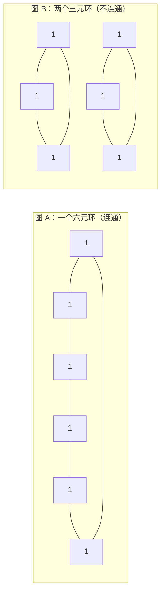
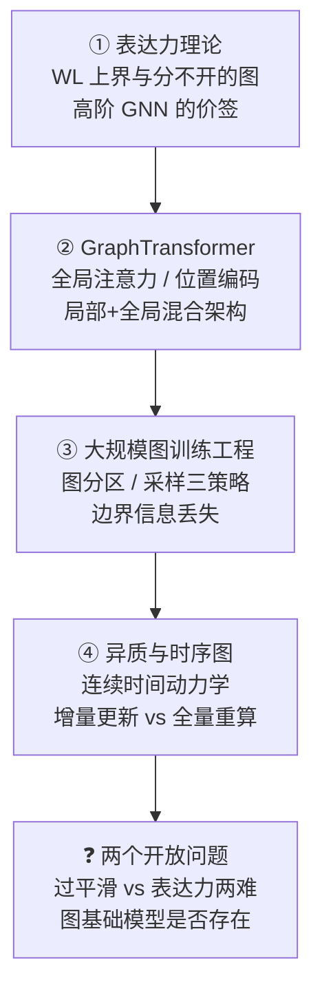
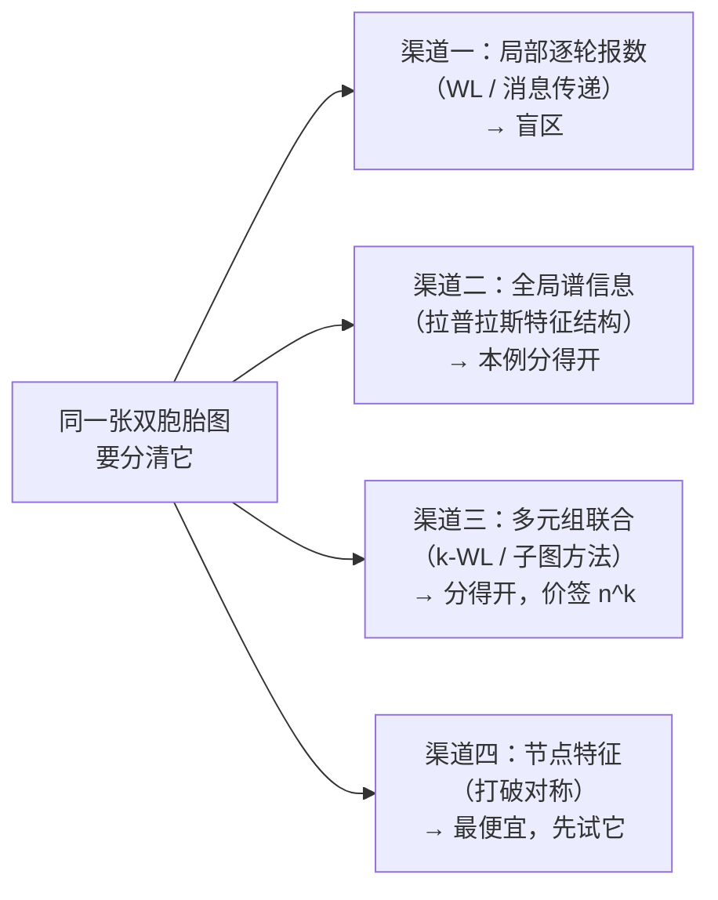
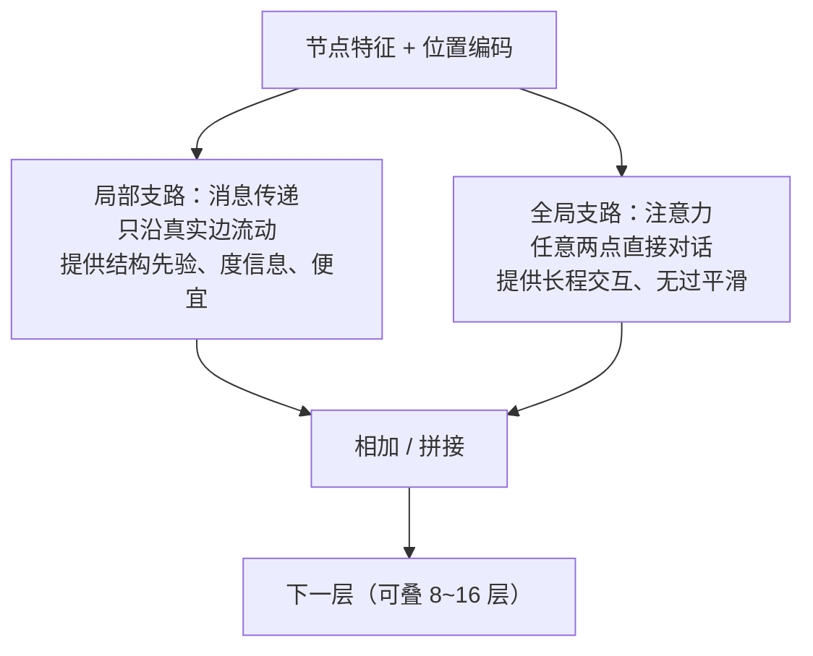
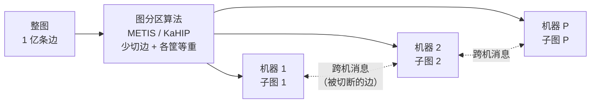
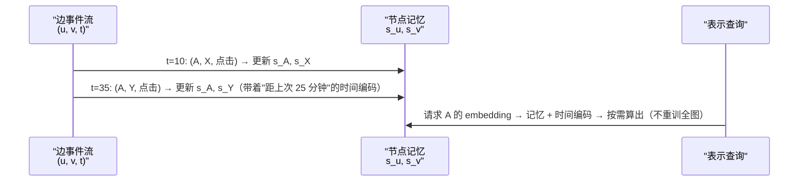

# 进阶专题：GNN 深水区

> **一句话理解**：前两页讲"消息传递怎么跑"，本页讲它**跑不到的地方**——表达力的理论天花板（WL 上界与它分不开的"双胞胎图"）、看不远的问题与 GraphTransformer 的药方（位置编码 + 局部/全局混合架构）、亿级图训练的工程三大件（分区、采样、边界丢失），以及边带时间戳的时序图——最后回到两个没有答案的问题：过平滑与表达力的两难、图基础模型到底存不存在。

[⬆️ 返回总目录](../../../README.md) · [⬆️ 返回本篇](../README.md) · [⬅️ 返回本章目录](./README.md)

| 属性 | 说明 |
|------|------|
| 难度 | ⭐⭐⭐⭐（高阶） |
| 所属分支 | 图 |
| 前置知识 | [图数据入门](./01-图数据入门.md)（WL 测试、幂律）；[GNN 核心模型](./02-GNN核心模型.md)（消息传递、过平滑、邻居爆炸） |

---

## 📌 这一节解决什么问题

第 2 页收尾时留了三笔账：**层数被过平滑锁死在 2~3 层**（看不远）、**表达能力有 WL 这块理论天花板**（分不开）、**亿级图训练靠采样苟活**（算得省但算得偏）。本页把这三笔账逐笔展开，再补两块前面没碰的地盘：

1. **理论侧：GNN 到底能分清哪些图、分不清哪些图？** 第 1 页说过"消息传递 GNN 的表达能力上界是 WL 测试"——这个上界怎么来的？分不开的图长什么样？要分清它们得付出什么代价？这是"选型之前先知道天花板在哪"的问题。
2. **架构侧：看不远怎么办？** 2~3 层的感受野对"远程依赖"任务（整图级别的结构判断、相距很远的两个节点的互动）远远不够。全局注意力（GraphTransformer 路线）看起来是解药，但它有自己的账单——$O(n^2)$ 的配对成本和"没有位置信息就等于没看图"的结构缺失。
3. **工程侧：亿级图到底怎么训？** 第 2 页只讲了邻居采样一个选项。真实的工具箱里还有子图采样、层采样、图分区全图训练——每种采样改写的都是"你在估计什么"，选错的症状各不相同；还有一个所有小批量训练共有的暗伤：**边界信息丢失**。
4. **数据形态侧：图是活的。** 前面所有内容都默认"一张静态快照图"，真实业务里图每天在长新边——时序 GNN 怎么处理"边带时间戳"的连续流？动态图的增量更新与全量重算怎么权衡？
5. **视角侧：两个开放问题。** 过平滑与表达力的两难为什么是结构性的（不是"再想想"就能解的）？"图基础模型"（Graph Foundation Model）为什么至今没有出现、甚至可能不成立？

这一页是给"想真正吃透 GNN 边界"的读者的地图：每节都回答"它解决前者的什么痛点、又引入了什么新痛点"。阅读建议：①②偏理论值得慢读，③④偏工程可按需跳读，开放问题压轴。

## 🌱 通俗理解

把整页想象成一家快递公司的四场改革：

- **表达力理论 = 车库里的车到底能去哪**：WL 测试像一张"通行规则表"——规则表上写去不了的地方（双胞胎小区），你的车再贵也开不进去；想让车去更多地方，得换更高阶的驾照（高阶 GNN），但驾照越高考费越贵（计算成本按节点数的幂次涨）；
- **GraphTransformer = 总部的瞭望塔**：快递员（消息传递）只能挨家挨户问路，两三跳就累趴（过平滑）；瞭望塔（全局注意力）一眼看全城——但塔建得越高越贵（$n^2$ 的视野费），而且塔上的人如果不带街区地图（位置编码），看到的全城就是一团没有差别的点；
- **大规模训练 = 分仓与拣货**：货太多一间仓库放不下，就得分仓（图分区）——分仓的原则是"跨仓调货最少（少切边）+ 每个仓的活一样多（负载均衡）"；拣货不可能每次全仓翻一遍，就按单抽样（采样）——按邻居抽、按整片区域抽、还是按层抽，漏件率和错件率不一样（边界信息丢失就是"拣货单边缘的包裹信息不全"）；
- **时序图 = 订单流水不是库存快照**：业务方关心的不是"今天仓里有什么"（静态快照），而是"订单一条条来时货怎么流动"（连续时间动力学）——每个快递员脑子里得有本"上次见这个客户是什么时候"的备忘录（记忆模块 + 时间编码）；
- **开放问题 = 车队的两个终极疑问**：能不能造一辆什么路都能开的车（过平滑与表达力两难）？以及要不要把全国的货都并进一张网来调度（图基础模型）——两个问题至今没有公认答案。

## 📋 举个例子

**GNN 天生分不开的"双胞胎图"：一个六元环 vs 两个三元环。** 下面两张图都是 6 个节点、每个节点恰好 2 个邻居（2-正则图），都没有节点特征：



在第 1 页的 WL"报数对暗号"规则下逐轮跑（初始标签全为 1）：

| 轮次 | 图 A 每个节点 | 图 B 每个节点 | 两图的标签直方图 |
|------|--------------|--------------|------------------|
| 第 0 轮 | 1 | 1 | 都是"6 个 1"——相同 |
| 第 1 轮 | 1 + {1, 1} → 新标签 X | 1 + {1, 1} → 新标签 X | 都是"6 个 X"——相同 |
| 第 2 轮 | X + {X, X} → Y | X + {X, X} → Y | 都是"6 个 Y"——相同 |
| 第 k 轮 | 永远全体同标签 | 永远全体同标签 | **永远相同** |

WL 测试的结论是"无法区分"（直方图永远一致，它只能宣布"大概率同构"）——但这两张图**明明白白不同构**：图 A 是连通的（任意两点有路），图 B 是断成两截的；图 B 有两个三角形，图 A 一个都没有。

**消息传递 GNN 的命运一模一样**：没有节点特征时，每个节点的初始向量相同、邻居都是"2 个和我相同的节点"——不管聚合函数多聪明、层数多深，每层算完所有节点的向量仍然相同；整图读出（sum/mean）后两张图得到**完全相同的图向量**。图分类器给它俩打同一个分。而这两张图若表示化学结构（六元环 vs 两个三元环），化学性质天差地别——环的张力、稳定性、反应活性全不同。

**换个尺子立刻分得开**：算两张图的拉普拉斯特征值（图做"傅里叶分解"得到的频率谱，第 2 页过平滑推导里的老朋友 $L = D - A$）——图 A 的谱是 $\{0, 1, 1, 3, 3, 4\}$，图 B 的谱是 $\{0, 0, 3, 3, 3, 3\}$，**一眼不同**。这个"WL 分不开、谱分得开"的反差，正是后面 GraphTransformer 用拉普拉斯特征向量做位置编码的伏笔（动手环节会亲手验证）。

<details>
<summary>📊 展开完整算例：为什么"报数"在这类图上永远失效</summary>

失效的根源是**对称性**。WL 每轮的规则是"我 + 我邻居们的标签多重集合 → 新标签"，全体节点的标签要分化，前提是**邻居多重集合先出现差异**。两类图把这个前提掐死在起点：

1. **起点同质**：初始标签全 1，谁也不比谁特殊；
2. **保持同质**：每个节点都恰好有 2 个邻居、邻居标签全同 → 下一轮全体拿到同一个新标签——**同质是自我延续的**；
3. 不止这两个图：**一切正则图**（所有节点同度，如网格、晶格、许多游戏棋盘图）都满足"起点同质 + 保持同质"， WL 与无特征消息传递 GNN 在整个正则图家族上集体失明。这不是 WL 写得差，是"局部报数"这种信息渠道**原则上拿不到全局信息**——"连通与否""有几个三角形"这类需要全局视角的性质，靠逐轮局部聚合永远拼不出来。

要打破对称只有三条路：① 给节点加特征（起点不同质）；② 上高阶方法（一次看 k 个节点的联合结构，见下文表达力理论）；③ 用谱/全局信息（本例的拉普拉斯谱，GraphTransformer 的位置编码同源）。

</details>

## 🧠 核心原理

### 整体流程：本页知识地图



### 逐步拆解

**① 表达力理论：WL 上界从哪来，怎么越过去。**

第 1 页给过结论：消息传递 GNN 的判别能力 ≤ WL 测试。现在把"为什么"讲透。观察消息传递一层的结构：

$$
h_v^{(k+1)} = \phi\Big(h_v^{(k)},\ \underset{u \in \mathcal{N}(v)}{\operatorname{AGG}}\big(h_u^{(k)}\big)\Big)
$$

> 👉 **人话**：节点的新向量，由"自己的旧向量"和"邻居旧向量的一个汇总"决定。注意**决定新向量的全部原料，就是这两个东西**——AGG 不看邻居的顺序（多重集合，Multiset）、不看图的全局。

上界定理的直觉论证就藏在这句话里（GIN 论文的核心观察）：如果两个节点在第 k 层的向量相同、且它们邻居向量的**多重集合**也相同，那第 k+1 层的向量必然还相同——**起点（初始特征）相同 + 每层保持相同，归纳到底就是永远相同**。而"邻居多重集合相同"正是 WL 报数里"邻居标签集合相同"的可微版本——WL 分不开的，GNN 也分不开。证明思路一句话：**GNN 是 WL 的"连续松弛"，松弛不会产生新的判别力**。

<details>
<summary>🧮 展开看：归纳论证三步走，以及"到达上界"的 GIN</summary>

**第一步（对应关系）**：WL 第 k 轮后标签相同的两个节点，在"初始特征相同"的前提下，任何消息传递 GNN 第 k 层的向量也相同——对 k 归纳：k=0 时成立（初始特征相同）；若第 k 层成立，则两节点的邻居向量多重集合也逐点相同（邻居们同样被归纳假设绑在一起），代入同一组 $\phi$、AGG 函数，输出仍相同。

**第二步（上界成立）**：于是 GNN 能区分的节点对， WL 都能区分——GNN 的判别力不超过 WL，上界得证。

**第三步（能不能摸到上界）**：取决于 AGG 会不会"把不同的多重集合压成同一个向量"。均值聚合（GCN/GraphSAGE 的 mean）做不到：多重集合 $\{1, 1\}$ 与 $\{1\}$ 的均值都是 1——**多重性丢了**；max 聚合更狠：$\{1, 2, 2\}$ 与 $\{1, 2\}$ 的 max 都是 2。**求和（sum）保多重性**：$\{1,1\}$ 求和是 2、$\{1\}$ 求和是 1，分得开。GIN（Graph Isomorphism Network）因此用"求和 + MLP"：

$$
h_v^{(k+1)} = \mathrm{MLP}^{(k)}\Big(\big(1 + \epsilon^{(k)}\big)\, h_v^{(k)} + \sum_{u \in \mathcal{N}(v)} h_u^{(k)}\Big)
$$

> 👉 **人话**：求和一字不差地记住"每种邻居有几个"（多重集合的完整指纹），MLP 再做可学习的变换——数学上可证这样的聚合对可数多重集合是**单射**（不同的多重集合必得不同的向量），于是 GIN 的判别力**恰好等于** WL 测试：上界被摸到，但没有被超过。

</details>

**三种聚合的盲区实算**（"求和"的特殊地位从哪来）——拿两对邻居多重集合（Multiset）当考题：

| 邻居多重集合对 | 均值聚合 | 最大聚合 | 求和聚合 |
|---|---|---|---|
| {1} vs {1, 1} | 1 = 1（分不开） | 1 = 1（分不开） | 1 ≠ 2（**分开**） |
| {1, 2} vs {1, 2, 2} | 1.5 ≠ 2（分开） | 2 = 2（分不开） | 3 ≠ 5（**分开**） |
| {1, 1, 2} vs {1, 2, 2} | 4/3 ≠ 5/3（分开） | 2 = 2（分不开） | 4 ≠ 5（**分开**） |

> 👉 **人话**：均值丢"多重性"（一个邻居和两个同样邻居分不开）、最大丢"数量"（多一个重复值毫无痕迹），只有求和把"每种邻居有几个"一字不差全记住——GIN 选求和不是口味偏好，是"单射"的数学要求。

**实践检验：你的任务离天花板有多远**（对照第 1 页深度标准的三情况）：

- **正常情况（离天花板很远）**：节点带丰富特征——WL 同构但特征不同的节点第一层就被分开，上界几乎无感，放心用主流 GNN；
- **极端情况（贴着天花板）**：无特征或弱特征 + 结构规则（棋盘、网格、周期性分子）——对称性让所有节点表示恒同，症状是全图 embedding 高度相似、训练曲线躺平；
- **失败情况（结构性盲区）**：任务标签本身依赖 WL 盲区里的量（环数、路径数、子图匹配数）——特征救不了（特征与标签无关时）、加深也没用（对称性自我延续），只能换信息渠道：高阶方法、谱信息或全局注意力。

**上界定理的边界条件：它管住的是谁。** 上界只约束"聚合邻居多重集合"这一类模型（术语叫 MPNN 家族）——凡是不走"邻居集合聚合"这条路的方法都不受它管辖：谱方法（直接用拉普拉斯的特征结构）、随机游走结构编码、子图/高阶方法、全局注意力（配结构编码）。这解释了本章所有"越界"动作的共同形态：**不是把聚合函数写得更聪明，而是换一条信息渠道**（局部的换成全局的、单点的换成多元组的、逐轮的换成谱的）。反过来，只要你的模型仍是"每层收邻居、聚合成消息"，天花板就还在原处。



> 👉 **人话**：分不开不是"模型笨"，是"渠道瞎"——四条渠道里，先试最便宜的特征，不行再换渠道，别在一条渠道里死磕深度。

**哪些图 GNN 天生分不开**（上界之内的盲区地图）：

| 盲区家族 | 直觉描述 | 为什么 WL/消息传递失明 |
|----------|---------|----------------------|
| 正则图（所有节点同度） | 六元环 vs 两个三元环、网格、许多棋盘图 | 起点同质 + 邻域同质 → 标签/向量永远不分化（上例） |
| 三角形/环计数 | "这分子里有几个苯环"这类化学问题 | 三角形是"三点联合"的性质，逐点报数拼不出三点关系 |
| 细粒度结构差异 | 计数类问题：路径数、子图匹配数 | WL 的"多重集合哈希"对计数天然不敏感（多重集合已抹平很多组合细节） |
| 注意：不是所有"分不开"都是 WL 盲区 | 判别信息相距 5~10 跳的普通图 | WL 理论上分得开（轮数够多），但过平滑不许你叠那么深——**那是第 2 页的墙，别错开药** |

**高阶 GNN（Higher-order GNN）：越界的两条路，价签都是幂次。** 想分清 1-WL 的盲区，路线有二：

- **k-WL 路线（升级报数单位）**：报数的单位从"单节点"换成"k 个节点的元组"——每个 k 元组收集"把其中任意一维换成邻居后"的 k 组元组，拼在一起换新标签。k=2 时"三点联合"的信息进入标签（三角形可数，恰好补上六元环 vs 双三角这类盲区）。代价：k 元组共 $n^k$ 个、每个的"邻居"又随 k 线性增多——**复杂度 $O(n^k)$ 起跳**，k=3 在几千节点的图上已经很重；
- **子图路线（多看几张图）**：不升级报数单位，改"视野"——为每个节点提取"以它为中心的子图集合"，先在子图内做消息传递，再对子图表示的**分布**做聚合。判别力严格强于 1-WL、理论上不超过 3-WL，代价是"子图数量 × 子图大小"的计算量。

| 方法 | 判别力 | 复杂度 | 工业落点 |
|------|--------|--------|---------|
| 消息传递 GNN（GIN 类） | ≤ 1-WL | $O(\lvert E \rvert)$ | 亿级节点任务的主力 |
| k-WL / k-GNN（k ≥ 2） | ≥ k-WL | $O(n^k)$ | 小图研究（分子、组合优化） |
| 子图 GNN（ESAN 一类） | 介于 1-WL 与 3-WL 之间 | 子图数 × 子图大小 | 分子性质预测 |

> 👉 **人话**：更贵更准的取舍——高阶方法在论文里证明"能分开"，工业界大多付不起账单；真实的用法是**小图上精打细算地用、大图上老老实实回到 1-WL 家族**。

**② GraphTransformer 与长程依赖：看不远的三种药，各自的账单。**

先说病：消息传递的感受野 = 层数（第 2 页），而过平滑把层数锁死在 2~3 层——于是"远程依赖"（图分类里相距很远的两个官能团、需要全局结构判断的任务）成了纯 MPNN 的结构性短板。药方三条：

**药方一：全局注意力（GraphTransformer 路线）**。让每个节点直接对所有节点算注意力（[第 7 章 Transformer](../07-自然语言处理与LLM/02-Transformer与注意力机制.md) 的注意力原样搬到图上），信息一步直达，深度不再被跳数绑架，过平滑的主病消失。账单两张：

$$
\text{注意力开销} = O(n^2 d)\ \text{vs 消息传递} = O(|E|\, d)
$$

> 👉 **人话**：消息传递只沿真实存在的边走（边数 $|E|$ 远小于 $n^2$），全局注意力把图补成完全图——人人对话人人。10 万节点的图就有百亿对关系，显存与算力直接按平方收费；所以 GraphTransformer 主场是**中小尺寸的图级任务**（分子、程序图），亿级节点分类它上不了牌桌。

第二张账单更隐蔽：**注意力本身是置换不变的——不给位置/结构信息，GraphTransformer 看到的不是图，是一个"点的集合"**（等价于集合注意力），图的拓扑信息全程没进模型。所以位置/结构编码（Positional / Structural Encoding, PE/SE）不是可选项，是 GraphTransformer 的**入场券**：

| 编码方式 | 一句话原理 | 备注 |
|----------|-----------|------|
| **拉普拉斯特征向量编码** | 把图拉普拉斯矩阵 $L$ 做特征分解，取底部 k 个特征向量，每个节点拿到的 k 维向量就是它的"频率坐标"——结构位置相似的节点坐标相似 | 相当于给每个节点发一张"我是全图第几号频率成分"的身份证，与第 2 页过平滑的频域推导同源；坑见下折页 |
| 随机游走编码（RWSE） | 每个节点算"随机游走 k 步后回到自己/到达各邻居"的分布，当结构指纹 | 只花线性代价，工业上常用；只反映局部 |
| 最短路径/空间编码（Graphormer 一系） | 两点间的最短路径距离直接做成**注意力的偏置项**：距离近的对话加成 | 把"图结构"注入注意力的打分而不是注入输入，与 PE 互补 |

<details>
<summary>🧮 展开看：拉普拉斯编码的"符号翻转"与"简并"两个坑</summary>

用特征向量当坐标有两个数学上的坑，工程上必须处理（都是经验参考的常规操作）：

1. **符号不定**：特征向量 $u$ 与 $-u$ 都是同一特征值的特征向量——同一张图今天算出 $u$、明天算出 $-u$，节点坐标全体翻符号，下游网络认为是两张不同的图。常规解法：训练时随机翻转符号做数据增广，逼网络对符号不变；
2. **简并子空间旋转**：特征值相同的一组特征向量（如六元环的两个特征值 1）张成的子空间里，基可以任意旋转——坐标在子空间内不稳定。常规解法：加微小扰动打破对称、或对特征值做排序/筛选只取稳定的底部几个。

> 👉 **人话**：拉普拉斯编码像"用楼的平面图当门牌号"——门牌唯一，但图纸打印时整栋楼可能镜像翻转（符号）、同一层的房间编号方案可以随便换（简并）。不把这两种"打印随机性"处理掉，模型每次看到的都是"新楼"。

</details>

**什么任务真的需要"看得远"**（先诊断再开药）：长程依赖任务的画像很一致——**判别信息集中在相距多跳的两个局部**。典型如：分子图里两个官能团的组合效应（中间隔着长链）、程序图里变量定义与使用的远程数据流、场景图里"整体布局"级别的语义（一只动物在不在车里，取决于相距很远的两组节点）。诊断方法朴素有效：随机打乱远端子图的标签相关性——若任务性能只受 1~2 跳邻域影响，纯 MPNN 就够，不必为"长程"两个字买单。

**编码注入位置的两派：进输入，还是进打分。** 表格里的拉普拉斯/RWSE 编码走"进输入"路线（拼在节点特征上，模型自己决定怎么用）；Graphormer 一系走"进注意力"路线——结构信息不改节点向量，直接改成对的注意力打分：**空间编码**（两节点最短路径距离 → 这一对注意力的加成偏置，离得近说话加成高）、**边编码**（沿最短路径的边特征逐条打进偏置——化学键类型这样进模型）、**中心性编码**（节点的出入度当特征，把"社牛/壁花"身份直接亮出来，呼应第 1 页的幂律）。两派可以并用——GraphGPS 的配方就同时吃两边。

> 👉 **人话**：一派把"家住哪"写进名片（输入特征），一派把"两家离多远"写进通话资费表（注意力偏置）——目的相同：让天生不认顺序的注意力拿到结构信息。

<details>
<summary>🧮 展开看：全局注意力叠几十层，为什么反而不糊？</summary>

两个结构性理由，恰好对应第 2 页过平滑推导的两个要件：

其一，**MPNN 的过平滑来自"固定算子的幂"**：邻居平均对应 $D^{-1}A$ 这个**与输入无关的固定矩阵**，叠 K 层就是 $(I - D^{-1}L)^K$——同一种低通滤波被机械地重复 K 次，高频必然磨光。而注意力的"聚合矩阵"每层都由当前表示**重新打分**生成（softmax(QK/√d)），是输入依赖的动态算子——上一层把哪些节点拉近，下一层的注意力图随之改变，不存在"同一个平滑算子被反复施加"的机制。

其二，**残差流的结构差异**：Transformer block 的标准形态是 $x + f(x)$——每层只往主干上"增量写入"，原始信号永远有旁路（这与第 2 页用残差缓解过平滑是同一原理，但 Transformer 把它做成了默认结构，而 MPNN 的每个经典实现都要显式补）。

> 👉 **人话**：邻居平均像"全班每节课都按同一张固定座位表互相 averaging"——几节课后全班成绩趋同；注意力像"每节课自由组队"——组队方式随内容变，不存在把所有人越搅越匀的固定流程。这就是混合架构敢把层数从 2~3 解放到 8~16 的底气。

</details>

**药方二与主流答案：混合架构（局部 GNN + 全局注意力）。** 纯 MPNN 看不远、纯 GraphTransformer 又贵又缺结构先验——主流折中（GraphGPS 类）把两者**并联**在同一层里：



为什么这个配方成了主流折中（而非任何一端）：**局部支路**保留稀疏计算与结构归纳偏置（哪些边存在、邻居的度——这些是免费且珍贵的先验，纯注意力要花钱重学）；**全局支路**保证长程信息一步可达（每层都有全图视野，不需要"传 k 跳才到"）；两支互补还互相纠偏——注意力不至于在无结构信息下瞎聊，消息传递不至于困在两跳视野里。层数也因此解放：全局支路不靠逐跳传播，十层以上不再自动触发过平滑（注意力 + 残差流的功劳，同 [第 7 章](../07-自然语言处理与LLM/02-Transformer与注意力机制.md)的深 Transformer）。在长程基准（Long-Range Graph Benchmark 一类）上，混合架构稳定超过纯 MPNN、成本远低于纯 GraphTransformer——**"各取所长"不是口号，是账单算出来的**。

一个批判性注脚：**基准设计决定结论**。在引文图这类经典基准上，判别信息大多落在 1~2 跳内，MPNN 与 GraphTransformer 的差距小到不值得为注意力买单——这也是"GT 没用"论调的数据来源；长程基准刻意把判别信息放到相距十几跳的两端，差距才拉开。所以先诊断（上文"什么任务真的需要看得远"），再看排行榜——**在错误基准上验证架构，等于用体重秤量身高**。

<details>
<summary>🧮 展开看：混合架构的两种接线——并联与串联</summary>

**并联**（GraphGPS 的选择）：同一层里 MPNN 与注意力**同时**吃输入，输出相加/拼接——两支梯度独立、消融实验干净（拆掉一支立刻能量化另一支的贡献）；缺点是两支都只能吃到"上一层"的原始表示。**串联**：先 MPNN 后注意力（或反之）——注意力吃到的已经是"被局部结构加工过"的表示，信号更浓；缺点是一旦串错顺序（比如注意力在前），长程信息还要再过局部层，可能又被"局部化"稀释。工程上并联是更常见的安全默认，串联留给有明确动机的设计（如先局部对齐、再全局交互的分子建模）。

</details>

**第三条药方别漏了：把"变换"与"传播"解耦。** 除了"叠深 MPNN"与"上全局注意力"，还有一条低调的路线：让神经网络只负责**特征变换**（可学习的部分浅层化），传播用**固定的迭代算子**完成——APPNP 一类用 PageRank 式的个性化传播（以初始预测为种子反复平滑 K 步），JK-Net 一类则把每层的输出全部拼起来给读出层（想用几跳的信息，让读出层自己选）。思想一句话：**变换会放大噪声与平滑效应，而固定传播的数学行为可控**——把危险的"叠层"换成安全的"迭代"，是工程上很划算的一档折中（缺点：可学习容量让渡了一部分，表达能力上限随之降低）。

**本节选型速查表**（把三条药方与后文约束合并成一张决策表，经验参考）：

| 你的任务 | 推荐架构 | 理由 |
|---------|---------|------|
| 亿级节点、判别信息在 1~2 跳内 | 纯 MPNN + 邻居采样（GraphSAGE 类） | 便宜、够用，全局视野纯属浪费 |
| 中小图（分子、程序图）、判别信息跨多跳 | 混合架构（GraphGPS 类） | 长程靠注意力、结构先验靠 MPNN |
| 小图 + 需要细粒度结构区分（环、子图计数） | 子图 GNN / 高阶方法 | 1-WL 盲区只有它们能进 |
| 带三维坐标的分子 | 3D 等变网络（02 页 SOTA 一句话） | 物理对称性是免费且必须尊重的先验 |
| 秒级事件流、新边不断到达 | 时序 GNN（TGN 类） | 快照重算跟不上节奏 |
| 静态图、新节点要秒级出向量 | 子图实时推理（GraphSAGE 的 inductive） | 现场抽 K 跳子图算，不等天级批处理 |

> 👉 **人话**：先问"判别信息住多远、图多大、节不节拍"，再选架构——架构没有排行榜，只有匹配题。

**③ 大规模图训练工程：分区、采样、边界丢失。**

前两页的邻居爆炸实算（$B(1+\bar d + \bar d^2)$）给出了"必须采样"的结论；本节补全工程全貌：**什么时候可以不采样**（分区全图训练）、**采样不止一种**（三种策略各自的"估计对象"不同）、**采样的共同暗伤**（边界信息丢失）。

**图分区（Graph Partitioning）：全图训练的前置手术。** 单机放不下时，把图切成 P 块分给 P 台机器，每台对自己的节点做前向，跨块的消息通过网络传递。分区的双目标：

$$
\min \sum_{i \ne j} \operatorname{cut}(A_i, A_j) \quad \text{s.t.} \quad |A_1| \approx |A_2| \approx \cdots \approx |A_P|
$$

> 👉 **人话**：刀口要**少切边**（被切断的边就是训练时的跨机通信，通信是分布式训练的头号瓶颈），切完**各筐一样重**（负载不均衡时最快的机器也得等最慢的，算力白买）。两个目标经常打架——切边最少往往切出"一大块 + 几小块"的偏秤结果。工业标准工具是 METIS/KaHIP 一类的多层划分算法；幂律图是分区噩梦：大 V 的百万邻居必然横跨所有机器，幂律社交图的切边比例常见在 10%~50% 之间、随机块数上升（经验参考）。**分区全图训练 vs 采样小批量的选择**：图能塞进集群内存（十亿边内、机器够多）时，分区全图训练避免采样偏差、收敛更稳；再大或机器紧，回到采样路线。

**切边账实算**：1 亿条边的社交图切成 16 块，切边率 20%（幂律图的常见量级，经验参考）——每一步前向就有约 2000 万条边的信息要跨机传递；分区数越多切边率越高（可到 30%~50%，经验参考），**分区全图训练的吞吐有一半以上耗在跨机通信上是常态**。负载失衡同样常见：幂律头部的大 V 若落在某台机器，它上百万的邻居大半在别家——这台机器的计算量被单点绑架，其余机器空等（又是幂律，第 1 页的脾气贯穿全章）。



分区全图训练 vs 采样小批量的决策表：

| 条件 | 分区全图训练 | 采样小批量 |
|------|-------------|-----------|
| 图规模 | 十亿边内且集群内存足够 | 任意规模（单机也能跑） |
| 估计质量 | 无采样偏差，梯度是全图的 | 有采样方差（邻居采样）或分布偏差（子图采样） |
| 每步成本 | 贵（全图前向 + 跨机通信） | 便宜（只碰采样到的子图） |
| 工程复杂度 | 重：分区、通信、参数同步 | 轻：PyG 的 Loader 一把梭 |
| 典型用户 | 大厂全图训练管道 | 绝大多数团队 |

**分布式全图训练里，切的不只是图。** [第 4 章数据并行](../../3-深度学习/04-深度学习基础/04-分布式训练与模型规模.md)里每张卡看不同样本、共用同一套参数；图的全图训练多了一层麻烦——**节点 embedding 表本身就放不进单机**，于是要三样一起切：图（邻接关系按节点分片）、参数（GNN 层的权重可以全卡复制，量不大）、embedding 表（按节点哈希分片到各机）。每一步训练的通信 = 被切边的跨机消息 + 梯度同步 + embedding 查表的远程读取，三项都在跟分区质量结账——所以 METIS 切得好不好，直接换算成 GPU 利用率。这也是采样式训练在中小团队流行的深层原因：**单机采样避开"三切"的全部复杂度，用方差换工程简单**。

**训练-推理一致性清单**（大图 GNN 事故的高发区，逐条自查，经验参考）：

- 采样一致：训练的每层采样数（fanout）与推理的 fanout 一致（或推理用全邻居、训练也定期全邻居校准）；
- 特征版本一致：训练用的节点特征快照与推理服务读的特征管道同版本；
- 时间一致：训练图的建边截止时间与推理时刻的"图状态"对齐（时序漂移是效果衰减的头号静默原因）；
- 坐标系一致：增量更新的向量与全量重算的向量不混库（版本号绑定、原子切换）。

> 👉 **人话**：四条全对齐，离线指标才可信；任何一条漂了，"线上效果比离线差一截"的锅就轮不到模型背。这条清单与 99 页"离线在线两套坐标系"的坑、第 8 章[双塔](../08-推荐系统/03-双塔模型与向量召回.md)的向量版本管理是同一门课的三次点名。

**采样策略对比：三种"省"法，省的地方不一样。**

| 策略 | 代表 | 怎么采 | 改写的"估计对象" | 优点 | 代价 |
|------|------|--------|------------------|------|------|
| 邻居采样 | GraphSAGE / NeighborLoader | 每个目标节点每层固定采 fanout 个邻居 | 单次前向估计的是"随机邻域聚合"（期望意义） | 扩展性最好（亿级节点）、实现最简单 | 采样方差大（同一节点两次前向结果不同）；高度节点信息丢失 |
| 子图采样 | Cluster-GCN（分区子图）/ GraphSAINT（随机游走子图） | 先采一整块子图，在子图内做"全邻居"训练 | 估计的是"子图上的梯度"，再修正回全图 | 批内信息完整（子图内不丢边）、方差小、可大 batch | 子图与全图分布有偏（GraphSAINT 用修正系数纠）；批间差异大 |
| 层采样 | FastGCN / LADIES | 逐层按"重要性"抽节点（不是抽邻居） | 每层的聚合在"重要节点子集"上进行 | 理论上控住了逐层方差 | 重要性分数难算准，实践被前两者挤压，现在用得少 |

> 👉 **人话**：邻居采样是"每个包裹都抽检几件"（便宜但每次看到的不一样）；子图采样是"整箱整箱地抽"（每次看得全，但抽的箱子未必代表全仓）；层采样是"每一层货架各抽一排"（听着均衡，实际排与排的组合最容易失真）。工程主流是前两者的组合：邻居采样打底、热点区域用子图批量。

<details>
<summary>🧮 展开看：子图采样的分布偏差怎么修正（GraphSAINT 的核心）</summary>

子图采样的隐患是"训练分布 ≠ 全图分布"：随机游走采出的子图天然偏向高密度区域（游走在热门社区里转不出来），直接按子图内的边算损失，等于给密集区域隐式加权。GraphSAINT 的修正思路是**逆概率重加权**：统计每个节点/边被采进子图的频率，出现得越频繁的样本在损失里权重越小——把"采样偏好"除回去，使期望意义上回到全图梯度。

> 👉 **人话**：抽签抽得不匀（热闹区域总被抽中），就在计票时给"常客"降权——票数除以出场率。这与[第 8 章](../08-推荐系统/02-协同过滤与矩阵分解.md)纠曝光偏差的 IPS 加权、[第 11 章](../11-因果推断/02-因果推断方法工具箱.md)用倾向得分修正"谁被处理"，是同一套"重要性加权"思想在不同领域的三次落地。

顺带一个工程红利：子图采样产出的批是**规整的稠密张量**（批内全邻居、无动态邻居查表），GPU 吞吐比邻居采样的不规则访存稳定得多——大 batch 训练时这点常反过来成为选它的理由。

</details>

**边界信息丢失：小批量训练的共同暗伤。** 算一个 2 层小批量的"圈层账"：512 个目标节点、每层采 15 个邻居，第 2 跳要碰约 $512 \times 15 = 7680$ 个节点——**这七千多个外圈节点是"被迫营业"的**：为了算目标节点，需要它们的向量，但它们自己的邻居（第 3 跳）被预算砍掉了，它们的向量是用**残缺邻域**算出来的。于是传给目标节点的消息，是"基于残缺表示的二手信息"——层数越深，最外圈越大、残缺越重（k 层时最外圈节点数占批内节点的绝对大头）。圈层账列成表（fanout=15 的均匀采样近似；幂律图下更糟——撞上大 V 的圈层直接膨胀）：

| 网络深度 | 第 0 圈（目标） | 第 1 圈 | 第 2 圈 | 最外圈的遭遇 |
|---------|----------------|---------|---------|--------------|
| 2 层 | 512 个目标节点 | 512×15 ≈ 7680 个 | —— | 第 1 圈的邻居（第 2 跳）被砍：表示残缺一跳 |
| 3 层 | 512 个 | ≈ 7680 个 | ≈ 11.5 万个 | 第 2 圈的邻居全被砍：**11.5 万个最外圈节点全体残缺**，而它们正是第 1 圈表示的原料 |

症状与诊断：训练损失正常但全图推理（不采样）时效果反而**下降**——训练时模型学的是"残缺邻域的统计规律"，推理时看到的是完整邻域，分布不一致（与第 2 页"训练怎么采、推理就怎么采"的纪律是同一件事的两面）。缓解三板斧（经验参考）：外圈多采一跳（fanout 从内到外递增）；历史嵌入缓存（外圈节点用上次算好的向量，不再现算）；大子图重边训练（Cluster-GCN 路线，牺牲批次数换完整邻域）。

**fanout 的方差-成本账**（采样超参不是拍脑袋）：fanout（每层采几个邻居）是"方差 vs 成本"的直接旋钮——fanout 太小（如 2~5），同一节点两次前向的表示抖动大，训练噪声淹没梯度信号、收敛慢甚至不收敛；fanout 太大（如 50+），单批要碰的节点数按 fanout 的层数次幂膨胀，显存与时间立刻见红。工业常见起点是 10~25、外层多于内层（如 [25, 10] 表示第一跳 25 个、第二跳 10 个——外圈要喂的目标多，多采一点摊薄边界丢失；均为经验参考）。幂律图的额外操作：高度节点按度分层加权采样（大 V 的邻居按重要度抽，壁花节点全收）——第 1 页的"防热点"纪律在采样层的落地。

**④ 异质与时序图：图的两种"活化"。**

**异质图（Heterogeneous Graph）的深水不在模型在 schema。** 第 2 页的 R-GCN 给每种关系配独立权重已经解决了"多种边怎么聚合"；真正难的是**建模前**的事：哪些实体类型进图、哪些关系建边（元路径设计——比如"用户—商品—品类—商品"这条路径连出的两个商品，比"用户—商品"的共现更有信息量）、几十种关系里的长尾关系（出现次数占比极小的关系）怎么防止欠训（关系分组共享权重：把语义相近的稀有关系挂到同一套权重上）。异质图的采样还多一层平衡问题：每个节点的邻居分属多种类型（账户的邻居一半是设备、一半是地址），R-GCN 式"按关系分别采样"要给每种类型配额，否则采出来全是占大头的热门类型，稀有关系的信号被饿死。一句话：**异质图的效果上限由 schema 设计与采样配额决定，模型只负责兑现**。

**时序 GNN（Temporal GNN）：边带时间戳的连续时间动力学。** 前面所有方法都吃"静态快照图"；真实业务是**事件流**：时刻 $t_1$ 用户 A 点了商品 X，$t_2$ 退款，$t_3$ 又点了 Y……连续时间动态图（Continuous-Time Dynamic Graph, CTDG）的建模路线（TGN 一类）一句话：**节点带一块"记忆"（Memory Module，GRU 式状态），每来一条带时间戳的边事件就更新两端节点的记忆；要节点表示时，按需把记忆 + 时间编码（Time Encoding，"这事发生在多久之前"编码成向量）读出成 embedding**。



> 👉 **人话**：静态图模型是"每天拍一张合照再分析"；时序 GNN 是给每个节点配一本流水账——事件来了记一笔（顺带记下"多久以前"），要用的时候翻账本现算。新边到达不需要重训，天然增量。

TGN 的四个零件（与静态 GNN 对照着记）：

| 零件 | 干什么 | 静态 GNN 里对应什么 |
|------|--------|-------------------|
| 记忆 $s_v$（Memory Module） | 每节点一块随事件流更新的状态（GRU 式读写） | 无对应——静态 GNN 的"状态"是整图重算出的 embedding |
| 消息函数 | 一条事件 (u, v, t) 生成给两端节点的更新消息 | 消息传递里的 message |
| 时间编码（Time Encoding） | 把"距当前多久"编码成向量，拼进消息与查询 | 无对应——静态图没有时间 |
| 按需读出 | 查询时才把记忆 + 时间编码算成 embedding，不维护常驻向量 | 常驻 embedding 表（天级批量重算） |

时序建模范式之争（快照 vs 事件流），先于模型选型：

| | 快照建模（Snapshot） | 事件流建模（CTDG） |
|--|---------------------|-------------------|
| 数据单位 | 按周期切块的静态图（每天一张） | 一条条带时间戳的交互事件 |
| 时间表达 | 隐含（图的第 k 版 vs 第 k+1 版，模型看不见"几点"） | 显式（时间编码进模型） |
| 新边处理 | 等下一个快照、整图重算 | 实时更新两端节点的记忆 |
| 适合 | 天级节奏的业务（离线特征、回溯分析、报表） | 秒级节奏的业务（实时风控、会话内推荐） |
| 坑 | 快照内的时间顺序全部丢失（上午点和下午点一样对待） | 记忆的误差累积、乱序事件处理 |

**动态图更新的工程权衡：增量更新 vs 全量重算。** 图每天在长新边，两套姿势各带一个诅咒：

| | 全量重算（天级批处理） | 增量更新（实时/准实时） |
|--|----------------------|------------------------|
| 做法 | 新图进来，全部 embedding 重新算一遍 | 只重算受影响的 K 跳邻域（或靠 TGN 记忆前向） |
| 优点 | 无误差累积、结果自洽 | 快、便宜、实时 |
| 代价 | 贵、滞后（新节点等到明天才有向量） | 误差累积（局部更新与全图最优解的偏差越滚越大）、新旧向量不同坐标系 |
| 工程姿势 | 与离线向量库绑定、版本原子切换 | 与实时链路绑定、定期用全量重算"对表" |

工业常态是**混合**：存量走全量重算、增量走实时更新、定期对齐（与 99 页"两档混合 + 对齐刷新"是同一条纪律的两种表述；[第 8 章](../08-推荐系统/03-双塔模型与向量召回.md)的 embedding 刷新是同一个问题在推荐侧的版本）。

增量更新的误差从哪来，值得单独说透：局部重算只刷新受影响的节点，但**它们的邻居引用的还是上一轮坐标系的旧向量**——新向量是"照着旧地图画的"，每轮都带一点偏差；偏差不独立，会随更新轮次累积（第 N 轮的输入里含第 N−1 轮的偏差，误差复利）。工程上的"定期对表"（每隔 N 天全量重算一次、把坐标系整体拉回正轨）不是洁癖，是止损：N 的取值取决于业务对向量新鲜度的敏感度（风控常用天级、推荐常用小时到天级，经验参考）。

**真实事件流的两道暗坎：乱序与迟到。** 教科书假设事件按时间顺序到达，生产日志不是：消息队列重试、批任务补写、跨机房同步延迟，都会让 t=14:00 的事件晚于 t=14:05 的事件进模型。时序 GNN 的记忆更新原则上是"按事件时间重放"（乱序到达就先缓存、按时间戳排序再喂），否则"先看到未来再看到过去"会污染时间编码。工程上要维护**两个时钟**：事件时间（事情发生的时刻，模型用这个）与处理时间（数据到达的时刻，监控用这个）——两钟差距拉大就是管道积压的警报。这与流式计算（Flink 一类）的水位线（Watermark）机制是同一门课，图团队通常直接复用数据基础设施团队的成果。

## ❓ 开放问题

以下两个问题在 2026 年的今天仍在活跃争论——本节给的是地图与各方论点，不是答案。

1. **过平滑 vs 表达力的两难是结构性的**。把本页①和②合起来看：要表达力（看得远、分得清），路径都指向"更多层/更多交互"——层数加深撞过平滑，注意力加宽撞平方账单；要稳定，就得浅、就得局部——又回到看不远、分不清。把全章的缓解手段摆成一张"成本再分配表"看得最清楚：

   | 手段 | 治什么 | 新引入的代价 |
   |------|--------|--------------|
   | 残差 / 初始特征重复注入 | 平滑 | 牺牲纯传播语义（每层都"偷渡"原始信号） |
   | 变换-传播解耦（APPNP/JK 类） | 深层不稳 | 可学习容量下降，表达上限让渡 |
   | 全局注意力（混合架构） | 视野 | $O(n^2)$ 成本 + 位置编码工程 |
   | 高阶 / 子图方法 | WL 盲区 | $O(n^k)$ 或子图枚举的幂次成本 |
   | 采样 | 邻居爆炸 | 方差与边界信息丢失 |

   没有一行能同时清零三面墙——**每一步都是把成本从一个口袋换到另一个口袋**。深层的频域解释（第 2 页）更悲观：低频共性需要深层传播来保留、高频差异需要阻止传播来保留——**两种需求在同一根轴上反向用力**。这是"图结构把距离和深度绑定"的物理，不是算法设计不够巧。

2. **图基础模型（Graph Foundation Model）是否存在**。CV/NLP 的基础模型配方 = 大规模自监督预训练 + 一个统一接口（下一词预测/掩码重建）；图三样全缺：**没有统一预训练目标**（对比学习的正负样本与增广靠人工设计，没有"下一词"这种免费标签）、**没有主导任务**（节点/边/图三级任务碎片化，预训练与微调的接口对不齐）、**域间迁移难**（引文图的"结构语义"与分子的"结构语义"几乎不共享，特征空间更不同）。三条 candidate 路线摆在一起看：

   | 路线 | 做法 | 强项 | 软肋 |
   |------|------|------|------|
   | 图 token 化 + LLM | 把图序列化成文本喂语言模型 | 蹭语言模型的规模红利与推理能力 | token 数随图大小爆炸；序列化丢掉非序列的结构本质 |
   | 统一多任务图接口 | 多个图域联合预训练（"图联邦"） | 保留图原生的归纳偏置 | 节点特征异质难对齐，模型常退化为只依赖结构的"结构专家" |
   | 领域基础模型（退而求其次） | 单一域内做基础模型（分子领域最成熟） | 已有可用生态，域内迁移有效 | 域外不通用——它的成功恰恰反证"跨域通用"之难 |

   批判地看，"一个模型通吃所有图"的愿景本身可能不成立——图的"通用智能"也许更像"通用特征提取器 + 领域专用头"的组合，而不是单一 GPT。2023–2026 年这个方向论文很多、共识没有，是本领域最大的悬而未决。

## 💻 动手试试

用 networkx 验证本页的三个核心断言：**1-WL 分不开六元环与双三角、消息传递 GNN 的读出向量也相同、拉普拉斯谱一眼分开**（先安装：`pip install networkx numpy`）：

```python
import networkx as nx
import numpy as np

# 两张"双胞胎图"：6 节点、全 2 度、无特征
C6 = nx.cycle_graph(6)                                              # 图 A：一个六元环（连通）
T2 = nx.disjoint_union(nx.cycle_graph(3), nx.cycle_graph(3))        # 图 B：两个三元环（不连通）

# ---- 演示一：WL 报数在两张图上永远同质 ----
def wl_labels(G, rounds=3):
    """返回每轮的标签直方图：'我 + 邻居标签多重集合' -> 新标签"""
    labels = {v: 1 for v in G.nodes()}
    hists = [len(set(labels.values()))]                             # 第 0 轮：只有 1 种标签
    for _ in range(rounds):
        labels = {v: hash((labels[v], tuple(sorted(labels[u] for u in G.neighbors(v)))))
                  for v in G.nodes()}
        hists.append(len(set(labels.values())))
    return hists

print("六元环   各轮标签种类数:", wl_labels(C6))   # 预期：[1, 1, 1, 1]——永远 1 种
print("双三角   各轮标签种类数:", wl_labels(T2))   # 预期：[1, 1, 1, 1]——也永远 1 种
print("两图的 WL 直方图完全相同 → 1-WL 宣布『无法区分』，但它们一个连通一个不连通！")

# ---- 演示二：拉普拉斯谱一眼分开 ----
spec_A = np.round(np.sort(nx.laplacian_spectrum(C6)), 6)
spec_B = np.round(np.sort(nx.laplacian_spectrum(T2)), 6)
print("\n六元环的谱:", spec_A)    # 预期：[0. 1. 1. 3. 3. 4.]
print("双三角的谱:", spec_B)      # 预期：[0. 0. 3. 3. 3. 3.] —— 谱完全不同，分得开！
# 两个一眼可见的差异：图 B 有两个 0（两个连通分量各贡献一个），且没有 1（没有"长环"的低频摆动）

# ---- 演示三：无特征的消息传递 GNN，读出向量真的相同 ----
def mean_gnn_readout(G, rounds=2, dim=4):
    """最朴素的均值聚合 GNN + 均值读出：无特征时验证两张图的图向量恒同"""
    x = np.ones((G.number_of_nodes(), dim))            # 无特征：所有节点同一个初始向量
    A = nx.to_numpy_array(G)
    Dinv = np.diag(1.0 / A.sum(1))                     # 度归一化（GCN 式邻居平均）
    for _ in range(rounds):
        x = Dinv @ A @ x                               # 一层消息传递 = 邻居平均
    return x.mean(0)                                   # 图级读出（mean pooling）

print("\n六元环的图向量:", mean_gnn_readout(C6))
print("双三角的图向量:", mean_gnn_readout(T2))
# 预期输出：两个向量逐元素完全相同（全 1 输入下恒为全 1）——
# "对称性自我延续"的数值版：WL 分不开，GNN 的读出也分不开。
# 把函数里的 x = np.ones(...) 换成 x = rng.normal(size=x.shape) 再跑：
# 两图的读出立刻分岔——节点特征打破了对称（这正是 01 页"上界在实践里更暖和"的原因）。

# 🧪 实验建议（改什么参数，看什么变化）：
# 1) 给双三角的一个节点加特征：把 wl_labels 的初始 labels 改成 {v: 1 if v != 0 else 2}，
#    重跑——标签种类数立刻分化，且逐轮扩散——"输入特征打破对称"正是真实 GNN 很少
#    完全撞上 WL 天花板的原因（与 01 页深度视角取舍二呼应）；
# 2) 换一张非正则图（如 nx.path_graph(6)）跑 WL：标签种类数逐轮上升再稳住——
#    正常图的"报数"是会分化的，双胞胎图的失明是特例而不是常态；
# 3) print(nx.laplacian_spectrum(nx.path_graph(6)))：路径图的谱没有重根，
#    对照双三角的"两个 0"体会：特征值 0 的个数 = 连通分量数（代数连通度定理的直觉版）；
# 4) 把 mean_gnn_readout 的聚合从"邻居平均"改成"邻居求和"（删掉 Dinv）：六元环 vs
#    双三角仍然分不开——换聚合救不了对称图，印证"盲区在信息渠道不在聚合函数"；
# 5) 把图换成 nx.disjoint_union(C6, C6)（两个六元环）跑谱：特征值 0 变成 2 个——
#    谱里"0 的个数"就是连通分量数，一个免费的图体检指标。
```

预期输出：两张图的 WL 标签种类数全程为 1（无法区分）；均值聚合 GNN 的图向量逐元素相同（GNN 同样分不开）；而拉普拉斯谱分别为 `[0,1,1,3,3,4]` 与 `[0,0,3,3,3,3]`（完全不同）。这正是"消息传递的盲区、全局谱信息的视野"——GraphTransformer 用拉普拉斯特征向量做位置编码的动机，你刚刚用 6 个节点完整复现了一遍。

## 🔥 炼丹小灶

> 🔥 **炼丹小灶**：混合架构（GraphGPS 类）的起点配方——
> - 配方：拉普拉斯 PE 取 8~16 维 + 随机符号翻转增广；每层"MPNN + 全局注意力"并联，叠 8~16 层；隐藏维 64~256；AdamW、lr 1e-4~3e-4、cosine 衰减；图级任务一个 batch 装 32~128 张图（分子尺度）。亿级节点任务别硬上——回邻居采样 + MPNN 老路（GraphSAGE 起步配方见第 2 页）；
> - 玄学：GraphTransformer 对 PE 质量极其敏感——效果差先查 PE（符号翻转做了吗？特征分解数值稳定吗？），再怀疑层数与维度；"WL 分不开"的警告先自查特征（有特征的图大多不必恐慌）；时序图项目先决定"快照重算还是事件流建模"，中途换路线等于重做；
> - 分区工具：中小团队走采样路线基本用不到分区；真要全图分布式训练，从 DGL 的分布式接口 + METIS 分区起步（经验参考）；
> - ⚠️ 以上是经验参考值，不是圣旨；换数据集请重新炼。

## 🖱️ 动手玩

> 🎮 **本库实验场**：[注意力热力图](../../../playground/attention.html)——混合架构的全局支路与 Transformer 注意力同源，拖动看"注意力权重如何随打分变化"，体会"全局对话"与"只跟邻居说话"的范围差异。
> 🕹️ **延伸玩一玩**：[Transformer Explainer](https://poloclub.github.io/transformer-explainer/)——对照观察位置编码如何改变注意力分布，再回来体会"图没有天然顺序、PE 必须从结构里造"的难点。
> 🕹️ **再玩一个**：Gephi（免费桌面工具）——把自己的图数据拖进去可视化，分区切得好不好、社区结构长什么样，肉眼一查便知。

## 🔗 在知识树中的位置

- **上游**：[图数据入门](./01-图数据入门.md)——WL 测试与正则图是表达力理论的全部原料；[GNN 核心模型](./02-GNN核心模型.md)——消息传递、过平滑、邻居爆炸是本页三个问题的病根；
- **下游**：[生产实战](./99-生产实战.md)——本页的采样/分区/动态更新在风控与推荐里的落地姿势；
- **横向对比**：GraphTransformer 的位置编码、残差流、平方复杂度，全部继承自[第 7 章 Transformer](../07-自然语言处理与LLM/02-Transformer与注意力机制.md)——"图只是 Transformer 的一个新数据域"；图分区与[第 4 章分布式训练](../../3-深度学习/04-深度学习基础/04-分布式训练与模型规模.md)共享"通信是瓶颈"的物理学，但多了"切图"这道独有工序；动态图的增量更新与[第 8 章向量刷新](../08-推荐系统/03-双塔模型与向量召回.md)是同一道工程题的两个域版本。

## ⚠️ 常见误区

- **误区一**：GraphTransformer 会取代消息传递 GNN → 它们主场不同：全局注意力吃中小图的长程任务（分子、程序图），亿级节点分类仍是"采样 + MPNN"的地盘——$O(n^2)$ 的账单决定了它上不了大图牌桌；主流是混合，不是取代；
- **误区二**：WL 上界 = GNN 实践中一定分不开 → 上界是"无特征、纯结构"意义下的；真实图大多有节点特征，WL 同构但特征不同的节点 GNN 一眼分开。先查特征再恐慌；
- **误区三**：图分区只追求少切边 → 负载均衡同样致命：切边最少常切出"一大块 + 几小块"，最快的机器干等最慢的，吞吐照样崩——分区是双目标优化；
- **误区四**：邻居采样只是 GraphSAGE 的实现细节 → 采样改写的是"训练在估计什么"（随机邻域聚合的期望），训练与推理的邻域定义必须一致，否则线上线下分布漂移；
- **误区五**：时序图 = 把图按天切成快照分别训 → 那是离散快照建模（快照间关系靠对齐），连续时间建模（边带时间戳 + 节点记忆）才是事件流的直接刻画；两条路线的选择由业务节奏（天级够不够）与工程预算决定，不是谁先进谁落后；
- **误区六**：拉普拉斯谱是万能尺子 → 存在**同谱不同构**的图（Cospectral Graphs）：特征值完全一样、结构却不同——谱分得开六元环与双三角，并不保证分开一切。位置编码是"多给一条信息渠道"，不是"终极判别器"；且特征分解要 $O(n^3)$、大图上还得靠近似（ Lanczos 一类迭代法），把它当免费午餐会先撞数值墙；
- **误区七**：增量更新是全量重算的"升级版" → 两者是权衡不是迭代：增量快、便宜、实时，但误差随轮次复利、新旧向量坐标系漂移；全量贵、滞后，但自洽无累积误差。工业答案是混合 + 定期对表，不是二选一。

## 📝 小结与自测

**要点回顾**

- 表达力：消息传递 GNN ≤ WL 测试，论证是"连续松弛不产生新判别力"的归纳；GIN 用"求和保多重性 + MLP 单射"摸到上界；正则图家族（六元环 vs 双三角）、三角形计数是天生盲区；高阶 GNN（k-WL/子图计数）越过上界，代价 $O(n^k)$——更贵更准的取舍；
- GraphTransformer：全局注意力让信息一步直达（无过平滑），但吃 $O(n^2)$ 账单、且没有位置/结构编码就退化为集合注意力；拉普拉斯特征向量给节点发"频率坐标"（坑：符号翻转与简并）；主流是 GraphGPS 类混合架构——局部 MPNN 供结构先验、全局注意力供长程交互，各取所长；
- 大规模训练：图分区双目标 = 少切边（通信）+ 负载均衡（吞吐），METIS/KaHIP 是标准工具；采样三策略改写的估计对象各不相同（邻居=随机邻域期望、子图=修正后的全图梯度、层=重要节点聚合）；边界信息丢失是小批量共同暗伤——外圈节点用残缺邻域算表示，症状是"全图推理反而变差"；
- 时序图：快照与事件流是两种范式（时间表达、新边处理、适用节奏都不同）；TGN 的记忆只被本节点参与的事件更新，影响半径从全图缩到两节点——天然增量，代价是误差复利、必须定期全量对表；真实流还要处理乱序与迟到（事件时间 vs 处理时间双时钟）；
- 异质图的上限由 schema 设计与按关系配额的采样决定，模型只负责兑现；
- 选型总纲：先问"判别信息住多远、图多大、节不节拍"，再对号入座架构（速查表见 ②）——架构没有排行榜，只有匹配题。
- 两个开放问题：过平滑 vs 表达力的两难是"距离与深度绑定"的结构性矛盾（缓解皆有、根治没有）；图基础模型缺"统一预训练目标 + 主导任务 + 域间迁移"，愿景本身是否成立仍在争论。

**自测一下**（点击展开答案）

<details>
<summary>问题 1：为什么说 WL 是消息传递 GNN 的"上界"而不是"天花板等号"？</summary>

上界定理说的是"不超过"：WL 分不开的，GNN 一定分不开。但反方向不保证——普通 GNN 的聚合（mean/max）会把不同的邻居多重集合压成相同向量，判别力**严格小于** WL；GIN 用单射聚合（求和 + MLP）才把判别力抬到恰好等于 WL。所以"上界"的含义是：WL 划定了无人能越过的线，GIN 是贴着线走的那个，而越过它必须换更高阶的方法（k-WL/子图模型），代价按幂次计。

</details>

<details>
<summary>问题 2：六元环与双三角为什么 WL 分不开、拉普拉斯谱分得开？这说明了什么？</summary>

WL 是逐轮局部报数：两张图全 2 度、起点同质、每轮邻居多重集合同质——标签永远不分化，这是"局部信息渠道拿不到全局性质"的原则性失明（连通性、三角形数都是全局/三点联合性质）。拉普拉斯谱是全局量（特征分解一次看全图）：六元环谱 {0,1,1,3,3,4}、双三角谱 {0,0,3,3,3,3}——0 的个数不同（连通分量数不同）、低频结构不同。它说明"局部聚合"与"全局谱"是两条信息渠道，各有所见——GraphTransformer 用拉普拉斯编码把第二条渠道接入注意力，正是这个反差的工程化。

</details>

<details>
<summary>问题 3：GraphTransformer 为什么必须配位置编码？混合架构为什么成为主流折中？</summary>

注意力是置换不变的：不给位置/结构信息，模型对输入节点的顺序不敏感，等于把图当成"点的集合"处理——图的拓扑信息全程没进模型，这是结构性的信息缺失而非精度损失。位置编码（拉普拉斯特征向量/随机游走/最短路径偏置）负责把"我在结构中的位置"注入模型。混合架构成为主流因为两端都付不起对家的账单：纯 MPNN 看不远（过平滑锁死层数），纯 GraphTransformer 太贵（$O(n^2)$）且要花钱重学结构先验；并联两者让局部支路供稀疏计算与结构先验、全局支路供长程交互，在长程基准上稳定超过纯 MPNN、成本远低于纯注意力。

</details>

<details>
<summary>问题 4：邻居采样与子图采样，"训练在估计什么"分别是什么？边界信息丢失的机理和症状是什么？</summary>

邻居采样：单次前向估计"随机邻域聚合"的结果，靠多轮训练在期望意义上覆盖完整邻域——方差大、扩展性最好；子图采样：在采出的整块子图上做全邻居训练、估计"子图上的梯度"再修正回全图——批内信息完整、方差小，但子图分布与全图有偏。边界丢失：k 层小批量最外圈的节点为了喂饱内层被迫参与计算，但它们自己的邻居被预算砍掉——它们的表示是残缺邻域算出来的，传 inward 的消息是二手偏差信息；层数越深外圈占比越大。症状：训练指标正常、全图（不采样）推理效果反而下降——训练学的是残缺邻域的规律、推理遇到的是完整邻域。

</details>

<details>
<summary>问题 5：为什么"过平滑 vs 表达力"的两难是结构性的，而不是算法不够巧？</summary>

因为消息传递把"传播距离"与"网络深度"焊死在同一根轴上：看远必须加深（跳数 = 层数），加深必撞过平滑（每层都是一次拉普拉斯平滑，高频差异逐层衰减）；所有"聪明设计"（残差、初始特征注入、全局注意力、高阶聚合）都只是在给这根轴松绑并付出别处的代价——注意力付平方账单、高阶方法付幂次账单。频域视角更悲观：低频共性需要深层传播来保留、高频区分需要阻止传播来保留，两种需求在同一根轴上反向用力——这是图结构把"距离"和"深度"绑定的物理结果，换架构只能换病种，不能免单。

</details>

<details>
<summary>问题 6：时序 GNN 为什么"新边来了不必重训"？增量更新的误差又从哪来？</summary>

静态 GNN 的 embedding 是"整图的函数"——任何一条新边都可能改变所有节点的表示，所以必须重算；时序 GNN 把表示拆成"节点记忆 + 时间编码"：记忆只被该节点参与的事件更新（一条新边只动两端节点的记忆），表示按需现算——影响半径从"全图"缩到"两个节点"，天然增量。代价是误差累积：局部更新引用的邻居旧向量来自上一轮坐标系，每轮混入一点偏差并随轮次复利；所以工程上必须"定期对表"——每隔 N 天全量重算一次拉回正轨，N 由业务对向量新鲜度的敏感度决定。

</details>

<details>
<summary>问题 7：为什么说"图基础模型"缺的不是算力而是"下一词预测"？</summary>

基础模型的配方 = 大规模自监督预训练 + 统一接口。NLP 的"下一词预测"有两个图上找不到的性质：标签免费（语料本身就是答案）与接口统一（任何下游任务都能塞进"续写"的壳）。图的对比学习要人工设计增广和正负样本（没有免费标签），任务又碎在节点/边/图三级（接口对不齐）——所以缺的是"预训练目标 + 任务接口"这一对方法论基石，堆算力解决不了。当前的候选（图 token 化蹭 LLM、多域联合的图联邦）各自补一头，也各自带新问题（序列化丢结构 / 特征异质难对齐）。

</details>

## 📚 延伸阅读

- 论文：How Powerful are Graph Neural Networks?（GIN，2019）——WL 上界与单射聚合的原始论证，https://arxiv.org/abs/1810.00826
- 论文：Weisfeiler and Leman Go Neural（Morris et al., 2019）——高阶 WL 与 GNN 表达力的另一条主线
- 论文：Do Transformers Really Perform Bad for Graph Representation?（Graphormer，2021）——最短路径偏置编码的代表，https://arxiv.org/abs/2106.05234
- 论文：Recipe for a General, Powerful, Scalable Graph Transformer（GraphGPS，2022）——混合架构的"配方论文"，https://arxiv.org/abs/2205.12454
- 论文：Dwivedi & Bresson, A Generalization of Transformer Networks to Graphs（2020）——拉普拉斯位置编码进图 Transformer 的早期代表
- 论文：GraphSAINT: Graph Sampling Based Inductive Learning Method（2020），https://arxiv.org/abs/1907.04931；Cluster-GCN（2019），https://arxiv.org/abs/1905.07953；FastGCN（2018），https://arxiv.org/abs/1801.10247——采样三策略的原著
- 论文：Temporal Graph Networks for Deep Learning on Dynamic Graphs（TGN，2020）——时序图记忆架构，https://arxiv.org/abs/2006.10637
- 论文：Long-Range Graph Benchmark（2022）——长程任务的专用基准，混合架构的主秀场
- 论文：From Stars to Subgraphs: Uplifting Any GNN with Local Structure Awareness（2022）——子图 GNN 路线的代表
- 论文：Karypis & Kumar, A Fast and High Quality Multilevel Scheme for Partitioning Irregular Graphs（METIS, 1998）——图分区的奠基算法
- 工具：PyTorch Geometric 官方文档（TransformerConv、NeighborLoader、时序模型实现齐备），https://pyg.org/

---

[⬅️ 上一页：GNN 核心模型](./02-GNN核心模型.md) · [返回本章目录](./README.md) · [下一页：进阶专题：GraphRAG 与知识图谱 ➡️](./04-进阶专题-GraphRAG与知识图谱.md)
