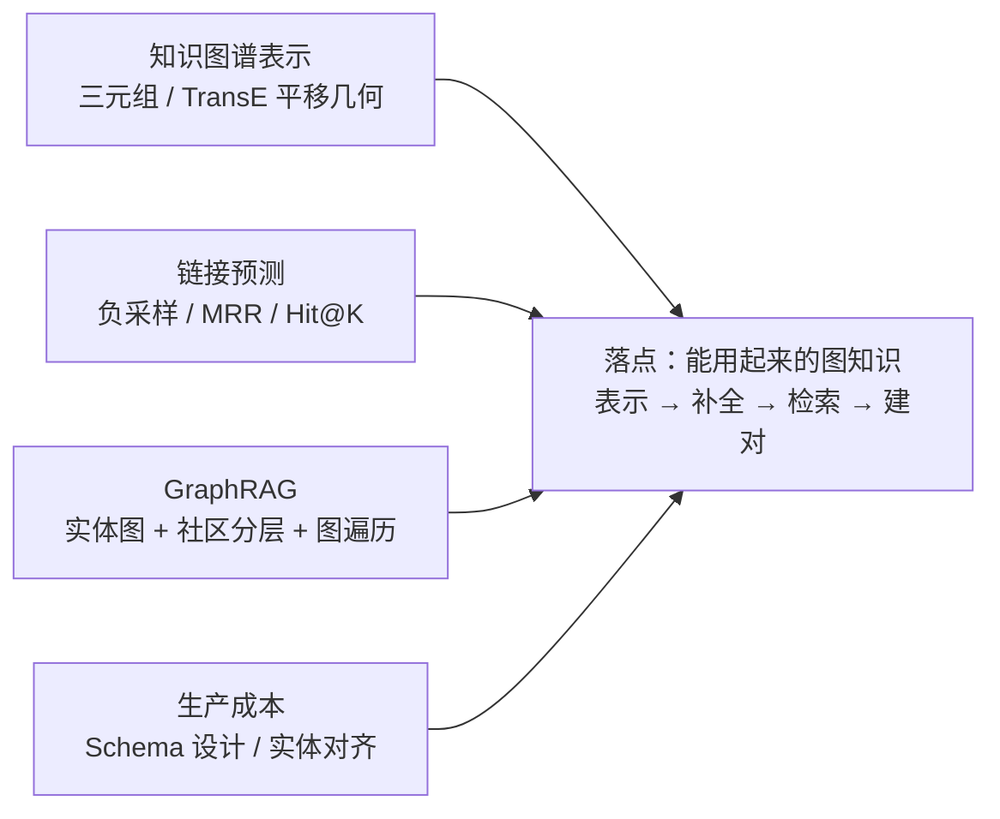
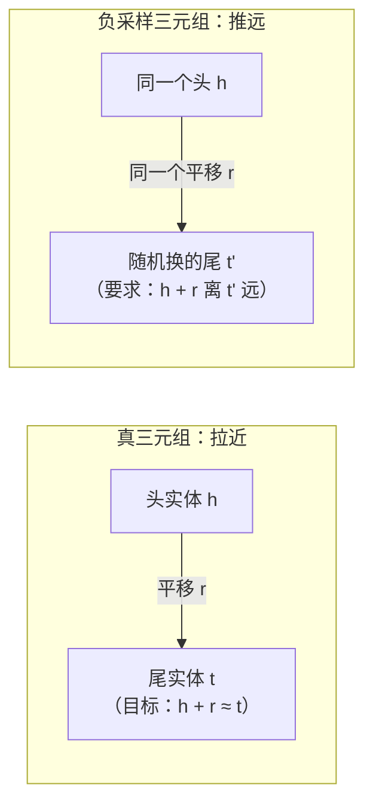
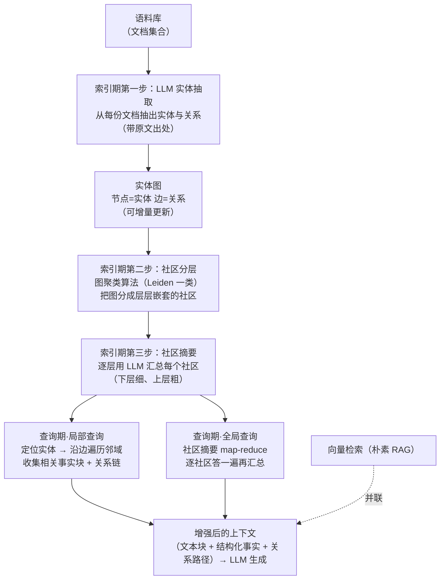
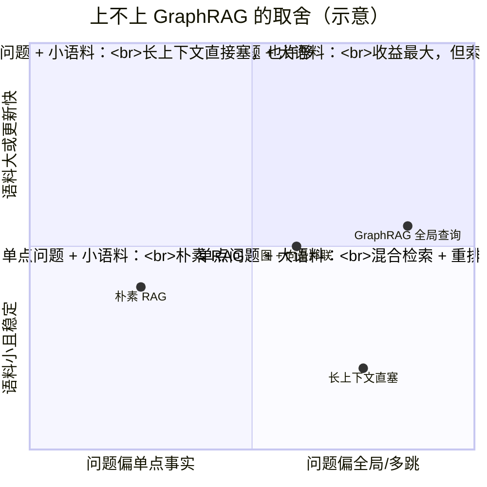
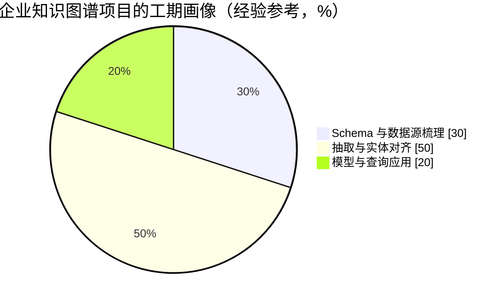

# 进阶专题：GraphRAG 与知识图谱

> **一句话理解**：把"实体—关系"存成图、再让机器用起来——知识图谱用**平移几何**把三元组压进向量空间（TransE：头 + 关系 ≈ 尾），链接预测负责补全缺失的边，GraphRAG 把这张图接到 RAG 上，专治朴素 RAG 的三个盲区：多跳关系、全局摘要、结构化事实——而生产里最贵的从来不是模型，是把图**建对**。

[⬆️ 返回总目录](../../../README.md) · [⬆️ 返回本篇](../README.md) · [⬅️ 返回本章目录](./README.md)

| 属性 | 说明 |
|------|------|
| 难度 | ⭐⭐⭐⭐（高阶） |
| 所属分支 | 图 |
| 前置知识 | [图数据入门](./01-图数据入门.md)、[GNN 核心模型](./02-GNN核心模型.md)、[进阶专题：GNN 深水区](./03-进阶专题-GNN深水区.md)；RAG 部分建议先读[第 7 章 RAG 与 Agent](../07-自然语言处理与LLM/06-RAG与Agent.md) |

---

## 📌 这一节解决什么问题

前三页把"GNN 怎么学一张图"讲完了；本页换一个视角：**不训练图神经网络，把图当数据结构用起来**——这是知识图谱（Knowledge Graph, KG）路线的立场，也是它与前几页最大的分野。四个问题依次展开：

1. **知识图谱怎么"表示"？** 知识的本质单位是三元组（头实体, 关系, 尾实体）——"北京 首都属于 中国"。但三元组只是存储格式，机器要用它得先把实体和关系变成向量：TransE 给出了一个干净到著名的答案——**把每种关系学成一个平移向量**，头实体向量加上关系向量，就应该落在尾实体向量旁边。
2. **图缺了怎么办？** 真实知识图谱永远缺边（维基数据没人把每条关系都录全）——**链接预测（Link Prediction）**：给定（头, 关系, ?），给所有候选实体打分排序。它要回答两个工程问题：负例从哪来（图里只有正例）、怎么评估（MRR / Hit@K——与第 8 章推荐的 Recall@K 是近亲，但有一个采样评估的坑要专门拆）。
3. **RAG 缺了关系怎么办？** 第 7 章的朴素 RAG 用"向量相似度"检索文本块——它有三个结构性盲区：**多跳关系**（"A 的供应商的主要竞争对手"要串两份文档）、**全局摘要**（"这批文档的共同风险"不是任何一块的内容）、**结构化事实**（精确的实体—属性值淹没在文本里）。**GraphRAG** 的解法：先让 LLM 把语料抽成实体图，再在图上做社区分层与遍历增强检索。
4. **生产里最贵的是什么？** 企业知识图谱的真实账单不在模型：**Schema 设计**（哪些实体/关系值得建模）与**实体对齐**（"苹果公司" = Apple Inc. = AAPL 是不是同一个节点）吃掉主要工期——与本章 99 页"图建对了吗"的体检清单一脉相承。

## 🌱 通俗理解

四句话先行：

- **三元组像"户口本的一行"**：谁（头）、什么关系（谓）、跟谁（尾）——一行一户，几亿行摞起来就是一座城市（图谱）；查"谁住在谁隔壁"时，户口本比一本本日记好查得多。
- **TransE 像"地铁线路图"**：每个实体是一个站点，每种关系是一条**固定方向的短线**——从"北京"站沿"首都属于"线平移一段，就到"中国"站。妙处在于**换乘**：沿"首都属于"再沿"位于"两段线连乘着走，就回答了"北京所在的洲"——关系可加，路径可组合。
- **链接预测像"猜你可能认识谁"**：社交图上大量真实关系没被录入，模型按"平移几何对不对得上"给所有陌生人打分——分数最高的那个，多半就是你该认识而没加好友的人。
- **GraphRAG 像"查族谱而不是翻日记"**：问"这家公司最长的供应链"——翻日记（向量检索）只能捡回几页提到"供应链"的纸；查族谱（实体图）顺着公司节点走几步，答案自己浮出来。而**建族谱本身要花大钱**（把百年日记整理成谱，就是企业知识图谱的工期本体）。

## 🗺️ 本页地图



## 📋 举个例子

用一个 6 条三元组的迷你图谱，手摆一遍 TransE 的平移几何（二维、手工设定，训练前的"理想态"）：

```
(北京, 首都属于, 中国)   (东京, 首都属于, 日本)   (巴黎, 首都属于, 法国)
(中国, 位于, 亚洲)       (日本, 位于, 亚洲)       (法国, 位于, 欧洲)
```

| 实体 | 向量 | | 关系 | 平移向量 |
|------|------|-|------|---------|
| 北京 | (0, 0) | | 首都属于 | (1, 0) |
| 中国 | (1, 0) | | 位于 | (0, 1) |
| 亚洲 | (1, 1) | | | |
| 巴黎 | (3, 0) | | | |
| 法国 | (4, 0) | | | |
| 欧洲 | (4, 1) | | | |

逐条验证平移约束：北京 (0,0) + 首都属于 (1,0) = 中国 (1,0) ✓；中国 (1,0) + 位于 (0,1) = 亚洲 (1,1) ✓；巴黎 + 首都属于 = 法国 (4,0) ✓；法国 + 位于 = 欧洲 (4,1) ✓。再看两个"免费"得到的能力：

- **组合（多跳）**：问"北京所在的洲"——图上没有这条边，但向量会算：北京 + 首都属于 + 位于 = (0,0) + (1,0) + (0,1) = (1,1) = **亚洲**。两段关系沿路相加，等于走了两跳；
- **链接预测**：现在图里新来一个实体东京（已知 首都属于 日本，日本位于亚洲）。问 (东京, 首都属于, ?) 时，给所有实体算"东京 + 首都属于 离谁最近"——离 日本 最近（动手试试环节用 numpy 训一个真的 TransE，链接预测会把"亚洲"排第一）。

注意一个隐藏的张力：**中国 和 日本 都"位于"亚洲**——两个头实体加上同一个平移向量必须落到同一个点，这逼着 中国 与 日本 在空间里挤在一起（它们确实同洲，挤得有理）；但若一个关系的尾巴成千上万（成千上万的人"毕业于"同一所大学），所有头实体都会被挤到一起——TransE 的著名软肋，深潜一会拆。

## 🧠 核心原理

### 板块一：知识图谱表示——三元组与 TransE

#### 1.1 三元组：知识的原子格式

知识图谱把世界拆成**三元组（Triple）**：(头实体 h, 关系 r, 尾实体 t)，如 (北京, 首都属于, 中国)、(青霉素, 治疗, 细菌感染)。大规模公开图谱（Wikidata、Freebase 一族）以亿级三元组记;企业图谱小而深（一家公司的产品、客户、供应商、人员的内部关系网）。三元组的本质优势是**结构化**：可以做精确查询（"所有治疗细菌感染的药物"）、可以做推理（关系组合）、可以接业务系统——代价是**每条知识都得先变成三元组**（板块四的账单）。

#### 1.2 TransE：把关系学成平移

TransE（Bordes 等，2013）的假设一句话：**对每个三元组，h + r ≈ t**。打分函数与训练目标：

$$
f_r(h, t) = -\,\lVert \mathbf{h} + \mathbf{r} - \mathbf{t} \rVert_1, \qquad
\mathcal{L} = \sum_{(h,r,t)} \sum_{(h',r,t')} \max\big(0,\; \gamma + f\ \text{差}\big)
$$

> 👉 **人话**：打分 = 负的距离——h 加上 r 之后离 t 越近，分越高。训练用**间隔排序损失（Margin Ranking Loss）**：对每个真三元组，随机换掉尾实体造一个假三元组 (h', r, t')；只要"真的距离 − 假的距离"还不到间隔 γ，就继续拉近真尾、推远假尾——**不追求绝对距离小，只追求真比假近出一段安全距离**。造假三元组的过程就是**负采样**（板块二细讲）。



<details>
<summary>📐 数学深潜：h + r ≈ t 的平移几何——组合性从哪来，1-N 关系为什么崩</summary>

**严格陈述。** TransE 的参数是实体嵌入 $\{\mathbf{e}\}$ 与关系嵌入 $\{\mathbf{r}\}$，打分 $f_r(h,t) = -\lVert \mathbf{h}+\mathbf{r}-\mathbf{t}\rVert_1$，损失为带负采样的间隔排序损失。两个结构性结论：①（组合性）若三元组 (h, r₁, m) 与 (m, r₂, t) 都被学得很好（$\mathbf{h}+\mathbf{r}_1\approx\mathbf{m}$、$\mathbf{m}+\mathbf{r}_2\approx\mathbf{t}$），则 $\mathbf{h}+\mathbf{r}_1+\mathbf{r}_2\approx\mathbf{t}$——**路径推理免费获得**；②（1-N 崩塌）若关系 r 下一个头 h 有 N 个尾 $t_1,\dots,t_N$，最优解会把所有 $\mathbf{t}_i$ 压到 $\mathbf{h}+\mathbf{r}$ 附近同一小簇里——**N 个不同实体几乎不可区分**。

**推导。**

① 组合性：链式代入即得 $\mathbf{h}+\mathbf{r}_1+\mathbf{r}_2 \approx \mathbf{m}+\mathbf{r}_2 \approx \mathbf{t}$，误差按三角不等式累积：$\lVert \mathbf{h}+\mathbf{r}_1+\mathbf{r}_2-\mathbf{t}\rVert \le \lVert \mathbf{h}+\mathbf{r}_1-\mathbf{m}\rVert + \lVert \mathbf{m}+\mathbf{r}_2-\mathbf{t}\rVert$——两段各自误差 ε，组合后至多 2ε。∎ 这就是"地铁换乘"的代数本体：**平移的可加性 = 关系的可组合性**，也是知识图谱嵌入天然支持两三跳推理的原因（跳数越深误差累积越大，与 02 页消息传递的"层数=跳数"遥相呼应，但这里不用训练图网络——推理是向量加法）。

② 1-N 崩塌：对固定 (h, r)，损失要把每个真尾拉近 $\mathbf{h}+\mathbf{r}$。N 个真尾互不排斥（它们之间没有损失项），唯一阻止它们重合的是负采样中"它们不能互相靠太近到能冒充彼此的尾"——但若 N 大而负例有限，最优解就是全部挤在 $\mathbf{h}+\mathbf{r}$ 的一个小邻域。**几何直觉**：TransE 用"点到点"的距离建模关系，而 1-N 关系本质是"点到集合"——一个点无法同时精确等于 N 个不同的点，只能委屈它们彼此相似。∎（同理 N-1 关系把 N 个头挤在一起：本页例子里 中国 与 日本 被"位于亚洲"挤近，是 N=2 的温和版。）

**反例与边界。** ① 层次结构（部分—整体、父子类）是 1-N 的重灾区：一个父类下成千上万个子类实体——TransE 后代全挤成一团；改进路线是换打分几何：TransH 把头尾投影到关系专属的超平面再平移、TransR 给每种关系配一个投影矩阵（实体在不同关系里用不同坐标）——都是"给关系发独立坐标系"来解挤兑。② 自反关系（r 的头尾是同一实体，如"是……的同义词"）要求 $\mathbf{h}+\mathbf{r}\approx\mathbf{h}$，即 r ≈ 0——所有自反关系共享零向量，无法区分。③ 组合性是"结构性副产品"不是保证：训练只约束单跳三元组，多跳组合的精度靠误差控制，深路径（4 跳以上）在实践中不可靠。

> 👉 **一句人话总结**：TransE 把"关系"编码成空间里的固定位移——位移可加，所以路径推理是白送的（h + r₁ + r₂ ≈ t）；但"一个点没法等于 N 个点"，所以 1-N 关系（层次、从属）会把实体挤成一团——它的改进后代（TransH/TransR）都在给关系发独立坐标系，解的都是这同一个挤兑。

</details>

#### 1.3 与双塔式检索的差异：关系向量 vs 相似度

TransE 打分与[第 8 章双塔召回](../08-推荐系统/03-双塔模型与向量召回.md)形似神不似——两边都是"嵌入 + 打分"，但打分的**语义载荷**放在不同的地方：

| | 双塔式检索（第 8 章） | TransE 式知识图谱嵌入 |
|---|---|---|
| 嵌入对象 | 任意文本（用户 query / 文档）各自编码 | 离散实体 + 离散关系，一一对应向量 |
| 打分方式 | 内积/余弦：**两塔直接比相似** | 距离：**头 + 关系平移后与尾比远近** |
| "查询"在哪 | query 塔现算一个向量 | 关系本身就是一个预学好的平移向量 |
| 擅长 | 开放文本的模糊匹配（"差不多意思"） | 精确关系的推理（"必须是这个关系"） |
| 弱点 | 不懂关系方向与多跳（"A 的供应商"与"供应 A 的"内积难分） | 覆盖有限：没有学过的实体/关系没有向量（冷启动） |

> 👉 **人话**：双塔问"这两段话像不像"，TransE 问"从 A 出发走'这种关系'能不能到 B"——**像不像 vs 到不到**。GraphRAG 恰好两个都要：向量检索捞"相关的文本块"，图遍历走"确切的关系链"，生产系统常把两路并联（板块三）。

### 板块二：链接预测——补全缺失的边

#### 2.1 任务定义与开放世界假设

链接预测（Link Prediction）：给定 (h, r, ?)，给知识图谱里**所有实体**打分排序，真尾应该排得尽量靠前。它既是知识图谱的核心任务（补全缺失关系），也是评估嵌入质量的通用考场（01 页三大任务里的"边任务"在 KG 语境的具体化）。

一个必须先立住的假设差别：**图谱是开放世界（Open World）**——图里没有的边 ≠ 假的，只是"还没录入"。这与推荐系统（第 8 章：用户没点 ≈ 大概率不感兴趣，近似封闭世界）相反：链接预测的"负例"没有一个是真的假，**只有"未验证"**。这个差别决定了负采样怎么做、评估怎么读。

#### 2.2 负采样：从"未验证"里造训练信号

图里只有正例（录了的三元组），间隔损失却需要负例来"推远"。标准做法：**损坏正例**——随机换掉头或尾，得到 (h, r, t')，当作"假三元组"训练。三个工程要点：

| 要点 | 做法 | 为什么 |
|------|------|--------|
| 采样比例 | 每个正例配几个到几十个负例 | 负例太少先学不出区分度；太多训练慢且大部分是"容易的假" |
| 假负例问题 | 换出来的 (h, r, t') 可能其实是**真的**（只是图里没录） | 开放世界的坑：把真边当假边推远，伤害精度——大图上按度加权采样、或过滤已知边可缓解 |
| 难负例 | 偏向采样"类型对得上"的尾实体（药物换药物，不换城市） | 随机负例太容易（城市显然不是任何药物的靶点），模型学不到细粒度区分——与第 8 章推荐负采样的"热度偏置/难例挖掘"同门 |

#### 2.3 评估：MRR 与 Hit@K

链接预测没有"一个正确答案"（可能有很多合理尾实体），所以评估用**排名制**：把真尾在全量实体里的排名取出来，聚合两个指标：

$$
\mathrm{MRR} = \frac{1}{|Q|}\sum_{q \in Q} \frac{1}{\mathrm{rank}_q}, \qquad
\mathrm{Hit@K} = \frac{1}{|Q|}\sum_{q \in Q} \mathbb{1}\big[\mathrm{rank}_q \le K\big]
$$

> 👉 **人话**：MRR 是"真尾排第几"的倒数平均——排第 1 得 1 分，排第 5 得 0.2 分，**对头部排名极敏感**；Hit@K 是"真尾进没进前 K 名"的比例——只问进没进，不问第几。前者考精细排序，后者考"别漏"，分工与[第 8 章 Recall@K](../08-推荐系统/03-双塔模型与向量召回.md)（用户点过的物品有几成进了 Top-K）完全同构——**同是"命中率"语言，但推荐的真实答案由用户行为定义，链接预测的真实答案由图谱已有的边定义**，所以后者还有一道特有工序：**过滤评估（Filtered Setting）**——排名前先把"其他已知为真的三元组"从候选里剔除，否则"问 (北京, 首属于, ?) 时把中国、日本、法国都排前面"会被当成错（它们是真答案，只是不是这一条的真答案）。

迷你例子把"过滤"讲死：问 (北京, 首都属于, ?)，打分排序是 [中国, 日本, 法国, ……]——日本、法国各自是别国的真首都（图里有边），只是不是这一问的真答案：

- **不过滤**：它们挤占排名、拉低分数——模型"知道得对"反而被扣分；
- **过滤评估**：先剔除它们再排名——考的是"区分对错"，不是"区分同类"；
- **工程含义**：报告 MRR/Hit@K 必须注明 filtered 与否，两个口径不可比，混读是复现失败的常见源头。

<details>
<summary>📐 数学深潜：采样负例算指标会"压缩差异"——sampled MRR/Hit@K 的偏差账</summary>

**严格陈述。** 设真尾在全量 N 个实体中的排名为 $\mathrm{rank}_{\text{full}}$。若评估时只采 $n$ 个负例实体与真尾一起排（"采样评估"，大图上为了省算力的常见做法），则采样排名的期望近似为：

$$
\mathbb{E}\big[\mathrm{rank}_{\text{smp}}\big] \;\approx\; 1 + n\cdot\frac{\mathrm{rank}_{\text{full}} - 1}{N - 1}
$$

**推导。** 采样排名 = 1 +（采到的负例中得分高于真尾的个数）。每个负例是从其余 N−1 个实体里均匀抽的，抽中"排名在真尾之前"的实体的概率是 $\frac{\mathrm{rank}_{\text{full}}-1}{N-1}$；n 个负例的期望高个数因此是 $n\cdot\frac{\mathrm{rank}_{\text{full}}-1}{N-1}$。∎（采样评估与第 8 章 ANN Recall 的"对精确 Top-K 的召回"同一逻辑，但那里是刻意近似、这里常被误当全量指标读。）

**三个后果（代入 N=100 万、n=100 读一遍）**：

| 全量排名 | 采样期望排名（n=100, N=10⁶） | 采样 Hit@10 | 全量 Hit@10 |
|---|---|---|---|
| 1（顶尖） | ≈ 1.0001 | ≈ 1.00 | 1 |
| 5 000（中游） | ≈ 1 + 100×0.005 = 1.5 | ≈ 0.98 | **0** |
| 50 000（差） | ≈ 6 | ≈ 0.9+ | **0** |

> 👉 **人话**：**全量排名的"千分之一"被采样压成了"前几名"**——一个在百万实体里只排到第 5000 的方法，采样评估下 Hit@10 照样接近满分。这不是方法变好了，是尺子变短了：100 个负例的"考场"里，只有排到考场后 90% 才会暴露。公开研究（Krichene & Rendle，2020）进一步证明采样指标**不是全量指标的无偏估计**、且可能**反转两个方法的相对优劣**——方法 A 全量更好、采样指标却输给 B 的反例真实存在。

**动手试试第 2 段的复现**：强打分器（全量 Hit@10 = 0.97）与弱打分器（全量 Hit@10 = **0.00**——真尾从没进过前 10），采样 100 负例后两者分别是 1.00 与 **0.98**——几乎无法区分。

**边界与正确姿势**：① 中小图谱（万级实体）直接算全量排名，没有任何理由采样；② 大图确实算不动全量时，报告"采样口径"必须随附 n 与采样策略，跨论文数字不可直接比大小；③ 采样的合理用途是**训练内监控**（快速看趋势），不是对外报告的评估——评估口径的污染比指标低一点更隐蔽。

> 👉 **一句人话总结**：采样评估把"百里挑一"变成"百人考场的前十名"——排名被压缩、差异被抹平、甚至座次被反转；链接预测的对外指标永远用全量（过滤）排名，采样只许当训练时的便宜温度计。

</details>

### 板块三：GraphRAG——给 RAG 装上关系的眼睛

#### 3.1 朴素 RAG 的三个盲区

第 7 章的朴素 RAG 管线是"切块 → 向量检索 Top-K → 重排 → 生成"。向量相似度**只能看见"字面/语义相近"**，于是有三类问题它结构性答不好：

| 盲区 | 问题样例 | 为什么向量检索失灵 |
|------|---------|-------------------|
| **多跳关系** | "A 公司的供应商的主要竞争对手是谁？" | 答案拆在两份文档里：文档甲讲 A 的供应商，文档乙讲那家供应商的对手——**每块单独都与问题不相似**，必须"串起来"才能回答；Top-K 检索没有"串联"机制 |
| **全局摘要** | "这批文档反映的主要技术风险是什么？" | 答案**不属于任何一块**——它是全部语料的综合；检索只捞回与"技术风险"字面最像的几块（可能恰好是最偏的几段） |
| **结构化事实** | "X 药物的适应症列表？" | 精确的实体—属性值埋在文本各处；文本块检索靠"像不像"，不保证"全不全"——漏一块就少一条，还可能被生成的"合理脑补"顶上（第 7 章的幻觉问题） |

> 👉 **人话**：向量检索是"按关键词翻便签"——问细节它强（"这条制度怎么说"），问**关系**（谁的谁）、问**全貌**（总体怎么样）、问**清单**（到底有几条）它就露怯：便签盒里没有一张便签写着答案的全貌。

#### 3.2 GraphRAG 的解法：实体图 + 社区分层 + 图遍历增强检索

GraphRAG（以微软 2024 年的方案为代表，变体众多）分两期建设：



三个设计各自的道理：

- **实体图抽取**：把"散在文本里的关系"显式化成边——多跳问题变成图上的**两步游走**（A →供应商→ X →竞争对手→ B），不再是"碰运气捞两块文本"；
- **社区分层**：图聚类把密集连接的实体群找出来（Leiden 等算法，模块度驱动的第 3 页同源技术）；社区再按大小分层嵌套——**全局问题有了抓手**：逐社区让 LLM 读摘要作答，再汇总（map-reduce），而不是把百万字文档一起塞进上下文；
- **图遍历增强检索**：查询来了先判类型——局部问题（具体实体）走"实体定位 + 邻域遍历 + 关系路径收集"，全局问题走"社区摘要汇总"；两路都可以与朴素向量检索**并联**（3.3 的选型表）。

<details>
<summary>🧮 展开：社区分层为什么能接住"全局问题"——模块度的一句话直觉</summary>

全局问题的难点是"答案不属于任何一块"；图上对应的观察是：**密集连接的实体群天然对应语料的主题簇**（提"Transformer"的文档互相引用"注意力""位置编码"，这些实体在图上抱团）。社区发现算法（Leiden 一族）的目标函数是**模块度（Modularity）**——"社区内部边的密度显著高于随机重连的期望"：把图随机打乱重连一遍作为基线，凡是内部边密度远超基线的子图就是一个社区。分层的含义是**递归套娃**：大社区内部再聚小社区，形成"粗—细"两级以上的摘要体系——全局问题问得粗就走上层摘要（每个大主题一段结论），问得细就走下层（具体子领域的细节）。这与第 3 页"图聚类用于大规模训练的分片"用的是同一族算法，但目的相反：那边**切开**是为了并行训练，这边**切开后保留摘要**是为了压缩上下文——同一把刀，两种用途。

> 👉 **人话**：社区分层 = 给语料自动编了一份**两级目录**——"删掉哪一章都不影响书的存在，但问'这本书讲什么'时你只需要读目录，不用读全文"。

</details>

> 👉 **人话**：朴素 RAG 是"翻便签"，GraphRAG 是**先花大力气把便签整理成一张关系网 + 一份分层目录**（索引期贵就贵在这里），查询时按问题类型走不同的路：问"谁跟谁什么关系"就在网上走两步，问"整体怎么样"就翻分层目录。便签没扔——网和目录旁边，向量检索照常备用。

#### 3.3 与第 7 章 RAG 页的关系：互补，不重复

[第 7 章 RAG 页](../07-自然语言处理与LLM/06-RAG与Agent.md)讲的是**管线本体**：切块、检索模型、混合检索、重排、失败模式分类学（检索/排序/生成/组装四类失败）——那是任何 RAG 系统的地基。本页只讲其中一刀：**把"向量相似度"这一种相关性，扩展为"图上的关系可达性"这一种结构性相关性**。选型时两页合起来用：

| 问题形态 | 推荐 | 理由 |
|---------|------|------|
| 单点事实、 FAQ、单文档摘要 | 朴素 RAG（第 7 章管线） | 向量检索的主场，上图纯属浪费 |
| 多跳关系、跨文档溯源 | GraphRAG 局部查询 / 图 + 向量并联 | 关系链要靠边走，不靠字面像 |
| 全库级综合问题（"这批资料总体说什么"） | GraphRAG 全局查询（社区摘要） | 检索式 Top-K 结构性看不见全貌 |
| 语料高频更新（新闻、工单流） | 慎重评估上图成本 | 索引期 LLM 抽取要随更新重跑（见 3.4） |

#### 3.4 成本与争议：GraphRAG 不是免费的午餐

对 GraphRAG 最诚实的批评集中在**成本—收益的不对称**上（公开工程报告与第三方评测的普遍观感，量级随语料浮动，经验参考）：

- **索引成本前置且巨大**：实体抽取要对每份文档调 LLM，社区摘要再乘一层——索引一个中型语料库的 LLM 调用开销，常比建向量索引高**一个数量级以上**（公开报告的常见量级，经验参考）；语料每次大更新都要增量重抽，**更新越频繁、图谱路线越贵**；
- **查询也有额外开销**：全局问题的 map-reduce 要多次 LLM 调用，延迟与成本都高于单次检索；
- **收益的证据分歧**：在"全局摘要"类问题上 GraphRAG 的设计目标明确达成（原论文实验口径）；但第三方复现对"常规问答是否更好"结论不一——有评测发现朴素 RAG 在多数常规问题上打平甚至更好（公开评测观点）。降低成本的后继方案（轻量索引、按需扩展社区等 LazyGraphRAG 一类）正沿"把索引做便宜"这条线演化。



> 👉 **人话**：GraphRAG 的赌注是"**一次贵的结构化，换无数次便宜的准回答**"——语料稳定、问题确实偏关系与全貌，赌赢；语料天天变、问题都是单点查询，赌输。先拿两周的真实问题日志做分类（单点 / 多跳 / 全局各占几成），再决定上不上——**按问题分布选架构，不按热度**。

### 板块四：生产中的图知识——企业知识图谱的构建成本

真去建企业知识图谱，工期的大头从来不在嵌入与模型，在三件"数据工程"上（与本章 99 页"建图占一半"的项目画像完全一致）：

| 工序 | 要解决什么 | 常见坑 |
|------|-----------|--------|
| **Schema 设计**（本体建模） | 哪些实体类型、哪些关系类型进图 | 过粗：全塞进"实体—相关—实体"，图退化为巧合的关联网；过细：几百种关系类型，长尾关系没数据学不动、抽取器也认不全——**先按业务问题倒推 10~20 种核心关系，再随需求生长**（经验参考） |
| **实体对齐**（消歧与链接） | "苹果公司" = "Apple Inc." = 股票代码 AAPL 是同一节点吗？两个"张伟"是同一个人吗？ | 同名不同实体（合并错误）与异名同实体（拆分错误）都污染下游：合并错误让无关事实互相"传染"，拆分错误让多跳路径断掉——第 9 章 99 页的**实体对齐率体检**（对齐率看图断没断）在 KG 语境同样成立 |
| **更新与溯源** | 事实会变（CEO 换人、收购发生）、抽取会错 | 每条三元组带**出处与时间戳**（哪份文档、何时抽取）；冲突事实要仲裁策略（以最新为准 / 以权威源为准 / 并存标注）——没有溯源的图谱无法 debug，错了都不知道去哪改 |

> 👉 **人话**：企业知识图谱项目的真实工期画像（经验参考）：Schema 与数据源梳理约三成、抽取与对齐约五成、模型与查询应用约两成——**与 GNN 风控项目"建图占一半"是同一条纪律**：先问图建得对不对，再问模型强不强。



## 🩺 失败模式速查（何时不 work）

| 症状 | 病因 | 诊断 | 补救 |
|------|------|------|------|
| TransE 在"从属/属于"类关系上排序很差 | 1-N 关系挤兑（深潜一的反例） | 按关系类型分桶看 MRR：从属类独低即坐实 | 换 TransH/TransR 类"关系专属坐标系"的打分；或该类关系走规则不走向量 |
| 链接预测论文分数很高、自己复现很差 | 评估口径不同（采样负例数、过滤设置、测试集划分） | 对齐口径重算：全量过滤排名是最小公约数 | 报告必须附 n、采样策略、过滤设置；跨数字不比大小 |
| GraphRAG 回答多跳问题仍漏第二跳 | 抽取漏边（第二跳关系没被抽出来，图上不可达） | 人工抽查该问题的金标路径在图上是否存在 | 提高该类关系的抽取覆盖（提示词给类型白名单与 few-shot）；或该问题降级为图+向量并联 |
| 全局问题答案空洞（"主要风险是……等方面"） | 社区摘要太浅 / 层级太少，map 出来的都是套话 | 看中间产物：逐社区摘要是否有具体事实 | 摘要提示词要求引用实体与数字；调社区粒度（更小的社区） |
| 图谱上线三个月后答案越来越错 | 事实过期（人事、架构变更没进图）；更新管道断了 | 抽样对账：随机抽三元组与最新源文档比对 | 带时间戳的增量更新 + 过期事实下线机制；把"更新断流"做成监控告警 |
| 两个"张伟"被合并后串出一堆假关系 | 实体对齐合并错误 | 找一条明显荒谬的边，回溯对齐决策的证据分 | 对齐阈值调高（宁拆勿错）；关键实体人工复核 |

## 🧭 开放问题（批判视角）

- **GraphRAG 的成本—收益边界没有公认判据**："什么问题分布、什么语料规模上图才划算"目前只有个案经验，没有可迁移的决策模型——说到底，"结构化"与"生成式"两条技术路线在知识管理上的分工，2026 年仍在摇摆（长上下文模型的进步还在持续改写这道题的边界）。
- **知识图谱与 LLM 互相依赖的循环**：现代图谱靠 LLM 抽取（图谱依赖模型），GraphRAG 又拿图谱给 LLM 当外挂（模型依赖图谱）——抽取的错误会顺着这个循环复利：图谱错了 → 生成引用了错图谱 → 用户反馈污染下一轮抽取。闭环的纠错机制（人审抽样、溯源审计）落后于闭环本身。
- **结构化知识的可维护性天花板**：三元组的"对"是相对的（时间、口径、粒度），而 schema 的演化（加关系类型、拆实体类型）没有成熟的重迁移方案——图谱越成功、锁定越深，重构越疼。

## 🔬 SOTA 演进（2023–2026）

- **GraphRAG 的扩散与降本（一句话级）**：微软 2024 年方案之后，社区分层 + 摘要 map-reduce 成为"全局问答"的模板动作，开源实现与托管服务相继出现；降本路线（轻量索引、按需扩展社区的 LazyGraphRAG 类）与"图 + 向量并联"的混合架构是 2025–2026 的主流演化方向（公开论文与工程报告层面的观感）。
- **KGE 与文本嵌入的融合（一句话级）**：用 LLM 生成实体/关系描述再嵌入（文本语义补结构冷启动）、或用文本编码器替代随机初始化——离散符号的图谱嵌入正在被"预训练语言模型的语义先验"重新打底（公开研究方向的概括）。

## 💻 动手试试

```python
import numpy as np
rng = np.random.default_rng(2)

# ============ 1) TransE 最小实现：把三元组"平移"进嵌入空间 ============
triples = [
    ("北京", "首都属于", "中国"), ("东京", "首都属于", "日本"), ("巴黎", "首都属于", "法国"),
    ("中国", "位于", "亚洲"),   ("日本", "位于", "亚洲"),   ("法国", "位于", "欧洲"),
]
entities = sorted({t for h, _, t in triples} | {h for h, _, _ in triples})
relations = sorted({r for _, r, _ in triples})
eidx = {e: i for i, e in enumerate(entities)}
ridx = {r: i for i, r in enumerate(relations)}

dim, margin, lr, n_neg = 6, 1.0, 0.1, 6
E = rng.normal(0, 1.0, (len(entities), dim)); E /= np.linalg.norm(E, axis=1, keepdims=True)
R = rng.normal(0, 0.2, (len(relations), dim))

def score(h, r, t):                       # 越大越像真三元组（L2 距离取负；论文用 L1，此处从简）
    return -np.linalg.norm(E[eidx[h]] + R[ridx[r]] - E[eidx[t]])

for epoch in range(2000):
    for h, r, t in triples:
        for _ in range(n_neg):            # 负采样：随机换尾实体
            t_neg = entities[rng.integers(len(entities))]
            if t_neg == t: continue
            d_pos = np.linalg.norm(E[eidx[h]] + R[ridx[r]] - E[eidx[t]])
            d_neg = np.linalg.norm(E[eidx[h]] + R[ridx[r]] - E[eidx[t_neg]])
            if margin + d_pos - d_neg > 0:        # 间隔排序损失：真尾要比假尾近出 margin
                g = E[eidx[h]] + R[ridx[r]]
                dp = (g - E[eidx[t]]) / (d_pos + 1e-9)      # 拉近真尾的方向
                dn = (g - E[eidx[t_neg]]) / (d_neg + 1e-9)  # 推远假尾的方向
                E[eidx[t]]    += lr * dp
                E[eidx[t_neg]] -= lr * dn
                E[eidx[h]]    -= lr * (dp - dn)             # h 与 r 同时出现在两个距离里
                R[ridx[r]]    -= lr * (dp - dn)
    E /= np.linalg.norm(E, axis=1, keepdims=True)           # 每轮把实体钉回单位球（防挤成一团）

for h, r, t in triples:
    print(f"d({h} + {r} -> {t}) = {-score(h, r, t):.3f}")

ranking = sorted(entities, key=lambda t: -score("中国", "位于", t))   # 链接预测
print("\n链接预测（中国, 位于, ?）排序：", ranking[:3], "……")
rank = ranking.index("亚洲") + 1
print(f"真尾『亚洲』排名 = {rank}，MRR 贡献 = {1.0 / rank:.2f}，Hit@1 = {rank == 1}")
print("组合性检验：北京 + 首都属于 + 位于 -> 亚洲 距离 = %.3f"
      % np.linalg.norm(E[eidx['北京']] + R[ridx['首都属于']] + R[ridx['位于']] - E[eidx['亚洲']]))
print("对照（错误组合）-> 巴黎 距离 = %.3f"
      % np.linalg.norm(E[eidx['北京']] + R[ridx['首都属于']] + R[ridx['位于']] - E[eidx['巴黎']]))

# 预期输出（数值随训练浮动，量级稳定）：
# d(北京 + 首都属于 -> 中国) ≈ 0.1~0.3（六条真三元组距离都明显小于实体间典型距离）
# 链接预测（中国, 位于, ?）排序： ['亚洲', ...]   真尾排名 = 1
# 组合性检验 -> 亚洲 距离 ≈ 0.6  <<  对照 -> 巴黎 距离 ≈ 2.3
# 读法：单跳训练、两跳免费——(北京, 首都属于∘位于, 亚洲) 这条边图上没有，
# 向量加法把它"推"了出来；而错误组合（巴黎）距离是它的好几倍。

# ============ 2) 采样负例算指标：尺子变短，差异被抹平 ============
n_items, n_query, k = 1000, 200, 10

def eval_scorer(s_true, n_neg_samples):
    """真实体得分 s_true，其余 999 个干扰项得分 ~ U(0,1)。返回（全量/采样）的 Hit@10 与 MRR"""
    hit_f, mrr_f, hit_s, mrr_s = [], [], [], []
    for _ in range(n_query):
        scores = rng.uniform(0, 1, n_items); scores[0] = s_true   # 0 号 = 真尾
        rf = 1 + (scores[1:] >= s_true).sum()
        hit_f.append(rf <= k); mrr_f.append(1.0 / rf)
        neg = rng.choice(np.arange(1, n_items), n_neg_samples, replace=False)
        smp = np.concatenate([[s_true], scores[neg]])
        rs = 1 + (smp[1:] >= s_true).sum()
        hit_s.append(rs <= k); mrr_s.append(1.0 / rs)
    return np.mean(hit_f), np.mean(mrr_f), np.mean(hit_s), np.mean(mrr_s)

for name, s in [("强打分器（真尾几乎总第 1）", 0.995), ("弱打分器（真尾全量约第 50）", 0.95)]:
    hf, mf, hs, ms = eval_scorer(s, n_neg_samples=100)
    print(f"\n{name}：\n  全量排名   Hit@10 = {hf:.2f} | MRR = {mf:.3f}"
          f"\n  采样100负例 Hit@10 = {hs:.2f} | MRR = {ms:.3f}")

# 预期输出（第二部分数值随种子小幅浮动）：
# 强打分器（真尾几乎总第 1）：
#   全量排名   Hit@10 = 0.97 | MRR ≈ 0.20
#   采样100负例 Hit@10 = 1.00 | MRR ≈ 0.79
# 弱打分器（真尾全量约第 50）：
#   全量排名   Hit@10 = 0.00 | MRR ≈ 0.02
#   采样100负例 Hit@10 = 0.98 | MRR ≈ 0.19
# 读法：弱打分器在全量排名下 Hit@10 是 0（真尾从没进过前 10），
# 采样评估却给出 0.98——"百里挑一"被压成"百人考场前十名"。
# 对外报告链接预测指标，永远用全量（过滤）排名。

# ============ 改什么，看什么变化 ============
# - 把 n_neg 从 6 调到 1：真三元组距离明显变大——负采样不足时"真比假近"的约束太松；
# - 把 dim 从 6 降到 2：组合性误差变大（两段平移的误差在低维更难摊开）；
# - 给 triples 加一条 ("上海", "位于", "亚洲")：中国/日本/上海被同一个平移向量挤得更近——
#   亲眼看 N-1 关系的"挤兑"；再加 ("曼谷", "首都属于", "泰国") 则互不影响——1-1 关系最舒服。
```

## 🔥 炼丹小灶

> 🔥 **炼丹小灶**：工业界常用起点配方与玄学——
> - 配方：TransE 起步 dim 50~200、margin 1~2、L1 距离、每正例 5~20 个负例、Adam lr 1e-3~1e-2 量级（经验参考）；实体嵌入按批归一化到单位球是常用的稳定器。GraphRAG 的抽取提示词给**实体类型白名单 + few-shot**，社区摘要分层缓存（语料没变的社区不重算）。
> - 玄学：TransE 某类关系 MRR 离谱低 → 先查是不是 1-N 关系（换打分或走规则），不是调参能救的；GraphRAG 多跳漏答 → 先查图上有没有那条边（抽取覆盖问题），不是检索器问题；链接预测复现分数对不上 → 八成是评估口径（采样数/过滤设置）不同。
> - ⚠️ 以上是经验参考值，不是圣旨；换数据集请重新炼。

## 🖱️ 动手玩

> 🕹️ **延伸玩一玩**：[Embedding Projector](https://projector.tensorflow.org)——把实体嵌入降到 2D/3D 看"平移结构"与聚簇：同类实体挤在一起（1-N 挤兑的现场）、关系像一组固定方向的"风"把 embeddings 吹成平行带——TransE 的几何当场可视化。
> 🕹️ **再玩一个**：[Transformer Explainer](https://poloclub.github.io/transformer-explainer/)——GraphRAG 查询期的生成侧仍是这套注意力机器；对照第 7 章 RAG 页的管线读，"图增强改的是检索端，不是生成端"这句话会落地。

## 🔗 在知识树中的位置

- **上游**：[图数据入门](./01-图数据入门.md)（节点/边/度的语言、图的脾气）；[进阶专题：GNN 深水区](./03-进阶专题-GNN深水区.md)（社区分层用的图聚类、大规模图的工程账——本页的"图当数据结构"与那页的"图当模型输入"是两条互补路线）。
- **下游**：本章[生产实战](./99-生产实战.md)（实体对齐率体检、图数据质量三检查点——企业知识图谱的质量纪律同源）。
- **横向对比**：[第 7 章 RAG 与 Agent](../07-自然语言处理与LLM/06-RAG与Agent.md)（管线与失败分类学——本页只讲图增强这一刀）；[第 8 章双塔模型与向量召回](../08-推荐系统/03-双塔模型与向量召回.md)（双塔的相似度 vs TransE 的平移距离；Recall@K 与 Hit@K 的口径对照）；[第 7 章词向量](../07-自然语言处理与LLM/01-词向量与embedding.md)（"离散符号 → 向量"的共同母题）。

## ⚠️ 常见误区

- **误区一**："GraphRAG 取代朴素 RAG" → 它专治三类结构性盲区（多跳/全局/结构化事实）；单点事实与 FAQ 上向量检索仍是主场，生产常态是两路并联——按问题分布选架构，不按热度。
- **误区二**："GraphRAG 里的图 = 要训练 GNN" → 主流实现里图是**数据结构**（节点/边/社区），检索靠图遍历与摘要聚合，不跑消息传递——第 2/3 页的 GNN 与本页的"图当索引"是两条路线，别混装。
- **误区三**："知识图谱必须建得又全又准才能用" → 全与准是过程不是前提：按业务问题倒推核心 Schema、增量生长、带溯源可纠错——比"先花一年建完美图谱"的项目存活率高得多。
- **误区四**："TransE 是知识图谱嵌入的终点" → 它是 2013 年的起点：1-N 关系挤兑、自反关系零向量等结构性缺陷明确，TransH/TransR 及之后的打分函数都在补这些洞——选打分函数先看你的关系长什么样（1-1 还是 1-N）。
- **误区五**："链接预测的 MRR/Hit@K 跨论文可比" → 口径差异（采样负例数、过滤设置、测试划分）足以淹没方法差异；对外指标只用全量过滤排名，比较时先对齐口径。
- **误区六**："实体对齐是小事，模型才是大事" → 对齐错误（错误合并/拆分）直接污染每一条多跳查询——KG 项目里对齐的优先级高于嵌入模型的选择（99 页体检清单同款纪律）。

## 📝 小结与自测

**要点回顾**

- 知识图谱表示：知识的原子是三元组 (h, r, t)；TransE 把每种关系学成平移向量，打分 $f=-\lVert h+r-t\rVert$，间隔排序损失 + 负采样训练；**平移可加 = 关系可组合**（h+r₁+r₂≈t，多跳推理免费），但"一个点不能等于 N 个点"——1-N 关系（层次/从属）挤兑实体，TransH/TransR 靠关系专属坐标系补救。
- 双塔 vs TransE：**像不像（内积）vs 到不到（平移距离）**——开放文本的模糊匹配 vs 精确关系的推理，GraphRAG 两路并联。
- 链接预测：开放世界假设（缺边 ≠ 假边）；负采样从"未验证"里造训练信号（防假负例、用难负例）；评估用全量过滤排名的 MRR（头部敏感）与 Hit@K（别漏），与推荐的 Recall@K 同构但真实答案定义不同；**采样负例算指标会把排名压缩约 $\frac{n}{N}$ 倍、抹平方法差异甚至反转座次**——对外报告永远用全量。
- GraphRAG：朴素 RAG 三盲区（多跳/全局/结构化事实）的病根是"相似度看不见关系"；解法是索引期"LLM 实体抽取 → 社区分层 → 社区摘要"、查询期"局部走图遍历、全局走摘要 map-reduce"；成本前置（抽取与摘要的 LLM 调用量级高于向量索引）且随更新重跑——上不上取决于问题分布与语料稳定性。
- 生产图知识：Schema 设计（按业务问题倒推，过粗退化为关联网、过细长尾饿死）、实体对齐（合并/拆分错误都污染多跳）、更新与溯源（三元组带出处时间戳）——建图占大头工期，与 GNN 项目同一条纪律。

**自测一下**（点击展开答案）

<details>
<summary>问题 1：TransE 为什么能"免费"支持两跳推理？代价是什么？</summary>

平移的可加性：若 h+r₁≈m 与 m+r₂≈t 都学得好，则 h+r₁+r₂≈t（三角不等式，误差至多相加）。所以"北京 + 首都属于 + 位于 ≈ 亚洲"这条图上不存在的边能被向量加法推出来。代价：训练只约束单跳，组合误差逐跳累积——深路径（4 跳以上）实践中不可靠；动手试试的对照（错误组合的距离是正确组合的数倍）就是这种可靠性的直观体现。

</details>

<details>
<summary>问题 2：为什么 1-N 关系是 TransE 的软肋？举个真实例子与补救。</summary>

一个头 h 配 N 个尾，要求 h+r 同时靠近 N 个不同的点——最优解把 N 个尾挤到同一小簇，实体不可区分。真实例子：层次与从属（"属于""毕业于""总部在"——一个父类/机构/城市对应成千上万实体）。补救：TransH（投影到关系专属超平面）、TransR（关系专属投影矩阵）——本质都是"给关系发独立坐标系"解除挤兑；或该类关系直接走规则/结构化查询，不走向量。

</details>

<details>
<summary>问题 3：链接预测与推荐系统的 Recall@K 有什么同构与不同？</summary>

同构：都是"给候选打分排序、看真答案进没进前 K"的命中率语言。不同：推荐的真实答案由用户行为定义（点了什么什么就是答案），近似封闭世界；链接预测的真实答案是图谱已有的边，且图谱是开放世界——缺边只是未验证不是假。由此多出两道工序：负采样要防"假负例"（把真边当假边推远），评估要做过滤设置（剔除其他已知真答案再排名）。

</details>

<details>
<summary>问题 4：采样负例评估为什么会"压缩差异"？用期望排名公式说明，并给出正确的评估姿势。</summary>

采样排名期望 ≈ 1 + n·(rank_full−1)/(N−1)：n 个负例中"排在真尾前面"的期望个数被比例 n/(N−1) 缩小。N=10⁶、n=100 时，全量第 5000 名的期望采样排名约 1.5——Hit@10 从 0 变 ≈1。公开研究进一步证明采样指标非无偏、可反转方法座次。正确姿势：中小图直接算全量过滤排名；大图算不动时报告必须附采样数与策略，跨数字不比大小；采样只作训练内监控。

</details>

<details>
<summary>问题 5：朴素 RAG 的三个盲区分别是什么？GraphRAG 的三步索引各治哪个？</summary>

盲区：多跳关系（答案拆在多份文档、单块都不相似）、全局摘要（答案不属于任何一块）、结构化事实（清单型答案靠"像"不保"全"）。索引三步：实体图抽取治多跳（关系显式成边，问题变图上走两步）；社区分层 + 社区摘要治全局（逐社区摘要再 map-reduce，不用整库塞上下文）；图遍历增强检索 + 与向量并联治结构化事实（实体定位后邻域收集，不靠字面相似）。查询期按问题类型路由：局部走遍历、全局走摘要。

</details>

<details>
<summary>问题 6：企业知识图谱的三大成本工序中，为什么实体对齐的错误最伤多跳查询？</summary>

多跳查询依赖路径连通：合并错误（两个"张伟"并成一个节点）让无关事实经由错误节点互相串联——查出的两跳路径半真半假；拆分错误（同实体分成两个节点）让真实路径中途断裂——查不出本可到达的答案。对齐错误的杀伤是**结构性的**（污染/切断路径），不像抽取漏边只少一条事实——所以对齐优先级高于模型选择。

</details>

## 📚 延伸阅读

- 论文：Bordes et al., *Translating Embeddings for Modeling Multi-relational Data*（TransE, 2013）；Wang et al., *Knowledge Graph Embedding by Translating on Hyperplanes*（TransH, 2014）；Lin et al., *Learning Entity and Relation Embeddings for Knowledge Graph Completion*（TransR, 2015）
- 论文：Edge et al., *From Local to Global: A Graph RAG Approach to Query-Focused Summarization*（微软 GraphRAG, 2024）；Traag et al., *From Louvain to Leiden*（2019，社区分层所用算法的来处）
- 论文：Krichene & Rendle, *On Sampled Metrics for Item Recommendation*（2020，采样指标的偏差与不一致性——深潜二的理论出处）
- 工具：Neo4j（图存储与查询，LLM 知识图谱构建模板的常见底座）、Microsoft GraphRAG 开源仓库；综述可搜 "knowledge graph embedding survey" / "GraphRAG survey"

---

[⬅️ 上一页：进阶专题：GNN 深水区](./03-进阶专题-GNN深水区.md) · [返回本章目录](./README.md) · [下一页：生产实战 ➡️](./99-生产实战.md)
