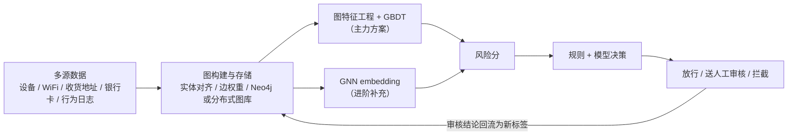
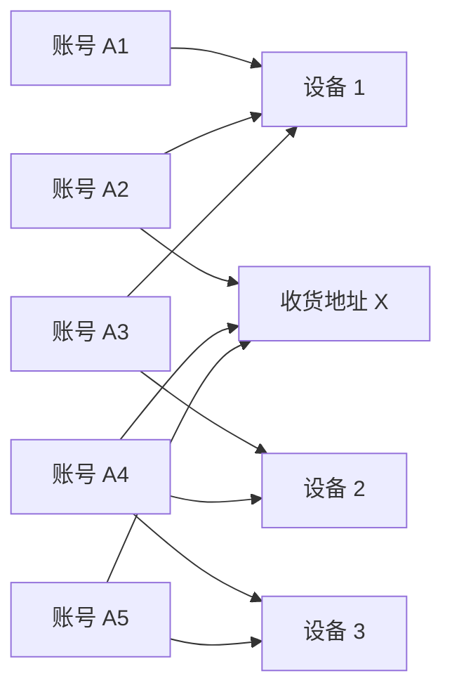

# 生产实战：风控与推荐中的图方案

> **一句话理解**：真实生产里大多数"图方案"是手工图特征（邻居统计）+ GBDT——便宜、可解释、够用；GNN 确实在大厂风控与召回中落地，但它的前提是先把图建对、建稳，这份工程量课本上从不写。

[⬆️ 返回总目录](../../../README.md) · [⬆️ 返回本篇](../README.md) · [⬅️ 返回本章目录](./README.md)

| 属性 | 说明 |
|------|------|
| 难度 | ⭐⭐ |
| 所属分支 | 图 |
| 前置知识 | 本章全部正文 |

---

## 🏭 一个真实项目从 0 到 1

以电商平台的**反欺诈团伙识别**为例（账户量百万到千万级，经验参考）：黑产批量注册账号、共享设备与收货地址，单人看毫无破绽，连成图便原形毕露。

**时间花在哪**（前两个月，经验参考）：实体对齐与图构建 ~50%、图特征 + GBDT 基线 ~20%、GNN 训练与对比 ~15%、实时子图服务 ~15%——图项目的宿命是"建图占一半"。谁参与：图数据工程 2 人、算法 2 人、风控策略 1 人（审核团队是最终用户）。

分阶段拆解：

- **需求定义**：和风控审核团队对齐——模型输出风险分与证据链，**拦截决策留给人**。指标定两头：团伙案件召回率（抓得多全）与误伤率（好用户被误拦得少），误伤率是护栏，破了就回滚；
- **数据（本项目最大的坑）**：从多源日志构边——同设备登录（强边）、同收货地址/银行卡（强边）、同 WiFi（中边）、同 IP（弱边）。**实体对齐**是第一杀手：同一台设备在安卓 ID、广告 ID、设备指纹三套体系里各有编码，对不齐图就断、对错了图就脏。图存储中小规模用 Neo4j，十亿级边考虑分布式图数据库；真实数据的构图、清洗、更新流水线占整个项目一半以上工时。

  **构边类型速查**（边建错，后面全白费）：

  | 边类型 | 强度 | 误伤风险 |
  |--------|------|---------|
  | 同设备登录 | 强 | 一家人共享平板 |
  | 同银行卡 / 同收货地址 | 强 | 代收代付的正常场景 |
  | 同 WiFi | 中 | 公司 / 宿舍 WiFi 连出一大片 |
  | 同 IP | 弱 | 出口 IP 复用严重 |

🕸️ 展开看：一个欺诈团伙在图上长什么样

三个观察：

1. **密集子图**：正常用户的邻居互不相干，团伙的账号-设备-地址连成一小团——"找稠密子图"就是找团伙；
2. **路径是证据链**：A5 和 A1 从未共享任何东西，但 A5→设备 3→A4→设备 2→A3→设备 1→A1 三跳可达——GNN 三层恰好能"感知"到这种间接关联；
3. **这也是误伤的来源**：合法家庭同样是密集子图，必须靠边权重、时间衰减、行为相似度区分（见下方迭代故事）。

- **设备与算力**：图特征 + GBDT 用 CPU 机器即可；上 GNN 需要带大内存的 GPU 节点（邻接采样吃内存）；图存储与查询单独部署，别和训练抢资源；
- **算法选型（先说人话版）**：
  1. **基线主力：手工图特征 + GBDT**——每个账户算一度邻居数、共同好友数、设备共享数、邻居中黑名单账户占比等几十个统计量，喂给 LightGBM。便宜、快、**每个案子都能给审核一条"该账户与 3 个已封号共享 2 台设备"的证据链**；
  2. **进阶补充：GNN**——当图规模大、高阶结构模式（多跳团伙拓扑）手工枚举不出时，用 GraphSAGE 类采样式 GNN 学账户 embedding，风险分再涨一截；推荐场景同理，图召回与[双塔召回](../08-推荐系统/03-双塔模型与向量召回.md)互补——双塔快、图看得远。

  两条路线怎么选，一张表说清：

  | 维度 | 手工图特征 + GBDT | GNN |
  |------|-------------------|-----|
  | 覆盖结构 | 一度/二度统计为主 | 2~3 层消息传递，间接关联也能感知 |
  | 标签需求 | 有多少用多少 | 半监督，标签可沿边"传染" |
  | 可解释性 | 每个特征都是证据链 | embedding 难直接解释 |
  | 工程成本 | 低，周级上线 | 高：采样、训练、更新一条流水线 |
- **训练炼丹**：欺诈标签**极稀少**（已确认案件占账户万分之一量级）且滞后（人工确认要数周）——半监督学习 + 极端不均衡采样是常态，把已确认案件当种子，图结构负责"传染"标签信息（这正是[消息传递](./02-GNN核心模型.md)的用武之地）；
- **评估**：离线看"固定误伤率下的召回率"（不是裸 AUC——不均衡场景下 AUC 会骗人）；上线核心看**审核采纳率**（模型送审的案子多少人审确认是欺诈）。上线节奏：先影子模式跑两周（只出分不参与决策），对齐模型与审核的分歧再切流量；
- **部署**：两条链路——**离线批量**：天级全量账户重算风险分，供策略与回溯；**实时**：新注册/新登录请求，实时抽取该账户 2 跳子图算特征（采样与邻居统计服务化，P99 压在几十毫秒）；
- **监控与迭代**：盯团伙手法迁移（设备农场换指纹、地址填虚构）导致的图分布漂移；每周复盘误伤案件，反哺边权重与规则；每月做一次"图健康度体检"——断边率、重复实体率、热点节点占比，图坏了模型再好也白搭。

**怎么算成功**（与业务方白纸黑字对齐的验收口径，经验参考）：

| 口径 | 目标 | 数据来源 |
|------|------|---------|
| 团伙召回 | 固定误伤率下召回率较基线 +15% | 离线回测 + 上线后案件复盘 |
| 误伤率 | 申诉误判占比不高于基线 | 客服申诉链路 |
| 审核采纳率 | 送审案件采纳率 ≥ 70% | 审核团队周报 |

📋 展开一个真实的迭代故事

上线第二个月，审核申诉里出现一批"误伤"：一家人共享平板和 WiFi 下单，被模型判成团伙。排查发现：家庭共享是**合法的密集子图**，和黑产共享在"设备共享数"这个特征上长得很像。修复分三步：给边加类型权重（银行卡共享 > 设备 > WiFi）、加时间衰减（半年前的共享降权）、加入"行为相似度"维度（黑产账户下单行为高度雷同，家人购物偏好各异）。一个月后误伤率降一半，召回基本没掉。

教训：**图方案的上限不是模型，是"边建得对不对"**——同一条"共享"边，含义天差地别。

## 🧭 场景选型表

| 场景 | 推荐 | 理由 | 不推荐 |
|------|------|------|--------|
| 小图（账户 < 百万）、要快速交付 | 图特征 + GBDT | 一两周上线，可解释，审核能读懂 | GNN（标签稀少难训，工程重） |
| 大规模异构图（亿级边、多类型节点边） | GNN（PyG / DGL） | 多跳高阶结构手工枚举不出，GNN 自动学 | 手工特征（长尾结构覆盖不了） |
| 结论要解释给审核 / 合规看 | 图特征 + 规则 | "与已封号共享 3 台设备"是完整证据链 | 黑盒 embedding（说不清为什么） |
| 注册当下就要出分（实时拦截） | 实时子图查询 + 规则 | 毫秒级取 2 跳子图现场算分 | 离线 GNN embedding（新节点没向量） |
| 推荐召回的补充路 | 图召回（采样式 GNN） | 双塔快但看不远，图补关系深度 | 只上单路（丢了互补性） |

一句话：**先问图建得对不对，再问模型够不够强**。

## 🧰 真实工具链

| 环节 | 常用工具 | 一句话点评 |
|------|----------|-----------|
| 图存储与查询 | Neo4j / 分布式图数据库 | 中小规模 Neo4j 顺手；十亿级边上分布式图库 |
| 图分析原型 | NetworkX | 单机内存图，万级节点内验证想法够用 |
| GNN 框架 | PyTorch Geometric / DGL | 两大主流：PyG 上手快，DGL 分布式更成熟 |
| 实时图特征 | Flink + Redis | 流式更新邻居统计，在线查询走缓存 |
| 建模基线 | LightGBM / XGBoost | 图特征 + GBDT 是生产绝对主力 |
| 图可视化 | Gephi / 内部审核看板 | 把可疑子图画给审核员看，比分数有说服力 |

## 💣 踩坑实录

- **坑 1 · 动态图更新**：图每天在变（新账户、新设备、新地址），embedding 与邻居统计会过期；全量重算贵、增量更新容易算错。对策：分层更新频率（强边日更、弱边周更）+ 关键账户触发式重算；
- **坑 2 · 冷启动节点没邻居**：新注册账户 0 度——GNN 没消息可传，只能瞎猜。对策：注册行为特征、内容特征兜底，等边攒够再进图模型；
- **坑 3 · 图数据对齐脏**：多套 ID 体系对不上，断边错边满天飞——模型再好也在错误的图上白费。对策：上模型之前，先花足够时间在实体对齐与边质量审计上；
- **坑 4 · 团伙标签极少且滞后**：确认一个案件要数周，训练时标签只有一小撮。对策：半监督 + 把"关联已确认案件"的强度做成特征，而不是硬等标签攒够；
- **坑 5 · 实时子图查询超时**：实时链路要现场取 2 跳子图，可热点设备节点邻居上百万，一查就卡死在线服务。对策：邻居数封顶截断 + 热点节点子图预计算缓存。

## 🗣️ 炼丹师大实话

> "图学习的卖点'关系'，也是它的成本：光把图建对（实体对齐、边权重、动态更新）就要一个团队。模型选型反而是最后一步——先问'图建对了吗、标签够吗、要解释吗'，三问过后，多半 GBDT 就够；GNN 留给图真的很大、结构真的很值钱的那道题。"

---

[⬅️ 上一页：GNN 核心模型](./02-GNN核心模型.md) · [返回本章目录](./README.md) · [下一页：第 10 章：强化学习 ➡️](../10-强化学习/README.md)
