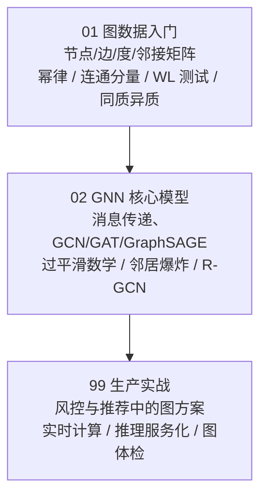

# 第 9 章：图神经网络 🕸️（关系）

> 世界不是一排排表格，而是一张张网：社交关系、分子结构、路网、用户-物品交互、知识图谱、欺诈团伙……这些数据的重点不在单个点，而在**点和点怎么连**。CNN 和 RNN 都吃不下这种数据——图没有固定顺序、大小可变、每个节点的邻居数都不一样。图神经网络（GNN, Graph Neural Network）用一个朴素到惊人的思想解决它：**每个节点反复"听邻居的、更新自己的"**，几轮之后，每个节点就携带着它周围结构的信息了。本章小而精：一页认识图数据（含真实图的四个脾气：幂律、断裂、同构难题、同质异质），一页吃透核心模型（消息传递、过平滑与邻居爆炸两面墙），一页看真实生产。

[⬆️ 返回总目录](../../../README.md) · [⬆️ 返回本篇](../README.md)

## 🗺️ 本章知识树

## 🕸️ 图无处不在

| 场景 | 节点 | 边 | 典型问题 |
|------|------|------|---------|
| 社交网络 | 用户 | 关注 / 好友 | 猜你可能认识谁、找意见领袖 |
| 分子结构 | 原子 | 化学键 | 判断分子有无药性（药物发现） |
| 路网交通 | 路口 | 道路 | 估计到达时间、路径规划 |
| 推荐系统 | 用户 / 物品 | 点击 / 购买 | 召回与排序（第 8 章的老朋友） |
| 知识图谱 | 实体 | 关系 | 问答、关系补全 |
| 金融风控 | 账户 | 共享设备 / 地址 | 识别欺诈团伙 |

## 🚧 为什么 CNN / RNN 吃不下图

- **无固定顺序**：图的节点没有"第 1 个、第 2 个"之说——打乱编号，图还是那张图，但普通网络的输入却全变了；
- **大小可变**：一张图 3 个节点也行、300 万个节点也行，固定输入维度的模型没有天然接口；
- **邻居数不定**：有人粉丝千万、有人好友三人——每个节点"该看多少邻居"本身就是变量。

GNN 的回答是：不挑顺序、不挑大小，每个节点只做一件事——**反复听邻居的、更新自己的**。这个朴素动作配上神经网络的可学习性，就是本章全部内容的地基。

## 🧱 两面墙：读 GNN 前先记下的失效边界

- **过平滑**：每层消息传递数学上等于乘一次拉普拉斯平滑算子——节点间差异被逐层压缩，层数一深全图向量趋同，**GNN 只叠 2~3 层**的真正原因；
- **邻居爆炸**：两层全邻居的 mini-batch 要碰 $B(1 + \bar d + \bar d^2)$ 个节点，平均度 50、batch 512 就是上百万——**GraphSAGE 式每层固定采样**不是优化项，是大图训练的入场券；
- 再加一条理论天花板：**WL 测试**——消息传递 GNN 的表达能力上界，连"反复报数对暗号"都分不开的节点，再深的 GNN 也分不开。

## 🔗 与第 8 章的衔接

上一章的推荐系统里已经藏着图：用户和物品连出的二部图。协同过滤只用了"一度邻居"（谁和谁点过同样的东西），而 GNN 能看更远——"朋友的朋友喜欢什么""这个欺诈团伙共享了哪些设备"。如果你从[第 8 章](../08-推荐系统/README.md)过来，把 GNN 理解成"把协同过滤的邻居思想推广到任意关系、任意跳数"，就抓住了主线；[双塔召回](../08-推荐系统/03-双塔模型与向量召回.md)管"算得快"，图模型管"看得远"，工业系统里常是互补的两路。

## 📖 推荐阅读顺序

| 顺序 | 页面 | 难度 | 一句话说明 |
|------|------|------|-----------|
| 1 | [图数据入门](./01-图数据入门.md) | ⭐⭐ | 节点/边/度、邻接矩阵、三大任务；真实图的四个脾气：幂律度分布（富者愈富）、连通分量（图是断的）、WL 测试（同构难题=表达力锚点）、同质 vs 异质（邻居相似何时破产） |
| 2 | [GNN 核心模型](./02-GNN核心模型.md) | ⭐⭐⭐⭐ | 消息传递：一切 GNN 的发动机；GCN 从谱图卷积三步简化而来、过平滑的拉普拉斯推导、GAT 与 Transformer 注意力差异表、GraphSAGE 邻居爆炸实算、R-GCN 异构图一句 |
| 收官 | [生产实战](./99-生产实战.md) | ⭐⭐ | 风控团伙识别从 0 到 1：图特征与 GNN 怎么选、实时邻居聚合的延迟解法、全图离线 vs 子图实时推理、图数据质量三个检查点 |

## 🎯 读完本章你应该能

- 把一段关系数据画成图，写出邻接矩阵、算出每个节点的度；
- 说清图数据为什么让 CNN/RNN 为难（无固定顺序、大小可变、邻居数不定）；
- 用一张 5 节点小图**手推一轮消息传递**，并解释"层数 = 传播几跳"；
- 说出真实图的四个脾气及其工程后果：幂律（别用平均度、防热点）、断裂（分量单独处理）、同构难题（WL 上界）、异质性（先量同质率再上图方法）；
- 一句话区分 GCN、GAT、GraphSAGE，并说出过平滑的拉普拉斯平滑机理与邻居爆炸的组合爆炸实算；
- 知道真实生产中"图方案"大多是手工图特征 + GBDT，GNN 用在刀刃上，且每月要给图做"对齐率 / 边分布 / 孤立点"的体检。

## 🔗 与其他章节的关系

- **前置章节**：[第 4 章：深度学习基础](../../3-深度学习/04-深度学习基础/README.md)——GNN 是神经网络家族成员，训练流程同款；
- **上游章节**：[第 8 章：推荐系统](../08-推荐系统/README.md)——用户-物品交互就是一张图，图召回是双塔的补充；[注意力机制](../07-自然语言处理与LLM/02-Transformer与注意力机制.md)——GAT 把注意力搬进了图；
- **后续章节**：[第 12 章：生成模型与多模态](../../5-前沿与融合/12-生成模型与多模态/README.md)——图结构与生成模型在分子设计等前沿地带汇合。

---

[⬅️ 上一章：第 8 章：推荐系统](../08-推荐系统/README.md) · [返回总目录](../../../README.md) · [下一章：第 10 章：强化学习 ➡️](../10-强化学习/README.md)
