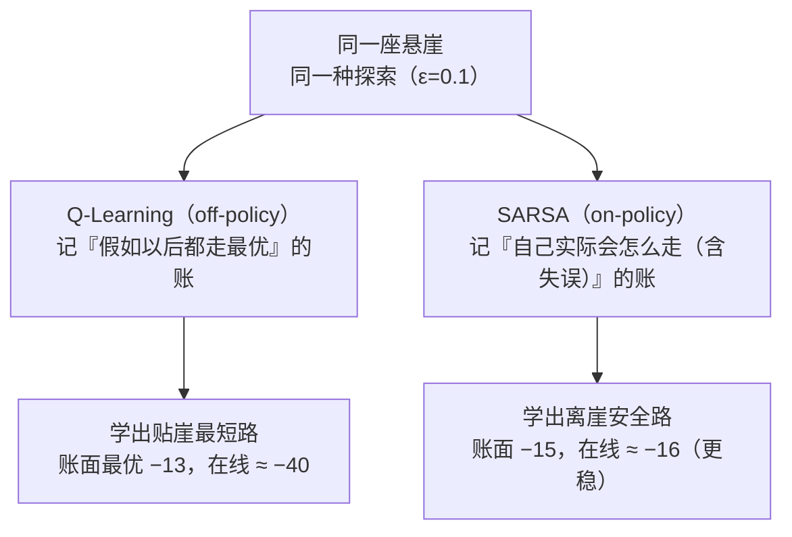

# 强化学习入门

> **一句话理解**：强化学习（Reinforcement Learning, RL）研究的是"没有标准答案、只有奖励信号"的学习——智能体（Agent）通过不断试错，学会在每一步选择能带来更多**长期奖励**的动作。

[⬆️ 返回总目录](../../../README.md) · [⬆️ 返回本篇](../README.md) · [⬅️ 返回本章目录](./README.md)

| 属性 | 说明 |
|------|------|
| 难度 | ⭐⭐⭐（较难） |
| 所属分支 | 强化学习 |
| 前置知识 | [概率与统计](../../1-起步准备/02-数学基础/04-概率与统计.md)（期望的概念）；[机器学习全景](../../2-经典机器学习/03-机器学习/01-机器学习全景.md)（了解三大范式） |

---

## 📌 这一节解决什么问题

监督学习的世界很温柔：每道题都附标准答案，预测错了，拿标签一对照就能修正。但有一大类问题天生没有"每一步的正确答案"：

- 下棋：这步棋好不好，要十步之后才见分晓——中间没有任何标签告诉你"刚才那步错了"；
- 机器人：迈这一步会不会摔，要等摔了才知道；
- 客服对话：这句话术好不好，要看对话最终有没有解决问题。

这类问题有两个共同特征：**反馈是延迟的**（好坏在很久之后才结算），且**动作会改变未来**（你走的每一步都改变了接下来面对的局面）。监督学习对它无能为力——不是标签不准，而是根本没有逐步的标签。

强化学习的思路是换个问法：不追问"正确动作是什么"，只给一个**奖励（Reward）信号**——做完了打个分。让智能体反复尝试，自己总结出"在什么局面下怎么做，长期总得分最高"。本节把 RL 的基本零件一次配齐：五要素、马尔可夫决策过程、回报与折扣因子、探索与利用、价值函数与贝尔曼方程，以及最经典的表格算法 Q-Learning；最后用同一座悬崖，看两种记账法（Q-Learning 与 SARSA）学出的两条完全不同的路线——这是理解后续所有算法分野的钥匙。

## 🌱 通俗理解

**训练小狗**。你不会给狗一本《握手标准教材》，而是：它抬爪了，给零食；没抬，没有。几轮之后，小狗自己"悟"出抬爪等于有吃的。强化学习训练的正是这种**从后果中学习**的能力——没人示范正确动作，只有奖励与冷清。

**和监督学习对比着记**：监督学习是照着答案抄（每道题后面都印着正确选项）；强化学习是考完不给你对错、只给总分，你还得自己回忆是哪几道题贡献了分、哪几道埋了雷。

**探索（Exploration）与利用（Exploitation）**：中午吃饭，去熟悉的老店稳拿 80 分（利用），偶尔试一家新店可能发现 95 分的宝藏，也可能踩到 40 分的雷（探索）。只利用会错过更好的，只探索会天天踩雷——RL 智能体一辈子都在做这道平衡题。

**两种"前景"**：下棋时我们会说"这个局面不错"（不管接下来怎么走的大势判断），也会说"这个局面下跳马这步好"（局面 + 具体一步的判断）。前者就是价值函数 V，后者就是 Q 函数——记住这对关系，后面的公式都不抽象。

**贝尔曼方程（Bellman Equation）= 记账要自洽**。把 Q 表想成一本账：每个格子的估值，应该恰好等于"立刻拿到的奖励 + 打个折的下一格最好估值"。哪一格对不上，就是账没记平；RL 学习的本质，就是一轮轮地**平账**，直到整本账完全自洽——这个"应该相等"的关系式就是贝尔曼方程，下文会完整推导它。

**两本账的记法（on-policy 与 off-policy）**：一类算法记"我实际执行的策略（连探索失误一起）值多少分"，叫同策略（on-policy）；另一类记"假如以后每步都走最优，这局面值多少分"，叫离策略（off-policy）。同一座悬崖，两种记法会学出**贴崖最短路**与**离崖安全路**两条路线（见核心原理第 7 条）——先记住这个悬念。

## 📋 举个例子

**1×4 走廊世界**：一条走廊四个格子，小狗从起点出发，只能左/右移动；撞墙原地不动；拿到宝箱游戏结束。每步移动奖励为 0，拿到宝箱一次性 +10。

```text
[起点 S0] → [空 S1] → [空 S2] → [宝箱 S3 +10]
```

我们手写一张 **Q 表**——一张"经验手册"，行是状态、列是动作，格子里的数是"在这个格子走这个方向，估计能拿多少总奖励"。开局全填 0：

| 状态 \ 动作 | 向左 | 向右 |
|------------|------|------|
| S0 起点 | 0 | 0 |
| S1 | 0 | 0 |
| S2 | 0 | 0 |
| S3 宝箱 | ——（终局） | ——（终局） |

设学习率 α=0.5、折扣因子 γ=0.9。**第一轮**：随机乱走，恰好一路向右捡到宝箱。按时间倒序更新（先改离奖励最近的那格）：

- 拿宝箱那步：Q(S2, 右) ← 0 + 0.5 × (10 + 0.9 × 0 − 0) = **5**（宝箱到手，手册开始值钱）
- 倒数第二步：Q(S1, 右) ← 0 + 0.5 × (0 + 0.9 × 5 − 0) = **2.25**（下格值 5，隔一步打个折）
- 起点步：Q(S0, 右) ← 0 + 0.5 × (0.9 × 2.25 − 0) ≈ **1.01**（好消息又往前传了一格）

**第二轮**：这次照手册走（贪心），仍然一路向右拿到宝箱，回头继续修正估值：

- Q(S2, 右) ← 5 + 0.5 × (10 − 5) = **7.5**
- Q(S1, 右) ← 2.25 + 0.5 × (0.9 × 7.5 − 2.25) = **4.5**
- Q(S0, 右) ← 1.01 + 0.5 × (0.9 × 4.5 − 1.01) ≈ **2.53**

两轮下来，"宝箱在这边"的信息像水波一样从 S2 一路传回 S0，而且每传一格打一次折。注意 Q(S, 左) 还是 0——向左从没带来好处，手册自然不给它估值。

**折扣因子手算**：站在 S0 看，宝箱要第 3 步才到手。关键规则：第 1 步的奖励不打折，第 k 步到手的奖励打 k−1 次折。所以这个宝箱折算到现在的价值是：

$$
0.9 \times 0.9 \times 10 = 8.1
$$

> 👉 **人话**：宝箱还是那个宝箱，但隔着 3 步拿，眼下只值 8.1 分——这就是未来的糖要打折。

这正是这张 Q 表最终会收敛到的 Q*(S0, 右) = 8.1（而不是 10）。

<details>
<summary>📊 展开看第三轮与收敛过程</summary>

第三轮照旧一路向右，继续"这次体验修正手册估值"：

- Q(S2, 右) ← 7.5 + 0.5 × (10 − 7.5) = **8.75**
- Q(S1, 右) ← 4.5 + 0.5 × (0.9 × 8.75 − 4.5) ≈ **6.19**
- Q(S0, 右) ← 2.53 + 0.5 × (0.9 × 6.19 − 2.53) ≈ **4.05**

第四轮：9.38 / 7.31 / 5.32……可以看到三个值在稳定爬升、涨幅收窄。收敛的终点由"真值方程"锁死：

- Q*(S2, 右) = 10（立刻拿宝箱）
- Q*(S1, 右) = 0 + 0.9 × Q*(S2) = 9
- Q*(S0, 右) = 0 + 0.9 × Q*(S1) = 8.1

每一轮更新都把估值往真值方向推一把（每次修正一半的差距），无限轮后恰好收敛到 10、9、8.1。表格 Q-Learning 在小世界里就是这么朴实：走一遍、改一笔，走多了手册就准了。

</details>

## 🧠 核心原理

### 整体流程

RL 的一切都发生在这个循环里——五要素：**状态（State）、动作（Action）、奖励（Reward）、新状态、（外加）策略**：


### 逐步拆解

**1. 马尔可夫决策过程（Markov Decision Process, MDP）**。RL 问题的标准数学外衣。核心是**马尔可夫性**：未来只取决于**现在的状态与动作**，与"你是怎么走到现在的"无关。就像跳棋走到某个局面后，最好的下一步只由当前棋盘决定——不用管前面十步是谁走的。这个假设让我们能只盯"当前状态"做决策，问题一下子简单了。

**2. 回报与折扣因子（Discount Factor）γ**。智能体追求的不是眼前一步的奖励，而是**回报（Return）**——未来所有奖励的折扣总和：

$$
G_t = r_{t+1} + \gamma r_{t+2} + \gamma^2 r_{t+3} + \cdots
$$

> 👉 **人话**：把未来的奖励一路打折不"原价"计入今天的账。γ=0 是只顾眼前的月光族；γ 越接近 1 越有远见，但远见太满（γ=1）时无限未来的收益加起来可能没完没了。γ 在 0.9~0.99 是常见取值。

**3. 价值函数、Q 函数与贝尔曼方程**。把"前景"写成期望：

$$
V(s) = \mathbb{E}\left[\, G_t \mid s_t = s \,\right]
$$

> 👉 **人话**：V 是"局面前景分"——站在状态 s，按以后的策略走下去，平均能拿多少总奖励。

$$
Q(s, a) = \mathbb{E}\left[\, G_t \mid s_t = s,\ a_t = a \,\right]
$$

> 👉 **人话**：Q 是"局面 + 这一步的前景分"——在状态 s 偏偏走了动作 a，之后平均能拿多少。有了 Q，决策就变成查表挑最大：a* = argmax Q(s, ·)。

现在把上面两个定义与回报的递归结构拼起来，就得到全章的主角——**贝尔曼方程**（这里写"策略 π 下"的版本）：

$$
V^\pi(s) = \mathbb{E}\left[\, r_{t+1} + \gamma V^\pi(s_{t+1}) \mid s_t = s \,\right]
$$

> 👉 **人话**：账本自洽——"这个局面的估值"应该等于"立刻拿到的奖励 + 打个折的下一局面估值"。左边是账上记的，右边是按规则重算的应然值；两边不等 = 账没记平。

对最优策略（每步都挑最好的），期望里的"按 π 走"换成"挑最大"，得到贝尔曼**最优**方程——Q-Learning 学的就是它的解：

$$
Q^*(s, a) = \mathbb{E}\left[\, r + \gamma \max_{a'} Q^*(s', a') \,\right]
$$

> 👉 **人话**：走完 (s, a) 这一步的真实价值 = 立刻的奖励 + 打折后的"下一局面挑最好走法的价值"。"账本"的读法贯穿始终：**解方程 = 找一套两边完全对得上的账；迭代算法 = 拿右边不断改写左边，直到改不动。**

<details>
<summary>🧮 展开完整推导：贝尔曼方程——期望的嵌套展开</summary>

**目标**：从定义 $V^\pi(s) = \mathbb{E}[\, G_t \mid s_t = s \,]$ 出发，推出"只看相邻两步"的递归式。

**第一步：把回报写成递归**。按定义展开 $G_t$ 并把尾巴认出来：

$$
G_t = r_{t+1} + \gamma r_{t+2} + \gamma^2 r_{t+3} + \cdots = r_{t+1} + \gamma \left( r_{t+2} + \gamma r_{t+3} + \cdots \right) = r_{t+1} + \gamma G_{t+1}
$$

**第二步：代入期望**：

$$
V^\pi(s) = \mathbb{E}\left[\, r_{t+1} + \gamma G_{t+1} \mid s_t = s \,\right]
$$

**第三步：期望的线性性**（和的期望 = 期望的和）：

$$
V^\pi(s) = \mathbb{E}\left[\, r_{t+1} \mid s_t = s \,\right] + \gamma\, \mathbb{E}\left[\, G_{t+1} \mid s_t = s \,\right]
$$

**第四步：全期望公式（塔性质）**——中间隔了一层"下一状态 $s_{t+1}$"，先对它分解：

$$
\mathbb{E}\left[\, G_{t+1} \mid s_t = s \,\right] = \sum_{s'} P(s' \mid s)\, \mathbb{E}\left[\, G_{t+1} \mid s_{t+1} = s' \,\right] = \sum_{s'} P(s' \mid s)\, V^\pi(s')
$$

这一步正是**马尔可夫性入场的地方**：给定 $s_{t+1}$ 之后，未来的分布与"怎么到达的"（即 $s_t$）无关，所以条件期望里可以扔掉 $s_t$、只留 $V^\pi(s')$。若没有马尔可夫性，账本必须记整段历史——问题就回到天文数字。

**第五步：显式写出策略与转移**。$r_{t+1}$ 与 $s'$ 都由"选了哪个动作、环境怎么转移"决定，把两层随机性都展开：

$$
V^\pi(s) = \sum_a \pi(a \mid s) \sum_{s'} P(s' \mid s, a)\left[\, r(s, a, s') + \gamma V^\pi(s') \,\right]
$$

这就是**贝尔曼期望方程**的完整形态。对 Q 函数做同样五步，得：

$$
Q^\pi(s, a) = \sum_{s'} P(s' \mid s, a)\left[\, r(s, a, s') + \gamma \sum_{a'} \pi(a' \mid s')\, Q^\pi(s', a') \,\right]
$$

把"按 π 选"换成"挑最大"即得最优版：$Q^*(s,a) = \sum_{s'} P(s' \mid s,a)\left[\, r + \gamma \max_{a'} Q^*(s', a') \,\right]$。

**用走廊验算**：走廊里转移是确定的（向右必到下一格），求和只剩一项：

- Q*(S2, 右) = 10（宝箱立刻到手）
- Q*(S1, 右) = 0 + 0.9 × 10 = **9**
- Q*(S0, 右) = 0 + 0.9 × 9 = **8.1**

与"举个例子"一节手算收敛的终点 10、9、8.1 分毫不差——方程锁死的，正是那张 Q 表一步步爬向的终点。

</details>

**4. 探索与利用：从 ε-贪婪到更聪明的探索**。最简单常用的平衡法是 **ε-贪婪（ε-greedy）**：以小概率 ε 随机挑动作（探索新店），其余时候选当前 Q 值最大的动作（去老店）。通常让 ε 从 1.0 随训练慢慢衰减到 0.05 左右——开局多闯，后期守成。它不是唯一的探索法，三种主流打法摆在一起看：

| 探索策略 | 一句话机制 | 优点 | 软肋 |
|----------|-----------|------|------|
| ε-贪婪（带衰减） | 小概率完全随机，ε 随训练衰减 | 简单、百搭、够用 | 探索无差别——最烂的动作也被无限次白试 |
| 上置信界（UCB, Upper Confidence Bound） | 优先试"估值高 **或** 不确定性大"的动作 | 把探索预算花在刀刃上 | 适合小离散动作集；连续/高维动作不好算 |
| 熵正则（Entropy Regularization） | 给策略的"多样性"（熵）发奖金，过早收敛要罚钱 | 与策略梯度天然配套（如 SAC） | 温度系数要调；和 ε-贪婪不能叠加乱用 |

UCB 的选择规则长这样（表格情形）：

$$
a_t = \arg\max_a \left[\, Q(a) + c\,\sqrt{\frac{\ln N}{N(a)}} \,\right]
$$

> 👉 **人话**：第二项是"不确定度津贴"——某个动作没怎么试过（N(a) 小），津贴就大，值得先去看看；试得多了津贴自动缩水，大家老实按估值排队。一句话：**不确定的地方优先探索**。熵正则一句话：策略分布太"自信"就扣分，逼它保留多样性和后劲。

**5. Q-Learning：贝尔曼更新（Bellman Update）**。Q 表怎么从全 0 变成"经验手册"？每走一步做一次修正：

$$
Q(s, a) \leftarrow Q(s, a) + \alpha \left[\, r + \gamma \max_{a'} Q(s', a') - Q(s, a) \,\right]
$$

> 👉 **人话**：这次亲身体验算出的估值是"r + γ × 下一局面的最好前景"（方括号里的部分叫 TD 目标）；拿它跟手册上的旧估值一比，差多少就按学习率 α 修正多少——**用这次体验回头修正手册**，而不是整个推翻重来。对照贝尔曼最优方程看：更新式的右边正是方程的右边，只不过把全概率求和换成了"这次实际采到的样本"——**一次更新 = 用一个样本给方程右边做一次估计**。

<details>
<summary>🧮 展开看：Q-Learning 收敛的条件，以及现实中哪里凑不齐</summary>

**定理（Watkins & Dayan, 1992）**：满足以下三条，表格 Q-Learning 以概率 1 收敛到最优 $Q^*$：

1. **表格式**：每个 (s, a) 有独立一格，一格的更新不牵连别格；
2. **充分探索**：每个 (s, a) 被无限次访问（ε-贪婪的 ε 衰减别太快即可保证）；
3. **学习率衰减**：$\sum_k \alpha_k = \infty$ 且 $\sum_k \alpha_k^2 < \infty$（步子要一直迈但越迈越小，例如 α_k = 1/k）。

**三点直觉**（对应走廊例子，说明为什么更新会往真值走）：

1. **信息从奖励往回流**。离奖励最近的状态最先被更新准（S2 直接看到 +10），然后 S1、S0 逐轮把"下游已准的估值"搬运过来——就像走廊例子里水波一样的传播。
2. **更新是"向真值靠近一步"**。只要下一状态的估值 Q(s', a') 已经是对的，这次更新就把 Q(s, a) 往它的真值拉 α 比例的距离。数学上这叫压缩映射，反复应用必然收敛到唯一的解（最优 Q 函数 Q*）。
3. **探索保证每个格子都被喂到数据**。ε-贪婪保证理论上任何 (s, a) 都有无限次被访问的机会，不会出现手册里永远空着的角落。

**现实中哪里凑不齐**——三条各有现实的坎：

- **表格式凑不齐**：围棋、图像状态动辄天文数字，表格装不下 → 换神经网络近似 Q，收敛保证**当场失效**（函数逼近下的发散风险见下一节的"致命三件套"）；
- **无限访问凑不齐**：贵环境（真实机器人、在线系统）每试一次都是真金白银 → 只能妥协为"覆盖关键状态"，账本永远有没喂饱的角落；
- **学习率衰减凑不齐**：工程惯用固定小 α（如 0.1），且环境本身常非平稳（对手在换、用户在变）→ 表不再收敛，而是永远小幅抖动地"追踪"当下。

所以定理画的是理想国；工程师的日常是在凑不齐的地方装护栏（下一节的两件稳定器、99 页的护栏指标，全是护栏）。

</details>

**6. 上帝视角的两种解法：值迭代 vs 策略迭代**。如果**已知**转移概率 P 和奖励 r（术语叫"有模型"），不用试错也能解贝尔曼方程——动态规划（Dynamic Programming）的两条路：

$$
V(s) \leftarrow \max_a \sum_{s'} P(s' \mid s, a)\left[\, r(s, a, s') + \gamma V(s') \,\right] \qquad \text{（值迭代，反复扫全表直到不动点）}
$$

> 👉 **人话**：拿"旧账"算"新账"——每一格都用贝尔曼最优方程右边重算一遍，扫完一轮再扫一轮，直到全表改不动（不动点 = 方程的解 = 账平了）。

| | 值迭代（Value Iteration） | 策略迭代（Policy Iteration） |
|--|--------------------------|------------------------------|
| 思路 | 反复用贝尔曼最优算子改写 V，直到不动点 | 两步循环：①评估当前策略的 V^π（解方程）②对 V^π 贪心改进策略 |
| 单轮成本 | 便宜（全表扫一遍） | 贵（策略评估要解线性方程组） |
| 收敛轮数 | 多（每轮只前进一点） | 极少（经验上常 2~5 轮策略就不再变） |
| 适用 | 状态多、内存紧 | 状态少、要快 |
| 与本节算法的关系 | **Q-Learning ≈ 不知道 P 时的采样版值迭代**（max 结构一模一样） | SARSA ≈ 策略评估的采样版；两条思路的混血统称广义策略迭代（GPI） |

一句话记住分工：值迭代"边走边把值逼到最优"，策略迭代"先把当前策略的账算清、再换更好的策略"。两者都是上帝视角（要知道 P）；RL 的意义恰恰是**不知道 P 时，靠试错的样本来解同一组方程**。

**7. on-policy vs off-policy：同一座悬崖，两条路**。把 Q-Learning 更新式里的 max 换成"下一步**实际执行**的动作 a'"，就得到它的孪生兄弟 SARSA：

$$
Q(s, a) \leftarrow Q(s, a) + \alpha \left[\, r + \gamma\, Q(s', a') - Q(s, a) \,\right] \quad \text{（} a' \text{ 由同一个 ε-贪婪策略选出，含随机失误）}
$$

> 👉 **人话**：Q-Learning 记账时假设"到了下一局面我会挑最好的"（max）；SARSA 记账时如实记"我下一步（连同探索失误）打算怎么走"。一个记**理想账**，一个记**实账**。

差别看似一行，后果是路线级的。回到动手环节那座悬崖（4×12 网格，贴着悬崖走最短 13 步、离崖一行走 15 步，掉崖 −100 并回起点）：

```text
Q-Learning 学到的贴崖最短路          SARSA 学到的离崖安全路
（贪心 13 步，回报 -13）              （贪心 15 步，回报 -15）

. . . . . . . . . . . .            . . . . . . . . . . . .
. . . . . . . . . . . .            o o o o o o o o o o o o   ← 沿第二排平移
o . o o o o o o o o o .            . . . . . . . . . . . .
S C C C C C C C C C C G            S C C C C C C C C C C G
↑ 只有开头结尾碰到底边                ↑ 全程离悬崖一格
```

为什么差这么多？做一笔**含探索噪声的期望账**（ε=0.1，每步随机动作中"向下"的概率 = ε × 1/4 = 0.025）：

| | 学到的路线 | 贪心执行回报 | 含探索噪声的在线期望（粗算） |
|--|-----------|-------------|------------------------------|
| Q-Learning | 贴崖最短路（13 步，其中 11 步贴崖） | −13 | 每步 2.5% 掉崖：−13 − 11×0.025×100 ≈ **−40** |
| SARSA | 离崖安全路（15 步） | −15 | 要连续错两次才掉崖（概率约 0.025²）：≈ **−16** |

- **SARSA 把"自己会犯的错"记进了账**：贴崖那 11 步的估值被"探索噪声可能掉下去"持续拉低，学来学去账本指向离崖一行——在线真跑反而更划算；
- **Q-Learning 的账不掺探索噪声**：它始终回答"假如以后每步都走最优，值多少"，所以学到纸面最优的贴崖路——贪心执行确实 −13，但带探索真跑期望 ≈ −40。



两种记法没有绝对优劣，各有战略位置：

| | Q-Learning（off-policy 离策略） | SARSA（on-policy 同策略） |
|--|----------------------------------|----------------------------|
| 更新目标 | 假设以后每步都走最优（max） | 以后按实际执行的策略（含探索）走 |
| 学出的行为 | 纸面最优、敢贴危险边缘 | 稳妥保守、绕开危险 |
| 在线表现 | 探索噪声会踩雷，波动大 | 把失误算进账，更平稳 |
| 数据能否复用 | **能**：可以拿旧策略/别人策略的数据学最优（经验回放、离线 RL 的根基） | 只能学自己当前策略采的数据，用完即弃 |
| 一句话 | 学"世界的最优解" | 学"执行起来最划算的解" |

> 👉 **人话**：训练时想稳定、执行时还想带探索 → on-policy 更贴心；想复用历史数据、学别人经验 → off-policy 不可替代。下一节 DQN 的经验回放、99 页的离线 RL，全都建立在 off-policy 这块地基上。

## 💻 动手试试

用 numpy 手写 Q-Learning，解决 gymnasium 内置的**悬崖行走（CliffWalking）**：4×12 网格，左下角出发、右下角到终点，中间一排是悬崖（掉下去 −100 并回到起点），每走一步 −1——所以最优策略是绕开悬崖的最短路径。

```python
# 最小可运行 Q-Learning：悬崖行走
# 先安装：pip install gymnasium numpy
import numpy as np
import gymnasium as gym

env = gym.make("CliffWalking-v1")   # 48 个状态（4×12 网格）× 4 个动作（上/右/下/左）；旧版 gymnasium 用 CliffWalking-v0
q = np.zeros((env.observation_space.n, env.action_space.n))  # Q 表 = 经验手册
alpha, gamma, eps = 0.1, 0.99, 0.1  # 学习率 / 折扣因子 / 探索概率

for ep in range(800):
    s, _ = env.reset()
    done = False
    while not done:
        # ε-贪婪：小概率随机探索，其余照手册选最优
        a = env.action_space.sample() if np.random.rand() < eps else int(np.argmax(q[s]))
        s2, r, term, trunc, _ = env.step(a)
        done = term or trunc
        # 贝尔曼更新：用这次体验修正手册里 Q(s, a) 的估值
        q[s, a] += alpha * (r + gamma * np.max(q[s2]) * (not done) - q[s, a])
        s = s2

def run_once(q):
    """按 Q 表贪心走一局，返回总奖励"""
    s, _ = env.reset()
    total = 0
    for _ in range(300):
        s, r, term, trunc, _ = env.step(int(np.argmax(q[s])))
        total += r
        if term or trunc:
            break
    return total

def show_path(q):
    """把路线画在网格上：S 起点 / G 终点 / C 悬崖 / o 走过的格子"""
    s, _ = env.reset()
    path = {s}
    for _ in range(300):
        s, _, term, trunc, _ = env.step(int(np.argmax(q[s])))
        path.add(s)
        if term or trunc:
            break
    for row in range(4):
        print("".join("S" if p == 36 else "G" if p == 47 else "C" if 37 <= p <= 46
                      else "o" if p in path else "." for p in range(row * 12, row * 12 + 12)))

print("学习前（Q 全 0，永远向上）总奖励：", run_once(np.zeros_like(q)))
print("学习后（贪心走）总奖励：", run_once(q))
show_path(q)
```

预期输出（学习前的策略是 Q 全 0 时 argmax 恒为"向上"，会在角落原地打转、走满步数上限；学习后学会先向上、再沿第二排平移绕开悬崖的 13 步最优路线）：

```text
学习前（Q 全 0，永远向上）总奖励： -300
学习后（贪心走）总奖励： -13
............
............
oooooooooooo
SCCCCCCCCCCG
```

可以看到：智能体没有被告知任何"路线"，800 局试错后，Q 表里自己长出了一条绕开悬崖的路。

**改什么参数、看什么变化**（每改一处，重点观察一个现象）：

| 改动 | 预期现象 | 在验证什么 |
|------|----------|-----------|
| `eps` 0.1 → 0 | 收敛明显变慢，甚至卡死在局部 | 没有探索，手册的空白格永远空着 |
| `eps` 0.1 → 0.3 | 学习更慢、最终成绩变差 | 探索太多 = 天天踩雷，浪费预算 |
| `gamma` 0.99 → 0.5 | 学不动（−100 的远处后果传不回来） | 折扣太狠 = 近视，掉崖的痛记不长 |
| `alpha` 0.1 → 0.9 | 数值大幅震荡、可能不收敛 | 步子太大，一次样本就把账改过头 |
| 把更新里的 `np.max(q[s2])` 换成 `q[s2, a2]`（a2 为下一步实际执行的动作，需在选动作时记下） | 得到 SARSA：打印 `show_path` 对比 | 路线应离悬崖更远、更保守——亲手复现"两条路" |

## 🔥 炼丹小灶

> 🔥 **炼丹小灶**：表格 Q-Learning 的工业界起点配方与玄学——
> - 配方：α=0.1~0.5、γ=0.9~0.99、ε 从 1.0 按 0.99/回合衰减到 0.05；先跑 500~1000 局看曲线。
> - 玄学：学不会先别怀疑算法——九成是奖励太稀疏（中间全是 0，信号传不回来）或 γ 设太小（远视变近视）；打印 Q 表热图看"信息流没流到"最管用。
> - ⚠️ 以上是经验参考值，不是圣旨；换环境请重新炼。

## 🔗 在知识树中的位置

- **上游**：建立在[概率与统计](../../1-起步准备/02-数学基础/04-概率与统计.md)（期望、条件概率）之上；与[机器学习全景](../../2-经典机器学习/03-机器学习/01-机器学习全景.md)中的监督/无监督范式并列，是第三种范式。
- **下游**：[深度强化学习](./02-深度强化学习.md)——状态爆炸时把 Q 表换成神经网络；[微调与对齐](../07-自然语言处理与LLM/05-微调与对齐.md)——RLHF 用奖励信号矫正大模型的行为。
- **横向对比**：

| | 监督学习 | 强化学习 |
|--|----------|----------|
| 反馈形式 | 每个样本都有标准答案 | 只有延迟的、评价性的奖励 |
| 数据来源 | 静态数据集，与模型行为无关 | 智能体自己"造"数据，动作改变后续数据分布 |
| 学到的东西 | 输入 → 输出的映射 | 状态 → 动作的决策（策略） |
| 典型任务 | 分类、回归 | 游戏、控制、对话策略、对齐 |

## ⚠️ 常见误区

- **误区一**："强化学习是深度学习的一个分支" → 强化学习是一种**学习范式**，与监督学习平行；它可以完全不用神经网络——本节的 Q 表就是纯表格。深度学习只是它的一种"函数逼近器"（下一节）。
- **误区二**："奖励就是标签" → 标签告诉你**正确值是什么**；奖励只告诉你**做得好不好**，既延迟又稀疏，从不直接指路。
- **误区三**："γ 越接近 1 越好" → γ=1 时无限远的奖励与眼前同权，回报可能发散，训练也更难收敛；γ 应反映问题的真实时间尺度。
- **误区四**："Q-Learning 学到最优 Q，执行起来就一定最好" → 最优是"贪心执行"意义下的最优；只要执行时还带探索噪声（ε 不为 0），危险环境里 Q-Learning 的路线就会踩雷——这正是悬崖对比例里 SARSA 在线反而更稳的原因。同理，"值迭代/策略迭代直接可用于真实环境"也不对：它们都要求已知转移概率 P（上帝视角），真实环境只能靠采样算法。

## 📝 小结与自测

**要点回顾**

- 强化学习面向"没有逐步标签、反馈延迟、动作改变未来"的决策问题，唯一信号是奖励
- MDP 假设未来只取决于当前状态与动作；回报 = 未来奖励的折扣和，γ 管眼前与未来的权衡
- 贝尔曼方程是"账本自洽"条件：一格的估值 = 立即奖励 + 打折后的下一格最优估值；解方程即平账，迭代算法都是"拿右边改写左边"
- 探索三打法：ε-贪婪（无差别随机+衰减）、UCB（不确定处优先）、熵正则（给多样性发奖金）；V 是局面前景，Q 是"局面 + 这一步"的前景
- Q-Learning 收敛要凑齐"表格 + 充分探索 + 学习率衰减"三条，现实中各有凑不齐的地方；上帝视角另有值迭代/策略迭代两条动态规划路
- on-policy（SARSA）记实账学稳妥路，off-policy（Q-Learning）记理想账学最短路且能复用数据——同一座悬崖，两条路线，各有战略位置

**自测一下**（点击展开答案）

<details>
<summary>问题 1：Q-Learning 更新公式里的 max 为什么要取"下一状态所有动作中的最大值"？</summary>

因为更新时假设：到了下一状态 s' 之后会**按当前手册贪心行事**，所以 s' 的前景应取 Q(s', ·) 里最好的一条路。这也正是 Q-Learning 能学出最优策略（而非"当前策略的策略"）的关键——它直接在"以后都走最优"的假设下估值。

</details>

<details>
<summary>问题 2：γ=0.5 时，第 3 步才到手的 +10 奖励，折算到现在值多少？</summary>

按"第 k 步到手的奖励打 k−1 次折"：0.5 × 0.5 × 10 = **2.5**。对比 γ=0.9 时的 8.1，可以看到 γ 越小，智能体越"近视"——3 步外的宝箱几乎不值得奔走。

</details>

<details>
<summary>问题 3：悬崖环境里 ε=0.1，为什么 SARSA 学出的路线反而比"最优路线"离悬崖更远？在线总奖励谁高？</summary>

因为 SARSA 记的是"实际执行的策略（含探索失误）"的账：贴崖行走时每步有 ε × 1/4 = 2.5% 的概率随机选到"向下"直接掉崖（−100），11 步贴崖的期望代价约 −27.5，把贴崖路的估值拉到 −40 以下；离崖一行要连续错两次才会掉崖，期望 ≈ −16。于是 SARSA 的账本指向安全路，**在线期望回报（约 −16）远高于 Q-Learning（约 −40）**。Q-Learning 学的仍是纸面最优（贪心 −13），但它不管"执行时你会手抖"这件事。

</details>

## 📚 延伸阅读

- 教材：Sutton & Barto《Reinforcement Learning: An Introduction》（第二版，网上免费）——第 1~6 章对应本节与下一节内容；第 6.4~6.7 节正是悬崖上的 Q-Learning vs SARSA 对比实验
- 论文：Watkins & Dayan《Q-learning》(1992)——Q-Learning 收敛证明的经典出处（进阶）
- 文档：[Gymnasium 官方文档](https://gymnasium.farama.org/)——环境的安装与内置环境列表
- 课程：David Silver《RL Course》（视频可在网上找到）——前几讲与本节数学完全对应

---

[⬅️ 上一页：本章导览](./README.md) · [返回本章目录](./README.md) · [下一页：深度强化学习 ➡️](./02-深度强化学习.md)
