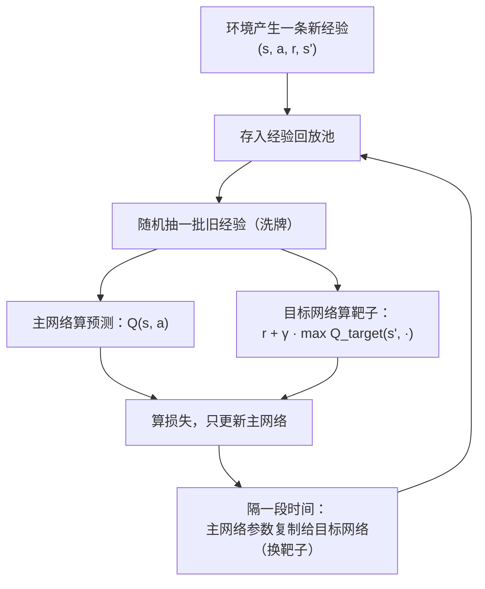
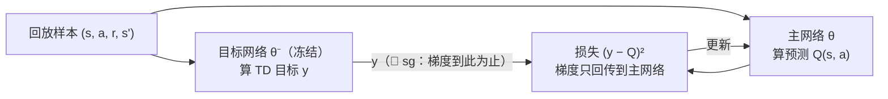
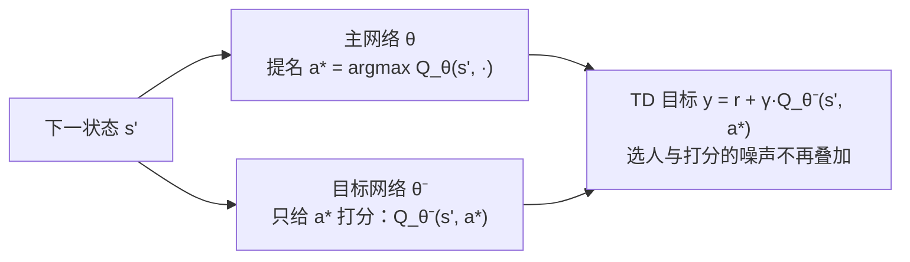

# 深度强化学习

> **一句话理解**：当状态多到任何表格都记不下时，就用神经网络代替 Q 表来"估分"——这就是深度强化学习（Deep Reinforcement Learning, DRL），再加上"直接学怎么行动"的策略梯度路线，构成了从 Atari 游戏到大模型对齐的全部地基。

[⬆️ 返回总目录](../../../README.md) · [⬆️ 返回本篇](../README.md) · [⬅️ 返回本章目录](./README.md)

| 属性 | 说明 |
|------|------|
| 难度 | ⭐⭐⭐⭐（高阶） |
| 所属分支 | 强化学习 |
| 前置知识 | [强化学习入门](./01-强化学习入门.md)；[神经网络是怎么炼成的](../../3-深度学习/04-深度学习基础/01-神经网络是怎么炼成的.md) |

---

## 📌 这一节解决什么问题

上一节的 Q 表在小走廊里很好用，但真实世界的状态空间会爆炸：围棋棋局约有 $10^{170}$ 种局面，比可观测宇宙的原子数（约 $10^{80}$）还多——**给每个局面留一个表格格子，宇宙里没有那么多原子来存它**。更糟的是图像输入：机器人摄像头的每一帧都是一个连续状态，连"枚举"都做不到。

思路顺理成章：表格存不下，就学一个**函数**来近似它——输入状态（棋盘、图像），输出每个动作的 Q 值。函数逼近器用什么呢？神经网络。但把"Q 表 + 神经网络"直接拼起来训练，几乎必定崩溃——本节的核心就是理解**为什么会崩**（三块病根：目标值带梯度、max 的系统性过估计、样本相关 + 追逐自己的尾巴），以及对应的三个药方（stop-gradient、Double DQN、两个稳定器）；随后介绍另一条"不学打分、直接学行动"的路线：策略梯度与它的集大成者 PPO——把 clip 目标、Actor-Critic 的偏差-方差权衡、优势标准化这些工业级细节一次讲透。

## 🌱 通俗理解

**从手册到直觉**。Q 表是一本逐条登记的经验手册："3×7 走廊第 5 格向右 = 2.3 分"。局面多了，手册厚到写不下，但老司机不需要手册——看一眼路况就**估**出个大概，因为他见过太多相似局面，学会了"举一反三"。神经网络就是那个"见过相似局面就能估分"的老司机。

**两个稳定器，对应两个翻车现场**：

- **经验回放（Experience Replay）= 复盘旧局**。刚下的这盘棋和上一盘高度相似，逐条学会被最近几步带偏（学完新的忘了旧的，还越学越钻牛角尖）。解法：把每一步经历存进池子，训练时**随机抽旧局复盘**——像洗牌，打碎时间上的相关性，同一份经历还能反复用。
- **目标网络（Target Network）= 盯一个稳定的靶子**。训练要朝"TD 目标"逼近，可这个靶子由同一张网络自己算出来——网络一动靶子跟着动，等于**追着自己的尾巴跑**，越追越晕。解法：复制一份网络专门当靶子，参数冻结；每隔一段时间才把最新的参数慢慢换过去。靶子稳了，学的人才能瞄得准。

**目标值不能带梯度 = 考试答案不该被抄进笔记**。TD 目标（靶子）是"标准答案"，主网络是"你的笔记"。训练的本意是让笔记学会解题；可如果答案那头也连着梯度（答案允许被你改），最省力的作弊方式就是**把答案和笔记一起改成同一个数**——表面 loss 归零，实际什么都没学会。所以工程上要给目标值显式挂一道"禁止梯度通过"的闸（stop-gradient / detach），下面核心原理第 1 条展开。

**Double DQN = 选人与打分分家**。max 这一步天然"只记好话"：从几个带噪声的估值里挑最大，挑中的多半是"噪声让它虚高"的那个——系统性高估。解法：让主网络**选**哪个动作最好，让目标网络给这个动作**打分**——两种乐观不再叠加在同一次 max 上。

**策略梯度（Policy Gradient）路线**。值函数路线是"先给每个动作打分再挑分高的"；策略梯度干脆**不打分，直接学怎么出招**——网络输出就是"各动作的概率"，好用的动作概率越练越大。像练肌肉记忆：不解释为什么，直接把正确动作练成本能。好处是对连续动作（机械臂关节转多少度）天然友好。Actor-Critic 让"练动作的演员"和"打分的评论家"同台：评论家给演员每一步的表演算"比平均好多少"（优势），演员照着这个信号练——评论家降了方差，也带来了偏差，这组权衡是本节的一条暗线。

**PPO（Proximal Policy Optimization）= 稳健小步走**。策略梯度怕的就是"一步迈太大"：一次更新过猛，策略突然变差，采到的数据也跟着变差，越学越崩。PPO 的做法是**限制每次更新的幅度**——新旧策略的概率比一旦偏离安全区间就"剪断"奖励，逼着策略只能小步改进。稳健、好调、省心，让它成了工业界最常用的 RL 算法。

## 📋 举个例子

**把 Q 表换成网络后，长什么样？** 以小车立杆（CartPole）为例，对比两张"表"：

| | Q 表时代（悬崖行走） | 网络时代（小车立杆） |
|--|---------------------|---------------------|
| 输入状态 | 离散编号 0~47（网格坐标） | 4 维向量：[车位置, 车速度, 杆角度, 角速度] |
| 存储 | 48 × 4 的表格，逐格存数 | 一个 4→32→2 的小网络（几百个参数） |
| 输出 | 查表得到该行 4 个 Q 值 | 前向传播得到 2 个 Q 值：[向左推的分, 向右推的分] |
| 泛化 | 没见过的格子 = 空白 | 相似状态自动给出相似估值（举一反三） |

**DQN 一次经验回放批长什么样？** 训练时不是用刚发生的这一步，而是从池子里随机抽一批（比如 32 条）"陈年旧账"：

| # | 状态 s | 动作 a | 奖励 r | 新状态 s' | 是否结束 |
|---|--------|--------|--------|-----------|----------|
| 1 | [ 0.02, -0.31, 0.05, 0.42] | 向左 | 1.0 | [-0.04, -0.16, 0.13, 0.37] | 否 |
| 2 | [-0.11, 0.22, -0.08, -0.35] | 向右 | 1.0 | [-0.07, 0.05, -0.02, -0.12] | 否 |
| 3 | [ 0.05, 0.11, 0.21, 0.55] | 向右 | 1.0 | [ 0.07, 0.29, 0.22, 0.71] | 否（杆快倒了） |
| … | … | … | … | … | … |
| 32 | [-0.02, -0.08, 0.03, 0.10] | 向左 | 1.0 | [ 0.00, 0.05, 0.04, 0.09] | 否 |

关键在于这 32 条**来自不同回合、甚至几百回合之前的旧局**——时间上不相邻、相关性被打碎，对网络来说这就是一批干净的独立样本，可以像监督学习那样做小批量梯度下降。

**max 的过估计小算例（Double DQN 的动机）**。设某状态有两个动作，真值都是 10 分，网络估值各带 ±3 的随机噪声。抽一次样：

| | 动作 1 估值 | 动作 2 估值 | TD 目标里的 max |
|--|-----------|-----------|-----------------|
| 第 1 次抽样 | 13.1 | 8.6 | **13.1**（虚高 3.1） |
| 第 2 次抽样 | 9.8 | 12.4 | **12.4**（虚高 2.4） |
| 第 3 次抽样 | 11.5 | 10.2 | **11.5**（虚高 1.5） |
| 无限次平均 | ≈ 10 | ≈ 10 | ≈ **11.7**（稳定虚高） |

哪怕两个动作一样好、噪声完全对称，max 也**只吃正向误差**：抽到偏高的它收下，抽到偏低的它视而不见。两个独立正态噪声的最大值期望约比真值高 $3 \times 0.56 \approx 1.7$ 分——偏差不是运气，是 max 的出厂设置（数学见核心原理第 2 条）。

<details>
<summary>📊 展开看：PPO 为什么在 RLHF 里被选中</summary>

大模型对齐用的 RLHF（人类反馈强化学习，Reinforcement Learning from Human Feedback），本质是对"大模型输出文本"这个动作空间做策略优化，PPO 被选中主要靠三点：

1. **更新稳**。RLHF 里被优化的对象是一个花了巨资训好的语言模型——一次过猛的更新就可能把它"训坏"（话都说不利索，只会讨好奖励模型）。PPO 的裁剪机制限制每步更新幅度，恰好是"别把传家宝砸了"的保险丝。
2. **样本利用温和**。PPO 对超参宽容、训练曲线平稳，这在工程上比"理论最优但一碰就碎"的算法值钱得多。
3. **配套成熟**。PPO 与"奖励模型 + 价值模型 + 旧模型约束（KL 惩罚）"的流水线多年磨合，成了事实标准；后续变体也是沿着"更稳的小步走"这条路演进。

一句话：RLHF 选 PPO 不是因为它某项指标最强，而是因为它**最不容易把模型训坏**。

</details>

## 🧠 核心原理

### 整体流程

DQN 的一次训练循环——注意两个稳定器分别卡在哪两个位置：



### 逐步拆解

**1. 用网络近似 Q：损失函数与"答案不许抄进笔记"**。记网络参数为 θ，拟合目标就是上一节的贝尔曼方程。把"靶子"显式写成 $y$，并用 $\mathrm{sg}[\cdot]$（stop-gradient，停止梯度）标记**梯度不许通过的位置**：

$$
y = \mathrm{sg}\left[\, r + \gamma \max_{a'} Q_{\theta^-}(s', a') \,\right], \qquad L(\theta) = \mathbb{E}\left[\, \left( y - Q_{\theta}(s, a) \right)^2 \,\right]
$$

> 👉 **人话**：预测值是主网络给"这步动作"打的分；目标值（靶子）是"实际奖励 + 目标网络给下一局面估的最好前景"。让两者的平方差越小越好——但**梯度只许流向主网络（预测侧）**，$\mathrm{sg}[\cdot]$ 那道闸把目标侧拦死：答案（靶子）是印好的，笔记（主网络）负责学会怎么算。



<details>
<summary>🧮 展开推导：目标值为什么绝对不能带梯度（自我实现的答案）</summary>

假设偷懒直接写 $L(\theta) = \mathbb{E}\left[\left( r + \gamma \max_{a'} Q_\theta(s', a') - Q_\theta(s, a) \right)^2\right]$（同一张网、两端都带梯度），看优化器会怎么"作弊"。

**作弊路径一：两边一起塌**。最小化 $(\text{靶子} - \text{预测})^2$ 有两条路：要么预测追上靶子（学习），要么**靶子下来迎预测**（作弊）。当 γ 接近 1 时，把 $Q_\theta(s')$ 和 $Q_\theta(s)$ 一起压向 $r/(1-\gamma)$ 一类的"共同退化值"（极端情形：都压向眼前奖励 r），loss 同样能降——网络没有动机选辛苦的那条路。这就是"把考试答案抄进笔记"：答案与笔记永远一致，唯独你什么都没学会。

**作弊路径二：靶子追着预测跑**。即便不至于整体塌缩，参数一动、$Q_\theta(s')$ 立刻跟着动，你脚下踩的损失面每一步都在变形——梯度指的方向永远是"上一瞬间"的方向。学习信号从"指向真值"退化成"自我强化当前偏差"，训练极易震荡发散。

**工程写法**（一眼核对）：

```python
# PyTorch：两行任选其一，语义相同——目标侧梯度闸
with torch.no_grad():                          # 闸门写法一：不算梯度
    y = r + gamma * q_target(s2).max(1).values
y = (r + gamma * q_target(s2).max(1).values).detach()   # 写法二：算了再掐掉
loss = F.mse_loss(q_main(s).gather(1, a), y)   # 梯度只回传到主网络
```

顺带一提：目标网络（θ⁻ 冻结）解决"靶子跟着最新参数抖"，stop-gradient 解决"靶子根本不许参与梯度"——两道保险缺一不可，本节代码 `qt = forward(S2, W1t, b1t, W2t, b2t)[1]` 那行 numpy 实现里，反向传播只从 `q` 侧出发，天然没有流向目标侧的梯度，等效于 detach。

</details>

**2. Double DQN：治 max 的系统性过估计**。上一节手算表格时没事，为什么换成网络就出事？因为表格每格独立估准；而网络的估值**处处带噪声且处处相关**，于是 max 的正向偏差被自举（bootstrap，用估值更新估值）逐层放大：$Q(s,a)$ 的目标里含 $\max Q(s',\cdot)$，$Q(s',\cdot)$ 的目标里又含 $\max Q(s'',\cdot)$……虚高一传十、十传百，整张 Q 表系统性膨胀——优先级越高的动作被高估得越狠，策略反复横跳。

数学根子一行（Jensen 不等式的直接推论，也叫"赢家诅咒"）：

$$
\mathbb{E}\left[\, \max(X_1, X_2) \,\right] \;\ge\; \max\left(\, \mathbb{E}[X_1],\ \mathbb{E}[X_2] \,\right)
$$

> 👉 **人话**：两个带噪声的估值取最大，期望结果不小于"各自真值的最大"——噪声只会让 max **往高了偏**，从不往下。估值越不准（噪声越大）、候选动作越多，偏得越狠。

Double DQN 的解法是"选人与打分分家"：

$$
a^* = \arg\max_{a'} Q_{\theta}(s', a'), \qquad y = r + \gamma\, Q_{\theta^-}(s', a^*)
$$

> 👉 **人话**：主网络（θ）负责**提名**"下一局面我觉得最好的动作"，目标网络（θ⁻）负责**给提名打分**。单一网络里"选人时的乐观"和"打分时的乐观"叠在同一次 max 上；分家之后两种噪声来源不同、不再共振，过估计大幅缩水。回看"举个例子"里的小算例：若主网提名动作 2、目标网给动作 2 打分 9.8，目标就用 9.8 而不是被动作 1 的虚高 13.1 带跑。



**3. 策略梯度：直接优化策略，以及偏差-方差天平**。把策略 π(a|s)（各动作的概率）本身作为优化对象，沿"期望回报更高"的方向调整参数：

$$
\nabla_\theta J(\theta) = \mathbb{E}\left[\, \nabla_\theta \log \pi_\theta(a \mid s) \cdot G_t \,\right]
$$

> 👉 **人话**：走完一局回头看——回报高的那次，就把它沿途每个动作的概率都调高一点（乘上回报当"权重"）；回报低的就调低。好动作被奖励强化，坏动作被冷落，像复盘时用红笔圈出妙手。

这个最朴素的版本叫 REINFORCE，它**无偏但方差巨大**：整个梯度被"一局的总回报 $G_t$"加权——一条轨迹的运气（起点好坏、环境随机）全砸在每一步的更新上。降方差的标准动作是请**评论家（Critic）**进场，这就是 Actor-Critic 的分工：

| 组件 | 干什么 | 用什么信号 |
|------|--------|-----------|
| 演员（Actor） | 决定怎么行动：输出 π(a\|s) | 沿"优势为正的方向"调概率 |
| 评论家（Critic） | 给局面/动作打分：学 V(s) | 用 TD 误差自我修正 |

关键在**优势（Advantage）**：$A_t = G_t - V(s_t)$（这步的实际回报比"该局面的平均水平"好多少）。减去基线 V(s) 之后方差大降，而且数学上不引入偏差（基线不依赖动作，不影响梯度的期望）——**Critic 降方差，且（在此意义上）不添偏差**。但若再进一步、用自举的 TD 误差 $\delta_t = r + \gamma V(s_{t+1}) - V(s_t)$ 直接当优势，方差更小，代价是 V 本身估不准时**偏差进来了**——这就是 Actor-Critic 的偏差-方差权衡：完全信轨迹（REINFORCE）无偏而抖；完全信评论家（一步 TD）稳而偏；中间有个旋钮。

这个旋钮就是 **GAE（Generalized Advantage Estimation，广义优势估计）**，一句话：

$$
\hat{A}_t = \sum_{l=0}^{\infty} (\gamma\lambda)^l\, \delta_{t+l}, \qquad \delta_t = r_t + \gamma V(s_{t+1}) - V(s_t)
$$

> 👉 **人话**：λ=0 退化成一步 TD（偏差大方差小），λ=1 退化成蒙特卡洛（无偏方差大），λ 取 0.95 左右是"多看几步但逐级打折"的折中——PPO 配方里那行 `GAE λ=0.95` 说的就是它。

**4. PPO：给更新幅度上保险（完整目标 + clip 推导）**。先定义核心量——新旧策略的概率比：

$$
r_t(\theta) = \frac{\pi_\theta(a_t \mid s_t)}{\pi_{\theta_{old}}(a_t \mid s_t)}
$$

> 👉 **人话**：r 的直观含义是"这次更新把这个动作的概率乘了几倍"——r=1.2 表示新策略把这步的概率放大了 20%；r=1 表示没动。PPO 完整目标是三项合体：

$$
L(\theta) = \mathbb{E}\left[\, L^{\mathrm{CLIP}}(\theta) \,\right] - c_1\, L^{\mathrm{VF}}(\theta) + c_2\, \mathbb{E}\left[\, S_\theta(s_t) \,\right]
$$

> 👉 **人话**：第一项是"剪裁过的策略改进"（主角，见下）；第二项是评论家的回归损失（让 V 估得准）；第三项是熵奖金（S_θ 为策略在 s_t 处的熵，鼓励保持多样性，别过早all-in 单一动作）。三项各有系数，工业默认 c1≈0.5、c2≈0.01 量级（经验参考）。主角长这样：

$$
L^{\mathrm{CLIP}}(\theta) = \mathbb{E}\left[\, \min\left( r_t(\theta) A_t,\ \mathrm{clip}\left( r_t(\theta),\ 1-\epsilon,\ 1+\epsilon \right) A_t \right) \,\right]
$$

> 👉 **人话**：A_t（优势）表示"这个动作比平均水平好多少"。当概率比跑出 [1−ε, 1+ε] 的安全区间（ε 常取 0.2），clip 就把奖励"剪断"——策略想一次迈大步？不给糖了。于是每轮更新只能小步走，稳，但步步向前。

<details>
<summary>🧮 展开推导：clip 目标的分段行为——为什么它恰好"防大步、不挡进步"</summary>

对每个样本，目标是 $\min\left( r A,\ \mathrm{clip}(r, 1-\epsilon, 1+\epsilon)\, A \right)$，梯度方向取决于 A 的符号与 r 的位置。分四种情况讨论（ε=0.2 时安全区间 [0.8, 1.2]）：

**情形一：A > 0（好动作），r ≤ 1+ε**。区间内 clip 不起作用，$\min$ 取 $rA$，目标随 r 单调上升——梯度继续鼓励调高概率。**学**。

**情形二：A > 0，r > 1+ε**。此时 $rA > (1+\epsilon)A$，$\min$ 取 clip 支 $(1+\epsilon)A$——常数，梯度为 0。**好动作的概率一次更新至多放大到 1.2 倍，想再大？没糖了。**这正是"防步子太大"的机关：每轮更新对每个样本的推力封顶。

**情形三：A < 0（坏动作），r ≥ 1−ε**。区间内梯度照常，目标随 r 下降而上升——继续压低坏动作概率。**学**。

**情形四：A < 0，r < 1−ε**。此时 $rA < (1-\epsilon)A$（r 更小、A 为负，rA 更负），$\min$ 取 $rA$——未截断支胜出，**梯度仍在**，允许把坏动作压到远低于 0.8 倍。这个不对称是故意的：把好动作一步捧上天有"数据已失真"的风险（采数据的还是旧策略），而把坏动作往死里压没有这种风险——**上限要设防，下压不封顶**。

**串起来读**：clip 不是"不让策略动"，而是"**朝好的方向每步最多迈 ε，朝坏的方向门直接焊死**"。再配合 r 的身份——它同时是重要性权重（新策略评估旧数据的修正系数）——PPO 用旧数据多训几个 epoch 时，一旦新策略偏离旧策略太远（r 出界），样本的"票"就被 clip 削权，防止用过时数据把策略带偏。这就是它"稳健小步走"的全部机关。

</details>

**5. 奖励归一化与优势标准化：不做会怎样**。DRL 的两个信号源天然"尺度失控"，不做标准化时症状非常典型：

- **奖励尺度失控的症状**：奖励有 +1000 有 −0.001 时，Critic（价值头）首先学不动——回归目标的方差大到 loss 只反映"个别大奖励的噪声"；TD 目标跟着爆炸，Q 值/价值曲线一路狂飙不回头，主网络更新被个别大梯度绑架。
- **优势尺度漂移的症状**：不同批次采到的轨迹难度不同（有的回合天生顺），优势的量纲逐批漂移，策略更新一步大一步小——训练曲线锯齿状震荡，或熵迅速塌缩（策略过早 all-in）。

标准操作四件套（都在"训练信号"层面动刀，不改环境本身）：

| 手段 | 做什么 | 注意 |
|------|--------|------|
| 奖励缩放（Reward Scaling） | 奖励统一除以量级常数或 running std | 评测汇报时记得换算回真实奖励 |
| 回报归一化 | 对折扣回报做 running mean/std 归一（或用 PopArt 层） | 只用训练中的统计量，别泄露未来 |
| 优势标准化 | 每个 mini-batch 内优势减均值、除标准差 | PPO/SAC 的默认动作；batch 太小时慎用（统计量不稳） |
| 价值损失系数 | 用 c1 控制 $L^{\mathrm{VF}}$ 与策略项的配比 | 价值项量纲常比策略项大，不配平会喧宾夺主 |

> 👉 **人话**：这组操作不提升算法上限，只**防止信号尺度本身把训练搞崩**——相当于把"有时吼有时 whisper"的教练统一成"用正常音量说话"。实践中"曲线先猛后崩"的老毛病，相当一部分查到最后就是没做这两件事。

**6. 算法家族速览与"致命三件套"**：

| 家族 | 代表算法 | 一句话 |
|------|----------|--------|
| 值函数系（DQN 系） | DQN、Double DQN、Rainbow | 学"每个动作值多少分"再挑高的做；适合离散动作，棋类、游戏 |
| 策略梯度系 | REINFORCE、PPO | 不打分，直接学"怎么行动"；连续动作也行，PPO 是当代主力 |
| Actor-Critic 系 | A3C、DDPG、SAC | 演员（Actor）管行动、评论家（Critic）管打分，互相配合；机器人连续控制常用 |

为什么"Q 表换网络"这么脆？学界给了个响亮的名字——**致命三件套（Deadly Triad）**：**函数逼近**（神经网络，估值处处带噪声）+ **自举**（用估值更新估值，错误自我复制）+ **离策略**（学别人的/旧的数据，分布对不上）——三者同开时，发散风险剧增。DQN 三项全占，所以才需要经验回放、目标网络、Double DQN 这套组合拳硬压；PPO 的哲学则是**主动关掉一项**（保持同策略 on-policy，采一批用一批），用样本效率换稳定——两条路线，两种活法。

**为什么深度强化学习这么难**？三座大山：**样本效率低**（动辄百万级交互，机器人在真机上根本试不起）；**奖励设计难**（奖励定歪一分，智能体跑偏十里，见下一页"奖励黑羊"）；**训练不稳定**（换一个随机种子结果可能天差地别，复现是玄学重灾区）。这三个难点直接塑造了下一页要讲的生产落地姿势。

## 💻 动手试试

用 numpy 手写一个最小 DQN（两层网络、经验回放、目标网络三件套俱全），解决小车立杆：杆要倒了，向左或向右推车把它稳住，坚持越久越好。

```python
# 最小可运行 DQN：numpy 手写小网络 + 经验回放 + 目标网络
# 先安装：pip install gymnasium numpy
import numpy as np
import gymnasium as gym

rng = np.random.default_rng(0)
env = gym.make("CartPole-v1")

D, H, A = 4, 32, 2                  # 状态维数 / 隐层单元数 / 动作数（左、右）
W1 = rng.normal(0, 0.1, (D, H)); b1 = np.zeros(H)
W2 = rng.normal(0, 0.1, (H, A)); b2 = np.zeros(A)
W1t, b1t, W2t, b2t = W1.copy(), b1.copy(), W2.copy(), b2.copy()  # 目标网络：慢速副本

def forward(x, W1, b1, W2, b2):
    h = np.tanh(x @ W1 + b1)        # 隐层
    return h, h @ W2 + b2           # 输出层：每个动作一个 Q 值

buf, gamma, eps, batch, lr = [], 0.99, 1.0, 32, 1e-2   # 回放池 / 折扣 / 探索 / 批大小 / 学习率
scores = []
for ep in range(3000):
    s, _ = env.reset(seed=0 if ep == 0 else None)
    done, total = False, 0
    while not done:
        # ε-贪婪：前期多探索，随回合数衰减
        a = env.action_space.sample() if rng.random() < eps else int(np.argmax(forward(s, W1, b1, W2, b2)[1]))
        s2, r, term, trunc, _ = env.step(a)
        done = term or trunc
        buf.append((s, a, float(r), s2, float(not done)))          # ① 存进回放池
        s, total = s2, total + r
        if len(buf) > 20000:
            buf.pop(0)
        if len(buf) >= batch:
            idx = rng.choice(len(buf), batch, replace=False)       # ② 随机抽旧经验复盘
            S, Ac, R, S2, M = map(np.array, zip(*[buf[i] for i in idx]))
            h, q = forward(S, W1, b1, W2, b2)                      # 主网络的预测
            qt = forward(S2, W1t, b1t, W2t, b2t)[1]                # ③ 靶子由目标网络给出（梯度天然止步于此）
            y = R + gamma * M * qt.max(axis=1)                     # TD 目标：Detach 等效——反向传播只从 q 侧出发
            mask = np.eye(A)[Ac.astype(int)]                       # 只更新实际采取的动作
            dz = (q - y[:, None] * mask) * mask / batch            # 均方误差的梯度
            gW2, gb2 = h.T @ dz, dz.sum(0)
            dh = (dz @ W2.T) * (1 - h ** 2)                        # tanh 的导数
            gW1, gb1 = S.T @ dh, dh.sum(0)
            for p, g in [(W1, gW1), (b1, gb1), (W2, gW2), (b2, gb2)]:
                p -= lr * g                                        # 小批量梯度下降
    scores.append(total)
    eps = max(0.05, eps * 0.995)                                   # 逐渐少探索、多利用
    if ep % 10 == 9:                                               # ④ 每 10 回合才换一次靶子
        W1t, b1t, W2t, b2t = W1.copy(), b1.copy(), W2.copy(), b2.copy()
    if (ep + 1) % 500 == 0:
        print(f"第 {ep+1:4d} 回合：近 500 回合平均坚持 {np.mean(scores):6.1f} 步（eps={eps:.2f}）")
        # 想盯中间变量时，解开下面两行：Q 均值应平稳爬升，TD 误差应收敛到小量
        # h_dbg, q_dbg = forward(np.array([b[0] for b in buf[-batch:]]), W1, b1, W2, b2)
        # print(f"  [debug] Q 均值={q_dbg.mean():.2f}  Q 最大={q_dbg.max():.2f}")
        scores = []
```

预期输出（种子固定时可复现；重点看"先差后好"的趋势——前期探索多、成绩平平，随 ε 衰减成绩一路上台阶）：

```text
第  500 回合：近 500 回合平均坚持  165.6 步（eps=0.08）
第 1000 回合：近 500 回合平均坚持  174.7 步（eps=0.05）
第 1500 回合：近 500 回合平均坚持  324.0 步（eps=0.05）
第 2000 回合：近 500 回合平均坚持  332.6 步（eps=0.05）
第 2500 回合：近 500 回合平均坚持  439.0 步（eps=0.05）
第 3000 回合：近 500 回合平均坚持  415.1 步（eps=0.05）   # 后期稳定在 400 步上下（满分 500）
```

随机的初始策略平均只能坚持 20 步左右；几百回合后，网络学会了"杆往哪边倒就往哪边推"。把这 60 行里的 ①②③④ 注释删掉试试——没有经验回放和目标网络，这个小网络多半学不动，这正是两个稳定器的价值。

**改什么参数、看什么变化**（每改一处只盯一个现象）：

| 改动 | 预期现象 | 在验证什么 |
|------|----------|-----------|
| 目标网络同步间隔 `ep % 10` → `% 1`（每回合换靶） | 靶子跟着主网抖，学习变慢甚至震荡 | 目标网络的"稳"从哪来 |
| 同步间隔 → `% 1000`（几乎不换） | 靶子严重过时，后期学不动 | 换靶太慢 = 答案过期 |
| `qt.max(axis=1)` 处按 Double DQN 改成"主网提名、目标网打分" | Q 值膨胀减轻，训练更稳 | max 过估计 |
| `batch` 32 → 512 | 梯度更稳但单回合更慢 | 批大小与方差 |
| 回放池只用最新 32 条（删掉随机抽样） | 连续相关样本连环带偏，成绩跳水 | 经验回放的洗牌价值 |
| `lr` 1e-2 → 1e-1 | 迅速发散 | 学习率红线 |

## 🔥 炼丹小灶

> 🔥 **炼丹小灶**：DQN/PPO 的工业界起点配方与玄学——
> - 配方（DQN）：批大小 32~128、学习率 1e-4~1e-3（Adam）、目标网络每 1k~10k 步同步、回放池 1e5~1e6 条；奖励先归一到 ±1 量级再训。
> - 配方（PPO）：clip ε=0.2、每轮更新 2~10 个 epoch、GAE λ=0.95、同时采 8~64 条并行轨迹；优势每 mini-batch 标准化。
> - 玄学：不收敛先怀疑奖励尺度和学习率，再怀疑实现里 TD 目标是否意外"穿了梯度"（应 detach）；换种子重来永远是最后的倔强。
> - ⚠️ 以上是经验参考值，不是圣旨；换环境请重新炼。

## 🔗 在知识树中的位置

- **上游**：[强化学习入门](./01-强化学习入门.md)提供了 Q 函数、贝尔曼更新、on/off-policy 这套"灵魂"；[神经网络是怎么炼成的](../../3-深度学习/04-深度学习基础/01-神经网络是怎么炼成的.md)和[训练一个模型的完整流程](../../3-深度学习/04-深度学习基础/02-训练一个模型的完整流程.md)提供了"躯壳"——损失、梯度、小批量更新原样复用。
- **下游**：[生产实战](./99-生产实战.md)——这些算法在真实业务里怎么落地；[微调与对齐](../07-自然语言处理与LLM/05-微调与对齐.md)——RLHF 把 PPO 的"稳健小步走"用在亿万参数的语言模型上。
- **横向对比**：DQN 系适合"离散动作 + 状态可打分"的场景；策略梯度/PPO 系适合"连续动作或要直接学行为分布"的场景；真实项目里算法选型往往不如奖励设计重要（下一页的主线）。

## ⚠️ 常见误区

- **误区一**："DQN = 把 Q 表换成网络，其余照旧" → 直接替换几乎必然训练崩溃：相邻样本强相关、目标随网络抖动、max 系统性过估计。经验回放与目标网络不是锦上添花，而是让它**能学**的前提；Double DQN 治的是第三个病根。
- **误区二**："PPO 是万能默认选项" → PPO 是同策略（on-policy）算法，采一批用一批、样本效率偏低；状态小且离散的问题，表格法更稳更省。
- **误区三**："奖励给得越高，模型学得越好" → 奖励设计不当，智能体会钻空子刷分（奖励作弊，Reward Hacking），拿到高奖励却完全不是你想要的行为——下一页有真实案例。
- **误区四**："max 的正向偏差是小事，多训训就平均掉了" → 偏差不是噪声：噪声能平均，**系统性偏差会被自举逐层复制放大**（估值喂估值），多训只会更歪——这正是 Double DQN 必要性的全部理由。
- **误区五**："做了奖励归一化/优势标准化，指标就该涨" → 标准化只稳定训练信号、防止尺度性崩溃，不改变环境与算法的本质难度；它是"护栏"，不是"外挂"。

## 📝 小结与自测

**要点回顾**

- 状态爆炸（围棋局面数超原子数）逼着 Q 表进化成神经网络：输入状态、输出每个动作的 Q 值
- DQN 的三个病根与三个药方：目标值带梯度 → stop-gradient（答案不许抄进笔记）；max 只吃正向误差 → Double DQN 选人与打分分家；样本相关 + 追自己尾巴 → 经验回放 + 目标网络
- 策略梯度不学打分、直接学行动概率；Actor-Critic 用 Critic 基线降方差（自举则引入偏差）；GAE 用 λ 在"一步 TD"与"蒙特卡洛"之间插值
- PPO 完整目标 = clip 策略项 + 价值回归 + 熵奖金；clip 的机关是"好方向每步至多 ε、坏方向不封顶"，稳健小步走，是工业主流与 RLHF 主力
- 奖励归一化与优势标准化防的是"信号尺度把训练搞崩"；函数逼近 + 自举 + 离策略 = 致命三件套，DQN 全占、PPO 主动关掉一项换稳定
- 深度强化学习难在：样本效率低、奖励设计难、训练不稳定——这三难决定了它独特的生产落地姿势

**自测一下**（点击展开答案）

<details>
<summary>问题 1：为什么必须用目标网络？直接用主网络自己算 TD 目标会怎样？</summary>

TD 目标是训练要逼近的"靶子"。若靶子由主网络自己实时给出，参数一动靶子立刻跟着动——损失表面在脚下持续变形，网络等于追着自己的尾巴跑，训练极易震荡发散。复制一份冻结的网络当靶子、隔一阵子才同步，靶子在大部分时间是稳定的，学习信号才可靠。（再进一步：即便有目标网络，目标侧也必须 stop-gradient——否则"答案连着笔记"，优化器会靠两边一起塌来降 loss。）

</details>

<details>
<summary>问题 2：经验回放除了"打散相关性"，还白送了一个什么好处？</summary>

一份数据多次复用：每条经验存进池子后可以被反复抽中参与多轮训练（一鱼多吃），大幅提高样本效率——这对交互昂贵的环境（机器人、真实系统）价值极大。顺带一提，策略梯度系的 PPO 是同策略算法、用完即弃，所以没有这种回放机制。

</details>

<details>
<summary>问题 3：两个动作真值都是 10 分、估值各带 ±3 的对称噪声，为什么 DQN 的 TD 目标长期平均约 11.7 而不是 10？Double DQN 怎么缓解？</summary>

因为 max 只吃正向误差：抽样到 13.1/8.6 它取 13.1，抽到 9.8/12.4 它取 12.4——偏低的那侧永远被无视，期望上高出约 σ×0.56 ≈ 1.7 分（两个独立正态最大值的期望溢价）。这偏差再经自举逐层放大，就是 DQN 的过估计。Double DQN 让主网络**提名**最优动作、目标网络**打分**：两种乐观来自不同参数、不同噪声，不再叠加在同一次 max 上，溢价大幅缩水。

</details>

## 📚 延伸阅读

- 论文：Mnih et al.《Human-level control through deep reinforcement learning》（DQN, 2015）
- 论文：van Hasselt et al.《Deep Reinforcement Learning with Double Q-learning》（Double DQN, 2016）——过估计的分析与解耦
- 论文：Schulman et al.《High-Dimensional Continuous Control Using Generalized Advantage Estimation》（GAE, 2016）与《Proximal Policy Optimization Algorithms》（PPO, 2017）
- 教程：OpenAI Spinning Up in Deep RL——策略梯度到 PPO 的推导讲得最细的免费教程
- 综述：AlphaGo（2016）相关论文——"值网络 + 策略网络 + 蒙特卡洛树搜索"组合的经典范本

---

[⬅️ 上一页：强化学习入门](./01-强化学习入门.md) · [返回本章目录](./README.md) · [下一页：生产实战 ➡️](./99-生产实战.md)
