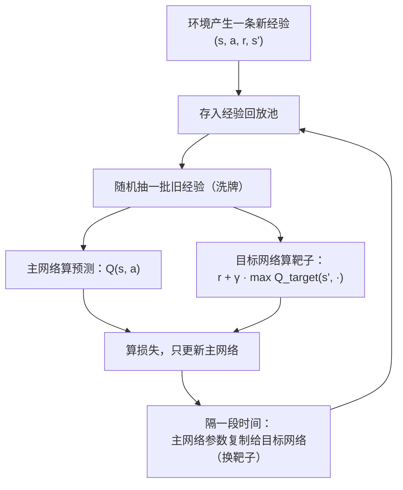

# 深度强化学习

> **一句话理解**：当状态多到任何表格都记不下时，就用神经网络代替 Q 表来"估分"——这就是深度强化学习（Deep Reinforcement Learning, DRL），再加上"直接学怎么行动"的策略梯度路线，构成了从 Atari 游戏到大模型对齐的全部地基。

[⬆️ 返回总目录](../../../README.md) · [⬆️ 返回本篇](../README.md) · [⬅️ 返回本章目录](./README.md)

| 属性 | 说明 |
|------|------|
| 难度 | ⭐⭐⭐⭐（高阶） |
| 所属分支 | 强化学习 |
| 前置知识 | [强化学习入门](./01-强化学习入门.md)；[神经网络是怎么炼成的](../../3-深度学习/04-深度学习基础/01-神经网络是怎么炼成的.md) |

---

## 📌 这一节解决什么问题

上一节的 Q 表在小走廊里很好用，但真实世界的状态空间会爆炸：围棋棋局约有 $10^{170}$ 种局面，比可观测宇宙的原子数（约 $10^{80}$）还多——**给每个局面留一个表格格子，宇宙里没有那么多原子来存它**。更糟的是图像输入：机器人摄像头的每一帧都是一个连续状态，连"枚举"都做不到。

思路顺理成章：表格存不下，就学一个**函数**来近似它——输入状态（棋盘、图像），输出每个动作的 Q 值。函数逼近器用什么呢？神经网络。但把"Q 表 + 神经网络"直接拼起来训练，几乎必定崩溃——本节的核心就是理解**为什么会崩**，以及让深度 Q 网络（Deep Q-Network, DQN）真正能学的两个稳定器；随后介绍另一条"不学打分、直接学行动"的路线：策略梯度与它的集大成者 PPO。

## 🌱 通俗理解

**从手册到直觉**。Q 表是一本逐条登记的经验手册："3×7 走廊第 5 格向右 = 2.3 分"。局面多了，手册厚到写不下，但老司机不需要手册——看一眼路况就**估**出个大概，因为他见过太多相似局面，学会了"举一反三"。神经网络就是那个"见过相似局面就能估分"的老司机。

**两个稳定器，对应两个翻车现场**：

- **经验回放（Experience Replay）= 复盘旧局**。刚下的这盘棋和上一盘高度相似，逐条学会被最近几步带偏（学完新的忘了旧的，还越学越钻牛角尖）。解法：把每一步经历存进池子，训练时**随机抽旧局复盘**——像洗牌，打碎时间上的相关性，同一份经历还能反复用。
- **目标网络（Target Network）= 盯一个稳定的靶子**。训练要朝"TD 目标"逼近，可这个靶子由同一张网络自己算出来——网络一动靶子跟着动，等于**追着自己的尾巴跑**，越追越晕。解法：复制一份网络专门当靶子，参数冻结；每隔一段时间才把最新的参数慢慢换过去。靶子稳了，学的人才能瞄得准。

**策略梯度（Policy Gradient）路线**。值函数路线是"先给每个动作打分再挑分高的"；策略梯度干脆**不打分，直接学怎么出招**——网络输出就是"各动作的概率"，好用的动作概率越练越大。像练肌肉记忆：不解释为什么，直接把正确动作练成本能。好处是对连续动作（机械臂关节转多少度）天然友好。

**PPO（Proximal Policy Optimization）= 稳健小步走**。策略梯度怕的就是"一步迈太大"：一次更新过猛，策略突然变差，采到的数据也跟着变差，越学越崩。PPO 的做法是**限制每次更新的幅度**——新旧策略的概率比一旦偏离安全区间就"剪断"惩罚，逼着策略只能小步改进。稳健、好调、省心，让它成了工业界最常用的 RL 算法。

## 📋 举个例子

**把 Q 表换成网络后，长什么样？** 以小车立杆（CartPole）为例，对比两张"表"：

| | Q 表时代（悬崖行走） | 网络时代（小车立杆） |
|--|---------------------|---------------------|
| 输入状态 | 离散编号 0~47（网格坐标） | 4 维向量：[车位置, 车速度, 杆角度, 角速度] |
| 存储 | 48 × 4 的表格，逐格存数 | 一个 4→32→2 的小网络（几百个参数） |
| 输出 | 查表得到该行 4 个 Q 值 | 前向传播得到 2 个 Q 值：[向左推的分, 向右推的分] |
| 泛化 | 没见过的格子 = 空白 | 相似状态自动给出相似估值（举一反三） |

**DQN 一次经验回放批长什么样？** 训练时不是用刚发生的这一步，而是从池子里随机抽一批（比如 32 条）"陈年旧账"：

| # | 状态 s | 动作 a | 奖励 r | 新状态 s' | 是否结束 |
|---|--------|--------|--------|-----------|----------|
| 1 | [ 0.02, -0.31, 0.05, 0.42] | 向左 | 1.0 | [-0.04, -0.16, 0.13, 0.37] | 否 |
| 2 | [-0.11, 0.22, -0.08, -0.35] | 向右 | 1.0 | [-0.07, 0.05, -0.02, -0.12] | 否 |
| 3 | [ 0.05, 0.11, 0.21, 0.55] | 向右 | 1.0 | [ 0.07, 0.29, 0.22, 0.71] | 否（杆快倒了） |
| … | … | … | … | … | … |
| 32 | [-0.02, -0.08, 0.03, 0.10] | 向左 | 1.0 | [ 0.00, 0.05, 0.04, 0.09] | 否 |

关键在于这 32 条**来自不同回合、甚至几百回合之前的旧局**——时间上不相邻、相关性被打碎，对网络来说这就是一批干净的独立样本，可以像监督学习那样做小批量梯度下降。

<details>
<summary>📊 展开看：PPO 为什么在 RLHF 里被选中</summary>

大模型对齐用的 RLHF（人类反馈强化学习，Reinforcement Learning from Human Feedback），本质是对"大模型输出文本"这个动作空间做策略优化，PPO 被选中主要靠三点：

1. **更新稳**。RLHF 里被优化的对象是一个花了巨资训好的语言模型——一次过猛的更新就可能把它"训坏"（话都说不利索，只会讨好奖励模型）。PPO 的裁剪机制限制每步更新幅度，恰好是"别把传家宝砸了"的保险丝。
2. **样本利用温和**。PPO 对超参宽容、训练曲线平稳，这在工程上比"理论最优但一碰就碎"的算法值钱得多。
3. **配套成熟**。PPO 与"奖励模型 + 价值模型 + 旧模型约束（KL 惩罚）"的流水线多年磨合，成了事实标准；后续变体也是沿着"更稳的小步走"这条路演进。

一句话：RLHF 选 PPO 不是因为它某项指标最强，而是因为它**最不容易把模型训坏**。

</details>

## 🧠 核心原理

### 整体流程

DQN 的一次训练循环——注意两个稳定器分别卡在哪两个位置：



### 逐步拆解

**1. 用网络近似 Q 函数**。记网络参数为 θ，拟合目标就是上一节的贝尔曼方程，损失写成：

$$
L(\theta) = \mathbb{E}\left[\, \left( r + \gamma \max_{a'} Q_{\theta^-}(s', a') - Q_{\theta}(s, a) \right)^2 \,\right]
$$

> 👉 **人话**：预测值是主网络给"这步动作"打的分；目标值（靶子）是"实际奖励 + 目标网络给下一局面估的最好前景"。让两者的平方差越小越好。与上一节唯一的区别：两张表换成了两个网络，θ⁻ 就是被冻结的目标网络。

**2. 策略梯度：直接优化策略**。把策略 π(a|s)（各动作的概率）本身作为优化对象，沿"期望回报更高"的方向调整参数：

$$
\nabla_\theta J(\theta) = \mathbb{E}\left[\, \nabla_\theta \log \pi_\theta(a \mid s) \cdot G_t \,\right]
$$

> 👉 **人话**：走完一局回头看——回报高的那次，就把它沿途每个动作的概率都调高一点（乘上回报当"权重"）；回报低的就调低。好动作被奖励强化，坏动作被冷落，像复盘时用红笔圈出妙手。

**3. PPO：给更新幅度上保险**。定义新旧策略的概率比 $r_t(\theta) = \pi_\theta(a_t \mid s_t) / \pi_{\theta_{old}}(a_t \mid s_t)$，目标是：

$$
L^{\mathrm{CLIP}}(\theta) = \mathbb{E}\left[\, \min\left( r_t(\theta) A_t,\ \mathrm{clip}\left( r_t(\theta),\ 1-\epsilon,\ 1+\epsilon \right) A_t \right) \,\right]
$$

> 👉 **人话**：A_t（优势）表示"这个动作比平均水平好多少"。当新旧策略的概率比跑出 [1−ε, 1+ε] 的安全区间（ε 常取 0.2），clip 就把奖励"剪断"——策略想一次迈大步？不给糖了。于是每轮更新只能小步走，稳，但步步向前。

**4. 算法家族速览**：

| 家族 | 代表算法 | 一句话 |
|------|----------|--------|
| 值函数系（DQN 系） | DQN、Double DQN、Rainbow | 学"每个动作值多少分"再挑高的做；适合离散动作，棋类、游戏 |
| 策略梯度系 | REINFORCE、PPO | 不打分，直接学"怎么行动"；连续动作也行，PPO 是当代主力 |
| Actor-Critic 系 | A3C、DDPG、SAC | 演员（Actor）管行动、评论家（Critic）管打分，互相配合；机器人连续控制常用 |

**为什么深度强化学习这么难**？三座大山：**样本效率低**（动辄百万级交互，机器人在真机上根本试不起）；**奖励设计难**（奖励定歪一分，智能体跑偏十里，见下一页"奖励黑羊"）；**训练不稳定**（换一个随机种子结果可能天差地别，复现是玄学重灾区）。这三个难点直接塑造了下一页要讲的生产落地姿势。

## 💻 动手试试

用 numpy 手写一个最小 DQN（两层网络、经验回放、目标网络三件套俱全），解决小车立杆：杆要倒了，向左或向右推车把它稳住，坚持越久越好。

```python
# 最小可运行 DQN：numpy 手写小网络 + 经验回放 + 目标网络
# 先安装：pip install gymnasium numpy
import numpy as np
import gymnasium as gym

rng = np.random.default_rng(0)
env = gym.make("CartPole-v1")

D, H, A = 4, 32, 2                  # 状态维数 / 隐层单元数 / 动作数（左、右）
W1 = rng.normal(0, 0.1, (D, H)); b1 = np.zeros(H)
W2 = rng.normal(0, 0.1, (H, A)); b2 = np.zeros(A)
W1t, b1t, W2t, b2t = W1.copy(), b1.copy(), W2.copy(), b2.copy()  # 目标网络：慢速副本

def forward(x, W1, b1, W2, b2):
    h = np.tanh(x @ W1 + b1)        # 隐层
    return h, h @ W2 + b2           # 输出层：每个动作一个 Q 值

buf, gamma, eps, batch, lr = [], 0.99, 1.0, 32, 1e-2   # 回放池 / 折扣 / 探索 / 批大小 / 学习率
scores = []
for ep in range(3000):
    s, _ = env.reset(seed=0 if ep == 0 else None)
    done, total = False, 0
    while not done:
        # ε-贪婪：前期多探索，随回合数衰减
        a = env.action_space.sample() if rng.random() < eps else int(np.argmax(forward(s, W1, b1, W2, b2)[1]))
        s2, r, term, trunc, _ = env.step(a)
        done = term or trunc
        buf.append((s, a, float(r), s2, float(not done)))          # ① 存进回放池
        s, total = s2, total + r
        if len(buf) > 20000:
            buf.pop(0)
        if len(buf) >= batch:
            idx = rng.choice(len(buf), batch, replace=False)       # ② 随机抽旧经验复盘
            S, Ac, R, S2, M = map(np.array, zip(*[buf[i] for i in idx]))
            h, q = forward(S, W1, b1, W2, b2)                      # 主网络的预测
            qt = forward(S2, W1t, b1t, W2t, b2t)[1]                # ③ 靶子由目标网络给出
            y = R + gamma * M * qt.max(axis=1)                     # TD 目标
            mask = np.eye(A)[Ac.astype(int)]                       # 只更新实际采取的动作
            dz = (q - y[:, None] * mask) * mask / batch            # 均方误差的梯度
            gW2, gb2 = h.T @ dz, dz.sum(0)
            dh = (dz @ W2.T) * (1 - h ** 2)                        # tanh 的导数
            gW1, gb1 = S.T @ dh, dh.sum(0)
            for p, g in [(W1, gW1), (b1, gb1), (W2, gW2), (b2, gb2)]:
                p -= lr * g                                        # 小批量梯度下降
    scores.append(total)
    eps = max(0.05, eps * 0.995)                                   # 逐渐少探索、多利用
    if ep % 10 == 9:                                               # ④ 每 10 回合才换一次靶子
        W1t, b1t, W2t, b2t = W1.copy(), b1.copy(), W2.copy(), b2.copy()
    if (ep + 1) % 500 == 0:
        print(f"第 {ep+1:4d} 回合：近 500 回合平均坚持 {np.mean(scores):6.1f} 步（eps={eps:.2f}）")
        scores = []
```

预期输出（种子固定时可复现；重点看"先差后好"的趋势——前期探索多、成绩平平，随 ε 衰减成绩一路上台阶）：

```text
第  500 回合：近 500 回合平均坚持  165.6 步（eps=0.08）
第 1000 回合：近 500 回合平均坚持  174.7 步（eps=0.05）
第 1500 回合：近 500 回合平均坚持  324.0 步（eps=0.05）
第 2000 回合：近 500 回合平均坚持  332.6 步（eps=0.05）
第 2500 回合：近 500 回合平均坚持  439.0 步（eps=0.05）
第 3000 回合：近 500 回合平均坚持  415.1 步（eps=0.05）   # 后期稳定在 400 步上下（满分 500）
```

随机的初始策略平均只能坚持 20 步左右；几百回合后，网络学会了"杆往哪边倒就往哪边推"。把这 60 行里的 ①②③④ 注释删掉试试——没有经验回放和目标网络，这个小网络多半学不动，这正是两个稳定器的价值。

## 🔥 炼丹小灶

> 🔥 **炼丹小灶**：DQN/PPO 的工业界起点配方与玄学——
> - 配方（DQN）：批大小 32~128、学习率 1e-4~1e-3（Adam）、目标网络每 1k~10k 步同步、回放池 1e5~1e6 条；奖励先归一到 ±1 量级再训。
> - 配方（PPO）：clip ε=0.2、每轮更新 2~10 个 epoch、GAE λ=0.95、同时采 8~64 条并行轨迹。
> - 玄学：不收敛先怀疑奖励尺度和学习率，再怀疑实现里 TD 目标是否意外"穿了梯度"（应 detach）；换种子重来永远是最后的倔强。
> - ⚠️ 以上是经验参考值，不是圣旨；换环境请重新炼。

## 🔗 在知识树中的位置

- **上游**：[强化学习入门](./01-强化学习入门.md)提供了 Q 函数、贝尔曼更新这套"灵魂"；[神经网络是怎么炼成的](../../3-深度学习/04-深度学习基础/01-神经网络是怎么炼成的.md)和[训练一个模型的完整流程](../../3-深度学习/04-深度学习基础/02-训练一个模型的完整流程.md)提供了"躯壳"——损失、梯度、小批量更新原样复用。
- **下游**：[生产实战](./99-生产实战.md)——这些算法在真实业务里怎么落地；[微调与对齐](../07-自然语言处理与LLM/05-微调与对齐.md)——RLHF 把 PPO 的"稳健小步走"用在亿万参数的语言模型上。
- **横向对比**：DQN 系适合"离散动作 + 状态可打分"的场景；策略梯度/PPO 系适合"连续动作或要直接学行为分布"的场景；真实项目里算法选型往往不如奖励设计重要（下一页的主线）。

## ⚠️ 常见误区

- **误区一**："DQN = 把 Q 表换成网络，其余照旧" → 直接替换几乎必然训练崩溃：相邻样本强相关、目标随网络抖动。经验回放与目标网络不是锦上添花，而是让它**能学**的前提。
- **误区二**："PPO 是万能默认选项" → PPO 是同策略（on-policy）算法，采一批用一批、样本效率偏低；状态小且离散的问题，表格法更稳更省。
- **误区三**："奖励给得越高，模型学得越好" → 奖励设计不当，智能体会钻空子刷分（奖励作弊，Reward Hacking），拿到高奖励却完全不是你想要的行为——下一页有真实案例。

## 📝 小结与自测

**要点回顾**

- 状态爆炸（围棋局面数超原子数）逼着 Q 表进化成神经网络：输入状态、输出每个动作的 Q 值
- DQN 的两个稳定器：经验回放（洗牌 + 复用旧经验）与目标网络（盯稳定靶子、慢慢换）
- 策略梯度不学打分、直接学行动概率；PPO 用裁剪限制每次更新幅度，稳健小步走，是工业主流与 RLHF 主力
- 深度强化学习难在：样本效率低、奖励设计难、训练不稳定——这三难决定了它独特的生产落地姿势

**自测一下**（点击展开答案）

<details>
<summary>问题 1：为什么必须用目标网络？直接用主网络自己算 TD 目标会怎样？</summary>

TD 目标是训练要逼近的"靶子"。若靶子由主网络自己实时给出，参数一动靶子立刻跟着动——损失表面在脚下持续变形，网络等于追着自己的尾巴跑，训练极易震荡发散。复制一份冻结的网络当靶子、隔一阵子才同步，靶子在大部分时间是稳定的，学习信号才可靠。

</details>

<details>
<summary>问题 2：经验回放除了"打散相关性"，还白送了一个什么好处？</summary>

一份数据多次复用：每条经验存进池子后可以被反复抽中参与多轮训练（一鱼多吃），大幅提高样本效率——这对交互昂贵的环境（机器人、真实系统）价值极大。顺带一提，策略梯度系的 PPO 是同策略算法、用完即弃，所以没有这种回放机制。

</details>

## 📚 延伸阅读

- 论文：Mnih et al.《Human-level control through deep reinforcement learning》（DQN, 2015）
- 论文：Schulman et al.《Proximal Policy Optimization Algorithms》（PPO, 2017）
- 教程：OpenAI Spinning Up in Deep RL——策略梯度到 PPO 的推导讲得最细的免费教程
- 综述：AlphaGo（2016）相关论文——"值网络 + 策略网络 + 蒙特卡洛树搜索"组合的经典范本

---

[⬅️ 上一页：强化学习入门](./01-强化学习入门.md) · [返回本章目录](./README.md) · [下一页：生产实战 ➡️](./99-生产实战.md)
