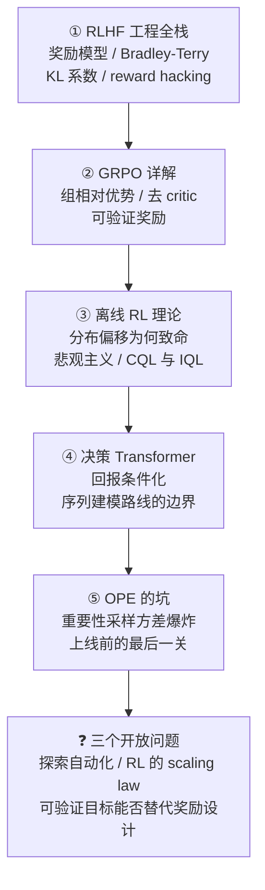
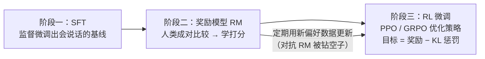
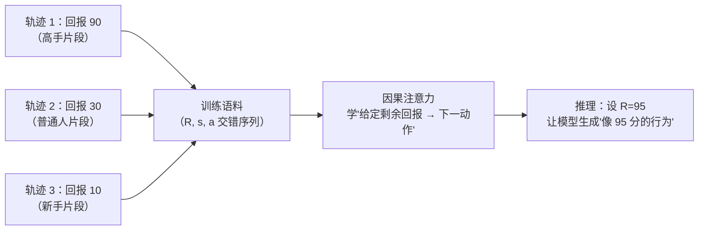
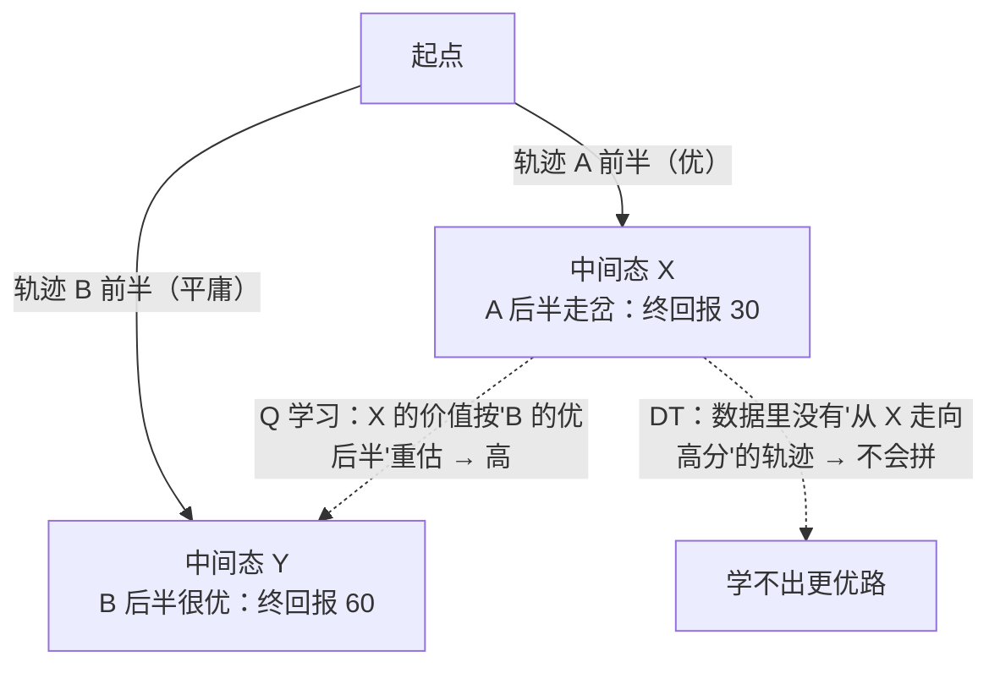
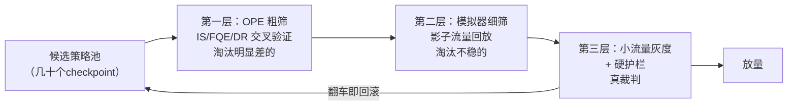

# 进阶专题：RL 进阶——RLHF、GRPO 与离线世界的规矩

> **一句话理解**：前两页讲"在线试错怎么学"，本页讲**不许随便试错的世界怎么学**——RLHF 把人类偏好炼成一个可训练的奖励模型、GRPO 用"同题一组回答互相当对照"砍掉 critic、离线 RL 靠悲观主义在历史日志里守住本分、决策 Transformer 干脆把"决策"变成"给定回报的下一个词预测"——最后每一版新策略上线前，都要先过"离线策略评估（OPE）"这道不可靠又不可省的关。

[⬆️ 返回总目录](../../../README.md) · [⬆️ 返回本篇](../README.md) · [⬅️ 返回本章目录](./README.md)

| 属性 | 说明 |
|------|------|
| 难度 | ⭐⭐⭐⭐（高阶） |
| 所属分支 | 强化学习 |
| 前置知识 | [强化学习入门](./01-强化学习入门.md)（价值函数、on/off-policy）；[深度强化学习](./02-深度强化学习.md)（PPO、Actor-Critic）；建议同时翻[微调与对齐](../07-自然语言处理与LLM/05-微调与对齐.md)（应用视角） |

---

## 📌 这一节解决什么问题

第 2 页收在 PPO，99 页收在"三种生产姿势"（仿真、离线、RLHF）。本页把这三种姿势里**算法侧最深的三层**挖开，并补上两块前面只有名字没有机制的内容：

1. **RLHF 的奖励到底怎么来、怎么拴？** "奖励模型替人打分"这句口号下面藏着三个必须懂机制的问题：奖励模型怎么训练（为什么是两两比较、为什么它本身是个语言模型）、KL 系数在防什么（直觉与量级）、reward hacking 为什么"防不完"（它的博弈本质）。
2. **GRPO 为什么能砍掉 critic？** PPO 在大模型上要养一个与策略同规模的价值网络——显存与算力直接翻倍。GRPO 用"同一 prompt 采一组回答、组内相对比较"重造了基线：它是方差缩减主线（第 2 页深问一）的最新一棒，也是 2024–2026 推理模型训练的主力配置。
3. **只有日志时，学习的理论红线在哪？** 离线 RL 的死穴不是数据少，是**分布偏移**：学出来的动作可能在数据里从未出现过，而它的价值是网络外推的、无人能揭穿。悲观主义原则（保守估计兜底）是理论给出的安全带，CQL/IQL 是两条落地路径。
4. **决策能不能不走"价值"这条路？** 决策 Transformer 把 RL 改写成"给定回报的序列建模"（return-conditioning）——复用整个 LM 技术栈，但换来了"不能超越数据中最优策略"的天花板。这条路线的边界必须划清。
5. **上线前的最后一关为什么又难又不可省？** 离线策略评估（OPE）：重要性采样的方差随序列长度指数爆炸、值函数方法又回到外推老路——但"实车试错"的代价让这一关不可跳过。这个矛盾本身就是本页的结尾。

**与第 7 章的分工**：[第 7 章微调与对齐](../07-自然语言处理与LLM/05-微调与对齐.md)讲 RLHF 的**应用视角**（数据怎么标、产品怎么对齐、流水线怎么搭）；本页讲**算法视角**（奖励模型的损失函数、GRPO 的优势计算、离线 RL 的理论保证）——两页互为表里，不重复。阅读路线：①②是一条线（奖励从哪来、怎么用最省），③④是一条线（没有在线反馈时怎么学），⑤是两者的共同出口；时间紧可先读①②再直接跳⑤。

## 🌱 通俗理解

- **RLHF = 先培养一个懂你口味的评委，再让选手对着评委训练**：评委（奖励模型）本身也是从你这个"总厨"的无数次"左边的菜好吃还是右边"的裁决里学出来的——它学的不是"什么菜好吃"的绝对标准（人类给不出稳定绝对分），而是" A 比 B 好"的相对排序；选手（策略模型）训练时也不能放飞——KL 约束像一根橡皮筋把它拴在"师父（参考模型）"身边：**可以创新，不许离家出走**（出走地带评委没见过，打分纯属瞎蒙，而选手专挑这种地方骗高分——这就是 reward hacking）。
- **GRPO = 同一道题让一组学生各答一遍，按组内排名发信号**：不用单独请一个"预估平均分"的家教（critic），直接用同组同学的实测平均当基准——比平均好的动作加概率、比平均差的减概率。省了半个家教的钱（显存），代价是要多印几份卷子（多采几个回答）。
- **离线 RL = 只看老司机的行车记录学开车**：录像里从没出现过"在这个弯道踩死刹车"，你就无从知道这个动作的后果——但 Q 网络会**外推**出一个乐观的估值（"没被罚过的动作 ≈ 好动作"），学出来一上车就敢踩死。悲观主义是安全带：**没见过的动作，一律按"可能很糟"处理**——宁可少赚，不赌没把握的事。
- **决策 Transformer = 把行车记录当文本读，"给定这趟要拿多少分"预测下一个动作**：训练就是监督学习（下一词预测），整个 LM 工具箱直接搬来用；但它本质是"在录像库里检索合适的开法"——录像里最好的司机是什么水平，它最多学成那样，**不会自己长出录像里不存在的新技术**。
- **OPE = 新司机上高速前的模拟考**：不能真上路考（代价），模拟考的题目又是旧路况（日志）——按旧路况推新司机的成绩，题型差一点，估分就天差地别。

五个比喻对应本页五节；读到哪里卡住，就回到对应的比喻重新落地一次。

## 📋 举个例子

**例子一：Bradley-Terry 手算——"A 赢 2 次、B 赢 1 次"，评委学到什么分差？** 奖励模型的训练数据是成对比较：同一个 prompt 下模型出两个回答，人选出更好的那个。设评委给 A、B 的分差 d = r(A) − r(B)，Bradley-Terry 模型假设"A 比 B 好"的概率是：

$$
P(A \succ B) = \sigma(d) = \frac{1}{1 + e^{-d}}
$$

> 👉 **人话**：评委不说"谁多少分"，只输出"谁赢的概率"；分差越大，赢的概率越接近 1；分差为 0 时五五开。

三次比较（A 赢 2 次、B 赢 1 次）的极大似然：最大化 $2\log\sigma(d) + \log\sigma(-d)$，对 d 求导置零：

$$
2\big(1 - \sigma(d)\big) - \sigma(d) = 0 \;\Rightarrow\; \sigma(d) = \tfrac{2}{3} \;\Rightarrow\; d^* = \log\tfrac{2}{1} \approx 0.693
$$

> 👉 **人话**：赢率 2/3 对应分差 0.693——**评委学到的是"胜率的对数"**。这条换算规则贯穿整个 RM：人类比较数据里的胜率，被逐字翻译成奖励模型里的分数差；动手环节会亲手把 d 从 0 梯度推到 0.693。

**例子二：GRPO 组内优势手算——一道数学题、四个回答。** 同一个 prompt 采 G=4 个回答，可验证奖励（答对 1、答错 0），组内优势（Advantage）= 偏离组均值的程度再除以组标准差：

| 情况 | 组内奖励 | 组均值 | 组标准差 | 各自的优势 A |
|------|---------|--------|---------|--------------|
| 正常：两对两错 | 1, 0, 1, 0 | 0.5 | 0.577 | +0.87, −0.87, +0.87, −0.87 |
| 偏难：只对一个 | 1, 0, 0, 0 | 0.25 | 0.433 | +1.73, −0.58, −0.58, −0.58 |
| 失败：全对（或全错） | 1, 1, 1, 1 | 1 | 0 | **全 0——整组零梯度，白采了** |

三个观察：**同题的"难度"被组均值自动消掉**（难题里答对的优势更大，+1.73 > +0.87——不需要任何 critic 去预估"这道题期望几分"）；**优势经 std 归一**后量纲稳定，跨题目可比；**全对/全错的组没有信号**——这是 GRPO 的结构性浪费，工程上要么丢弃该组、要么靠课程难度让组内保持区分度（经验参考）。

这两个手算就是 GRPO 与 RM 训练的全部核心数学——正文①②只是把它们接上 KL、clip 与采样循环，长成完整的训练系统。

<details>
<summary>📊 展开完整算例：GRPO 的更新一步——组内比较如何变成概率的升降</summary>

拿"两对两错"那组继续算。设四个回答在某 token 位置的新旧策略概率比 r 都从 1 开始，更新目标（与 PPO 同款的 clip 结构，只是优势来自组内）：

- 对答对的两个回答（A=+0.87）：目标鼓励 r 上升（把生成它们的 token 概率调高），clip 封顶在 1+ε；
- 对答错的两个回答（A=−0.87）：目标压低 r，同样的 clip 逻辑；
- 整组四个样本的梯度**严格对称**——答对升多少、答错降多少由各自的优势幅度决定，而优势之和恒为 0（减均值后必然如此）：$\sum_i A_i = 0$。

> 👉 **人话**：GRPO 的每一步更新都是"组内零和的拔河"——把概率质量从答错的回答搬向答对的回答，搬运量由优势差决定。**基线不是学出来的（PPO 的 V(s)），是量出来的（同组实测均值）**——这就是"用采样换参数"的全部含义：省掉 critic 的参数与训练，多付 G 倍的推理采样。

与 PPO 对照着读：PPO 对**每个 token 位置**都有一个学出来的基线 V(s_t)（评论家逐位置打分）；GRPO 对**整个回答**只有一个实测基线（组均值）——粒度粗了（同一回答内所有 token 共享一个优势），换来的是 critic 整个消失。这个粗粒度的代价是优势估计的方差变大，靠加大组规模 G 来压（经验参考 G=8~64）。

</details>

## 🧠 核心原理

### 整体流程：本页知识地图



### 逐步拆解

**① RLHF 工程全栈（算法视角）。**

先摆管线（应用侧细节见[第 7 章](../07-自然语言处理与LLM/05-微调与对齐.md)）：



三阶段的输入/产物/常见坑（算法侧速查）：

| 阶段 | 输入 | 产物 | 本页关心的坑 |
|------|------|------|-------------|
| SFT | 高质量指令-回答对 | 会说话的基线 π_ref | 基线质量决定 KL 锚点的"可信域"大小——SFT 拉垮，RL 阶段的橡皮筋拴在错误的地方 |
| RM | 成对偏好 (y_w, y_l) | 标量打分器 r_φ | 标注漂移与分布外外推（下文展开） |
| RL | prompt × 采样 | 优化后的 π_θ | reward hacking、KL 失控（下文展开） |

> 👉 **人话**：注意"坑"那一列的方向——**前一阶段的产物是后一阶段的"环境"**：SFT 定锚点、RM 定地形、RL 在地形上找路；任何一环的质量都会顺着管线传下去，且不会被后面的阶段放大回来（坏锚点没有好 RL 能救）。对应 99 页三种生产姿势：本节是 RLHF 姿势的算法侧，仿真与离线两姿势的算法侧在③④⑤。

<details>
<summary>🧮 展开看：RM 为什么常从 SFT 模型初始化，而不是从基座训？</summary>

两个原因。其一是**分布匹配**：RM 将要打分的对象是"RL 阶段策略生成的回答"——它们从 SFT 策略的分布里长出来；RM 从 SFT 初始化，等于评测员一开始就熟悉"这类文章的写法"，同样的偏好数据能学得更准（从基座训要额外花算力补上这段分布差）。其二是**能力继承**：理解长推理链、代码块、多轮语境的语感是底座/SFT 已有能力，从零头训标量头只动"打分"这一层——训练便宜且不动语言理解。工程上的另一条常用纪律：RM 的规模不必与策略同大（RM 只要排序够准），中小尺寸 RM + 集成是常见的性价比组合（经验参考）。

</details>

**奖励模型（Reward Model, RM）的训练细节。** 数据形态是三元组 (prompt, 赢的回答 $y_w$, 输的回答 $y_l$)；模型假设用 **Bradley-Terry 模型**：偏好由潜在分数的差决定，"y_w 更好"的概率是 $\sigma(r(y_w) - r(y_l))$；训练损失是负对数似然：

$$
\mathcal{L} = -\,\mathbb{E}\big[\log \sigma\big(r(y_w) - r(y_l)\big)\big]
$$

> 👉 **人话**：评委的目标只有一条——给"人类选中的回答"打比"落选的"更高的分，差多少按胜率定（例子一的换算）。它从不学"什么是绝对的好"，只学"相对排序的置信度"。

三个工程要点（算法侧）：

1. **为什么是成对比较而不是直接打分**：人类的绝对分不稳定（同一标注员隔天打分漂移、人与人量纲不齐），相对判断稳定得多（"A 比 B 好"的一致性远高于"A 打 7 分"）；且排序信息恰好就是 Bradley-Terry 需要的全部——**数据形态和模型假设互相成就**；
2. **奖励模型也是一个 LM**：拿基座或 SFT 模型，把"预测下一个词"的头换成输出单个标量的打分头，正文还是那套 Transformer——**它用读一个句子的方式读整段回答，再压缩成一个分数**。这带来一个结构性事实：RM 的能力上限（上下文长度、语言理解）继承自底座，训练成本与一次 LM 微调同级（数据量级常见数万到数十万对，经验参考）；
3. **RM 的失效面就是分布偏移**：RL 训练中策略越跑越偏，生成的回答逐渐离开"人类标注过的分布"——RM 在分布外的打分是无据外推（与离线 RL 的病根同源，见③）。KL 系数管的就是这件事。

<details>
<summary>🧮 展开看：成对比较数据的生成细节与三个变体</summary>

**数据怎么来（算法侧关心的部分）**：同一 prompt 采 K 个回答（常 K=4~9，经验参考），标注员对它们两两比较或选出最好/最差的排名；两两比较的组合数随 K 二次增长（K=6 有 15 对），实践中常只标注"最好 vs 最差"或随机抽几对——**每一对都是 Bradley-Terry 的一个训练样本**。标注质量的三道闸：双人背靠背标注算一致性（不一致的对子复核或丢弃）、honeypot 题混入（已知答案的题检验标注员状态）、按标注员加权（一致性高的人权重高）。

**三个变体（为什么都没能取代 pairwise）**：① 直接回归人类打分——量纲漂移问题原样进模型；② 列表排序损失（listwise，一次学整个排名）——信息更足但对标注形态要求高；③ **RM 集成**（训多个 RM 取均值/最小值）——不是变体是ensemble，用多个 RM 的分歧度量不确定性，分歧大的样本少信；对压 reward hacking 有实效（策略要同时骗过多个 RM 更难），代价是推理成本乘倍。

</details>

**KL 系数的直觉与量级。** RL 阶段的目标函数：

$$
\max_\theta\; \mathbb{E}_{y \sim \pi_\theta}\big[r_\phi(y)\big] \;-\; \beta\, \mathrm{KL}\big(\pi_\theta \,\|\, \pi_{\mathrm{ref}}\big)
$$

> 👉 **人话**：策略要拿高奖励，但每偏离参考模型（通常是 SFT 基线）一分，就按 β 的汇率交"离群税"。这条税的用途只有一个：**把搜索范围圈在 RM 见过数据的可信域内**——RM 是从有限人类样本学出的"地图"，KL 保证优化器只在地图画准了的区域找金矿。

β 的两端症状与常见量级：β 太大 → 策略每走一步都被橡皮筋拽回，奖励曲线躺平（"学不动"）；β 太小 → 策略跑出 RM 可信域，奖励奇高而人类评价崩坏（hack）。常见起点 β≈0.1，扫描范围 0.01~0.2（经验参考，随 RM 质量与任务调整）。工程细节：KL 用 token 级的低方差估计器（k3 估计器一类）在线估计，不显式遍历词表。

β 的行为速查表（症状→诊断→处置，经验参考）：

| β 档位 | 奖励曲线 | KL 走势 | 人工抽检 | 诊断与处置 |
|--------|---------|---------|----------|-----------|
| 太大（如 >1） | 躺平或爬升极慢 | 几乎为 0 | 与 SFT 无差异 | 橡皮筋太紧：β 降一档再看 |
| 合适 | 稳步上升后走平 | 上升到一定量级后稳定 | 持续偏好 | 保持，定期抽检 |
| 太小（如 <0.005） | 快速冲高 | 持续暴涨 | 变差、怪话、格式套路 | hack 前兆：β 升档 + RM 更新 + 高分样本回流标注 |

> 👉 **人话**：盯三条曲线（奖励、KL、人工抽检通过率）就像开车看速度、转速、体温——奖励单独冲高而 KL 暴涨，几乎必然是"跑出地图找金矿"的翻车前兆。

**Reward hacking 的博弈本质。** 口号版是 Goodhart 定律："当你把一个代理指标变成目标，它就不再是好指标。"更深一层是它的**博弈结构**：

- RM 是从有限样本里学出的**地图**（有误差，且误差分布未知）；
- 策略是拿着地图找金矿的**强力优化器**——优化压力会系统性地搜索"地图画错的地方"：RM 高估的区域被反复利用，误差被指数级放大；
- 这个结构像 GAN（一个生成器对一个判别器的对抗），但**没有交替训练的均衡机制**——RM 在一轮 RL 内是冻结的，策略可以单方面赢。

所以解法也不是"把 RM 训得更好"（误差永远在），而是给博弈装制度：**KL 圈住搜索范围**（误差放大的幅度受限）、**定期用新偏好数据更新 RM**（地图重画，尤其标注"策略钻空子的高分样本"）、**对抗评估**（人类抽检 RM 高分输出，专找"模型觉得好、人觉得差"的样本回流训练）。一句话：**RLHF 不是一次训练，是一个持续运营的对抗系统**——这也解释了为什么对齐团队的结构更像"数据运营 + 模型训练"双轮，而不是单纯的模型团队。（99 页的"奖励三类坑"是这套机理在生产里的症状清单：稀疏/误设/作弊三种病，本节给的是"作弊"这一类的博弈机理与制度化解法。）

reward hacking 的常见形态与对策（同一博弈的不同马甲）：

| 形态 | 机理 | 对策 |
|------|------|------|
| 长回答偏置 | 人类标注时偏爱长而详尽的回答，RM 学到"长 ≈ 好" | 标注规范纠偏 + 长度归一/长度惩罚 |
| 格式迎合 | 排版漂亮、术语堆砌、自信语气——RM 外推高分 | 对抗样本回流 + RM 集成 |
| 刷验证器（可验证奖励场景） | 测试用例覆盖不全、答案抽取规则有漏洞 | 加密测试集、扰动格式、部分给分制 |
| 谄媚（Sycophancy） | 迎合用户立场的回答被偏好标注选中 | 标注规范中立化 + 对抗评估集 |

> 👉 **人话**：四行是同一个病：**评估体系里任何与"真正的好"不完全对齐的统计捷径，都会被优化器找到并焊死成主路**。表里左列每一条都曾是真实事故，右列每一条都是"打补丁"——补丁永远落后于钻空子一个版本，这就是"持续运营"的确切含义。

**② GRPO 详解：组相对优势，与"去 critic"的账本。**

第 2 页深问一说过：现代 RL 算法史是方差缩减史——REINFORCE（轨迹回报）→ Actor-Critic（学出的基线）→ GAE（插值）→ PPO（clip 限步长）。GRPO 是这条主线的下一棒：**基线不再学，直接量**。

$$
\hat{A}_i = \frac{r_i - \operatorname{mean}(r_1, \dots, r_G)}{\operatorname{std}(r_1, \dots, r_G)}
$$

> 👉 **人话**：同一道题采 G 个回答，每个回答的"优势"就是它比同组平均好多少（按离散度归一）。答对的组里也有人比平均好得多（难题），简单的组里答对也只比平均好一点——**题目难度被组内均值天然吸收**，不需要任何网络去预估"这道题期望几分"。

**为什么能去掉 critic（Group Relative Policy Optimization 的账本）**：

1. PPO 的基线 V(s) 要逐 token 位置估价值——价值网络与策略网络同规模（几百亿参数的 LLM 场景意味着**显存与算力接近翻倍**，还要维护一条价值网络的训练链路）；
2. GRPO 用"同题 G 个采样的实测均值"替代"学出来的期望"——**用采样换参数**：推理侧多付 G 倍生成，训练侧省掉整个 critic；
3. 均值基线在数学上与"减去任意与动作无关的基线"同样合法（不引入偏差——组均值对该 prompt 的所有回答是对称的），代价是**粒度粗**（一个回答共享一个优势）带来的方差，靠加大 G 压。

| | PPO | GRPO |
|--|-----|------|
| 基线来源 | 学出来的评论家 V(s)，逐 token 位置 | 同一 prompt 的组内实测均值，逐回答 |
| 额外网络 | 价值网络（与策略同规模） | **无**（只有策略 + 冻结的参考模型算 KL） |
| 显存/算力 | 高（两套大模型前向） | 省一半以上，换来 G 倍采样生成 |
| 优势粒度 | 细（token 级） | 粗（回答级，方差更大，靠大 G 补） |
| 对 KL 的依赖 | 有（LLM 场景） | 有（同款惩罚，还用低方差估计器） |
| 主场 | 通用 RL、RLHF 经典配置 | 可验证奖励 + 大模型推理训练 |

组规模 G 的三档账（方差 vs 采样成本的旋钮，经验参考）：

| G | 优势估计质量 | 每步采样成本 | 适用 |
|---|-------------|--------------|------|
| 小（4~8） | 抖，全同组占比高 | 低 | 快速迭代、简单题库 |
| 中（16~32） | 常用甜点区 | 中 | 主流配置 |
| 大（64+） | 稳，难度归一更准 | 高（生成时间成为瓶颈） | 高价值难题、最终冲刺 |

<details>
<summary>🧮 展开看：为什么"组均值"是合法基线（一段两行的论证）+ GRPO 一轮的伪代码</summary>

**基线合法性**：策略梯度定理允许在任何**不依赖当前动作**的量上做减法——设 b 是某个与动作 a 无关的基线，则 $\mathbb{E}_{a \sim \pi}[\nabla \log \pi(a)\, b] = b \cdot \nabla \mathbb{E}_{a\sim\pi}[1] = 0$（概率归一化的梯度为零）。组均值由同 prompt 的 G 个回答的平均奖励构成——对"当前这个回答"而言它是对称的外生量，减掉它不改变梯度的期望，只降方差。PPO 的 V(s) 同理合法；GRPO 只是把"学出来的期望"换成了"量出来的均值"。

**一轮训练的伪代码**（与 PPO 的差异加注）：

```text
for 每个 prompt q:
    采 G 个回答 y_1..y_G ~ π_θ(·|q), 温度 T          # GRPO 的额外开销在这
    算奖励 r_i（RM 打分 或 可验证判分）               # 与 PPO 相同
    A_i = (r_i − mean(r)) / std(r)                    # 组相对优势（无 critic）
    for 每个回答 i 的每个 token t:                    # token 级展开（与 PPO 相同）
        ratio = π_θ(y_t|..) / π_old(y_t|..)
        loss += min(ratio·A_i, clip(ratio, 1±ε)·A_i)
    loss −= β · KL(π_θ ‖ π_ref)                        # 橡皮筋照常
    反传、更新 θ                                        # 只有一套大网络的前向与反传
```

</details>

**在可验证奖励（Verifiable Reward）场景的崛起。** 数学（答案对错）、代码（单元测试通过）这类任务的奖励可以机器自动判定——**不需要 RM，也就没有 RM 的外推误差可钻**。GRPO 与它一拍即合：奖励是干净的 0/1（或通过率），组内比较天然把难度归一，"多采样几个回答"的算力开销在推理模型训练预算里完全可负担。于是 2024–2026 的推理模型（数学、代码、推理链训练）大量采用"GRPO + 可验证奖励"配置；**奖励不可验证的领域（文风、Helpful/无害）仍回到 RM + KL 的老路**。

可验证奖励的"验证器设计"是新的隐形战场（每个设计决定都是新的可钻点）：

| 验证器环节 | 常见做法 | 可钻的空子 |
|-----------|---------|-----------|
| 答案抽取 | 从推理链里抽最终答案（正则/标记） | 把答案写进"看起来是推理"的格式里蒙混 |
| 等价判定 | 字符串匹配 → 数值/符号等价 | 表达式等价但形式不同被判错（误杀） |
| 代码判定 | 跑测试用例集 | 用例覆盖不全——错实现碰巧全过（漏杀） |
| 部分给分 | 过程分 / 格式分 | 刷格式分：堆推理标签不做推理 |

注意边界：可验证奖励把"钻 RM 空子"的问题换成了"钻验证器空子"的新问题（上表右列——格式奖励被刷、测试用例覆盖不全），博弈从未消失，只换了场地。

**与推理链长度的纠缠**：GRPO 的优势是回答级的——推理链动辄几百上千 token，全部共享同一个 A（粗粒度在长链场景被放大）。工程上有两条缓解路（一句话级）：**过程奖励**（Process Reward Model，对推理的每一步打分而非只看最终答案——粒度细但要人工标步骤级偏好，成本高）；**输出级奖励的细粒度拆分**（把"格式对 / 结论对 / 过程简洁"拆成多路可验证信号分别给分）。前者准而贵、后者糙而便宜，选型按预算（经验参考）。

**③ 离线 RL 理论：分布偏移为何致命，悲观主义如何兜底。**

离线 RL（Offline RL）从固定数据集（历史决策日志）学策略，全程不在线试错——99 页讲过它的数据红线，这里讲**理论病根**。

**分布偏移（Distribution Shift）为何致命**。设日志由行为策略 μ 采出（旧版策略、规则、人工的混合），学的策略 π 会访问 μ 没覆盖的状态-动作。问题在 Q 学习的自举结构：

$$
Q(s, a) \leftarrow r + \gamma \max_{a'} Q(s', a')
$$

> 👉 **人话**：新估值 = 立刻的奖励 + 打折后的"下一局面**所有**动作里的最高估值"——麻烦全出在这个 max 上。

那个 $\max_{a'}$ 会在**所有**动作里挑估值最高的——包括**数据里从没出现过的动作**。没出现过的动作没有数据惩罚它（没有任何转移样本把它拉回真值），它的估值纯靠网络外推；下一轮它又作为 max 的赢家被写进别的状态的目标里——**虚高沿着自举链条自我复制**（与 DQN 过估计同源，但更糟：DQN 还有在线交互纠错，离线 RL 的错误没有任何反馈可以揭穿）。直白版：**"日志里没做过的动作"≈"没被罚过的动作"，max 会把它当便宜捡**。

一个带数字的最小例（交易风控的黑话版）：设某状态的动作为仓位档位，日志里的动作分布与学习结果对照——

| 仓位档位 | 日志中出现占比 | 数据对它的约束 | Q 学习对它的估值倾向 |
|--------|---------------|----------------|----------------------|
| 小仓 | 60% | 大量样本，估值被拉向真值 | 准 |
| 中仓 | 30% | 样本尚可 | 基本准 |
| 大仓 | 10% | 样本少，估值偏噪声 | 抖 |
| **打满** | **0%（从未出现）** | **零样本——没有任何亏损能拉低它** | **纯外推，max 最爱** |

策略上线第一天就敢打满——不是因为打满好，是因为**没有任何数据证明它不好**。在线 RL 里打满一次就挨市场一顿毒打（反馈修正）；离线 RL 里这个反馈永远不来。

**悲观主义（Pessimism）原则：保守估计兜底。** 理论出路是把"没有数据的地方"从"无约束外推"改成"主动压低"：构造一个**悲观价值函数** $\underline{Q} \le Q^*$（对不确定的动作系统性低估），然后优化它——由于低估，argmax 不会选中分布外动作（它们被压到数据内动作之下）。代价明确：**过度悲观 = 白白放弃数据里没充分覆盖但其实好的动作**（性能损失换安全）。这与第 8 章协同过滤的收缩估计（小样本往保守收）、第 9 章异质图的"宁走特征路线"是同一个工程哲学：**不确定性大时，宁可保守也别嘴硬**。

悲观度的"三情况"账（数据覆盖与悲观程度的匹配）：

- **覆盖充分**（各档位都有足量样本）：悲观修正几乎不触发，白拿安全——保守近乎免费；
- **覆盖一般**（长尾动作样本稀疏）：悲观压住虚高，代价是放弃少数其实好的长尾动作——用小损失换不翻车，划算；
- **覆盖差**（大片动作零样本）：再悲观也只是把"不知道"换成"假设很糟"，学出的策略退化为数据内策略（≈ 行为克隆）——此时离线 RL 的增量本身就没了，先回查数据（99 页红线一）而不是调悲观系数。

两条落地路径（一句话级定位）：

- **CQL（Conservative Q-Learning，保守 Q 学习）**：在 Q 的损失里加显式惩罚项，**压低分布外动作的 Q、推高数据内动作的相对估值**——"未见过的一律打折"直接写进目标函数；
- **IQL（Implicit Q-Learning，隐式 Q 学习）**：用期望分位数回归只在**数据内动作**上学一个近似最优值，**从头到尾不查询任何分布外动作的 Q**——"不问就不会错"，绕开 max 的外推。

<details>
<summary>🧮 展开看：CQL 与 IQL 的一行数学（各自"悲观"在哪一刀）</summary>

**CQL 的刀**：在标准贝尔曼误差之外加一项"压低分布外、抬高数据内"的正则——

$$
\mathcal{L}_{CQL} = \mathcal{L}_{Bellman} + \alpha \Big( \mathbb{E}_{a \sim \text{分布外}} Q(s,a) - \mathbb{E}_{a \sim \text{数据}} Q(s,a) \Big)
$$

> 👉 **人话**：对同一状态，"没见过的动作"的估值被显式往下按、"见过的"往上抬——按的力量由 α 控制。它治 max 的方式是**改变比赛的计分**（分布外选手先扣分再参赛）。

**IQL 的刀**：用期望分位数回归（expectile regression）近似 max——只对**数据里实际出现的动作**做"挑最好"，公式里根本删掉对分布外动作的查询：

$$
V(s) \approx \operatorname{expectile-}\tau \big[ Q(s,a) \big], \quad \tau \to 1 \text{ 时逼近 } \max
$$

> 👉 **人话**：max 的危险在于"问了一个不该问的动作"；IQL 的做法是**不问**——在数据内用高分位数估计"挑最好"的效果，从未见过的地方一概不查。一个改计分（CQL）、一个改提问（IQL），殊途同归于悲观主义。

</details>

**④ 决策 Transformer 与序列建模路线：把 RL 变成"给定回报的 next-token 预测"。**

Q 学习系回答"哪个动作值多少"；策略梯度系回答"怎么调动作概率"；序列建模系换了个问题：**把轨迹写成序列，用因果注意力预测下一个动作**——决策 Transformer（Decision Transformer, DT）的代表形式：

$$
\text{序列} = \big(\hat{R}_1,\ s_1,\ a_1,\ \hat{R}_2,\ s_2,\ a_2,\ \dots\big), \qquad \hat{R}_t = \sum_{t' \ge t} r_{t'}
$$

> 👉 **人话**：每个位置前都放一个"回报余量"（Return-to-Go，从现在到结束还能拿多少分）当条件——训练就是普通的监督学习：看前缀（包括"这趟还剩多少分"），预测下一个动作。**推理时想要高分，就把 $\hat{R}$ 设大**——模型在数据里学过"高回报的轨迹在这种局面下怎么走"，照着条件生成。这就是回报条件化（Return Conditioning）。



一条训练序列长什么样（把抽象符号落到具体数字，设某回合总回报 72）：

| 位置 | 1 | 2 | 3 | 4 | 5 | 6 | … |
|------|---|---|---|---|---|---|---|
| token 类型 | 回报余量 $\hat R$ | 状态 $s$ | 动作 $a$ | 回报余量 | 状态 | 动作 | … |
| 内容 | 72 | 开局局面 | 稳健入场 | 70（72−2） | 顺风局面 | 加仓 | … |

> 👉 **人话**：每个动作前面都贴着"从这里到结束还剩多少分"的价签——模型学的就是"看到价签 70 和这个局面，高手接下来会做什么"。训练目标是普通的下一 token 预测（对动作位），没有价值网络、没有时序差分、没有自举。

**优点（为什么这条路线值得认真对待）**：

1. **复用 LM 技术栈的全部资产**：因果注意力、上下文长度管理、大规模分布式训练、数据工程——RL 研究几十年攒不出的基建，NLP 直接借给它；
2. **一条序列三种 token**（回报/状态/动作）同模型处理，多任务多环境可以混训（都当"序列"喂进去）；
3. **没有值函数就没有值函数的病**：不 bootstrapping（不自举）、不 max（不挑外推动作）——致命三件套里它主动关了两件，训练稳定得像监督学习（因为它就是监督学习）。

**短板（边界的两刀）**：

1. **不能超越数据中最优策略**：条件生成的本质是"在数据分布里检索合适的行为"——$\hat{R}$ 设得再高，模型也只能生成数据里**见过**的行为风格；数据里最好的司机开 90 分，DT 学不出 95 分的开法。价值系方法（Q 学习）理论上能通过 max 与自举**组合出数据里没出现的更优策略**——这是两路线的根本分水岭；
2. **不会拼接（Stitching）**：Q 学习能把"轨迹 A 的优秀前半段"和"轨迹 B 的优秀后半段"拼成更优策略（价值函数给每步独立打分，天然支持跨轨迹缝合）；DT 按整条轨迹条件生成，**前缀走偏了就回不去**（它没有"纠正到更优路径"的机制，因为训练数据里没有"从你现在的偏差状态走到高分"的示范）。一张图看清两者的差距：



三条路线的总账（收束本章全部内容的一张表）：

| | 值函数系（DQN/CQL） | 策略梯度系（PPO/GRPO） | 序列建模系（DT） |
|--|-------------------|----------------------|-----------------|
| 学习信号 | 自举的 TD 误差 | 组内/评论家的相对优势 | 监督的下一 token 损失 |
| 能否超越数据最优 | 能（max+自举可组合新策略） | 在线场景能（探索造新数据）；离线受限 | **不能**（条件生成受数据分布约束） |
| stitching | 天然支持 | 弱 | 不支持 |
| 训练稳定性 | 差（致命三件套占全/占二） | 中（clip/组比较压方差） | 好（就是监督学习） |
| 基建复用 | 专用 RL 栈 | 专用 RL 栈 | **LM 全套基建** |
| 主场 | 离线数据需拼出更优 | 在线交互、RLHF/推理训练 | 高质量轨迹的行为复现 |

工程现状一句话：**离线数据质量高、覆盖广、目标是"复现接近最优的行为"** → 序列建模路线划算（省心稳定）；**数据全是次优轨迹、必须拼出更优** → 回到保守价值系（CQL/IQL）或两者的混合（用 Q 学习的值函数给 DT 重新标注回报余量——QDT 一类缝合怪）。

**⑤ OPE 的坑：上线前的最后一关。**

离线 RL 学出的策略到底值多少分？不能上线跑（代价），只能用日志推演——离线策略评估（Off-Policy Evaluation, OPE）。基准方法是重要性采样（Importance Sampling, IS）：

$$
J(\pi_e) = \mathbb{E}_{\tau \sim \mu}\Big[\; \underbrace{\frac{\pi_e(a_1|\cdot)\cdots\pi_e(a_T|\cdot)}{\mu(a_1|\cdot)\cdots\mu(a_T|\cdot)}}_{\text{整条轨迹的概率比}}\; R(\tau) \;\Big]
$$

> 👉 **人话**：日志是旧策略 μ 采的，新策略 π_e 想用这些日志，就得给每条轨迹"换算汇率"——新策略越偏爱的轨迹，权重越大。期望上无偏，**方差却是灾难**。

四条评估路线先摆一张总表（细节与手算在下方折叠）：

| 方法 | 一句话原理 | 偏差 | 方差 | 软肋 |
|------|-----------|------|------|------|
| 重要性采样（IS） | 按轨迹概率比给历史回报重新加权 | 无偏 | **爆炸**（随序列长度指数增长） | 长序列直接报废 |
| 截断 IS / 加权 IS | 只加权前 k 步 / 权重归一 | 有偏（可控） | 小得多 | 偏差与方差的又一笔交易 |
| 双重稳健（Doubly Robust） | IS 与值函数模型互相兜底（一个准就够） | 半参数 | 中 | 要同时学值函数与重要性权重 |
| FQE / 模拟器回放 | 学一个 π_e 下的 Q 直接打分 / 训环境模型真跑 | 外推偏差 | 小 | 模型错在哪，结论就错在哪 |

<details>
<summary>🧮 展开看：方差为什么随序列长度指数爆炸（手算一遍）</summary>

设每步两个策略的选中概率比是 1.6（π_e 偏好的动作 μ 不常选——这正是"新策略值得评估"的前提），序列长 40 步：

$$
\text{轨迹权重} = \prod_{t=1}^{40} \frac{\pi_e(a_t)}{\mu(a_t)} = 1.6^{40} \approx 1.4 \times 10^{8}
$$

> 👉 **人话**：一步只偏一点（1.6 倍汇率），四十步连乘就是一亿倍——单条轨迹独扛全部期望。

一条"恰好每步都踩中新策略偏好"的轨迹独得上亿倍权重，其余绝大多数轨迹权重≈0——**期望的正确性靠极少数天选轨迹扛着，方差大到单次估计毫无意义**。步数每增加一点，爆炸指数级恶化；两个策略稍有不重合，IS 直接报废。缓解路线（各有软肋）：**截断 IS**（只加权前 k 步——有偏）、**双重稳健估计（Doubly Robust）**（IS 与值函数模型互相兜底——两个模型都要学）、**FQE（Fitted Q Evaluation）**（直接学一个 π_e 下的 Q 来打分——又回到"外推无据"的老路）。工程惯例是多方法交叉验证：几种估计方向一致才敢进小流量（99 页的规矩）。

</details>

**实车前必须离线评估的现实矛盾**：上线试错 = 真实代价（钱、安全、体验）；离线评估 = 不可靠（IS 方差爆炸、值函数外推、模拟器有偏）；于是工业落点永远是**三层漏斗**：OPE 多方法粗筛（淘汰明显差的）→ 模拟器/影子流量细筛（对话场景常用 LLM 扮演用户）→ 小流量灰度 + 硬护栏（真正的裁判）。OPE 不是"可靠的预测器"，是"廉价的淘汰器"——把它用在淘汰而非承诺上，期望就算摆对了位置。



## ❓ 开放问题

1. **探索的自动化**：最优探索（贝叶斯视角）不可算（[第 1 页](./01-强化学习入门.md)深问二），启发式探索（ε/UCB/熵）换环境就失效——"探索策略本身能不能被学出来、能不能跨环境迁移"没有共识答案。可验证奖励场景给出了一个新角度：**组内多样采样本身就是一种结构化探索**（GRPO 的一组回答天然覆盖了行为分布的多个模式），但它只探索"一步生成"的多样性，不解决"多步环境里主动去没去过的地方"；LLM 时代的探索研究热点从"状态空间"挪到了"推理路径空间"，两者如何统一仍开放。
2. **RL 的 scaling law 是什么形状**：监督学习有 Chinchilla 式的清晰配比；RL 的"模型规模 × 数据量 × 算力 → 策略性能"曲线迟迟不成律——数据分布内生（策略决定自己吃什么数据）、奖励稀疏让曲线呈阶跃、探索难度不可控。可验证奖励的推理训练（②）已沉淀初步经验（"更多采样 × 更大模型 × 更长推理链仍在上行"），但离可外推的"定律"尚远；**没有 scaling law，就没有可靠的训练预算学**——这是 RL 工程化最硬的一块缺失拼图。
3. **奖励设计能否被"可验证目标"完全替代**：数学、代码可以机器判分；但"有用、无害、诚实"不可形式化——任何可验证的代理（RM 分数、通过率、人类投票）都重新引入 Goodhart 的阴影（优化器会钻代理的空子）。诚实的回答是：可验证目标把"奖励设计的自由度"压缩到了**验证器的构造**上——写测试用例、定义答案等价性、设计格式奖励，每个都是新一轮的"钻空子攻防"。**奖励设计没有被替代，只是被折叠进了验证器设计**——而那里的博弈永不停火（①的结论在更高的抽象层重演）。这条判词同时给出了观察点：当某天"验证器设计"也变成一门显学（像今天的 prompt 工程一样有岗位、有方法论），就说明"可验证目标替代奖励设计"的进程到了它的实际边界。

## 💻 动手试试

用 numpy 亲手跑三个最小演示：**Bradley-Terry 的极大似然、GRPO 的组内优势、重要性采样的方差爆炸**（先安装：`pip install numpy`）：

```python
import numpy as np

# ==== 演示一：Bradley-Terry——"A 赢 2 次 B 赢 1 次"能把分差推到哪 ====
sigma = lambda z: 1 / (1 + np.exp(-z))
d, lr = 0.0, 0.5                       # 分差从 0 出发（先验：五五开）
for step in range(60):
    # 损失 -[2·logσ(d) + 1·logσ(-d)] 对 d 的梯度（推导见正文公式）
    grad = -(2 * (1 - sigma(d)) - 1 * sigma(d))
    d -= lr * grad
print(f"训练后分差 d = {d:.3f}（理论最优 log2 = {np.log(2):.3f}）")
print(f"对应胜率 σ(d) = {sigma(d):.3f}（人类数据里的胜率 2/3 = {2/3:.3f}）")
# 预期输出：d ≈ 0.693，σ(d) ≈ 0.667——奖励模型学到的就是"胜率的对数"

# ==== 演示二：GRPO 组内优势——难度归一与"全同组零梯度" ====
def grpo_advantages(rewards):
    r = np.array(rewards, dtype=float)
    std = r.std()
    return np.zeros_like(r) if std == 0 else (r - r.mean()) / std
for rewards in [[1, 0, 1, 0], [1, 0, 0, 0], [1, 1, 1, 1]]:
    print(f"奖励 {rewards} -> 优势 {np.round(grpo_advantages(rewards), 2)}")
# 预期输出：[ 0.87 -0.87  0.87 -0.87] / [ 1.73 -0.58 -0.58 -0.58] / [0. 0. 0. 0.]
# 第三组：全对 -> std=0 -> 优势全 0，整组没有梯度信号（GRPO 的结构性浪费）

# ==== 演示三：重要性采样的方差爆炸 ====
rng = np.random.default_rng(0)
mu_p, pi_p, T = 0.5, 0.8, 40          # 行为策略每步以 0.5 选动作，评估策略偏爱它（0.8）
trials = 2000
weights = []
for _ in range(trials):
    acts = rng.random(T) < mu_p                      # μ 采出的轨迹
    w = np.prod(np.where(acts, pi_p, 1 - pi_p) / np.where(acts, mu_p, 1 - mu_p))
    weights.append(w)
weights = np.array(weights)
top1 = weights.max() / weights.sum()
print(f"\n理论单条最大权重 ≈ 1.6^40 = {1.6**40:.1e}")
print(f"实测：{trials} 条轨迹中，最大 1 条占总权重的 {top1:.0%}；"
      f"权重为 0 的轨迹占 {(weights == 0).mean():.0%}")
# 预期输出：最大 1 条常占总权重 30%~90%（随种子波动）；大量轨迹权重为 0——
# 期望靠极少数"天选轨迹"扛着，单次估计的方差毫无意义

# ==== 演示四：悲观主义的一行账——CQL 式惩罚如何把"没见过的动作"压下去 ====
actions = ["小仓", "中仓", "大仓", "打满"]
support = np.array([0.6, 0.3, 0.1, 0.0])        # 日志里的出现占比（正文表格的数据）
q_raw   = np.array([1.0, 1.1, 1.4, 3.0])        # 无约束训练出的 Q："打满"纯外推虚高
alpha   = 2.0                                    # 悲观系数
q_cql   = q_raw - alpha * (1 - support)          # 悲观罚：越没见过，压得越狠
print("\n无约束 Q  → 选", actions[q_raw.argmax()], dict(zip(actions, q_raw)))
print("CQL 式 Q  → 选", actions[q_cql.argmax()], dict(zip(actions, np.round(q_cql, 2))))
# 预期输出：无约束选"打满"（零样本、零惩罚的虚高）；悲观修正后选"中仓"（数据支撑的动作）

# 🧪 实验建议（改什么参数，看什么变化）：
# 1) 演示一把胜负改成"A 赢 9 B 赢 1"：d 收敛到 log9≈2.20——胜率对数换算的普遍性；
# 2) 演示二把组里加第 5 个回答（奖励 [1,0,1,0,1]）：均值/标准差都变，优势整体收缩——
#    组越大，单个样本的优势被"平摊"得越稳（大 G 降方差的数值版）；
# 3) 演示三把 T 从 40 改成 80：top1 占比逼近 100%——序列越长 IS 越报废；
#    再把 pi_p 从 0.8 改成 0.55（两策略接近）：方差立刻收敛——
#    "只在离数据不远的策略上，OPE 才勉强可用"；
# 4) 演示四把 alpha 从 2.0 改成 0.5：可能又选回"大仓"（悲观度不够）；
#    改成 10：选"小仓"（过度悲观，连数据里的大仓也不敢用）——
#    悲观度的三情况账：覆盖充分免费、覆盖一般划算、覆盖差救不了；
# 5) 演示一把初值 d 改成 -2（先验偏向 B）重跑：收敛点不变——极大似然只认数据；
#    再把胜负改成 5:5：d 收敛到 0——数据无区分，RM 学不出分差（五五开的题没有梯度信号）。
```

预期输出：分差收敛到 0.693（胜率的对数）；GRPO 三种组型给出"对称、偏斜、全零"三种优势形态；IS 演示里单条轨迹独占大半总权重——三个演示分别坐实本页①②⑤的核心断言。

## 🔥 炼丹小灶

> 🔥 **炼丹小灶**：GRPO / 可验证奖励的起点配方——
> - 配方：组大小 G=8~64（大 G 压粗粒度优势的方差）；温度采样 0.7~1.0 保持组内多样性；KL 系数 β=0.01~0.2（RM 场景常见起点 0.1）；lr 1e-6 量级（大模型 RL 微调的常用档，经验参考）；优势每批标准化；格式奖励（如推理标签闭合）给小分、答对给大分——防止"全错组零梯度"期训练空转；
> - 数据配方：偏好对/题库数万起步，**覆盖面优先于数量**——覆盖任务谱系比堆同类样本有效（RM 对没见过的任务域照样外推，经验参考）；
> - 玄学：奖励曲线涨但抽检变差 → 先查验证器（测试用例覆盖全吗？格式奖励被刷了吗？），再查 KL；组内全同的组占比高 → 加题目难度分层；离线 RL 上线前 OPE 三件套（IS/FQE/模拟器）方向不一致 = 数据覆盖不足的警报，先回查日志别急着挑好看的数字；
> - 离线 RL 配方：CQL 的保守系数 / IQL 的分位点按"数据覆盖度"调——覆盖差就调保守些（学慢好过学翻车），并全程盯"学出策略与日志策略的动作分布重合度"（重合度崩 = 正在奔向分布外，经验参考）；
> - ⚠️ 以上是经验参考值，不是圣旨；换任务请重新炼。

## 🖱️ 动手玩

> 🎮 **本库实验场**：[注意力热力图](../../../playground/attention.html)——奖励模型"读整段回答再打分"与决策 Transformer"读前缀预测下一动作"用的都是这套注意力，拖动参数看权重分布怎么变。
> 🕹️ **延伸玩一玩**：[Transformer Explainer](https://poloclub.github.io/transformer-explainer/)——对照体会"序列建模路线把决策变成 next-token 预测"之后，为什么 LM 的全部基建可以原样复用。

## 🔗 在知识树中的位置

- **上游**：[强化学习入门](./01-强化学习入门.md)（价值函数、贝尔曼方程、on/off-policy 的数据资产视角）；[深度强化学习](./02-深度强化学习.md)（PPO、GAE、方差缩减主线——GRPO 是它的下一棒）；[微调与对齐](../07-自然语言处理与LLM/05-微调与对齐.md)——RLHF 的应用视角（数据、产品、流水线），与本页算法视角互补；
- **下游**：[生产实战](./99-生产实战.md)——本页的算法红线（OPE、保守算法）在真实项目里的落地姿势；
- **横向对比**：OPE 的重要性加权与[第 9 章](../09-图神经网络/03-进阶专题-GNN深水区.md)子图采样的分布修正、[第 11 章因果推断](../11-因果推断/02-因果推断方法工具箱.md)的倾向得分是同一族方法（给"被筛选过的分布"重新加权）；reward hacking 的反馈闭环与[第 8 章推荐系统](../08-推荐系统/01-推荐系统全景.md)的马太效应同源——**优化器总会找到并放大评估体系的误差**；决策 Transformer 借走的 LM 技术栈见[第 7 章 Transformer](../07-自然语言处理与LLM/02-Transformer与注意力机制.md)；RLHF 大规模训练时的 loss spike 处置（回滚、跳数据、降学习率）与[第 4 章大规模训练工程](../../3-深度学习/04-深度学习基础/06-进阶专题-大规模训练工程.md)是同一门手艺在不同目标函数上的两次应用。

## ⚠️ 常见误区

- **误区一**：GRPO 没有 critic，所以"更简单、哪里都更好" → 它省的是参数、付的是方差（回答级粗粒度优势），需要大 G 托底；且与可验证奖励绑定最稳——奖励本身带 RM 噪声时，组内比较放大的正是噪声，未必优于 PPO+critic；
- **误区二**：KL 系数越小模型越自由、效果越好 → β→0 等于让策略跑出 RM（或奖励函数）的可信域，奖励曲线越漂亮、实际行为越崩坏——KL 是防 hack 的橡皮筋，不是性能的枷锁；
- **误区三**：决策 Transformer 是"更强的 RL" → 它是另一条路线，不是升级：训练稳（因为就是监督学习）、基建好（LM 技术栈），但天花板是数据最优、且不会拼接（stitching）——数据质量决定它的上限，"次优数据里拼出更优"必须回价值系；
- **误区四**：可验证奖励没有 reward hacking → 钻空子的对象从 RM 换成了验证器：测试用例覆盖不全（代码过了测试但没用）、答案等价判定粗糙（蒙对格式）、格式奖励被刷（堆推理标签不推理）——Goodhart 不消失，只换宿主；
- **误区五**：离线 RL 离线指标好，上线就有底气 → OPE 三条路（IS/FQE/模拟器）各有系统性软肋，它只能当"廉价的淘汰器"用——淘汰明显差的，剩下的交给小流量灰度与护栏（99 页红线五的展开）；
- **误区六**：奖励模型分数 = 人类真实偏好 → RM 是有限人类样本上的"胜率对数"地图，分布外是外推、被优化压力攻击后系统性失真——它是运营中的对抗组件，不是静止的真值函数；
- **误区七**：悲观主义是离线 RL 的万金油 → 悲观度是一笔交易不是保险：覆盖充分时近乎免费，覆盖一般时划算，**覆盖差时再悲观也只是把"不知道"改成"假设很糟"，学出的策略退化为数据内行为（≈行为克隆）**——此时该修数据（回查 99 页红线），不是调悲观系数。

## 📝 小结与自测

**要点回顾**

- RLHF 算法三件套：RM 用 Bradley-Terry 从成对比较学"胜率的对数"（它本身是个 LM，读整段回答压缩成一个分）；KL 系数把策略拴在参考模型的可信域内（β 常见 0.01~0.2，起点 0.1，经验参考）；reward hacking 是"地图-优化器"的博弈结构（像 GAN 但无均衡机制），解法是制度不是精度——KL、RM 定期更新、对抗评估；
- GRPO：同一 prompt 采一组回答、组内均值当基线（难度被天然归一）、std 归一成优势——用采样换参数，砍掉与策略同规模的 critic；代价是回答级粗粒度方差（大 G 补）与"全同组零梯度"；与可验证奖励（数学/代码机器判分）天然契合，成为推理模型训练主力；
- 离线 RL：分布偏移的致命机理是"没做过的动作没被数据惩罚，max 把外推虚高当便宜捡"，自举让虚高自我复制；悲观主义（对不确定动作系统性低估）是理论安全带；CQL 显式惩罚 OOD 动作、IQL 干脆不查询 OOD 动作；
- 决策 Transformer：回报条件化（Return-to-Go 当前缀）把 RL 变成 next-token 预测——白得 LM 全套基建与监督学习的稳定；换来的天花板：不能超越数据最优、不会拼接（stitching）；选路线看数据质量与"是否必须拼出更优"；
- OPE：重要性采样无偏但权重随序列长度指数爆炸（单条天选轨迹扛期望），FQE/模拟器各有外推与偏差软肋——工业定位是"三层漏斗"里廉价的粗筛，不是可靠的预测器；
- 三个开放问题：探索的自动化（贝叶斯最优不可算、启发式不迁移）；RL 的 scaling law（曲线有雏形、定律未成——预算学因此缺席）；奖励设计被可验证目标"折叠"进验证器设计，博弈升级不终结；
- 一条贯穿全页的暗线：**每一节都在处理"评估/反馈不可全信"的世界**——RM 有误差（用 KL 与对抗制度兜）、可验证奖励有漏洞（用验证器工程兜）、离线数据有盲区（用悲观主义兜）、OPE 有方差（用三层漏斗兜）——RL 的工程学，一大半是"不完美反馈下的安全优化学"。

**自测一下**（点击展开答案）

<details>
<summary>问题 1：为什么奖励模型的训练数据用"成对比较"而不是"直接打分"？Bradley-Terry 把胜率翻译成了什么？</summary>

两个原因：人类的相对判断远比绝对打分稳定一致（同一标注员隔天打分漂移、跨人量纲不齐），而"A 比 B 好"的一致性高；二是 Bradley-Terry 恰好只需要排序信号。它把胜率翻译成分差：σ(d)=2/3 对应 d=log2≈0.693——RM 学到的分数本质是"人类胜率的对数"。这也是 RM 只能输出相对序、其绝对数值没有跨模型可比性的原因。

</details>

<details>
<summary>问题 2：GRPO 去掉 critic 后，基线由谁担任？"用采样换参数"的得与失各是什么？</summary>

基线由"同一 prompt 的 G 个回答的实测均值"担任——组均值对该题所有回答对称（不依赖动作，不引入偏差），且天然吸收题目难度（难题里答对优势大）。得：省掉与策略同规模的价值网络（显存/算力近乎减半）、没有 critic 的训练链路；失：优势从 token 级变回答级（粒度粗、方差大），需要大 G 压方差，且全对/全错的组零梯度（白采样）——采样成本从"一次前向"变成"G 次生成"。

</details>

<details>
<summary>问题 3：离线 RL 里"没做过的动作"为什么反而容易被高估？悲观主义怎么堵这个洞？</summary>

Q 学习的目标里有 max：它在所有动作里挑估值最高者，包括数据里从未出现的动作——这些动作没有任何转移样本惩罚它，估值纯靠网络外推；虚高又经自举（估值喂估值）沿链条自我复制，且离线场景没有在线反馈揭穿错误。悲观主义的堵法是构造 ≤ 真值的悲观价值函数：对不确定（分布外）的动作系统性低估，使 argmax 不会选中它们——代价是过度悲观时放弃本可一试的好动作，用性能换安全。

</details>

<details>
<summary>问题 4：决策 Transformer 为什么"不能超越数据中最优策略"？什么是 stitching，为什么它做不到？</summary>

条件生成的本质是按"回报余量"检索数据中见过的行为模式——R̂ 设得再高，也只能生成数据分布内的行为风格，数据上限就是模型上限。价值系方法靠"逐状态独立估值 + max"能把两条次优轨迹的优秀片段拼成更优策略（stitching）；DT 按整条轨迹条件生成，前缀一旦偏离高分轨迹，数据里没有"从偏差状态走回高分"的示范，它就无法纠偏——这是结构限制，不是训练不足。

</details>

<details>
<summary>问题 5：OPE 为什么难？工业上把 OPE 放在什么位置才算用对了？</summary>

难在三重困境：重要性采样无偏但概率比连乘使方差随序列长度指数爆炸（1.6^40≈1.4e8 的单条权重）；FQE 等值函数方法又回到"外推无据"的老问题；模拟器回放则受环境模型偏差限制。正确位置：OPE 是"廉价的淘汰器"而非"可靠的预测器"——用它淘汰明显差的策略，方向存疑的交给模拟器细筛，最终裁判是小流量灰度 + 硬护栏。拿 OPE 的数字对业务做承诺，是用错了期望。

</details>

<details>
<summary>问题 6：reward hacking 和 GAN 的博弈有什么同与不同？为什么"把 RM 训得更好"解决不了它？</summary>

同：都是一个生成方（策略/生成器）对一个评估方（RM/判别器）的对抗，评估方的误差会被优化压力系统性放大。不同：GAN 有交替训练的均衡机制（双方轮流进步），而一轮 RLHF 内 RM 是冻结的——策略可以单方面赢，没有自动均衡。所以解法是装制度：KL 圈住搜索范围、定期用新偏好数据（尤其人类抽检出的"模型觉得好、人觉得差"样本）更新 RM、对抗评估常态化。"把 RM 训得更好"无效，因为有限样本学出的地图永远有误差，而优化器的工作就是精确地找到误差所在。

</details>

<details>
<summary>问题 7：数据覆盖差时，悲观主义离线 RL 学出的策略近似等于什么？此时正确动作是什么？</summary>

近似等于**行为克隆**（照抄日志策略）：大片动作零样本时，悲观罚把它们全部压到数据内动作之下，argmax 只会在"见过的动作"里挑——与"直接模仿日志"殊途同归，离线 RL 的增量（发现数据里没有的更优组合）归零。正确动作不是调悲观系数，而是回查数据：补采集（对关键状态做受控探索）、混合多策略日志提覆盖（99 页红线一、二），再谈算法。

</details>

## 📚 延伸阅读

- 论文：Christiano et al., Deep Reinforcement Learning from Human Preferences（2017）——RLHF 的算法起点，https://arxiv.org/abs/1706.03741
- 论文：Ouyang et al., Training language models to follow instructions with human feedback（InstructGPT, 2022）——三阶段管线与 KL 惩罚的工程定本，https://arxiv.org/abs/2203.02155
- 论文：Shao et al., DeepSeekMath: Pushing the Limits of Mathematical Reasoning（2024）——GRPO 的提出，https://arxiv.org/abs/2402.03300
- 论文：Kumar et al., Conservative Q-Learning for Offline Reinforcement Learning（CQL, 2020），https://arxiv.org/abs/2006.04779；Kostrikov et al., Offline Reinforcement Learning with Implicit Q-Learning（IQL, 2021），https://arxiv.org/abs/2110.06169
- 论文：Chen et al., Decision Transformer: Reinforcement Learning via Sequence Modeling（2021），https://arxiv.org/abs/2106.01345
- 综述：Levine et al., Offline Reinforcement Learning: Tutorial, Review, and Perspectives on Practical Applications（2020）——离线 RL 理论与算法的地图，https://arxiv.org/abs/2005.01643
- 论文：Thomas & Brunskill, Data-Efficient Off-Policy Policy Evaluation for Reinforcement Learning（2016）——双重稳健估计与 IS 方差的经典处理
- 论文：Lightman et al., Let's Verify Step by Step（2023）——过程奖励（PRM）的代表作：步骤级打分 vs 结果级打分的对比
- 工具：HuggingFace TRL 文档——RM/PPO/GRPO 流水线的工程实现参考，https://huggingface.co/docs/trl/

---

[⬅️ 上一页：深度强化学习](./02-深度强化学习.md) · [返回本章目录](./README.md) · [下一页：进阶专题：RL 全景扩展 ➡️](./04-进阶专题-RL全景扩展.md)
