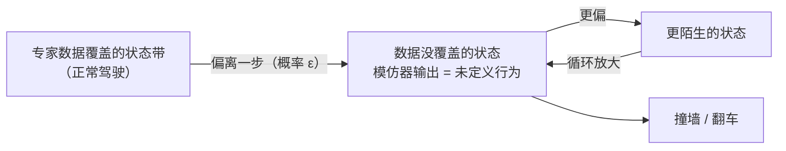
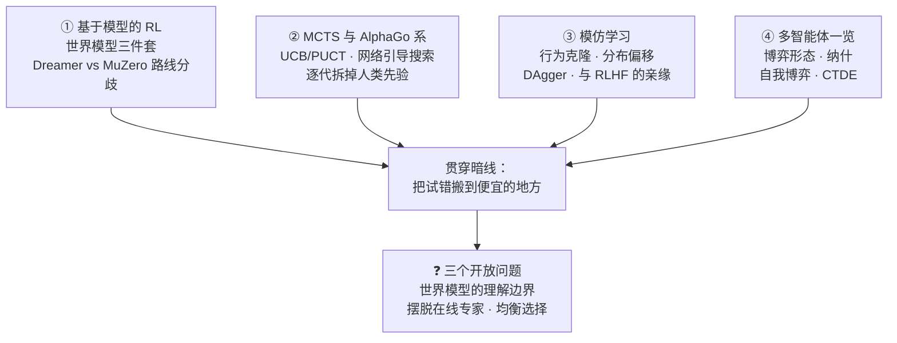
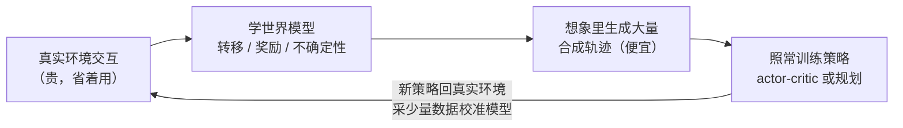
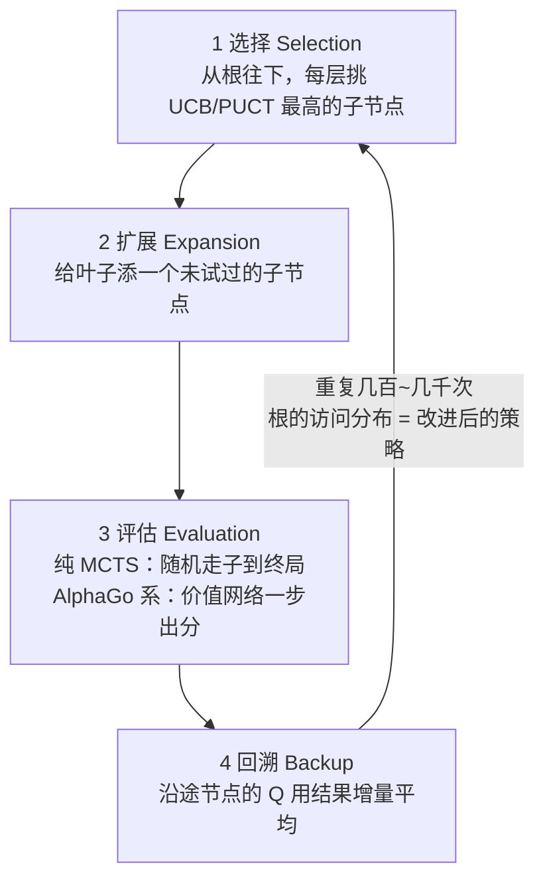
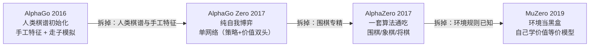
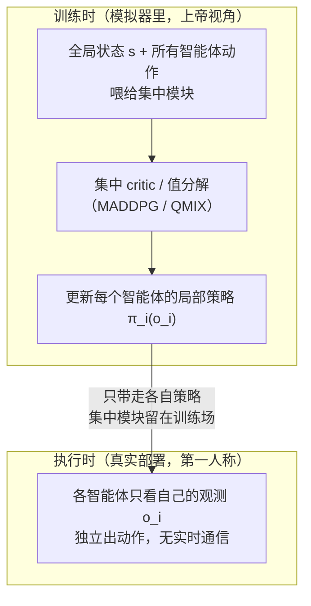

# 进阶专题：RL 全景扩展——基于模型的 RL、树搜索、模仿学习与多智能体

> **一句话理解**：无模型的在线试错（第 1~2 页）与"不许随便试错的世界"（第 3 页）之外，RL 地图上还剩四块大陆——试错太贵就先学一个环境模型在"脑内沙盘"里练（基于模型的 RL）、一步看不远就用树往前算（MCTS 与 AlphaGo 系）、有高手示范就先抄作业再谈超越（模仿学习）、决策者不止一个就把博弈论请进来（多智能体）；四块大陆共享同一句哲学：**把试错搬到便宜的地方**——搬进模型里、搬进树里、搬到老师身上、搬到对手身上。

[⬆️ 返回总目录](../../../README.md) · [⬆️ 返回本篇](../README.md) · [⬅️ 返回本章目录](./README.md)

| 属性 | 说明 |
|------|------|
| 难度 | ⭐⭐⭐⭐（高阶） |
| 所属分支 | 强化学习 |
| 前置知识 | [强化学习入门](./01-强化学习入门.md)（MDP、贝尔曼方程、UCB 长什么样）；[深度强化学习](./02-深度强化学习.md)（函数逼近、PPO）；建议先读 [进阶专题：RL 进阶](./03-进阶专题-RL进阶.md)——本页与它互补：那边讲 RLHF/GRPO/离线 RL/决策 Transformer，本页讲剩下的四块 |

---

## 📌 这一节解决什么问题

前三页加 99 页把 RL 的主干走完了：在线试错怎么学（Q 表 → DQN → PPO），不许试错的世界怎么学（RLHF、离线 RL、序列建模）。但回头看整张 RL 地图，还有四类经典问题没有着落：

1. **试错太贵**。无模型 RL 的账本是"百万级交互起步"（第 2 页三座大山之首）。游戏模拟器里摔一百万次不要钱，机器人每摔一次都是真金白银——能不能先从少量真实交互里学一个**环境模型**，以后在"自己画的地图"上把便宜的试错做完，只把验证过的动作拿到真机上？这是基于模型的 RL（Model-Based RL）与整个**世界模型**路线的出发点，也是样本效率的头号解药。
2. **一步看不远**。价值网络管"给局面估分"，但围棋这种要往前推演几十步的问题，靠网络直接输出动作远远不够——需要把**搜索树**请回来，让"直觉（网络）"与"算路（树）"分工配合。MCTS 与 AlphaGo 系是这条线的全部故事，也是"算力换智能"最早的大规模示范。
3. **明明有高手示范**。老司机、资深客服、专家操作员满地都是——"看着会"比"试出来"便宜得多。直接抄作业（行为克隆）为什么一上路就翻车？病根叫**分布偏移**，解法叫 DAgger；而它与 RLHF 的亲缘关系（SFT 本质就是行为克隆）能把本章与第 7 章缝得更紧。
4. **决策者不止一个**。真实世界的"环境"里还站着别的决策者——对手、队友、既竞争又合作的他方。单智能体的收敛理论在这里集体失效（环境本身在学），博弈论入场：纳什均衡、自我博弈、CTDE。

**与第 3 页的分工**：第 3 页讲"反馈不可全信的世界"（RM 有误差、数据有盲区、评估有方差）；本页讲"试错被搬走的世界"（搬进模型①、搬进树②、搬到老师③、搬到对手④）。两页拼起来，加上 01/02 的主干，RL 全景闭合。时间紧的读者可以按 ①→②（一条线：模型与规划）与 ③→④（一条线：人与博弈）任选一条先走。

## 🌱 通俗理解

- **基于模型的 RL = 脑内沙盘推演**。无模型 RL 学车得真摸方向盘，撞一次长一智；棋手不真下一万盘棋——他在脑内复盘打谱。学环境模型 = 给自己画一张"如果我这样走，世界会怎样"的地图；练车先在脑内练，挑出靠谱的开法再上真路。Dreamer 是"在梦里练车"（在学出来的潜空间想象里训练），MuZero 是"只学对算棋有用的地图"（不追求画得像，只追求算得准）。
- **MCTS = 老棋手的算路**。落子前在脑内往前推几步，推到没把握的地方凭直觉打分，走完一手把结果回头更新直觉——下得越多直觉越准，下次算得越快。AlphaGo 系的精髓是**直觉与算路互相喂**：网络给搜索指路（先验），搜索产出更强的着法反过来当网络的老师。
- **模仿学习 = 先抄作业，再谈超越**。行为克隆是照字帖临摹——老师写一笔你抄一笔，抄得极像；可一离开字帖自己上路，歪一点就没了参照，越歪越慌。DAgger 的办法是让老师坐副驾：你来开，开到哪个路口老师就在哪个路口补一笔示范——你见过的路口多了，自然不慌。
- **多智能体 = 从单挑到团体赛**。单智能体 RL 的"环境"是死的（规则不变）；多智能体里"环境"是活的——你练得越强对手也越强，靶子一直在动。自我博弈 = 永远有一个跟自己一样强的陪练（进步再快也不缺对手）；CTDE = 训练时教练看全局录像复盘，比赛时各打各的（没人能在出招瞬间共享视野）。

## 📋 举个例子

**例子一：UCB 手算——"不确定度津贴"如何指挥一棵三叉树。** 搜索树根节点有三个动作 A、B、C，真实平均回报（智能体不知道）分别是 1.0、0.6、0.4。按 UCT 的规矩：先各试一次，然后每轮挑"估值 + 津贴"最高的分支。取 c=1，津贴 = √(ln N / n)（N 为根的总访问数、n 为该分支访问数；系数被 c 吸收，见数学深潜一）：

| 轮次 | A：Q + 津贴 | B：Q + 津贴 | C：Q + 津贴 | 选中 |
|------|------------|------------|------------|------|
| 初始化后 N=4（√ln4≈1.18） | 1.0 + 1.18 = **2.18**（n=1） | 0.6 + 1.18 = 1.78 | 0.4 + 1.18 = 1.58 | A |
| N=5（√ln5≈1.27） | 1.0 + 0.90 = **1.90**（n=2） | 0.6 + 1.27 = 1.87 | 0.4 + 1.27 = 1.67 | A（险胜） |
| N=6（√ln6≈1.34） | 1.0 + 0.77 = 1.77（n=3） | 0.6 + 1.34 = **1.94**（n=1） | 0.4 + 1.34 = 1.74 | B |
| N=7（√ln7≈1.40） | 1.0 + 0.80 = **1.81**（n=3） | 0.6 + 0.99 = 1.59（n=2） | 0.4 + 1.40 = 1.80 | A（毫厘之间） |
| N=8（√ln8≈1.44） | 1.0 + 0.72 = 1.72（n=4） | 0.6 + 1.02 = 1.62 | 0.4 + 1.44 = **1.84**（n=1） | C（终于轮到） |

三个观察：**老大不是一直赢**——A 估值最高，但津贴衰减后 B、C 轮番拿到"试探权"；**津贴随访问数平方根级衰减**——A 的访问 1→4 次，津贴 1.18→0.72，想再减半还得访问翻两番；**没有人被永久遗忘**——C 一路挂着全满的津贴等着反超（数学深潜一给出"每个分支都会被无限次访问"的保证）。

**例子二：行为克隆的"专家没见过的状态"陷阱。** 设模仿器每一步有 ε=1% 的概率做出与老师不同的动作（在老师会遇到的那些状态上测），任务一局 T=100 步。直觉上"99% 像老师"几乎等于老师——但期望错误步数上界 ≈ εT(T−1)/2 = 0.01 × 100 × 99 / 2 ≈ **49.5 步**：一局期望错掉一半（完整推导见数学深潜二）。病根一句话：**错一步就进入"老师示范里没有的状态"，从此全凭模仿器瞎猜**——小偏移不被纠正，而是被复利放大。



<details>
<summary>📊 展开算例：例子一的树换成 AlphaZero 的 PUCT 会怎么走</summary>

AlphaZero 的选择规则 PUCT 把"无先验的津贴"换成"网络先验加权的津贴"：

$$
U(s, a) = Q(s, a) + c_{\text{puct}} \cdot P(s, a) \cdot \frac{\sqrt{\textstyle\sum_b N(s, b)}}{1 + N(s, a)}
$$

> 👉 **人话**：估值 + 一份"网络觉得有戏的程度 × 还不够了解的程度"的津贴——先验高的分支津贴大、先来；访问多了津贴照样缩水（分母在涨）。

设策略网络给出先验 P = (0.70, 0.20, 0.10)（它觉得 A 最有戏）、c=1.25。初始化各访问一次后（N=3，√3≈1.73）：

| 分支 | 津贴 = 1.25 × P × 1.73 / (1+1) | U = Q + 津贴 |
|------|-------------------------------|--------------|
| A | 1.25 × 0.70 × 1.73 / 2 ≈ 0.76 | 1.76 |
| B | 1.25 × 0.20 × 1.73 / 2 ≈ 0.22 | 0.82 |
| C | 1.25 × 0.10 × 1.73 / 2 ≈ 0.11 | 0.51 |

对比例子一：纯 UCT 在第一轮后三个分支的津贴**一样大**（1.18，谁也不偏心），PUCT 里 A 的津贴是 C 的七倍——搜索直奔网络觉得有戏的分支，C 类"网络看不上"的分支要等很久。**这就是网络引导搜索的效率来源，也是它的软肋**：先验错了，搜索跟着错（正文②展开）。

</details>

## 🧠 核心原理

### 整体流程：本页知识地图



### ① 基于模型的 RL：先学环境，再在"想象"里训练

第 1 页的值迭代/策略迭代是"已知环境模型"的上帝视角，Q-Learning/PPO 是"完全不学模型"的试错视角。基于模型的 RL 是中间道路：**模型不知道，就先学一个，然后回到上帝视角去规划**。

$$
\hat{s}_{t+1} \sim p_\phi\big(\cdot \mid \hat{s}_t, a_t\big), \qquad \hat{r}_t = r_\psi(\hat{s}_t, a_t) \qquad\Longrightarrow\qquad \text{在想象轨迹上照常训 actor–critic / 规划}
$$

> 👉 **人话**：把环境的接口换成学出来的三件套，训练循环一个字不用改——"世界模型"的全部工程含义就是这句：**环境从"只能去问"变成"自己会画"**，一条真实轨迹从此能放大出成百上千条想象轨迹。



**世界模型三件套**——为什么第三件是必需品而不是奢侈品：

| 部件 | 学什么 | 没有它会怎样 |
|------|--------|--------------|
| 转移模型 $p_\phi(\hat{s}' \mid \hat{s}, a)$ | "这样走，世界会变成什么样" | 无法想象，只能真试 |
| 奖励模型 $r_\psi(\hat{s}, a)$ | "走到那里给几分" | 想象里没有方向感 |
| **不确定性** $u(\hat{s}, a)$ | "这里我（模型）多有把握" | 策略钻模型盲区——把"模型画错的地方"当天堂 |

第三件的结构与第 3 页的 reward hacking **同构**：优化器总会系统性攻击评估体系。在 RLHF 里被攻击的是奖励模型（地图画错处被反复利用），在 MBRL 里被攻击的是环境模型——策略会专门找"模型外推出高奖励/易控制"的状态，在那里称王（**模型利用，model exploitation**）。工程解法也同款：给"模型各版本意见不一致"（集成分歧）的状态打上不可信标记，想象训练时少信或罚分——**别让优化器进地图没画准的区域**，与 KL 拴住策略是同一招。

**演进一条线**（每个变体解决前者的什么痛点）：

| 世代 | 代表 | 解决了什么 |
|------|------|-----------|
| 混用真假数据 | Dyna（1991） | 最早的原型：真交互 + 模型生成的假数据一起训 Q——表格时代够用 |
| 给模型装不确定性 | PILCO（2011，高斯过程）、PETS（2018，概率集成） | 确定性模型被策略利用 → 显式建模"模型自己多不确定"，规划时避开盲区 |
| 模型搬进潜空间 | World Models（2018） | 逐像素建模太贵 → 编码到潜空间，在"压缩版世界"里演化策略 |
| 端到端想象训练 | **Dreamer** 系（2020–） | 浅层用模型不过瘾 → 在想象轨迹上直接训 actor-critic，样本效率上一个台阶 |
| 不学重建、学价值 | **MuZero**（2019） | 重建浪费容量、且搜索需要已知规则 → 模型只对齐价值/奖励/策略（见下） |

**Dreamer 与 MuZero 的路线分歧：重建 vs 价值等价。** 这是当代世界模型最重要的一次分叉，一张表看懂：

| | Dreamer 系 | MuZero |
|--|-----------|--------|
| 内部状态怎么学 | 潜空间 + 解码器**重建观测**（像素是表征的锚） | **不重建**，只要求模型预测出的奖励/价值/策略与真环境一致（价值等价，value equivalence） |
| 哲学 | 把环境"画像"，在像里训练 | 只学"对决策有用的统计"，够算就行 |
| 模型用来干什么 | 想象轨迹上跑 actor-critic | 每步在模型上做 MCTS 规划 |
| 需要环境规则吗 | 不需要（黑盒采样即可） | 不需要（这正是它对 AlphaZero 的升级） |
| 样本效率来源 | 一条真轨迹放大成千条想象轨迹 | 树搜索：用推理时算力换每步决策质量 |
| 主场 | 机器人连续控制等样本敏感任务 | 棋类、Atari 等离散决策、规划收益大的任务 |
| 软肋 | 重建把容量花在与决策无关的细节上（像素噪声、光照） | 对"价值不敏感"的世界细节系统性失明，换了关心的目标可能要重学 |

$$
\text{价值等价：} \quad \text{不要求 } \hat{s}_{t+k} \approx s_{t+k}, \quad \text{只要求 } \hat{V}(\hat{s}_{t+k}) \approx V(s_{t+k})，\ \hat{r} \approx r,\ \hat{\pi} \approx \pi^{*}
$$

> 👉 **人话**：Dreamer 的模型要"画得像"（中间状态能解码回像素），MuZero 的模型只要"算得准"（从它推出来的分数和策略跟真环境对得上）——中间状态长什么样、甚至像不像真实世界，一概不管。

这个分歧与[第 12 章前沿地图的世界模型条目](../../5-前沿与融合/12-生成模型与多模态/05-前沿技术地图.md)里"逐像素预测 vs 表征预测（JEPA 系）"的哲学之争**是同一场争论的两个战场**：模型该忠实复刻世界，还是只学任务关心的那一部分世界？RL 侧的 Dreamer/MuZero 与生成侧的像素派/JEPA 派，各自给出了一份答案。

**失效边界三情况**（样本效率的账什么时候赚、什么时候赔）：

- **正常（模型准、视野短）**：局部动力学平滑的常规控制（机械臂、小车），短视野规划即可——模型误差小，一条真轨迹换千条想象轨迹，大赚；
- **极端（长视野、稀疏奖励）**：复合误差滚雪球（想象一步差一点，几十步后面目全非）——想象数据变成毒药；工程退路是**短 rollout**（只想象几步就截断，用 λ-回撤一类的方法回收信号），模型只当"一步预言家"；
- **失败（模型被利用）**：症状是**想象奖励暴涨、真实回报躺平**（策略找到了模型的"天堂状态"）；诊断盯"想象回报 vs 真实回报"的裂口；补救用不确定性惩罚——集成分歧大的想象状态少信。裂口持续拉大说明模型已烂，先回炉重学模型，别调策略。

### 📐 数学深潜一：UCB 的置信上界——探索项 √(ln N / n) 从哪来

**严格陈述。** K 臂老虎机，臂 j 的奖励独立有界于 [0, 1]、均值 μ_j；n_j 为臂 j 被拉次数、N 为总拉次、$\bar{x}_j$ 为样本均值。UCB1 规则：

$$
a_t = \arg\max_j \left[\, \bar{x}_j + \sqrt{\frac{2 \ln N}{n_j}} \,\right]
$$

保证（Auer et al., 2002）：以高概率，每个次优臂 j 被拉次数为 $O(\ln N / \Delta_j^2)$（Δ_j 为它与最优臂的均值差），总遗憾相应为 $\sqrt{N K \ln N}$ 量级。

> 👉 **人话**：永远选"置信区间上界最高的臂"。要么它真不错（赚），要么它其实差但样本还少（这一拉就能把它的区间压窄——也赚）。怎么选都不亏，这就是"面对不确定时保持乐观"（optimism in the face of uncertainty）的机关。

<details>
<summary>🧮 完整推导：从 Hoeffding 到 √(ln N / n) 的四步</summary>

**第 1 步：单个均值的置信半径（Hoeffding 不等式）。** 对 [0,1] 有界独立奖励的 n 个样本均值：

$$
\Pr\big[\, \bar{x}_n - \mu \ge u \,\big] \le e^{-2 n u^2} \qquad\Longrightarrow\qquad u(n, \delta) = \sqrt{\frac{\ln(1/\delta)}{2n}}
$$

> 👉 **人话**：样本均值离真值超过 u 的概率随 u 指数衰减——想要更自信（δ 更小）或样本更少（n 更小），置信半径就得更宽。

**第 2 步：失败概率怎么定——分子里的 ln N 从哪来。** δ 不能取常数：算法要拉 N 次，"至今每一次置信判断都成立"是对全部 N 次的联合事件（union bound：总失败概率 ≤ N·δ_N）。取 $\delta_N = N^{-4}$（随总次数多项式衰减），则 $\sum_N N^{-4}$ 收敛——全过程的总失败概率被压成有限小量。代回第 1 步：

$$
u(n, N) = \sqrt{\frac{\ln N^{4}}{2n}} = \sqrt{\frac{2 \ln N}{n}}
$$

正是 UCB1 的探索项（系数 2 是 δ_N 选取的痕迹，量级才是重点；例子一里把它吸进了 c）。

> 👉 **人话**：分母 n 是"这个臂自己被试了多少次"，分子 ln N 是"全场至今打了多久"——打得越久，对"每个历史判断都靠谱"的要求越高，所有臂的置信半径整体抬一档。对数增长是"要更严、但别太贵"的折中。

**第 3 步：√(1/n) 的直觉——平均的复利。** 独立噪声相加是"方差相加"（nσ²），平均后方差 σ²/n、标准差 σ/√n：**想把误差半径减半，样本要翻四倍**。Hoeffding 给任意有界分布上同一份保险（不看方差、只看界）。对照例子一：A 的访问 1→4 次，津贴 1.18→0.72——平方根级的"钝刀子"衰减，正是 UCB 不轻易放弃任何分支的定量原因。

**第 4 步：遗憾界的一句话证明思路。** 次优臂 j 的置信上界要压过最优臂，需要它的半径 ≳ Δ_j，即 $n_j \lesssim 2\ln N / \Delta_j^2$——超过这个次数后它在筛选里再也赢不了，于是被拉次数对数封顶，总遗憾 = Σ_j Δ_j · O(ln N)。

</details>

**几何解释：收缩的置信区间。** N=1000（ln N≈6.9）时不同访问次数的津贴（c=1 版）：

```text
n=1    ————————·————————     津贴 ≈ 2.63
n=4    ————·————            津贴 ≈ 1.31
n=16   ——·——                津贴 ≈ 0.66
n=64   ·                    津贴 ≈ 0.33      ← 津贴减半 ⇔ 访问次数 ×4

谁的区间上边界最高就先试谁：区间还在重叠 = "还说不准" = 继续探索的许可证
```

**反例与边界。**

1. **非平稳环境失效**：μ 不再是常数（对手也在学，见④）——UCB1 的保证全部作废，ln N 津贴"永不归零"也不该归零；滑动窗口 UCB 等变体是工程补丁；
2. **高维/连续动作失效**："逐臂数访问次数"的前提没了（臂数无穷），UCB 思想要靠连续置信域/网络化不确定性另起炉灶；
3. **有界性是门票**：重尾奖励下 Hoeffding 半径过宽，要换 Bernstein 类（利用方差信息）；
4. **PUCT 是"先验版 UCB"**：把 √(lnN/n) 换成 $c \cdot P(s,a) \cdot \sqrt{\sum_b N}/(1+N(s,a))$，统计驱动的探索变成"网络先验加权的探索"——先验错，搜索跟着错（②的软肋，例子一折叠算例已演示）。

> 👉 **一句人话**：√(ln N / n) 的分子是"全场资历"（越久越严），分母 √n 是"此臂自己的采样复利"（误差要减半、访问得翻四倍）——置信上界把"还不确定"翻译成一个会自动缩水的津贴：乐观地发钱，保守地记账。

### ② MCTS 与 AlphaGo 系：当直觉学会算路

蒙特卡洛树搜索（Monte Carlo Tree Search, MCTS）的每一次"模拟"是一个四步循环：



纯 MCTS（UCT 时代）靠"随机走到终局"给叶子打分——不用任何领域知识，在围棋上也能到业余段位水平（AlphaGo 论文的消融实验），但离职业差着数量级。AlphaGo 系的两刀升级：

| | 纯 MCTS（UCT） | AlphaZero 式（网络引导） |
|--|---------------|------------------------|
| 叶子评估 | 随机走子到终局（rollout），方差大 | **价值网络一步出分**（把整段走子压成一次前向） |
| 分支选择 | 只有访问统计（UCB，无先验） | 策略网络先验 P(s,a) 加权（PUCT），直奔有戏的分支 |
| 每步模拟量 | 要可靠需海量模拟 | **每步 800 次模拟**（AlphaZero/MuZero 论文配置） |
| 经验复用 | 每个局面一棵新树、从零统计 | 网络跨局面泛化，树用完即弃 |
| 软肋 | 采样方差大、探索无方向 | 先验差则搜索被带偏（网络与搜索一荣俱荣一损俱损） |

**搜索与学习为什么必须互相喂**。单独看：网络快但"欠考虑"（只看当前局面），搜索深但"每局面从零开始"。合起来是一个自我改进闭环——MCTS 以当前网络为先验做搜索，产出一个**比网络本身更强的着法分布**（搜索是策略改进算子）；训练目标就是让网络去拟合这个更强的分布（相当于"蒸馏自己的搜索"）。下一轮网络更强，搜索又更准——师徒互教，直到收敛。

**演进链：每一代拆掉一批人类先验。** 这是这条线最深的逻辑——从"人类知识加持"走向"数据和算力换通用性"：



| 一代 | 保留的人类先验 | 拆掉的 | 战绩（论文报告） |
|------|----------------|--------|------------------|
| AlphaGo（2016） | 人类棋谱（监督初始化）、手工特征、走子模拟 | —— | 4:1 胜李世乭 |
| AlphaGo Zero（2017） | 棋规 | 人类棋谱、手工特征、走子（只用价值网络） | 100:0 胜击败李世乭版的 AlphaGo |
| AlphaZero（2017，Science 2018） | 棋规 | 围棋专精（同一套算法与超参） | 从零训练 24 小时内三棋全部超人类 |
| MuZero（2019） | ——连规则都不给 | 环境转移模型（自己学，见①的对比表） | 三棋 + 57 个 Atari 游戏通吃 |

暗线一句话：**AlphaGo 用人类知识起跳，之后每一代都在证明"上一块人类先验其实可以用数据和算力换掉"**——与监督学习里"端到端学习取代手工特征"是同一场革命在决策领域的重演。注意边界：拆先验不等于不需要先验——PUCT 里的网络先验就是"学出来的先验"取代"人写的先验"，搜索架构本身仍是一条强手工设计。

### ③ 模仿学习：抄作业的学问

**行为克隆（Behavior Cloning, BC）**：把专家轨迹 (s, a) 当监督数据，学一个条件分布：

$$
\mathcal{L}(\theta) = -\,\mathbb{E}_{(s, a) \sim \mathcal{D}_E}\big[\, \log \pi_\theta(a \mid s) \,\big]
$$

> 👉 **人话**：看见老师的局面，照抄老师的动作——就是监督学习，损失就是第 7 章语言模型的下一词预测损失原样搬家（"看到前缀，抄下一个 token"）。

它的病（例子二已演示）是**分布偏移**：训练数据的状态分布是"专家会遇到的"（老师开车永远居中、永远从标准发球位出发），部署时自己滚轨迹，一步小偏差就掉进"数据没覆盖的状态"，模仿器在那里输出未定义行为，偏得更多。**这是时间轴上的分布偏移**——与第 3 页离线 RL 的分布偏移（数据分布外的动作）同病根、不同发作方式；数学深潜二给出它的定量账本 O(εT²) 与 DAgger 的修复 O(εT)。

**DAgger（Dataset Aggregation，数据聚合）的交互修正思想**：别让老师开车给你看，**你开车、老师看着**——你开到哪里，就在哪里问老师"此处他会怎么开"，把答案并进数据集。几行伪代码：

```text
β 从 1 逐步衰减到 0：
    用混合策略执行（β 概率老师接管，1−β 概率你来开）
      → 轨迹状态 ≈ "你自己会访问的分布"
    请老师在轨迹的每个状态上标注正确动作 → 并入数据集 D
    在聚合后的 D 上重新拟合策略
```

每一轮都在"自己真正会去的地方"补课。代价清楚：**老师必须在线可查**（要能对你开到的陌生状态即时给答案）——贵、慢，有时根本请不到（专家只留下录像、或标注一次就撤）。DAgger 修的是分布偏移项，不修"老师水平"这个天花板（想超过老师？那要去 RL，见下面的联系）。

**与 RLHF/偏好学习的联系**（与[第 7 章微调与对齐](../07-自然语言处理与LLM/05-微调与对齐.md)、[第 3 页](./03-进阶专题-RL进阶.md)互为表里）：

1. **一条演化线：不断降低对"人类 oracle"的要求**。BC 要求逐状态给正确动作（最贵）；DAgger 把"给动作"限定在"你开到的状态上"（还是在线）；偏好学习进一步放松成"两个回答哪个更好"（离线、相对判断——人类最擅长的形态）。降低 oracle 要求 = 降低人类标注的边际成本，RLHF 是这条线的当前终点；
2. **SFT 就是行为克隆**。RLHF 三阶段里的监督微调，本质是对人类示范的 BC——第 3 页把它讲成"给 KL 定锚点"，本页补上模仿学习视角：**RL 阶段存在的理由之一，正是 BC 的两个天花板**（不能超专家、分布偏移）只能靠与环境交互的优化来拆；
3. **BC 初始化 + RL 微调是稀疏奖励任务的生产标配起手式**：先用示范走到"奖励常客"的区域，RL 才有信号可学（99 页仿真姿势的常见开局）。

两个一句话级的亲戚：**逆强化学习（IRL）**——从示范反推老师的奖励函数再优化，"学老师的目标而不是动作"；**GAIL**——对抗式模仿，判别器分不清你和专家即毕业（GAN 思想嫁接模仿学习）。

### 📐 数学深潜二：行为克隆的误差复利——O(εT²) 与 DAgger 的 O(εT)

**严格陈述。** 专家策略 π*，模仿器 π 在专家访问的状态分布上每步以 ≤ ε 的概率选出与专家不同的动作；任务长 T 步、每错一步代价 1。取最坏情形假设"一旦偏离专家分布，此后步步都可能错"，则行为克隆的期望错误步数：

$$
\mathbb{E}\big[\#\text{错误步}\big] \;\le\; \sum_{t=1}^{T} \min\big(1,\; \varepsilon\, t\big) \;\le\; \frac{\varepsilon\, T (T-1)}{2} \;=\; O(\varepsilon T^2)
$$

（Ross & Bagnell 2010 的简化版——原界还含"专家自身鲁棒性"项，这里取干净的最坏情形；DAgger 类交互式方法把同一账压到 O(εT)。）

> 👉 **人话**：每步只错 1%，一局 100 步却期望错掉约 50 步——错误不是加法累积，是**复利累积**：早错的一步把后面所有步都拖进"没有示范的区域"。

<details>
<summary>🧮 完整推导：四步算出 εT²/2，再算出 DAgger 为什么是 εT</summary>

**第 1 步：拆成"首次出错时刻"。** 令 F_k = "前 k 步至少错过一次"。若首次出错发生在第 k ≤ t 步，最坏情形下此后步步皆错 → 第 t 步出错的概率 ≤ P(F_t)。

**第 2 步："前 t 步全对"的概率。** 归纳：只要还没错过，状态就仍在专家分布上（与训练分布一致），每步做对的概率 ≥ 1−ε → P(前 t 步全对) ≥ (1−ε)^t。

**第 3 步：两种放缩。** $P(F_t) = 1 - (1-\varepsilon)^t \le \min(1,\ \varepsilon t)$——一步用伯努利不等式 $(1-\varepsilon)^t \ge 1 - \varepsilon t$，一步用概率封顶 1。

**第 4 步：求和（曲棍球杆的面积）。** $\mathbb{E}[\#\text{错}] \le \sum_{t=1}^{T} \min(1, \varepsilon t)$：εt < 1 的部分是等差数列（ε·t 求和 = εT(T−1)/2），之后封顶为 1。数值表：

| 场景 | ε | T | O(εT²) 上界 | O(εT)（DAgger 后） |
|------|---|---|-------------|--------------------|
| 短任务·小误差 | 1% | 20 | ≈ 1.9 步 | ≈ 0.2 步 |
| 长任务·小误差 | 1% | 100 | **≈ 49.5 步（半局报废）** | ≈ 1 步 |
| 长视野 | 1% | 1000 | ≈ 950 步（几乎全错） | ≈ 10 步 |

**DAgger 为什么能压到 O(εT)**：O(εT²) 的病根是"训练分布（专家的）≠ 部署分布（自己的）"。DAgger 每轮在自己的分布上补数据，t 步时"仍在见过的分布上"的把握不再是 $(1-\varepsilon)^t$ 的复利，而是各轮数据覆盖的并集；残留的 εT 是"老师自己每步也有 ε 变数"的地板，任何方法都消不掉。

**反例与边界**：

1. **上界是最坏情形**：错误可自愈的任务（稳定动力学会把状态拉回数据区）实际远小于 εT²——但驾驶、金融这类"边缘即深渊"的任务恰是最坏情形友好型；
2. **ε 恒大于 0**：函数逼近误差 + 数据覆盖缺陷保证 ε 不为零，"完美克隆"只在教科书里；
3. **长视野比高误差更致命**：T 翻十倍、错误上百倍；ε 翻十倍、错误只翻十倍——"短任务 BC 够用、长任务必须修正"的定量原因；
4. **DAgger 的前提是在线专家**：专家只能离线留示范时 DAgger 用不了，退回 BC + 分布正则（限制策略别离数据太远，与第 3 页离线 RL 的保守主义同思路）。

</details>

**几何解释：曲棍球杆。**

```text
P(第 t 步在错)
  1 ┤                        ●●●●●●●●●●●●   ← 封顶：εt ≥ 1 之后几乎必错
    │                 ●●●
    │            ●●                 P(F_t) ≤ min(1, εt)
    │       ●●
  0 ┼──●───────────────────────────────▶ t
    0            1/ε                 T
  期望错误步数 = 杆子下的面积 ≈ εT²/2（斜率 ε 的直线扫出的三角形 + 顶部矩形）
```

> 👉 **一句人话**：BC 的错是"滚雪球"——一次走神，全程抓瞎；DAgger 的修法是"沿着你自己上一次的行车路线补路牌"——路牌补在你真会走的地方，而不是老师爱走的地方。

### ④ 多智能体 RL 一览：当环境里也有学习者

单智能体的 MDP 到 n 个决策者，正式的舞台换成马尔可夫博弈（Markov Game）：

$$
P(s' \mid s, a_1, \dots, a_n), \qquad r_i(s, a_1, \dots, a_n), \quad i = 1, \dots, n
$$

> 👉 **人话**：世界怎么变，取决于**所有人一起**做了什么；每个人的得分也由联合动作决定——"环境"从此有了自己的心思。

**三种博弈形态**：

| 形态 | 奖励结构 | 例子 | 学习目标 |
|------|----------|------|----------|
| 合作 | 各智能体共享奖励（或同向） | 多机器人搬桌子、车队编组 | 最大化团队回报（难点变成功劳分配与规模） |
| 竞争 | 零和：你的得分 = 我的失分 | 棋类、格斗、即时战略对战 | 极小化对手的最大收益（min-max） |
| 混合 | 一般和：有共同利益也有冲突 | 捕食者-猎物、自动驾驶竞合 | 纳什均衡（或其精炼） |

**纳什均衡一句话**：一组策略，使得任何玩家**单方面**改变自己的策略都得不到更高收益——"给定别人都不动，我也不想动"。（它是"稳定点"不是"最优点"：囚徒困境的均衡是双输。）

**为什么单智能体的理论在这里集体失效**：第 1 页讲过 Q-Learning 收敛三条件在现实中凑不齐，其中"环境非平稳"一条在多智能体里成了标配——你的"环境"包含别人，别人也在学：你收敛到的"最优"取决于别人的策略，而别人的策略取决于你。**追逐移动靶**，这就是博弈论必须入场的理由。

**自我博弈为什么有效**（AlphaZero / OpenAI Five 式课程）：

1. **陪练强度自动匹配**：对手是最新版本的自己——你变强它同步变强，永远势均力敌，课程难度自动生成，不会"碾压弱者"（学不到东西）也不会"被碾压"（同样学不到）；
2. **数据自产无限**：两个自我对打就是无限盘新对局，不需要人类标注；
3. **天花板被拆掉**：AlphaGo 从人类棋谱出发，天花板是人类棋力；AlphaZero 纯自我博弈反而更强（100:0 胜过击败李世乭的版本）——去掉人类数据，上限也没了。

**自我博弈的病与药**：

- **循环克制**：策略 A 克 B、B 克 C、C 克 A——"变强"没有传递性，排名绕圈；
- **遗忘**：新版只对最新对手优化，克制老风格的技能退化；
- **自钻空子**：过度利用"自己"的系统性弱点，学出畸形风格——OpenAI Five 早期学出"五人抱团平推"的打法（后来靠训练设置与对手池矫正）。

药是**把"最新的自己"换成"一群自己"**：历史版本对手池（OpenAI Five：主要打最新自己、定期打历史版本，防遗忘与循环）、联赛训练（AlphaStar：主力智能体 + 专职找主力弱点的"剥削者" + 历代冠军存档，防风格锁定）——竞技 AI 的标准件。

**CTDE（Centralized Training with Decentralized Execution，集中训练分散执行）**：



工程意义三条：

1. **真实部署往往没有实时全局通信**（带宽、延迟、断连、隐私），执行必须各自为战——CTDE 把"执行时的约束"写进训练的制度里；
2. **训练时的全局信息是白拿的**（模拟器/日志里全都有，呼应 99 页仿真姿势）——CTDE = "训练用上帝视角、执行用第一人称"的制度化，两头便宜都占；
3. 两条落地路线一句话：**集中 critic**（MADDPG：critic 吃 (s, a_1..a_n)，把"别人的动作"当条件而不是环境噪声，直面非平稳性）；**值分解**（QMIX：各智能体的局部 Q_i 单调混合成 Q_tot，保证"局部最优拼起来仍是全局最优"）。另有 MAPPO 证明"PPO + 集中 value"在不少基准上就能打平专用算法——工程意义大于算法意义：少养一套专用基建。

本节是"一览"定位：把形态、均衡、自我博弈、CTDE 四个名词钉在地图上，深挖留给未来（见开放问题）。

## 💻 动手试试

用 numpy 跑三个最小演示：**UCB1 的探索预算分配、行为克隆的分布偏移与 DAgger 修复、自我博弈的循环克制**（先安装：`pip install numpy`）：

```python
import numpy as np
rng = np.random.default_rng(0)

# ==== 演示一：UCB1 多臂老虎机——"不确定度津贴"如何分配探索预算 ====
probs = [0.3, 0.5, 0.7]                       # 三台机器的真实中奖率（学习者不知道）
K, T = len(probs), 2000
counts = np.zeros(K); values = np.zeros(K)
for a in range(K):                            # 初始化：每臂各拉一次
    counts[a] = 1
    values[a] = float(rng.random() < probs[a])
for t in range(K + 1, T + 1):
    bonus = np.sqrt(2 * np.log(t) / counts)   # 深潜一的公式
    a = int(np.argmax(values + bonus))        # 乐观者：谁的置信上界高选谁
    win = float(rng.random() < probs[a])
    values[a] += (win - values[a]) / (counts[a] + 1)   # 增量平均（回溯）
    counts[a] += 1
best = np.argmax(probs)
print("UCB1 拉动次数：", counts.astype(int))
print("理论预测 O(lnT/Δ²)：约", [round(2*np.log(T)/(0.7-p)**2) for p in probs[:2]], "… 其余给最优臂")
# 预期输出（随种子波动）：最优臂约 1700+ 次（近九成）；0.5 的臂约 200 次；0.3 的臂约 50 次
# —— 次优臂的拉动次数与 Δ² 成反比：差距越大越早"看破"；理论 O(lnT/Δ²) 只是上界，实测更低

# ==== 演示二：行为克隆的分布偏移 vs DAgger ====
def expert(x):                                # 专家：饱和转向（打方向有物理上限 ±0.5）
    return float(np.clip(-2.0 * x, -0.5, 0.5))
def rollout(x0, policy, T=40):                # 闭环滚动：x_{t+1} = x_t + u_t
    x, xs = x0, [x0]
    for _ in range(T):
        x = x + policy(x)
        xs.append(x)
        if abs(x) > 5:                        # 撞墙出局
            break
    return np.array(xs)
fit = lambda X, U: np.poly1d(np.polyfit(X, U, deg=9))    # 高容量模仿器（神经网络的精神替身）

X, U = [], []                                 # 行为克隆：示范全部从"标准发球位"出发
for _ in range(300):
    xs = rollout(rng.uniform(-0.5, 0.5), expert)
    X.extend(xs); U.extend([expert(v) for v in xs])
bc = fit(X, U)
print("\n部署起点 x0=2.0（专家示范从没覆盖的区域）：")
print(f"  专家   终点 |x| = {abs(rollout(2.0, expert)[-1]):.3f}（饱和转向稳稳拉回）")
xs_bc = rollout(2.0, bc)
print(f"  BC     终点 |x| = {abs(xs_bc[-1]):.0f}（9 阶多项式在外推区失控，一步冲出 5 的界）")
# numpy 会顺手警告 Polyfit may be poorly conditioned——这本身就是"高容量模仿器
# 在窄数据上病态"的证据，正好当教具；DAgger 聚合 wider 数据后警告也随之消失

for beta in [0.7, 0.4, 0.0]:                  # DAgger：我开老师标，β 概率老师接管
    pi = fit(X, U)
    x, xs = 2.0, [2.0]
    for _ in range(40):
        u = expert(x) if rng.random() < beta else pi(x)
        x = x + u
        xs.append(x)
        if abs(x) > 5:
            break
    X.extend(xs); U.extend([expert(v) for v in xs])     # 老师在我到过的状态补示范
dag = fit(X, U)
print(f"  DAgger 终点 |x| = {abs(rollout(2.0, dag)[-1]):.3f}（三轮补课后同样稳稳拉回）")

# ==== 演示三：自我博弈的循环克制 vs 打"历史平均的自己" ====
acts = ["石头", "剪刀", "布"]
seq, a = [], 0
for _ in range(6):                            # 朴素自我博弈：总针对"最新自己"出克制招
    seq.append(acts[a]); a = (a + 1) % 3
print("\n追最新的自己：", " → ".join(seq), "（永远循环，谁也不收敛）")
hist = np.ones(3)                             # 改打"历史平均的自己"：虚拟自我博弈缩影
for _ in range(3000):
    avg = hist / hist.sum()
    a = (int(np.argmax(avg)) + 1) % 3         # 克制"平均的自己"最爱出的招
    hist[a] += 1
print("打历史平均 3000 轮后的出招分布：", np.round(hist / hist.sum(), 3),
      "→ 收敛到均衡 (1/3, 1/3, 1/3)")
# 🧪 实验建议（改什么参数，看什么变化）：
# 1) 演示一把探索系数整体乘 10（或 0.1）：拉动次数趋于均匀（过度探索）/ 趋于单臂（过早收敛）；
#    把 probs 改成 [0.5, 0.5, 0.5]：无差距可分，UCB1 只好平均分配——Δ 的作用；
# 2) 演示二把 deg=9 改成 deg=1（线性模仿器）：BC 可能"侥幸不翻车"（低容量外推保守）——
#    容量越大，分布偏移越危险；把示范起点范围放宽到 ±2：BC 也稳——覆盖才是根治；
# 3) 演示二把 DAgger 的 beta 全改成 0（老师从不接管）：第一轮就在陌生区域乱飞，
#    聚合的数据质量差——β 衰减的意义是"先让老师带着走稳，再逐步放手"；
# 4) 演示三把 3000 改成 300：分布还在 1/3 附近晃——收敛是"平均意义上"的慢功夫；
#    数一数 hist 的三个计数差：始终保持在个位数（循环被平均摊平）。
```

预期输出：最优臂独得近九成拉动（次优臂按 Δ² 反比早早"看破"）；BC 在部署起点一步失控、|x| 冲出边界（上万量级），DAgger 三轮补课后终点回到 0.02 量级；朴素自我博弈在三种招式间永远循环、打历史平均精确收敛到均匀均衡——三个演示分别坐实深潜一、深潜二与④的核心断言。

## 🔥 炼丹小灶

> 🔥 **炼丹小灶**：本页四块内容的起点配方（经验参考）——
> - MBRL/Dreamer 式：想象 rollout 长度取个位数到二十步量级（长了复合误差爆炸、短了规划没深度）；模型坏了全盘皆输，给模型损失更大的"重启耐心"（模型先稳、策略后训）；不确定性用小集成（几个模型看分歧）起步；
> - MCTS/PUCT：每步模拟次数从几百到 800（AlphaZero 论文配置）起步；PUCT 系数 ~1.25（AlphaZero 伪代码默认）；根节点先验加狄利克雷噪声是自我博弈训练的标配（防搜索路径锁死）；
> - BC/DAgger：先查"专家数据覆盖面"再谈模型容量；模仿器容量宁小勿大（容量是分布偏移的放大器，见演示二的实验建议 2）；DAgger 的 β 从 1 衰减到 0、轮数个位到十位数；
> - MARL/CTDE：先跑"每个智能体独立当单智能体"的基线，再上 QMIX/MAPPO；集中 critic 的输入随智能体数线性膨胀，注意标准化；
> - ⚠️ 以上是经验参考值，不是圣旨；换环境请重新炼。

## 🔗 在知识树中的位置

- **上游**：[强化学习入门](./01-强化学习入门.md)（贝尔曼方程、UCB 的样子、收敛三条件）；[深度强化学习](./02-深度强化学习.md)（函数逼近、PPO、致命三件套）；[进阶专题：RL 进阶](./03-进阶专题-RL进阶.md)（分布偏移的"数据侧"版本、RLHF 三阶段）；[第 12 章前沿技术地图](../../5-前沿与融合/12-生成模型与多模态/05-前沿技术地图.md)的世界模型条目（逐像素 vs 表征预测的哲学上游）；
- **下游**：[生产实战](./99-生产实战.md)——仿真姿势 = 想象增广 + 域随机化的组合拳；BC 初始化 + RL 微调的起手式；竞技/游戏 AI 的搜索与自我博弈配置；
- **横向对比**：Dreamer 重建 vs MuZero 价值等价，正是第 12 章"像素预测 vs JEPA 表征预测"之争在 RL 的投影；MBRL 的模型利用与第 3 页 reward hacking 同构（优化器攻击评估体系：一个攻环境地图、一个攻奖励地图）；BC 的分布偏移与离线 RL 的分布偏移同病根（一个在时间轴上自己滚出来、一个在数据分布外发作）；决策 Transformer（第 3 页）是模仿学习的"离线亲戚"——都在复现数据中的行为，天花板同为数据最优；MCTS 的"推理时多算"与 LLM 推理的思考预算是同一笔"训练算力 vs 推理算力"的账（深度视角二）。

## 🎓 深度视角

**三个真实取舍**：

1. **样本效率 vs 模型偏差，是 MBRL 的主轴账本**。无模型 RL"用样本换确定性"（不依赖任何学出来的东西），MBRL"用模型偏差换样本"（一条真轨迹换千条想象轨迹）。判断式很朴素：**一次真实交互的成本 ÷ 学一个够用模型的算力成本**——模拟器里交互近乎免费（游戏），无模型照样是首选；真机上一次摔倒几十块钱（机器人），养模型就划算。没有普适答案，只有这道除法。
2. **学习 vs 搜索的分工 = 训练算力 vs 推理算力的分工**。纯网络一步出招（反应快、欠考虑），搜索几百次模拟（深思熟虑、每步都贵）。AlphaZero 每步 800 次模拟是"推理时多想"的经典配置；同一种交换在 2024–2026 的大模型推理（推理时扩展计算、长思考链）里原样重现——**把算力花在推理时买深度，还是花在训练时买直觉**，是跨越棋类与语言的一致选题。
3. **模仿给地板，RL 给天花板**。BC/DAgger 快速达到"专家水平 ± ε"、但天花板是数据里的专家；RL 能超越数据（自我博弈 100:0 即证），却要付探索与奖励设计的钱。生产组合拳几乎总是"BC 初始化 → RL 微调"（RLHF 的 SFT→RL 管线是它的对齐版）——**不是巧合，是同一本账的两次记法**。

**高级深问与答**：

<details>
<summary>深问 1：MuZero 的"价值等价"和 Dreamer 的"重建"，谁更根本？</summary>

取决于模型要服务一个任务还是一族任务。价值等价在"决策只关心价值/奖励/策略"的单任务上是严格更省的——不浪费容量去建模与决策无关的细节（这是它样本效率的来源）；但它的内部状态对"价值不敏感"的维度系统性失明，换一个关心点（新任务、新奖励）可能要重学。重建型模型的表征更通用（像素级的锚让中间状态携带完整信息），代价是容量浪费。与第 12 章 JEPA 的立场对照：LeCun 反对像素预测的理由（容量浪费在不可预测也不重要的细节）正是 MuZero 立场的生成侧版本——两个战场，同一杆秤。

</details>

<details>
<summary>深问 2：自我博弈在棋类与竞技游戏里大获成功，为什么搬到真实世界就难？</summary>

自我博弈的三个前提在竞技游戏里天然成立：奖励干净（胜负分明、可机器判定）、世界封闭（规则不变、无分布漂移）、对手可无限廉价复制（自我对打零成本）。真实世界常常三条全缺：奖励含糊（"服务好客户"没法判胜负）、环境开放（用户与市场在漂移）、还有第三方（人类）被卷进博弈——奖励由人定义时，"钻空子"的舞台直接开演（第 3 页 reward hacking）。缺任何一条，自我博弈的"势均力敌陪练"就断供：要么课程塌了，要么收敛到钻规则空子的畸形策略。

</details>

## 🔬 SOTA 演进（2023–2026）

按本页主题（模型、搜索、模仿、多智能体），只记三条白名单（一句话级）：

| 方向 | 一句话定位 |
|------|-----------|
| **Dreamer 系持续演进** | 从 Dreamer 到 DreamerV3（2023）：一套固定超参数横跨从像素控制到 Minecraft 的多样任务，并成为首个不靠人类数据在 Minecraft 采到钻石的算法——世界模型路线"不调参通用性"的标志进展，系列仍在向更通用的世界模型演进 |
| **MuZero 后续** | EfficientZero（2021）在 Atari 100k 基准（每游戏仅约 10 万帧交互）上达到超人类表现——自监督一致性损失等三项改造把 MuZero 的样本效率推上新量级，"少数据 + 树搜索"路线的代表作 |
| **自我博弈竞技 AI 成熟化** | AlphaStar（2019，星际争霸，联赛训练达人类宗师段位）与 OpenAI Five（2019，Dota 2，击败世界冠军战队 OG）之后，"自我博弈 + 对手池/联赛"已是竞技游戏 AI 的成熟标准件，不再需要为单个游戏发明新算法 |

> 👉 **人话**：三条连起来读——世界模型越来越省数据（Dreamer 系）、树搜索在省数据的路上越走越远（EfficientZero）、自我博弈成了不再上新闻的基础设施（成熟应用的标志恰恰是"不再新奇"）。

## ❓ 开放问题

1. **世界模型学到的是"理解"还是"够用"？** 价值等价模型在训练任务上够用，但它学到的是"这局棋怎么算"还是"世界怎么运作"？判别办法之一是迁移：换任务、换关心点后模型是否还可用。当前证据两可——而这个问题与第 12 章开放问题（像素派与表征派谁能先落地具身智能）是同一个问题的两个投影，答案大概率同时到。
2. **模仿学习能否摆脱"在线专家"？** DAgger 类方法的理论保证都要专家可随时查询；现实里专家贵、会退场。大模型时代出现新形态的"示范"（思维链、操作轨迹），也出现新形态的分布偏移（模型自己生成的推理步骤滚出的未知状态）——"在自己访问的分布上补监督"这个 DAgger 核心思想，正在以数据合成与回流的马甲重新入场，但理论保证没有跟上。
3. **多智能体会收敛到哪个纳什？** 学习动态（梯度、自我博弈、种群演化）没有一般性的均衡收敛保证——循环、漂移、锁定都常见；而且"收敛到哪个均衡"本身是价值判断：社会最优往往不是均衡（囚徒困境），算法默认收敛到的均衡可能系统性地偏向强势玩家。均衡选择的标准一旦从"能收敛"变成"该收敛到哪"，多智能体 RL 就从工程问题变成了制度设计问题。

## ⚠️ 常见误区

- **误区一**："基于模型的 RL 更高级，该总是用它" → 它用模型偏差换样本效率：交互便宜时（模拟器）无模型更稳更简单；模型被利用、复合误差是它自己的两种死法——先算"交互成本 ÷ 模型成本"这道除法（深度视角一）；
- **误区二**："AlphaGo 赢是因为搜索算力堆得猛" → 纯 MCTS 堆算力在围棋只有业余段位水平（AlphaGo 论文消融）；赢的是"网络先验引导搜索 + 搜索反哺网络"的闭环，算力只是燃料；
- **误区三**："行为克隆就是监督学习，样本够多就没问题" → 样本再多也只覆盖"专家会遇到的分布"；误差复利 O(εT²) 说明长任务里 1% 的每步误差能毁掉半局——问题在分布不在数量；
- **误区四**："一直跟自己下，就会越来越强" → 自我博弈有循环克制与遗忘两种病，"变强"没有传递性——对手池与联赛不是锦上添花，是自我博弈能收敛的前提；
- **误区五**："多智能体 = 把单智能体算法并行跑 n 份" → 并行跑等于把别人当"环境噪声"，追逐移动靶且互为噪声源；CTDE、博弈论工具（均衡、对手建模）才是对症药；
- **误区六**："MuZero 学会了环境规则" → 它学的是"对预测价值/奖励/策略够用的统计"（价值等价），不是物理规则；在价值不敏感的维度上它系统性失明，出了训练分布照样瞎；
- **误区七**："DAgger 解决了模仿学习" → 它只修分布偏移这一项（O(εT²)→O(εT)），天花板仍是专家水平，且前提是专家在线可查（贵、常不可得）——想超专家要接 RL，请不到在线专家要退回保守正则。

## 📝 小结与自测

**要点回顾**

- 基于模型的 RL = 先学环境模型再规划：世界模型三件套（转移/奖励/**不确定性**——第三件防策略钻模型盲区，与 reward hacking 同构）；一条真轨迹放大成千条想象轨迹是样本效率的来源，复合误差与模型利用是它的两种死法（三情况：短视野赚、长视野赔、被利用崩）；
- Dreamer vs MuZero = 重建 vs 价值等价：前者把环境"画像"（潜空间 + 解码器），后者只学"对决策有用的统计"（奖励/价值/策略三头对齐）——与第 12 章"像素 vs JEPA"是同一场哲学之争的两个战场；
- MCTS 四步循环（选择/扩展/评估/回溯）；UCB 的探索项 √(lnN/n)：分子是全场资历、分母是此臂的采样复利（津贴减半 ⇔ 访问 ×4）；网络引导搜索的两刀：先验缩小分支（PUCT）+ 价值网络替代走子；
- AlphaGo→AlphaGo Zero→AlphaZero→MuZero：逐代拆掉人类棋谱、手工特征、领域专精、环境规则——"用数据与算力换通用性"的决策版革命；
- 行为克隆 = 监督学习搬家，死于分布偏移：误差按 O(εT²) 复利（1% 每步误差、100 步期望毁半局）；DAgger 在"自己访问的分布"上补标注压到 O(εT)，代价是在线专家；
- 模仿与 RLHF 的亲缘：一条"降低对人类 oracle 要求"的演化线（给动作 → 给状态上的动作 → 给偏好）；SFT 本质是 BC，RL 阶段拆它的两个天花板；
- 多智能体：合作/竞争/混合三形态；纳什均衡 = "没人想单方面变招"；自我博弈有效在"陪练自动匹配强度"，病在循环克制与遗忘（药：对手池/联赛）；CTDE = 训练用上帝视角、执行用第一人称，是部署约束的制度化；
- 一条贯穿全页的暗线：**把试错搬到便宜的地方**——搬进模型（①）、搬进树（②）、搬到老师（③）、搬到对手（④）；而每次搬家都引入新的"中介风险"：模型可被利用、搜索被先验带偏、老师有上限、对手池设计不当会锁死风格。

**自测一下**（点击展开答案）

<details>
<summary>问题 1：世界模型三件套里，"不确定性"为什么是必需品而不是锦上添花？</summary>

因为优化器会系统性地攻击评估体系（与 reward hacking 同构）：没有不确定性度量时，策略会专门寻找"模型外推出高奖励/易控制"的盲区状态（模型利用），在想象里称王、在真实环境里翻车。不确定性（如模型集成的分歧）给"模型没画准的区域"打了标记，想象训练时少信或罚分——把优化器挡在地图没画准的区域之外，与 RLHF 用 KL 拴住策略是同一招。

</details>

<details>
<summary>问题 2：UCB 的探索项 √(ln N / n) 里，分子 ln N 和分母 √n 各自在讲什么故事？</summary>

分母 √n 是"此臂自己的采样复利"：n 个样本平均后标准差按 1/√n 收缩，津贴随访问数平方根级衰减（要减半得访问翻四倍）——所以任何分支都不会被轻易放弃。分子 ln N 是"全场资历"：算法要求"至今所有 N 次置信判断都成立"（union bound），失败概率随 N 多项式衰减、置信半径对数抬升——打得越久标准越严，但只贵一个对数。两者合起来：乐观地发钱（先试不确定的），保守地记账（钱会自动缩水）。

</details>

<details>
<summary>问题 3：AlphaGo 系每一代各拆掉了什么人类先验？为什么说"拆先验"反而是变强的路线？</summary>

AlphaGo 用了人类棋谱初始化、手工特征与走子模拟；AlphaGo Zero 拆掉人类棋谱与手工特征（纯自我博弈、棋盘直读）；AlphaZero 拆掉围棋专精（一套算法通吃三棋）；MuZero 拆掉"环境规则已知"（连转移模型都不给，自己学价值等价模型）。变强的原因：人类先验是双刃剑——它给起点也定天花板（人类棋谱的水平上限、手工特征的视角局限），而自我博弈 + 搜索能探索出人类没走过的策略空间（AlphaGo Zero 100:0 即证）。这与监督学习"端到端取代手工特征"是同一场革命。

</details>

<details>
<summary>问题 4：每步 99% 像老师的行为克隆，为什么一局 100 步期望要错约 50 步？DAgger 怎么把它压回 1 步量级？</summary>

错误是复利不是加法：首次出错把状态带进"专家示范没有覆盖的区域"，此后步步都在分布外（最坏情形步步错）。第 t 步仍在错的概率 ≤ min(1, εt)，求和得 O(εT²)：ε=1%、T=100 时代入 ≈ 49.5 步。DAgger 每轮让学习者自己滚动（β 概率专家接管）、专家在"学习者到过的状态"上补标注并聚合重训——训练分布逐步逼近部署分布，第 t 步的把握从 (1−ε)^t 的复利变成数据覆盖的并集，期望错误降到 O(εT)（εT 是"老师自己每步也有 ε"的地板，消不掉）。

</details>

<details>
<summary>问题 5：CTDE 解决了什么矛盾？为什么"集中训练"必须配"分散执行"？</summary>

矛盾是：训练时模拟器里有全局信息（上帝视角白拿），执行时真实部署往往没有实时全局通信（带宽/延迟/断连），只能各看各的局部观测。CTDE 把这对矛盾制度化：集中模块（critic 吃全局状态与所有动作、或值分解）只在训练场使用，下载给每个智能体的只有依赖局部观测的策略——两头便宜都占：训练吃全局信息的红利，执行吃无通信约束的自由。反过来若执行也要集中（实时通信决策），延迟与断连就是系统单点故障。

</details>

<details>
<summary>问题 6：MBRL 的"想象奖励暴涨、真实回报躺平"，病在哪、怎么诊断、怎么补救？</summary>

病在模型利用：策略找到了模型的盲区/外推天堂（模型在那里错报高奖励或错报易控），优化器当然搬进去住。诊断：持续盯"想象回报 vs 真实回报"的裂口——裂口拉大即在钻模型空子。补救：给不确定性高的想象状态降权/罚分（集成分歧）、缩短想象 rollout、用真实交互定期校准模型；裂口持续拉大说明模型整体已烂，先回炉学模型，别调策略。

</details>

## 📚 延伸阅读

- 论文：Sutton, *Dyna, an Integrated Architecture for Learning, Planning, and Reacting*（1991）——真假数据混训的鼻祖
- 论文：Ha & Schmidhuber, *World Models*（2018），https://arxiv.org/abs/1803.10122 ——潜空间世界模型的重启之作
- 论文：Hafner et al., *Dream to Control: Learning Behaviors by Latent Imagination*（Dreamer, 2020），https://arxiv.org/abs/1912.01603 ；*Mastering Diverse Control Tasks through World Models*（DreamerV3, 2023），https://arxiv.org/abs/2301.04104
- 论文：Schrittwieser et al., *Mastering Atari, Go, Chess and Shogi by Planning with a Learned Model*（MuZero, 2019），https://arxiv.org/abs/1911.08265
- 论文：Silver et al., *Mastering the Game of Go with Deep Neural Networks and Tree Search*（AlphaGo, Nature 2016）；*Mastering the Game of Go without Human Knowledge*（AlphaGo Zero, Nature 2017）；*A General Reinforcement Learning Algorithm that Masters Chess, Shogi, and Go through Self-Play*（AlphaZero, 2017），https://arxiv.org/abs/1712.01815
- 论文：Auer et al., *Finite-time Analysis of the Multiarmed Bandit Problem*（UCB1, 2002）；Kocsis & Szepesvári, *Bandit Based Monte-Carlo Planning*（UCT, 2006）
- 论文：Ross & Bagnell, *Efficient Reductions for Imitation Learning*（2010，O(εT²) 上界的出处）；Ross, Gordon & Bagnell, *A Reduction of Imitation Learning and Structured Prediction to No-Regret Online Learning*（DAgger, 2011），https://arxiv.org/abs/1011.0686
- 论文：Ye et al., *Mastering Atari Games with Limited Data*（EfficientZero, 2021），https://arxiv.org/abs/2111.00210
- 博客：OpenAI Five（Dota 2 自我博弈的工程全景），https://openai.com/blog/openai-five/
- 课程：David Silver, UCL Reinforcement Learning Course（模型/规划/博弈各讲的免费正课）；OpenAI Spinning Up in Deep RL

---

[⬅️ 上一页：进阶专题：RL 进阶](./03-进阶专题-RL进阶.md) · [返回本章目录](./README.md) · [下一页：生产实战 ➡️](./99-生产实战.md)
