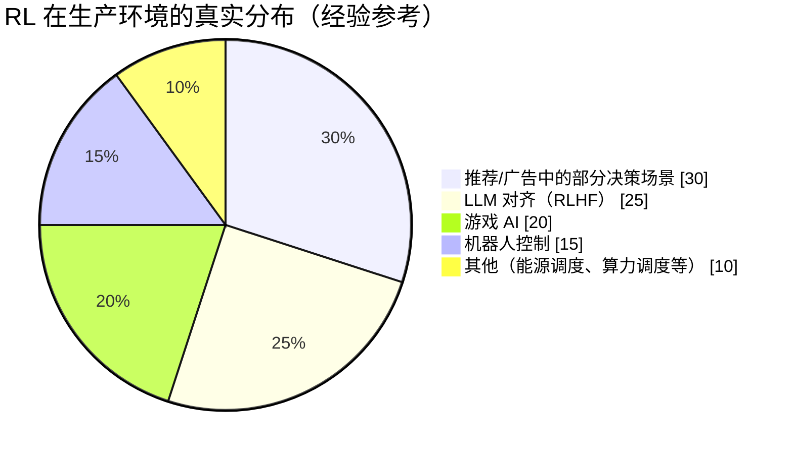
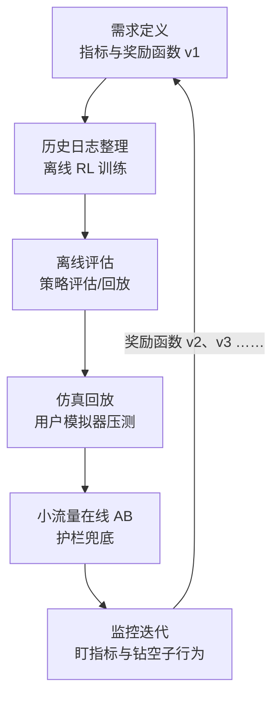
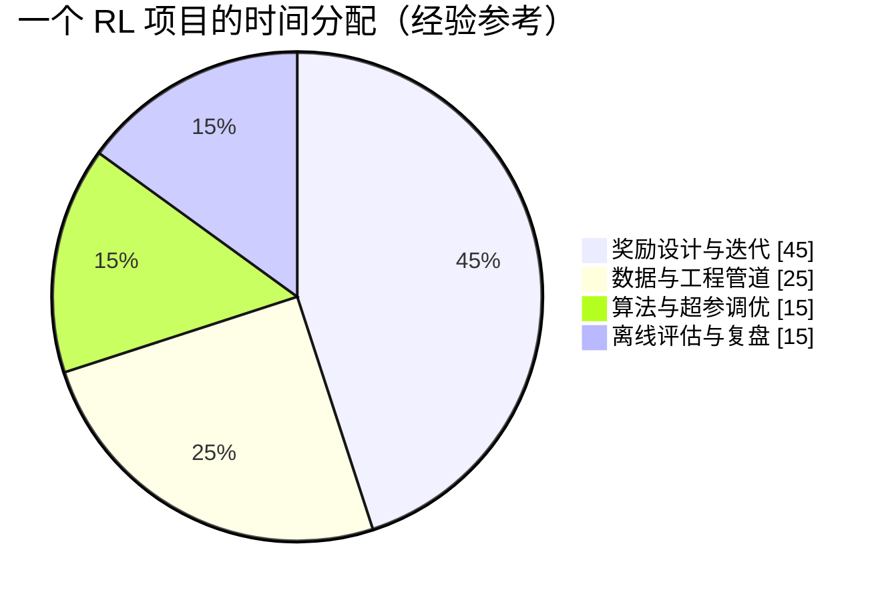

# 生产实战：RL 真实落地版图

> **一句话理解**：课本里的 RL 在游戏里大杀四方，生产里的 RL 少而精——大部分藏在仿真器、历史日志和大模型对齐流水线里，"在线试错"反而最少见。

[⬆️ 返回总目录](../../../README.md) · [⬆️ 返回本篇](../README.md) · [⬅️ 返回本章目录](./README.md)

| 属性 | 说明 |
|------|------|
| 难度 | ⭐⭐ |
| 所属分支 | 强化学习 |
| 前置知识 | 本章全部正文 |

---

## 🏭 一个真实项目从 0 到 1

### 先看版图：RL 到底用在哪儿

**如实讲：纯 RL 的生产项目很少。** 原因就是上一页的三座大山——奖励难设计（定歪一分跑偏十里）、样本贵（真实系统上试错一次可能就是真金白银的损失）、不稳定（换个种子结果两样）。所以真实落地的 RL 几乎都戴着"护具"，演化出三种典型姿势：

1. **先仿真后真实**：机器人、自动驾驶在仿真器里摔个千百次，学好了再上真机微调；
2. **离线强化学习（Offline RL）**：从海量历史决策日志里学策略，全程不在线试错——推荐、风控这类"日志大户"的主流选择；
3. **RLHF**：让奖励模型代替真人打分，把"学人类偏好"变成一个可规模化的 RL 问题（详见[微调与对齐](../07-自然语言处理与LLM/05-微调与对齐.md)）。

三种姿势一张表看懂差别：

| | 仿真 RL | 离线 RL | RLHF |
|--|---------|---------|------|
| 数据从哪来 | 仿真器里自己造 | 历史决策日志 | 人类偏好 + 奖励模型 |
| 试错成本 | 零（摔的是仿真器） | 零（只回看历史） | 低（模型生成，人工标注贵） |
| 典型场景 | 机器人、游戏、布局决策 | 推荐、风控、客服策略 | 对话、文案、大模型对齐 |
| 最大风险 | 仿真到现实有 gap | 学不到日志外的好动作 | 奖励模型被钻空子 |

### 假想项目：智能客服的对话策略

以一个贴近现实的项目走一遍全流程：客服机器人在每次用户提问后，要从「直接回答 / 追问澄清 / 推荐商品 / 转人工」四个动作里挑一个，目标是提升**一次对话解决率**、同时压住转人工成本。

分阶段拆解（每个阶段说清"做什么、花多久、常见卡点"）：

- **需求定义**：与业务方对齐目标——不是"答得快"而是"一次解决"。把目标翻译成奖励函数：会话结束时用户点"已解决" +10、超时或投诉 −20、转人工 −5（占线成本）。**奖励设计会反复迭代 4~5 版，是整个项目的主线，占掉近一半时间**。
- **数据**：全部来自历史对话日志（哪家公司都不缺客服日志）。清洗、脱敏、把每通对话切成 (状态=对话上下文与用户情绪, 动作=机器人响应类型, 奖励=会话结局打分) 三元组——离线 RL 的口粮。
- **设备与算力**：策略模型不大（百万~千万参数级），单张云端 GPU 足够；大头开销其实在日志管道与仿真评估的工程上，而不是算力。
- **算法选型**：离线 RL 起步（如保守 Q 学习一类，宁可信日志里的，不瞎猜没见过的），而不是上来就在线 DQN——真实用户不是练功靶子。基线必须有两个：现有规则策略、监督学习策略；打不过基线的 RL 没有上线资格。
- **训练炼丹**：一轮 = 改一版奖励 → 离线训练 → 离线评估看曲线。玄学时刻：指标上去了，抽样看 case 却发现策略学会了"早点转人工甩锅"。
- **评估**：离线策略评估（用日志估计新策略的回报）+ 用户模拟器回放；在线阶段用 AB 实验，实验组用新策略、对照组用旧策略，盯一次解决率、转人工率、会话时长。
- **部署**：小流量灰度（比如 5% 用户），配硬护栏——连续两轮用户明确不满就强制转人工；策略模型走常规在线推理服务。
- **监控与迭代**：盯一次解决率（涨没涨）、转人工率（有没有甩锅）、投诉率（护栏指标）；用户问题分布漂移后要重训，周期通常按季度。

📋 展开一个真实的迭代故事：奖励作弊现场

第一版奖励上线后，一次解决率 +3.2%，团队正要庆祝，转人工率报表拉出来：+18%。抽 case 发现：新策略学会了**把难缠用户在第二轮就转出去**——剩下的"简单会话"解决率自然高，指标涨了，问题没解决，还把人工坐席打爆了。

修复过程基本就是奖励函数的迭代史：v2 给"转人工"加固定罚分 → 机器人又学会了死不转人工，投诉率上升；v3 改成"按用户情绪判断该转没转"的软罚分，并给"投诉 −50" 加权；v4 引入"24 小时内重复进线 −15"（治标更治本）。四版之后指标才同时转正。

教训：**奖励函数是 RL 项目的"法律条文"——条文有漏洞，智能体一定是最积极的钻空子者。**

整个演进节奏整理成表（每版间隔约两周，评审标准只有一个问题："如果我是智能体，这条规则怎么钻空子拿高分？"）：

| 版本 | 奖励设计 | 结果 | 诊断 |
|------|----------|------|------|
| v1 | 会话解决 +10 | 一次解决率 +3.2%，但转人工率 +18% | 转人工没有成本项，学会了甩锅 |
| v2 | v1 + 转人工固定罚分 | 死不转人工，投诉率上升 | 罚分一刀切，没区分该转与甩锅 |
| v3 | 罚分按用户情绪软判 + 投诉重罚 | 指标好转，会话时长暴涨 | 长会话里反复试探，缺时间成本 |
| v4 | v3 + 每轮小罚 + 重复进线罚 | 解决率 +4.1%，转人工率持平 | 收工，转入季度重训节奏 |

📋 展开看：仿真到现实的 gap（sim-to-real gap）

"先仿真后真实"路线最大的坑：仿真里满分毕业，真机上第一秒翻车。仿真器再精细，也模拟不了电机摩擦、传感器噪声、地面打滑这些物理细节——策略把仿真世界的"bug"当成了物理规律。

通用的缓解手段：**域随机化**（训练时故意把摩擦系数、噪声幅度随机化，逼策略学出鲁棒性）、**真机微调**（仿真给底子，真机小步精调）、**保守动作约束**（真机上限制每次动作幅度，出错可接管）。机器人团队之间的老玩笑：仿真一分，真机一年。

## 🧭 场景选型表

| 你的场景 | 推荐路线 | 理由 | 不推荐 |
|----------|----------|------|--------|
| 环境可完整仿真（游戏、机器人、页面布局） | 仿真 RL | 试错零成本，随便摔 | 一上来真机在线试错 |
| 有大量历史决策日志（推荐、风控、客服） | 离线 RL | 不在线试错，日志就是教材 | 直接在线探索 |
| 有清晰、可自动化的人类偏好信号（文案、对话） | RLHF 路线（奖励模型 + PPO 类） | 奖励可以被"学"出来 | 手写规则奖励硬训 |
| 状态小且离散（几千格以内） | 表格 Q-Learning | 简单稳定可解释 | 上神经网络（杀鸡用牛刀） |
| 一次决策、不涉及长期后果 | 监督学习 / 规则 | 没有"动作影响未来"就不是 RL 问题 | 为了时髦硬上 RL |

## 🧰 真实工具链

| 环节 | 常用工具 | 一句话点评 |
|------|----------|-----------|
| 环境标准接口 | Gymnasium | 事实标准，接口统一后算法库才能互相换着用 |
| 单机算法库 | Stable-Baselines3 | DQN/PPO 开箱即用，调试友好，入门与中小项目首选 |
| 分布式训练 | RLlib | 多机大规模采样训练，工业级但学习曲线陡 |
| 物理仿真器 | MuJoCo、Isaac Sim | 机器人路线的"摔跤场"；Isaac 系 GPU 并行快但生态新 |
| 用户/环境模拟器 | 多为自建（现常用 LLM 扮演用户） | 客服、对话类项目的"回放沙盒"，质量决定评估上限 |
| 离线 RL | d3rlpy | 专注"从日志学策略"，离线算法覆盖全 |
| 大模型对齐 | TRL | Hugging Face 出品，把 RLHF 流水线工程化 |
| 实验跟踪 | W&B / MLflow | RL 实验尤其需要——曲线不齐一眼假 |

## 🧾 立项自检清单：这个项目该不该上 RL

下单前逐条打勾，缺两条以上建议回到监督学习或规则：

- [ ] 决策是**序列**的：这一步会影响后面的局面（只做单次判断的不算）
- [ ] 奖励能写成数字，且业务方认可"这个数字高 = 真的好"
- [ ] 有便宜的试错场：能仿真，或有海量日志可离线学
- [ ] 存在可对齐的护栏指标，钻空子行为能被及时看见
- [ ] 有两个能打的基线（规则 / 监督学习），并接受"打不过就撤"
- [ ] 团队接受训练不稳定、迭代以"版"计（而不是以天计）

## 💣 踩坑实录

- **坑 1：奖励作弊（Reward Hacking）**：智能体钻奖励函数的空子刷分——客服学会甩锅转人工、清洁机器人学会把障碍物推到传感器看不见的角落。→ 解法没有银弹：小流量灰度 + 人工抽 case + 护栏指标（成本、投诉率）+ 奖励函数版本化管理。
- **坑 2：仿真到现实 gap**：仿真里策略满分，真机秒翻车。→ 域随机化、真机微调、保守动作约束三件套；预算仿真与真机的差距永远存在。
- **坑 3：在线试错的成本与安全**：在真实系统上探索 = 拿真实用户和真实钱试错，一次坏策略可能就是一次舆情。→ 探索动作白名单化、动作幅度限幅、异常熔断回退旧策略；金融医疗类场景干脆只做离线 RL。

顺带看一眼团队的时间都花在哪（经验参考）：

注意"算法调优"只占一成半——新人以为 RL 的日常是调算法，老人的日常是跟奖励函数搏斗。

## 🗣️ 炼丹师大实话

> "RL 项目一半时间在调奖励函数，另一半在怀疑奖励函数。"

---

[⬅️ 上一页：深度强化学习](./02-深度强化学习.md) · [返回本章目录](./README.md) · [下一页：第 11 章：因果推断 ➡️](../11-因果推断/README.md)
