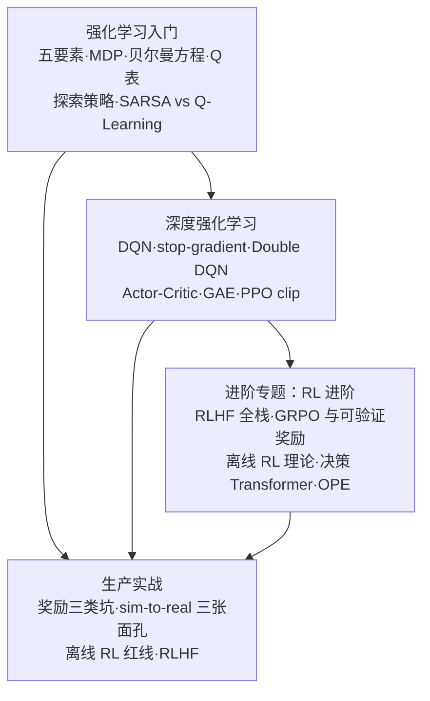

# 第 10 章：强化学习 🎮（决策）

> 前面所有章节都在学"判断"：给一张图、一段文本、一个用户，输出一个预测。本章换一个问题——**决策**：面对一个会因你的行为而变化的世界，每一步该怎么做？它与前两种学习范式的根本区别在反馈方式：监督学习每道题都有标准答案，强化学习只有奖励，而且**动作会改变未来**——这步棋好不好，往往十步之后才见分晓。强化学习是游戏 AI 与机器人当之无愧的主角，也是大模型对齐（[RLHF](../07-自然语言处理与LLM/05-微调与对齐.md)）的地基。

[⬆️ 返回总目录](../../../README.md) · [⬆️ 返回本篇](../README.md)

## 🗺️ 本章知识树

## 📖 推荐阅读顺序

| 顺序 | 页面 | 难度 | 一句话说明 |
|------|------|------|-----------|
| 1 | [强化学习入门](./01-强化学习入门.md) | ⭐⭐⭐ | 五要素循环、折扣因子、贝尔曼方程完整推导（账本读法）、探索三打法；用一张 Q 表手推小世界，再看 Q-Learning 与 SARSA 在同一座悬崖学出两条路 |
| 2 | [深度强化学习](./02-深度强化学习.md) | ⭐⭐⭐⭐ | 状态爆炸后交给神经网络：三个病根与药方（stop-gradient、Double DQN、两稳定器）、Actor-Critic 的偏差-方差权衡、PPO clip 的分段推导 |
| 3 | [进阶专题：RL 进阶](./03-进阶专题-RL进阶.md) | ⭐⭐⭐⭐ | 不许随便试错的世界：RLHF 全栈（Bradley-Terry 奖励模型、KL 系数账本、reward hacking 的博弈本质）、GRPO 详解（组相对优势去 critic、可验证奖励）、离线 RL 理论（分布偏移与悲观主义、CQL/IQL）、决策 Transformer 与序列建模路线的边界、OPE 三层漏斗 |
| 收官 | [生产实战](./99-生产实战.md) | ⭐⭐ | RL 真实落地版图：仿真、离线 RL 与 RLHF 三种真实姿势；奖励三类坑体系化、仿真到现实 gap 三张面孔、离线 RL 数据红线 |

## 🎯 读完本章你应该能

- 说清强化学习与监督学习的本质区别：没有标准答案，只有奖励，且动作会改变未来
- 用状态、动作、奖励、状态转移、折扣因子五要素，把一个决策问题写成马尔可夫决策过程（MDP）
- 手推一轮 Q 表更新与贝尔曼方程（期望的嵌套展开），解释"方程即账本"与 γ 如何权衡"眼前的糖"与"未来的糖"
- 对比三种探索策略（ε-贪婪 / UCB / 熵正则）与两种迭代思路（值迭代 / 策略迭代），并说清 Q-Learning 收敛需要凑齐哪三条
- 讲清 on-policy 与 off-policy 的分野：SARSA 与 Q-Learning 在悬崖上各学出什么路线、为什么
- 说明 DQN 的三个病根（目标值带梯度、max 过估计、样本相关）与对应药方，PPO 的 clip 为什么能防步子太大
- 判断一个业务问题适不适合上 RL；适合的话，走仿真、离线 RL 还是 RLHF 路线，各自的红线在哪

## 🧭 怎么读本章

本章正文三节，概念密度不低：第 1 节是纯直觉 + 一张小小的 Q 表，建议拿纸笔跟着手算（数字都不难，贝尔曼推导放折叠框里可分两次消化）；第 2 节进入神经网络时代，重点不是推公式，而是理解三个病根与三个药方一一对应的关系，clip 推导的分段讨论值得慢读；第 3 节是深水区专题（RLHF/GRPO/离线 RL/决策 Transformer/OPE），关心大模型对齐的读者可直接从它切入，再回头补前两节。代码环节需要 `pip install gymnasium numpy`（[环境搭建](../../1-起步准备/01-环境与工具/01-开发环境搭建.md)见第 1 章），正文代码都附"改什么参数、看什么变化"的实验清单，值得逐条跑。

## 🧩 提前认个脸：本章高频词

| 术语 | 一句话人话 |
|------|-----------|
| 智能体（Agent） | 做决策的那一方：小狗、玩家、模型 |
| 奖励（Reward） | 环境给的即时打分，RL 里唯一的老师 |
| 折扣因子 γ | 未来的糖要打折：γ 越小越近视 |
| 贝尔曼方程 | 账本自洽条件：估值 = 即时奖励 + 打折的下一格最优估值 |
| Q 函数 | "某局面下走某一步"的前景分 |
| 探索 vs 利用（Exploration/Exploitation） | 试新店还是去老店的终身平衡题 |
| on-policy / off-policy | 记"自己实账"（SARSA）还是记"理想账"（Q-Learning） |
| 目标网络（Target Network） | 冻结一份网络当稳定靶子，别追自己的尾巴 |
| 优势（Advantage） | 这步比该局面平均水平好多少 |
| 策略（Policy） | 从状态到动作的决策规则，RL 的最终产物 |
| RLHF | 用人类偏好当奖励来训练大模型 |

## ❓ 学前三问

- **"我不做游戏和机器人，学这章干嘛？"**——大模型对齐（RLHF）与推荐/广告里的实时决策都在用 RL；想看懂对齐技术的讨论，绕不开本章的 PPO。
- **"RL 是不是特别数学？"**——入门只需要期望的概念和一点耐心；本章每个公式都配了"人话"翻译，例子全程手算可验，完整推导都放折叠框按需展开。
- **"能跳过这章吗？"**——可以，专业方向各章彼此独立；但如果你的路线包含第 7 章的微调与对齐，建议至少读完本章第 2 节。

## 🔗 与其他章节的关系

- **前置章节**：[概率与统计](../../1-起步准备/02-数学基础/04-概率与统计.md)——期望与条件概率是理解回报、价值函数的底子；[神经网络是怎么炼成的](../../3-深度学习/04-深度学习基础/01-神经网络是怎么炼成的.md)——第 2 节的深度强化学习直接建立在其上。
- **后续章节**：[第 11 章：因果推断](../11-因果推断/README.md)——同为"非预测"问题：强化学习关心"该怎么做"，因果推断关心"做了到底有没有用"。
- **横向呼应**：[微调与对齐](../07-自然语言处理与LLM/05-微调与对齐.md)——RLHF 就是把本章的 PPO 用在"让大模型符合人类偏好"上；推荐系统中的部分实时决策场景也是强化学习的落点。

---

[⬅️ 上一章：第 9 章：图神经网络](../09-图神经网络/README.md) · [返回总目录](../../../README.md) · [下一章：第 11 章：因果推断 ➡️](../11-因果推断/README.md)
