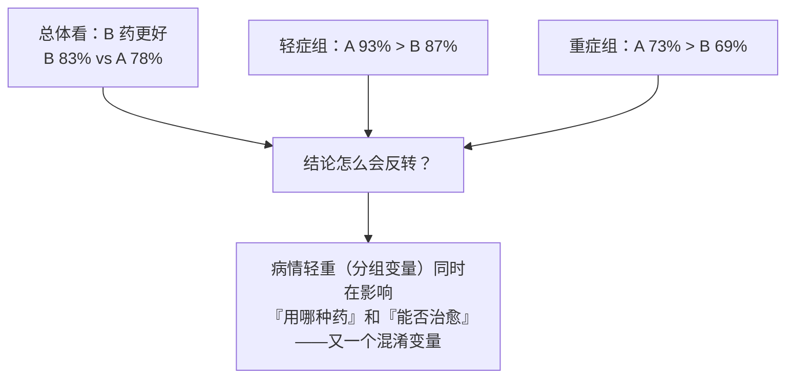
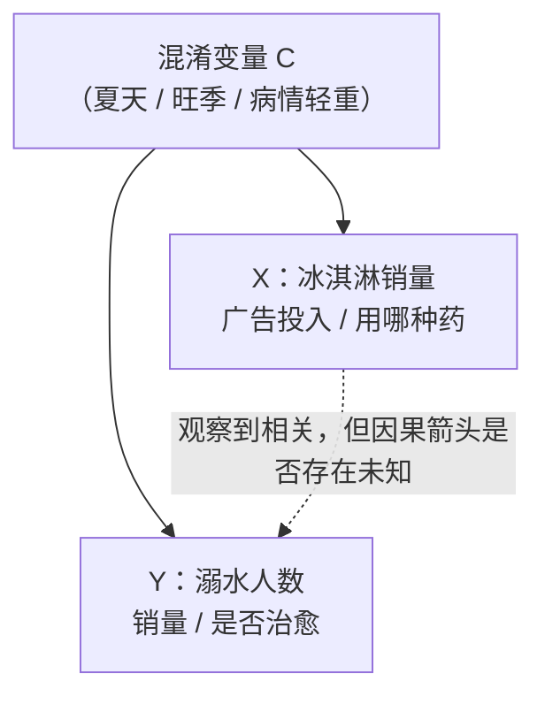
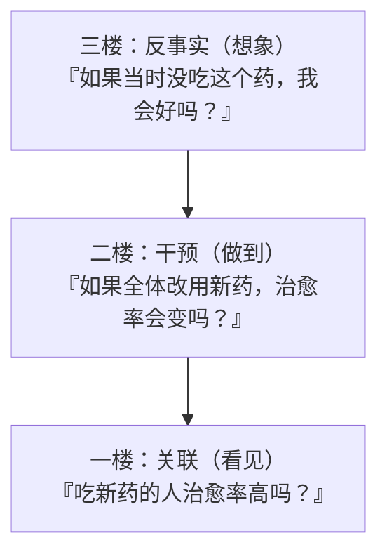

# 相关不等于因果

> **一句话理解**：两件事总是一起出现（相关），不等于一件导致另一件（因果）——因为很可能存在躲在幕后、同时推动两者的"第三者"：混淆变量（Confounder）。因果推断的第一课，就是学会识破这种骗局。

[⬆️ 返回总目录](../../../README.md) · [⬆️ 返回本篇](../README.md) · [⬅️ 返回本章目录](./README.md)

| 属性 | 说明 |
|------|------|
| 难度 | ⭐⭐⭐（较难） |
| 所属分支 | 因果 |
| 前置知识 | [概率与统计](../../1-起步准备/02-数学基础/04-概率与统计.md)（期望、方差、条件概率） |

---

## 📌 这一节解决什么问题

机器学习模型吃的是相关性：训练目标只要求"看见 X 就预测对 Y"，至于 X 是不是导致 Y 的原因，模型既不知道也不在乎。多数时候这没关系——我要识别猫的照片，用不用胡须这个特征无所谓，准就行。

但一旦要做**决策**，相关性就会露馅：你发现投广告多的城市销量高，于是把预算翻了三倍——结果销量纹丝不动。为什么？因为模型捕捉到的相关，可能根本不是"广告→销量"，而是"旺季→既投得多又卖得多"。**用它做预测没问题（旺季确实销量高），用它做干预就会翻车（加大投放买不来旺季）。**

本节解决两个问题：一是理解相关为什么如此爱撒谎——混淆变量、选择效应、辛普森悖论（Simpson's Paradox）这些经典骗局；二是搭好因果推断的世界观——因果之梯三级与 do 算子，下一节的所有方法都建立在这套语言上。

## 🌱 通俗理解

**冰淇淋与溺水**。统计数据显示：冰淇淋销量越高的月份，溺水人数越多。要不要禁售冰淇淋？先别急——夏天一到，吃冰淇淋的人多了，下水游泳的人也多了。**真正推高溺水人数的是"夏天气温高"这个幕后推手**，它同时推高了冰淇淋销量，于是两者看起来手拉手一起涨。这个幕后推手就是混淆变量：它既是 X 的原因、又是 Y 的原因，让 X 和 Y 之间出现一条"假的相关通道"。

**相关到底从哪来？** 把任意一对相关拆开看，只有三种来源：

1. **真因果**：X 真的导致 Y（抽烟→肺癌）；
2. **混淆**：第三者同时导致 X 和 Y（夏天→冰淇淋销量 & 溺水）；
3. **选择**：我们观察数据的方式让两者凑到一起（医院里"感冒"和"头疼"总是同时出现，不是感冒导致头疼，而是"来看病"这个筛选把两者聚到了一起）。

只有第一种是你干预 X 时能兑现的——**而观察数据本身分不清这三种**，这正是麻烦所在。

**三层楼的因果世界观**（下一节详细展开）：一楼"看见"——从数据里看到一起变化（关联，动物都能做到）；二楼"做到"——主动改变 X 看 Y 会不会变（干预，需要做实验或因果方法）；三楼"想象"——复盘"如果当时没做，结果会不会不同"（反事实，人类独有的能力）。机器学习目前主要住在一楼，因果推断的目标是往上搬。

## 📋 举个例子

### 例一：广告投入与销量——一条会骗人的高相关

某快消品牌统计了 8 个城市的"月度广告投入 vs 月销量"：

| 城市 | 季节 | 广告 x（万元） | 销量 y（万件） |
|------|------|---------------|---------------|
| 甲 | 淡季 | 20 | 106 |
| 乙 | 淡季 | 24 | 100 |
| 丙 | 淡季 | 28 | 107 |
| 丁 | 淡季 | 32 | 103 |
| 戊 | 旺季 | 76 | 161 |
| 己 | 旺季 | 80 | 165 |
| 庚 | 旺季 | 84 | 158 |
| 辛 | 旺季 | 88 | 164 |

先不管季节，把 8 个城市混在一起算**皮尔逊相关系数（Correlation Coefficient）**。均值 x̄ = 54、ȳ = 133，列偏差表：

| 城市 | x−x̄ | y−ȳ | (x−x̄)(y−ȳ) | (x−x̄)² | (y−ȳ)² |
|------|------|------|--------------|---------|---------|
| 甲 | −34 | −27 | 918 | 1156 | 729 |
| 乙 | −30 | −33 | 990 | 900 | 1089 |
| 丙 | −26 | −26 | 676 | 676 | 676 |
| 丁 | −22 | −30 | 660 | 484 | 900 |
| 戊 | 22 | 28 | 616 | 484 | 784 |
| 己 | 26 | 32 | 832 | 676 | 1024 |
| 庚 | 30 | 25 | 750 | 900 | 625 |
| 辛 | 34 | 31 | 1054 | 1156 | 961 |
| 合计 | 0 | 0 | **6496** | **6432** | **6788** |

代入公式：

$$
r = \frac{6496}{\sqrt{6432} \times \sqrt{6788}} \approx \frac{6496}{6608} \approx 0.98
$$

> 👉 **人话**：分子上交叉积几乎全是正的（一个偏高另一个也偏高），归一化后得到 0.98——广告多的城市销量确实高，这没算错；错的是接下来"多投广告就能多卖"的那步推理。

**r ≈ 0.98，几乎是完美正相关**。市场部拿着这张表要预算：多投 10 万广告，销量跟着涨！

现在把季节摆进来——**淡季的 4 座城和旺季的 4 座城分开看**（分组计算过程见下方折叠框）：淡季组内 r ≈ −0.08，旺季组内 r ≈ 0.08，**都约等于零**。广告投入在组内从 20 涨到 32、从 76 涨到 88，销量却基本原地踏步。真相浮出水面：**是"旺季"同时推高了广告预算和销量**，把两团本不相关的点云抬成了同一条斜线。控制了季节这个混淆变量，"广告神效"瞬间蒸发。

<details>
<summary>📊 展开完整算例：组内相关与散点直觉</summary>

**淡季组**（甲乙丙丁）：x̄=26，ȳ=104。偏差 x：(−6, −2, 2, 6)；偏差 y：(2, −4, 3, −1)。

- 交叉积：(−12) + 8 + 6 + (−6) = −4；Σ(x−x̄)²=80；Σ(y−ȳ)²=30
- r = −4 ÷ √(80×30) = −4 ÷ 49 ≈ **−0.08**

**旺季组**（戊己庚辛）：x̄=82，ȳ=162。偏差 x：(−6, −2, 2, 6)；偏差 y：(−1, 3, −4, 2)。

- 交叉积：6 − 6 − 8 + 12 = 4；Σ(y−ȳ)²=30
- r = 4 ÷ √(80×30) ≈ **+0.08**

**散点直觉**：把 8 个点画在坐标纸上，会看到两团清晰的点云——淡季团缩在左下角（钱少、量少），旺季团漂在右上角（钱多、量大）。穿过两团点云画一条线，斜率陡得吓人（这就是 r=0.98 的来源）；但只看淡季团内部、只看旺季团内部，各自几乎是平的——**组内没钱时没量、有钱时也没量**。那条陡线的全部"功劳"属于季节：是季节决定你落在哪一团，而不是广告把点推上去的。记住这个画面：**一条混淆变量造出的"云间走廊"，是高相关的最常见来源。**

</details>

### 例二：辛普森悖论——分组与总体结论反转

某医院比较 A、B 两种药的治愈率（人数为"治愈/接受治疗"）：

| 分组 | A 药 | B 药 | 谁更好 |
|------|------|------|--------|
| 轻症患者 | 81/87 = **93%** | 234/270 = 87% | A |
| 重症患者 | 192/263 = **73%** | 55/80 = 69% | A |
| 合计 | 273/350 = 78% | 289/350 = **83%** | **B？！** |

**每一组里都是 A 药更好，加总后 B 药反而领先 5 个百分点**——这就是辛普森悖论。骗局的手法在于分配不均：B 药 350 人里 270 人是轻症（77%），A 药 350 人里只有 87 人是轻症（25%）。B 药"赢"在接诊了大量容易治好的轻症患者，而不是药本身。



如果你是病人，该信哪一版结论？**分组版**——你永远是"某个具体病情"的病人，而不是"合计"里的一个平均数。

## 🧠 核心原理

### 整体流程

把本节的两个骗局抽象成一张图——混淆变量的标准作案手法：



虚线是我们**观察到**的相关；实线是**真实存在**的因果箭头。混淆变量 C 同时射向 X 和 Y，让 X、Y 之间凭空出现相关——这条"后门通道"不堵住，任何分析都是给它做嫁衣。

### 逐步拆解

**1. 相关系数在算什么**。上面手算的 r，公式是：

$$
r = \frac{\sum_i (x_i - \bar{x})(y_i - \bar{y})}{\sqrt{\sum_i (x_i - \bar{x})^2} \cdot \sqrt{\sum_i (y_i - \bar{y})^2}}
$$

> 👉 **人话**：分子问"x 偏大时 y 是不是也偏大"（同向相乘得正、反向得负），分母把两边的波动幅度归一化。r 只是把"一起偏离均值"这件事折算成 −1 到 1 的分数——它天生**分不清**这份"一起偏离"是因果、混淆还是选择造成的。

**2. 因果之梯（Ladder of Causation）**。图灵奖得主 Judea Pearl 把因果问题分成三级，一层比一层难：



- **一级 关联（Association）**：看见——P(Y|X)，观察到 X 后 Y 的概率。所有监督学习都住在这层；
- **二级 干预（Intervention）**：做到——P(Y|do(X))，**主动设定** X 后 Y 的概率。这层才是决策需要的答案；
- **三级 反事实（Counterfactual）**：想象——"如果当初选了另一条路，现在会怎样"。归因、责任认定都在这层。

**3. do 算子（do-operator）一句话**。两级阶梯的分界线可以写成一行：

$$
P(Y \mid X) \neq P(Y \mid \mathrm{do}(X))
$$

> 👉 **人话**："观察到 X"（看到投了广告的城市销量高）和"强行设定 X"（让所有城市投广告）是两码事——前者有混淆变量跟着掺和，后者把混淆变量的影响切断了。这两者的差距，就是"相关"与"因果"的差距，也是下一节所有方法努力的方向：**用实验或统计手段，把 P(Y|do(X)) 从观察数据里估出来。**

<details>
<summary>🧮 展开看：为什么"控制变量"有时反而更糟（对撞变量）</summary>

直觉上控制得越多越好，其实不然。变量分三种角色：

- **混淆变量**（夏天）：同时影响 X 和 Y，必须控制，不控制就是本节的骗局；
- **中介变量**（广告→点击→购买）：它是 X 影响Y 的必经之路，控制它等于把你要测的效应亲手掐断；
- **对撞变量**（X 和 Y 共同的结果）：它本身不该控制——一旦按它分层，反而会在 X 和 Y 之间制造出原本不存在的相关。

经典例子：好莱坞发现"演技"与"颜值"在明星群体里负相关——其实是"演技和颜值至少占一样才能成为明星"，"是否明星"这个对撞变量把样本筛弯了；普通人里两者并没什么关系。所以画因果图（哪怕很粗糙）先分清变量角色，比闷头"多加控制变量"重要得多。

</details>

## 💻 动手试试

用 numpy 亲手制造一个带混淆变量的数据集，然后看"控制混淆前后"相关性的变化——8 城市例子的放大版：

```python
# 亲手制造一个"混淆变量导致的假相关"
# 先安装：pip install numpy
import numpy as np

rng = np.random.default_rng(42)
n = 200
season = rng.integers(0, 2, n)                 # 混淆变量：0 淡季 / 1 旺季
ad = 30 + 60 * season + rng.normal(0, 8, n)    # 旺季整体多投 60 万
sales = 100 + 60 * season + rng.normal(0, 5, n)  # 旺季本身多卖 60 万件；广告对销量几乎无影响

def r(x, y):                                   # 皮尔逊相关系数
    return np.corrcoef(x, y)[0, 1]

print(f"不分季节整体相关 r = {r(ad, sales):.2f}")
print(f"只看淡季组内 r = {r(ad[season == 0], sales[season == 0]):.2f}")
print(f"只看旺季组内 r = {r(ad[season == 1], sales[season == 1]):.2f}")
```

预期输出（随机种子固定时数值可复现；换种子小幅波动，量级不变）：

```text
不分季节整体相关 r = 0.95     # 混淆变量把广告和销量"抬"到高度相关
只看淡季组内 r = 0.09         # 控制季节后，相关几乎消失
只看旺季组内 r = -0.10        # 数据的生成过程里广告的真实作用本来就是 0
```

同一个数据集、同一批数字，只是换了看数据的切片方式，结论从"高度相关"变成"毫无关系"——这行代码值得亲手跑一次。

## 🔥 炼丹小灶

> 🔥 **炼丹小灶**：业务分析里防"假相关"的起点配方——
> - 配方：拿到任何"X 与 Y 相关"的结论，先按常识列一遍候选混淆变量（时间、季节、人群结构、渠道、病情/活跃度分层），分层重算一遍再下结论；表格分析用分组均值，连续变量用分位数分箱。
> - 玄学：结论越是"惊人"（r > 0.9 或意外翻盘），越要先找混淆变量；两个都随时间增长的量（公司营收与全球气温）几乎必然高相关。
> - ⚠️ 以上是经验参考值，不是圣旨；分层后样本骤减时要小心辛普森悖论反向作案。

## 🖱️ 动手玩

> 🕹️ **延伸玩一玩**：[Seeing Theory](https://seeing-theory.brown.edu)——概率统计可视化教程，其中回归与相关章节可以拖动数据点，实时看相关系数怎么变，建立 r 的手感。

## 🔗 在知识树中的位置

- **上游**：[概率与统计](../../1-起步准备/02-数学基础/04-概率与统计.md)——条件概率 P(Y|X) 正是"一楼"的通用语言。
- **下游**：[因果推断方法工具箱](./02-因果推断方法工具箱.md)——本节诊断病情（找到混淆变量），下一节开药方（RCT、PSM、DID）；[生产实战](./99-生产实战.md)——A/B 实验就是"用随机化堵后门"的最大规模工业实践。
- **横向呼应**：[推荐系统的生产实战](../08-推荐系统/99-生产实战.md)——推荐场景里"点了推荐位的人转化率高"是本节骗局的日常版本（活跃用户既爱点也爱买），A/B 实验正是解药；与[机器学习全景](../../2-经典机器学习/03-机器学习/01-机器学习全景.md)对照：监督学习住在一楼，因果要上二楼。

## ⚠️ 常见误区

- **误区一**："相关系数高达 0.98，基本可以当因果用了" → r 再高也只是"一起动"的度量，混淆、选择都能造出接近 1 的 r；因果判断需要设计（实验）或假设（因果图），不是数据的自然产物。
- **误区二**："样本够大，相关就会变成因果" → 加大样本只让 r 估得更准（方差变小），不会把偏差变小——100 万条数据里的假相关，仍然是假的，只是更有底气地假。
- **误区三**："把能控制的变量都控制住就安全了" → 控制混淆变量是必要的，但控制中介变量会掐断真实效应、按对撞变量分层会凭空造出相关——先分清变量角色再动手（见上方折叠框）。

## 📝 小结与自测

**要点回顾**

- 相关只有三种来源：真因果、混淆、选择；观察数据本身无法区分它们
- 混淆变量同时影响 X 与 Y，造出"假相关通道"（夏天→冰淇淋销量 & 溺水；旺季→广告 & 销量）
- 辛普森悖论：分组结论可以与总体结论完全反转，病人该信分组版
- 因果之梯三级：关联（看见）→ 干预（做到）→ 反事实（想象）；P(Y|X) ≠ P(Y|do(X)) 是全章的作战地图

**自测一下**（点击展开答案）

<details>
<summary>问题 1：把本节 8 城市数据按"是否南方城市"重新分组，组内相关突然变高了，能说明"广告在南方有效"吗？</summary>

不能急着下结论。分组变量本身可能又引入新的问题：若"是否南方"与季节相关（南方淡季短），它可能没真正切干净混淆；也可能样本切小后方差变大、r 波动剧烈。正确姿势是先画因果图理清变量关系，再决定控制谁——而不是把所有分组方式都试一遍挑好看的结果（那是多重比较，制造显著性的作弊器）。

</details>

<details>
<summary>问题 2：P(Y|do(X)) 和 P(Y|X) 分别对应因果之梯的哪一层？做 A/B 实验测的是哪一个？</summary>

P(Y|X) 是第一层"关联"——只是观察到；P(Y|do(X)) 是第二层"干预"——强行设定 X 再看 Y。A/B 实验通过随机分组直接实现了 do(X)（随机发券切断了"什么样的人会领券"的后门），测的正是 P(Y|do(X))，所以它是估计因果效应的金标准。

</details>

## 📚 延伸阅读

- 书：Judea Pearl《The Book of Why（为什么）》——因果之梯与 do 算子的科普原典
- 书：《统计陷阱》（Darrell Huff《How to Lie with Statistics》）——各种相关骗案的小品文集
- 课程：哈佛 CS109 / 各类"统计推断入门"公开课中关于混杂与分层的章节

---

[⬅️ 上一页：本章导览](./README.md) · [返回本章目录](./README.md) · [下一页：因果推断方法工具箱 ➡️](./02-因果推断方法工具箱.md)
