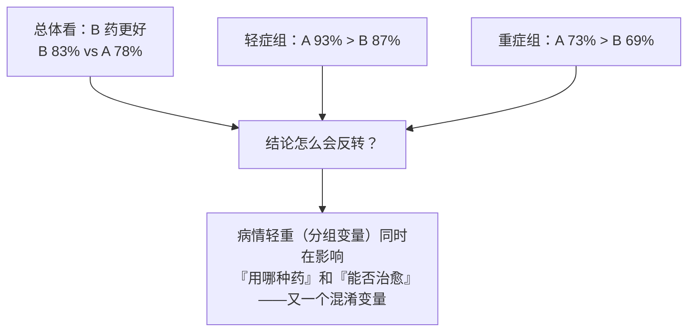
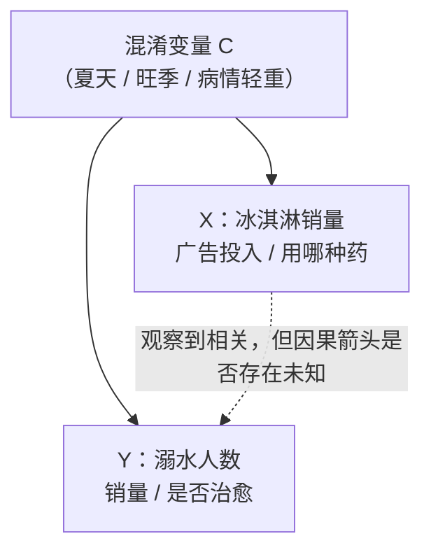
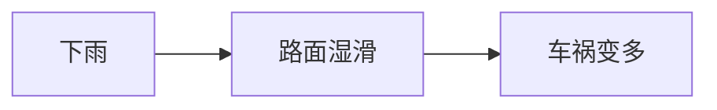
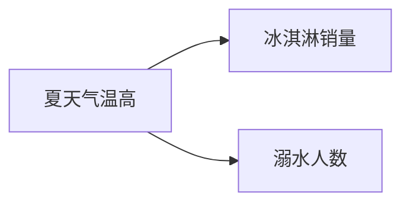
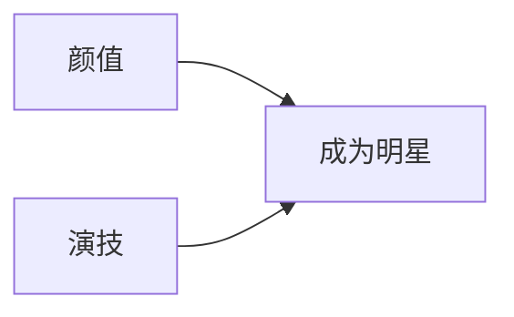
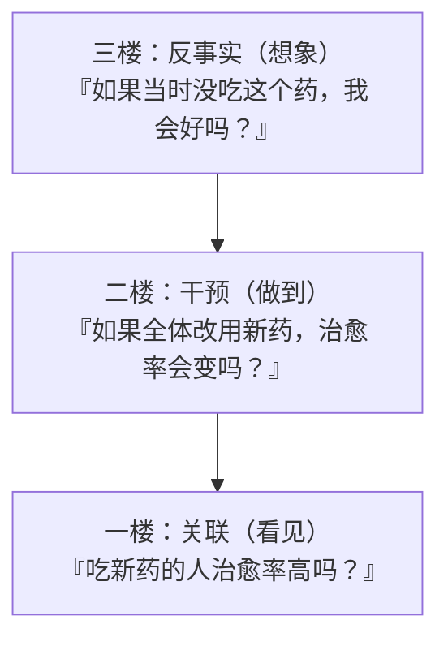
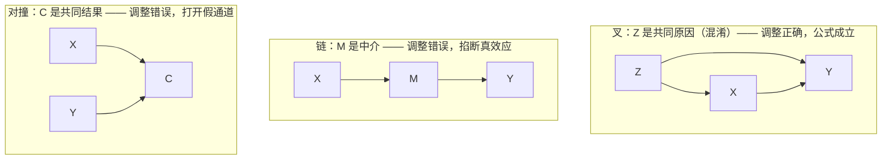

# 相关不等于因果

> **一句话理解**：两件事总是一起出现（相关），不等于一件导致另一件（因果）——因为很可能存在躲在幕后、同时推动两者的"第三者"：混淆变量（Confounder）。因果推断的第一课，就是学会识破这种骗局。

[⬆️ 返回总目录](../../../README.md) · [⬆️ 返回本篇](../README.md) · [⬅️ 返回本章目录](./README.md)

| 属性 | 说明 |
|------|------|
| 难度 | ⭐⭐⭐（较难） |
| 所属分支 | 因果 |
| 前置知识 | [概率与统计](../../1-起步准备/02-数学基础/04-概率与统计.md)（期望、方差、条件概率） |

---

## 📌 这一节解决什么问题

机器学习模型吃的是相关性：训练目标只要求"看见 X 就预测对 Y"，至于 X 是不是导致 Y 的原因，模型既不知道也不在乎。多数时候这没关系——我要识别猫的照片，用不用胡须这个特征无所谓，准就行。

但一旦要做**决策**，相关性就会露馅：你发现投广告多的城市销量高，于是把预算翻了三倍——结果销量纹丝不动。为什么？因为模型捕捉到的相关，可能根本不是"广告→销量"，而是"旺季→既投得多又卖得多"。**用它做预测没问题（旺季确实销量高），用它做干预就会翻车（加大投放买不来旺季）。**

本节解决三个问题：一是理解相关为什么如此爱撒谎——混淆变量、选择效应、辛普森悖论（Simpson's Paradox）这些经典骗局；二是拿到因果图的钥匙——**链、叉、对撞**三个基本结构，它们决定了"控制一个变量"是救命还是闯祸；三是搭好因果推断的世界观——因果之梯三级、do 算子、后门准则与两大理论框架，下一节的所有方法都建立在这套语言上。

## 🌱 通俗理解

**冰淇淋与溺水**。统计数据显示：冰淇淋销量越高的月份，溺水人数越多。要不要禁售冰淇淋？先别急——夏天一到，吃冰淇淋的人多了，下水游泳的人也多了。**真正推高溺水人数的是"夏天气温高"这个幕后推手**，它同时推高了冰淇淋销量，于是两者看起来手拉手一起涨。这个幕后推手就是混淆变量：它既是 X 的原因、又是 Y 的原因，让 X 和 Y 之间出现一条"假的相关通道"。

**相关到底从哪来？** 把任意一对相关拆开看，只有三种来源：

1. **真因果**：X 真的导致 Y（抽烟→肺癌）；
2. **混淆**：第三者同时导致 X 和 Y（夏天→冰淇淋销量 & 溺水）；
3. **选择**：我们观察数据的方式让两者凑到一起（医院里"感冒"和"头疼"总是同时出现，不是感冒导致头疼，而是"来看病"这个筛选把两者聚到了一起）。

只有第一种是你干预 X 时能兑现的——**而观察数据本身分不清这三种**，这正是麻烦所在。

**三层楼的因果世界观**（下文详细展开）：一楼"看见"——从数据里看到一起变化（关联，动物都能做到）；二楼"做到"——主动改变 X 看 Y 会不会变（干预，需要做实验或因果方法）；三楼"想象"——复盘"如果当时没做，结果会不会不同"（反事实，人类独有的能力）。机器学习目前主要住在一楼，因果推断的目标是往上搬。

**因果图 = 地铁线路图**。把变量画成节点、因果箭头画成边，一眼就能看出"相关"走的哪条线：是真因果的直达线，还是绕道第三者的换乘线。而所有线路只由三种基本零件拼成——链、叉、对撞（核心原理第 2 条），这是全章的钥匙。

## 📋 举个例子

### 例一：广告投入与销量——一条会骗人的高相关

某快消品牌统计了 8 个城市的"月度广告投入 vs 月销量"：

| 城市 | 季节 | 广告 x（万元） | 销量 y（万件） |
|------|------|---------------|---------------|
| 甲 | 淡季 | 20 | 106 |
| 乙 | 淡季 | 24 | 100 |
| 丙 | 淡季 | 28 | 107 |
| 丁 | 淡季 | 32 | 103 |
| 戊 | 旺季 | 76 | 161 |
| 己 | 旺季 | 80 | 165 |
| 庚 | 旺季 | 84 | 158 |
| 辛 | 旺季 | 88 | 164 |

先不管季节，把 8 个城市混在一起算**皮尔逊相关系数（Correlation Coefficient）**。均值 x̄ = 54、ȳ = 133，列偏差表：

| 城市 | x−x̄ | y−ȳ | (x−x̄)(y−ȳ) | (x−x̄)² | (y−ȳ)² |
|------|------|------|--------------|---------|---------|
| 甲 | −34 | −27 | 918 | 1156 | 729 |
| 乙 | −30 | −33 | 990 | 900 | 1089 |
| 丙 | −26 | −26 | 676 | 676 | 676 |
| 丁 | −22 | −30 | 660 | 484 | 900 |
| 戊 | 22 | 28 | 616 | 484 | 784 |
| 己 | 26 | 32 | 832 | 676 | 1024 |
| 庚 | 30 | 25 | 750 | 900 | 625 |
| 辛 | 34 | 31 | 1054 | 1156 | 961 |
| 合计 | 0 | 0 | **6496** | **6432** | **6788** |

代入公式：

$$
r = \frac{6496}{\sqrt{6432} \times \sqrt{6788}} \approx \frac{6496}{6608} \approx 0.98
$$

> 👉 **人话**：分子上交叉积几乎全是正的（一个偏高另一个也偏高），归一化后得到 0.98——广告多的城市销量确实高，这没算错；错的是接下来"多投广告就能多卖"的那步推理。

**r ≈ 0.98，几乎是完美正相关**。市场部拿着这张表要预算：多投 10 万广告，销量跟着涨！

现在把季节摆进来——**淡季的 4 座城和旺季的 4 座城分开看**（分组计算过程见下方折叠框）：淡季组内 r ≈ −0.08，旺季组内 r ≈ 0.08，**都约等于零**。广告投入在组内从 20 涨到 32、从 76 涨到 88，销量却基本原地踏步。真相浮出水面：**是"旺季"同时推高了广告预算和销量**，把两团本不相关的点云抬成了同一条斜线。控制了季节这个混淆变量，"广告神效"瞬间蒸发。

<details>
<summary>📊 展开完整算例：组内相关与散点直觉</summary>

**淡季组**（甲乙丙丁）：x̄=26，ȳ=104。偏差 x：(−6, −2, 2, 6)；偏差 y：(2, −4, 3, −1)。

- 交叉积：(−12) + 8 + 6 + (−6) = −4；Σ(x−x̄)²=80；Σ(y−ȳ)²=30
- r = −4 ÷ √(80×30) = −4 ÷ 49 ≈ **−0.08**

**旺季组**（戊己庚辛）：x̄=82，ȳ=162。偏差 x：(−6, −2, 2, 6)；偏差 y：(−1, 3, −4, 2)。

- 交叉积：6 − 6 − 8 + 12 = 4；Σ(y−ȳ)²=30
- r = 4 ÷ √(80×30) ≈ **+0.08**

**散点直觉**：把 8 个点画在坐标纸上，会看到两团清晰的点云——淡季团缩在左下角（钱少、量少），旺季团漂在右上角（钱多、量大）。穿过两团点云画一条线，斜率陡得吓人（这就是 r=0.98 的来源）；但只看淡季团内部、只看旺季团内部，各自几乎是平的——**组内没钱时没量、有钱时也没量**。那条陡线的全部"功劳"属于季节：是季节决定你落在哪一团，而不是广告把点推上去的。记住这个画面：**一条混淆变量造出的"云间走廊"，是高相关的最常见来源。**

</details>

### 例二：辛普森悖论——分组与总体结论反转

某医院比较 A、B 两种药的治愈率（人数为"治愈/接受治疗"）：

| 分组 | A 药 | B 药 | 谁更好 |
|------|------|------|--------|
| 轻症患者 | 81/87 = **93%** | 234/270 = 87% | A |
| 重症患者 | 192/263 = **73%** | 55/80 = 69% | A |
| 合计 | 273/350 = 78% | 289/350 = **83%** | **B？！** |

**每一组里都是 A 药更好，加总后 B 药反而领先 5 个百分点**——这就是辛普森悖论。骗局的手法在于分配不均：B 药 350 人里 270 人是轻症（77%），A 药 350 人里只有 87 人是轻症（25%）。B 药"赢"在接诊了大量容易治好的轻症患者，而不是药本身。



如果你是病人，该信哪一版结论？**分组版**——你永远是"某个具体病情"的病人，而不是"合计"里的一个平均数。

## 🧠 核心原理

### 整体流程

把本节的两个骗局抽象成一张图——混淆变量的标准作案手法：



虚线是我们**观察到**的相关；实线是**真实存在**的因果箭头。混淆变量 C 同时射向 X 和 Y，让 X、Y 之间凭空出现相关——这条"后门通道"不堵住，任何分析都是给它做嫁衣。

### 逐步拆解

**1. 相关系数在算什么**。上面手算的 r，公式是：

$$
r = \frac{\sum_i (x_i - \bar{x})(y_i - \bar{y})}{\sqrt{\sum_i (x_i - \bar{x})^2} \cdot \sqrt{\sum_i (y_i - \bar{y})^2}}
$$

> 👉 **人话**：分子问"x 偏大时 y 是不是也偏大"（同向相乘得正、反向得负），分母把两边的波动幅度归一化。r 只是把"一起偏离均值"这件事折算成 −1 到 1 的分数——它天生**分不清**这份"一起偏离"是因果、混淆还是选择造成的。

**2. 因果图的三个基本结构：链、叉、对撞**。世界上任何两个变量之间的关联通道，都由且仅由三种结构拼成。**控制其中一个变量，三种结构的反应完全不同**——这是"控制变量"这门手艺的全部说明书：

**结构一：链（Chain）——A 通过 B 影响 C**



B 是**中介变量（Mediator）**：A 的效应经过它传导到 C。不控制 B 时 A、C 相关（这是真因果的传导）；**控制 B 会把传导通道掐断**——下雨与车祸的相关在"只看干燥路面"的子样本里消失大半。注意：这是**真效应**，掐断它常是在亲手销毁你要测的东西（想测"广告的总效应"就别控制"点击量"这个中介）。

**结构二：叉（Fork）——共同的因造出假相关**



B、C 本无因果，只因共享原因 A 而手拉手——**混淆变量**就是叉中间那个节点。不控制 A 时 B、C 假相关；**控制 A（按季节分组）后假通道关闭**，本节的广告案例做的正是这件事。叉口是三种结构里唯一"必须控制"的。

**结构三：对撞（Collider）——共同的果**



B、C 都指向共同结果 A。**不控制 A 时 B、C 天然独立**（两个互不相干的原因，各自撞向同一个果而已）；**一旦控制 A（只看"是明星"的子样本，或按"是否住院"筛选数据），反而凭空打开一条 B、C 之间的假相关通道**——对撞偏倚（Collider Bias，经典形态也叫伯克森悖论 Berkson's Paradox）。

三种结构一张表对照（"控制 B"指按 B 分组/调整）：

| 结构 | 长相 | 生活例子 | 不控制 B 时 A、C 的关系 | 控制 B 后会怎样 | 实战守则 |
|------|------|----------|--------------------------|----------------|----------|
| 链 A→B→C | 中介 | 下雨→路湿→车祸 | 相关（真效应的传导） | 通道被掐断，关联消失 | 测总效应**别控**中介 |
| 叉 A←B→C | 混淆 | 夏天→冰淇淋/溺水 | 相关（B 造的假象） | 假通道关闭，恢复干净 | 混淆**必须控** |
| 对撞 A→B←C | 共同结果 | 颜值/演技→明星 | 天然独立 | **凭空造出**假相关 | 永远**别控**，尤其别拿它筛样本 |

<details>
<summary>📊 展开数字算例：对撞偏倚如何凭空造出"演员颜值与演技负相关"</summary>

**前提**：普通人里"颜值高/低"与"演技高/低"各自一半，且**互相独立**。100 个普通人四格均分：

| | 演技高 | 演技低 | 合计 |
|--|--------|--------|------|
| 颜值高 | 25 | 25 | 50 |
| 颜值低 | 25 | 25 | 50 |

**筛选规则**：能当上明星 ≈ 颜值高或演技高**至少占一项**（双低出局）——"是否成为明星"就是那个对撞变量。筛选后明星样本 75 人：

| 明星样本 | 演技高 | 演技低 | 合计 |
|--|--------|--------|------|
| 颜值高 | 25 | 25 | 50 |
| 颜值低 | 25 | **0** | 25 |

**在明星内部看**：演技高的人里颜值高占 25/50 = **50%**；演技低的人里颜值高占 25/25 = **100%**——演技越差，颜值高的比例反而越大，**负相关凭空出现**。而这一切只因为"双低"那 25 人被明星这个筛子开除了。娱乐圈"演技与颜值不可兼得"的段子，是选择偏差造的账，不是行业规律。

同类骗局速认：医院里"感冒"与"头疼"总是同现（对撞 = 来看病）；"有钱"与"顾家"在成功企业家访谈里显得负相关（对撞 = 事业有成）；"天赋"与"努力"在名校学生里负相关（对撞 = 考上名校）。**只要样本是被某个共同结果筛出来的，先找对撞。**

</details>

<details>
<summary>🧮 三种角色速查卡（贴工位版）</summary>

拿到一张因果图，每个候选控制变量问三个问题：

- 它是 X 和 Y 的**共同原因**（叉口/混淆）→ **必须控制**，不控就是假相关；
- 它在 X 影响 Y 的**路径上**（中介）→ 想测总效应就**别控**，控了等于掐断效应；
- 它是 X 和 Y 的**共同结果**（对撞）→ **千万别控**，控了等于自造偏倚；它的后代（被它影响的变量）同样沾染，也别控。

一句话：**控制是手术刀不是撒网——先画图分清角色，再决定下刀**。"把能控的都控住"是数据分析里最常见也最隐蔽的事故来源。

</details>

**3. 因果之梯（Ladder of Causation）**。图灵奖得主 Judea Pearl 把因果问题分成三级，一层比一层难：



- **一级 关联（Association）**：看见——P(Y|X)，观察到 X 后 Y 的概率。所有监督学习都住在这层；
- **二级 干预（Intervention）**：做到——P(Y|do(X))，**主动设定** X 后 Y 的概率。这层才是决策需要的答案；
- **三级 反事实（Counterfactual）**：想象——"如果当初选了另一条路，现在会怎样"。归因、责任认定都在这层。

**同一个问题、三种问法**——用"新药"场景把三层的差别钉死：

| 问法 | 所在楼层 | 数学形态 | 拿什么回答 |
|------|----------|----------|-----------|
| "吃新药的人恢复率 82%，没吃的 71%" | 一楼：看见 | P(恢复\|吃药) vs P(恢复\|没吃) | 数据即可——但分不清真假相关 |
| "让全体病人都改吃新药，恢复率会变成多少？" | 二楼：做到 | P(恢复\|do(吃药)) | 随机实验或因果方法（下一节全部工具） |
| "张三吃了药仍没好——如果当初不吃，他现在会好吗？" | 三楼：想象 | P(张三恢复\| 反事实：没吃药) | 需要完整的因果模型（结构方程），假设最强、最难估 |

> 👉 **人话**：一楼问"看到什么"，二楼问"做了会怎样"，三楼问"要是当初没做会怎样"。决策至少要二楼；归责和复盘必须上三楼。楼层越高，对假设的要求越重——天下没有免费的反事实。

**4. do 算子（do-operator）一句话**。两级阶梯的分界线可以写成一行：

$$
P(Y \mid X) \neq P(Y \mid \mathrm{do}(X))
$$

> 👉 **人话**："观察到 X"（看到投了广告的城市销量高）和"强行设定 X"（让所有城市投广告）是两码事——前者有混淆变量跟着掺和，后者把混淆变量的影响切断了。这两者的差距，就是"相关"与"因果"的差距，也是下一节所有方法努力的方向：**用实验或统计手段，把 P(Y|do(X)) 从观察数据里估出来。**

**5. 后门准则（Backdoor Criterion）：控制谁才干净**。直觉上"控制混淆变量"人人会喊，操作层面的一句话规则是：

> **堵住所有"从 X 背后溜进来的假通道"——即每条以箭头射入 X 的 X–Y 路径（后门路径）——并且不要碰 X 的任何后代。**

操作三步：

1. **画因果图**（粗糙即可，靠业务知识而非数据）；
2. **找后门路径**：从 X 出发、第一步是"射入 X"的箭头、能走到 Y 的无向路径——这些是不含因果箭头的"走私路线"；
3. **逐条堵死**：在路径上控制叉口或普通节点；路径上若有对撞节点，它天然是"关着的"，反而**不能**控制（一控就打开）。

用广告案例走一遍：季节→广告、季节→销量，"季节→广告"是射入 X 的箭头，所以 X–季节–Y 是后门路径，季节是路径上的叉口 → 控制季节（分淡旺季），通道关闭——正是例一里分组后 r 归零的操作。若后门路径上的关键变量**不可观测**（如用户"价格敏感度"没入库），这条路就堵不死，得换武器（前门调整、工具变量——下一节登场）。

**6. do-演算（do-calculus）三规则，一句话级**。Pearl 证明：判断"P(Y|do(X)) 能否从观察数据算出来"，只需要三条改写规则：

- **规则一（插删观测）**：与 Y 无关的变量，从条件里写进去或删掉不改变结果——"无关的条件，写了等于白写"；
- **规则二（干预计换观察）**：当条件集 Z 已堵住 X 到 Y 的所有后门路径时，do(X) 可以换成"观察 X"——**这一条是所有观察研究中"统计调整"合法性的来源**（后门准则就是它的特例）；
- **规则三（增删干预计）**：与 Y 无关的干预可以从 do 里删掉——"多余的干预，做了等于没做"。

> 👉 **人话**：三条规则像代数里的移项法则，把含 do 的式子逐步改写成不含 do 的概率表达。它们已被证明**完备**：能用三条规则推出的效应，就可以从数据识别；推不出的，不加新假设（或不做实验）就永远无解——这不是工具不够好的问题，是信息本身不在数据里。

**7. 两大框架对照：Pearl 因果图 vs Neyman-Rubin 潜在结果**。因果推断有两大理论语言，各自把"你假设了什么"摆在明面上：

| | Pearl 因果图（结构因果模型 SCM） | Neyman-Rubin 潜在结果（RCM） |
|--|----------------------------------|------------------------------|
| 核心语言 | 有向无环图 + do 算子 | 每人两个潜在结果 Y₁（被处理）、Y₀（未处理），永远只能看到一个 |
| **你假设了什么** | **图的结构**：哪些边存在、哪些不存在——一整套定性假设 | **可忽略性**（(Y₁,Y₀) ⊥ 处理 \| 协变量）、**重叠**（0 < P(处理\|X) < 1）、**SUTVA**（个体间无干扰、处理只有单一版本） |
| 长处 | 假设可视化、可讨论；算法能自动找调整集、判定可识别性 | 与统计估计无缝衔接；RCT 的直觉直接；计量经济学的母语 |
| 短处 | 图画错全错，结构假设要人负责 | 变量一多，"你到底调整了什么"不直观——顺手控错对撞没人提醒 |
| 一句话 | 把假设画出来，接受公开检查 | 把反事实写下来，逐项逼近 |

> 👉 **人话**：两套框架不是对手，是同一件事的两种方言（数学上可互相翻译）。实战常见混搭：**画因果图理清结构、判断该控谁（Pearl 侧），再用潜在结果的语言做估计与推断（Rubin 侧）**——下一节的 ATE、PSM 全是 Rubin 语言，而"控制谁"的判断全是 Pearl 语言。

### 📐 数学深潜：后门调整公式——$P(y\mid do(x)) = \sum_z P(y\mid x,z)\,P(z)$ 的推导

**严格陈述。** 因果图中，若变量集 $Z$ 相对 $(X, Y)$ 满足**后门准则**（① Z 中没有 X 的后代；② Z 阻断所有"箭头射入 X"的 X–Y 路径），则干预分布可由观察分布识别（g-公式的后门特例）：

$$
P\big(Y=y \mid \mathrm{do}(X=x)\big) = \sum_z P\big(Y=y \mid X=x,\ Z=z\big)\, P(Z=z)
$$

> 👉 **人话**：想知道"强制所有人吃 x"的结局，不必真做实验——在每个 Z 层内看"吃了 x 的人"的结局，再按 Z 的**全人群**占比加权求和。手术的对象不是人，是"谁接受处理"的选择机制。

<details>
<summary>🧮 完整推导：切断 X 进刀箭头的"外科手术"五步</summary>

**设定（单混淆因子版）。** 因果图 $Z \to X$、$Z \to Y$、$X \to Y$。由因果马尔可夫条件，观察联合分布按图分解为三个局部机制相乘：

$$
P(z, x, y) = P(z)\cdot P(x\mid z)\cdot P(y\mid x, z)
$$

> 👉 **人话**：三个机制各管一段——Z 怎么来、给定 Z 后 X 怎么被选、给定 (X,Z) 后 Y 怎么生成。

**第 1 步：do(x) 的形式定义——替换机制。** 干预 $\mathrm{do}(X=x)$ 把 X 的机制 $P(x\mid z)$ 整个换成点质量（"不论 Z 是什么，X 恒为 x"），其余机制原样保留。干预后的联合分布（截断因子化）：

$$
P(z, y \mid \mathrm{do}(x)) = P(z)\cdot P(y\mid x, z)
$$

> 👉 **人话**：手术刀只切"射入 X 的箭头"（$Z\to X$ 断开，Z 仍按原分布产生），Y 的机制在 X=x 处照常运转——这就是"强制吃 x"与"观察到吃了 x"的全部区别：后者里 Z 还在暗中影响 X。

**第 2 步：边缘化掉 z。** 对 z 求和（全概率公式）：

$$
P(y\mid \mathrm{do}(x)) = \sum_z P(z)\,P(y\mid x, z)
$$

（多混淆因子/多变量调整集的通用版同理：删掉 X 的机制、其余机制照常相乘后边缘化——g-公式。）

**第 3 步：与"脏"的条件分布并排对比。** 同样边缘化，但保留 X 的原机制：

$$
P(y\mid x) = \sum_z P(y\mid x, z)\,P(z\mid x)
$$

两式唯一的差别：**$P(z)$ vs $P(z\mid x)$**——调整 = 把"被 x 挑过的人群构成 $P(z\mid x)$"重新加权回"全人群构成 $P(z)$"。

> 👉 **人话**：混淆的全部杀伤力藏在 $P(z\mid x) \neq P(z)$ 这一处——"吃 x 的人"在 Z 上与全人群不同。分组、匹配、回归调整殊途同归，都是在算术上完成这次"换人群"。

**第 4 步：为什么层内就干净了。** 给定 $Z=z$ 后，X 与 Y 之间仅剩的通路是 $X\to Y$（及 X 的其他后代路径）——后门路径 $X\leftarrow Z\to Y$ 的叉口被条件"堵住"（d-分离），层内关联只剩因果通道。这正是上文三结构表里"叉：必须控制"的形式化。

**第 5 步：数字验算（迷你版广告案例）。** 设 $P(\text{旺季})=0.5$；投放 $P(x{=}1\mid 旺)=0.9$、$P(x{=}1\mid 淡)=0.1$；销量均值：旺季 $E[Y\mid x{=}1]=165$、$E[Y\mid x{=}0]=155$，淡季 $E[Y\mid x{=}1]=105$、$E[Y\mid x{=}0]=95$（每层真实因果效应恒为 10）。

- **真效应（do）**：$E[Y\mid do(1)] = 0.5\times165 + 0.5\times105 = 135$，$E[Y\mid do(0)] = 0.5\times155 + 0.5\times95 = 125$，**效应 = 10** ✓（与每层真值一致——调整恢复了真值）；
- **脏读数（|）**：贝叶斯 $P(旺\mid x{=}1) = \frac{0.9\times0.5}{0.9\times0.5+0.1\times0.5} = 0.9$，故 $E[Y\mid x{=}1] = 0.9\times165 + 0.1\times105 = 159$；同理 $E[Y\mid x{=}0] = 0.1\times165+0.9\times95 = 102$，**假效应 = 57**——混淆贡献 47，例一里 r ≈ 0.98 的高相关就是它。

</details>

**三结构对照小图（呼应上文第 2 条）——公式何时成立、何时失灵：**



**反例与边界。**

1. **在链上套公式 = 亲手销毁效应（数字反例）。** 设 $X\to M\to Y$、Y 只依赖 M：$P(M{=}1\mid do(x{=}1))=0.8$、$P(M{=}1\mid do(x{=}0))=0.2$；$P(Y{=}1\mid M{=}1)=0.9$、$P(Y{=}1\mid M{=}0)=0.1$；人群 $P(M{=}1)=0.5$。真总效应：$P(y{=}1\mid do(1)) = 0.8\times0.9+0.2\times0.1 = 0.74$，$P(y{=}1\mid do(0)) = 0.2\times0.9+0.8\times0.1 = 0.26$，**效应 0.48**。套调整公式（控制 M）：$\sum_m P(y\mid x,m)P(m) = 0.9\times0.5+0.1\times0.5 = 0.5$，对 $x=0$ 同为 0.5——**"效应" = 0**，0.48 的真效应被干净利落地抹成零；
2. **在对撞上套公式 = 无中生有**：$X\to C\leftarrow Y$ 中 X、Y 本独立，条件在 C 上反而诱发关联——上文"颜值/演技"的数字算例即是完整反例；
3. **Z 不可观测**：右边 $P(z)$ 无从估起，这条路堵死——换前门调整/工具变量/实验（下一页的全部戏份）；
4. **正定性（positivity）**：若某层 $P(x\mid z)=0$（该层从没人接受处理），$P(y\mid x,z)$ 在该层无数据可估——分层越细越容易撞上，这是下一页 PSM"重叠诊断"的数学出处；
5. **公式认图不认数据**：若真实箭头是 $Y\to X$（因果方向搞反），同一组数据下公式给出的就不是干预效应——图假设错，算术再对也白搭。

> 👉 **一句人话**：do(x) 的手术只有一刀——切掉"谁接受处理"的选择机制，其余世界照常运转；后门调整公式就是这场手术在算术上的等价操作：层内看结局（$P(y\mid x,z)$）、按全人群加权（$P(z)$），"被挑选"就消失了。

## 💻 动手试试

用 numpy 亲手制造一个带混淆变量的数据集，然后看"控制混淆前后"相关性的变化——8 城市例子的放大版：

```python
# 亲手制造一个"混淆变量导致的假相关"
# 先安装：pip install numpy
import numpy as np

rng = np.random.default_rng(42)
n = 200
season = rng.integers(0, 2, n)                 # 混淆变量：0 淡季 / 1 旺季
ad = 30 + 60 * season + rng.normal(0, 8, n)    # 旺季整体多投 60 万
sales = 100 + 60 * season + rng.normal(0, 5, n)  # 旺季本身多卖 60 万件；广告对销量几乎无影响

def r(x, y):                                   # 皮尔逊相关系数
    return np.corrcoef(x, y)[0, 1]

print(f"不分季节整体相关 r = {r(ad, sales):.2f}")
print(f"只看淡季组内 r = {r(ad[season == 0], sales[season == 0]):.2f}")
print(f"只看旺季组内 r = {r(ad[season == 1], sales[season == 1]):.2f}")
```

预期输出（随机种子固定时数值可复现；换种子小幅波动，量级不变）：

```text
不分季节整体相关 r = 0.95     # 混淆变量把广告和销量"抬"到高度相关
只看淡季组内 r = 0.09         # 控制季节后，相关几乎消失
只看旺季组内 r = -0.10        # 数据的生成过程里广告的真实作用本来就是 0
```

同一个数据集、同一批数字，只是换了看数据的切片方式，结论从"高度相关"变成"毫无关系"——这行代码值得亲手跑一次。

**改什么、看什么变化**：把生成式里 `ad` 对 `sales` 的影响改成真实存在（如 `sales = 100 + 60*season + 0.3*ad + rng.normal(0, 5, n)`），再跑一遍——组内相关应稳定在 0.4 左右：**控制混淆后剩下的，才是真效应该有的样子**。

## 🔥 炼丹小灶

> 🔥 **炼丹小灶**：业务分析里防"假相关"的起点配方——
> - 配方：拿到任何"X 与 Y 相关"的结论，先按常识列一遍候选混淆变量（时间、季节、人群结构、渠道、病情/活跃度分层），分层重算一遍再下结论；表格分析用分组均值，连续变量用分位数分箱。
> - 玄学：结论越是"惊人"（r > 0.9 或意外翻盘），越要先找混淆变量；两个都随时间增长的量（公司营收与全球气温）几乎必然高相关。
> - ⚠️ 以上是经验参考值，不是圣旨；分层后样本骤减时要小心辛普森悖论反向作案。

## 🖱️ 动手玩

> 🕹️ **延伸玩一玩**：[Seeing Theory](https://seeing-theory.brown.edu)——概率统计可视化教程，其中回归与相关章节可以拖动数据点，实时看相关系数怎么变，建立 r 的手感。

## 🔗 在知识树中的位置

- **上游**：[概率与统计](../../1-起步准备/02-数学基础/04-概率与统计.md)——条件概率 P(Y|X) 正是"一楼"的通用语言。
- **下游**：[因果推断方法工具箱](./02-因果推断方法工具箱.md)——本节诊断病情（找到混淆变量、判断该控谁），下一节开药方（RCT、PSM、DID）；[生产实战](./99-生产实战.md)——A/B 实验就是"用随机化堵后门"的最大规模工业实践。
- **横向呼应**：[推荐系统的生产实战](../08-推荐系统/99-生产实战.md)——推荐场景里"点了推荐位的人转化率高"是本节骗局的日常版本（活跃用户既爱点也爱买），A/B 实验正是解药；与[机器学习全景](../../2-经典机器学习/03-机器学习/01-机器学习全景.md)对照：监督学习住在一楼，因果要上二楼。

## 🎓 深度视角

**三个真实取舍**（画图这一步的隐藏账本）：

1. **因果图的假设是"负空间"假设**。画图时真正押上的不是"哪些边存在"，而是"哪些边不存在"——从图上删掉一条边，等于断言"这个变量不直接影响那个变量"，而证明不存在比证明存在难得多：数据可以支持一条边存在，却几乎无法确证它不存在。所以审图时火力该集中在"被删掉的边"上——漏画一条混淆边，后面所有分析白做；多画一条边通常只是让调整集变大一点（还有算法帮忙修剪）。不对称的犯错成本，决定了审图的不对称姿势。
2. **可识别性是信息边界，不是算法边界**。do-演算的完备性（核心原理第 6 条）意味着：推不出的效应，任何更聪明的算法也造不出来——因为信息本身不在观察数据里。实践顺序因此被颠倒：拿到问题先问"这个效应在给定因果图下可识别吗"，不可识别就别急着建模调参，去收集新变量、找工具变量、做实验。跳过这一步直接上模型，等于把"数据里没有的答案"寄希望于"算力够大"。
3. **生产环境里，"控制变量清单"是会遗传的**。分析师 A 三年前留下一份回归控制清单，分析师 B 拿来复用做新分析——但清单可能是当年按"显著就放"的朴素规则筛的，里面混着中介和对撞。沿用清单等于继承了一整套没有说明书的结构假设。正确动作：每次分析前对照链/叉/对撞重画一遍图，旧清单只当线索、不当圣旨。

**高级深问与答**：

<details>
<summary>深问 1：两个不同的因果图能产生一模一样的观察数据吗？</summary>

能，而且这是常态而非例外。最简单的例子：X→Y 与 Y→X（没有第三个变量时）导出的所有可观测分布完全相同——你手上的数据集无论多大，都无法区分"冰淇淋导致溺水"和"溺水导致冰淇淋销量"。这类"数据上长得一模一样"的图组成一个**马尔可夫等价类（Markov Equivalence Class）**：观察数据只能锁死图中的"骨架（谁和谁相连）+ 对撞结构（谁共同指向谁）"，其余方向常常永远分不清。这就是"数据再多也定不了方向"的代数根源。怎么部分破局（利用函数形式假设、注入先验知识、做干预）——见[专题页](./03-进阶专题-因果ML.md)的因果发现进阶一节。

</details>

<details>
<summary>深问 2：后门准则找到的调整集不唯一，控制多点和控制少点结果一样吗？</summary>

**识别层面一样，估计层面不一样**。不同调整集都能把 $P(Y \mid \mathrm{do}(X))$ 无偏地表示出来（识别等价），但方差不同：调整集越大、条件越细，每格样本越少，估计方差越大，还可能加剧不重叠（某些协变量组合下只剩处理组没有对照组）。默认动作：优先选**最小调整集**（图算法可自动找出候选），再在"可测量性、测量质量"上做取舍——同样的无偏，选方差小、量得准的那一份。这也是"把能控的都控住"在估计层面的第三宗罪（前两宗在误区三）。

</details>

<details>
<summary>深问 3：混淆变量观测不到，但它的"下游通道"观测得到，还有救吗？——前门调整一句话</summary>

有，这条路叫**前门准则（Front-door Criterion）**：若 X 对 Y 的作用**全部**经过中介 M，且混淆 U 不直接影响 M，则效应可由观察数据识别：

$$
P(Y \mid \mathrm{do}(X)) = \sum_m P(m \mid X) \sum_{x'} P(y \mid m, x')\, P(x')
$$

> 👉 **人话**：总效应拆成两段各自能估的——"X→M"这段没有混淆（U 不指向 M，干净）；"M→Y"这段的混淆被"对所有 X 取平均"洗掉；两段拼起来就是答案。经典例子：抽烟→焦油沉积→肺癌，其中"吸烟者基因"这个不可观测混淆碰不到焦油沉积。前提很苛刻（M 必须是**唯一**通道），所以它是工具变量之外的第二件"后门堵不死时的兵器"，出场率远低于后门调整。

</details>

## 🔬 SOTA 演进（2023–2026）

按本页主题（相关的来源、因果图语言）只记一条，"知道方向"级别：

| 方向 | 一句话 | 与本页的关系 |
|------|--------|-------------|
| **因果表征学习（Causal Representation Learning）** | 让模型学"因果稳定"的表征——把随环境漂移的"风格"与不变的"机制"拆开编码，目标是换环境不塌的泛化 | 给本页"机器学习住在一楼"的困境指出一条上楼路：表征里若只保留因果稳定的成分，第 3 章讲的[分布偏移](../../2-经典机器学习/03-机器学习/01-机器学习全景.md)伤害天然减小；它能否兑现是[专题页](./03-进阶专题-因果ML.md)开放问题 |

## ❓ 开放问题

1. **因果图本身从哪来**：专家知识不可扩展、数据只能给出等价类（🎓深问 1）——大规模场景下"图的来源"没有好答案，目前主流仍是"人画图 + 算法微调"。
2. **三楼反事实的可检验性**：反事实陈述（"如果当初没吃药……"）原则上无法用任何数据直接证伪，只能靠结构假设的强度换可信度——什么场景值得为归责上三楼、什么场景止步二楼，没有统一判据。
3. **学到的表征是否因果稳定**：因果表征学习的"不变性"最终要在新环境里兑现，而验证它本身又需要新环境的因果知识——存在循环论证的风险（详见[专题页](./03-进阶专题-因果ML.md)开放问题）。

## ⚠️ 常见误区

- **误区一**："相关系数高达 0.98，基本可以当因果用了" → r 再高也只是"一起动"的度量，混淆、选择都能造出接近 1 的 r；因果判断需要设计（实验）或假设（因果图），不是数据的自然产物。
- **误区二**："样本够大，相关就会变成因果" → 加大样本只让 r 估得更准（方差变小），不会把偏差变小——100 万条数据里的假相关，仍然是假的，只是更有底气地假。
- **误区三**："把能控制的变量都控制住就安全了" → 控制混淆变量（叉）是必要的，但控制中介变量（链）会掐断真实效应、按对撞变量（对撞）分层会凭空造出相关——先按三个基本结构分清角色再动手（见核心原理第 2 条）。
- **误区四**："Pearl 和 Rubin 两大框架是对手，得选边站" → 两者是同一数学内容的两种语言，可互相翻译；实战常常"画因果图理结构（判断控制谁）+ 用潜在结果做估计"，混搭才是常态。

## 📝 小结与自测

**要点回顾**

- 相关只有三种来源：真因果、混淆、选择；观察数据本身无法区分它们
- 因果图三个基本结构决定"控制"的后果：链（中介，控制即掐断）、叉（混淆，必须控制）、对撞（控制即自造偏倚）——"演员颜值与演技负相关"就是对撞筛样本的产物
- 混淆变量同时影响 X 与 Y，造出"假相关通道"（夏天→冰淇淋销量 & 溺水；旺季→广告 & 销量）；辛普森悖论：分组结论可与总体反转，病人该信分组版
- 因果之梯三级：关联（看见）→ 干预（做到）→ 反事实（想象）；同一问题在三层有三种问法；P(Y|X) ≠ P(Y|do(X)) 是全章作战地图
- 后门准则一句话：堵住所有射入 X 的后门路径、别碰 X 的后代；do-演算三规则完备地划出"数据里到底算不算得出来"的边界
- 两大框架各押一套假设：Pearl 押"图的结构"，Rubin 押"可忽略性 + 重叠 + SUTVA"——假设比公式重要

**自测一下**（点击展开答案）

<details>
<summary>问题 1：把本节 8 城市数据按"是否南方城市"重新分组，组内相关突然变高了，能说明"广告在南方有效"吗？</summary>

不能急着下结论。分组变量本身可能又引入新的问题：若"是否南方"与季节相关（南方淡季短），它可能没真正切干净混淆；也可能样本切小后方差变大、r 波动剧烈。正确姿势是先画因果图理清变量关系，再决定控制谁——而不是把所有分组方式都试一遍挑好看的结果（那是多重比较，制造显著性的作弊器）。

</details>

<details>
<summary>问题 2：P(Y|do(X)) 和 P(Y|X) 分别对应因果之梯的哪一层？做 A/B 实验测的是哪一个？</summary>

P(Y|X) 是第一层"关联"——只是观察到；P(Y|do(X)) 是第二层"干预"——强行设定 X 再看 Y。A/B 实验通过随机分组直接实现了 do(X)（随机发券切断了"什么样的人会领券"的后门），测的正是 P(Y|do(X))，所以它是估计因果效应的金标准。

</details>

<details>
<summary>问题 3：健身教练常说"我天生条件一般，全靠练"——在"健身教练"这个群体里，"天赋好"与"够努力"似乎总是一高一低。用三个基本结构分析这个负相关是怎么来的。</summary>

这是**对撞偏倚**。画出结构：天赋 → 成为教练 ← 努力。"成为教练"是对撞变量（天赋和努力的共同结果，≈"至少占一样"）。普通人里天赋与努力本可以毫无关系，但"只看教练"等于控制了对撞变量：天赋普通却当上教练的人，必然格外努力；天赋异禀的教练则显得"不用太拼"——负相关是被筛选规则造出来的。推论：想研究天赋与努力的真实关系，得在**未被这个结果筛过的样本**（普通人群）里做。

</details>

## 📚 延伸阅读

- 书：Judea Pearl《The Book of Why（为什么）》——因果之梯与 do 算子的科普原典
- 书：《统计陷阱》（Darrell Huff《How to Lie with Statistics》）——各种相关骗案的小品文集
- 书：Hernán & Robins《Causal Inference: What If》（网上免费）——潜在结果框架的标准教材，与本章语言直接对接
- 课程：哈佛 CS109 / 各类"统计推断入门"公开课中关于混杂与分层的章节

---

[⬅️ 上一页：本章导览](./README.md) · [返回本章目录](./README.md) · [下一页：因果推断方法工具箱 ➡️](./02-因果推断方法工具箱.md)
