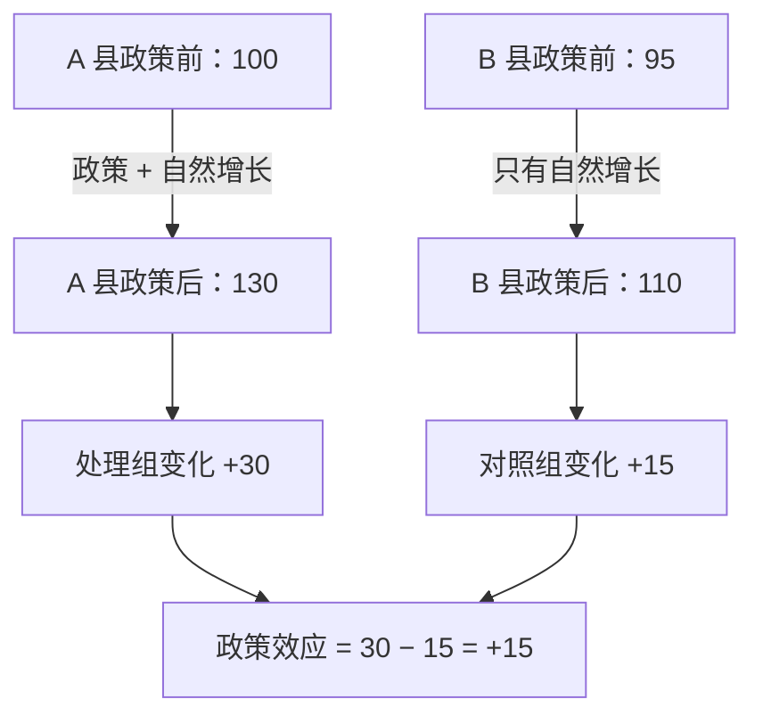
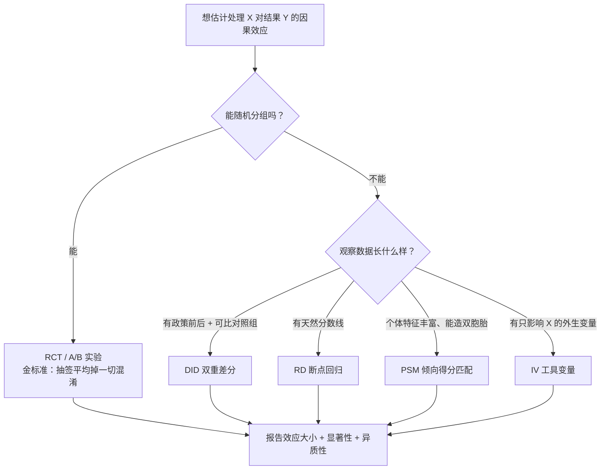

# 因果推断方法工具箱

> **一句话理解**：上一节学会了识破"假相关"，这一节拿起工具箱——金标准是随机实验（RCT），做不了实验时，倾向得分匹配（PSM）、双重差分（DID）、断点回归（RD）、工具变量（IV）各有各的补场绝活。

[⬆️ 返回总目录](../../../README.md) · [⬆️ 返回本篇](../README.md) · [⬅️ 返回本章目录](./README.md)

| 属性 | 说明 |
|------|------|
| 难度 | ⭐⭐⭐⭐（高阶） |
| 所属分支 | 因果 |
| 前置知识 | [相关不等于因果](./01-相关不等于因果.md)；[概率与统计](../../1-起步准备/02-数学基础/04-概率与统计.md) |

---

## 📌 这一节解决什么问题

上一节留下了作战任务：我们真正想知道的是 $P(Y \mid \mathrm{do}(X))$——**强行让一部分人"被处理"（吃药、发券、改版），结果会怎样变化**——但手头往往只有观察数据，里面全是混淆变量的痕迹。

理想的解法一句话就能说清：**随机分组**。让老天爷抽签决定谁被处理，任何背景变量（贫富、病情、活跃度）在两组中被平均掉，混淆通道被物理切断。这就是随机对照试验（Randomized Controlled Trial, RCT），医学与互联网 A/B 实验共同的基石。

但现实常常不允许做实验：药不能随机不给病人吃、政策全县统一上线、历史决策已经发生无法重来。于是统计学家发明了一整套"用聪明的设计 + 可检验的假设"从观察数据里近似还原实验的方法。本节把它们一次摆上桌：什么时候用哪个、各自赌的是什么假设。

## 🌱 通俗理解

**RCT = 抽签**。想知道药有没有用，把病人随机分两组：签是"天"抽的，所以两组在年龄、病情、生活方式上整体几乎一样——**唯一的系统性差别就是吃没吃药**。那么两组结局的差距，只能归因于药。抽签的魔力在于：它把所有已知未知的混淆变量**一起平均掉了**，连你没想到的都没收作案工具。

**PSM = 给每个人找双胞胎**。没抽成签怎么办？翻档案：给每个吃了药的病人，找一个**条件几乎一样、只是没吃药**的对照——同岁、同性别、同病情、同活跃度。两百对"双胞胎"摆在一起，吃药那组的结局更好，就比较像药的效果。怎么算"条件几乎一样"？用"这个人会被分配到处理组的概率"（倾向得分）当匹配指纹，分数接近的人就是失散的双胞胎。

**DID = 差中差**。评估"某政策有没有用"：政策只覆盖 A 市（处理组），拿隔壁没政策的 B 市当对照组。直接比政策后两市的水平？不行，A 市本来就比 B 市富。直接比 A 市政策前后的变化？也不行，这几年经济自然在涨。于是**两个差再相减**：A 市涨了 30，B 市同期也涨了 15——那 30 里属于政策的只有 30 − 15 = 15。"大家都涨"的部分被对照组吃掉，剩下的才是净效应。

**RD = 一线之隔**。助学金只给贫困线下的学生。差 1 分钱没评上的和刚好过线的学生，家境其实几乎没差——**分数线就像一把天然的小刀**，把几乎相同的人切成了两半。比较线两侧的结局差异，就是助学金的效应。

**IV = 绕后门**。想研究"受教育年限→收入"，但能力同时影响两者（聪明的人既读书久又挣钱多）。找一个只影响教育、不直接影响收入、也不被能力污染的变量（工具变量，Instrumental Variable, IV），比如"离学校的远近"——借它绕开能力把守的后门，把教育的净效应拎出来。

## 📋 举个例子

**DID 四格数字例**：某省在 A 县试点"电商补贴政策"，B 县未试点。两县试点前后的月均销售额（万元/商户）：

| | 政策前 | 政策后 | 变化 |
|----------|--------|--------|--------|
| A 县（处理组） | 100 | 130 | **+30** |
| B 县（对照组） | 95 | 110 | **+15** |

如果不设对照，直接宣布"政策让销售额提升 30%"——高估了一倍。真相是这五年电商大盘本身就在涨，B 县没享受政策也涨了 15。双重差分：

$$
\mathrm{DID} = (130 - 100) - (110 - 95) = 30 - 15 = \mathbf{+15}
$$

> 👉 **人话**：处理县自己的"进步"里有一大截是大盘雨露均沾的增长，把对照组的涨幅扣掉，剩下的才是政策独享的部分。

**政策的真实效应是 +15，不是 +30**——对照组把"自然增长"这部分从功劳簿上划掉了。



<details>
<summary>📊 展开看：PSM 匹配一对"双胞胎用户"的示例</summary>

发券活动想评估"满 100 减 20 的券带来多少增量购买"。领券的人本来就更爱购物——直接比领券/未领券两组的消费额必然高估。先估计**倾向得分**（用逻辑回归预测"每个用户领券的概率"，特征见下表），再给每个领券用户找得分最接近的未领券用户：

| 特征 | 领券用户 A | 匹配到的未领券用户 B | 得分 |
|------|-----------|---------------------|------|
| 年龄 | 26 | 27 | —— |
| 月活跃天数 | 22 | 21 | —— |
| 历史月均消费 | 480 元 | 505 元 | —— |
| 常购品类数 | 6 | 6 | —— |
| **倾向得分（领券概率）** | **0.71** | **0.70** | 几乎双胞胎 |

这一对的消费差是 +65 元。把几千对这样的双胞胎平均，得到平均处理效应约 +52 元——远小于"领券组比未领券组多花 180 元"的朴素对比。**朴素差值里 128 元是"本来就想买的人既爱领券也爱买"的混淆贡献**，被匹配剥掉了。注意 PSM 的软肋：只能匹配到**观察到**的特征（万一"价格敏感度"没入库，双胞胎也只是表面像），这在方法上叫"仅可观察混淆假设"。

</details>

## 🧠 核心原理

### 整体流程

按"能不能做实验"把工具箱分两层，选型全流程如下：



### 逐步拆解

**1. 因果效应的度量**。处理变量 T（0/1），一个人"被处理"的潜在结果记 $Y_1$、"不被处理"记 $Y_0$（两者永远只能看到一个，另一个是反事实），平均处理效应（Average Treatment Effect, ATE）：

$$
\mathrm{ATE} = \mathbb{E}[\, Y_1 - Y_0 \,]
$$

> 👉 **人话**：如果所有人都能"既吃药又不吃药"各活一遍，两次结局平均差多少。现实中没人能活两遍，所以所有方法本质上都在**用设计或假设，给看不见的那个反事实找代理**——RCT 用随机组的均值代理，PSM 用双胞胎的结局代理，DID 用对照组的变化代理。

**2. RCT 为什么是金标准**。随机化使 $P(T=1 \mid Y_0, Y_1) = P(T=1)$——分组与任何潜在结果无关，于是组间均差就是 ATE 的无偏估计：

$$
\mathbb{E}[\, Y \mid T=1 \,] - \mathbb{E}[\, Y \mid T=0 \,] = \mathrm{ATE}
$$

> 👉 **人话**：抽签保证了两组在开跑前站在同一起跑线，终点的差距只能来自处理本身——这就是 A/B 实验一招鲜吃遍天的原理（工程细节见下一页）。

**3. PSM 的倾向得分**。用协变量 X 预测"被处理的概率"：

$$
e(x) = P(T = 1 \mid X = x)
$$

> 👉 **人话**：把一个人的全部背景压缩成一个 0~1 的"领券概率"分数，分数相同的人背景综合水平相当，配成对再比结局——相当于事后补做一场"准抽签"。

**4. DID 与它的命门**。效应估计式：

$$
\widehat{\mathrm{DID}} = (\bar{Y}_{处理, 后} - \bar{Y}_{处理, 前}) - (\bar{Y}_{对照, 后} - \bar{Y}_{对照, 前})
$$

> 👉 **人话**：处理组的前后变化，减去对照组的前后变化——第一重差扣掉起点差异，第二重差扣掉共同趋势。**命门是平行趋势假设**：假如没有政策，两县本来会以相同斜率增长；这个假设无法直接验证（反事实又来了），只能用政策前的历史数据检验"过去斜率是否一致"来间接背书。

**5. RD 与 IV 各一句话**。**断点回归（Regression Discontinuity, RD）**：比较分数线两侧窄带内的人——他们几乎同质，唯一区别是过没过线，线两侧结局的"跳变"就是处理效应。**工具变量（IV）**：找一个只通过 X 影响 Y 的外生变量（如离学校距离之于教育年限），用它把 X 中"干净的那部分波动"拎出来估计效应——绕开后门的迂回战术。

**6. 因果发现（Causal Discovery）**：前面所有方法都假设你**知道**因果图；因果发现反过来——从数据里把因果图**猜出来**：PC 算法用条件独立性检验一条条排除不可能的边；NOTEARS 把"找图"改写成连续优化问题。一句话定位：观测数据只能恢复因果图的一部分，结果当"辅助线索"比当"最终判决"更合适。

**7. 因果 + 机器学习**：**Uplift 建模**不问"平均有没有效"，问"对**谁**有效"——它专门找出"被广告打动才会买"的摇摆人群（给他们投广告才有增量），跳过"买不买都无所谓"和"本来就要买"的人；**因果表示学习**一句话：让深度模型的表征天然满足因果假设（如不变性），是因果与深度学习交叉的前沿方向。**工具生态**一句话：DoWhy 把"画因果图 + 检验假设 + 估效应"串成流水线，EconML/CausalML 主打异质性效应与 Uplift。

## 💻 动手试试

用 statsmodels 在模拟数据上做一次完整的 DID：200 个商户（100 处理县 + 100 对照县），政策前各观察一次。真实政策效应设为 +15，看回归能不能把它抓回来：

```python
# 用 statsmodels 做一次双重差分（DID）
# 先安装：pip install statsmodels
import numpy as np
import pandas as pd
import statsmodels.formula.api as smf

rng = np.random.default_rng(7)
N = 100                                            # 每县 100 个商户
treat = np.repeat([1, 0], N)                       # 前 100 个：处理县；后 100 个：对照县
post = np.tile([0, 1], N)                          # 每个商户观察政策前(0)、后(1)两期
y = (100 + 5 * treat + 12 * post + 15 * treat * post
     + rng.normal(0, 3, 2 * N))                    # 基线 100；处理县本身高 5；自然增长 12；政策效应 15

df = pd.DataFrame({"y": y, "treat": treat, "post": post})
res = smf.ols("y ~ treat * post", df).fit()        # 交互项系数 = DID 估计
print(res.params.round(2))

m = df.groupby(["treat", "post"])["y"].mean()      # 手算四格均值做对照
did = (m[1, 1] - m[1, 0]) - (m[0, 1] - m[0, 0])
print(f"手算双重差分 = {did:.2f}（真值 15）")
```

预期输出（随机种子固定时数值可复现；换种子小幅波动）：

```text
Intercept      99.77    # 对照县·政策前：基线
treat            4.55    # 政策前两县差距 +5（本来就存在的差别）
post           11.90     # 自然增长 +12（对照组的前后变化）
treat:post      15.40    # ← 政策效应，估计值 ≈ 15，抓回来了
dtype: float64
手算双重差分 = 15.40（真值 15）
```

回归里的交互项系数与四格手算完全一致——`y ~ treat * post` 这一行的 `treat:post` 就是 DID 的"身份证"。

## 🔥 炼丹小灶

> 🔥 **炼丹小灶**：效应估计的工业界起点配方与玄学——
> - 配方：能实验就别硬做观察研究；DID 先画平行趋势图（政策前 6~12 期斜率是否一致）；PSM 匹配后必须做"平衡性检验"（匹配后两组协变量分布应接近重合）；样本量按目标检出效应算，别倒过来。
> - 玄学：效应估计值刚好卡在"业务上够本"的边缘最可疑——先查是不是挑了好看的切分；换一个对照县/对照组再算一遍，效应塌了就是有隐藏混淆。
> - ⚠️ 以上是经验参考值，不是圣旨；换场景请重新炼。

## 🔗 在知识树中的位置

- **上游**：[相关不等于因果](./01-相关不等于因果.md)——所有方法都在兑现那一节的 do 算子；[逻辑回归与分类](../../2-经典机器学习/03-机器学习/03-逻辑回归与分类.md)——PSM 的倾向得分就是它算的。
- **下游**：[生产实战](./99-生产实战.md)——RCT 的工业形态 A/B 实验平台、DID 在策略评估里的日常用法。
- **横向呼应**：[推荐系统的生产实战](../08-推荐系统/99-生产实战.md)——A/B 实验是推荐迭代的心脏，本章为它补上"为什么有效"的理论底座；Uplift 与推荐的"个性化"思想同源（对谁有效 vs 给谁推什么）。

## ⚠️ 常见误区

- **误区一**："匹配/回归控制了足够多的变量，结论就是因果" → 控制只对**混淆变量**有效；控制中介变量会掐断真实效应，按对撞变量分层会制造假相关（上一节的折叠框），而且永远有没观察到的混淆在暗处——方法的有效性依赖假设，不依赖变量个数。
- **误区二**："DID 有对照有前后，拿来就用" → DID 赌的是平行趋势；若处理县本来就在高速增长期（比如政策专挑增长快的县试点），对照组扣掉的就不是"自然增长"而是错误基准，效应直接失真。政策前多期数据检验趋势一致性是必修动作。
- **误区三**："平均效应不显著 = 对谁都没用" → 平均可能掩盖异质性：对老用户无效、对新用户大补，混在一起可能刚好抵消。关心"对谁有效"要上 Uplift / 异质性分析，而不是给全量判死刑。

## 📝 小结与自测

**要点回顾**

- RCT 用随机化把已知未知的混淆一并平均掉，是因果效应的黄金标准；A/B 实验是它的工业形态
- 做不了实验时的四件套：PSM 找双胞胎、DID 差中差（命门：平行趋势）、RD 借分数线、IV 绕后门
- 所有方法都在给"看不见的反事实"找代理；每种方法赌一个可讨论的假设——假设比公式重要
- 进阶方向：因果发现（从数据反推因果图）、Uplift（对谁有效）、DoWhy/EconML 工具生态

**自测一下**（点击展开答案）

<details>
<summary>问题 1：处理县政策前后从 200 涨到 240，对照县从 190 涨到 215。政策效应是多少？</summary>

按差中差：处理组变化 = 240 − 200 = +40；对照组变化 = 215 − 190 = +25；政策效应 = 40 − 25 = **+15**。如果只看处理县自己，会高估为 +40——其中 +25 是两市共享的自然增长，功劳不在政策。

</details>

<details>
<summary>问题 2：为什么 RCT 不需要（也很难）列举混淆变量，而 PSM 必须？</summary>

随机化是"无差别打击"：抽签与任何变量都无关，无论混淆变量是否被观测、是否被人想到，都会在两组中被平均掉。而 PSM 是"点名复制"：只能按**已观测并入库**的特征造双胞胎，漏掉一个关键混淆（如价格敏感度），匹配出的"像"就是表面像。所以 RCT 的清单可以是空的，PSM 的清单必须尽力长。

</details>

## 📚 延伸阅读

- 书：Pearl《Causality: Models, Reasoning and Inference》——do 微积分的完整理论（进阶）
- 书：Mostly Harmless Econometrics（第 4~6 章）——IV、DID、RD 的计量经济学标准讲法
- 文档：[DoWhy](https://py-why.github.io/dowhy/) 与 [EconML](https://econml.azurewebsites.net/) 官方文档——从模拟数据入手最快建立手感

---

[⬅️ 上一页：相关不等于因果](./01-相关不等于因果.md) · [返回本章目录](./README.md) · [下一页：生产实战 ➡️](./99-生产实战.md)
