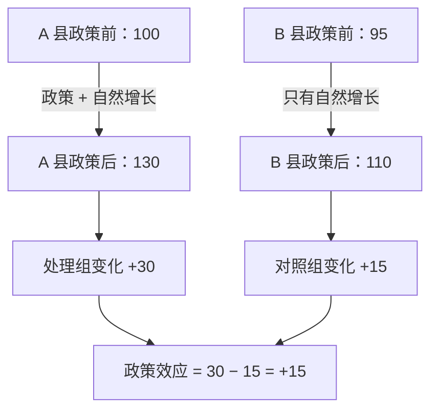
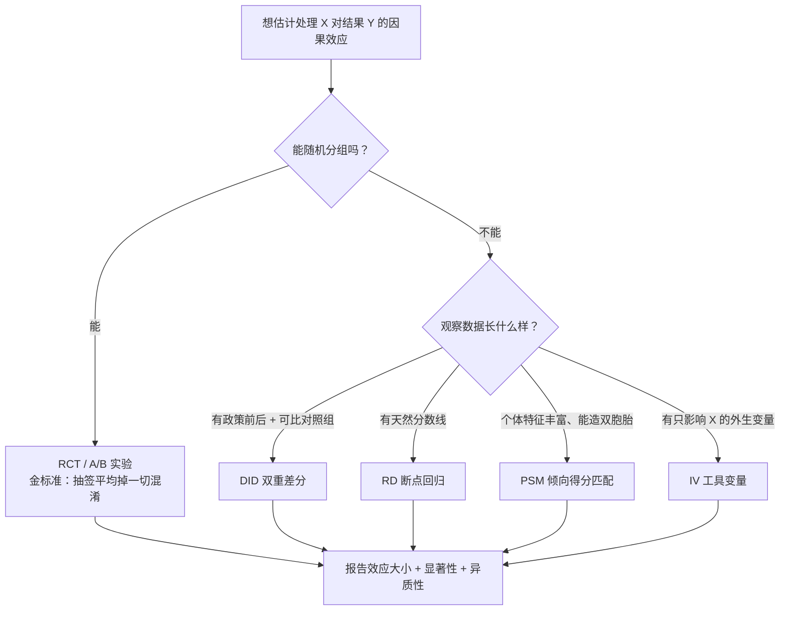
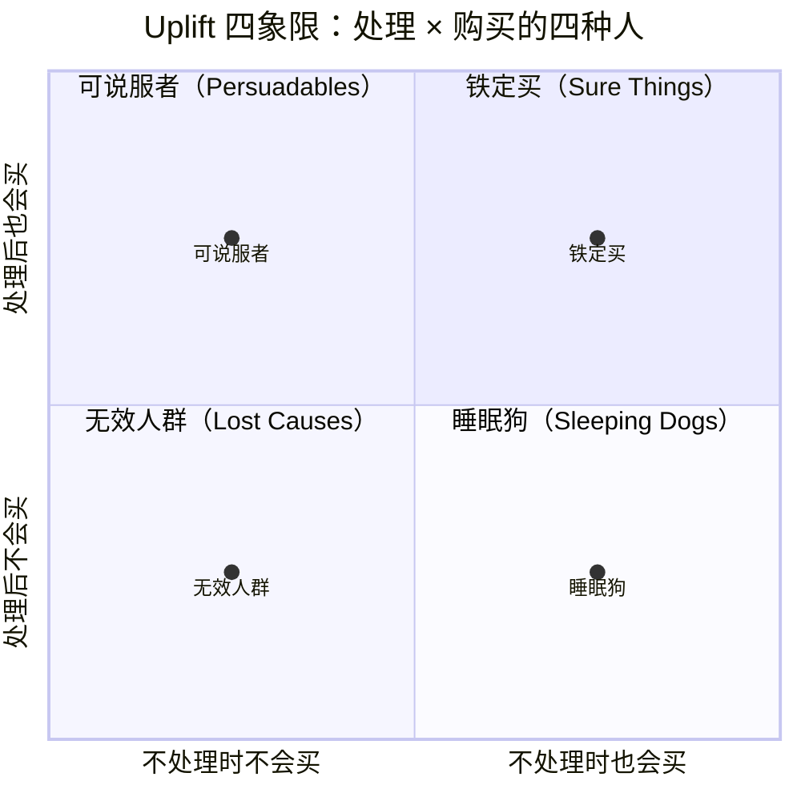

# 因果推断方法工具箱

> **一句话理解**：上一节学会了识破"假相关"，这一节拿起工具箱——金标准是随机实验（RCT），做不了实验时，倾向得分匹配（PSM）、双重差分（DID）、断点回归（RD）、工具变量（IV）各有各的补场绝活。

[⬆️ 返回总目录](../../../README.md) · [⬆️ 返回本篇](../README.md) · [⬅️ 返回本章目录](./README.md)

| 属性 | 说明 |
|------|------|
| 难度 | ⭐⭐⭐⭐（高阶） |
| 所属分支 | 因果 |
| 前置知识 | [相关不等于因果](./01-相关不等于因果.md)；[概率与统计](../../1-起步准备/02-数学基础/04-概率与统计.md) |

---

## 📌 这一节解决什么问题

上一节留下了作战任务：我们真正想知道的是 $P(Y \mid \mathrm{do}(X))$——**强行让一部分人"被处理"（吃药、发券、改版），结果会怎样变化**——但手头往往只有观察数据，里面全是混淆变量的痕迹。

理想的解法一句话就能说清：**随机分组**。让老天爷抽签决定谁被处理，任何背景变量（贫富、病情、活跃度）在两组中被平均掉，混淆通道被物理切断。这就是随机对照试验（Randomized Controlled Trial, RCT），医学与互联网 A/B 实验共同的基石。

但现实常常不允许做实验：药不能随机不给病人吃、政策全县统一上线、历史决策已经发生无法重来。于是统计学家发明了一整套"用聪明的设计 + 可检验的假设"从观察数据里近似还原实验的方法。本节把它们一次摆上桌：什么时候用哪个、各自赌的是什么假设、**假设坏了怎么查出来**（平行趋势检验、操纵检验、重叠诊断……这些"体检动作"和工具本身一样重要）。

## 🌱 通俗理解

**RCT = 抽签**。想知道药有没有用，把病人随机分两组：签是"天"抽的，所以两组在年龄、病情、生活方式上整体几乎一样——**唯一的系统性差别就是吃没吃药**。那么两组结局的差距，只能归因于药。抽签的魔力在于：它把所有已知未知的混淆变量**一起平均掉了**，连你没想到的都没收作案工具。

**PSM = 给每个人找双胞胎**。没抽成签怎么办？翻档案：给每个吃了药的病人，找一个**条件几乎一样、只是没吃药**的对照——同岁、同性别、同病情、同活跃度。两百对"双胞胎"摆在一起，吃药那组的结局更好，就比较像药的效果。怎么算"条件几乎一样"？用"这个人会被分配到处理组的概率"（倾向得分）当匹配指纹，分数接近的人就是失散的双胞胎。

**DID = 差中差**。评估"某政策有没有用"：政策只覆盖 A 市（处理组），拿隔壁没政策的 B 市当对照组。直接比政策后两市的水平？不行，A 市本来就比 B 市富。直接比 A 市政策前后的变化？也不行，这几年经济自然在涨。于是**两个差再相减**：A 市涨了 30，B 市同期也涨了 15——那 30 里属于政策的只有 30 − 15 = 15。"大家都涨"的部分被对照组吃掉，剩下的才是净效应。

**合成控制 = 亲手拼一个对照组**。政策只在"一个省"试点时，隔壁找不到第二个差不多的省——那就用几个未试点省份**加权拼**出一个"合成省"，让它在政策前与真实省的轨迹严丝合缝；政策后两条线的裂口就是效应（详见核心原理第 4 条）。

**RD = 一线之隔**。助学金只给贫困线下的学生。差 1 分钱没评上的和刚好过线的学生，家境其实几乎没差——**分数线就像一把天然的小刀**，把几乎相同的人切成了两半。比较线两侧的结局差异，就是助学金的效应。

**IV = 绕后门**。想研究"受教育年限→收入"，但能力同时影响两者（聪明的人既读书久又挣钱多）。找一个只影响教育、不直接影响收入、也不被能力污染的变量（工具变量，Instrumental Variable, IV），比如"离学校的远近"——借它绕开能力把守的后门，把教育的净效应拎出来。

## 📋 举个例子

**DID 四格数字例**：某省在 A 县试点"电商补贴政策"，B 县未试点。两县试点前后的月均销售额（万元/商户）：

| | 政策前 | 政策后 | 变化 |
|----------|--------|--------|--------|
| A 县（处理组） | 100 | 130 | **+30** |
| B 县（对照组） | 95 | 110 | **+15** |

如果不设对照，直接宣布"政策让销售额提升 30%"——高估了一倍。真相是这五年电商大盘本身就在涨，B 县没享受政策也涨了 15。双重差分：

$$
\mathrm{DID} = (130 - 100) - (110 - 95) = 30 - 15 = \mathbf{+15}
$$

> 👉 **人话**：处理县自己的"进步"里有一大截是大盘雨露均沾的增长，把对照组的涨幅扣掉，剩下的才是政策独享的部分。

**政策的真实效应是 +15，不是 +30**——对照组把"自然增长"这部分从功劳簿上划掉了。



<details>
<summary>📊 展开看：PSM 匹配一对"双胞胎用户"的示例</summary>

发券活动想评估"满 100 减 20 的券带来多少增量购买"。领券的人本来就更爱购物——直接比领券/未领券两组的消费额必然高估。先估计**倾向得分**（用逻辑回归预测"每个用户领券的概率"，特征见下表），再给每个领券用户找得分最接近的未领券用户：

| 特征 | 领券用户 A | 匹配到的未领券用户 B | 得分 |
|------|-----------|---------------------|------|
| 年龄 | 26 | 27 | —— |
| 月活跃天数 | 22 | 21 | —— |
| 历史月均消费 | 480 元 | 505 元 | —— |
| 常购品类数 | 6 | 6 | —— |
| **倾向得分（领券概率）** | **0.71** | **0.70** | 几乎双胞胎 |

这一对的消费差是 +65 元。把几千对这样的双胞胎平均，得到平均处理效应约 +52 元——远小于"领券组比未领券组多花 180 元"的朴素对比。**朴素差值里 128 元是"本来就想买的人既爱领券也爱买"的混淆贡献**，被匹配剥掉了。注意 PSM 的软肋：只能匹配到**观察到**的特征（万一"价格敏感度"没入库，双胞胎也只是表面像），这在方法上叫"仅可观察混淆假设"。

</details>

## 🧠 核心原理

### 整体流程

按"能不能做实验"把工具箱分两层，选型全流程如下：



### 逐步拆解

**1. 因果效应的度量**。处理变量 T（0/1），一个人"被处理"的潜在结果记 $Y_1$、"不被处理"记 $Y_0$（两者永远只能看到一个，另一个是反事实），平均处理效应（Average Treatment Effect, ATE）：

$$
\mathrm{ATE} = \mathbb{E}[\, Y_1 - Y_0 \,]
$$

> 👉 **人话**：如果所有人都能"既吃药又不吃药"各活一遍，两次结局平均差多少。现实中没人能活两遍，所以所有方法本质上都在**用设计或假设，给看不见的那个反事实找代理**——RCT 用随机组的均值代理，PSM 用双胞胎的结局代理，DID 用对照组的变化代理。

**2. RCT 为什么是金标准，以及它的统计功效直觉**。随机化使 $P(T=1 \mid Y_0, Y_1) = P(T=1)$——分组与任何潜在结果无关，于是组间均差就是 ATE 的无偏估计：

$$
\mathbb{E}[\, Y \mid T=1 \,] - \mathbb{E}[\, Y \mid T=0 \,] = \mathrm{ATE}
$$

> 👉 **人话**：抽签保证了两组在开跑前站在同一起跑线，终点的差距只能来自处理本身——这就是 A/B 实验一招鲜吃遍天的原理（工程细节见下一页）。

但"无偏"只保证**方向对**，不保证**测得出**。实验设计的第一问是功效（Statistical Power）——真有效应时，你能把它测显著的概率：

| 概念 | 一句话 | 惯例值 |
|------|--------|--------|
| α 第一类错误 | 没效应却喊显著（冤枉好人） | 5% |
| β 第二类错误 | 有效应却没测出（放过真凶） | 20% |
| 功效 = 1−β | 真有效应时能测出的概率 | 80% |
| MDE 最小可检测效应 | 当前样本量下、80% 功效可靠检出的最小效应 | 业务方拍板 |

样本量与效应的量级关系（推导与完整手算见[生产实战](./99-生产实战.md)的折叠框）：

$$
n_{\text{每组}} \approx \frac{16\sigma^2}{\Delta^2} \qquad \Longleftrightarrow \qquad \Delta_{\text{可检出}} \approx \frac{4\sigma}{\sqrt{n}}
$$

> 👉 **人话**：想看清的效应 Δ 越小、数据的自然波动 σ 越大，需要的样本越多——而且分母带平方，**"想看的效应减半，样本翻四倍"**。例：人均消费 σ=200 元、每组 6400 人时，能可靠检出的最小提升约 4×200÷80 = **10 元**；想检出 5 元，每组要 25600 人。两个直接推论：**小样本实验读到"不显著"几乎没信息**（功效太低，测不出 ≠ 没效应）；实验设计要**先定 Δ 再算 n，而不是做完再问"测出多少算多少"**。

<details>
<summary>🧮 展开推导：16σ²/Δ² 里的 16 是哪来的</summary>

设两组各 n 人、结局标准差 σ，均值差的真实效应为 Δ。检验的门槛由两头决定：显著水平 5%（双侧，z = 1.96）管"冤枉好人"，功效 80%（z = 0.84）管"真有效应时 80% 的概率抓到它"。

每组 n 人时，两均值差的标准误是 $\sigma\sqrt{2/n}$。"真效应能被稳定抓到"要求检验统计量的**期望值**至少顶到显著线之外 0.84 个标准差：

$$
\frac{\Delta}{\sigma\sqrt{2/n}} \;\ge\; 1.96 + 0.84
$$

反解出 n：

$$
n \;\ge\; (1.96+0.84)^2 \cdot \frac{2\sigma^2}{\Delta^2} = 7.84 \times 2 \times \frac{\sigma^2}{\Delta^2} \approx \frac{16\,\sigma^2}{\Delta^2}
$$

所以 **16 = 2 × (1.96 + 0.84)²**——它把"两类错误的预算"打包成了一个数。把功效提到 90%（z=1.28），系数变约 21；把 α 收紧到 1%（z=2.58），系数变约 25——**精度每提一档，样本量就上一截**，这就是"越想看清越贵"的代数来源。

</details>

**3. PSM 的倾向得分——以及它的三步体检**。用协变量 X 预测"被处理的概率"：

$$
e(x) = P(T = 1 \mid X = x)
$$

> 👉 **人话**：把一个人的全部背景压缩成一个 0~1 的"领券概率"分数，分数相同的人背景综合水平相当，配成对再比结局——相当于事后补做一场"准抽签"。

匹配不是配完就完，三步体检缺一不可：

| 体检步骤 | 做什么 | 怎么算合格 | 不合格说明什么 |
|----------|--------|-----------|----------------|
| ① 倾向得分模型评估 | 看得分模型分得开两组到什么程度（常用 AUC）、校准好不好 | AUC 落在 0.6~0.8 的"舒适区"（经验参考） | AUC 太低：特征太弱，双胞胎不像；**AUC 太高（→1）：两组几乎完全可分 = 无重叠 = 匹配无米下锅**——目标不是分类准确，是造出可比人群 |
| ② 重叠诊断（Common Support） | 画两组倾向得分的直方图，看重叠区间 | 两组得分分布有大片公共区间；非重叠区的样本修剪（trimming）掉 | 处理组一大片"高分孤岛"（未处理组里根本没有像他们的人）→ 这部分人的效应**不可估**，硬匹配就是外推；修剪后结论只适用重叠区人群（外部效度缩水，要明说） |
| ③ 匹配质量检查（平衡性） | 匹配后对**每个协变量**重算组间差异 | 标准化均值差 $\mathrm{SMD} = \frac{\bar{x}_T - \bar{x}_C}{\sqrt{(s_T^2 + s_C^2)/2}}$ 的绝对值 < 0.1（经验线） | 某特征匹配后仍差得远 → 双胞胎只是总分像、单项不像；回到 ① 换匹配方式（卡钳匹配、近邻数）或补特征 |

> 👉 **人话**：PSM 的三个死穴各对应一步——模型没抓住真混淆（①）、两组本来就没可比人群（②）、匹配只把总分拉平没把单项拉平（③）。跳过体检的 PSM 报告，等于没做手术也不拍片子。

**4. DID 与它的命门——平行趋势**。效应估计式：

$$
\widehat{\mathrm{DID}} = (\bar{Y}_{处理, 后} - \bar{Y}_{处理, 前}) - (\bar{Y}_{对照, 后} - \bar{Y}_{对照, 前})
$$

> 👉 **人话**：处理组的前后变化，减去对照组的前后变化——第一重差扣掉起点差异，第二重差扣掉共同趋势。**命门是平行趋势假设**：假如没有政策，两县本来会以相同斜率增长；这个假设针对的是"看不见的反事实"，无法直接验证，只能间接背书——两道标准体检：

- **体检一：事件研究图（Event Study）**。把"相对政策时点"的每期设成虚拟变量（政策前第 2 期、前 1 期、当期、后 1 期……留一期作基准），回归后把每期系数和置信区间画出来。**读图口诀：政策前的系数（前置期）应围绕 0 上下小幅波动、不显著**——这是"过去斜率一致"的证据；政策后的系数轨迹则是动态效应本身（立即抬升 / 逐期发酵 / 冲高回落，一眼可读）。前置期系数显著偏离 0 → 平行趋势可疑，或市场提前"抢跑"（政策风声改变行为）。

<details>
<summary>📊 展开看：一张事件研究图怎么读（示例数字）</summary>

把各期系数与 95% 置信区间列成表（数字为示意），理想与翻车两种长相：

| 相对政策期 | 系数 | 95% 区间 | 判读 |
|-----------|------|----------|------|
| 前 3 期 | +1.1 | [−2.0, +4.2] | 贴 0，健康 |
| 前 2 期 | +1.8 | [−1.3, +4.9] | 贴 0，健康 |
| 前 1 期 | +4.6 | [+1.5, +7.7] | **显著离 0——警报**：政策前两组已分岔（或市场提前抢跑） |
| 当期 | +13.2 | [+9.8, +16.6] | 政策落地，效应出现（跳变只应出现在这里） |
| 后 1 期 | +16.9 | [+13.0, +20.8] | 效应逐期发酵 |
| 后 2 期 | +15.1 | [+11.0, +19.2] | 效应平稳在 15 左右（与 DID 点估计互印证） |

**读图三问**：① 前置期贴不贴 0（平行趋势体检）；② 跳变是否只出现在当期（政策效应的"身份证"——政策前就爬坡说明是趋势不是效应）；③ 后期轨迹什么形状（一次性流量还是长期存量，决定怎么向业务方汇报）。前置期一旦显著，政策期之后的数字也不再可信——因为"没有政策时两组本会怎么走"这条反事实基准线已经画不直了。

</details>
- **体检二：安慰剂检验（Placebo Test）**。故意喂假东西，真方法应该"验出无效"：**假时点**——在真实政策前随便挑个时点重跑 DID，"假政策"不该有效应，若显著则识别策略有病；**假处理组**——随机指认一批"假处理县"重复几百次，真实的效应估计应明显落在随机分布的尾部之外。

- **升级款：合成控制（Synthetic Control）**。当**处理单元只有一个**（一个省、一座城、一条产品线）、DID 找不到现成单一对照时的升级方案：拿若干未处理单元做**加权组合**（权重非负、合计为 1），在政策前把"合成对照"的轨迹拟合到与真实处理组严丝合缝；政策后**真实与合成两条线的裂口就是效应**。思想一句话：DID 是"找一个像的对照"，合成控制是"亲手拼一个像的对照"——拟合期越长越可信。什么时候出场、怎么用，见[生产实战](./99-生产实战.md)的折叠框。

**5. RD 与 IV：各自的看门检验**。**断点回归（Regression Discontinuity, RD）**：比较分数线两侧窄带内的人——他们几乎同质，唯一区别是过没过线，线两侧结局的"跳变"就是处理效应。RD 成立的前提是**断点两侧的人确实"准随机"**，所以有两道看门检验：

- **操纵检验（连续性检验）**：画"跑分"（驱动变量）的密度图。**分数线附近密度突增，说明分数被人操纵过**——老师临场提分、考生反复刷分冲线、运营把边界用户手动拉过线——两侧人群不再可比，RD 当场失效（McCrary 密度检验就是把这个"突增"正式化）。
- **协变量平衡检验**：年龄、性别、家境等协变量在断点两侧的分布应**连续无跳变**——若协变量也跳，跳的可能是"人"而不是"处理"。

**工具变量（IV）**：找一个只通过 X 影响 Y 的外生变量（如离学校距离之于教育年限），用它把 X 中"干净的那部分波动"拎出来估计效应——绕开后门的迂回战术。IV 的看门检验一句话级：**相关性**（工具与 X 强相关，弱工具是大坑）与**排他性**（工具只通过 X 影响 Y，不可检验、只能靠论证）。

**6. 因果发现（Causal Discovery）**：前面所有方法都假设你**知道**因果图；因果发现反过来——从数据里把因果图**猜出来**：PC 算法用条件独立性检验一条条排除不可能的边；NOTEARS 把"找图"改写成连续优化问题。一句话定位：观测数据只能恢复因果图的一部分，结果当"辅助线索"比当"最终判决"更合适。

**7. Uplift 建模：四象限的人与异质性效应**。前面的方法都在回答"**平均**有没有效"；Uplift 问"对**谁**有效"。把每个人按两个潜在结果（不处理买不买 $Y_0$、处理后买不买 $Y_1$）交叉，人群天然分成四类：



| 人群 | 潜在结果（$Y_0 \to Y_1$） | Uplift | 策略含义 |
|------|---------------------------|--------|----------|
| 可说服者（Persuadables） | 不买 → 买 | **+1** | 黄金人群：营销预算只该花在他们身上 |
| 铁定买（Sure Things） | 买 → 买 | 0 | 投了也白投——发券纯粹白送成本 |
| 无效人群（Lost Causes） | 不买 → 不买 | 0 | 别浪费预算 |
| 睡眠狗（Sleeping Dogs） | 买 → **不买** | **−1** | 投了反而有害（打扰、提醒比价、隐私顾虑）——不仅别投，要保护 |

> 👉 **人话**：全量投放的两个错——把钱浪费在第 2、3 象限，还顺手把第 4 象限的客户"营销"跑了。Uplift 模型的全部目标，就是从"平均有效"走到"对的人有效"。难点照例是反事实：单个人的 $Y_0$、$Y_1$ 只能看一个，所以要用**随机实验数据**训练模型去估计每个人落在四象限的概率（双模型法/标签变换法是两个经典套路）。

**平均会撒谎：CATE 异质性效应**。四象限的极端版，在常规实验里也在悄悄发生。**CATE（Conditional Average Treatment Effect，条件平均处理效应）**= 给定特征子群体的 ATE。数字例：某发券实验全体平均 +2%（p=0.3，不显著）——切开看，新客 **+12%**（显著为正）、老客 **−8%**（显著为负），各占一半。加权平均 $(12-8)/2 = 2$ 把两股方向相反的力量糊成了一个"没测出来"；全量上线等于**给老客发"劝退券"**。所以核心实验必做异质性切片（新老、渠道、价格敏感度），估计工具从简单的分组检验到因果树/因果森林、元学习器（一句话：把"效应随特征变化"本身当预测目标来学）。这与 Uplift 同源：Uplift 是它的营销特化版。

**8. 因果 + 机器学习**：**因果表示学习**一句话：让深度模型的表征天然满足因果假设（如不变性），是因果与深度学习交叉的前沿方向。**工具生态**一句话：DoWhy 把"画因果图 + 检验假设 + 估效应"串成流水线，EconML/CausalML 主打异质性效应与 Uplift。

## 💻 动手试试

用 statsmodels 在模拟数据上做一次完整的 DID：200 个商户（100 处理县 + 100 对照县），政策前各观察一次。真实政策效应设为 +15，看回归能不能把它抓回来：

```python
# 用 statsmodels 做一次双重差分（DID）
# 先安装：pip install statsmodels
import numpy as np
import pandas as pd
import statsmodels.formula.api as smf

rng = np.random.default_rng(7)
N = 100                                            # 每县 100 个商户
treat = np.repeat([1, 0], N)                       # 前 100 个：处理县；后 100 个：对照县
post = np.tile([0, 1], N)                          # 每个商户观察政策前(0)、后(1)两期
y = (100 + 5 * treat + 12 * post + 15 * treat * post
     + rng.normal(0, 3, 2 * N))                    # 基线 100；处理县本身高 5；自然增长 12；政策效应 15

df = pd.DataFrame({"y": y, "treat": treat, "post": post})
res = smf.ols("y ~ treat * post", df).fit()        # 交互项系数 = DID 估计
print(res.params.round(2))

m = df.groupby(["treat", "post"])["y"].mean()      # 手算四格均值做对照
did = (m[1, 1] - m[1, 0]) - (m[0, 1] - m[0, 0])
print(f"手算双重差分 = {did:.2f}（真值 15）")
```

预期输出（随机种子固定时数值可复现；换种子小幅波动）：

```text
Intercept      99.77    # 对照县·政策前：基线
treat            4.55    # 政策前两县差距 +5（本来就存在的差别）
post           11.90     # 自然增长 +12（对照组的前后变化）
treat:post      15.40    # ← 政策效应，估计值 ≈ 15，抓回来了
dtype: float64
手算双重差分 = 15.40（真值 15）
```

回归里的交互项系数与四格手算完全一致——`y ~ treat * post` 这一行的 `treat:post` 就是 DID 的"身份证"。

**改什么参数、看什么变化**（模拟数据的好处：真值握在手里）：

| 改动 | 预期现象 | 在验证什么 |
|------|----------|-----------|
| 把 `15 * treat * post` 改成 `0`（政策真无效应） | `treat:post` 系数应接近 0、p 值大 | 估计的"无偏"——不冤枉好人 |
| 政策前处理县本来就在加速（如 `+ 2 * post * post * treat` 之类的前趋势） | DID 估计明显偏离真值 | **平行趋势破坏的杀伤力**——这正是要做事件研究图的原因 |
| 噪声 `rng.normal(0, 3, ...)` 改成 `(0, 30, ...)` | 估计值波动巨大、可能测不显著 | σ 变大 → 可检出效应变大（功效直觉的现场版） |
| N=100 → 10 | 系数上蹿下跳 | 小样本"不显著"≈没信息 |

## 🔥 炼丹小灶

> 🔥 **炼丹小灶**：效应估计的工业界起点配方与玄学——
> - 配方：能实验就别硬做观察研究；DID 先画事件研究图（政策前 6~12 期前置系数是否贴 0）；PSM 匹配后必须做平衡性检验（所有协变量 |SMD| < 0.1，且倾向得分 AUC 落在 0.6~0.8）；样本量按目标检出效应算，别倒过来。
> - 玄学：效应估计值刚好卡在"业务上够本"的边缘最可疑——先查是不是挑了好看的切分；换一个对照县/对照组再算一遍，效应塌了就是有隐藏混淆。
> - ⚠️ 以上是经验参考值，不是圣旨；换场景请重新炼。

## 🔗 在知识树中的位置

- **上游**：[相关不等于因果](./01-相关不等于因果.md)——所有方法都在兑现那一节的 do 算子，"控制谁"由链/叉/对撞三结构说了算；[逻辑回归与分类](../../2-经典机器学习/03-机器学习/03-逻辑回归与分类.md)——PSM 的倾向得分就是它算的。
- **下游**：[生产实战](./99-生产实战.md)——RCT 的工业形态 A/B 实验平台、DID 在策略评估里的日常用法。
- **横向呼应**：[推荐系统的生产实战](../08-推荐系统/99-生产实战.md)——A/B 实验是推荐迭代的心脏，本章为它补上"为什么有效"的理论底座；Uplift 与推荐的"个性化"思想同源（对谁有效 vs 给谁推什么）。

## ⚠️ 常见误区

- **误区一**："匹配/回归控制了足够多的变量，结论就是因果" → 控制只对**混淆变量**（叉）有效；控制中介变量（链）会掐断真实效应，按对撞变量分层会制造假相关（上一节三结构），而且永远有没观察到的混淆在暗处——方法的有效性依赖假设，不依赖变量个数。
- **误区二**："DID 有对照有前后，拿来就用" → DID 赌的是平行趋势；若处理县本来就在高速增长期（比如政策专挑增长快的县试点），对照组扣掉的就不是"自然增长"而是错误基准，效应直接失真。事件研究图 + 安慰剂检验是必修动作，不是可选项。
- **误区三**："平均效应不显著 = 对谁都没用" → 平均可能掩盖异质性：新客 +12%、老客 −8%，混在一起刚好抵消。关心"对谁有效"要上 Uplift / CATE 异质性分析，而不是给全量判死刑。
- **误区四**："RD 有分数线就万无一失" → 分数可能被人操纵（临场提分、反复冲线）：密度图上断点附近突增，两侧人群就不再"准随机"，RD 当场失效——操纵检验与协变量连续性检验是 RD 的入场券。

## 📝 小结与自测

**要点回顾**

- RCT 用随机化把已知未知的混淆一并平均掉，是因果效应的黄金标准；A/B 实验是它的工业形态。功效直觉：$n \propto \sigma^2/\Delta^2$，效应减半样本翻四倍；小样本的"不显著"几乎没信息
- PSM 三步体检：得分模型评估（AUC 0.6~0.8 舒适区，太高=无重叠）、重叠诊断（common support 直方图+修剪）、匹配质量（|SMD|<0.1）
- DID 赌平行趋势，用事件研究图（前置系数贴 0）与安慰剂检验背书；处理单元唯一时升级为合成控制（拼一个对照）
- RD 赌"断点两侧准随机"，用密度操纵检验与协变量连续性看门；IV 赌工具的相关性与排他性
- 所有方法都在给"看不见的反事实"找代理；每种方法赌一个可讨论的假设——**假设与体检比公式重要**
- Uplift 四象限：钱只花在可说服者身上，躲开铁定买/无效人群、保护睡眠狗；平均效应会掩盖亚组反转（CATE）

**自测一下**（点击展开答案）

<details>
<summary>问题 1：处理县政策前后从 200 涨到 240，对照县从 190 涨到 215。政策效应是多少？</summary>

按差中差：处理组变化 = 240 − 200 = +40；对照组变化 = 215 − 190 = +25；政策效应 = 40 − 25 = **+15**。如果只看处理县自己，会高估为 +40——其中 +25 是两市共享的自然增长，功劳不在政策。

</details>

<details>
<summary>问题 2：为什么 RCT 不需要（也很难）列举混淆变量，而 PSM 必须？</summary>

随机化是"无差别打击"：抽签与任何变量都无关，无论混淆变量是否被观测、是否被人想到，都会在两组中被平均掉。而 PSM 是"点名复制"：只能按**已观测并入库**的特征造双胞胎，漏掉一个关键混淆（如价格敏感度），匹配出的"像"就是表面像。所以 RCT 的清单可以是空的，PSM 的清单必须尽力长。

</details>

<details>
<summary>问题 3：全量发券实验显示平均提升 +2%、不显著，运营打算全量上线或全部放弃。用四象限/CATE 的观点劝一劝。</summary>

平均 +2% 不显著，最可能是**异质性被平均糊住了**：比如新客 +12%（显著）、老客 −8%（显著为负），一半是"可说服者"、一半沾"睡眠狗"属性，两股力量相抵。正确动作是先做 CATE 切片——若真是这种结构，答案既不是全量也不是全弃，而是**只给新客发**：把预算集中在可说服者象限，同时避免把老客"营销"跑。全量上线等于对一半人白花钱、对另一半人帮倒忙。

</details>

## 📚 延伸阅读

- 书：Pearl《Causality: Models, Reasoning and Inference》——do 微积分的完整理论（进阶）
- 书：Mostly Harmless Econometrics（第 4~6 章）——IV、DID、RD 的计量经济学标准讲法
- 书：Hernán & Robins《Causal Inference: What If》（网上免费）——潜在结果框架 + 各方法的假设清单
- 文档：[DoWhy](https://py-why.github.io/dowhy/) 与 [EconML](https://econml.azurewebsites.net/) 官方文档——从模拟数据入手最快建立手感

---

[⬅️ 上一页：相关不等于因果](./01-相关不等于因果.md) · [返回本章目录](./README.md) · [下一页：生产实战 ➡️](./99-生产实战.md)
