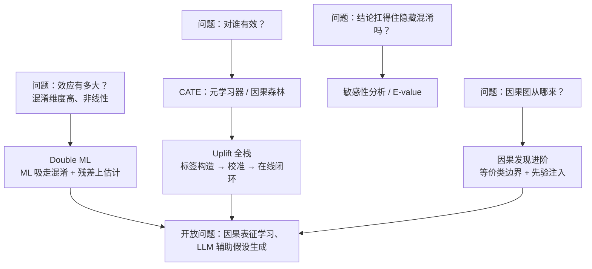
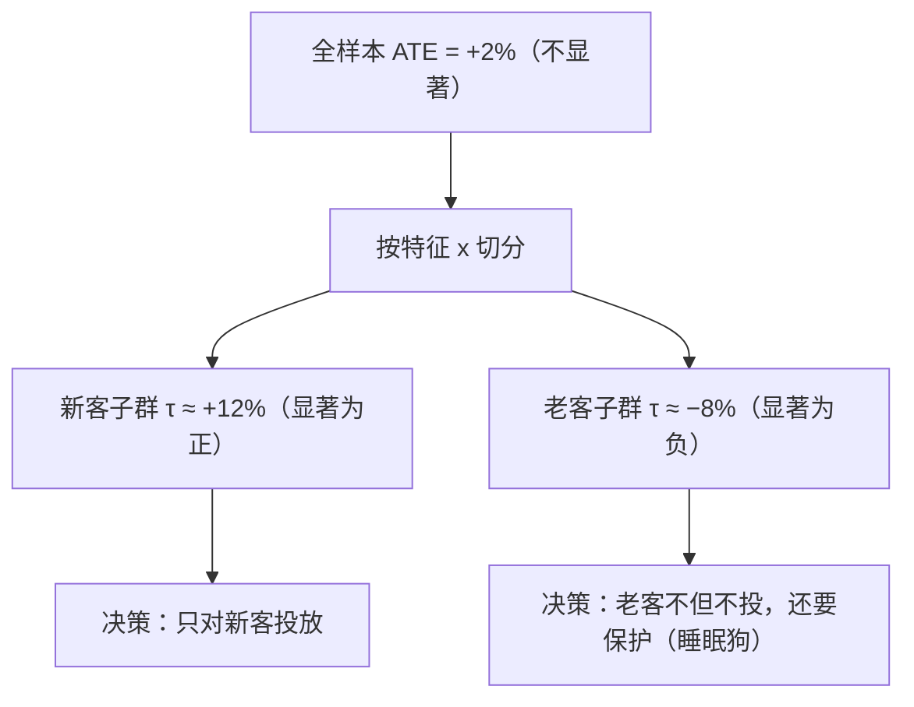
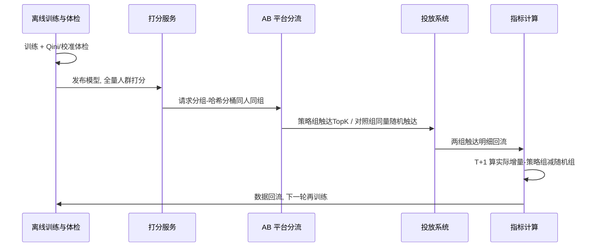

# 进阶专题：因果机器学习（Causal ML）

> **一句话理解**：前两页的工具回答"**平均**有没有效"，这一页把因果推断和机器学习焊在一起——用 ML 扛走高维混淆的控制（Double ML）、把"对谁有效"变成可学习的预测问题（CATE 与 Uplift 全栈）、给观察研究的结论上保险（敏感性分析）、并追问"因果图能不能从数据里学出来"（因果发现的算法边界）。

[⬆️ 返回总目录](../../../README.md) · [⬆️ 返回本篇](../README.md) · [⬅️ 返回本章目录](./README.md)

| 属性 | 说明 |
|------|------|
| 难度 | ⭐⭐⭐⭐（高阶） |
| 所属分支 | 因果 |
| 前置知识 | [相关不等于因果](./01-相关不等于因果.md)、[因果推断方法工具箱](./02-因果推断方法工具箱.md) |

---

## 📌 这一节解决什么问题

[方法工具箱](./02-因果推断方法工具箱.md)留下了四个没拆完的包裹：

**第一，混淆变量太多怎么办**。PSM 要"给每个人找双胞胎"，可现代业务里协变量动辄成百上千维——用户画像、行为序列、地理位置全在候选清单里。逐个人工挑选不现实，线性模型又装不下非线性混淆。于是问题变成：**能不能让 ML 模型替我们控制混淆，同时不让它把因果效应也一起"控制"掉？** 答案是 Double ML（双重机器学习）——先用 ML 把混淆部分"吸走"，再在剩下的残差上估计效应。

**第二，平均效应会撒谎**。工具箱的 CATE 一节已经见过"新客 +12%、老客 −8%、平均 +2% 不显著"的反转。"对谁有效"不该靠人工切片碰运气——它本身就是一个**可学习的预测问题**：预测每个人的处理效应 τ(x)。这一页把元学习器（T/S/X-learner）、因果森林一次讲透。

**第三，Uplift 从模型到生产的全链路**。四象限讲清了"该投给谁"，但从"训练一个 uplift 模型"到"预算真的花对地方"中间还隔着三道工程关卡：**标签怎么造**（反事实标签的巧思）、**分数怎么校准**（预测的 uplift 可能与真实不符）、**上线怎么验证**（与[第 8 章 AB 平台](../08-推荐系统/99-生产实战.md)的闭环）。

**第四，观察研究凭什么站得住**。PSM/DID 赌的假设都有一条"没有未观测混淆"——它**原则上不可检验**。敏感性分析把这条信仰变成一道算术题：**一个躲在暗处的混淆变量要跟处理和结果都强相关到什么程度，才能把结论整个掀翻？** E-value 一个数字回答。

最后再往上问一层：因果图能不能反过来**从数据里学**？——能学多少、哪些方向**永远**学不出来（等价类），就是因果发现一节的边界问题。

## 🌱 通俗理解

**Double ML = 先吸尘、再量尺寸**。你想量地毯的真实尺寸（处理效应），但地垫下面垫了好几层东西（混淆变量的影响）。直接量是把垫子厚度也算进去了。正确做法：先用吸尘器（ML 模型）把每一层垫子**分别吸走**——从"结果"里吸走混淆能解释的部分、从"处理"里也吸走混淆能解释的部分——然后量剩下的两块"净料"之间的关系。妙处在于：**两层污渍不必吸得完美干净**（Neyman 正交性），只要误差是"二阶"的，最后量出来的尺寸就还是准的。

**交叉拟合 = 考试和阅卷分开**。如果用同一批学生既出考题又判卷子（同一份数据既训 ML 又算残差），老师会"对着答案讲题"——残差被人为压小，效应估计跟着失真。把数据切成几折：这几折出题、那几折阅卷，再轮换——**出题人和阅卷人永不为同一拨**，残差才是诚实的。

**CATE = 平均分掩盖偏科**。全班数学平均 72 分，看着中规中矩；拆开看，一半人 95、一半人 49。用平均分给每个人定教学方案，两头都错。"处理效应"同理：它是随人而变的量，把它压成一个全样本平均数，就是把两条方向相反的曲线糊成一条水平线。

**Uplift 标签的巧思 = 给对照组的成绩打负号**。单个人的增量（处理了买 vs 不处理也买）永远测不了，但 50/50 随机实验里有个数学戏法：把处理组用户的转化记 +Y、对照组用户的转化记 −Y，**这个"奇怪的标签"的期望恰好就是 uplift**（下文推导）。于是"预测增量"这个反事实问题，被偷梁换柱成了一个普通的监督学习问题。

**E-value = 撬棍要多长才能撬翻结论**。你的观察研究发现"吃药的人死亡率减半"（RR = 2）。批评者问：万一有个没测量的混淆呢？E-value 替你回答：**一个隐藏混淆得同时跟"吃不吃药"和"死不死"都相关到 RR ≥ 3.4 的强度，才能把结论完全解释掉**。领域专家一听 3.4 这个数，就能凭常识判断"这么强的混杂变量存在吗"——信仰问题变成了量级问题。

**因果发现的等价类 = 警察只能锁定嫌疑范围**。从观察数据反推因果图，多数时候得到的不是一张确定的图，而是一族"数据上长得一模一样"的图（等价类）——就像监控录像只够锁定"这三个人之一作的案"，方向信息根本不在录像里。想再收窄，要么加证据（干预数据、时间先后），要么靠线人（先验知识）。

## 📋 举个例子

### 例一：残差化怎么把 3.33 拧回 2.0——六人手算 Double ML

六个用户，混淆变量 x（0/1 两个阶层）、处理 d、结果 y 如下。两组内效应都是 2，但处理集中在高结果阶层，制造出虚高的朴素对比：

| 人 | 阶层 x | 处理 d | 结果 y | 处理残差 D̃ = d − m̂(x) | 结果残差 Ỹ = y − μ̂(x) | D̃ × Ỹ |
|----|--------|--------|--------|--------------------------|--------------------------|---------|
| 甲 | 1 | 1 | 9 | 1 − 0.67 = **+0.33** | 9 − 8.33 = **+0.67** | +0.22 |
| 乙 | 1 | 1 | 9 | +0.33 | +0.67 | +0.22 |
| 丙 | 1 | 0 | 7 | 0 − 0.67 = **−0.67** | 7 − 8.33 = **−1.33** | +0.89 |
| 丁 | 0 | 1 | 5 | 1 − 0.33 = **+0.67** | 5 − 3.67 = **+1.33** | +0.89 |
| 戊 | 0 | 0 | 3 | 0 − 0.33 = **−0.33** | 3 − 3.67 = **−0.67** | +0.22 |
| 己 | 0 | 0 | 3 | −0.33 | −0.67 | +0.22 |

其中 m̂(x) 是各阶层的处理比例（阶层 1 内 2/3 被处理、阶层 0 内 1/3），μ̂(x) 是各阶层的平均结果（8.33 与 3.67）——它们就是"ML 拟合的混淆部分"（阶层变量太少，均值即拟合）。

**朴素对比**：处理组均值 (9+9+5)/3 = 7.67，对照组均值 (7+3+3)/3 = 4.33，差 = **3.33**（被阶层差异抬高）。

**残差化**：

$$
\hat{\theta}_{\text{DML}} = \frac{\sum_i \tilde{D}_i \tilde{Y}_i}{\sum_i \tilde{D}_i^2} = \frac{0.22+0.22+0.89+0.89+0.22+0.22}{0.11+0.11+0.44+0.44+0.11+0.11} = \frac{2.67}{1.33} = \mathbf{2.0}
$$

> 👉 **人话**：分子把每个人的"处理偏离阶层常态"和"结果偏离阶层常态"相乘求和（同向偏离贡献正、反向贡献负），分母归一化——**斜率精确回到组内效应 2.0**。朴素法 3.33 里的 1.33 是"阶层不同"的功劳，残差化把它整体剥掉了。这就是 Double ML 的全部骨架：把"阶层"换成高维协变量、把"阶层均值"换成 ML 模型，其余一字不改。

### 例二：Uplift 标签——"+Y / −Y"的期望就是增量

50/50 随机实验里 6 个用户（Y = 1 转化 / 0 未转化）：

| 用户 | 分组 | 转化 Y | 变换标签 Z |
|------|------|--------|------------|
| 1 | 处理 | 1 | **+2** |
| 2 | 处理 | 0 | 0 |
| 3 | 处理 | 1 | +2 |
| 4 | 对照 | 1 | **−2** |
| 5 | 对照 | 0 | 0 |
| 6 | 对照 | 0 | 0 |

$$
\bar{Z} = \frac{2+0+2-2+0+0}{6} = 0.33,\qquad \text{对照验算：} \bar{Y}_\text{处理} - \bar{Y}_\text{对照} = \tfrac{2}{3} - \tfrac{1}{3} = 0.33 \ ✓
$$

> 👉 **人话**：处理组转化记正、对照组转化记负，这个"怪标签"的平均值恰好等于实验测得的增量。于是训练 uplift 模型时，**每人一个实打实的标签 Z**，任何回归/树模型直接开训——反事实问题被置换成了监督学习问题。单个 Z 噪声巨大（只能是 ±2 或 0），但模型学的是条件期望，人群够大时噪声平均掉。

### 例三：E-value 一分钟手算

观察研究发现某药与死亡率的关联 RR = 2.0（风险减半），95% 置信区间下界 1.6：

$$
\mathrm{EV} = \mathrm{RR} + \sqrt{\mathrm{RR}\,(\mathrm{RR}-1)} = 2 + \sqrt{2 \times 1} = 2 + 1.41 \approx \mathbf{3.41}
$$

> 👉 **人话**：一个**未测量**的混淆变量，得在"已经控制了所有已测协变量"之上、与吃药和死亡**都**关联到 RR ≥ 3.41 的强度，才能把这个结论**完全解释成假的**。下界 1.6 对应的 E-value ≈ 1.6 + √(1.6×0.6) ≈ 2.58——哪怕只看置信区间下界，也需要"双 2.6"级别的隐藏混淆才能推翻。数字一到场，"会不会有混淆"的抬杠就变成"存不存在 3.4 倍的混杂"的领域判断。

## 🧠 核心原理

### 整体流程

本页五件套在因果-机器学习版图上的位置：



### 1. Double ML：为什么"预测残差再回归"能去掉混淆

**设定：部分线性模型（Partially Linear Model）**。处理 D 的效应是一个常数 θ，混淆以任意非线性形式 g(X) 进入结果：

$$
Y = \theta D + g(X) + U, \qquad D = m(X) + V, \qquad \mathbb{E}[U \mid X, D] = 0,\; \mathbb{E}[V \mid X] = 0
$$

> 👉 **人话**：结果 = 效应 × 处理 + 一坨"由协变量决定的复杂背景" + 噪声；同时处理本身也被协变量决定（这正是混淆的定义）。g 和 m 都允许任意非线性——这是留给 ML 的两块工地。

**为什么不能"把 D 和 X 一起塞进一个大 ML 模型"**？两个理由：① 高容量模型会用 X 把 D 的变异也"解释掉"，D 的效应被正则化压向 0（估计有偏）；② 即便模型拟合得好，你也拿不到 θ 的标准误——黑箱不报销推断。Double ML 的解法是**正交化（Orthogonalization）**：把"控制混淆"和"估计效应"拆成两道工序。

**第一道工序：Frisch-Waugh-Lovell 定理（FWL 定理）**——线性代数视角的"分层的胜利"。定理说：在多元回归 Y ~ D + X 中，D 的系数等于**先把 Y 和 D 分别对 X 回归取残差、再让两个残差互相回归**的斜率：

$$
\tilde{D} = M_X D,\quad \tilde{Y} = M_X Y,\qquad \hat{\theta} = \frac{\sum_i \tilde{D}_i \tilde{Y}_i}{\sum_i \tilde{D}_i^2},\qquad M_X = I - X(X^\top X)^{-1}X^\top
$$

> 👉 **人话**：$M_X$ 是"残差制造机"——任何向量左乘它，就把"能被 X 线性解释的部分"投影掉，只留与 X 垂直的分量。D̃ 是"处理中与混淆无关的干净波动"，Ỹ 是"结果中与混淆无关的净变化"，两者的斜率自然就是效应——**混淆的通道在两步投影中被物理切断**。六十多年前的计量经济学定理，等的就是 ML 来当投影机：把 $M_X$ 的"线性投影"换成随机森林/梯度提升的"非线性预测"，六人手算例子里"阶层均值"就是最小的投影机。

**第二道工序：Neyman 正交性（Neyman Orthogonality）——ML 不必完美的护身符**。用 ML 估计 m̂、μ̂ 后，效应估计量写成一个"得分函数"的解：

$$
\psi(W;\,\theta,\eta) = \big(Y - \hat{\mu}(X) - \theta\,(D - \hat{m}(X))\big)\,(D - \hat{m}(X)), \qquad \sum_i \psi(W_i) \overset{!}{=} 0
$$

> 👉 **人话**：这就是"残差对残差回归"的方程形式（得分 = 0 的解正是上面的 θ̂）。它有个惊人的性质：**把 m̂、μ̂ 的估计误差代入，得分的一阶变化恰好为零**——展开后误差项互相抵消，干扰误差只以"平方"的量级进入最终估计。直白说：**吸尘器不用吸到 100% 干净，量出来的尺寸照样准**。这解释了为什么高容量的 ML（本身没有一致性保证）能安全地嵌入因果估计：正交化把"对干扰模型的敏感度"调到了二阶。代价是收敛速度要求：干扰模型要学得比 $n^{-1/4}$ 快（Chernozhukov 等 2018），效应估计才能保住 $\sqrt{n}$ 速度与正态推断——实践含义是**别用会过拟合到插值的干扰模型**。

**第三道工序：交叉拟合（Cross-fitting）——防"自己给自己阅卷"**。FWL 的正交性有一个隐含前提：残差里的误差与 D̃ 无关。若 ML 在**同一份数据**上拟合又预测，残差被系统性压小（过拟合），压掉的部分恰好和 D̃ 纠缠，正交性失灵。交叉拟合三步：


> 👉 **人话**：每个样本的残差都来自"没见过它"的模型——过拟合偏差被结构性排除；K 折轮换让全部数据都干了两份活（当训练料、当阅卷料），效率不浪费。K 取 2~10 都常见，默认 5（经验参考）。验证它有多要命的实验见"动手试试"末尾：把干扰模型换成完美插值器且不交叉拟合，分母 ΣD̃² 直接归零、估计 0/0 未定义。

**适用条件与失效场景**：

| 条件/症状 | 说明 |
|-----------|------|
| **只对已观测混淆免费** | 正交化剥掉的是 X 能解释的部分；未观测混淆一步不少地留在残差里——DML 不是"无混淆假设"的豁免券 |
| **处理不能被 X 近乎完美预测** | 若 D ≈ m(X)（比如按规则 deterministic 分派），D̃ ≈ 0、分母病态，估计方差爆炸——本质是"没有留下自然实验式的波动可用" |
| **干扰模型要够快地收敛** | 严重错设 + 慢收敛（如对强非线性用线性模型），n^{-1/4} 条件失守，正交性只保证"偏得慢"不保证"不偏" |
| **部分线性假设本身** | 效应必须是常数 θ；若效应随 X 变化（异质性），DML-PLR 估的是加权平均——要学 τ(x) 得换成本页第 2 节的元学习器/森林，或 AIPW 类双重稳健估计量 |
| **症状速查** | θ̂ 随 K（折数）大幅摆动、残差方差近零、换干扰模型族结果剧变——三个都是"正交化名存实亡"的警报 |

<details>
<summary>🧮 展开看：DML 家族速览——PLR 之外的"双重稳健"路线</summary>

本页正文用的是部分线性回归（PLR）得分；DML 框架（交叉拟合 + 正交化）同样罩得住另一族更常用的得分——**AIPW / 双重稳健（Doubly Robust）估计量**：

$$
\hat{\tau}_{\text{AIPW}} = \frac{1}{n}\sum_i \Big[\hat{\mu}_1(X_i) - \hat{\mu}_0(X_i) + \frac{T_i\,(Y_i - \hat{\mu}_1(X_i))}{\hat{e}(X_i)} - \frac{(1-T_i)\,(Y_i - \hat{\mu}_0(X_i))}{1-\hat{e}(X_i)}\Big]
$$

> 👉 **人话**：两项相加——第一项是"模型对两个潜在结果的直接预测差"，第二项是"逆概率加权修正的残差"。它的护身符是**双重稳健**：结果模型 μ̂ 与倾向模型 ê **只要有一个估对了，估计就无偏**（两个都错才翻车）。对它再做"以 X 为特征、以 AIPW 得分为伪标签的回归"，就得到估计 τ(x) 的 **DR-learner**——元学习器表里的第三位表亲。工程上 PLR 适合"效应近似常数"的总量评估，AIPW/DR-learner 适合异质性与无重叠更凶的场景；两者都要交叉拟合，道理同本节。

</details>

<details>
<summary>🧮 展开推导：为什么得分对干扰误差"一阶不敏感"</summary>

把 $\hat{\mu} = \mu + \varepsilon_\mu$、$\hat{m} = m + \varepsilon_m$ 代入得分（真实关系 $Y = \theta D + g(X) + U$，且 $\mu(X)=\mathbb{E}[Y|X]$ 满足 $\mu(X) = \theta m(X) + g(X)$）：

$$
\psi \approx \big(U - \varepsilon_\mu + \theta\,\varepsilon_m\big)\,\big(V - \varepsilon_m\big) \;\Rightarrow\; \mathbb{E}[\psi] = \underbrace{\mathbb{E}[UV]}_{0} - \underbrace{\mathbb{E}[U\varepsilon_m]}_{\text{交叉项}} - \underbrace{\mathbb{E}[\varepsilon_\mu V]}_{\text{交叉项}} + \underbrace{\mathbb{E}[\varepsilon_\mu \varepsilon_m]}_{\text{二阶}} + \theta\,\underbrace{\mathbb{E}[V\varepsilon_m]}_{\text{交叉项}} + \cdots
$$

关键在那些"交叉项"：在**交叉拟合**下，$\varepsilon_\mu,\varepsilon_m$ 是样本外预测误差，与该样本的 U、V 不相关，一阶项整体归零；剩下的只有误差的**乘积项（二阶）**。这就是"二阶保护"的由来：θ̂ − θ = O(误差²) + 抽样误差。反过来，若同一份数据既拟合又预测，$\varepsilon$ 与该样本的残差**负相关**（过拟合必然往回吸），一阶项回来，偏倚正比于过拟合程度。

> 👉 **人话**：把"吸尘器没吸干净"记为误差 ε——交叉拟合保证 ε 是"对这间屋子没见过的吸尘器"留下的，与屋子里的原生灰尘（U、V）不认识，所以只以"误差 × 误差"的微小量级污染结果；自己给自己吸，误差和原生灰尘混熟了，污染就成了一等公民。

</details>

### 2. 异质性效应估计（CATE）：平均数是两条曲线糊成的水平线

**CATE（Conditional Average Treatment Effect，条件平均处理效应）的定义**：

$$
\tau(x) = \mathbb{E}[\,Y_1 - Y_0 \mid X = x\,]
$$

> 👉 **人话**：给定特征 x 的那**一小撮人**的平均效应——新客的 +12%、老客的 −8% 各是一个 τ(x)。ATE 是 τ(x) 对全人群的加权平均；两股方向相反的力量（+12 与 −8、人数对半）加权后糊成 +2，这正是工具箱里"平均不显著但亚组显著"的数学机制：**平均不是"效应的代表值"，可能是"效应的遮羞布"**。

**因果森林（Causal Forest）一句话**：分裂准则看**处理效应差异**而非结果差异——普通回归树分裂追求"每个叶子里的 Y 更纯"，因果树分裂追求"两个子叶里的 τ̂ **差得更大**"。两个配套设计让它可信：

- **诚实分裂（Honest Splitting）**：一半样本决定树的结构（往哪分裂），另一半样本在既定结构里估计每个叶子的效应——结构与效应"分权"，置信区间才有近似有效性（Wager & Athey 2018；广义随机森林 GRF 是其推广）；
- **效应先验的正则化**：叶子里处理/对照人数不平衡时收缩估计，避免小格子里的疯狂数字。

**元学习器（Meta-learner）对比**——不发明新模型，用现成监督学习器拼出 τ̂(x) 的三种拼法（Künzel 等 2019 的命名）：

| | S-learner | T-learner | X-learner |
|--|-----------|-----------|-----------|
| 拼法 | 一个模型 μ̂(T, X)，T 当普通特征；τ̂ = μ̂(1,x) − μ̂(0,x) | 两个模型：处理组训 μ̂₁(x)、对照组训 μ̂₀(x)；τ̂ = μ̂₁ − μ̂₀ | 三步：① 同 T；② 用对方的模型给本组**填补个体效应** D̂ᵢ；③ 对 D̂ 训两个 τ̂ 模型，按倾向得分加权合成 |
| 长处 | 数据全用上（省）；正则化压力下最稳 | 拼装最直白；两组各得其所 | 两组不平衡时的巧劲：用大组的知识帮小组估效应 |
| 短处 | **正则化把 T 的作用往 0 压**——效应小时模型干脆"看不见"T，τ̂ 系统性偏小；树若不在 T 上分裂，异质性直接为零 | 两个模型各看半份数据，**误差相减放大**（差的方差 = 方差之和）；小组模型营养不良 | 依赖倾向得分 g(x)；步骤多、坑多 |
| 什么时候选它 | 效应小、数据紧、要稳 | 两组都够大、基线关系复杂 | 两组**大小悬殊**（如 95% vs 5%）且效应结构比结果结构简单 |

> 👉 **人话**：S 是"一个老师带全套教材"、T 是"两个老师分班教学"、X 是"两个老师互批作业再合议"。没有全能冠军：数据不平衡找 X，效应微弱怕压扁避开 S，两组都大就用 T——选型逻辑是"你的数据长得像哪种病"。

<details>
<summary>🧮 展开看：X-learner 三步走（以 95% 对照 / 5% 处理的悬殊场景为例）</summary>

设对照组 95000 人、处理组 5000 人（典型的大盘策略灰度）。三步：

1. **各训基线模型**（同 T-learner）：用 95000 人训 $\hat{\mu}_0(x)$（样本足、可信），用 5000 人训 $\hat{\mu}_1(x)$（样本瘸、勉强）；
2. **交叉填补个体效应**：给处理组每人算"假如按对照组模型预测，我本会是多少"——$\hat{D}_i = Y_i - \hat{\mu}_0(X_i)$（**效应尺度的标签**，比结果尺度简单得多：常常近似常数或低阶函数）；同样给对照组每人算 $\hat{D}_j = \hat{\mu}_1(X_j) - Y_j$；
3. **对效应标签建模并加权合成**：$\hat{\tau}_1$ 用处理组的 5000 个 $\hat{D}$ 训（它继承了 $\hat{\mu}_0$ 的可信），$\hat{\tau}_0$ 用对照组的 95000 个 $\hat{D}$ 训（继承 $\hat{\mu}_1$ 的可疑），最终 $\hat{\tau}(x) = g(x)\,\hat{\tau}_0(x) + (1-g(x))\,\hat{\tau}_1(x)$，$g$ 常取倾向得分 $e(x)$——对照组人多（e ≈ 0.05）时 $(1-g) \approx 1$，几乎全信 $\hat{\tau}_1$，也就是**信那个由"更可信的基线模型"造出来的效应模型**。

> 👉 **人话**：X 的聪明在于换了学习的目标——不直接啃复杂的"结果函数"，改学"效应函数"（往往简单得多），并让数据多的一侧给数据少的一侧当外脑；权重 g 的取向是"谁的原材料可信，就用谁拼出来的答案"。

</details>



**CATE 的推断纪律**：森林给出每个叶子的置信区间，但**宽度常常清醒**——亚组越小、方差越大，"切得细"和"测得准"天然打架。更隐蔽的是多重比较：亚组试得够多，总有"显著"（工具箱[误区三](./02-因果推断方法工具箱.md)的老毛病换了舞台）。行规正在形成：显著的亚组发现当作**假设**，注册后在下一轮实验里复现，再当作决策依据。

### 3. Uplift 工程全栈：标签 → 校准 → 在线闭环

#### 3.1 标签构造：变换结局（Transformed Outcome）

单人的 uplift = $Y_1 - Y_0$，永远只能看到一个——但随机实验 + 一点代数可以造出一个**期望等于 uplift** 的可观测标签：

$$
Z = Y\cdot\frac{T}{e(X)} - Y\cdot\frac{1-T}{1-e(X)}, \qquad \mathbb{E}[\,Z \mid X = x\,] = \tau(x)
$$

> 👉 **人话**：e(X) 是倾向得分（这个人被处理的概率）。处理组的人被除以 e、对照组被除以 (1−e) 再取负——除法是"逆概率加权"：越是"本来就不太会被处理却处理了"的人，越代表罕见信息，声音放大；减法让两组的贡献**相减**，期望恰好是增量。50/50 实验里 e ≡ 0.5，公式塌缩成例二的"+2Y / −2Y"；倾向因人而异时（分层实验），就用完整版。任何回归模型对 Z 做条件期望拟合，学到的就是 τ(x)——**反事实的预测问题被置换成了一列实数标签的回归问题**，这是 uplift 工程的第一块基石。

对照：双模型法（T-learner 的 τ̂ = μ̂₁ − μ̂₀）不碰标签、直接做差；变换结局法把信息压进标签里一次学完，实现更简单，但对倾向得分的误差更敏感——两条路在工业里都常用（经验参考）。

#### 3.2 模型校准：预测的 uplift 可能与真实不符

**问题**：模型输出的分数是"排序还好、数值失真"的常见重灾区。双模型法的差 μ̂₁ − μ̂₀ 尤其如此——**两个各自校准的概率，相减后不校准**（误差不说散就散）；树模型则天然只有分段常数的粗分辨率。而下游要拿分数做**预算算术**（"Top 20% 的预期增量 × 毛利 − 触达成本 > 0 吗"），数值错，账就错。

**校准动作**（拿随机实验数据当裁判）：

1. **分箱校准图**：按预测 uplift 分箱，箱内用实验数据算**实际增量**（处理组转化率 − 对照组转化率），画"预测 vs 实际"散点——理想是贴住对角线；
2. **保序回归（Isotonic Regression）重校准**：散点单调但偏离对角线时，用单调函数把分数拉回真实量级；
3. **离线排序指标**：Qini 曲线 / AUUC——按分数从高到低累计"实际增量"，看模型能不能把高增量人群排前面（排序能力的体检，与校准互补：一个查顺序、一个查数值）。

一张典型的校准体检表（示意数字，量级取自常见业务形态）：

| 预测 uplift 区间 | 人群占比 | 实验内实际增量 | 判读 |
|------------------|----------|----------------|------|
| [3%, 5%) | 5% | +0.9% | **严重高估**：预算按 +4% 算，回本线按 +0.9% 兑现——直接亏 |
| [1%, 3%) | 20% | +2.1% | 基本贴线，健康 |
| [0%, 1%) | 45% | +0.2% | 接近零，投入产出临界 |
| (−2%, 0%] | 25% | −1.6% | **负区间真为负**：模型认出了睡眠狗（这是好消息） |
| ≤ −2% | 5% | −3.0% | 深度负效应，保护名单 |

> 👉 **人话**：这张表同时回答两个问题——排序行不行（实际增量是否随预测区间单调下降：行）、数值准不准（每格的"预测 vs 实际"贴不贴：顶端高估、中段贴线）。发现顶端高估后，用保序回归把分数整体压回对角线，"按 +4% 做预算"的错误才会被修成"按 +0.9% 做预算"的清醒。注意负值区间的价值：**它把"别打扰名单"也量化了**，这是 uplift 独有的资产。

> 👉 **人话**：校准回答"模型说 +3% 的时候，世界上真的是 +3% 吗"。排序对、数值不对，模型还能用来挑人；数值对，模型才能用来**算钱**。上线做预算决策的 uplift 模型，没过校准这一关等于拿错误的汇率换汇。

#### 3.3 部署与在线评估：与第 8 章 AB 平台的闭环

Uplift 上线不是"模型分数高就投"这么简单——**模型自己好不好，仍要靠实验裁判**。与[推荐系统的生产实战](../08-推荐系统/99-生产实战.md)里的 AB 平台复用同一套基础设施（分流、SRM、护栏）：



三个工程要点：

- **在线对照必须保留**：对照组同样量级地随机触达（或保持现状规则）——比的是"**按模型挑人**"vs"**随便挑人/老规则挑人**"两种**策略**的增量差，而不是"投 vs 不投"（后者不证明模型有贡献）；
- **Top-K 是预算旋钮**：分数从高到低投，投到"边际增量 × 毛利 = 边际触达成本"那一档停（工业上常从 Top 10%~30% 起步试水，经验参考）；
- **护栏与长期指标照抄 AB 手册**：触达频次、退订率、"睡眠狗"客群的留存保护——uplift 策略伤害的是被过度打扰的人群，护栏指标正是替他们站岗（[本章生产实战](./99-生产实战.md)的防线四）。

> 👉 **人话**：整个闭环的哲学一句话——**离线选模型，在线验策略**。Qini 再高也只是入场券；模型挑人的真实价值，最终由"模型策略 vs 随机策略"的在线增量说了算，而承载这场对决的正是第 8 章搭的实验平台。这也是因果推断与推荐工程在本章的会师点。

### 4. 敏感性分析：隐藏混淆能翻多远

**问题**：观察研究的所有方法（PSM/DID/IV 之外的）都押着"没有未观测混淆"（或 DID 的平行趋势）。这条假设**关于没观测到的变量，原则上不可检验**——于是要么全凭信仰，要么把信仰定价。

**E-value 一句话**：**需要多强的混杂才能推翻结论**——观察到的处理-结果关联（RR 尺度）下，一个未测混淆变量与处理、与结果**各自**至少要有多强的关联（条件于已测协变量之上），才能把真效应顶到零（VanderWeele & Ding 2017）：

$$
\mathrm{EV} = \mathrm{RR} + \sqrt{\mathrm{RR}\,(\mathrm{RR}-1)} \quad (\mathrm{RR} > 1)
$$

> 👉 **人话**：把"结论"想象成一块石头，把隐藏混淆想象成撬棍——E-value 就是"撬棍最短得多少米"。例三算过：RR=2 时 EV≈3.41。效应越强，撬棍要求越长，结论越稳；RR=1.2（弱关联）时 EV≈1.7——一个不到两倍的混淆就够翻案，这就是"弱关联的观察研究天生腰软"的量化表达。

一张速查表（效应强度 → 掀翻它所需的"双料混淆"强度）：

| 观察到的 RR | E-value | 领域直觉 |
|-------------|---------|----------|
| 1.2 | 1.69 | 一个不到 1.7 倍的隐藏混淆就够——脆 |
| 1.5 | 2.37 | 中等混杂即可翻案 |
| 2.0 | 3.41 | 需要"双 3.4"的强混杂——多数场景可辩护 |
| 3.0 | 5.45 | 需要非常离谱的混杂才翻得动 |
| 5.0 | 9.47 | 几乎撬不动（但先自问效应估得对不对） |

> 👉 **人话**：E-value 随 RR 增长快于线性——效应每强一档，对隐藏混淆的要求超比例地加码。读表时从两个方向用：报告人报一个 EV 让领域专家判断合理性；审稿人拿 EV 给"显著但微弱"的观察结论当场估价。

<details>
<summary>🧮 展开看：敏感性分析的其他形态（E-value 不是独苗）</summary>

- **Cornfield 论证（1959）**：吸烟-肺癌之争的原始算术——批评者说"也许存在某个基因既让人爱抽烟又让人易患癌"，Cornfield 证明这样的混杂变量必须与两者的关联都强到什么程度才能完全解释观察数据。E-value 是这套论证的现代化封装；
- **Rosenbaum 的 Γ（伽马）框架**：观察研究的敏感性分析系统化——Γ 是"隐藏混淆把一个人进处理组的几率改变多少倍"，逐个 Γ 值重算结论，看结论在 Γ 多大时翻身；
- **回归版的稳健性值**：Cinelli & Hazlett（2020）把"遗漏变量要多强才能掀翻回归系数"做成可视化（极端情景图），线性回归语境下与 E-value 同一气质。

共同的思想一句话：**不为"没有未测混淆"辩护，改为给"未测混淆的作案能力"画一条警戒线**——线画出来，领域知识就能上岗。

</details>

**为什么每个观察研究都该报告敏感性**：

1. **把抬杠变成算术**：审稿人/业务方问"万一有混淆呢"——E-value 把无限开放的质疑收敛成一个可讨论的量级（"存在 3.4 倍的混杂合理吗"），领域知识重新有话可说；
2. **诚实度的标尺**：两个结论都是"显著"的研究，EV=8 与 EV=1.3 的可信度天差地别——只报 p 值把这条信息藏起来了；
3. **血统很老**：从 Cornfield 等 1959 年在吸烟-肺癌之争中的原始论证、Rosenbaum 对观察研究敏感性框架的系统化，到 E-value 把它压缩成一个数——七十年的共识浓缩成一句话：**观察研究的结论，不带敏感性分析就等于不做稳健性检查就把模型推上线**。

**边界（别把保险当免死金牌）**：E-value 针对单个未测混淆（或一组协同作用的混淆）、定义在"解释到零"上（想算"解释到反转"要用其推广形式）；它**度量稳健性，不生产因果性**——EV 大只说明"不容易被掀翻"，不说明"没有混淆"。

### 5. 因果发现进阶：从相关性矩阵到因果图的算法边界

先把"什么时候从工具箱升级到本页"的对照表钉在这里，再进入正文：

| 你的处境 | 工具箱的武器（[02 页](./02-因果推断方法工具箱.md)） | 本页的升级 |
|----------|------------------------------------------------------|------------|
| 混淆维度高、非线性、要推断 | PSM（人工选特征、线性得分） | **DML**：ML 吸走混淆 + 正交化保推断 |
| 关心"对谁有效" | 人工切片看 CATE | **因果森林 / 元学习器**：把异质性当预测目标学 |
| 营销预算要按人花 | Uplift 四象限（概念层） | **Uplift 全栈**：标签构造 + 校准 + 在线闭环 |
| 观察结论怕被挑战 | 只报 p 值与置信区间 | **敏感性分析 / E-value**：给隐藏混淆画警戒线 |
| 因果图不会画 | 全靠业务经验 | **因果发现**：算法给候选图族 + 先验剪枝 |

[工具箱](./02-因果推断方法工具箱.md)第 6 条给过因果发现一句话定位；这里把边界说穿。

**观察数据的解析极限 = 马尔可夫等价类（Markov Equivalence Class）**。数据能提供的因果信息全部编码在"条件独立结构"里，而条件独立只能识别两样东西：

$$
\text{骨架（哪些点相连）} + \text{对撞结构（哪些点被共同指向）} \;\Longleftrightarrow\; \text{CPDAG（部分有向图）}
$$

> 👉 **人话**：同一个等价类里的所有图，**产生完全相同的观察分布**——你手里的数据再多，也无法区分它们。最典型的盲区：链 X→M→Y 与叉 X←M→Y 观察上等价（这就是 01 页"链与叉都要靠控制后才分得清"的算法版）；而一条**不在任何对撞结构里**的边，方向永远分不清——X→Y 与 Y→X 的数据一模一样。**有些方向，数据里根本没有**，这不是算法不够努力，是信息论意义上的缺席。

<details>
<summary>📊 展开看：三个变量的等价类长什么样（因果发现的"嫌疑范围"实例）</summary>

三个变量 A、B、C。假设数据检验显示：**A 与 C 条件独立（给定 B），但边际相关**。这张"条件独立名片"能排除谁、锁不住谁？

| 候选图 | 是否与名片相符 | 说明 |
|--------|----------------|------|
| 链 A→B→C | ✓ 相符 | 传导：条件化 B 掐断通路 |
| 链 C→B→A | ✓ 相符 | 同上，方向反过来名片一样 |
| 叉 A←B→C | ✓ 相符 | 共因：条件化 B 关掉假通道 |
| 对撞 A→B←C | ✗ 排除 | 对撞要求"边际独立、条件化 B 后相关"——名片恰好相反 |

结论：数据把对撞结构排除了（这已是实打实的信息——01 页的"控制后反而出现相关"就是它的另一半），但**剩下的三张图组成等价类**：B 到底是中介还是共同原因、箭头朝哪边，观察数据永远沉默。要再收窄：知道时间顺序（B 在 A 之前发生）可删掉两条边；假设线性高斯则三张图仍然等价（高斯情形最不利）；假设非线性机制，"正推能拟合、反推拟合不上"的不对称性可以给方向投票（ANM 路线）。

> 👉 **人话**：因果发现的数据证据像监控录像——能证明"案发时谁和谁在一起"（骨架）、"谁不可能是中间人"（对撞结构），但**录像没有时间戳就没有方向**。先验知识就是补时间戳的人。

</details>

**破局的四条路**（都是往数据里注入"观察分布之外"的信息）：

| 路线 | 注入什么 | 代表方法 | 一句话边界 |
|------|----------|----------|-----------|
| 函数形式假设 | 非高斯噪声 | LiNGAM | 噪声非高斯时方向可识别——但假设错了结论错得悄无声息 |
| 函数形式假设 | 非线性 + 加性噪声 | 加性噪声模型（ANM） | 非线性机制让"正推"与"反推"不对称，方向可分；线性高斯情形失效 |
| 干预/时序数据 | 新分布 | 多环境数据、时间先后 | 最硬的证据：干预直接打破等价类（时间不倒流 ≥ 禁反向边） |
| 先验知识 | 人的判断 | 禁止边/必需边、变量分层 | 最灵活：一条"X 不可能是 Y 的因"就能把等价类砍半 |

**先验知识注入（Prior Knowledge Injection）的工程形态**：把领域知识写成约束喂给算法——**时间分层**（2024 年的变量不可能影响 2023 年的变量，按时间戳分层后禁止跨层反向边）、**禁边清单**（业务上已知无直接关系的变量对）、**必需边清单**（已确认的机制）。约束够多时，等价类可以坍缩到唯一的 DAG。工具上，Tetrad（Java 老牌）与 causal-learn（其 Python 生态）都支持带约束的 PC/GES 搜索。

**实践定位一句话**：因果发现输出的**不是因果图，是嫌疑范围（外加若干张"数据上长得一样"的替身图）**——正确的用法是把它当"结构假设的生成器"：算法给出候选图族 → 人用先验知识与业务逻辑挑/剪 → 挑剩的图再去跑后门调整与效应估计。把它当"自动画图机"全盘照收，等于把整章最重的一套假设外包给了条件独立检验。

## 💻 动手试试

非线性混淆下的 Double ML 全流程（数据生成真相：θ = 2.0；代码为最小可运行版，预期输出可复现）：

```python
# 亲手做一次 Double ML：非线性混淆下，"朴素对比 → 残差化 → 交叉拟合"
# 先安装：pip install numpy scikit-learn
import numpy as np
from sklearn.ensemble import RandomForestRegressor

rng = np.random.default_rng(42)
n = 2000
X = rng.normal(size=(n, 5))                                   # 5 个混淆变量（都观测到了）
D = (rng.uniform(size=n) < 1/(1+np.exp(-(1.2*X[:,0] + 0.8*X[:,2])))).astype(float)  # 谁被处理由混淆决定
Y = 2.0*D + 1.5*X[:,0] + 1.2*X[:,2]**2 + rng.normal(0, 1, n)  # 部分线性模型，真效应 θ = 2

# ① 朴素对比：处理组均值 - 对照组均值（不控混淆）
naive = Y[D==1].mean() - Y[D==0].mean()

# ② DML：5 折交叉拟合，残差对残差回归
K = 5
mD = np.zeros(n); mY = np.zeros(n)
idx = rng.permutation(n)                                      # 打乱后切 5 折
for f in np.array_split(idx, K):
    train = np.setdiff1d(idx, f)                              # 其余 4 折训练"干扰模型"
    mD[f] = RandomForestRegressor(n_estimators=100, min_samples_leaf=20,
                                  random_state=0).fit(X[train], D[train]).predict(X[f])
    mY[f] = RandomForestRegressor(n_estimators=100, min_samples_leaf=20,
                                  random_state=0).fit(X[train], Y[train]).predict(X[f])
Dt, Yt = D - mD, Y - mY                                       # 两个残差：剥离混淆后的"干净波动"
theta = (Dt*Yt).sum() / (Dt**2).sum()                         # 残差对残差的一元回归斜率
se = np.sqrt((Yt - theta*Dt).var(ddof=1) / (Dt**2).sum())     # 残差回归的标准误
print(f"① 朴素组间差（真值 2.0） = {naive:.2f}   # 混淆把它抬高了一大截")
print(f"② DML 交叉拟合 θ̂ = {theta:.2f}（se = {se:.2f}）  # 残差化把混淆剥掉了")
print(f"   残差方差：D̃ = {Dt.var():.3f}，Ỹ = {Yt.var():.3f}  # 剥掉混淆后 D 还剩多少波动")
```

预期输出（随机种子固定时可复现；换种子小幅波动，量级不变）：

```text
① 朴素组间差（真值 2.0） = 3.26   # 混淆把它抬高了一大截
② DML 交叉拟合 θ̂ = 1.95（se = 0.07）  # 残差化把混淆剥掉了
   残差方差：D̃ = 0.185，Ỹ = 2.496  # 剥掉混淆后 D 还剩多少波动
```

朴素对比被混淆抬高到 3.26；残差化 + 交叉拟合把它拉回 1.95 ± 0.07——真值 2.0 稳稳落在两倍标准误之内。

**改什么、看什么变化**（模拟数据的好处：真值握在手里）：

| 改动 | 预期现象 | 在验证什么 |
|------|----------|-----------|
| 把 `2.0*D` 改成 `0.5*D` | DML 估计跟着到 0.5 附近，se 变小（处理占比不变、噪声相对变大） | 估计的无偏性不依赖效应大小 |
| 把 D 的生成里 `1.2*X[:,0] + 0.8*X[:,2]` 系数加大 | 倾向得分推向两端、D̃ 方差变小、se 变大 | "处理被 X 近乎完美预测 → 分母病态"的失效边界 |
| K = 5 改成 K = 2 / 10 | 点估计小幅摆动、se 稳定 | 交叉拟合的折数是精度-算力旋钮（2~10 都常见，经验参考） |
| 去掉交叉拟合（同一份数据拟合又预测），并把随机森林换成 `KNeighborsRegressor(n_neighbors=1)` | 残差 D̃ 全为 0，θ̂ = 0/0 **未定义** | 完美插值的干扰模型 + 无交叉拟合 = 分母归零的极端翻车 |
| 把 `1.5*X[:,0] + 1.2*X[:,2]**2` 换成纯线性混淆 | 线性回归控协变量也能估对 | DML 的价值在**非线性/高维**混淆——线性场景老工具就够 |

顺手放一个 E-value 计算器（三行函数，换 RR 即用）：

```python
# E-value 一行公式：掀翻结论所需的"双料混淆"强度
def e_value(rr):                      # rr：观察到的风险比（RR > 1，效应保护方向）
    return rr + (rr * (rr - 1)) ** 0.5

for rr in (1.2, 1.5, 2.0, 3.0, 5.0):
    print(f"RR = {rr:<4} ->  E-value = {e_value(rr):.2f}")
# 预期输出：
#   RR = 1.2  ->  E-value = 1.69      # 弱关联：不到 1.7 倍的混淆就翻案
#   RR = 1.5  ->  E-value = 2.37
#   RR = 2.0  ->  E-value = 3.41      # 例三的数字
#   RR = 3.0  ->  E-value = 5.45
#   RR = 5.0  ->  E-value = 9.47      # 几乎撬不动
```

**改什么、看什么变化**：把 rr 换成你手头观察研究的 RR（或其置信区间下界——更保守也更诚实的口径），看"双料混淆"的门槛落在哪个量级，再拿领域常识判断"这么强的未测混杂，在我的场景里存在吗"。

## 🔥 炼丹小灶

> 🔥 **炼丹小灶**：Causal ML 的工业界起点配方与玄学——
> - 配方：DML 干扰模型用梯度提升/随机森林 + 5 折交叉拟合起步；CATE 先跑 S-learner 打底、再上因果森林对比；uplift 训练数据必须是随机实验（或校准过的观察数据 + 敏感性分析），上线前必过 Qini + 校准图双体检。
> - 玄学：uplift 分数的"Top-K 投放收益"跟触达成本强耦合——毛利一变最优 K 就变，重算别偷懒；因果森林的亚组发现换一版数据就飘，注册 + 复现两步不能省。
> - ⚠️ 以上是经验参考值，不是圣旨；换场景请重新炼。

## 🖱️ 动手玩

> 🕹️ **延伸玩一玩**：[DAGitty](https://www.daggity.net)——浏览器里画因果图，实时列出最小调整集与可识别的效应；把 01 页的链/叉/对撞画进去，亲眼看"加一条边、删一条边"怎么改变该控制谁。

## 🔗 在知识树中的位置

- **上游**：[相关不等于因果](./01-相关不等于因果.md)——本页所有估计都在兑现 do 算子，"控制谁"由链/叉/对撞说了算；[因果推断方法工具箱](./02-因果推断方法工具箱.md)——RCT 功效、PSM 体检、CATE 初见都在那页，本页是其机器学习化续篇。
- **下游**：[生产实战](./99-生产实战.md)——uplift 在线闭环复用的 SRM、护栏、分层实验全在那页的工程防线里。
- **横向呼应**：[第 3 章机器学习全景](../../2-经典机器学习/03-机器学习/01-机器学习全景.md)的分布偏移一节——"模型换环境就塌"与因果表征学习是同一个问题的两半（见下方 SOTA 与开放问题）；[推荐系统的生产实战](../08-推荐系统/99-生产实战.md)——uplift 闭环与推荐 AB 平台共用一套分流/读数/护栏基础设施。

## 🎓 深度视角

**三个真实取舍**（Causal ML 落地时的隐藏账本）：

1. **DML 的"免费午餐"只在已观测混淆范围内免费**。ML 替你控制了一千个协变量，人的心理账户就会悄悄记一笔"混淆已处理"——但正交化对未观测混淆一步都不能少。工程上最危险的不是 DML 失效，而是**用 DML 的复杂度换走了本该做的实验**：能用 5% 流量跑个 A/B 验证的场景，别让"高级方法"成为不做实验的借口。
2. **CATE 的方差-细分权衡没有免费的分辨率**。每个亚组本质上是一场"更小样本的实验"：切得越细、点估计越花哨、置信区间越宽。因果森林的可信恰恰体现在那些**宽得让人清醒**的区间上——诚实的"效应 95% CI [−1, +25]"比漂亮的"+12"更有决策价值，尽管没人爱看。
3. **Uplift 上线的真收益看"策略增量"，不看"模型分数"**。离线 Qini 涨 5 个点、在线"模型策略 vs 随机策略"的增量纹丝不动——这种事在真实业务里不罕见（离线实验数据与线上人群分布漂移、触达成本变化、分数集中度过高）。所以闭环的最后一环永远是那个在线对照，删掉它等于把整条流水线的质检口焊死。

**高级深问与答**：

<details>
<summary>深问 1：为什么不直接把 D 和 X 一起塞进一个大 ML 模型，看 D 的特征重要度/SHAP 当效应？</summary>

三个坑：① **正则化偏置**——高容量模型 + 正则化会系统性地把 D 的作用往 0 压（S-learner 的老毛病），重要度低不等于效应小；② **混淆贯穿**——模型学到的是预测关系，D 的高重要度可能来自"D 与混淆相关"而不是"D 导致 Y"；③ **无推断**——SHAP 值没有标准误、没有置信区间，无法回答"效应是不是零"。DML 的两道工序（正交化 + 残差回归）分别治 ①②，交叉拟合 + 得分函数推断治 ③。一句话：**解释工具不是估计工具，黑箱的解释 ≠ 因果的估计**。

</details>

<details>
<summary>深问 2：因果森林报出一个"显著为正"的亚组，可以直接照着投放吗？</summary>

不建议一步到位。森林在**同一份数据**上搜索"哪里效应大"，本身就带多重比较属性——搜出来的亚组显著性天然虚高（选择效应：你只看到了搜索赢家的置信区间）。稳妥的两步：把发现当**假设**登记（人群定义、预期效应、投放预算），下一轮用独立实验/独立时间段复现；复现通过再放量。这与[生产实战](./99-生产实战.md)防线三"事后显著只配当假设"是同一条纪律在 CATE 时代的延伸。

</details>

<details>
<summary>深问 3：uplift 模型非得用随机实验数据训练吗？观察数据 + 倾向得分加权不行吗？</summary>

技术上能跑，质量上危险。变换结局 Z 的构造把 e(X) 放进了分母：观察数据里倾向得分常常推向两端（某些人几乎必然被处理/不被处理），1/e 或 1/(1−e) 把少数样本的权重放大到支配整个损失——方差爆炸；更根本的是，**任何未观测混淆都会直接污染标签本身**（Z 的"期望 = uplift"这个等式，正是靠随机化才成立）。工业实践的主流是：用实验数据训练、观察数据只做特征预训练或迁移的辅助（经验参考）。要"没有实验数据也要做 uplift"，至少配一套完整的敏感性分析（本页第 4 节）向读者坦白赌注。

</details>

<details>
<summary>深问 4：DML 在工业里典型的落地形态是什么规模？跑一次要多少算力？</summary>

典型场景是"策略已全量、没有对照、要补估增量"：定价弹性的历史回溯、营销触达的增量归因、风控策略改版的后评估。数据形态常见为千万到上亿行日志、几十到上千维特征（经验参考）；干扰模型用梯度提升树族，CPU 集群上分钟到小时级一轮，K 折交叉拟合把算力乘以 K——但整体仍是"离线批处理"级别，不碰 GPU。节奏上常按周/按月重跑做趋势监控，而不是实时服务。两个工程常量要记牢：**一切 DML 结论的终点仍是一次小流量 A/B 验证**（方法论不豁免实验）；效应估计要配趋势图与敏感性分析一起交付，单点数字没有决策价值（经验参考）。

</details>

## 🔬 SOTA 演进（2023–2026）

按本页主题（因果 ML）记两条，均为"知道方向"级别，细节在开放问题讨论：

| 方向 | 一句话 | 与本页的关系 |
|------|--------|-------------|
| **因果表征学习（Causal Representation Learning）** | 让表征只编码"因果稳定"的成分（机制），把随环境漂移的"风格"剥离——目标是换分布不塌的泛化 | 把本页第 5 节"从数据学结构"推到表征空间：与其在变量层找因果图，不如让模型自己学出因果对齐的特征（开放问题第 1 条展开） |
| **LLM 辅助因果分析** | LLM 当"假设挖掘机"：从文献与文本里批量提出候选混淆、因果图草稿与先验约束，供人与算法审核 | 给本页第 5 节"先验知识注入"补上规模化来源——先验的瓶颈从来是人读文献的速度（开放问题第 2 条展开） |

## ❓ 开放问题

1. **学到的表征是否因果稳定**：因果表征学习承诺"机制不变 → 换环境不塌"，但"不变性"的验证本身需要新环境的因果知识——存在循环论证的深坑（不变风险最小化 IRM、不变因果预测 ICP 这类路线在理论反例与实战收益之间仍有落差）。它与[第 3 章分布偏移](../../2-经典机器学习/03-机器学习/01-机器学习全景.md)是同一枚硬币：那边问"为什么塌"，这边答"学什么才不塌"。同气质的还有保形预测（Conformal Prediction）——不赌分布假设、直接给有限样本有效的区间——与本章敏感性分析殊途同归：**都是把'赌一个假设'换成'量化假设错了的后果'**。
2. **LLM 辅助因果假设生成的可能性与风险**：可能性——文献里的混淆变量、机制断言以远超人力阅读的速度被批量召回，因果图的"负空间假设"（01 页🎓）第一次有了可扩展的来源；已有工作系统评测过大模型的因果推理能力（如 Kıcıman 等 2023），表现远超预期又远不完美。风险——**幻觉**（编造貌似合理的混淆通路）、**循环论证**（LLM 学的是人类文本里的因果断言，而文本本身就是相关性世界的重述）、**权威错觉**（流畅的因果叙述让人放松审查）。行规共识正在形成：LLM 的输出停在"假设"层——人画图、数据检验、实验裁判，一步不让渡。

## ⚠️ 常见误区

- **误区一**："DML 用了机器学习，混淆就算处理干净了" → 正交化只剥离**已观测**协变量能解释的部分，未观测混淆原封不动；它换掉的是"控制高维非线性混淆"的实现方式，不是"无混淆"这条假设本身。
- **误区二**："交叉拟合消除了所有偏差" → 交叉拟合消除的是**同一份数据复用**造成的过拟合偏差；干扰模型错设严重、收敛太慢（n^{-1/4} 条件失守）时，偏倚照样进门，只是走得慢。
- **误区三**："CATE 模型找到了显著亚组，照办就是了" → 亚组搜索自带多重比较虚高；显著的发现是假设不是处方——注册 + 独立复现之后才有决策资格。
- **误区四**："uplift 分数 = 这个用户的真实增量" → 分数是模型对条件期望差的**估计**，排序能力与数值校准是两回事；未经校准与在线验证的分数，直接当"预期增量 × 毛利"做预算必然算错账。
- **误区五**："E-value 大，结论就是因果" → E-value 度量**结论对隐藏混淆的稳健性**，不产生因果性；它把"要不要信"变成量级判断，不能替代设计、体检与实验。
- **误区六**："因果发现输出了一张图，就按它调整" → 输出的是等价类（一族的图），方向多半未定；正确用法是"算法给候选、先验来剪枝、效应估计另起炉灶"，把它当自动画图机等于把全章最重的假设外包给条件独立检验。

## 📝 小结与自测

**要点回顾**

- **Double ML = 正交化 + 交叉拟合**：FWL 定理说"残差对残差回归 = 多元回归系数"，残差化把混淆通道物理切断；Neyman 正交性保证干扰模型不必完美（误差二阶进入）；交叉拟合防"自己给自己阅卷"；只对**已观测**混淆免费，处理被 X 近乎完美预测时失效
- **CATE**：τ(x) 是子群效应，平均数会把方向相反的亚组糊成"不显著"；因果森林一句话——分裂准则看**处理效应差异**而非结果差异，诚实分裂换可信区间；S/T/X-learner 按"效应小要稳 / 两组都大 / 两组悬殊"选型
- **Uplift 全栈**：变换结局 Z = YT/e − Y(1−T)/(1−e) 把反事实预测变成回归问题（e=0.5 时就是 ±Y 的巧思）；校准回答"说 +3% 时是不是真 +3%"（分箱图 + 保序回归 + Qini）；上线后在线对照验的是**策略增量**，与第 8 章 AB 平台共用分流/护栏/读数纪律
- **敏感性分析**：E-value = RR + √(RR(RR−1))，"撬翻结论需要的最小混淆强度"；每个观察研究都该报告——把"万一有混淆呢"的抬杠变成"存不存在这么强的混杂"的领域判断；它度量稳健性、不生产因果性
- **因果发现边界**：观察数据只识别"骨架 + 对撞结构"（CPDAG/等价类），不在对撞结构里的边**方向永远分不清**；破局靠函数形式假设（LiNGAM/ANM）、干预与时序数据、先验知识注入（时间分层/禁边/必需边）——输出当嫌疑范围，不当判决书

**自测一下**（点击展开答案）

<details>
<summary>问题 1：六人例子里，为什么朴素差 3.33 而残差化后恰好回到 2.0？"阶层均值"在这个例子里的角色是什么？</summary>

朴素差 3.33 = 组内效应 2.0 + 阶层差异贡献的 1.33（处理集中在高结果阶层）。残差化把每个人"偏离本阶层常态"的部分拎出来：D̃ 是"意外被处理"、Ỹ 是"意外的高/低结果"，两者的斜率只反映阶层内部的效应，故精确回到 2.0。"阶层均值"就是最简版的干扰模型 m̂(x)、μ̂(x)——把阶层换成高维协变量、均值换成 ML，就是完整的 Double ML。

</details>

<details>
<summary>问题 2：老板问"uplift 模型上线后，怎么向 CFO 证明它值钱？"——用 3.3 节的闭环回答。</summary>

拿"策略对决"的在线增量说话：随机分流成两群，策略群按模型分数 Top-K 触达、对照群同量级随机触达（或沿用老规则）；T+1 指标算两群的**实际增量转化/增量 GMV**，差值就是"模型挑人"这件事贡献的净收益，再减触达成本得净利润。三个不能省的配件：对照群必须保留（否则测的是"投 vs 不投"，不是模型价值）、Top-K 按边际收益=边际成本定、护栏指标（退订、打扰）同步看——基础设施全部复用 AB 平台。

</details>

<details>
<summary>问题 3：两个观察研究都说"处理显著降低风险"：甲 RR=2.0、乙 RR=1.2。用 E-value 判断哪个更脆，并说明 E-value 回答不了什么。</summary>

甲：EV = 2 + √2 ≈ 3.41——需要"双 3.4"级别的隐藏混淆才能完全推翻；乙：EV = 1.2 + √(1.2×0.2) ≈ 1.69——一个不到 1.7 倍的混杂就够翻案。乙脆得多：弱关联的观察研究"天生腰软"。E-value 回答不了：混杂是否真的存在（它是假设检验的稳健性标尺，不是混杂探测仪）、结论被解释到"反转"而非"归零"要多强（那要用其推广形式）、以及一切关于已测协变量控制质量的问题。

</details>

<details>
<summary>问题 4：老板拿着一份 DML 报告问"这数字能直接当决策依据吗？"——用"适用条件与失效场景"表给他列三个盘问问题。</summary>

① **处理是怎么决定的**：若处理近乎由协变量确定性决定（规则分派、全员策略），残差 D̃ 接近零，估计方差爆炸——先问"还剩多少自然波动可用"；② **图上还有什么没画**：DML 只对已观测混淆免费，报告必须交代还有哪些已知的未观测混淆、配没配敏感性分析（EV 是多少）；③ **结果稳不稳**：换干扰模型族、换折数 K、换时间窗，θ̂ 变不变——三个都问完仍站得住，才够得上决策依据的门槛；任何一条含糊，退回小流量 A/B 验证。

</details>

## 📚 延伸阅读

- 论文：Chernozhukov, Chetverikov, Demirer, Duflo, Hansen, Newey & Robins (2018) *Double/debiased machine learning for treatment and structural parameters*——DML 的奠基文，本页第 1 节的原始出处
- 论文：Wager & Athey (2018) *Estimation and Inference of Heterogeneous Treatment Effects using Random Forests*；Künzel 等 (2019) *Metalearners for estimating heterogeneous treatment effects using machine learning*——因果森林与 T/S/X-learner 的命名文献
- 论文：VanderWeele & Ding (2017) *Sensitivity Analysis in Observational Research: Introducing the E-Value*——E-value 原始定义与解读指南
- 书：Peters, Janzing & Schölkopf (2017) *Elements of Causal Inference*——因果发现与不变性视角的薄而深的教材；Schölkopf 等 (2021) *Toward Causal Representation Learning*（Proc. IEEE）——表征层因果的路线图
- 论文：Kıcıman 等 (2023) *Causal Reasoning and Large Language Models*——大模型因果推理能力的系统评测（开放问题第 2 条的实证背景）
- 工具：[DoWhy / EconML](https://py-why.github.io/dowhy/)（DML、元学习器、因果森林的工业级实现）、[DAGitty](https://www.daggity.net)（画图 + 调整集）、causal-learn（因果发现）

---

[⬅️ 上一页：因果推断方法工具箱](./02-因果推断方法工具箱.md) · [返回本章目录](./README.md) · [下一页：生产实战 ➡️](./99-生产实战.md)
