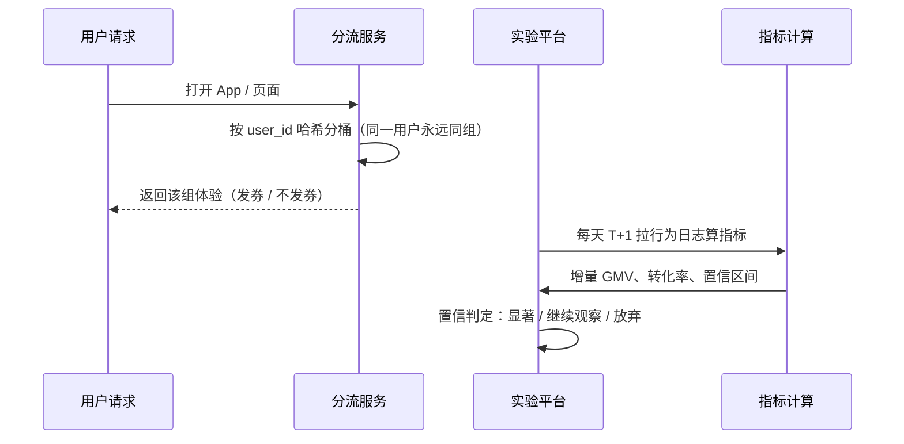
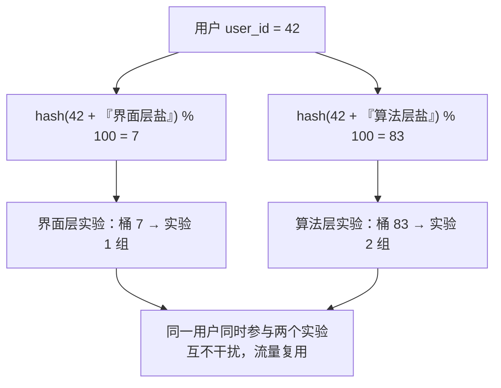
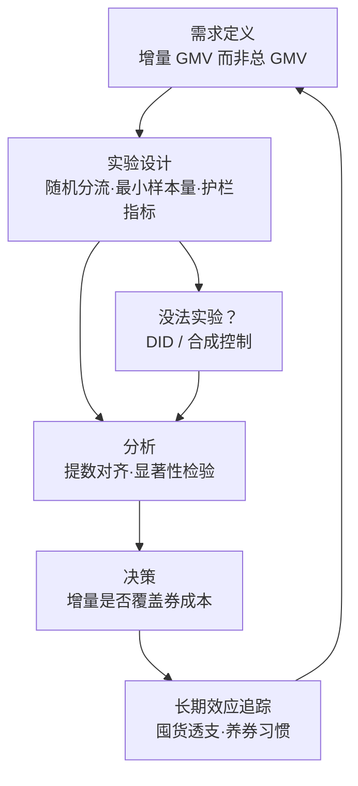

# 生产实战：投放效果评估的日常

> **一句话理解**：在大厂，因果推断最日常的形态不是高深模型，而是 A/B 实验平台——每一个"要不要发券、要不要改版"的决策，背后都是一场"随机分组、量化增量、显著性判定"的标准战役。

[⬆️ 返回总目录](../../../README.md) · [⬆️ 返回本篇](../README.md) · [⬅️ 返回本章目录](./README.md)

| 属性 | 说明 |
|------|------|
| 难度 | ⭐⭐ |
| 所属分支 | 因果 |
| 前置知识 | 本章全部正文 |

---

## 🏭 一个真实项目从 0 到 1

### 先看基础设施：A/B 实验平台是标配

互联网公司几乎都有一套**A/B 实验平台**：统一的分流服务（谁进实验组谁进对照组）、统一的指标计算（T+1 离线算好所有核心指标）、统一的置信判定（显著/不显著一键读数）。它就是上一章 RCT 理论的工程化身，也是推荐系统迭代的心脏（工程视角见[推荐系统的生产实战](../08-推荐系统/99-生产实战.md)）。运营、产品、算法同学每天的争论，最终多半变成一句话：**"上 AB 跑一下。"**

成熟平台的三条铁律（每一条都是血泪换的）：

- **分组要稳**：按 user_id 哈希分桶，同一用户永远同组——今天实验组明天对照组，体验精神分裂、数据自我污染；
- **读数前先验身**：SRM 检查不过（实际分组比例与设计不符），后面一切数字作废；
- **指标事前注册**：主指标、护栏指标、切片计划在实验开始前登记，防止事后"哪个显著报哪个"。

### ⚙️ 分流机制深化：哈希加盐与分层——为什么流量能"复用"

只有一个实验时，分流是朴素的：`hash(user_id) % 100` 得到桶号，0~49 进实验组、50~99 进对照组——同一 user_id 哈希结果永远相同，分组天然稳定。真正的工程难题是：**公司同时跑几百个实验，100% 的流量怎么够分？** 答案是"加盐 + 分层"：

| 机制 | 做什么 | 一句话原理 |
|------|--------|-----------|
| 哈希分桶 | user_id 过哈希函数映射到 0~99 桶 | 哈希像"洗牌但结果可复现"：同一人永远进同桶，不同人均匀散开 |
| 加盐（Salt） | 哈希时混入实验/层专属的盐值 | 换盐 = 换一副牌重新洗——**不同实验的分组结果互相独立**，这是"正交"的实现手段 |
| 层（Layer） | 把 100% 流量切成多层（界面层、算法层、价格层……），每层独立做一轮加盐哈希 | 同层内实验**互斥**（分掉层内不同桶段，不重叠）；跨层**正交**（各自独立随机化） |

> 👉 **人话**：为什么分层能复用流量而不互相污染？因为层与层的分组是**两次独立的随机化**——界面层把用户随机分成 A/B，算法层又完全独立地随机分了一次。从统计上看，"界面层的实验分组"与"算法层的实验分组"互不相关，等于两个各自干净的随机实验恰好共用同一批人。这本质上是因果教材里"分层随机化（Stratified Randomization）"思想在工程上的百万级放大。

### 假想项目：双 11 优惠券该不该发

以一个每年都会发生的真实场景走一遍全流程：大促前，运营提出"满 300 减 80"全量发券，老板问一句：**这券到底值不值？**

分阶段拆解（每个阶段说清"做什么、花多久、常见卡点"）：

- **需求定义**：和业务方把"值不值"翻译成可量化指标——**不是总 GMV**（含大量"不发券也会买"的人），而是**增量 GMV**（因券多出来的部分）与**净利润 = 增量 GMV × 毛利率 − 券核销成本**。这一步吵清楚能省掉后面一半返工，通常 1~2 周的会议拉锯。
- **实验设计**：人群随机分流（按 user_id 哈希分桶，保证同一用户永远同组）；按预期最小检出效应算最小样本量（手算见下方折叠框）；设**护栏指标**——退货率、毛利、客诉率、优惠券依赖度，任何一条亮红灯立即熔断。卡点：大促流量分秒必争，业务方最恨"拿 10% 用户做对照"，需要用历史数据说服。
- **没法实验时**：券已全量上线（业务等不了）→ 观测方法补救：找可比人群做 **DID**，或用未上线地区拼一个"合成对照"；最怕的是"全量 + 无对照"，神仙难算。
- **分析**：提数对齐（两组口径、时间窗、去重规则完全一致，看似废话、最常翻车）；做显著性检验（t 检验/Bootstrap）；按新老客、价格敏感度切异质性。1~2 天，主要是和数仓口径搏斗。
- **决策**：增量 GMV 折算毛利 > 券成本 → 全量；边缘情况看异质性——也许"只对新客发"是正解。结论要过评审会，避免"实验组赢了 0.1% 但 p=0.049 就敲锣"。
- **长期效应追踪**：券后 4~8 周观察"囤货透支"（大促买了、后面不买了）与"养券习惯"（无券不买）；大促的一次性增量可能被后续疲软吃掉一半。监控看板常驻，下届大促的基线就从这里来。

🧮 展开看：合成控制（Synthetic Control）什么时候出场

DID 需要一个现成的"可比对照组"；当处理对象是**一个省、一座城、一个产品线**，找不到第二个差不多的对照时，合成控制登场：拿若干个未处理单元加权拟合出一条"合成的前处理组"——比如用三个相邻省份的加权组合，在大促前完美拟合本省的销售轨迹，大促后"真实本省"与"合成本省"的裂口就是政策效应。

适用口诀：**处理单位只有一个、且处理前历史数据够长**（一般至少十几期）。DID 是"找一个像的对照"，合成控制是"亲手拼一个像的对照"——后者假设更重、故事更好讲，学术政策评估的常客。

🧮 展开手算：最小样本量怎么估

实验设计的标准问题：想可靠检出多大的提升？经验法则（检出功效 80%、显著性水平 5% 的双侧检验）：

$$
n_{每组} \approx \frac{16 \sigma^2}{\Delta^2}
$$

> 👉 **人话**：想看清的变化（Δ）越小、用户消费的波动（σ）越大，需要的样本就越多——而且分母是平方，"想看的效应减半"意味着"样本翻四倍"。

例：历史数据显示大促人均 GMV 约 400 元、标准差 σ ≈ 200 元；业务预期发券能拉动人均 Δ = 10 元。代入：16 × 200² ÷ 10² = 64 万 ÷ 100 = **每组 6400 人**。

每组 6400 人就能可靠检出 10 元的提升。注意公式的"杠杆"在分母：想检出 5 元的提升，样本要 ×4（每组 2.56 万）——**越想看清越小的效应，代价平方级增长**。这也解释了为什么"预期提升微小"的实验常常算出天文数字样本量，只能劝业务方放弃或放大改动幅度。

📋 展开一个真实的迭代故事：样本比例不匹配（SRM）翻车

一次发券实验读数：核心指标显著为正，全组欢腾。上线前例行检查分流完整性——设计上实验组与对照组是 1:1，实际日志里却是 49.7% : 50.3%，卡方检验 p < 0.001，**分流本身坏了**。

排查两天找到真凶：某个新增的运营入口**没接分流 SDK**，从那里进来的用户全被当成了对照组——而这批用户偏重度活跃。也就是说，对照组被"加重"了，实验组的胜利有一部分来自这个偏差而不是券。

修复入口、重跑一周，效应从 +2.8% 缩水到 +1.9%（仍然显著、仍然值得）。教训写成平台铁律：**读任何显著性之前，先过 SRM 检查；比例对不上，后面的 p 值再漂亮也是废纸。**

🧮 展开看：读数纪律——置信区间到底在说什么

实验报告上"增量 +2.0%，95% 置信区间 [0.3%, 3.7%]"这句话，正确的读法是三段：

1. **点估计 +2.0%**：我们猜效应就是这么大的量级——它几乎从来不是真值；
2. **区间 [0.3%, 3.7%]**：真值有 95% 的把握落在这个范围里。区间不跨 0（下界 > 0）才叫"显著为正"；
3. **决策要看区间，不只看中点**：若业务要求至少 +1.5% 才回本，而区间是 [0.3%, 3.7%]——下界低于回本线，说明"存在白忙活的可能"，全量决策要么加样本把区间收窄，要么接受风险。

两条高频读数错误：把"不显著"读成"无效"（只能说没测出来，效应可能藏着）；把"p 值很小"读成"效应很大"（p 只关于证据强度，与效应大小无关，效应大小看区间）。实验平台的读数培训，一半时间在纠正这两句。

## 🛡️ 读数之外的四大工程防线

实验平台的功力，一半在"跑实验"，另一半在"别被实验骗了"。四道标准防线：

### 防线一：SRM 检验的标准流程

样本比例失衡（Sample Ratio Mismatch）是"实验本身坏了"的警报。标准流程五步：

1. **设计登记**：分流比例（如 50/50）作为设计值写进平台配置，不可事后改；
2. **每日对账**：统计实际进入各组的样本数（注意用"进入实验"的口径，不是"产生行为"的口径）；
3. **卡方检验**：设计比例 vs 实际比例；**p < 0.001 报警**（大流量下 49.9/50.1 都会显著，所以阈值比 0.05 严得多——0.001 是行业经验值）；
4. **按清单排查**（高频真凶）：新增入口没接分流 SDK / 日志异步写入在某一侧被限流丢弃 / 爬虫与内部账号的过滤规则不对称 / 缓存让部分用户拿到旧分组 / 实验中途改过配置；
5. **铁律**：SRM 未通过，一切指标不读；修复后重跑完整实验周期，不存在"修一半接着读"。

### 防线二：溢出效应的识别与缓解

"独立分组"假设在社交与交易产品里常被现实击穿：拿到券的用户分享给对照组朋友、券拉动的需求抢走对照组的库存、口碑传播改变对照组行为——**效应被稀释或转移，估计系统性偏低**。

- **识别**：给对照组也埋"实验内容曝光率"指标（对照组里多少人实际看到了券/新版）；效应估计随曝光率变化的敏感度分析；地理维度上做空间自相关检查（对照组城市被处理组城市"传染"）。
- **缓解一句话**：**地理实验**——按城市整体随机（对照组城市完全不见策略）；**集群随机化**——按社交簇/家庭/学校整群分组，传染被锁在簇内；**长期隔离 holdout**——永久留一小撮（如 1%）不触达人群，作为长期效应的干净基准。

### 防线三：多重比较的校正

同时看 20 个指标，为什么总有一个显著？算一笔账：假设 20 个指标**全部真实无效应**，每个 p<0.05 的概率是 5%，则"至少一个显著"的概率：

$$
1 - 0.95^{20} \approx 64\%
$$

> 👉 **人话**：不校正地看 20 个指标，六成概率"纯靠运气"捞出显著；看 100 个指标，这个概率升到 99%。捞出来的那个"显著"，多半是运气在向你招手。

| 校正方法 | 做法 | 一句话点评 |
|----------|------|-----------|
| Bonferroni | 显著性阈值除以指标数 k（0.05/k） | 最简单最保守，指标一多就"什么都测不出" |
| BH-FDR（Benjamini-Hochberg） | 控制"错误发现率"——报出的显著里假阳性的期望比例 | 指标成百上千时的主流选择 |
| 层级检验（Gatekeeping） | 主指标先过，过了才有资格看次级；一级护一级 | 实验平台默认哲学：**结构比校正更治本** |

更根本的解法在流程：事前注册主指标与切片计划；事后发现的新"显著"只配当假设，留给下一轮实验验证。

### 防线四：护栏指标体系的设计原则

护栏（Guardrail Metrics）是"实验别把业务撞坏"的保险丝，设计五原则：

1. **分层设防**：商业护栏（毛利、退货、成本）+ 生态护栏（供需平衡、内容质量、商家生态）+ 体验护栏（延迟、崩溃率、客诉、留存），三类缺一不可；
2. **事前注册**：与主指标同日登记——上线后补的护栏，永远护不住已经发生的事故；
3. **自动熔断**：阈值触发即自动回滚/降级，不依赖人盯屏幕（人盯的熔断在半夜是不存在的）；
4. **不对称优先**：护栏红灯 > 主指标绿灯——宁可错过一次收益，不放过一次事故；
5. **护栏也要功效**：样本量设计须保证护栏指标同样检得出劣化，否则"没报警"只是"没测到"（功效直觉见[方法工具箱](./02-因果推断方法工具箱.md)）。

## 🧭 场景选型表

| 你的场景 | 推荐方法 | 理由 | 不推荐 |
|----------|----------|------|--------|
| 能随机分组（产品可灰度、券可选择性发） | RCT / A/B 实验 | 抽签平均掉一切混淆，最省心 | 拿观察数据硬算 |
| 政策统一上线、有可比对照（城市/人群） | DID | 前后 × 处理对照，扣掉自然增长 | 只比政策前后（忽略大盘增长） |
| 有天然分数线（会员线、录取线） | RD 断点回归 | 线两侧几乎同质，天然对比 | 按线两侧宽区间直接比较 |
| 关心"对谁有效"（广告该投给谁） | Uplift 建模 | 找出"被打动才买"的摇摆人群 | 全量投放 |
| 找得到只影响处理的外生变量 | IV 工具变量 | 借外生变动绕开后门 | 随便拿个变量当工具 |
| 只有历史日志、无法实验 | PSM / 合成控制 | 造双胞胎、拼合成对照 | 声称"精确因果"（假设背不动） |

## 🧰 真实工具链

| 环节 | 常用工具 | 一句话点评 |
|------|----------|-----------|
| 实验平台 | 自研平台为主；开源可参考 GrowthBook | 大厂标配；分流、读数、护栏一站式 |
| 分流验证 | 平台自带 SRM 检查 + 自查脚本 | 上线第一天先验证分桶比例，再谈指标 |
| 因果分析框架 | DoWhy | 画因果图 + 假设检验 + 效应估计的瑞士军刀 |
| 异质性/Uplift | EconML、CausalML | 微软两件套，Uplift 树、元学习器都有现成实现 |
| 计量基本功 | statsmodels | DID、回归、假设检验的轻量首选 |
| 探索分析 | pandas + notebook | 90% 的日常是提数、对齐口径、画趋势图 |

## 💣 踩坑实录

- **坑 1：样本比例不匹配（SRM）**：设计 50/50，实际 49.7/50.3，说明分流漏了入口或日志丢了事件——组间差异带着系统性偏差。→ 标准流程五步见上文防线一；比例不对，一切显著作废。
- **坑 2：网络溢出效应**：拿到券的用户把券分享给对照组的朋友、或者券拉动的需求抢走了对照组的库存——用户互相影响，"独立分组"被污染，效应被低估。→ 地理实验 / 集群随机化 / 隔离 holdout，见上文防线二。
- **坑 3：平均效应掩盖异质性**：整体 +1.5% 不显著，切开看新客 +12%（显著）、老客 −4%——全量上或全量毙都错。→ 核心实验必做异质性切片，答案常在分层里（[方法工具箱](./02-因果推断方法工具箱.md)的 CATE 与 Uplift 四象限）。
- **坑 4：多重比较捞显著**：指标 × 人群切片 × 时间窗，试出 50 个 p 值，总有几个 < 0.05——纯运气（概率算给过你看：64%）。→ 事前注册 + Bonferroni/BH-FDR/层级检验，见上文防线三；事后发现的"显著"只配当假设。
- **坑 5：新奇效应（Novelty Effect）**：改版后指标涨了，其实只是用户觉得"新鲜"；三周后回落，长期看是平的。→ 新功能实验至少跑满 1~2 个用户行为周期再读数，或设"新鲜期衰减"观察点。

## 🗣️ 炼丹师大实话

> "A/B 实验平台上跑的十个实验，总有一两个的显著是运气——所以要看长期与重复。"

---

[⬅️ 上一页：因果推断方法工具箱](./02-因果推断方法工具箱.md) · [返回本章目录](./README.md) · [下一页：第 12 章：生成模型与多模态 ➡️](../../5-前沿与融合/12-生成模型与多模态/README.md)
