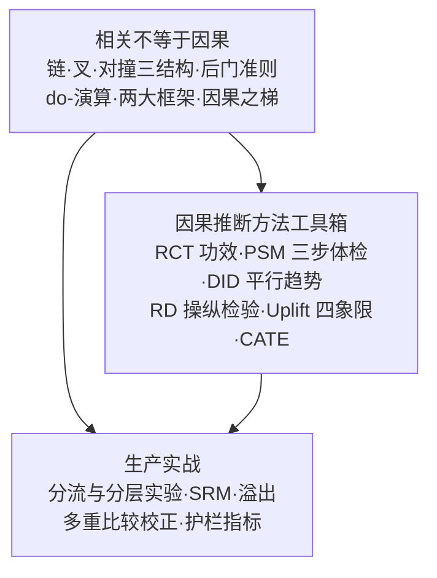

# 第 11 章：因果推断 🔍（归因）

> 机器学习擅答"是什么"：销量和什么相关、明天卖多少、这个用户会不会买。但业务里更贵的问题是"为什么"与"如果做会怎样"：**投放广告带来了多少增量销量？** 预测模型答不了这个问题——它只能告诉你"投了广告的城市销量高"，不能告诉你"不投会不会一样高"。因果推断（Causal Inference）就是回答"做了 X 到底有没有用"的学问：从相关走向干预，再走向反事实。本章统计味稍重，但会用大白话和小数字例子把每一步落到地面。

[⬆️ 返回总目录](../../../README.md) · [⬆️ 返回本篇](../README.md)

## 🗺️ 本章知识树

## 📖 推荐阅读顺序

| 顺序 | 页面 | 难度 | 一句话说明 |
|------|------|------|-----------|
| 1 | [相关不等于因果](./01-相关不等于因果.md) | ⭐⭐⭐ | 为什么相关会骗人：混淆变量、辛普森悖论；因果图三把钥匙（链/叉/对撞）、后门准则、do-演算与两大框架 |
| 2 | [因果推断方法工具箱](./02-因果推断方法工具箱.md) | ⭐⭐⭐⭐ | 从金标准 RCT（统计功效直觉）到观察数据四件套：PSM 三步体检、DID 平行趋势与事件研究图、RD 操纵检验、IV；Uplift 四象限与 CATE |
| 3 | [进阶专题：因果机器学习](./03-进阶专题-因果ML.md) | ⭐⭐⭐⭐ | 因果与 ML 的会师：Double ML（残差化 + 交叉拟合）、CATE 与因果森林、Uplift 全栈（标签构造/校准/在线闭环）、E-value 敏感性分析、因果发现的等价类边界 |
| 收官 | [生产实战](./99-生产实战.md) | ⭐⭐ | 投放效果评估的日常：A/B 平台从 0 到 1，分流与分层实验、SRM 标准流程、溢出、多重比较校正与护栏指标四大防线 |

## 🎯 读完本章你应该能

- 分清"预测问题"与"决策/归因问题"，说清为什么预测模型回答不了"要不要投广告"
- 识别混淆变量与辛普森悖论，用分组把一条"假相关"打回原形
- 用链、叉、对撞三个基本结构判断"控制一个变量"是救命还是闯祸（"演员颜值与演技负相关"是怎么被筛出来的）
- 讲清因果之梯三级——关联（看见）、干预（做到）、反事实（想象）——以及后门准则一句话规则与 do-演算三规则的分工
- 按场景选对方法并知道各自的体检动作：能随机就 RCT（先算功效）；DID 看平行趋势；PSM 过三步体检；RD 查操纵；关心"对谁有效"用 Uplift/CATE
- 看懂一张 A/B 实验报告，说清分层实验为什么能复用流量，避开 SRM、溢出、多重比较这些高频大坑

## 🧭 怎么读本章

本章正文共三节，但每一节都建议动笔算——所有例子都控制在 8 个城市、4 个格子这样的规模，手算完全可行；两个大推导（相关系数、DID 回归）都在正文里走完了数字，进阶推导放折叠框按需展开。统计底子薄的读者可先回看[概率与统计](../../1-起步准备/02-数学基础/04-概率与统计.md)中的期望、方差与假设检验部分。如果工作中要做实验，[推荐系统的生产实战](../08-推荐系统/99-生产实战.md)里的 AB 实验内容与本章收官页互为呼应。

## 🧩 提前认个脸：本章高频词

| 术语 | 一句话人话 |
|------|-----------|
| 混淆变量（Confounder） | 同时影响 X 和 Y 的幕后第三者（夏天）——叉结构 |
| 链 / 叉 / 对撞 | 因果图三结构：中介（控制即掐断）、混淆（必须控制）、共同结果（控制即自造偏倚） |
| 对撞偏倚（Berkson 悖论） | 按共同结果筛样本，凭空造出负相关（颜值与演技） |
| 辛普森悖论 | 分组结论与总体结论完全反转 |
| 因果之梯 | 关联（看见）→ 干预（做到）→ 反事实（想象）三级台阶 |
| do 算子 | P(Y\|X) 是"看到"，P(Y\|do(X)) 是"强行设定" |
| 后门准则 | 堵住所有射入 X 的假通道、别碰 X 的后代 |
| ATE / CATE | 平均处理效应 / 条件（子群体）平均处理效应 |
| Uplift 四象限 | 可说服者才值得投；铁定买与无效人群白投；睡眠狗投了有害 |
| 平行趋势 | DID 的命门：没政策时两组本该同斜率增长 |
| SRM | 样本比例失衡：分流坏了，一切读数作废 |

## ❓ 学前三问

- **"我又不做学术研究，学因果干嘛？"**——互联网公司一半的决策问题（要不要发券、改版有没有用、广告带来多少增量）本质都是因果问题；A/B 实验就是它的工业形态。
- **"预测模型不也能指导决策吗？"**——预测回答"会怎样"，因果回答"做了会怎样"；拿预测当因果做决策，是业务里最贵的错误之一（第 1 节有真实剧本）。
- **"统计不好能读吗？"**——能。本章所有数字例子都在两位数以内，公式每个都配人话；需要补课时回看第 2 章即可。

## 🔗 与其他章节的关系

- **前置章节**：[概率与统计](../../1-起步准备/02-数学基础/04-概率与统计.md)——期望、方差、假设检验是本章的通用货币。
- **后续章节**：[第 12 章：生成模型与多模态](../../5-前沿与融合/12-生成模型与多模态/README.md)——回到全书主线；因果思想也会在模型评估与可信 AI 里反复出现。
- **横向呼应**：[推荐系统的生产实战](../08-推荐系统/99-生产实战.md)——A/B 实验平台是因果思想在大厂最大规模的落地现场，两章对照着读收获最大；[第 6 章时间序列](../06-时间序列/README.md)预测"会怎样"，本章回答"做了会怎样"，一对好搭档。

---

[⬅️ 上一章：第 10 章：强化学习](../10-强化学习/README.md) · [返回总目录](../../../README.md) · [下一章：第 12 章：生成模型与多模态 ➡️](../../5-前沿与融合/12-生成模型与多模态/README.md)
