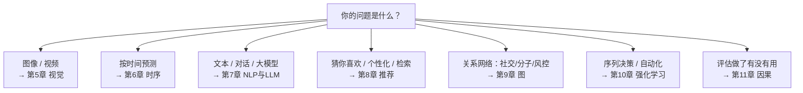

# 第四篇 · 专业方向 🌐

> **七个方向，七种能力：看见、预知、读写、匹配、关系、决策、归因。** 它们彼此独立、平行展开，按兴趣或需要选读一两个即可；排序本身就是一条认知递进线——从感知世界，到理解语言，到连接人与物，到做出决策，再到追问原因。

[⬆️ 返回总目录](../../README.md)

## 📑 本篇包含的章节

| 章 | 标题 | 能力 | 一句话定位 |
|----|------|------|-----------|
| 5 | 👁️ [计算机视觉](./05-计算机视觉/README.md) | 看见 | CNN、检测分割、ViT——让机器读懂图像 |
| 6 | 📈 [时间序列](./06-时间序列/README.md) | 预知 | ARIMA、RNN/LSTM、现代时序模型——让机器预测未来 |
| 7 | 💬 [NLP 与大语言模型](./07-自然语言处理与LLM/README.md) | 读写 | 词向量、Transformer、LLM、对齐、RAG/Agent——让机器理解与生成语言 |
| 8 | 🛍️ [推荐系统](./08-推荐系统/README.md) | 匹配 | 协同过滤、矩阵分解、双塔召回、排序模型——让机器连接人与物 |
| 9 | 🕸️ [图神经网络](./09-图神经网络/README.md) | 关系 | 消息传递、GCN/GAT——让机器理解"连接" |
| 10 | 🎮 [强化学习](./10-强化学习/README.md) | 决策 | MDP、Q-Learning、DQN/PPO——让机器在试错中学会行动 |
| 11 | 🔍 [因果推断](./11-因果推断/README.md) | 归因 | 因果之梯、DID、因果发现——让机器分清"相关"与"因为" |

## 🧭 怎么选方向

**一条暗线：向量（embedding）贯穿多个方向**——词向量（第 7 章）→ 双塔召回（第 8 章）→ RAG 检索（第 7 章）→ 多模态对齐（第 12 章），学到后面会发现它们是同一件事：把万物变成向量，再用向量找相似。

常见组合：大模型方向 = 第 7 章 + 第五篇；搜索/推荐 = 第 8 + 9 章；业务预测 = 第 6 + 11 章；智能体 = 第 7 + 10 章。

## 🔗 在全书中的位置

- **上承**：[第三篇 · 深度学习](../3-深度学习/README.md)——七个方向全部建立在第 4 章的地基上（含分布式与部署）。
- **下启**：[第五篇 · 前沿与融合](../5-前沿与融合/README.md)——当方向之间开始融合（图文、语音、生成），就进入了前沿地带。

---

[⬆️ 返回总目录](../../README.md)
