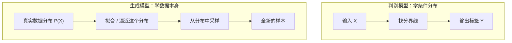
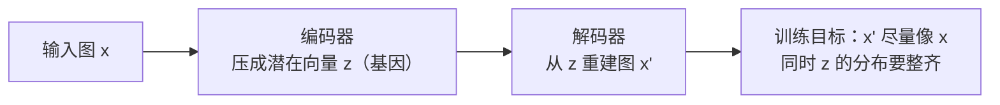

# 生成模型全景

> **一句话理解**：判别模型学"给答案打分"的规律 $P(Y|X)$，生成模型学"世界本身长什么样"的分布 $P(X)$——学会了分布，就能从中采样（Sampling），无中生有地造出训练集里没有的新样本。

[⬆️ 返回总目录](../../../README.md) · [⬆️ 返回本篇](../README.md) · [⬅️ 返回本章目录](./README.md)

| 属性 | 说明 |
|------|------|
| 难度 | ⭐⭐⭐⭐（高阶） |
| 所属分支 | 生成与多模态 |
| 前置知识 | [概率与统计](../../1-起步准备/02-数学基础/04-概率与统计.md)；[神经网络是怎么炼成的](../../3-深度学习/04-深度学习基础/01-神经网络是怎么炼成的.md) |

---

## 📌 这一节解决什么问题

到上一章为止，我们训练的模型几乎都在做"选择题"和"填空题"：这张图是不是猫（分类）、这套房卖多少钱（回归）、用户会不会点击（排序）。它们的共同点是**只判断、不创造**——你给它一个输入，它吐出一个标签或数值，仅此而已。

但很多任务天然需要"创造"：设计同学想要一张"赛博朋克风格的眼镜广告图"，游戏需要上千张不重复的贴图，运营需要一段活动文案的开头。这类任务没有"输入 → 标签"可言，需要的是能**自己产出新内容**的模型。

思路上的跨越是：与其学"给定 X 预测 Y"，不如学**数据本身的分布**——见过 10 万张猫图之后，把"猫图在像素空间里的概率分布"学到手，再从这个分布里采样，就能得到全新的猫图。本节把"生成"的数学含义、VAE 的关键细节、四大流派的版图一次铺开，为后面三页深挖打地基。

## 🌱 通俗理解

把判别模型想象成**质检员**，把生成模型想象成**工匠**：

- 质检员只需知道"合格线在哪"——猫和狗的分界线画对了，工作就完成了。它从不需要知道一只猫的胡须有几根、耳朵怎么转折；
- 工匠要**亲手造出产品**，就必须见过足够多的真品：整体的轮廓、局部的纹理、颜色怎么搭配……任何一处没学到，造出来就是怪的。

这解释了为什么生成远比判别难：判别只需要一条分界线，生成要**记住整个世界的样子**。学生刷题（判别）只要会选答案，而出题老师（生成）得把整门课的知识融会贯通，才能出一道数字合理、逻辑自洽的新题。

另一个关键直觉：**生成 = 学会从分布中抽样**。世界上"可能的猫图"有无数张，它们在像素空间里构成一团"云"。生成模型不是抄训练集，而是把这片云的形状摸清楚，然后往云里"扔飞镖"——每次落点都是一张新的猫图。

## 📋 举个例子

任务：**画一只猫**。四大流派的策略一句话对比：

| 流派 | 画猫策略（一句话） |
|------|--------------------|
| 自回归 | 从第一个像素/第一个字开始"接龙"，画完一个再画下一个，一个个蹦出来 |
| VAE | 把猫图压缩成一份"基因"，新猫 = 在基因上做微调后再解码出来 |
| GAN | 一个画师拼命画猫骗鉴定师，鉴定师拼命挑刺，两边互相逼强 |
| Diffusion | 从一团纯噪声开始，按"去掉一点噪声"的工序循环几十次，猫慢慢浮现 |

四种策略殊途同归：都是让模型输出的样本"落在真实猫图分布的云里"。

<details>
<summary>📊 展开：2 维玩具数据的"学分布"可视化思路</summary>

图像太高维，没法直接画。用 2 维数据把"生成 = 学分布"看清楚：

1. **看数据**：收集 500 个 2 维点，比如"用户的身高体重"散点图——点云呈一个斜着的椭圆；
2. **直方图/密度图**：把平面切成小格子统计落点数，颜色深浅就是密度的粗略估计——这就是对分布最朴素的"学习"；
3. **参数化拟合**：用一个 2 维高斯分布去拟合点云，估出均值（椭圆中心）和协方差（椭圆的朝向与胖瘦）；
4. **生成**：从拟合出的高斯里采样 10 个新点——它们大概率落在椭圆内，且不在原始 500 个点里。

第 4 步就是"生成"：**新样本既像训练数据（在云里），又不是抄训练数据（不是旧点）**。后面四页的所有模型，本质上都在把这个思路推广到几百万维的图像空间。

</details>

## 🧠 核心原理

### 整体流程



### 逐步拆解

**1. 判别 vs 生成：学的目标不一样**

$$
\text{判别：学 } P(Y \mid X) \qquad \text{生成：学 } P(X) \text{ 或联合分布 } P(X, Y)
$$

> 👉 **人话**：判别模型学"看到这张图时，它是猫的概率"；生成模型学"一张猫图本身出现的概率"。前者只要猫和狗之间那条分界线，后者要把猫图的分布整个描出来——这就是"生成要记住整个世界"的数学说法。

**2. 自回归（Autoregressive）生成：接龙也是生成**

$$
P(x_1, x_2, \dots, x_n) = \prod_{i=1}^{n} P(x_i \mid x_1, \dots, x_{i-1})
$$

> 👉 **人话**：把"生成一整段内容"拆成接龙游戏——每次只预测下一个 token（或下一个像素），预测完拼回去，再预测下一个。链式法则把一个巨大的联合分布拆成了一串好学的小问题。**LLM 逐 token 写作干的就是这件事**——所以别以为生成模型只有画图的，写作的 LLM 也是如假包换的生成模型。

**3. VAE（变分自编码器，Variational Autoencoder）：压缩成"基因"再重建**



- **编码器**把图压缩成潜在空间（Latent Space）里的一个向量，好比把一只猫压缩成一份"基因"；**解码器**从"基因"重建出猫。生成时，从整齐的潜空间随机抽一份"基因"喂给解码器，就得到一只新猫；
- **重参数化（Reparameterization）一句话**：从分布里采样这步不可导，于是把随机性挪到输入端——写成 $z = \mu + \sigma \odot \epsilon$（$\epsilon$ 是随机噪声），梯度就能顺着这条"绕开采样"的路反向传播；
- 训练目标是证据下界（ELBO，Evidence Lower Bound）：

$$
\mathcal{L}_{\text{ELBO}} = \mathbb{E}_{q(z \mid x)}\big[\log p_\theta(x \mid z)\big] - D_{\mathrm{KL}}\big(q(z \mid x) \,\|\, p(z)\big)
$$

> 👉 **人话**：这个公式一边要求"重建要像"（第一项：解码出来的图得像原图），一边要求"潜空间要整齐"（第二项 KL 项：每个样本的基因都要往同一个标准正态分布靠拢，不然潜空间乱成一团没法采样）。只顾重建，采样时抽到的基因 decode 不出东西；只顾整齐，重建会变糊。**VAE 生成偏模糊，正是这个折中的代价。**

**4. 四流派总览对比**

| 流派 | 直觉原理 | 优点 | 缺点 | 代表应用 |
|------|----------|------|------|----------|
| 自回归 | 接龙：逐 token/像素预测下一个 | 概率意义清晰、可算似然 | 串行生成慢、误差会累积 | LLM 文本生成 |
| VAE | 压缩成基因再解码 | 训练稳定、潜空间可插值 | 生成偏模糊 | 表征学习、Stable Diffusion 的压缩组件 |
| GAN | 造假者与鉴定师对抗 | 生成锐利逼真 | 难训练、模式崩塌 | 老照片修复、超分、换脸 |
| Diffusion | 加噪再学着去噪 | 训练稳定、多样性好 | 采样步数多、慢 | 文生图、视频生成 |

## 💻 动手试试

最朴素的生成模型：用 numpy 拟合一个 2 维高斯，再从中采样"生成"新样本。

```python
import numpy as np

rng = np.random.default_rng(42)

# 目标分布：一个"斜着的 2 维高斯"数据世界（模拟真实数据）
true_mu = np.array([2.0, 1.0])
true_cov = np.array([[1.0, 0.8],
                     [0.8, 1.0]])
X = rng.multivariate_normal(true_mu, true_cov, size=500)  # 500 个"真实样本"

# 学习：2 维高斯的极大似然估计有解析解——样本均值和样本协方差
mu_hat = X.mean(axis=0)
cov_hat = np.cov(X.T)
print("估计均值:", np.round(mu_hat, 3))          # 约等于 [2.0, 1.0]
print("估计协方差:\n", np.round(cov_hat, 3))      # 约等于 [[1, 0.8], [0.8, 1]]

# 生成：从学到的分布里采样，得到训练集里没有的"新样本"
samples = rng.multivariate_normal(mu_hat, cov_hat, size=5)
print("生成的 5 个新样本:\n", np.round(samples, 3))
# 每次运行结果都不同——因为"生成"本质是从分布中抽样
```

预期输出：估计均值约 `[2.0, 1.0]`，生成的 5 个新样本散落在原点云附近，但和 500 个原始点不完全重合。深度生成模型（VAE/GAN/Diffusion）干的是同一件事，只是把"高斯拟合"换成了神经网络，把 2 维换成了几百万维。

## 🔗 在知识树中的位置

- **上游**：[概率与统计](../../1-起步准备/02-数学基础/04-概率与统计.md)——分布、采样是本页的语言；[神经网络是怎么炼成的](../../3-深度学习/04-深度学习基础/01-神经网络是怎么炼成的.md)——所有流派的拟合引擎；
- **下游**：[对抗生成网络GAN](./02-对抗生成网络GAN.md)、[扩散模型Diffusion](./03-扩散模型Diffusion.md)、[多模态模型](./04-多模态模型.md)——三页分别深挖三大流派与跨模态扩展；
- **横向对比**：[大语言模型LLM全景](../../4-专业方向/07-自然语言处理与LLM/04-大语言模型LLM全景.md)——自回归路线在文本侧的集大成者，与图像侧三流派并列。

## ⚠️ 常见误区

- **误区一**：生成模型就是"画图的模型" → 文本 LLM 逐 token 写作、语音合成、分子设计都是生成模型，模态不重要，"学 P(X) 并采样"才重要；
- **误区二**：生成 = 从训练集里抄一张最像的 → 生成是按学到的分布**采样**，可以产生训练集里从未出现过的样本（就像高斯拟合后采出的新点不是旧点）；
- **误区三**：VAE 生成模糊是训练不到家 → 模糊是"重建像"与"潜空间整齐"两个目标折中的固有代价，不是简单的训练问题。

## 📝 小结与自测

**要点回顾**

- 判别学 $P(Y|X)$，生成学 $P(X)$；生成更难，因为要记住整个世界的样子；
- 自回归用链式法则把生成拆成接龙，LLM 是其代表；
- VAE 压缩成"基因"再重建，ELBO = 重建像 + 潜空间整齐的折中；
- 四流派各有优劣：自回归可算似然、GAN 锐利难训、Diffusion 稳步但慢、VAE 稳但糊。

**自测一下**（点击展开答案）

<details>
<summary>问题 1：为什么说"生成比判别难"？（用分布的语言回答）</summary>

判别只需学猫和狗之间的**分界线**（P(Y|X)），生成要学**整个数据分布**（P(X)）——相当于把"所有可能的猫长什么样"整体建模，信息量和难度都大得多。

</details>

<details>
<summary>问题 2：ELBO 的两项各在管什么？它们为什么"打架"？</summary>

第一项（重建项）要求解码出来的图像原图，倾向于让每个样本的"基因"各占一角以保留细节；第二项（KL 项）要求所有"基因"挤在标准正态附近，方便采样。一个要分开、一个要挤拢，所以是折中——VAE 的模糊感即来源于此。

</details>

## 📚 延伸阅读

- 论文：Kingma & Welling, *Auto-Encoding Variational Bayes*（2014）——VAE 开山之作，[arXiv:1312.6114](https://arxiv.org/abs/1312.6114)
- 论文：Goodfellow et al., *Generative Adversarial Nets*（2014）——GAN 开山之作（下一页主角），[arXiv:1406.2661](https://arxiv.org/abs/1406.2661)
- 博客：Lilian Weng, *From Autoencoder to Beta-VAE*——变分自编码器图解，[lilianweng.github.io](https://lilianweng.github.io/posts/2018-08-12-vae/)

---

[⬅️ 上一页：本章导览](./README.md) · [返回本章目录](./README.md) · [下一页：对抗生成网络GAN ➡️](./02-对抗生成网络GAN.md)
