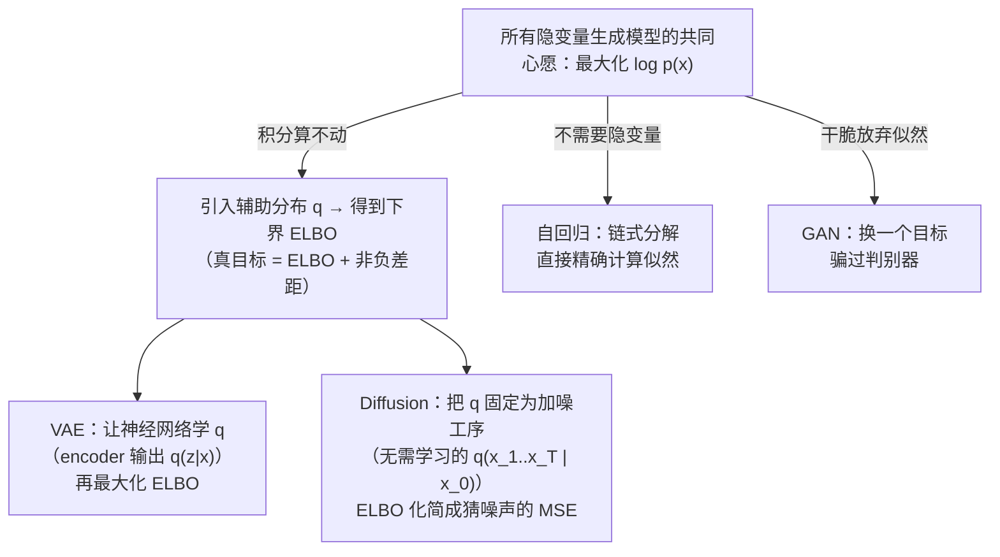

# 生成模型全景

> **一句话理解**：判别模型学"给答案打分"的规律 $P(Y|X)$，生成模型学"世界本身长什么样"的分布 $P(X)$——学会了分布，就能从中采样（Sampling），无中生有地造出训练集里没有的新样本。

[⬆️ 返回总目录](../../../README.md) · [⬆️ 返回本篇](../README.md) · [⬅️ 返回本章目录](./README.md)

| 属性 | 说明 |
|------|------|
| 难度 | ⭐⭐⭐⭐（高阶） |
| 所属分支 | 生成与多模态 |
| 前置知识 | [概率与统计](../../1-起步准备/02-数学基础/04-概率与统计.md)；[神经网络是怎么炼成的](../../3-深度学习/04-深度学习基础/01-神经网络是怎么炼成的.md) |

---

## 📌 这一节解决什么问题

到上一章为止，我们训练的模型几乎都在做"选择题"和"填空题"：这张图是不是猫（分类）、这套房卖多少钱（回归）、用户会不会点击（排序）。它们的共同点是**只判断、不创造**——你给它一个输入，它吐出一个标签或数值，仅此而已。

但很多任务天然需要"创造"：设计同学想要一张"赛博朋克风格的眼镜广告图"，游戏需要上千张不重复的贴图，运营需要一段活动文案的开头。这类任务没有"输入 → 标签"可言，需要的是能**自己产出新内容**的模型。

思路上的跨越是：与其学"给定 X 预测 Y"，不如学**数据本身的分布**——见过 10 万张猫图之后，把"猫图在像素空间里的概率分布"学到手，再从这个分布里采样，就能得到全新的猫图。本节做四件事：把"生成"的数学含义说清、把 VAE 的两个关键机制（重参数化、ELBO）讲透、给出一个**统一视角**——VAE 和 Diffusion 其实都在优化同一个东西（证据下界 ELBO），最后把四大流派的版图与"生成路径"一次铺开，为后面三页深挖打地基。

## 🌱 通俗理解

把判别模型想象成**质检员**，把生成模型想象成**工匠**：

- 质检员只需知道"合格线在哪"——猫和狗的分界线画对了，工作就完成了。它从不需要知道一只猫的胡须有几根、耳朵怎么转折；
- 工匠要**亲手造出产品**，就必须见过足够多的真品：整体的轮廓、局部的纹理、颜色怎么搭配……任何一处没学到，造出来就是怪的。

这解释了为什么生成远比判别难：判别只需要一条分界线，生成要**记住整个世界的样子**。学生刷题（判别）只要会选答案，而出题老师（生成）得把整门课的知识融会贯通，才能出一道数字合理、逻辑自洽的新题。

另一个关键直觉：**生成 = 学会从分布中抽样**。世界上"可能的猫图"有无数张，它们在像素空间里构成一团"云"。生成模型不是抄训练集，而是把这片云的形状摸清楚，然后往云里"扔飞镖"——每次落点都是一张新的猫图。

还有一个贯穿后面三页的直觉：**四大流派不是四门互不相干的手艺，而是一家人**。它们都想"把数据分布学到手"，其中 VAE 和 Diffusion 连"怎么学"的理论依据都是同一个——找一个算得动的下界（ELBO）去逼近算不动的真目标。本页"核心原理"第 4 节会把这条血缘线用公式缝起来，那是全章最重要的一张知识网。

## 📋 举个例子

任务：**画一只猫**。四大流派的策略一句话对比：

| 流派 | 画猫策略（一句话） |
|------|--------------------|
| 自回归 | 从第一个像素/第一个字开始"接龙"，画完一个再画下一个，一个个蹦出来 |
| VAE | 把猫图压缩成一份"基因"，新猫 = 在基因上做微调后再解码出来 |
| GAN | 一个画师拼命画猫骗鉴定师，鉴定师拼命挑刺，两边互相逼强 |
| Diffusion | 从一团纯噪声开始，按"去掉一点噪声"的工序循环几十次，猫慢慢浮现 |

四种策略殊途同归：都是让模型输出的样本"落在真实猫图分布的云里"。

<details>
<summary>📊 展开：2 维玩具数据的"学分布"可视化思路</summary>

图像太高维，没法直接画。用 2 维数据把"生成 = 学分布"看清楚：

1. **看数据**：收集 500 个 2 维点，比如"用户的身高体重"散点图——点云呈一个斜着的椭圆；
2. **直方图/密度图**：把平面切成小格子统计落点数，颜色深浅就是密度的粗略估计——这就是对分布最朴素的"学习"；
3. **参数化拟合**：用一个 2 维高斯分布去拟合点云，估出均值（椭圆中心）和协方差（椭圆的朝向与胖瘦）；
4. **生成**：从拟合出的高斯里采样 10 个新点——它们大概率落在椭圆内，且不在原始 500 个点里。

第 4 步就是"生成"：**新样本既像训练数据（在云里），又不是抄训练数据（不是旧点）**。后面四页的所有模型，本质上都在把这个思路推广到几百万维的图像空间。

顺带看清一个"失败情形"：如果第 3 步拟合时协方差估得过大（把椭圆画得太胖），采出的新点就会飘到点云外的空白区——"生成得像不像"完全取决于"分布学得准不准"，后面每一页的失败模式分析，归根到底都是这个问题在高维空间里的各种变体。

</details>

## 🧠 核心原理

### 整体流程


### 逐步拆解

**1. 判别 vs 生成：学的目标不一样**

$$
\text{判别：学 } P(Y \mid X) \qquad \text{生成：学 } P(X) \text{ 或联合分布 } P(X, Y)
$$

> 👉 **人话**：判别模型学"看到这张图时，它是猫的概率"；生成模型学"一张猫图本身出现的概率"。前者只要猫和狗之间那条分界线，后者要把猫图的分布整个描出来——这就是"生成要记住整个世界"的数学说法。

**2. 自回归（Autoregressive）生成：链式分解 + 接龙也是生成**

$$
P(x_1, x_2, \dots, x_n) = \prod_{i=1}^{n} P(x_i \mid x_1, \dots, x_{i-1})
$$

> 👉 **人话**：把"生成一整段内容"拆成接龙游戏——每次只预测下一个 token（或下一个像素），预测完拼回去，再预测下一个。链式法则把一个巨大的联合分布拆成了一串好学的小问题。**LLM 逐 token 写作干的就是这件事**——所以别以为生成模型只有画图的，写作的 LLM 也是如假包换的生成模型。

这个分解有两个值得记住的性质，它们解释了 LLM 的很多行为：

- **它是精确分解，不是近似**。链式法则是概率的恒等式，每一项都是一个普通的"多分类"问题（在词表里选下一个词）。所以自回归模型能直接计算任何样本的似然 $P(x)$——LLM 汇报的困惑度（Perplexity）就是由它算出来的。后面会看到：VAE/Diffusion 只能优化似然的下界，GAN 干脆不算似然——**能"报准数"是自回归的独家优势**；
- **代价是串行与误差累积**。第 $i$ 步吃的是前 $i-1$ 步自己生成的结果，一步走偏，后面步步都在"错误的上下文"里继续——这就是长文生成里"越写越跑题"的结构性根源（训练时喂真前文、推理时喂自己生成的前文，两者分布不一致，业内称曝光偏差，Exposure Bias）。

<details>
<summary>🧮 展开手算：3 个 token 句子的链式概率与困惑度</summary>

假设一个小模型的词表概率如下（数字为示意）：

- $P(\text{我}) = 0.20$（句首最常见词之一）
- $P(\text{爱} \mid \text{我}) = 0.30$（"我爱"是高频搭配）
- $P(\text{猫} \mid \text{我 爱}) = 0.10$（下一个词其实还可能是"你/吃/学习"）

整句概率按链式分解相乘：

$$
P(\text{我爱猫}) = 0.20 \times 0.30 \times 0.10 = 0.006
$$

换成"每步平均不确定度"来读：每 token 平均负对数似然 $= -\frac{1}{3}\ln(0.006) \approx 1.71$，困惑度 $= e^{1.71} \approx 5.5$。

👉 **人话**：这个模型每写一个字，平均在约 5.5 个"候选"里犹豫——困惑度就是"平均选择题的选项数"。数字越小，模型对你的句子越"笃定"。LLM 评测里报的 Perplexity 就是这个量的放大版，它之所以能被精确计算，靠的正是链式分解"每一步都是普通分类"这条性质。

</details>

**3. VAE（变分自编码器，Variational Autoencoder）：压缩成"基因"再重建**


- **编码器**把图压缩成潜在空间（Latent Space）里的一个向量，好比把一只猫压缩成一份"基因"；**解码器**从"基因"重建出猫。生成时，从整齐的潜空间随机抽一份"基因"喂给解码器，就得到一只新猫；
- **重参数化（Reparameterization）一句话**：从分布里采样这步不可导，于是把随机性挪到输入端——写成 $z = \mu + \sigma \odot \epsilon$（$\epsilon$ 是随机噪声），梯度就能顺着这条"绕开采样"的路反向传播。完整推导见下方折叠框——**为什么"必须有它"是理解 VAE 训练的第一道坎**；
- 训练目标是证据下界（ELBO，Evidence Lower Bound）：

$$
\mathcal{L}_{\text{ELBO}} = \underbrace{\mathbb{E}_{q(z \mid x)}\big[\log p_\theta(x \mid z)\big]}_{\text{重构项：解码出来的要像}} \; - \; \underbrace{D_{\mathrm{KL}}\big(q(z \mid x) \,\|\, p(z)\big)}_{\text{KL 项：潜空间要整齐}}
$$

> 👉 **人话**：这个公式一边要求"重建要像"（重构项：解码出来的图得像原图），一边要求"潜空间要整齐"（KL 项：每个样本的基因都要往同一个标准正态分布靠拢，不然潜空间乱成一团没法采样）。只顾重建，采样时抽到的基因 decode 不出东西；只顾整齐，重建会变糊。**VAE 生成偏模糊，正是这个折中的代价。**

两项各自的"失调症状"对照（诊断 VAE 的第一张表）：

| 症状 | 读数 | 病因 | 补救方向 |
|------|------|------|----------|
| 重建清晰，但从先验 $\mathcal{N}(0,I)$ 采样的 $z$ 解码出一团糊/怪图 | 重构项低、KL 项趋近 0 附近但不为 0 | KL 约束太弱：潜空间有"洞"——训练过的 $q(z\mid x)$ 覆盖区之外全是未开垦的荒地，先验采样落在荒地上 | 加大 KL 权重（β-VAE 的 $\beta > 1$ 方向） |
| 重建与采样都糊、细节抹平 | 两项都低但整体相似度过高 | KL 约束太强：后验被压平，编码器传不进足够信息 | 减小 $\beta$，或提高模型容量 |
| 重构不如普通自编码器，采样却也不稳定 | KL 项剧烈震荡 | 容量不足时两项"抢地盘" | 先加大网络，再谈权重 |
| KL 项精确等于 0 | 解码器完全不看 $z$ | 后验坍缩（Posterior Collapse）：KL 项把 $q(z\mid x)$ 压得和先验一模一样，$z$ 里不再有关于这张图的任何信息 | 退化 KL（free bits）技巧、降容量/分层解码 |

<details>
<summary>🧮 展开推导一：重参数化为什么是"必需品"——梯度过不了采样节点</summary>

VAE 想优化的目标里有一项 $\mathbb{E}_{z \sim q_\phi(z \mid x)}[\log p_\theta(x \mid z)]$，梯度要对**编码器参数 $\phi$** 求。把期望用蒙特卡洛近似：抽 $L$ 个样本 $z_1, \dots, z_L$，用平均值近似：

$$
\nabla_\phi \, \mathbb{E}_{z \sim q_\phi(z\mid x)}[\log p_\theta(x \mid z)] \approx \nabla_\phi \frac{1}{L}\sum_{l=1}^{L} \log p_\theta(x \mid z_l)
$$

问题来了：$z_l \sim \mathcal{N}(\mu_\phi, \sigma_\phi^2)$ 是**抽签抽出来的**。抽签这个操作在计算图里是一个"随机断点"——$z_l$ 的数值确实依赖 $\mu_\phi$，但"$z_l$ 对 $\mu_\phi$ 的导数"没有定义（同一个 $\mu_\phi$，抽两次得到不同的 $z$）。反向传播走到这里就断了，$\nabla_\phi$ 无法继续传递。

**重参数化的解法**：利用高斯的平移缩放不变性——若 $\epsilon \sim \mathcal{N}(0, I)$，则 $\mu + \sigma \odot \epsilon \sim \mathcal{N}(\mu, \mathrm{diag}(\sigma^2))$。于是把采样改写为：

$$
z = \mu_\phi + \sigma_\phi \odot \epsilon, \qquad \epsilon \sim \mathcal{N}(0, I)
$$

现在随机性全部隔离在 $\epsilon$ 里（它和 $\phi$ 无关，当常量处理），$z$ 是 $(\mu_\phi, \sigma_\phi, \epsilon)$ 的**确定性函数**，链式法则畅通：

$$
\frac{\partial z}{\partial \mu_\phi} = 1, \qquad \frac{\partial z}{\partial \sigma_\phi} = \epsilon
$$

> 👉 **人话**：采样节点像一道"随机闸门"，梯度过不去；重参数化把闸门挪到最上游——网络只输出"往哪挪、撒多宽"（$\mu, \sigma$），噪声从外部注入，梯度就能顺着 $z = \mu + \sigma\epsilon$ 这条确定性通道反向流回编码器。这也是"动手试试"里 `sample()` 与 `rsample()` 的区别所在。

顺带一句边界情形：**离散隐变量没有精确的重参数化**（类别采样是硬选择），近似方案如 Gumbel-Softmax 把"抽签"软化成可导的加权——思路同源，本文不展开。

</details>

<details>
<summary>🧮 展开推导二：KL 项的闭式解 + 手算一个 1 维例子</summary>

当 $q(z \mid x) = \mathcal{N}(\mu, \mathrm{diag}(\sigma^2))$、先验 $p(z) = \mathcal{N}(0, I)$ 且都是对角高斯时，KL 散度有闭式解（逐维独立，各维相加）：

$$
D_{\mathrm{KL}}\big(q \,\|\, p\big) = \frac{1}{2} \sum_{i=1}^{d} \left( \mu_i^2 + \sigma_i^2 - 1 - \ln \sigma_i^2 \right)
$$

> 👉 **人话**：KL 项惩罚三件事——均值离 0 太远（$\mu^2$ 项）、方差离 1 太远（$\sigma^2 - \ln\sigma^2$ 项）。它不需要数值积分，训练时一个公式直接算，这也是 VAE 训练高效的原因之一。

**手算 1 维例**：设编码器对某张图输出 $\mu = 1$、$\sigma = 2$（方差 4）：

$$
D_{\mathrm{KL}} = \frac{1}{2}\left(1^2 + 4 - 1 - \ln 4\right) = \frac{1}{2}\left(4 - 1.386\right) \approx 1.307
$$

验算方向感：若 $\mu = 0, \sigma = 1$（与先验完全重合），代入得 $\frac{1}{2}(0 + 1 - 1 - 0) = 0$——KL 为零，"基因"恰好落在先验的中心，这是 KL 项的最低分；$\mu$ 越大、$\sigma$ 越偏离 1，罚得越重。

</details>

**4. 统一视角（本页最大增量）：VAE 和 Diffusion 都在优化 ELBO——隐变量模型一家人**

上面把 ELBO 当作 VAE 的训练目标直接给了。但 ELBO 其实不是 VAE 的私产——它是**所有隐变量生成模型共同的理论地基**。这条线理顺了，第 03 页 Diffusion 的训练目标（猜噪声的 MSE）就不再是天上掉下来的，而是同一个 ELBO 换了一种"算"法。

故事从一个共同的难题开始。任何隐变量模型都想最大化每个样本的对数似然：

$$
\log p_\theta(x) = \log \int p_\theta(x \mid z)\, p(z)\, dz
$$

> 👉 **人话**：一张图的概率 = 对所有可能的"基因"$z$ 加权求和（基因本身出现的概率 × 这个基因造出这张图的概率）。这个积分要在几百万维空间上做，**算不动**——这是隐变量生成模型的第一块绊脚石。

于是引入一个辅助分布 $q(z \mid x)$（一个"提议分布"，负责猜"这张图的基因大概在哪"），推出 $\log p_\theta(x)$ 的一个下界：

$$
\log p_\theta(x) = \mathcal{L}_{\text{ELBO}}(q, \theta; x) + D_{\mathrm{KL}}\big(q(z \mid x)\,\|\,p_\theta(z \mid x)\big) \;\geq\; \mathcal{L}_{\text{ELBO}}
$$

> 👉 **人话**：把"算不动的真目标"拆成"算得动的下界 + 一个非负的差距项"。差距是 $q$ 与真实后验 $p_\theta(z\mid x)$ 的 KL 散度——只要 $q$ 猜得够准，下界就贴着真目标。**学不了真值，就学它的下界，同时把下界往上顶**——这是 VAE 和 Diffusion 共同的策略。



同一个 ELBO，两条路的关键差异只在"**$q$ 从哪来**"：

| | VAE | Diffusion（DDPM） |
|---|---|---|
| 隐变量 $z$ 是什么 | 一个潜在向量（压缩编码） | 一串中间状态 $x_1, x_2, \dots, x_T$（逐步加噪的图） |
| $q(z \mid x)$ 怎么来 | **学出来**：神经网络 encoder 输出 $q(z\mid x)=\mathcal{N}(\mu, \sigma^2)$ | **固定**：$q(x_{1:T}\mid x_0)$ 就是预先定好的高斯加噪工序，一个参数都不用学 |
| ELBO 长什么样 | 重构项 − KL 项（上面的公式） | 经过化简，变成"每一步猜对所加噪声"的加权 MSE |
| 换来什么 | 一步采样、潜空间可解释，但模糊 | 训练超稳、质量高，但采样要迭代几十步 |

<details>
<summary>🧮 展开推导三：ELBO 的完整推导（Jensen 不等式两步走）</summary>

第 1 步：在 $\log p_\theta(x)$ 里"乘 1 再除 1"，把积分改成对 $q(z \mid x)$ 的期望：

$$
\log p_\theta(x) = \log \int p_\theta(x, z)\, dz = \log \int q(z \mid x)\, \frac{p_\theta(x, z)}{q(z \mid x)}\, dz = \log \mathbb{E}_{z \sim q(z \mid x)}\!\left[\frac{p_\theta(x, z)}{q(z \mid x)}\right]
$$

第 2 步：用 Jensen 不等式（$\log$ 是凹函数，期望的对数 ≥ 对数的期望）：

$$
\log p_\theta(x) \;\geq\; \mathbb{E}_{q}\!\left[\log \frac{p_\theta(x, z)}{q(z \mid x)}\right] = \underbrace{\mathbb{E}_{q}\big[\log p_\theta(x \mid z)\big] + \mathbb{E}_{q}\big[\log p(z)\big] - \mathbb{E}_{q}\big[\log q(z \mid x)\big]}_{=\ \mathcal{L}_{\text{ELBO}}}
$$

后两项合并就是 $-D_{\mathrm{KL}}(q(z\mid x) \,\|\, p(z))$，于是得到 VAE 页里那个"重构项 − KL 项"的形式。

**成立条件**（这条推导什么时候合法）：Jensen 这步要求 $q(z \mid x)$ 在 $p_\theta(x, z) > 0$ 的地方都有质量（支撑集覆盖）。VAE 里两边都是高斯，处处为正，天然满足。

**失效边界**（这个下界什么时候"骗人"）：$\log p_\theta(x) = \text{ELBO} + \text{KL}(q \,\|\, p_\theta(z \mid x))$，差距项是**非负但不为零**的。优化 ELBO 时，$q$ 和 $\theta$ 同时在动——下界涨了，真似然未必等量涨；只有当 $q$ 恰好等于当前模型的真实后验时，下界才贴紧真值。**ELBO 是"够得着的目标"，不是"同一个目标"**——记住这条，就不会对 VAE 的各种"训练很好、生成一般"现象感到意外。

**Diffusion 如何接上同一条线**（结论预告，推导在第 03 页）：把隐变量取为整条加噪链 $z = (x_1, \dots, x_T)$，取 $q(x_{1:T} \mid x_0)$ 为固定的高斯加噪工序（因此**不需要学 encoder**），对 ELBO 做逐项化简后，所有 KL 项合并成一个回归目标——"给定 $x_t$ 和 $t$，猜出当初撒进去的那份噪声"。**VAE 学一个 encoder 来算 ELBO；Diffusion 用固定先验工序算 ELBO**——同一棵理论树上结出的两个果子。

</details>

**5. 四流派总览对比**

| 流派 | 直觉原理 | 优点 | 缺点 | 代表应用 |
|------|----------|------|------|----------|
| 自回归 | 接龙：逐 token/像素预测下一个 | 概率意义清晰、可算似然 | 串行生成慢、误差会累积 | LLM 文本生成 |
| VAE | 压缩成基因再解码 | 训练稳定、潜空间可插值 | 生成偏模糊 | 表征学习、Stable Diffusion 的压缩组件 |
| GAN | 造假者与鉴定师对抗 | 生成锐利逼真 | 难训练、模式崩塌 | 老照片修复、超分、换脸 |
| Diffusion | 加噪再学着去噪 | 训练稳定、多样性好 | 采样步数多、慢 | 文生图、视频生成 |

再补一张"**生成路径**"对比表——同样是"从噪声到成品"，四家走法完全不同，这张表决定了各自的速度、可控性与随机性来源：

| 流派 | 生成路径 | 生成一趟要几次解码 | 随机性放在哪 | 路径带来的特点 |
|------|----------|--------------------|--------------|----------------|
| 自回归 | 串行接龙，一次解码一个 token | $n$ 次（序列长度） | 每一步的采样（top-p、温度） | 可随时"中途干预"改走向；串行是速度天花板 |
| VAE | 两步：采一个基因 → 一次解码 | 2 步 | 起点的一次 $z$ 采样 | 最快；但一次解码扛不动高频细节 → 模糊 |
| GAN | 一次前向：$z \to$ 图 | 1 步 | 起点的一次 $z$ 采样 | 最快最锐；但"一步到位"也让它没有中间抓手，可控性要额外设计 |
| Diffusion | 逐步去噪 | 几十~上千次 | 起点噪声 + 每步补的随机 | 速度最慢，但每一步都是可干预的抓手——可控性最强的来源 |

> 👉 **人话**：一步出图的（VAE/GAN）快但没有"过程"，过程即代价；多步的（自回归/Diffusion）慢但每步都能插入干预——图生图、局部重绘、视频关键帧控制这些玩法，本质都是在"路径中间"动手术。

## 💻 动手试试

**实验一：最朴素的生成模型**——用 numpy 拟合一个 2 维高斯，再从中采样"生成"新样本。

```python
import numpy as np

rng = np.random.default_rng(42)

# 目标分布：一个"斜着的 2 维高斯"数据世界（模拟真实数据）
true_mu = np.array([2.0, 1.0])
true_cov = np.array([[1.0, 0.8],
                     [0.8, 1.0]])
X = rng.multivariate_normal(true_mu, true_cov, size=500)  # 500 个"真实样本"

# 学习：2 维高斯的极大似然估计有解析解——样本均值和样本协方差
mu_hat = X.mean(axis=0)
cov_hat = np.cov(X.T)
print("估计均值:", np.round(mu_hat, 3))          # 约等于 [2.0, 1.0]
print("估计协方差:\n", np.round(cov_hat, 3))      # 约等于 [[1, 0.8], [0.8, 1]]

# 生成：从学到的分布里采样，得到训练集里没有的"新样本"
samples = rng.multivariate_normal(mu_hat, cov_hat, size=5)
print("生成的 5 个新样本:\n", np.round(samples, 3))
# 每次运行结果都不同——因为"生成"本质是从分布中抽样
```

预期输出：估计均值约 `[2.0, 1.0]`，生成的 5 个新样本散落在原点云附近，但和 500 个原始点不完全重合。深度生成模型（VAE/GAN/Diffusion）干的是同一件事，只是把"高斯拟合"换成了神经网络，把 2 维换成了几百万维。

**实验二：亲眼看到"梯度过不了采样节点"与重参数化的修复**——用 PyTorch 的 `sample()`（普通采样）对比 `rsample()`（Reparameterized Sample，重参数化采样）。

```python
import torch
from torch.distributions import Normal

# 假装这是编码器的输出：均值 mu 和标准差 sigma（可训练参数的化身）
mu = torch.tensor([0.0, 1.0, -1.0, 0.5], requires_grad=True)
sigma = torch.tensor([1.0, 0.5, 2.0, 0.1], requires_grad=True)

# 写法一：普通采样——随机性在"节点"里，计算图在此断裂
z1 = Normal(mu, sigma).sample()
print("sample() 得到的 z 带梯度吗？", z1.requires_grad)   # False：梯度图断了

# 写法二：重参数化采样 rsample = mu + sigma * eps——随机性挪到输入端
z2 = Normal(mu, sigma).rsample()
print("rsample() 得到的 z2 =", z2.detach().tolist())      # 数值上和 sample 一样是随机的
loss = (z2 ** 2).sum()                                     # 任意下游损失
loss.backward()
print("mu 的梯度:", mu.grad.tolist())      # = 2*z：d(z^2)/dz * dz/dmu = 2z * 1
print("sigma 的梯度:", sigma.grad.tolist())  # = 2*z*eps：dz/dsigma = eps
```

预期输出：`sample()` 那行的 `requires_grad` 为 `False`（梯度图断在采样处）；`rsample()` 之后 `mu` 与 `sigma` 都拿到了合法梯度，数值满足 $2z$ 与 $2z\epsilon$ 的关系——**重参数化没有改变采样行为，只改变了"梯度的通路"**。

> 🧪 **改什么参数、看什么变化**：① 把 `sigma` 全改成 0.01 再跑——`sigma` 的梯度数量级骤降（噪声通道几乎关闭，编码器对"撒多宽"失去学习信号）；② 把 `rsample()` 换回 `sample()` 再 `backward()`——直接报错，亲眼看一次"梯度断点"；③ 固定随机种子对比两次 `rsample()` 的值——数值相同但梯度照常流动，体会"随机性隔离在输入端"是什么意思。

## 🖱️ 动手玩

> 🕹️ **延伸玩一玩**：[Seeing Theory](https://seeing-theory.brown.edu)——概率统计的可视化教程，拖动参数看分布形状变化、看从分布中采样的落点。本页"生成 = 从分布采样"的全部直觉（密度高的地方样本密、采样结果每次不同）都能在这里亲手玩一遍。

## 🔗 在知识树中的位置

- **上游**：[概率与统计](../../1-起步准备/02-数学基础/04-概率与统计.md)——分布、采样、极大似然是本页的语言；[神经网络是怎么炼成的](../../3-深度学习/04-深度学习基础/01-神经网络是怎么炼成的.md)——所有流派的拟合引擎与反向传播（重参数化救的就是它）；
- **下游**：[对抗生成网络GAN](./02-对抗生成网络GAN.md)——放弃似然、改用博弈的一派；[扩散模型Diffusion](./03-扩散模型Diffusion.md)——同一 ELBO 理论的另一条实现路线（推导闭环在此页完成）；[多模态模型](./04-多模态模型.md)——条件生成的思想延伸到文本条件；
- **横向对比**：[大语言模型LLM全景](../../4-专业方向/07-自然语言处理与LLM/04-大语言模型LLM全景.md)——自回归路线在文本侧的集大成者，与图像侧三流派并列。

## ⚠️ 常见误区

- **误区一**：生成模型就是"画图的模型" → 文本 LLM 逐 token 写作、语音合成、分子设计都是生成模型，模态不重要，"学 P(X) 并采样"才重要；
- **误区二**：生成 = 从训练集里抄一张最像的 → 生成是按学到的分布**采样**，可以产生训练集里从未出现过的样本（就像高斯拟合后采出的新点不是旧点）；
- **误区三**：VAE 生成模糊是训练不到家 → 模糊是"重建像"与"潜空间整齐"两个目标折中的固有代价，不是简单的训练问题；
- **误区四**：ELBO 就是（对数）似然 → ELBO 只是似然的**下界**，两者之间隔着 $q$ 与真实后验的 KL 散度；优化 ELBO 时这个差距也在变，"下界涨"不等于"似然等量涨"。

## 📝 小结与自测

**要点回顾**

- 判别学 $P(Y|X)$，生成学 $P(X)$；生成更难，因为要记住整个世界的样子；
- 自回归用链式法则把生成拆成接龙——精确分解、可算似然（困惑度的来源），代价是串行与误差累积；
- VAE：重参数化让梯度绕过采样节点；ELBO = 重构项 + KL 项的折中，失调症状各有对应病因（对照表）；
- **统一视角**：$\log p(x) \geq$ ELBO；VAE 学一个 encoder 来算 ELBO，Diffusion 用固定的加噪工序当 encoder，ELBO 化简为猜噪声的 MSE——两者是同一理论的两条实现路线；GAN 则干脆放弃似然换对抗；
- 四流派"生成路径"：一步解码（GAN）/ 两步压缩重建（VAE）/ 逐步去噪（Diffusion）/ 串行接龙（自回归）——路径决定速度、可控性与随机性来源。

**自测一下**（点击展开答案）

<details>
<summary>问题 1：为什么说"生成比判别难"？（用分布的语言回答）</summary>

判别只需学猫和狗之间的**分界线**（P(Y|X)），生成要学**整个数据分布**（P(X)）——相当于把"所有可能的猫长什么样"整体建模，信息量和难度都大得多。

</details>

<details>
<summary>问题 2：ELBO 的两项各在管什么？它们为什么"打架"？</summary>

第一项（重建项）要求解码出来的图像原图，倾向于让每个样本的"基因"各占一角以保留细节；第二项（KL 项）要求所有"基因"挤在标准正态附近，方便采样。一个要分开、一个要挤拢，所以是折中——VAE 的模糊感即来源于此。

</details>

<details>
<summary>问题 3：说"VAE 和 Diffusion 都在优化 ELBO"，它们具体差在哪一步的选择上？</summary>

差在辅助分布 $q(z \mid x)$ 的来源：VAE 用神经网络 encoder **学**出 $q$（对每张图输出一个高斯），ELBO 呈"重构 − KL"的形式；Diffusion 把 $q$ **固定**为预设的高斯加噪工序 $q(x_{1:T} \mid x_0)$（零参数、无需学习），ELBO 逐项化简后只剩"猜噪声的加权 MSE"。学 $q$ 换来一步采样，固定 $q$ 换来训练稳定——同一理论的两种工程取舍。

</details>

<details>
<summary>问题 4：重参数化改变了采样的数值分布吗？它到底改变了什么？</summary>

没有。$z = \mu + \sigma \odot \epsilon$ 与直接 $z \sim \mathcal{N}(\mu, \sigma^2)$ 服从完全相同的分布。它改变的只有**计算图的结构**：随机性从"节点内部"挪到"输入端"（$\epsilon$ 与网络参数无关），使 $z$ 成为参数的确定性函数，梯度得以经 $\partial z/\partial \mu = 1$、$\partial z / \partial \sigma = \epsilon$ 反传回编码器。

</details>

## 📚 延伸阅读

- 论文：Kingma & Welling, *Auto-Encoding Variational Bayes*（2014）——VAE 开山之作，重参数化与 ELBO 的原始出处，[arXiv:1312.6114](https://arxiv.org/abs/1312.6114)
- 论文：Goodfellow et al., *Generative Adversarial Nets*（2014）——GAN 开山之作（下一页主角），[arXiv:1406.2661](https://arxiv.org/abs/1406.2661)
- 论文：Ho et al., *Denoising Diffusion Probabilistic Models*（2020）——Diffusion 路线（第 03 页主角），可对照读它如何从变分界推出 MSE，[arXiv:2006.11239](https://arxiv.org/abs/2006.11239)
- 博客：Lilian Weng, *From Autoencoder to Beta-VAE*——变分自编码器图解，[lilianweng.github.io](https://lilianweng.github.io/posts/2018-08-12-vae/)

---

[⬅️ 上一页：本章导览](./README.md) · [返回本章目录](./README.md) · [下一页：对抗生成网络GAN ➡️](./02-对抗生成网络GAN.md)
