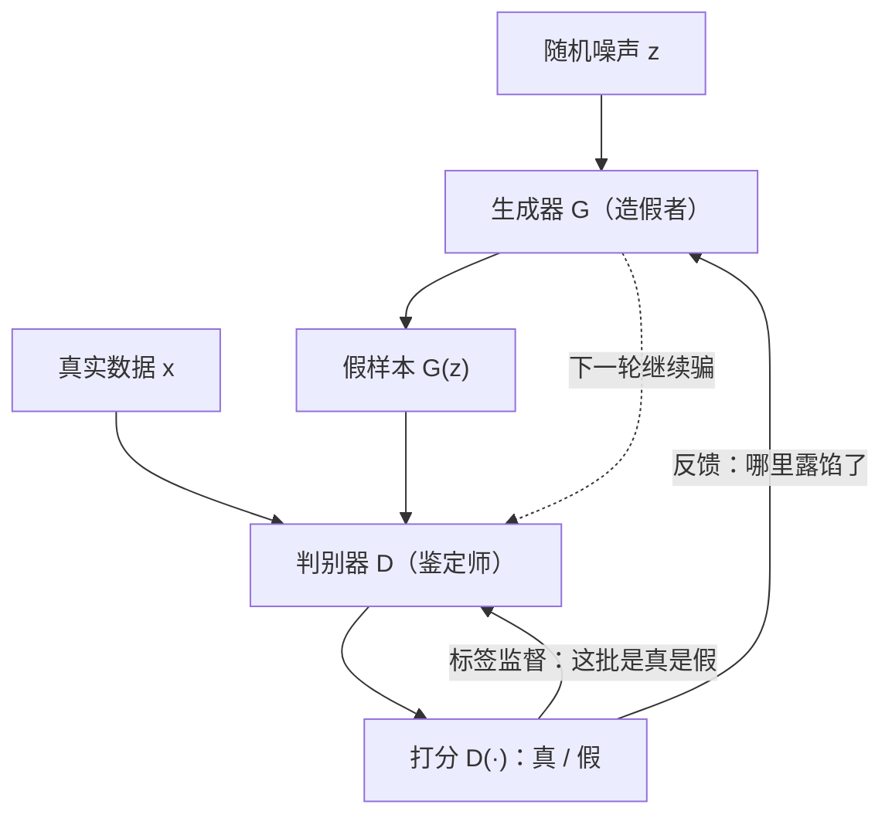
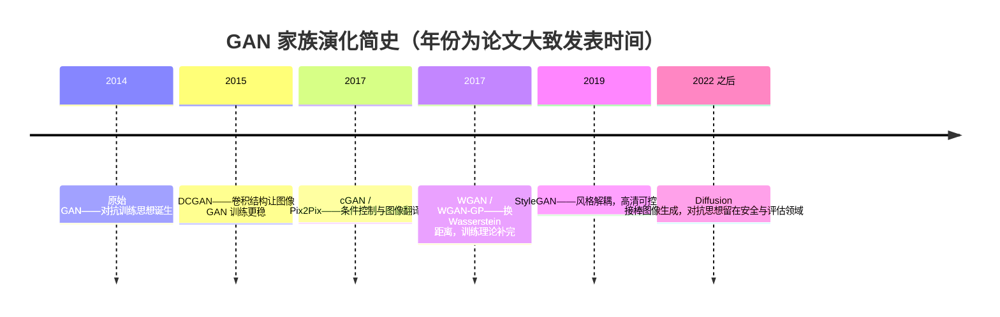

# 对抗生成网络（GAN）

> **一句话理解**：让一个"造假者"网络 G 和一个"鉴定师"网络 D 互相博弈、互相逼强，最终造假者产出的样本连鉴定师都分辨不出——不写概率公式，逼真就是硬道理。

[⬆️ 返回总目录](../../../README.md) · [⬆️ 返回本篇](../README.md) · [⬅️ 返回本章目录](./README.md)

| 属性 | 说明 |
|------|------|
| 难度 | ⭐⭐⭐⭐（高阶） |
| 所属分支 | 生成与多模态 |
| 前置知识 | [生成模型全景](./01-生成模型全景.md)；[神经网络是怎么炼成的](../../3-深度学习/04-深度学习基础/01-神经网络是怎么炼成的.md) |

---

## 📌 这一节解决什么问题

VAE 有清晰的概率目标，但生成结果偏模糊；直接写出图像的似然 $P(X)$ 又极其困难——像素空间动辄几十万维，"一张真实猫图的概率"根本算不动（第 01 页把这条"积分算不动"的坎推了一遍）。

GAN（Generative Adversarial Network，生成对抗网络）干脆换了一条路：**不显式学分布，改学"骗过鉴定"**。既然难以度量"这张图有多像真图"，那就训练另一个网络来当裁判——裁判的辨别力越强，能骗过裁判的造假者就越厉害。生成质量不再靠公式度量，而靠一场不断升级的军备竞赛逼出来。

这个思路 2014 年提出后横扫图像生成领域数年：超分辨率、老照片修复、换脸，背后的主力大多是 GAN。它训练起来出了名地"玄学"——本页就把这套玄学的**机理层**讲清楚：损失从哪来、均衡是什么、为什么会崩，以及最重要的——**盯着 loss 曲线时到底在读什么**。

## 🌱 通俗理解

想象一个**假画贩子**和一个**鉴定师**的猫鼠游戏：

- 贩子（生成器 G）拿着随机噪声当"颜料"，凭空仿造名画；
- 鉴定师（判别器 D）看画打分：真迹还是赝品；
- 每次贩子被识破，他就总结"哪里露馅了"，下次改进；每次被蒙混过关，鉴定师就升级手段，研究"这类赝品的破绽"。

注意两个关键点：**没有人教过贩子"真画的概率公式"**，他只从"被抓"的反馈里学；**鉴定师也从没见过"美术教材"**，他的眼力完全是被贩子逼出来的。两边互相逼强，若干回合后，贩子的假画连仪器都难分辨——这就是对抗训练（Adversarial Training）。

但这套机制有个天生的暗门：**贩子的 KPI 是"不被识破"，不是"画得多样"**。如果某一种画法永远骗得过鉴定师，贩子最理性的策略是把这种画复印一万份——对全局（数据分布）而言是灾难，对他个人（博弈收益）而言是满分。这就是后面"模式崩塌"的博弈论根源。

## 📋 举个例子

把这场博弈记录成状态表（**数字为示意**，标注"轮"在真实训练中对应成百上千次交替更新）：

| 轮次 | 假画水平（G） | 鉴定师水平（D） | 本轮结果 |
|------|---------------|------------------|----------|
| 第 1 轮 | 潦草涂鸦，颜色都不对 | 瞟一眼就能拒 | 100% 被识破 |
| 第 3 轮 | 大形对了，细节糊 | 需要看 10 秒 | 仍基本全被识破 |
| 第 6 轮 | 笔触、配色像样 | 得凑近看笔触和签名 | 偶尔骗过（约 3/10） |
| 第 9 轮 | 连画布龟裂纹都做出来了 | 要上仪器检测 | 一半对一半 |
| 第 12 轮 | 与真迹肉眼无差 | 用尽手段也只有五成把握 | 接近均衡：D ≈ 抛硬币 |

博弈论上，理想的终局是 D 对真假只能给出 50% 的判断——此时 G 造的分布与真实分布重合，鉴定失去意义。但真实训练往往到不了这么圆满，见下文"为什么难训"。

<details>
<summary>📊 展开：模式崩塌（Mode Collapse）的具体表现</summary>

模式崩塌（Mode Collapse）是 GAN 最著名的病：**G 发现某一种样本"最安全"，就只造这一种**。

具体表现：训练似乎收敛了（D 的判断在 50% 附近），但采样 100 张生成图，98 张是**同一张脸**——同一个角度、同一个表情、同一个光照，像复印机一样。剩下 2 张是这张"招牌脸"的轻微变体。

为什么会出现？因为 G 的目标只是"骗过 D"，而 D 的火力集中在多数模式上。对 G 来说，"画 100 种平庸的脸各有风险"不如"死磕 1 种极难识别的脸"划算——多样性和逼真度不是一回事，**博弈赢了，分布却塌了**。数据里本来有 1000 种长相，最后只剩 1 种。

</details>

<details>
<summary>🎲 展开：模式崩塌的博弈论解释——G 找到一个"稳赢策略"就躺平</summary>

把 GAN 训练看成一局**非对称博弈**：G 的每一步棋是"把噪声映射成哪种样本"，D 的每一步棋是"在样本空间里布防哪片区域"。

- **理论上的好均衡是"混合策略"**：G 以一定比例随机覆盖各种模式（像石头剪刀布里随机出招），D 对应地全面布防。此时 D 无法针对性布防，G 的每种画法都有存活空间——这正对应"生成分布覆盖全部数据分布"；
- **实际激励把 G 推向"纯策略"**：一旦某种样本 $x^*$ 骗过了当前 D，重复造 $x^*$ 的**边际风险为零**（已验证安全），而探索新模式有被识破的风险（这一步白训）。风险不对称，G 的理性选择就是锁死 $x^*$——稳赢策略一旦出现就自我强化，再也不松手；
- **振荡的来源**：G 锁死后，D 迟早会专门识破 $x^*$；G 被迫跳到下一个模式 $x^{**}$，D 再追……此时极小极大（先 G 后 D）与极大极小（先 D 后 G）的值不相等，博弈没有稳定纯策略均衡，损失曲线表现为 G 和 D 轮流"按下葫芦浮起瓢"。

👉 **人话**：崩塌不是"训练坏了"，而是**激励设计天然允许 G 用牺牲多样性换取安全**——补救思路全都围绕"让重复变贵"：给 G 的输出加多样性惩罚（小批量判别）、让 D 一批一起看（识别"千篇一律"）、保留历史假样本喂 D（让"曾经的安全区"也保持布防）。

</details>

## 🧠 核心原理

### 整体流程



### 逐步拆解

**1. 损失函数：一场极小极大博弈**

$$
\min_{G}\ \max_{D}\ V(D, G) = \mathbb{E}_{x \sim P_{\text{data}}}[\log D(x)] + \mathbb{E}_{z \sim P_{z}}[\log(1 - D(G(z)))]
$$

> 👉 **人话**：内层 $\max_D$：D 想把真样本判成 1、假样本判成 0，把右边两项都做大；外层 $\min_G$：G 想让 D 把假样本判成 1，把第二项做小。一个最大化、一个最小化，像拔河。理论最优解是 $D(x) = \tfrac{1}{2}$——鉴定师只能抛硬币，此时生成分布与真实分布重合。

拆开看两边的"KPI"。

D 的损失（就是一个二分类交叉熵）：

$$
L_D = -\mathbb{E}_{x}[\log D(x)] - \mathbb{E}_{z}[\log(1 - D(G(z)))]
$$

> 👉 **人话**：真样本标签 1、假样本标签 0，交叉熵损失——和第 3 章逻辑回归做的是同一件事，只是"假样本"是另一个网络现造的。

G 的损失（实践用的"非饱和"形式）：

$$
L_G = -\mathbb{E}_{z}[\log D(G(z))]
$$

> 👉 **人话**：G 的 KPI 只有一条——让 D 给我的假货打高分。原始公式里的 $\log(1-D)$ 在训练初期梯度太小（D 轻松分辨时 G 几乎学不动），换成这个形式梯度更足（推导见下方折叠框——**"非饱和"这个救命技巧不是拍脑袋，是有明确梯度分析的**）。

<details>
<summary>🧮 展开推导一：从原始 minmax 到非饱和损失——为什么后者更稳</summary>

**原始形式**下 G 最小化 $\mathbb{E}_z[\log(1 - D(G(z)))]$。设 $x = D(G(z)) \in (0,1)$，G 的损失函数 $f(x) = \log(1-x)$，它对 D 打分的导数：

$$
f'(x) = -\frac{1}{1-x}
$$

训练初期 G 很弱，D 轻松分辨，$D(G(z)) \to 0$。此时两个坏消息同时发生：

1. **损失已经贴底**：$f(0) = \log 1 = 0$——损失值已是理论最小，G"感觉没亏多少"，没有改进方向感；
2. **D 的输出区域饱和**：强 D 在 G 当前样本的整个邻域内都输出 $\approx 0$，G 挪一步、D 的打分纹丝不动（$\partial D(G(z))/\partial\theta_G \approx 0$），链式法则乘出来的总梯度 $\approx 0$。

**非饱和形式**改为最小化 $g(x) = -\log x$，导数：

$$
g'(x) = -\frac{1}{x}
$$

同样在 $x = 0.01$ 处比较：$|f'| \approx 1.01$，$|g'| = 100$——**D 每动一点点，非饱和形式给 G 的梯度放大了约百倍**；且损失值 $-\log 0.01 \approx 4.6$，"亏得刺眼"，改进方向明确。

一个关键的合法性说明：在 D 取最优 $D^*$ 时，两种目标的均衡点相同（都推出 $p_g = p_{\text{data}}$，见推导二）——非饱和技巧**没有改变博弈的理论解，只改变了梯度地形**：在"G 最需要学习的区域（被打分为 0 的区域）"把梯度从消失变成充裕。

> 👉 **人话**：原始损失在"G 最烂的时候"最没脾气（损失≈0、梯度≈0）；非饱和损失恰好相反——G 越烂、惩罚越响、梯度越足。训练早期稳不稳，拼的就是这段区间的梯度供给。

</details>

**2. 判别器的最优解：D\*(x) 与它揭示的 JS 散度本质**

对固定的 G，D 的最优解有闭式形式：

$$
D^*(x) = \frac{p_{\text{data}}(x)}{p_{\text{data}}(x) + p_g(x)}
$$

> 👉 **人话**：D 的最优打分 = "真样本的局部密度占真假总密度的比例"。哪边密度大，D 就偏向哪边；两分布完全重合时各占一半，$D^* \equiv 0.5$——"抛硬币"的均衡是这个公式的特例。

把这个最优解代回目标函数，会发现这场博弈的**真面目**：G 实际上在最小化两个分布的 JS 散度（Jensen–Shannon Divergence，一种对称的分布距离度量）——完整推导见折叠框。这一步是理解 GAN 全部疾病的钥匙。

<details>
<summary>🧮 展开推导二：D* 的求解 + 代回得到 JS 散度</summary>

**第 1 步：逐点求 D**。固定 G，把目标写成对样本空间逐点积分：

$$
V(D, G) = \int \big[p_{\text{data}}(x)\log D(x) + p_g(x)\log(1 - D(x))\big] dx
$$

被积函数对每一点的 $D(x) \in (0,1)$ 独立取最大。对 $D$ 求导置零：

$$
\frac{\partial}{\partial D}\big[p_{\text{data}}\log D + p_g \log(1-D)\big] = \frac{p_{\text{data}}}{D} - \frac{p_g}{1-D} = 0
$$

解得 $p_{\text{data}}(1-D) = p_g D$，即 $D^* = p_{\text{data}}/(p_{\text{data}} + p_g)$（二阶导数 $< 0$，确为最大值）。

**第 2 步：代回**。记 $m = (p_{\text{data}} + p_g)/2$，代入整理（利用 $\log D^* = \log p_{\text{data}} - \log(p_{\text{data}}+p_g)$，对假样本同理）：

$$
C(G) = V(D^*, G) = -\log 4 + 2\,\mathrm{JS}\big(p_{\text{data}}\,\|\,p_g\big), \qquad \mathrm{JS}(p\|q) = \frac{1}{2}\mathrm{KL}\Big(p\,\Big\|\,\frac{p+q}{2}\Big) + \frac{1}{2}\mathrm{KL}\Big(q\,\Big\|\,\frac{p+q}{2}\Big)
$$

**第 3 步：读结论**。$\mathrm{JS} \geq 0$ 且当且仅当两分布相等时为 0，所以 $C(G)$ 的最小值 $-\log 4$ 恰在 $p_g = p_{\text{data}}$ 处取得——极小极大博弈的全局最优 = 两分布重合，与"抛硬币均衡"严格一致。

**但这把双刃剑立刻露出反面**：JS 散度有个致命脾气——**当两个分布的支撑集不相交时，$\mathrm{JS} = \log 2$ 是个常数**。高维空间里，一个随机初始化的 G 产生的分布与数据分布几乎必然不相交（低维流形几乎 surely 不相交），于是：

- D 能做到完美分辨（在不相交区域分别输出 0 和 1），$\mathrm{JS} = \log 2$ 恒定；
- $C(G) = -\log 4 + 2\log 2 = 0$ 恒定，**关于 G 的梯度恒为零**——G 从理论最优的 D 那里得不到任何学习信号。

👉 **人话**：原始 GAN 的病根不在工程，在数学——它选的距离尺子（JS）在"两分布还没搭上边"时是根哑尺，怎么挪都是同一个读数。后面的 WGAN 换尺子，换的就是这里。

</details>

**3. 梯度消失的机理：D 太强 → G 断粮（与训练监控联动）**

综合前两个推导，GAN 最常见的死法链条是：

$$
\text{D 更新更快/更强} \;\Rightarrow\; D \to D^* \text{ 且支撑集不相交} \;\Rightarrow\; \mathrm{JS} = \log 2 \text{（常数）} \;\Rightarrow\; \nabla_G V \approx 0 \;\Rightarrow\; \text{G 停止学习}
$$

> 👉 **人话**：D 把真假两团"云"彻底分开后，损失地形对 G 变成一马平川——不是 G 不想学，是**路标全被撤了**。这就是"lossD 快速趋近 0"时要立刻警觉的原因：那不是好事，是 G 即将断粮的前兆。反过来 D 太弱同样糟糕（形同虚设，G 骗过一个废物学不到东西）——GAN 要的从来不是谁强，是**势均力敌**。

**4. 训练流程：交替训练一步 D、一步 G**

1. **固定 G，更新 D 一步**：采一批真样本 + G 现造一批假样本（detach，不让梯度流进 G），按上面的 $L_D$ 更新 D；
2. **固定 D，更新 G 一步**：采一批噪声，让 G 生成，以"骗过 D"为目标按 $L_G$ 更新 G；
3. 循环往复几千轮。**任何时刻只有一个网络在"被训练"**，另一个当环境。

**5. 为什么难训：博弈不平衡**

GAN 没有单一的总损失可以"最小化到收敛"，两边互相追逐带来两大经典病：

- **模式崩塌**：G 只造一种"安全脸"骗过 D（博弈论解释见上面折叠框）；
- **振荡不收敛**：G 追着 D 跑、D 反过来追 G，损失曲线上下横跳，"loss 下降 = 变好"的直觉在这里失效——判断训练好坏要看**生成样本本身**，不是 loss。

**训练健康度读法表**：盯着 D loss / G loss 的六种典型组合，各说明什么、怎么调（以"两项 BCE 之和"计，均衡参考值 $\approx 2\log 2 \approx 1.39$）：

| # | D loss | G loss | 读数（诊断） | 处置建议 |
|---|--------|--------|--------------|----------|
| 1 | 快速趋 0 | 上升/震荡 | D 吊打 G，G 梯度消失进行中 | 降 D 学习率、减少 D 更新次数、标签平滑、谱归一化 |
| 2 | 高位不动（> 均衡值） | 低 | D 太弱形同虚设，G 在骗一个废物 | 加 D 更新次数、提 D 容量，先让 D 学会再谈 |
| 3 | 在均衡值附近小幅波动 | 在均衡值附近波动 | 势均力敌——**同时盯样本是否持续变好** | 健康区间，继续 |
| 4 | 在均衡值附近，看似稳定 | 稳定 | 伪均衡：可能是模式崩塌（loss 看不出） | 采样 100 张查多样性；崩了上特征匹配/小批量判别 |
| 5 | 双方大幅震荡甚至发散 | 同左 | 学习率过大或 G/D 容量悬殊 | 降学习率、TTUR（G/D 用不同学习率） |
| 6 | 缓慢上升（D 越来越难分辨） | 缓慢下降 | G 在追上 D，训练后期常见 | 正常，以样本质量为准 |

> 👉 **人话**：GAN 的 loss 是**体温计不是成绩单**——单看一个数没意义，两个数一起看、再对照生成样本，才能读出"谁病了"。

**6. 稳定化丹方：每个技巧对着一个病灶**

| 技巧 | 一句话机理 | 治的病灶 |
|------|-----------|----------|
| 标签平滑（Label Smoothing，真样本目标 1→0.9） | 不让 D 过度自信，保住给 G 的梯度 | 推导三的"JS 哑尺"断粮 |
| 谱归一化（Spectral Normalization） | 限制 D 的 Lipschitz 常数，让 D 的打分面不过陡 | D 过强过陡 |
| 特征匹配（Feature Matching） | G 不只骗 D 的最终打分，还匹配 D 中间层特征的统计量 | 模式崩塌（逼 G 覆盖更多模式） |
| 小批量判别（Minibatch Discrimination） | 给 D 加一个"同批样本互相像不像"的旁路，能直接识破"千篇一律" | 模式崩塌 |
| 历史平均（Historical Averaging） | 参数向历史均值回拉，抑制追逐震荡 | 振荡不收敛 |
| TTUR（Two Time-scale Update Rule） | D 用较大学习率、G 用较小（如 4:1），尺度分离求稳 | G/D 失衡 |
| EMA 权重平均 | 用参数滑动平均出图，末期抖动小 | 末期质量抖动 |

谱归一化单独说透一层（它和 WGAN 是同一条思路的两种实现）：D 作为一个函数，"打分面最陡能有多陡"由**Lipschitz 常数**（Lipschitz Constant，函数值变化幅度对输入变化的倍数上限）刻画。对线性层来说，这个倍数恰好等于权重矩阵 $W$ 的**最大奇异值** $\sigma(W)$。谱归一化的做法是每步把 $W$ 除以 $\sigma(W)$——除完之后这一层最多把输入"拉伸"1 倍，整个 D 的陡峭程度被锁死。$\sigma(W)$ 用幂迭代（Power Iteration，反复做 $v \leftarrow W^\top W v$ 后取范数）一两步就能估出，开销可忽略。

> 👉 **人话**：谱归一化 = 给鉴定师立规矩"反应不许过激"。D 打分面太陡时（几乎阶跃），它对 G 的微小改进毫无反应、对噪声却反应剧烈，梯度质量极差；把每层的"拉伸倍数"压到 1，打分面变缓，G 每挪一步都能看到分数变化——梯度恢复连续。

**7. WGAN：把尺子从 JS 换成 Wasserstein 距离**

推导二暴露了 JS 的病根：不相交分布 → 恒为 $\log 2$ → 梯度为零。WGAN 的答案干脆利落——**换距离**。Wasserstein 距离（也叫推土机距离，Earth Mover's Distance）定义为：

$$
W(P_{\text{data}}, P_g) = \inf_{\gamma \in \Pi(P_{\text{data}}, P_g)} \mathbb{E}_{(x, y) \sim \gamma}\big[\|x - y\|\big]
$$

> 👉 **人话**：把 $p_g$ 这堆"土"运到 $p_{\text{data}}$ 那个"坑"里，所有运土方案里最省的总运费。**哪怕两团土离得再远（支撑集不相交），运费也随着距离连续变大**——这正是 JS 缺的性质：哑尺变活尺，G 永远知道"往哪边挪、挪多远"。

用它对偶形式训练时（Kantorovich–Rubinstein 对偶）：

$$
W(P_{\text{data}}, P_g) = \sup_{\|f\|_L \leq 1}\ \Big[\mathbb{E}_{x \sim P_{\text{data}}} f(x) - \mathbb{E}_{x \sim P_g} f(x)\Big]
$$

> 👉 **人话**：找一个"变化率不超过 1"（1-Lipschitz，这就是谱归一化在管的那个约束）的评分函数 $f$（现在叫批评家 critic，不再输出概率），让它给真样本打高分、假样本打低分——最大分差就是 Wasserstein 距离。约束"不超过 1"是防作弊：没有它，critic 可以造一个无限陡的悬崖把分差刷到无穷。

WGAN 的实现演化一句话版：权重裁剪（WGAN，粗暴但有偏）→ 梯度惩罚（WGAN-GP，对"梯度范数偏离 1"加罚）→ 谱归一化（SNGAN，前述除以 $\sigma(W)$）——三代的共同目标都是"让 critic 满足 Lipschitz 约束"，一代比一代温和精确。

### 演化史：从原始 GAN 到 StyleGAN



- **原始 GAN**：证明了"对抗"这条路可行，但训练不稳、生成小图（病根见推导二、三）；
- **DCGAN**：给 G 和 D 换上卷积结构（见[第 5 章 · CNN](../../4-专业方向/05-计算机视觉/01-CNN卷积神经网络.md)），转置卷积让 G 能"从噪声上采样成图像"，是早期炼 GAN 的标配骨架；
- **cGAN（条件 GAN）**：把标签/条件喂给 G 和 D，实现"我要一只**橘色**的猫"这种定向生成——痛点：无条件 GAN 只能"抽盲盒"；
- **WGAN / WGAN-GP**：解决"JS 哑尺导致梯度消失"的病根，loss 数值从此真的近似"两分布距离"，可当监控指标用；
- **StyleGAN**：风格解耦——把"发色、脸型、年龄、光照"拆成潜空间里**可以分开单独调节的旋钮**，实现高清人脸的精细编辑。

### 应用与思想遗产

- **应用**：老照片修复与上色、图像超分辨率（Real-ESRGAN 类工具的核心）、换脸与 **Deepfake 风险**（伪造人脸/音频被用于诈骗与虚假信息，检测与伪造的攻防仍在持续）、图像翻译 Pix2Pix（草图转彩图、白天转黑夜、缺失区域补全）；
- **思想遗产**：对抗训练这个**思想**早已越出图像生成——对抗样本（Adversarial Example）攻击与防御是模型安全的重要分支；"用一个模型考另一个模型"的思路也进了模型评估（如用模型互搏做红队测试、数据质检）。

### 失效边界：GAN 什么时候不该用

- **数据分布极复杂/多模态极多**（如开放世界文生图）：模式崩塌风险与博弈调参成本陡增——这类任务 Diffusion 已是主流；
- **需要精确可控的中间过程**（逐步精修、局部重绘）：GAN 一次前向没有"过程"抓手，可控性要靠外挂（条件注入、编辑潜空间）；
- **要算似然/评估分布质量**：GAN 没有概率语义，给不出 likelihood；
- **仍该用 GAN 的场景**：推理只能一步出图（超分、实时翻译类任务）、算力预算极紧、目标分布相对集中（人脸、特定商品）——一步前向的速度优势至今无可替代。

### 📐 数学深潜：判别器最优解 D* 与 JS 散度的性质——梯度为零的完整因果链

**严格陈述**（四条，串成一条因果链）：

1. **最优判别器**：固定 G，逐点最优解 $D^*(x) = \dfrac{p_{\text{data}}(x)}{p_{\text{data}}(x) + p_g(x)}$；
2. **代回后的博弈真面目**：$C(G) = V(D^*, G) = -\log 4 + 2\,\mathrm{JS}(p_{\text{data}} \| p_g)$，其中 $\mathrm{JS}(p\|q) = \tfrac12\mathrm{KL}\big(p \big\| \tfrac{p+q}{2}\big) + \tfrac12\mathrm{KL}\big(q \big\| \tfrac{p+q}{2}\big)$；
3. **JS 的三条性质**：对称 $\mathrm{JS}(p\|q) = \mathrm{JS}(q\|p)$；有界 $0 \leq \mathrm{JS} \leq \log 2$；两分布**支撑集不相交**（乘积 $p\cdot q = 0$ 几乎处处）时 $\mathrm{JS} = \log 2$ **恒取最大值**；
4. **后果**：不相交 ⇒ $\mathrm{JS}$ 常数 ⇒ $C(G)$ 关于 G 的梯度恒为零——G 断粮。

> 👉 **人话**：把判别器养到最优再回头看，生成器其实在优化"两分布的 JS 距离"；而 JS 这把尺子有个致命脾气——两团云还没搭上边时，它读数**钉死在最大值不动**。尺子不动，梯度就是零——GAN 训练崩坏的病根不在工程，在这把尺子的数学。

<details>
<summary>🧮 展开完整推导：D* 求解 → 代回化简 → JS 三性质 → 梯度为零（不跳步）</summary>

**第 1 步：逐点求 D*。** 固定 G，把目标写成积分，被积函数在每个 $x$ 上独立（$D(x) \in (0,1)$ 可逐点取优）：

$$
V = \int \big[p_{\text{data}}(x)\log D(x) + p_g(x)\log(1 - D(x))\big]\,dx
$$

记 $a = p_{\text{data}}(x),\ b = p_g(x)$（非负），对 $D$ 求导置零：

$$
\frac{\partial}{\partial D}\big[a\log D + b\log(1-D)\big] = \frac{a}{D} - \frac{b}{1-D} \stackrel{!}{=} 0
\;\Longrightarrow\; a(1-D) = bD \;\Longrightarrow\; D^* = \frac{a}{a+b}
$$

二阶导 $-\frac{a}{D^2} - \frac{b}{(1-D)^2} \le 0$ 确认最大值（$a=b=0$ 的零测集不影响积分）。

**第 2 步：代回并显式引入混合分布。** 令 $m = \frac{p_{\text{data}} + p_g}{2}$。用 $\log\frac{p_{\text{data}}}{p_{\text{data}}+p_g} = \log\frac{p_{\text{data}}}{2m} = \log\frac{p_{\text{data}}}{m} - \log 2$（假样本一侧同理）逐项改写：

$$
C(G) = \underbrace{\int p_{\text{data}}\log\frac{p_{\text{data}}}{m}\,dx}_{=\,\mathrm{KL}(p_{\text{data}}\|m)} + \underbrace{\int p_g\log\frac{p_g}{m}\,dx}_{=\,\mathrm{KL}(p_g\|m)} - 2\log 2 = -\log 4 + 2\,\mathrm{JS}(p_{\text{data}}\|p_g)
$$

**第 3 步：JS 三性质，各给一个短证明。**

- **对称**：定义里两半交换 $p \leftrightarrow q$ 只交换两个 KL，$\mathrm{JS}$ 不变（对比 KL 的不对称——JS 是把 KL"对称化"的产物）；
- **上界 $\log 2$**：关键观察是逐点有 $m = \frac{p+q}{2} \geq \frac{p}{2}$，故在 $p > 0$ 处 $\log\frac{p}{m} \leq \log 2$，于是

$$
\mathrm{KL}\big(p \big\| m\big) = \int p\,\log\frac{p}{m}\,dx \leq \int p \cdot \log 2\,dx = \log 2
$$

（$q$ 一侧同理），加权平均得 $\mathrm{JS} \leq \log 2$。**取等条件**：$\log\frac{p}{m} = \log 2$ 要求 $q = 0$（在 $p > 0$ 处）且反向同理——即**两分布支撑集互不相交**；
- **不相交 ⇒ 恒为 $\log 2$**：若 $p \cdot q = 0$ 几乎处处，则 $p>0$ 处 $m = p/2$、$\log\frac{p}{m} = \log 2$ 精确成立，$\mathrm{KL}(p\|m) = \log 2$；$q$ 一侧同理；故 $\mathrm{JS} = \log 2$ **对 $p_g$ 的任何移动都不变**。

**第 4 步：因果链闭合。** $\mathrm{JS} = \log 2$（常数）⇒ $C(G) = -\log 4 + 2\log 2 = 0$（常数）⇒ $\nabla_{\theta_G} C(G) = \mathbf{0}$。**理想最优的 D 是一堵完美的墙，G 靠在墙上却感受不到任何推力**——高维空间里随机初始化的 G 的像分布与数据分布（都撑在低维流形上）几乎必然不相交，这条链在训练初期就真实成立（上文推导二的结论在此得到完整证明支撑）。

</details>

**几何/概率解释**（配图）：JS 把两个分布的"重叠程度"映射到 $[0, \log 2]$，但不相交之后读数饱和——尺子变哑。

```text
一维示意：真数据 p_data 与生成分布 p_g

情形 A：两分布重叠（支撑集相交）              情形 B：不相交（高维几乎必然）
  ▲                                            ▲
  │   ▄▄▄  p_data                              │        ▄▄▄  p_data
  │  ▗▟███▙▄▄  ▂▂ p_g（部分重叠）              │  ▝▘            ▐▇▇▌ p_g
  └──────────────────► x                       └──────────────────► x
  D* 在重叠区取中间值（有梯度可用）             D*：左边全 0，右边全 1（完美分类）
  JS 随两分布靠近连续下降 ↓                     JS = log 2 钉死 → ∇C(G) = 0
  G 有方向感 ▼                                 G 无方向感 ✗（断粮）
```

**反例与边界**：

- **$D^*$ 是理论道具，不是训练目标**：推导用"最优 D"揭示 G 的有效目标；实战里把 D 养到完美恰恰制造零梯度——所以工程要压 D（少更新、标签平滑、谱归一化），留一个"近视但会给出梯度"的 D（上文读数表 #1 的理论根据）；
- **非饱和损失救的是"D 次优时"的梯度**：$-\log D(G(z))$ 改的是 G 侧损失的梯度地形，**没有改变**"$D = D^*$ 且不相交 ⇒ 梯度为零"的结论——两个技巧对付的是链条的不同环节（推导一 vs 本深潜）；
- **有限样本与平滑带来一线生机**：实际训练里 D 从有限样本学习、分布经验上有微弱重叠（或人为加噪声），JS 不是严格常数——这解释了"小数据/加噪声反而能训"的实验现象，也说明本推导刻画的是**理想化极限**；
- **WGAN 的对策是换尺子**：Wasserstein 距离在不相交时随分布间距连续增长——本因果链的哪一环失效，就是它要修的那一环（上文第 7 节）。

> 👉 **一句人话**：最优判别器揭示 G 在最小化 JS 散度，而 JS 在"两分布没搭上边"时读数恒为最大、梯度恒为零——GAN 的不稳定是**尺子的病**，不是炼丹的手气。

## 💻 动手试试

用 PyTorch 写一个最小 GAN：在 2D 玩具数据（一个环形点云）上训练，几十秒就能看到生成点云逼近目标分布——**GAN 的所有核心机制（交替训练、互相博弈、loss 读数）都在这 40 行里**。

```python
import torch
import torch.nn as nn

torch.manual_seed(0)

# 目标分布：中心在 (2,2)、半径 2 的环形点云（当作"真实世界"）
def sample_real(n):
    ang = torch.rand(n) * 2 * torch.pi
    r = 2.0 + 0.1 * torch.randn(n)          # 半径带一点噪声
    return torch.stack([r * torch.cos(ang), r * torch.sin(ang)], dim=1) + 2.0

G = nn.Sequential(nn.Linear(2, 64), nn.ReLU(), nn.Linear(64, 64), nn.ReLU(), nn.Linear(64, 2))
D = nn.Sequential(nn.Linear(2, 64), nn.ReLU(), nn.Linear(64, 64), nn.ReLU(), nn.Linear(64, 1), nn.Sigmoid())
optG = torch.optim.Adam(G.parameters(), lr=2e-4, betas=(0.5, 0.999))  # beta1=0.5 是 GAN 的老传统
optD = torch.optim.Adam(D.parameters(), lr=2e-4, betas=(0.5, 0.999))
bce = nn.BCELoss()

for step in range(3000):
    # ---- 第 1 步：训练 D（真=1，假=0）----
    real = sample_real(128)
    fake = G(torch.randn(128, 2)).detach()   # detach：这次更新与 G 无关
    lossD = bce(D(real), torch.ones(128, 1)) + bce(D(fake), torch.zeros(128, 1))
    optD.zero_grad(); lossD.backward(); optD.step()

    # ---- 第 2 步：训练 G（让 D 把假样本判成"真"，非饱和损失）----
    fake = G(torch.randn(128, 2))
    lossG = bce(D(fake), torch.ones(128, 1))
    optG.zero_grad(); lossG.backward(); optG.step()

    # ---- 健康度监控：对照上面"训练健康度读法表"读数 ----
    if step % 500 == 0:
        with torch.no_grad():
            d_real = D(sample_real(256)).mean().item()      # D 对真样本的均分
            d_fake = D(G(torch.randn(256, 2))).mean().item() # D 对假样本的均分
        print(f"step {step:4d} | lossD={lossD.item():.3f} lossG={lossG.item():.3f}"
              f" | D(真)={d_real:.2f} D(假)={d_fake:.2f}")
        # 健康走势：两个打分都逐渐靠近 0.5 附近；若 D(真)→1 且 D(假)→0 且 lossD→0，读数 #1：G 断粮中

with torch.no_grad():
    pts = G(torch.randn(1000, 2))
print("生成点的均值:", pts.mean(0).tolist())                # 应接近 [2.0, 2.0]
print("到中心的平均距离:", (pts - 2).norm(dim=1).mean().item())  # 应接近 2.0（环半径）
print("D 对真/假的平均打分:", D(sample_real(500)).mean().item(),
      D(G(torch.randn(500, 2))).mean().item())               # 两者都应离 0.5 不太远

# ---- 多样性诊断（模式崩塌检查）----
ang = torch.atan2(pts[:, 1] - 2, pts[:, 0] - 2)             # 每个生成点相对环心的角度
hist = torch.histogram(ang, bins=8, range=(-3.14, 3.14)).hist
print("角度直方图（8 个扇区）:", hist.int().tolist())
# 健康输出：8 个扇区大致均匀（每区 ~125）
# 崩塌输出：个别扇区为 0、个别爆满——"环上只剩几段有人"，模式崩塌的直观形态
```

预期输出：健康跑完时生成点均匀落在环形上（均值 ≈ (2, 2)，到中心距离 ≈ 2.0，8 个扇区大致均匀），D 对真假样本的打分都徘徊在 0.5 附近——博弈接近均衡。

> 🧪 **改什么参数、看什么变化**：① 把 `optD` 的学习率调大 10 倍——大概率看到 `D(真)→1, D(假)→0`、`lossD→0`，即读数 #1 的"G 断粮"现场；② 把 G 的隐藏层宽度从 64 砍到 8——点云拟合不动、偏离环；③ 把 `torch.manual_seed` 换三个种子各跑一遍——体会"同一份代码不同命运"的玄学；④ 给真样本标签用 0.9（标签平滑）再跑第 ① 组实验——断粮现象明显缓解。每一组实验都对应正文的一个机制段落，跑完手感就有了。

## 🔥 炼丹小灶

> 🔥 **炼丹小灶**：GAN 训练玄学——
> - 配方：G/D 都用 Adam（lr≈1e-4~2e-4，beta1=0.5）、1:1 交替更新、batch 64 起步；D 太强时 D 的 lr 减半或采用 TTUR；
> - 玄学：D 太强（lossD 快速趋 0）→ **降低 D 的学习率**或减少 D 的更新频率；G 突然躺平 → 换随机种子重来；loss 横跳是常态，**看生成样本别只盯 loss**——但 loss 的"组合读法"（健康度读法表）比单看数值有用得多；
> - ⚠️ 以上是经验参考值，不是圣旨；换数据集请重新炼。

## 🔗 在知识树中的位置

- **上游**：[生成模型全景](./01-生成模型全景.md)——四流派版图、ELBO 统一视角（GAN 是唯一"放弃似然"的一派）；[CNN 卷积神经网络](../../4-专业方向/05-计算机视觉/01-CNN卷积神经网络.md)——DCGAN 一系的骨架；
- **下游**：[扩散模型Diffusion](./03-扩散模型Diffusion.md)——接棒 GAN 的图像生成新王，页内对比两者；[多模态模型](./04-多模态模型.md)——条件生成的思想延伸到文本条件；
- **横向对比**：VAE 稳但糊、GAN 锐但难训、Diffusion 稳且多样但慢（总览表见[生成模型全景](./01-生成模型全景.md)）。

## 🎓 深度视角

回看 GAN 这十年，最值得带走的一层理解是：**对抗的本质是"把损失函数外包给另一个网络"**。固定损失（L2、L1）天生只懂像素层面的"差多少"，不懂感知层面的"像不像"；GAN 让 D 用全部容量去发现"人眼会觉得假"的模式，G 被罚的正是这些模式——这是 GAN 样本锐利、以及它在超分/翻译任务里长期不倒的真正原因。代价藏在同一个机制里：损失函数本身在动（D 每步都变），G 面对的是**非平稳目标**——锐度的来源和不稳定的来源是同一个东西。这是 GAN 设计空间的根本取舍，不是调参能消掉的。

第二个真实取舍：**GAN 的一切诊断都依赖"看得见的样本"**。它没有似然、没有可信的 loss 读数（本页读数表只是"体温计"），工程师只能反复回到同一套手工程序：人眼看样本、抽多样性、查吞吐。这个"不可度量性"在开放域任务（多样性无上限）里成本失控，在封闭域任务（人脸、超分——目标分布集中）里完全可承受——GPT 时代回看，GAN 地盘的收缩边界恰好画在"分布复杂度"这条线上，不是画在"技术新旧"上。

**高级深问**（点击展开）

<details>
<summary>问题 1：为什么 GAN 的样本普遍比同代 VAE 锐利？</summary>

两个原因叠加。其一：L2 类固定损失的最优解是"条件平均"——把多种可能平均之后必然糊（第 01 页深度视角讲了同一逻辑）；对抗损失里"平均"没有奖励——一张糊图在 D 眼里就是"假"，平均策略直接挨罚。其二：D 学到的判别面天然落在"人眼敏感的破绽"上（纹理重复、边缘发虚、色彩带状），G 被逼着修的恰是人看得见的地方；固定损失对人眼不敏感的高频错位几乎无感。**锐，是因为"疼的位置"选得好**。

</details>

<details>
<summary>问题 2：模式崩塌为什么不能靠"加大模型、加长训练"解决？</summary>

因为它是**激励结构问题，不是容量问题**。本页博弈论折叠框给过机制：某种样本一旦骗过 D，重复它的边际风险为零、探索新模式的风险为正——这个不对称不随容量消失，反而随容量放大（越强的 G 越善于把"稳赢样本"打磨到极致）。解药必须改激励：小批量判别让"千篇一律"变成 D 能抓住的破绽，历史假样本回喂让"曾经的安全区"保持布防。加大模型治博弈病，等于给发烧病人加饭。

</details>

<details>
<summary>问题 3：判别器到底该养到多强？训练到"完美"是好是坏？</summary>

理论上 $D^*$ 是推导的道具（"最优 D 下 G 在最小化 JS"），实战里"完美 D"是毒药：支撑集不相交时完美 D 意味着 JS 已饱和、G 断粮（推导二）。真正要维持的是窄带——D 足够强到给出有用梯度，又不强到打分面变成阶跃。工程手感（经验参考）：D 的真假分类准确率长期贴 100%（D 吊打 G）或贴 50% 不动（形同虚设或伪均衡）都不健康，健康训练里 D 准确率常在明显高于 50% 的区间内波动、被 G 缓慢追上——所以监控要看 D(真)、D(假) 的均值走势而非只看 loss 数值。

</details>

## 🔬 SOTA 演进（2023–2026）

**GAN 的现代遗产**。大规模开放域生成已整体让位扩散（第 03 页），但 GAN 没有退场，而是收缩并扎根在它结构最优的地盘上：

- **实时超分辨率**：视频播放、游戏实时拉分辨率要求单帧毫秒级、一步出图——GAN 系（Real-ESRGAN 类工具）至今是这类任务的标配，扩散的多步迭代在这里仍然太贵；
- **图像翻译**：Pix2Pix 一系的草图转成品、风格化、去雨去雾——目标分布集中、常有成对数据，GAN 的速度与锐度优势无可替代；
- **更隐蔽的第三块遗产**：对抗思想以"损失"的形式融入扩散生态——潜空间扩散的 VAE 解码器普遍用对抗损失微调，专治"一步解码偏糊"，等于把 GAN 的锐度基因移植给了 Diffusion 的末端（第 03 页失效模式表里"VAE 直测"那行，测的就是这个混合体）。

## ❓ 开放问题

1. **对抗博弈的均衡在实践中到底存不存在？** 理论上的极小极大均衡要求无限容量与无限样本；有限资源下 GAN 训练是否收敛、收敛到哪个解环（循环追逐的极限环？），至今没有完整刻画——GAN 训练理论仍是一片半开垦地。
2. **判别器的最优强度有原则性答案吗？** TTUR、谱归一化、更新频率全是经验件；"D 该多强、何时强"随数据、容量、训练阶段变化，没有公认的控制律。
3. **"可学习的损失"能不能不靠对抗？** 感知损失（预训练网络特征空间的距离）是固定版替代品，但在开放域上始终不如判别器"狠"——如何不靠博弈就获得对抗损失的锐度，仍然开放。

## ⚠️ 常见误区

- **误区一**："loss 下降说明训练在变好" → GAN 是博弈，没有单一总损失；D 的 loss 稳定在低点反而可能是 G 已躺平（健康度读法表 #1/#4），**评判标准只有生成样本本身**；
- **误区二**："D 越强越好" → D 过强会让 G 拿不到有效梯度（JS=常数 → 梯度消失，推导二、三），训练需要的是**势均力敌**；
- **误区三**："GAN 被 Diffusion 淘汰了" → 图像生成主力确已易主，但超分、图像翻译等一步出图的任务 GAN 仍是常客，且对抗训练思想活在安全攻防与模型评估里；
- **误区四**："WGAN 就是加个梯度惩罚的超参技巧" → 不是调参问题，是**换了损失背后的距离度量**（JS → Wasserstein），修复的是"不相交分布零梯度"这个理论缺陷——谱归一化、梯度惩罚都是为同一个 Lipschitz 约束服务的不同实现。

## 📝 小结与自测

**要点回顾**

- GAN = 造假者 G 与鉴定师 D 的极小极大博弈，理想均衡是 D 只能抛硬币（$D^* = p_{\text{data}}/(p_{\text{data}}+p_g) = 0.5$ 的特例）；
- 固定 G 时 D 的最优解 $D^*(x) = p_{\text{data}}/(p_{\text{data}}+p_g)$；代回目标可知 G 实际在最小化 JS 散度——支撑集不相交时 JS 恒为 $\log 2$、梯度为零，这是梯度消失的病根；
- 非饱和技巧：$\log(1-D)$ 在 G 最弱时梯度消失，换成 $-\log D$ 恰好在该区域梯度充裕——均衡点不变，梯度地形变好；
- 训练是"一步 D、一步 G"的交替更新，任一时刻只训一个网络；
- 两大经典病：模式崩塌（G 锁死稳赢策略）、振荡不收敛（混合策略均衡不可达）；诊断靠 loss 组合读法 + 生成样本多样性；
- 稳定化丹方各有病灶：标签平滑/谱归一化治断粮、特征匹配/小批量判别治崩塌、TTUR/历史平均治振荡；WGAN 换 Wasserstein 距离治"哑尺"；
- 演化线：原始 GAN → DCGAN（卷积）→ cGAN（条件）→ WGAN（换距离）→ StyleGAN（风格解耦）。

**自测一下**（点击展开答案）

<details>
<summary>问题 1：训练 D 时为什么要对假样本做 detach？</summary>

detach 切断梯度向 G 的流动。训练 D 时 G 只是"假样本生产机"，是环境不是学生；不 detach 的话，更新 D 的梯度会同时改动 G，两个网络互相干扰，交替训练就乱了。

</details>

<details>
<summary>问题 2：模式崩塌时，D 的打分可能仍在 0.5 附近，为什么说训练已经"坏"了？</summary>

因为 G 可能靠"只造一种极难分辨的样本"骗过 D——博弈层面平了，但生成分布只覆盖真实分布的一小块（1000 种脸只剩 1 种）。多样性的丢失不会自动体现在 D 的 loss 上，必须看生成样本本身（如玩具实验里的角度直方图）。

</details>

<details>
<summary>问题 3：D loss ≈ 0 且快速达成，为什么反而是坏信号？该查什么、怎么救？</summary>

D loss → 0 意味着 D 完美分辨真假——多数情况对应两分布支撑集不相交、JS 散度已是常数，G 从 D 拿到的梯度趋零（断粮）。查法：看 D(真)、D(假) 是否分别贴近 1、0，同时 G loss 上升或不动。救助顺序：降 D 学习率/更新频率 → 标签平滑（真样本目标 0.9）→ 谱归一化或换 WGAN-GP 系损失。

</details>

<details>
<summary>问题 4：WGAN 把 JS 换成 Wasserstein 距离，解决的到底是什么问题？为什么还要配一个 Lipschitz 约束？</summary>

解决"不相交分布下 JS 为常数、梯度为零"的哑尺问题：Wasserstein 距离随分布间距离连续变化，G 永远有方向感。Lipschitz 约束来自对偶公式 $W = \sup_{\|f\|_L \le 1}[\mathbb{E}f(\text{真}) - \mathbb{E}f(\text{假})]$——没有 $\le 1$ 的约束，critic 可以无限陡地拉开分差，上确界发散、估计失效；权重裁剪/梯度惩罚/谱归一化都是实现这个约束的手段。

</details>

## 📚 延伸阅读

- 论文：Goodfellow et al., *Generative Adversarial Nets*（2014），[arXiv:1406.2661](https://arxiv.org/abs/1406.2661)
- 论文：Arjovsky, Chintala & Bottou, *Towards Principled Methods for Training Generative Adversarial Networks*（2017）——把"JS 哑尺"病根讲透的理论文章，[arXiv:1701.04862](https://arxiv.org/abs/1701.04862)
- 论文：Arjovsky et al., *Wasserstein GAN*（2017），[arXiv:1701.07875](https://arxiv.org/abs/1701.07875)
- 论文：Miyato et al., *Spectral Normalization for GANs*（2018），[arXiv:1802.05957](https://arxiv.org/abs/1802.05957)
- 论文：Radford et al., *DCGAN*（2015），[arXiv:1511.06434](https://arxiv.org/abs/1511.06434)
- 论文：Karras et al., *A Style-Based Generator Architecture (StyleGAN)*（2019），[arXiv:1812.04948](https://arxiv.org/abs/1812.04948)
- 论文：Isola et al., *Image-to-Image Translation with Conditional Adversarial Networks (Pix2Pix)*（2017），[arXiv:1611.07004](https://arxiv.org/abs/1611.07004)

---

[⬅️ 上一页：生成模型全景](./01-生成模型全景.md) · [返回本章目录](./README.md) · [下一页：扩散模型Diffusion ➡️](./03-扩散模型Diffusion.md)
