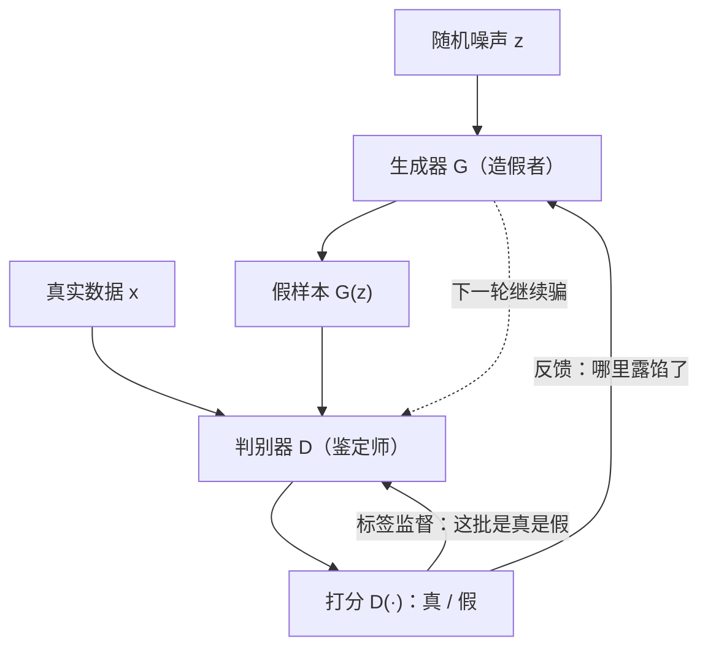
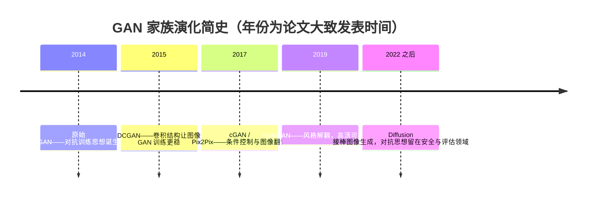

# 对抗生成网络（GAN）

> **一句话理解**：让一个"造假者"网络 G 和一个"鉴定师"网络 D 互相博弈、互相逼强，最终造假者产出的样本连鉴定师都分辨不出——不写概率公式，逼真就是硬道理。

[⬆️ 返回总目录](../../../README.md) · [⬆️ 返回本篇](../README.md) · [⬅️ 返回本章目录](./README.md)

| 属性 | 说明 |
|------|------|
| 难度 | ⭐⭐⭐⭐（高阶） |
| 所属分支 | 生成与多模态 |
| 前置知识 | [生成模型全景](./01-生成模型全景.md)；[神经网络是怎么炼成的](../../3-深度学习/04-深度学习基础/01-神经网络是怎么炼成的.md) |

---

## 📌 这一节解决什么问题

VAE 有清晰的概率目标，但生成结果偏模糊；直接写出图像的似然 $P(X)$ 又极其困难——像素空间动辄几十万维，"一张真实猫图的概率"根本算不动。

GAN（Generative Adversarial Network，生成对抗网络）干脆换了一条路：**不显式学分布，改学"骗过鉴定"**。既然难以度量"这张图有多像真图"，那就训练另一个网络来当裁判——裁判的辨别力越强，能骗过裁判的造假者就越厉害。生成质量不再靠公式度量，而靠一场不断升级的军备竞赛逼出来。

这个思路 2014 年提出后横扫图像生成领域数年：超分辨率、老照片修复、换脸，背后的主力大多是 GAN。它训练起来出了名地"玄学"，本页会把这套玄学的来龙去脉讲清楚。

## 🌱 通俗理解

想象一个**假画贩子**和一个**鉴定师**的猫鼠游戏：

- 贩子（生成器 G）拿着随机噪声当"颜料"，凭空仿造名画；
- 鉴定师（判别器 D）看画打分：真迹还是赝品；
- 每次贩子被识破，他就总结"哪里露馅了"，下次改进；每次被蒙混过关，鉴定师就升级手段，研究"这类赝品的破绽"。

注意两个关键点：**没有人教过贩子"真画的概率公式"**，他只从"被抓"的反馈里学；**鉴定师也从没见过"美术教材"**，他的眼力完全是被贩子逼出来的。两边互相逼强，若干回合后，贩子的假画连仪器都难分辨——这就是对抗训练（Adversarial Training）。

## 📋 举个例子

把这场博弈记录成状态表（**数字为示意**，标注"轮"在真实训练中对应成百上千次交替更新）：

| 轮次 | 假画水平（G） | 鉴定师水平（D） | 本轮结果 |
|------|---------------|------------------|----------|
| 第 1 轮 | 潦草涂鸦，颜色都不对 | 瞟一眼就能拒 | 100% 被识破 |
| 第 3 轮 | 大形对了，细节糊 | 需要看 10 秒 | 仍基本全被识破 |
| 第 6 轮 | 笔触、配色像样 | 得凑近看笔触和签名 | 偶尔骗过（约 3/10） |
| 第 9 轮 | 连画布龟裂纹都做出来了 | 要上仪器检测 | 一半对一半 |
| 第 12 轮 | 与真迹肉眼无差 | 用尽手段也只有五成把握 | 接近均衡：D ≈ 抛硬币 |

博弈论上，理想的终局是 D 对真假只能给出 50% 的判断——此时 G 造的分布与真实分布重合，鉴定失去意义。但真实训练往往到不了这么圆满，见下文"为什么难训"。

<details>
<summary>📊 展开：模式崩塌（Mode Collapse）的具体表现</summary>

模式崩塌（Mode Collapse）是 GAN 最著名的病：**G 发现某一种样本"最安全"，就只造这一种**。

具体表现：训练似乎收敛了（D 的判断在 50% 附近），但采样 100 张生成图，98 张是**同一张脸**——同一个角度、同一个表情、同一个光照，像复印机一样。剩下 2 张是这张"招牌脸"的轻微变体。

为什么会出现？因为 G 的目标只是"骗过 D"，而 D 的火力集中在多数模式上。对 G 来说，"画 100 种平庸的脸各有风险"不如"死磕 1 种极难识别的脸"划算——多样性和逼真度不是一回事，**博弈赢了，分布却塌了**。数据里本来有 1000 种长相，最后只剩 1 种。

</details>

## 🧠 核心原理

### 整体流程



### 逐步拆解

**1. 损失函数：一场极小极大博弈**

$$
\min_{G}\ \max_{D}\ V(D, G) = \mathbb{E}_{x \sim P_{\text{data}}}[\log D(x)] + \mathbb{E}_{z \sim P_{z}}[\log(1 - D(G(z)))]
$$

> 👉 **人话**：内层 $\max_D$：D 想把真样本判成 1、假样本判成 0，把右边两项都做大；外层 $\min_G$：G 想让 D 把假样本判成 1，把第二项做小。一个最大化、一个最小化，像拔河。理论最优解是 $D(x) = \tfrac{1}{2}$——鉴定师只能抛硬币，此时生成分布与真实分布重合。

拆开看两边的"KPI"。

D 的损失（就是一个二分类交叉熵）：

$$
L_D = -\mathbb{E}_{x}[\log D(x)] - \mathbb{E}_{z}[\log(1 - D(G(z)))]
$$

> 👉 **人话**：真样本标签 1、假样本标签 0，交叉熵损失——和第 3 章逻辑回归做的是同一件事，只是"假样本"是另一个网络现造的。

G 的损失（实践用的"非饱和"形式）：

$$
L_G = -\mathbb{E}_{z}[\log D(G(z))]
$$

> 👉 **人话**：G 的 KPI 只有一条——让 D 给我的假货打高分。原始公式里的 $\log(1-D)$ 在训练初期梯度太小（D 轻松分辨时 G 几乎学不动），换成这个形式梯度更足。

**2. 训练流程：交替训练一步 D、一步 G**

1. **固定 G，更新 D 一步**：采一批真样本 + G 现造一批假样本（detach，不让梯度流进 G），按上面的 $L_D$ 更新 D；
2. **固定 D，更新 G 一步**：采一批噪声，让 G 生成，以"骗过 D"为目标按 $L_G$ 更新 G；
3. 循环往复几千轮。**任何时刻只有一个网络在"被训练"**，另一个当环境。

**3. 为什么难训：博弈不平衡**

GAN 没有单一的总损失可以"最小化到收敛"，两边互相追逐带来两大经典病：

- **模式崩塌**：G 只造一种"安全脸"骗过 D（见上面折叠框）；
- **振荡不收敛**：G 追着 D 跑、D 反过来追 G，损失曲线上下横跳，"loss 下降 = 变好"的直觉在这里失效——判断训练好坏要看**生成样本本身**，不是 loss。

**4. 稳定化丹方**（工程经验，非理论保证）

- **标签平滑（Label Smoothing）**：真样本的目标从 1.0 改成 0.9，别把 D 惯得太自信——过度自信的 D 会给 G 断粮（梯度消失）；
- **谱归一化（Spectral Normalization）**一句话：给 D 的权重加上"变化幅度上限"，让 D 变强变慢、梯度更稳；
- **特征匹配（Feature Matching）**一句话：G 不只盯着 D 的最终打分，还去匹配 D 中间层特征的统计量，逼着 G 覆盖更多模式。

### 演化史：从原始 GAN 到 StyleGAN



- **原始 GAN**：证明了"对抗"这条路可行，但训练不稳、生成小图；
- **DCGAN**：给 G 和 D 换上卷积结构（见[第 5 章 · CNN](../../4-专业方向/05-计算机视觉/01-CNN卷积神经网络.md)），转置卷积让 G 能"从噪声上采样成图像"，是早期炼 GAN 的标配骨架；
- **cGAN（条件 GAN）**：把标签/条件喂给 G 和 D，实现"我要一只**橘色**的猫"这种定向生成；
- **StyleGAN**：风格解耦——把"发色、脸型、年龄、光照"拆成潜空间里**可以分开单独调节的旋钮**，实现高清人脸的精细编辑。

### 应用与思想遗产

- **应用**：老照片修复与上色、图像超分辨率（Real-ESRGAN 类工具的核心）、换脸与 **Deepfake 风险**（伪造人脸/音频被用于诈骗与虚假信息，检测与伪造的攻防仍在持续）、图像翻译 Pix2Pix（草图转彩图、白天转黑夜、缺失区域补全）；
- **思想遗产**：对抗训练这个**思想**早已越出图像生成——对抗样本（Adversarial Example）攻击与防御是模型安全的重要分支；"用一个模型考另一个模型"的思路也进了模型评估（如用模型互搏做红队测试、数据质检）。

## 💻 动手试试

用 PyTorch 写一个最小 GAN：在 2D 玩具数据（一个环形点云）上训练，几十秒就能看到生成点云逼近目标分布——**GAN 的所有核心机制（交替训练、互相博弈）都在这 30 行里**。

```python
import torch
import torch.nn as nn

torch.manual_seed(0)

# 目标分布：中心在 (2,2)、半径 2 的环形点云（当作"真实世界"）
def sample_real(n):
    ang = torch.rand(n) * 2 * torch.pi
    r = 2.0 + 0.1 * torch.randn(n)          # 半径带一点噪声
    return torch.stack([r * torch.cos(ang), r * torch.sin(ang)], dim=1) + 2.0

G = nn.Sequential(nn.Linear(2, 64), nn.ReLU(), nn.Linear(64, 64), nn.ReLU(), nn.Linear(64, 2))
D = nn.Sequential(nn.Linear(2, 64), nn.ReLU(), nn.Linear(64, 64), nn.ReLU(), nn.Linear(64, 1), nn.Sigmoid())
optG = torch.optim.Adam(G.parameters(), lr=2e-4, betas=(0.5, 0.999))  # beta1=0.5 是 GAN 的老传统
optD = torch.optim.Adam(D.parameters(), lr=2e-4, betas=(0.5, 0.999))
bce = nn.BCELoss()

for step in range(3000):
    # ---- 第 1 步：训练 D（真=1，假=0）----
    real = sample_real(128)
    fake = G(torch.randn(128, 2)).detach()   # detach：这次更新与 G 无关
    lossD = bce(D(real), torch.ones(128, 1)) + bce(D(fake), torch.zeros(128, 1))
    optD.zero_grad(); lossD.backward(); optD.step()

    # ---- 第 2 步：训练 G（让 D 把假样本判成"真"）----
    fake = G(torch.randn(128, 2))
    lossG = bce(D(fake), torch.ones(128, 1))
    optG.zero_grad(); lossG.backward(); optG.step()

with torch.no_grad():
    pts = G(torch.randn(1000, 2))
print("生成点的均值:", pts.mean(0).tolist())                # 应接近 [2.0, 2.0]
print("到中心的平均距离:", (pts - 2).norm(dim=1).mean().item())  # 应接近 2.0（环半径）
print("D 对真/假的平均打分:", D(sample_real(500)).mean().item(),
      D(G(torch.randn(500, 2))).mean().item())               # 两者都应离 0.5 不太远
```

预期输出：生成点落在环形上（均值 ≈ (2, 2)，到中心距离 ≈ 2.0），D 对真假样本的打分都徘徊在 0.5 附近——博弈接近均衡。多跑几个随机种子，你大概率会撞上一次"点云缩成一团"或"loss 发散"：恭喜，亲眼见证了 GAN 的难训。

## 🔥 炼丹小灶

> 🔥 **炼丹小灶**：GAN 训练玄学——
> - 配方：G/D 都用 Adam（lr≈1e-4~2e-4，beta1=0.5）、1:1 交替更新、batch 64 起步；
> - 玄学：D 太强（lossD 快速趋近 0）→ **降低 D 的学习率**或减少 D 的更新频率；G 突然躺平 → 换随机种子重来；loss 横跳是常态，**看生成样本别只盯 loss**；
> - ⚠️ 以上是经验参考值，不是圣旨；换数据集请重新炼。

## 🔗 在知识树中的位置

- **上游**：[生成模型全景](./01-生成模型全景.md)——四流派版图与"学分布"的框架；[CNN 卷积神经网络](../../4-专业方向/05-计算机视觉/01-CNN卷积神经网络.md)——DCGAN 一系的骨架；
- **下游**：[扩散模型Diffusion](./03-扩散模型Diffusion.md)——接棒 GAN 的图像生成新王，页内对比两者；[多模态模型](./04-多模态模型.md)——条件生成的思想延伸到文本条件；
- **横向对比**：VAE 稳但糊、GAN 锐但难训、Diffusion 稳且多样但慢（总览表见[生成模型全景](./01-生成模型全景.md)）。

## ⚠️ 常见误区

- **误区一**："loss 下降说明训练在变好" → GAN 是博弈，没有单一总损失；D 的 loss 稳定在低点反而可能是 G 已躺平，**评判标准只有生成样本本身**；
- **误区二**："D 越强越好" → D 过强会让 G 拿不到有效梯度（D 完美分辨时 G 的学习信号消失），训练需要的是**势均力敌**；
- **误区三**："GAN 被 Diffusion 淘汰了" → 图像生成主力确已易主，但超分、图像翻译等任务 GAN 仍是常客，且对抗训练思想活在安全攻防与模型评估里。

## 📝 小结与自测

**要点回顾**

- GAN = 造假者 G 与鉴定师 D 的极小极大博弈，理想均衡是 D 只能抛硬币；
- 训练是"一步 D、一步 G"的交替更新，任一时刻只训一个网络；
- 两大经典病：模式崩塌（只造一种样本）、振荡不收敛；
- 稳定化丹方：标签平滑、谱归一化、特征匹配（工程经验）；
- 演化线：原始 GAN → DCGAN（卷积）→ cGAN（条件）→ StyleGAN（风格解耦）。

**自测一下**（点击展开答案）

<details>
<summary>问题 1：训练 D 时为什么要对假样本做 detach？</summary>

detach 切断梯度向 G 的流动。训练 D 时 G 只是"假样本生产机"，是环境不是学生；不 detach 的话，更新 D 的梯度会同时改动 G，两个网络互相干扰，交替训练就乱了。

</details>

<details>
<summary>问题 2：模式崩塌时，D 的打分可能仍在 0.5 附近，为什么说训练已经"坏"了？</summary>

因为 G 可能靠"只造一种极难分辨的样本"骗过 D——博弈层面平了，但生成分布只覆盖真实分布的一小块（1000 种脸只剩 1 种）。多样性的丢失不会自动体现在 D 的 loss 上，必须看生成样本本身。

</details>

## 📚 延伸阅读

- 论文：Goodfellow et al., *Generative Adversarial Nets*（2014），[arXiv:1406.2661](https://arxiv.org/abs/1406.2661)
- 论文：Radford et al., *DCGAN*（2015），[arXiv:1511.06434](https://arxiv.org/abs/1511.06434)
- 论文：Karras et al., *A Style-Based Generator Architecture (StyleGAN)*（2019），[arXiv:1812.04948](https://arxiv.org/abs/1812.04948)
- 论文：Isola et al., *Image-to-Image Translation with Conditional Adversarial Networks (Pix2Pix)*（2017），[arXiv:1611.07004](https://arxiv.org/abs/1611.07004)

---

[⬅️ 上一页：生成模型全景](./01-生成模型全景.md) · [返回本章目录](./README.md) · [下一页：扩散模型Diffusion ➡️](./03-扩散模型Diffusion.md)
