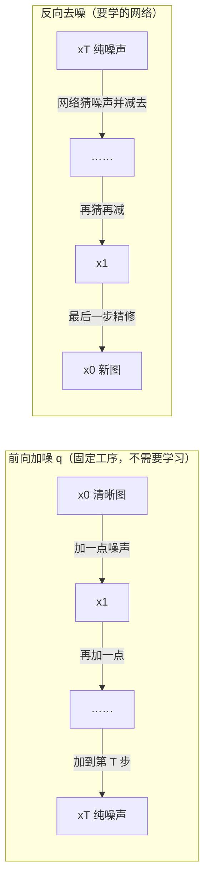
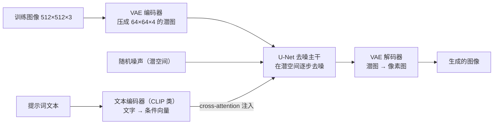
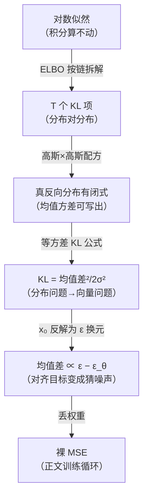

# 扩散模型（Diffusion）

> **一句话理解**：先把图像一步步加噪打成"纯噪声碎屑"，再训练一个网络学会从任意噪声状态里把噪声认出来；生成时从纯噪声出发一步步去噪，图像像从雾里慢慢浮现。

[⬆️ 返回总目录](../../../README.md) · [⬆️ 返回本篇](../README.md) · [⬅️ 返回本章目录](./README.md)

| 属性 | 说明 |
|------|------|
| 难度 | ⭐⭐⭐⭐（高阶） |
| 所属分支 | 生成与多模态 |
| 前置知识 | [生成模型全景](./01-生成模型全景.md)（VAE 的潜空间与 ELBO 统一视角会被复用）；[PyTorch快速上手](../../3-深度学习/04-深度学习基础/03-PyTorch快速上手.md) |

---

## 📌 这一节解决什么问题

GAN 的痛点上一页领教过了：两个网络互相博弈，训练像走钢丝，模式崩塌说来就来。工业界需要的是**训练稳定、多样性好、还能听懂文字指令**的生成模型。

Diffusion（扩散模型）的思路来自一个反直觉的观察：**破坏比创造容易得多**。把一张图加噪毁掉，谁都会；而"从噪声里恢复一张图"虽然难，但可以拆成几百个"每次只恢复一点点"的小步骤——每个小步骤简单到能用一个普通网络学会。于是训练变成一个平平无奇的回归问题（猜噪声），没有任何博弈，稳定性碾压 GAN。2020 年 DDPM 问世后，这条路线迅速接管了图像生成，Stable Diffusion 等文生图工具皆由此而来。

上一页埋的伏笔在此兑现：Diffusion 不是凭空冒出的新门派——它和 VAE 同属"优化 ELBO 的隐变量模型"一家人（第 01 页"统一视角"）。本页会把这条推导线走完：**从 ELBO 出发，一步步化简出"猜噪声的 MSE"**，再讲清采样加速（DDIM）、条件控制（CFG）、算力工程（潜空间）三件决定它能否上生产的事。

## 🌱 通俗理解

把图像想成一尊**雕像**：

- **前向过程（加噪）**：把雕像一步步敲成碎屑——每一步只敲掉一点，敲一千步后彻底成一堆均匀的碎末（纯噪声）。这一步不需要学习，纯粹是破坏，过程完全可控、可复现；
- **反向过程（去噪）**：从一堆碎屑出发，一步步把它复原成雕像。一步复原是天方夜谭，但"每一步只把碎屑整理得稍微有序一点"是可以学的手艺。

学去噪的手艺人（神经网络）练的是一门朴素功夫：**给你一堆半乱不乱的碎屑，告诉你这是敲了 300 步的状态，请猜出"上一次敲掉的是哪些碎屑"**。猜得越准，往回复原得越好。生成 = 从纯碎屑开始，把这门手艺倒着执行一千次，雕像（图像）便渐渐显形。

和 GAN 的"军备竞赛"比，Diffusion 更像**临摹练习**：每次随机抽一尊雕像、随机敲到某个进度，然后考网络"猜敲掉的部分"——单一目标、监督明确、想不稳都难。代价是**生成慢**：军备竞赛结束后画师一笔就出画，临摹手艺却要来回踱步几十上千次——这个"慢"是本页后半场（DDIM、潜空间）要解决的核心矛盾。

## 📋 举个例子

把一张 8×8 的"笑脸"图按固定步长加噪 3 步（**简化演示**：真实模型用约 1000 步、每步噪声量极小；下面的数字是一次随机抽样的示意值，每次运行都会不同）。

加噪规则（每步 $\beta = 0.3$）：$x_t \approx 0.84 \times x_{t-1} + 0.55 \times \epsilon$，其中 $\epsilon$ 是每个像素独立抽的标准正态噪声。（这两个系数正是 $\sqrt{1-\beta}=\sqrt{0.7}\approx 0.84$ 与 $\sqrt{\beta}=\sqrt{0.3}\approx 0.55$，来历见核心原理第 1 节。）

原始图 $x_0$（1 = 黑色笔划，0 = 白色背景）：

```text
0 0 0 0 0 0 0 0
0 1 1 0 0 1 1 0
0 1 1 0 0 1 1 0
0 0 0 0 0 0 0 0
0 1 0 0 0 0 1 0
0 0 1 0 0 1 0 0
0 0 0 1 1 0 0 0
0 0 0 0 0 0 0 0
```

加噪 1 步后的 $x_1$（保留两位小数）：

```text
 0.44 -0.12  0.31  0.05 -0.62  0.27  0.49 -0.08
 0.21  1.02  0.67 -0.13  0.35  0.91  1.25 -0.40
-0.33  0.85  1.10  0.18 -0.52  0.74  0.59  0.06
-0.25  0.15 -0.41  0.60  0.02 -0.37  0.53  0.19
 0.32  0.97 -0.21  0.43 -0.15  0.28  0.88 -0.33
 0.11 -0.44  1.05  0.24 -0.58  0.79  0.13 -0.26
-0.36  0.22  0.47  1.13  0.82 -0.19  0.35 -0.51
 0.28 -0.17  0.05  0.39 -0.44  0.16 -0.28  0.61
```

看两点：原本是 1 的位置数值整体偏高（信号还在），原本是 0 的位置被噪声抬离了 0。继续往下走 2 步会怎样？

<details>
<summary>📊 展开完整算例：第 2、3 步的数值变化</summary>

加噪 2 步后的 $x_2$（$x_2 \approx 0.84 \times x_1 + 0.55 \times \epsilon_2$）：

```text
 0.05 -0.92  0.71 -0.33  1.02 -0.18 -0.66  0.55
 0.83  0.24  1.35 -0.61 -0.09  1.12  0.47 -1.18
-1.05  0.98  0.32  0.87 -0.44 -1.32  0.91  0.16
 0.42 -1.27  0.19  0.66 -0.87  1.08 -0.35  0.73
-0.19  1.42 -0.88  0.51  0.94 -0.26  0.17 -1.01
 0.67  0.08 -0.53  1.21 -1.44  0.85  0.39 -0.72
-0.81  1.09 -0.28  0.94  1.33 -0.66  0.52 -1.36
 0.34 -0.49  1.16 -0.75  0.28  0.61 -1.22  0.45
```

加噪 3 步后的 $x_3$：

```text
 1.32 -0.87  0.44 -1.51  0.76  1.18 -0.35  0.92
-0.61  1.78 -1.24  0.83 -1.05  0.37  1.56 -0.44
 0.98 -1.42  1.67 -0.28 -1.83  1.05  0.52 -1.17
-1.36  0.59  1.23  0.35  1.71 -0.92  1.08 -0.63
 0.47 -1.18  1.85 -0.74  0.22 -1.59  0.81  1.42
-1.72  1.31 -0.45  1.63  0.58 -1.09  1.94 -0.36
 1.14 -0.68 -1.31  0.42  1.27 -1.55  0.33  0.98
-0.53  1.61 -0.96  1.38 -0.47  0.71 -1.28  0.55
```

观察趋势：**第 1 步**肉眼还能认出笑脸的轮廓（1 的位置明显偏亮）；**第 2 步**只有隐约的痕迹；**第 3 步**已和随机噪声难以区分——眼睛基本失效，但统计学上"原本为 1 的区域均值仍略高"，这丝微弱的规律正是去噪网络要抓的东西。真实模型走约 1000 步，最后一步得到的就是纯标准正态噪声。

用闭式公式验算一步（核心原理第 1 节）：3 步、每步 $\beta=0.3$ 时 $\bar\alpha_3 = 0.7^3 = 0.343$，故 $x_3 \sim \mathcal{N}(0.586\, x_0,\ 0.810^2)$——上面矩阵里"原 1 位置均值 ≈ 0.59 附近、原 0 位置均值 ≈ 0 附近"正对得上。

</details>

## 🧠 核心原理

### 整体流程



### 逐步拆解

**1. 前向过程：每一步只撒一点高斯噪声**

$$
q(x_t \mid x_{t-1}) = \mathcal{N}\big(x_t;\ \sqrt{1-\beta_t}\, x_{t-1},\ \beta_t \mathbf{I}\big)
$$

> 👉 **人话**：每一步把图像稍微"调暗"一点（乘 $\sqrt{1-\beta_t}$，保证方差不爆），再撒上一层方差为 $\beta_t$ 的高斯噪声。$\beta_t$ 是提前定好的小数字（比如从 0.0001 慢慢涨到 0.02），整个破坏工序没有任何要学的东西。

而且前向有闭式解——不用真的一步步加，可以从 $x_0$ 一步跳到任意 $x_t$：

$$
q(x_t \mid x_0) = \mathcal{N}\big(x_t;\ \sqrt{\bar{\alpha}_t}\, x_0,\ (1-\bar{\alpha}_t)\mathbf{I}\big), \qquad \bar{\alpha}_t = \prod_{s=1}^{t}\alpha_s,\ \ \alpha_s = 1-\beta_s
$$

> 👉 **人话**：$\bar{\alpha}_t$ 是各步信号的"剩余量"——训练时随机抽一个步数 $t$，用这行公式直接算出 $x_t$，省去循环，这是 Diffusion 训练高效的关键。上面笑脸算例里"0.84、0.55"两个系数，就是 $\beta=0.3$ 时 $\sqrt{\alpha}, \sqrt{\beta}$ 的取值。

<details>
<summary>🧮 展开推导一：闭式公式的由来——独立高斯相加性质 + 数学归纳</summary>

**唯一的工具**：两个**独立**高斯随机变量相加仍是高斯，均值相加、方差相加；更一般地，$a\,\epsilon_1 + b\,\epsilon_2$（$\epsilon_{1,2}$ 独立标准正态）$\sim \mathcal{N}(0,\, a^2+b^2)$。

$$
\epsilon_1 \sim \mathcal{N}(m_1, v_1),\ \epsilon_2 \sim \mathcal{N}(m_2, v_2)\ \text{独立} \;\Rightarrow\; \epsilon_1 + \epsilon_2 \sim \mathcal{N}(m_1+m_2,\ v_1+v_2)
$$

**归纳法**：命题为"$x_t = \sqrt{\bar\alpha_t}\,x_0 + \sqrt{1-\bar\alpha_t}\,\bar\epsilon$，其中 $\bar\epsilon$ 是标准正态"。

- **基础步**：$t=1$ 时 $\bar\alpha_1 = \alpha_1$，由定义 $x_1 = \sqrt{\alpha_1}\,x_0 + \sqrt{1-\alpha_1}\,\epsilon$，成立；
- **归纳步**：设 $x_{t-1} = \sqrt{\bar\alpha_{t-1}}\,x_0 + \sqrt{1-\bar\alpha_{t-1}}\,\bar\epsilon$。按单步规则 $x_t = \sqrt{\alpha_t}\,x_{t-1} + \sqrt{1-\alpha_t}\,\epsilon'$，代入：

$$
x_t = \underbrace{\sqrt{\alpha_t\,\bar\alpha_{t-1}}}_{=\sqrt{\bar\alpha_t}}\ x_0 \; + \underbrace{\sqrt{\alpha_t(1-\bar\alpha_{t-1})}\,\bar\epsilon + \sqrt{1-\alpha_t}\,\epsilon'}_{\text{两个独立标准正态的加权和}}
$$

噪声项的系数平方和 $= \alpha_t(1-\bar\alpha_{t-1}) + (1-\alpha_t) = 1 - \alpha_t\bar\alpha_{t-1} = 1-\bar\alpha_t$，由开头的性质可合并成 $\sqrt{1-\bar\alpha_t}\,\bar\epsilon'$。命题得证。

**手算验算**（和上面的笑脸算例对上）：每步 $\beta=0.3$、走 2 步：$\bar\alpha_2 = 0.7^2 = 0.49$，故 $x_2 \sim \mathcal{N}(0.7\,x_0,\ 0.714^2)$；走 3 步：$\bar\alpha_3 = 0.343$，$x_3 \sim \mathcal{N}(0.586\,x_0,\ 0.810^2)$——一步一步循环加，和一步到位，分布完全一致。

> 👉 **人话**：几百步小噪声可以"合并报销"成一个大噪声，靠的就是高斯家族"独立相加仍是高斯"的好性质——选高斯不是审美，是唯一能这么方便算的常见分布。信号系数 $\sqrt{\bar\alpha_t}$ 单调降到 0、噪声系数 $\sqrt{1-\bar\alpha_t}$ 单调升到 1：**加噪进度条**。

</details>

**2. 训练目标：猜噪声的 MSE——从 ELBO 推出来（不是拍脑袋）**

$$
\mathcal{L} = \mathbb{E}_{x_0,\, \epsilon,\, t}\Big[\big\|\epsilon - \epsilon_\theta(x_t,\, t)\big\|^2\Big], \qquad x_t = \sqrt{\bar{\alpha}_t}\,x_0 + \sqrt{1-\bar{\alpha}_t}\,\epsilon
$$

> 👉 **人话**：训练循环三步走——随机抽一张图 $x_0$、随机抽一个步数 $t$、随机撒一份噪声 $\epsilon$ 用闭式公式算出 $x_t$；然后考网络："这个 $x_t$ 里我撒的是哪份噪声？"损失就是预测噪声和真噪声的均方差。**没有博弈、没有判别器，就是一个再普通不过的回归问题**——这是它训练稳定的根源。

这个看似朴素的 MSE 是第 01 页"统一视角"承诺的推导闭环：把隐变量取为整条加噪链 $(x_1,\dots,x_T)$、把 $q$ 固定为加噪工序，**最大化 ELBO 一步步化简后恰好就是它**——推导见折叠框。这也回答了一个常被问的问题：**为什么训练目标是"预测噪声"而不是"预测图像"？**

<details>
<summary>🧮 展开推导二：从变分界到"猜噪声 MSE"（含为什么预测噪声）</summary>

**第 1 步：写出变分界**。负对数似然按第 01 页的分解 $\log p(x_0) = \text{ELBO} + \text{KL}(q(z|x_0)\,\|\,p(z|x_0))$，对隐变量链 $(x_1,\dots,x_T)$ 展开，交叉项用贝叶斯链式法则逐层拆开，得到（每项都是可算的两个高斯之间的 KL 或熵）：

$$
-\log p_\theta(x_0) \leq \mathbb{E}_q\Big[\underbrace{D_{\mathrm{KL}}\big(q(x_T|x_0)\,\|\,p(x_T)\big)}_{T\to\infty 时\approx 0} + \sum_{t=2}^{T} D_{\mathrm{KL}}\big(q(x_{t-1}|x_t,x_0)\,\|\,p_\theta(x_{t-1}|x_t)\big) - \log p_\theta(x_0|x_1)\Big]
$$

**第 2 步：明确两个高斯**。$q(x_{t-1}|x_t,x_0)$ 是可以写出闭式的"真反向分布"（由前向工序和贝叶斯公式算出，为高斯，均值记 $\tilde\mu_t(x_t,x_0)$）；模型这边把反向参数化 $p_\theta(x_{t-1}|x_t)=\mathcal{N}(\mu_\theta(x_t,t),\ \Sigma_\theta)$，方差 $\Sigma_\theta$ 直接取成与 $q$ 相同的固定值——于是**每个 KL 项只剩"两个高斯均值之差的平方"**。

**第 3 步：把均值改写成噪声**。把闭式解 $\tilde\mu_t$ 里的 $x_0$ 用反解公式 $x_0 = \big(x_t - \sqrt{1-\bar\alpha_t}\,\epsilon\big)/\sqrt{\bar\alpha_t}$ 替换，整理后 $\tilde\mu_t$ 变成"只含 $x_t$ 和 $\epsilon$"的表达式；再把模型的 $\mu_\theta$ 参数化为同一形状、其中 $x_0$ 的位置换成网络输出 $\epsilon_\theta(x_t,t)$。两均值相减，$x_t$ 的项抵消，剩下的恰好是：

$$
\mathcal{L}_t = \frac{\beta_t^2}{2\sigma_t^2\,\alpha_t\,(1-\bar\alpha_t)}\, \mathbb{E}\Big[\big\|\epsilon - \epsilon_\theta(x_t, t)\big\|^2\Big]
$$

**第 4 步：扔掉权重**。DDPM 的作者发现把前面的系数系数扔掉（全部取 1）训练**更稳**（高噪声步的权重原本过大，会淹没低噪声步的学习信号），于是得到正文那个裸 MSE。

**为什么是预测噪声而不是预测图像？** 三种参数化数学上等价（知道 $\epsilon_\theta$ 就能反解 $\hat x_0 = (x_t-\sqrt{1-\bar\alpha_t}\epsilon_\theta)/\sqrt{\bar\alpha_t}$，反之亦然；另有 v-prediction 折中方案），但**学习难度完全不同**：

- **预测 $\epsilon$**：目标永远是"当初撒进去的标准正态噪声"，零均值、单位方差、统计性质不随 $t$ 变——网络面对的是稳定的回归目标；
- **预测 $x_0$**：在大 $t$（高噪声）时，等于要求网络从几乎纯噪声里"凭空脑补整张图"，早期训练信号混乱、目标方差巨大；
- 一个直观数字：$\bar\alpha_t \to 0$ 时反解公式里 $\sqrt{\bar\alpha_t}$ 在分母，$x_0$ 的微小预测误差会被放大成 $x_t$ 空间里的巨大误差——预测 $\epsilon$ 把这个病态缩放从目标里拿掉了。

> 👉 **人话**：变分界层层化简后，"把下界顶上去"这件事等价于"每一步把撒进去的噪声猜准"。选"猜噪声"而不是"猜原图"，是因为噪声的目标分布永远干净稳定，而"从灰里猜原图"在高噪声步是在为难网络——同一道数学题，挑了个对学员最友好的解法。

</details>

**3. 采样：从 DDPM 到 DDIM——随机下山 vs 沿固定路走**

从纯高斯噪声出发，每步用网络估出噪声、减掉一大半，再补回一点点随机（保持分布正确），循环往复。原版 DDPM 走 1000 步，借助采样加速技巧通常压到 20~50 步——步数是**质量与延迟的旋钮**。两条路线的差异值得单独说清：

| | DDPM（祖先采样） | DDIM（确定性采样） |
|---|---|---|
| 每步做什么 | 减噪声后**再注入新鲜随机噪声** $\sigma_t z$ | 减噪声、**不注入**随机（$\sigma_t=0$） |
| 轨迹性质 | 随机过程：同一起点，每次结果不同 | 确定性映射：同一起点噪声，必得同一张图 |
| 为什么能少步 | 大步走时随机注入失衡，步数难压 | 轨迹近似一条概率流 ODE（常微分方程），可用大步长积分 |
| 典型步数 | 数百~1000 | 20~50 |
| 独门玩法 | 天然多样性 | 固定噪声改提示词 → 平滑变化的图生图/插值动画 |

DDIM 加速的**来源**（不是重训、不是蒸馏）：它注意到训练目标只用到了边缘分布 $q(x_t\mid x_0)$（闭式公式那行），根本没用到马尔可夫性质——于是构造一族**共享同样边缘分布的非马尔可夫前向过程**，对应的反向过程允许确定性采样；确定性轨迹平滑，用大步长"跨台阶"时误差小。DDPM 的随机步在大步长时，每步注入的随机量和减掉的噪声量对不上账，质量塌得快。

> 👉 **人话**：DDPM 像蒙着眼随机下山，每步还晃一下；DDIM 先把眼罩摘了、沿着一条固定的路走——路是固定的，就能跨大步。代价是 DDIM 少了"随机注入"这份天然多样性，同噪声同结果（好处是可控、可复现）。

**4. 条件生成：文本怎么进来 + CFG 的公式**

- 文本先过文本编码器变成一组向量，在去噪网络的**交叉注意力（Cross-Attention）**层注入——去噪的每一步都"看一眼"提示词再决定怎么修（注意力的机制见[第 7 章 · Transformer 与注意力机制](../../4-专业方向/07-自然语言处理与LLM/02-Transformer与注意力机制.md)）；
- **分类器自由引导（CFG，Classifier-Free Guidance）**：每步把"有提示"和"无提示"的去噪各算一遍，然后沿（有 − 无）的方向外推。公式：

$$
\tilde{\epsilon} = \epsilon_u + w\cdot\big(\epsilon_c - \epsilon_u\big)
$$

> 👉 **人话**：$\epsilon_c$ 是"听提示"的去噪方向，$\epsilon_u$ 是"自由发挥"的方向，两者之差 $\epsilon_c - \epsilon_u$ 就是**提示词的"推动力"**；CFG 把这份推动力放大 $w$ 倍——"按提示的力度再大一点"。代价是每步两次前向（工程上把条件/无条件拼成一个 batch 一次算）。

权重 $w$ 的效果表（生产上调的第一个旋钮）：

| $w$ | 现象 | 风险/诊断 |
|-----|------|-----------|
| $< 1$ | 更多样、更飘，提示词形同虚设 | 图"不听话"先查是不是 $w$ 太低 |
| $= 1$ | 纯条件生成，不加外推 | 常偏"发散"、遵从度不足 |
| $3 \sim 7.5$ | 遵从度与质量的常用甜点区（社区默认多在 7 附近） | 相对安全 |
| $> 10$ | 对比度拉满、色彩过饱和、构图僵硬、多样性骤降 | 典型"提示词过强伪影"——不是模型坏了，是外推过头 |
| $> 20$ | 画面烧灼感、纹理破碎 | 基本不可用 |

**5. U-Net：跳线如何保住细节**

去噪主干是 U-Net（2015 年医学图像分割留下的架构，名字来自形状）：输入逐层**下采样**（分辨率降、语义变抽象），再逐层**上采样**恢复分辨率；**跳线连接（Skip Connection）把每级下采样的特征图直接接到同分辨率的上采样层**。

机制：下采样是"压缩"——细节被丢掉、语义被提炼；如果只有压缩后的语义，解码器必须从"这是一只猫在窗台上"这种抽象概念里**重新发明**毛发、窗框的每个像素级边缘。跳线把压缩时丢掉的高频信息**原样递回**给同分辨率的解码层，解码器只需做"语义 × 细节"的对齐，不用凭空重建。

> 👉 **人话**：去噪网络的输出是"和输入同分辨率的噪声图"——要精确指出每个位置该去掉多少噪声，就必须看得到输入 $x_t$ 里每个位置的边缘纹理。跳线就是把这些低层特征"抄送"给解码端的近路：**语义负责决定修哪里，跳线负责提供修的精度**。若砍掉跳线，生成结果会整体合理、细节糊掉——这是分辨"网络容量不足"与"结构问题"的一个快速诊断。

**6. 噪声调度：早步晚步各该多吵**

$\{\beta_t\}$ 的整体设计叫噪声调度（Noise Schedule）。两个经典方案：

- **线性调度**（DDPM 原版）：$\beta_t$ 从 1e-4 线性升到 0.02——早步轻、晚步重；
- **余弦调度**（Nichol & Dhariwal 提出）：$\bar\alpha_t = f(t)/f(0)$，$f(t)=\cos^2\!\big(\tfrac{t/T+s}{1+s}\cdot\tfrac{\pi}{2}\big)$——中段噪得更快，末段恰好打满。

为什么要改？线性调度用在图像上有个隐蔽问题：像素分布高度集中在某个区间附近（大量近似的背景色），线性调度的**末段"销毁不彻底"**——$\bar\alpha_T$ 没有足够接近 0，$x_T$ 里残留一点可被网络识别的统计规律，采样起点不纯，生成结果出现系统性偏色。余弦调度保证 $t=T$ 时信号干净归零。

| 阶段（以 $t$ 从 0 到 $T$） | 该多吵 | 原因 |
|------|--------|------|
| 早步（$t$ 小） | 轻噪 | 图还清晰，细节（高频信息）脆弱，重噪一步毁掉太多 |
| 中步 | 加速变吵 | 把"内容级"的信息逐步替换成噪声 |
| 末步（$t \to T$） | 必须噪满 | $\bar\alpha_T \to 0$：保证 $x_T$ 是纯标准正态，采样起点才合法 |

> 👉 **人话**：调度就是"破坏的节奏表"——前轻后重、终点归零。节奏错了有两种病：末段噪不满 → 起点"不纯"，生成图带系统性偏差（余弦调度治这个）；早段噪太狠 → 细节永远学不回来。

### Stable Diffusion 三件套

直接在像素上做扩散太贵（512×512×3 ≈ 78 万维）。Stable Diffusion 的答案是"先压缩、再扩散"：



- **VAE**：把像素压到低维潜空间（Latent Space），扩散全部在潜空间进行——第 01 页的 VAE 没有过时，它成了 Diffusion 的"省电模式"；
- **U-Net**：去噪主干网络，负责"看噪声、看步数、看提示词，猜该去掉什么"；
- **文本编码器（CLIP 类）**：把文字变成条件向量——这个编码器正是下一页多模态的主角。

<details>
<summary>🧮 展开算力账：潜空间到底省多少（量级实算）</summary>

**账本一：要算的数字个数**。512×512×3 的像素图有 $786{,}432$ 个数；VAE 压到 64×64×4 后只剩 $16{,}384$ 个——**压缩 48 倍**。

**账本二：注意力的 token 数平方**。U-Net 里的自注意力按 token 数平方收费：512×512 图按 16×16 patch 切是 $32\times32=1024$ 个 token，注意力矩阵 $1024^2 \approx 105$ 万项；潜图 64×64 同样切是 256 个 token，$256^2 \approx 6.6$ 万项——**注意力开销省 16 倍**。

**账本三：卷积计算量随分辨率平方**。卷积在每个空间位置上做同样多的乘加，位置数 $64^2/512^2 = 1/64$——**卷积开销省 64 倍**。

三项合起来，去噪主干的整体算力省约 **1~2 个数量级**——这就是"同样一张卡，像素扩散要分钟级、潜空间扩散只要秒级"的来源。

**代价**（失效边界）：压缩是有损的——极小文字、精细纹理偶尔在 VAE 重建时就糊了，去噪再好也救不回（病根在编解码器，不在扩散）。所以生产上小字排版常走"生成 + 后期文字合成"或"局部超分"补救。

> 👉 **人话**：潜空间扩散 = 先把画布换成"缩略图草稿"，在草稿上做全部精细创作，最后一口气放大成画。快了一个数量级，代价是放大时偶尔丢掉最细的笔触。

</details>

### 为什么 Diffusion 击败了 GAN

| 维度 | GAN | Diffusion |
|------|-----|-----------|
| 训练稳定性 | 双网络博弈，易振荡、易崩 | 单一回归损失，非常稳 |
| 多样性 | 模式崩塌风险高 | 覆盖分布，多样性好 |
| 可控性 | 条件控制要专门设计 | 文本条件 + CFG 天然可控 |
| 生成速度 | 一步前向，快 | 多步迭代，慢（靠蒸馏/少步采样补救） |
| 典型伪影 | 锐利但有纹理伪影 | 整体更干净、伪影少 |

<details>
<summary>🔍 展开：30 步采样的每一步大致发生什么</summary>

用"修雕像"的比喻过一遍 30 步采样（步数是示意）：

- **第 1~5 步（纯碎末期）**：画面仍是均匀噪声，去噪网络做的是"确定大方向"——构图、大色块、物体大致位置在这一阶段定型；
- **第 6~20 步（成形期）**：主体轮廓与主要细节逐步清晰，背景纹理跟进；提示词的引导（CFG）主要在这些步骤发力，权重削得最狠；
- **第 21~28 步（精修期）**：局部细节——毛发、文字、边缘锐度——被逐层"抛光"，大结构基本不再变动；
- **第 29~30 步（收尾）**：最后一步不再补随机噪声，做一次干净的确定性去噪，潜图交给 VAE 解码成像素图。

这就是为什么采样步数不能无限砍：步数太少，"成形期"被压缩，物体容易畸形或细节缺失；太多则收益递减、延迟白白变长。

</details>

### 失效模式速查表

| 症状 | 常见病因 | 诊断方法 | 补救 |
|------|----------|----------|------|
| 生成图整体灰蒙蒙/偏色 | 调度末段没噪满，或 VAE 重建偏色 | 拿真实图过 VAE 编码再解码，对比是否偏色（把扩散摘出去单独测） | 换余弦调度/换 VAE 版本 |
| 小字乱码、精细纹理糊 | 潜空间压缩有损 + 高频细节天生难 | 同上：看 VAE 直接重建的小字是否已糊 | 文字后期合成、局部重绘、超分 |
| 手部/肢体崩坏 | 采样步数太少或 CFG 过高 | 步数加倍重采对比；CFG 降到 5 重采对比 | 加步数、降 CFG |
| 多主体构图错乱、属性张冠李戴 | 提示词过长稀释 + CFG 高 | 缩短提示词重试 | 拆分生成、区域条件控制类方案 |
| "不遵从提示词" | CFG 过低 / 文本编码器弱 | 同图同种子只调 $w$ 对比 | 先调 $w$ 再怀疑模型 |

### 📐 数学深潜：高斯相加的归纳证明——几百步噪声如何"合并报销"

**严格陈述**。两个命题：

1. **封闭性**：$\epsilon_1 \sim \mathcal{N}(m_1, v_1)$、$\epsilon_2 \sim \mathcal{N}(m_2, v_2)$ **独立**，则对任意常数 $a, b$：

$$
a\,\epsilon_1 + b\,\epsilon_2 \;\sim\; \mathcal{N}\big(a\,m_1 + b\,m_2,\; a^2 v_1 + b^2 v_2\big)
$$

2. **归纳到 t 步**：由单步规则 $x_t = \sqrt{\alpha_t}\,x_{t-1} + \sqrt{1-\alpha_t}\,\epsilon'$（$\epsilon' \sim \mathcal{N}(0,I)$ 与历史独立）可归纳出闭式公式：

$$
x_t = \sqrt{\bar\alpha_t}\,x_0 + \sqrt{1 - \bar\alpha_t}\;\bar\epsilon, \qquad \bar\epsilon \sim \mathcal{N}(0, I),\quad \bar\alpha_t = \prod_{s=1}^t \alpha_s
$$

> 👉 **人话**：独立高斯相加仍是高斯（均值、方差直接相加）——这条"家族封闭性"让 T 步小噪声可以一步合并成一个大噪声，训练时随机抽 $t$ 就能一键造出"敲到任意进度"的样本。选高斯不是审美，是**唯一能这么方便算的常见分布**。

<details>
<summary>🧮 展开完整证明：矩母函数验证封闭性 + 数学归纳（不跳步）</summary>

**第 1 步：高斯的矩母函数（MGF）。** 对 $X \sim \mathcal{N}(m, v)$，定义 $M_X(t) = \mathbb{E}[e^{tX}]$。配方验证（把指数配成完全平方）：

$$
\mathbb{E}[e^{tX}] = \int e^{tx}\,\frac{1}{\sqrt{2\pi v}}e^{-\frac{(x-m)^2}{2v}}dx = e^{mt + \frac{vt^2}{2}}\underbrace{\int \frac{1}{\sqrt{2\pi v}}e^{-\frac{(x-m-vt)^2}{2v}}dx}_{=\,1\text{（高斯密度积分）}} = e^{mt + vt^2/2}
$$

MGF 若在 $t=0$ 邻域存在则**唯一决定分布**——这是本证明的合法身份证。

**第 2 步：独立和的 MGF 相乘。** 设 $X, Y$ 独立，则 $e^{t(X+Y)} = e^{tX}\cdot e^{tY}$ 且两因子独立（期望可拆）：

$$
M_{X+Y}(t) = \mathbb{E}[e^{tX}]\,\mathbb{E}[e^{tY}] = e^{(m_1+m_2)t + (v_1+v_2)t^2/2}
$$

这恰是 $\mathcal{N}(m_1{+}m_2,\ v_1{+}v_2)$ 的 MGF——由唯一性，$X + Y$ 服从该分布。倍乘 $a\,\epsilon_1$ 显然是 $\mathcal{N}(am_1, a^2v_1)$（换元即可），合并得命题 1。

**第 3 步：归纳法证明闭式公式。** 命题 $P(t)$："$x_t = \sqrt{\bar\alpha_t}\,x_0 + \sqrt{1-\bar\alpha_t}\,\bar\epsilon_t$，$\bar\epsilon_t$ 标准正态"。

- **基础步** $t=1$：$\bar\alpha_1 = \alpha_1$，由单步定义 $x_1 = \sqrt{\alpha_1}x_0 + \sqrt{1-\alpha_1}\,\epsilon$，$P(1)$ 成立；
- **归纳步**：设 $P(t{-}1)$ 真。单步规则给 $x_t = \sqrt{\alpha_t}\,x_{t-1} + \sqrt{1-\alpha_t}\,\epsilon'$（$\epsilon'$ 与 $\bar\epsilon_{t-1}$ 独立——每步新撒的噪声与历史无关）。代入归纳假设：

$$
x_t = \sqrt{\alpha_t}\big(\sqrt{\bar\alpha_{t-1}}\,x_0 + \sqrt{1-\bar\alpha_{t-1}}\,\bar\epsilon_{t-1}\big) + \sqrt{1-\alpha_t}\,\epsilon'
= \underbrace{\sqrt{\alpha_t\bar\alpha_{t-1}}}_{=\sqrt{\bar\alpha_t}}\,x_0 + \underbrace{\sqrt{\alpha_t(1-\bar\alpha_{t-1})}\,\bar\epsilon_{t-1} + \sqrt{1-\alpha_t}\,\epsilon'}_{\text{两个独立标准正态的加权和}}
$$

噪声项的两个系数平方和（命题 1 的方差合成）：

$$
\alpha_t(1 - \bar\alpha_{t-1}) + (1 - \alpha_t) = 1 - \alpha_t\bar\alpha_{t-1} = 1 - \bar\alpha_t
$$

故两项按命题 1 合并为 $\sqrt{1-\bar\alpha_t}\,\bar\epsilon_t$（标准正态）。$P(t)$ 真，归纳完成。

**第 4 步：数值验算**（正文笑脸例子，$\beta = 0.3$、$\alpha = 0.7$）：$t=2$：$\bar\alpha_2 = 0.49$，$x_2 \sim \mathcal{N}(0.7\,x_0,\ 0.714^2)$；$t=3$：$\bar\alpha_3 = 0.343$，$x_3 \sim \mathcal{N}(0.586\,x_0,\ 0.810^2)$——逐步循环加噪与一步到位，分布完全一致（正文算例可验）。

</details>

**几何解释**（配图）：加噪进度条——信号系数单调降、噪声系数单调升，两条曲线在 $t$ 轴上完成"权力交接"：

```text
系数
 1.0 ┤●信号 √ᾱt  ─╲                    ╱─ ●噪声 √(1−ᾱt)
     │              ╲                ╱
 0.5 ┤               ╲            ╱
     │                ╲        ╱
 0.0 ┤                 ●──────●
     └──────┬──────┬──────┬──────┬──► t（加噪步数）
           0     T/4    T/2    3T/4   T
     前段：图还看得见 → 后段：纯噪声；
     任何 t 都可由闭式公式直接采样（无需循环）——归纳法的工程红利。
```

**反例与边界**：

- **独立性必不可少**：命题 1 的方差相加隐含协方差为零；若两步噪声相关（$a\epsilon_1 + b\epsilon_2$ 的方差应为 $a^2v_1 + b^2v_2 + 2ab\,\mathrm{Cov}$），闭式公式不成立——DDPM 每步**重采**新噪声正是为了让独立性成立；
- **高斯性必不可少**："同族封闭"是高斯的特权——两个独立均匀分布相加是三角分布，再加一次又不是三角分布，没有闭式进度条（选调度的自由度也被锁死）；
- **$\bar\alpha_T \to 0$ 要调度保证**：归纳公式只说"如果走到 T 步会怎样"；线性调度可能 $\bar\alpha_T$ 未充分归零、采样起点"不纯"（上文噪声调度一节的偏色病根）——公式与调度是两件事，边界在调度侧。

> 👉 **一句人话**：独立高斯"越加越高斯"，几百步小破坏能一键折算成一个等效大破坏——训练时"随机抽进度条上任意一点"因此是免费的，这是 Diffusion 训练高效的第一块地基。

### 📐 数学深潜：变分界 → 猜噪声 MSE 的推导骨架

**严格陈述**。DDPM 的负对数似然上界（由第 01 页 ELBO 分解对加噪链展开）为 T 项之和；在两个设计选择下——(i) 反向方差 $\Sigma_\theta$ 取与 $q$ 相同的固定值，(ii) 反向均值按 $\mu_\theta(x_t, t) = \frac{1}{\sqrt{\alpha_t}}\big(x_t - \frac{\beta_t}{\sqrt{1-\bar\alpha_t}}\,\epsilon_\theta(x_t, t)\big)$ 参数化——每一项 KL 恰好正比于噪声预测误差的平方：

$$
\mathcal{L}_t = \frac{\beta_t^2}{2\,\sigma_t^2\,\alpha_t\,(1-\bar\alpha_t)}\;\mathbb{E}\Big[\big\|\epsilon - \epsilon_\theta(x_t, t)\big\|^2\Big]
$$

丢掉权重系数（全取 1）即得正文训练目标。"猜噪声的 MSE 不是拍脑袋，是变分界的逐项化简"——本模块把骨架走全。

> 👉 **人话**：把"最大化每张图的对数似然"这个算不动的目标，沿加噪链拆成 T 个小目标；每个小目标本质是"让模型反向分布贴住真反向分布"，而两个方差相同的高斯贴不贴，只看**均值差多少**——均值差又恰好等于（一个系数 ×）"当初撒的噪声没猜准多少"。一路代数换元下来，似然的世界变成了回归的世界。

<details>
<summary>🧮 展开推导骨架：五步，每步给出关键量与依据</summary>

**第 1 步：变分界展开（用第 01 页的分解 + 链式法则）。** 取隐变量 $z = (x_1, \dots, x_T)$、$q$ 固定为加噪工序，负对数似然上界按马尔可夫链逐层拆开：

$$
-\log p_\theta(x_0) \;\leq\; \mathbb{E}_q\Big[D_{\mathrm{KL}}\big(q(x_T|x_0)\,\big\|\,p(x_T)\big) + \sum_{t=2}^{T} D_{\mathrm{KL}}\big(q(x_{t-1}|x_t, x_0)\,\big\|\,p_\theta(x_{t-1}|x_t)\big) - \log p_\theta(x_0|x_1)\Big]
$$

（首项在 $T$ 大时 ≈ 0——需要 $\bar\alpha_T \to 0$ 使 $q(x_T|x_0) \approx \mathcal{N}(0,I) = p(x_T$，正是上面"调度保证"的边界；末项 $t=1$ 的重构项同理处理，骨架中略。）

**第 2 步：真反向分布的闭式（贝叶斯 + 高斯乘积配方）。** $q(x_{t-1}|x_t,x_0) \propto q(x_t|x_{t-1})\,q(x_{t-1}|x_0)$——两个高斯密度相乘仍是高斯，配方后得均值方差：

$$
q(x_{t-1}|x_t,x_0) = \mathcal{N}\big(\tilde\mu_t,\ \tilde\sigma_t^2\big),\quad
\tilde\mu_t = \frac{\sqrt{\bar\alpha_{t-1}}\,\beta_t\,x_0 + \sqrt{\alpha_t}(1-\bar\alpha_{t-1})\,x_t}{1-\bar\alpha_t},\quad
\tilde\sigma_t^2 = \frac{(1-\bar\alpha_{t-1})\,\beta_t}{1-\bar\alpha_t}
$$

**第 3 步：等方差高斯对的 KL 闭式。** 对 $\mathrm{KL}\big(\mathcal{N}(\mu_1,\sigma^2)\,\|\,\mathcal{N}(\mu_2,\sigma^2)\big)$（方差相同），把 KL 积分定义展开，指数上的二次型相减后所有 $\mu$ 无关项相消，只剩：

$$
\mathrm{KL} = \frac{\|\mu_1 - \mu_2\|^2}{2\sigma^2}
$$

——方差相同的高斯，KL 纯粹是"均值差平方除以 $2\sigma^2$"。

**第 4 步：均值差 = 系数 × 噪声差。** 两件事：(a) 把第 2 步 $\tilde\mu_t$ 里的 $x_0$ 用闭式公式反解 $x_0 = \frac{x_t - \sqrt{1-\bar\alpha_t}\,\epsilon}{\sqrt{\bar\alpha_t}}$ 换掉，整理得 $\tilde\mu_t = \frac{1}{\sqrt{\alpha_t}}\big(x_t - \frac{\beta_t}{\sqrt{1-\bar\alpha_t}}\,\epsilon\big)$——真均值"只含 $x_t$ 和当初撒的 $\epsilon$"；(b) 模型均值取同一形状、$\epsilon$ 的位置放网络输出 $\epsilon_\theta$。两均值相减，$x_t$ 项精确抵消：

$$
\tilde\mu_t - \mu_\theta = \frac{\beta_t}{\sqrt{\alpha_t}\sqrt{1-\bar\alpha_t}}\,\big(\epsilon - \epsilon_\theta(x_t, t)\big)
$$

**第 5 步：代入第 3 步。** $\mathrm{KL}_t = \frac{\|\tilde\mu_t - \mu_\theta\|^2}{2\sigma_t^2}$（$\sigma_t^2$ 取 $\tilde\sigma_t^2$），代入第 4 步得

$$
\mathcal{L}_t = \frac{\beta_t^2}{2\,\sigma_t^2\,\alpha_t\,(1-\bar\alpha_t)}\,\mathbb{E}\big[\|\epsilon - \epsilon_\theta\|^2\big]
$$

DDPM 把系数扔成 1：一是简化，二是后续发现"扔掉反而更好"（权重过度偏袒高噪声步，本页深度视角与误区四的伏笔）。

</details>

**结构图**（配图）——五步各自"消灭"一个复杂度：



**反例与边界**：

- **骨架的两处"钉死"**：方差固定（不许学 $\Sigma_\theta$）与均值特定参数化——若放宽（如学习方差），KL 不再坍缩成纯均值差，目标形状随之改变（改进型 DDPM 正是动了这一处）；
- **扔权重 = 换目标**：严格 ELBO 服务于似然，而似然与感知质量弱相关（第 01 页深度视角）；"扔掉理论权重更好"说明 ELBO 是合法锚、不是最优锚——权重是设计空间（EDM 一系把它摊开重设计，见 [专题页](./06-进阶专题-生成模型前沿.md)）；
- **参数化等价 ≠ 学习等价**：$\epsilon$、$x_0$、v 三种参数化解可互相换算，但目标统计性质随 $t$ 的稳定性天差地别（上文推导二的"为什么猜噪声"）；
- **首项为 0 靠调度兑现**：$q(x_T|x_0) \approx p(x_T)$ 需要 $\bar\alpha_T$ 充分归零——线性调度的末段隐患会顺着这条边界漏进目标里。

> 👉 **一句人话**：似然拆成 T 个"贴高斯"任务，等方差高斯贴不贴只看均值差，均值差恰好是"猜错的噪声"乘个系数——一步似然、一步几何、一步换元，深度生成模型里最著名的回归目标就这么掉了出来。

## 💻 动手试试

一个可跑的玩具 Diffusion：在 2D 点云（环形分布）上训练去噪 MLP，采样时从高斯噪声逐步去噪还原分布——DDPM 的训练与采样骨架俱全。

```python
import torch
import torch.nn as nn

torch.manual_seed(0)

# 目标分布：中心 (2,2)、半径 2 的环形点云
def sample_real(n):
    ang = torch.rand(n) * 2 * torch.pi
    r = 2.0 + 0.1 * torch.randn(n)
    return torch.stack([r * torch.cos(ang), r * torch.sin(ang)], dim=1) + 2.0

T = 100
betas = torch.linspace(1e-4, 0.02, T)        # 每一步加多少噪声（预先定好，线性调度）
alphas = 1.0 - betas
abar = torch.cumprod(alphas, dim=0)          # 累乘得到每个时刻"信号剩余量"
print(f"加噪进度条 ᾱ: t=0 → {abar[0]:.4f}, t={T//2} → {abar[T//2]:.4f}, t={T-1} → {abar[T-1]:.6f}")
# 预期：从 ~0.9999 平滑降到 ~0.13——信号剩一成出头；真实 1000 步调度末值应更接近 0

# 去噪网络：输入（带噪样本 x_t, 时间步 t），输出预测的噪声
class Denoiser(nn.Module):
    def __init__(self):
        super().__init__()
        self.temb = nn.Embedding(T, 1)
        self.net = nn.Sequential(nn.Linear(3, 64), nn.ReLU(),
                                 nn.Linear(64, 64), nn.ReLU(), nn.Linear(64, 2))
    def forward(self, x, t):
        tfeat = self.temb(t).squeeze(1) / T          # 把步数变成特征
        return self.net(torch.cat([x, tfeat[:, None]], dim=1))

model = Denoiser()
opt = torch.optim.Adam(model.parameters(), lr=1e-3)

for step in range(3001):
    x0 = sample_real(128)                            # 随机抽真样本
    t = torch.randint(0, T, (128,))                  # 随机抽步数
    eps = torch.randn(128, 2)                        # 随机撒噪声
    xt = abar[t].sqrt()[:, None] * x0 + (1 - abar[t]).sqrt()[:, None] * eps  # 闭式公式一步到位加噪
    loss = ((model(xt, t) - eps) ** 2).mean()        # 目标：把撒的噪声猜出来（预测噪声的 MSE）
    opt.zero_grad(); loss.backward(); opt.step()
    if step % 1000 == 0:
        print(f"step {step:4d} | 猜噪声 MSE = {loss.item():.4f}")   # 应持续下降到 0.8 以下

# 采样：从纯噪声出发，一步步去噪（祖先采样，DDPM 式）
with torch.no_grad():
    x = torch.randn(1000, 2)
    for t in reversed(range(T)):
        eps_hat = model(x, torch.full((1000,), t))   # 猜噪声
        x = (x - (1 - alphas[t]).sqrt() * eps_hat) / alphas[t].sqrt()  # 减掉
        if t > 0:
            x = x + betas[t].sqrt() * torch.randn(1000, 2)             # 补一点随机

print("生成点均值:", x.mean(0).tolist())                     # 应接近 [2.0, 2.0]
print("到中心平均距离:", (x - 2).norm(dim=1).mean().item())   # 应接近 2.0（环半径）
```

预期输出：`ᾱ` 从接近 1 平滑降到约 0.13；MSE 持续下降；生成点落在环形上（均值 ≈ (2, 2)，到中心距离 ≈ 2.0）。把 `sample_real` 换成双峰、月牙等任意分布重训，模型都能学着还原——这就是"Diffusion 是通用分布学习器"的直观体验。

> 🧪 **改什么参数、看什么变化**：① 把 `T` 从 100 改成 20（`betas` 重新生成）——每级台阶变陡，训练更难、采样质量下降：体会"步数=楼梯级数"的结构意义；② 把 `betas` 上限 0.02 改成 0.2——末步更吵，但若改得过大，单步破坏太狠，MSE 明显升高（调度过激的失败形态）；③ 把采样里"补一点随机"一行删掉——变成玩具版确定性采样（DDIM 思想），多跑几次对比生成点云的方差变小；④ 把采样步数隔步跳（`range(T-1, -1, -2)`）——祖先采样跳步时质量掉得快，正文中"DDPM 为什么难加速"的亲身版。

## 🖱️ 动手玩

> 🕹️ **延伸玩一玩**：[Hugging Face Spaces](https://huggingface.co/spaces) 上的 Stable Diffusion 在线 demo——搜索 "Stable Diffusion" 挑一个排队少的，输入一段提示词（如 "a cat astronaut, digital art"）即可在线出图。试试同一提示词改 CFG 强度（7.5 → 15），对照本页 CFG 效果表亲眼看到"过饱和、构图僵硬"的过强伪影长什么样。

## 🔗 在知识树中的位置

- **上游**：[生成模型全景](./01-生成模型全景.md)——四流派框架、VAE 潜空间与 ELBO 统一视角（本页推导二的起点）；[Transformer 与注意力机制](../../4-专业方向/07-自然语言处理与LLM/02-Transformer与注意力机制.md)——cross-attention 条件注入的来源；
- **下游**：[多模态模型](./04-多模态模型.md)——文生图的文本条件正是 CLIP 编码器；[生产实战](./99-生产实战.md)——文生图工具落地的完整流程；
- **横向对比**：与 GAN 的优劣对比见上表；一句话总结——**GAN 用博弈换锐度，Diffusion 用步数换稳定**；再补一句理论版——两者都是第 01 页"隐变量一家人"的成员，只是 GAN 拒绝了似然这条线。

## 🎓 深度视角

本页正文把 DDPM 讲成"从 ELBO 推出的必然"，深度视角要补上另一半：**2023 年以后领域的判断是，那条推导给出的目标只是"一族可能目标中的一个"**。预测噪声、预测 $x_0$、预测 v、后面专题页的"预测速度"，都是同一个概率流在不同坐标系里的读数；DDPM 推导真正锁定的不是"必须猜噪声"，而是"一个加权的逐点回归"。**权重的选择**——推导给出的严格权重、扔成全 1、还是 EDM 类重新设计——才是各家真正的差异点。而"扔掉理论权重反而更好"这件事本身就是重要信号：ELBO 是数学合法的锚，不是质量最优的锚（第 01 页深度视角的另一半论证）。

第二个真实取舍在采样器：**随机与确定不是"新旧两版"，而是同一分布的两个采样通道**。随机通道（DDPM 祖先采样，随机微分方程 SDE 视角）每步重新注入噪声、把轨迹拉回分布流形——有纠错但拖速；确定通道（DDIM 一系，常微分方程 ODE 视角）轨迹平滑能跨大步，但没有自我修正，误差沿轨迹累积。所有现代采样器本质都在 ODE 通路上挑积分格式。把本页的三件大事压成一句工程格律：**训练时买稳定（回归目标），采样时用随机付账（纠错），部署时用蒸馏赎回（少步）**——三个环节的钱互相兑换。

**高级深问**（点击展开）

<details>
<summary>问题 1：为什么"扔掉 ELBO 的权重"反而更好？这不是违背推导吗？</summary>

推导没错，错的是把 ELBO 当成"我们真正想要的东西"。ELBO 忠实服务于对数似然，而似然与感知质量弱相关；具体到 DDPM 权重，它把大量权重压在高噪声步（那里对似然贡献大），高噪声步学的是全局构图，低噪声步学的细节抛光在加权后被淹没——感知质量恰恰更依赖后者。扔权重的本质是一次隐式的**目标重设计**：从"忠实下界"改成"各时间步一视同仁"。后续 EDM 类工作把这个故事讲成方法论：把调度、加权、参数化摊开成显式设计空间统一分析——承认这是设计题，不是推导题。

</details>

<details>
<summary>问题 2：CFG 的外推在分布层面到底做了什么？为什么"太强会烧"？</summary>

定性地说：外推放大"条件与无条件之差"，等价于把条件分布的能量锐化——众数更尖、尾部被削，表现为更听话也更单一；外推过猛时被削掉的尾部恰恰包含"自然图像该有的变化"，画面退化为高对比、过饱和的"提示词过拟合态"（社区说的烧图）。更深一层：$w \neq 1$ 时模型被推到训练分布之外——它从没见过"外推后的去噪方向"定义的样本。至今没有"安全外推强度"的理论边界，$w$ 的甜点区（3~7.5）是大规模社区经验而非定理，这是"可控性理论缺口"的典型样本（专题页开放问题）。

</details>

<details>
<summary>问题 3：潜空间扩散为什么不只是省算力，还悄悄改变了系统的失效结构？</summary>

省算是明账（正文算力折叠框），暗账在误差结构：扩散不再对像素直接负责，责任止步于潜图；像素级保真外包给了 VAE——一个训练时就冻结的有损信道。系统失效面从一层变两层：**扩散层的错**（构图、语义、手部）与 **VAE 层的错**（小字、细纹理）症状相似、病因不同，诊断必须分通道（失效模式表的"VAE 直测"法）。再深一层：VAE 的压缩率决定了扩散工作的"世界分辨率"——压缩太狠，潜空间里根本不存在"清晰小字"这种状态，下游怎么采都无解。视觉编解码器是生成系统的第一瓶颈——这条线在[第 04 页](./04-多模态模型.md)的视觉 token 化与[专题页](./06-进阶专题-生成模型前沿.md)的路线之争里还会回来。

</details>

## 🔬 SOTA 演进（2023–2026）

- **训练目标：Flow Matching / Rectified Flow 取代 DDPM 目标的趋势**。2023 年起，新一代文生图基座（Stable Diffusion 3 一线及此后的主流开源模型）陆续把训练目标从"猜噪声"换成"回归速度场"：路径更直、目标统计量更稳、等效质量所需步数更少。机理与推导在[进阶专题页](./06-进阶专题-生成模型前沿.md)完整展开——一句话预告：**DDPM 与 Flow Matching 是同一个概率流的两种离散化，换目标不是换模型家族**。
- **蒸馏加速（一句话级）**：一致性模型（Consistency Model）开创"自蒸馏到 1~2 步"的路线；LCM（Latent Consistency Model）类工作把蒸馏搬到潜空间扩散、连同 CFG 一起蒸，让 4~8 步出图进入实用区——代价是细节与多样性，展开见专题页。
- **调度器演进**：从手工 $\beta$ 表（线性/余弦）走向统一参数化——EDM 类工作把调度、加权、$\sigma$ 参数化摊成显式设计空间，以信噪比为统一变量重新校准；实践影响是**调度与采样器从此成对设计**，单独调一个的意义在下降。

## ❓ 开放问题

1. **最优噪声调度存在吗？** 它是否依赖数据分布（自然图与分子图的"破坏节奏"该不同吗）、能否从理论推出而非网格搜索，仍无答案；现有调度都是经验设计加事后解释。
2. **引导为什么有效、何时失效？** CFG 类外推的"安全强度"没有理论刻画，甜点区全靠人评回归——可控性理论缺口的最典型样本。
3. **少步的极限在哪？** 1 步与 50 步之间的质量差，是蒸馏技术的暂时欠账，还是"迭代修正"本质买不到的东西？一致性模型的进展持续压缩这个问题，但没人敢下结论。
4. **采样随机性该怎么配？** 随机项有纠错作用却拖速度，确定通道快但误差累积——"最优随机性配比"是否存在，理论上悬而未决。

## ⚠️ 常见误区

- **误区一**："反向去噪是前向加噪的物理逆运算" → 不是。前向是固定的加噪工序，反向是**训练出来的神经网络**在猜噪声——去噪能力完全是学出来的；
- **误区二**："采样步数越多效果无限好" → 边际收益递减，超过必要步数只是白白增加延迟；生产上常用 20~30 步加蒸馏方案压延迟；
- **误区三**："Diffusion 只能生成图像" → 音频、视频、分子结构、动作序列……凡是有"分布"的地方都有人在用扩散建模；
- **误区四**："猜噪声只是工程巧合，预测图像也行" → 预测 $\epsilon$ 与预测 $x_0$ 数学等价，但目标稳定性天差地别（推导二）：噪声目标统计性质恒定，图像目标在高噪声步方差爆炸——等价的是解，不等价的是学习难度；
- **误区五**："潜空间扩散只是换个地方算，没有代价" → VAE 压缩有损，极小文字与精细纹理可能在编解码时就丢了（诊断法：直接 VAE 重建真实图对比）。

## 📝 小结与自测

**要点回顾**

- 前向：小步高斯加噪的马尔可夫链，把图毁成纯噪声，无需学习；闭式公式 $q(x_t\mid x_0)=\mathcal{N}(\sqrt{\bar\alpha_t}x_0,(1-\bar\alpha_t)I)$ 由"独立高斯相加"归纳推出——加噪进度条 $\bar\alpha_t$；
- 训练：从 ELBO（第 01 页统一视角）逐项化简出"猜噪声的 MSE"；选噪声目标而非图像目标，赢在目标统计性质稳定；
- 采样：DDPM 随机祖先采样 vs DDIM 确定性采样（共享边缘分布的非马尔可夫前向 → 大步长仍稳 → 20~50 步）；步数是质量与延迟的旋钮；
- 条件：文本经 cross-attention 每步注入；CFG 以 $\tilde\epsilon = \epsilon_u + w(\epsilon_c - \epsilon_u)$ 外推提示推动力，$w$ 过高产生过饱和伪影（效果表）；
- U-Net 跳线把压缩时丢的高频细节原样递回解码端——语义决定修哪，跳线提供精度；
- 噪声调度：前轻后重、终点归零；线性调度末段噪不满 → 偏色，余弦调度治之；
- 潜空间扩散：数字量省 48 倍、注意力省 16 倍、卷积省 64 倍，共 1~2 个数量级；代价是编解码有损。

**自测一下**（点击展开答案）

<details>
<summary>问题 1：为什么说 Diffusion 的训练比 GAN 稳定？</summary>

Diffusion 的训练目标是单一的回归损失（猜对撒进去的噪声），有明确的监督信号，不存在两个网络互相追逐的博弈，也就没有振荡和模式崩塌这类博弈失衡病。理论上它是隐变量模型的 ELBO 最大化（同 VAE 一家），下界被化简成了一个稳定的 MSE。

</details>

<details>
<summary>问题 2：DDIM 用 20 步能接近 DDPM 1000 步的质量，加速从哪来的？</summary>

来源不是重训也不是蒸馏，而是发现训练目标只依赖边缘分布 $q(x_t\mid x_0)$（闭式公式），不依赖马尔可夫性质——于是可以构造一族共享同样边缘的非马尔可夫前向，其反向过程允许确定性（$\sigma=0$）采样；确定性轨迹平滑、近似一条概率流 ODE，可以用大步长积分而误差小。DDPM 的随机注入在大步长时"减掉的和补回的对不上账"，所以压不动步数。

</details>

<details>
<summary>问题 3：Stable Diffusion 里的 VAE 和第 01 页讲的 VAE 是什么关系？</summary>

同一个东西的两种用法：第 01 页里 VAE 自己当生成模型（压缩—重建—采样）；在 Stable Diffusion 里它退居幕后做"压缩器/解压器"——把像素压进潜空间让扩散在低维进行（数字量省 48 倍、注意力省 16 倍、卷积省 64 倍），最后再解码回像素。失效边界也同源：压缩有损，小字和细纹理可能在 VAE 环节就丢了。

</details>

<details>
<summary>问题 4：把 CFG 权重 $w$ 从 7.5 调到 15，画面会怎么变？为什么？</summary>

典型表现：对比度和饱和度明显拉高、构图变僵硬、同提示词多次生成的多样性骤降，继续加大出现烧灼状伪影。机理：$\tilde\epsilon = \epsilon_u + w(\epsilon_c - \epsilon_u)$ 是沿"提示推动方向"的线性外推，$w$ 越大外推越猛，模型被推到训练分布之外的"高对比区"——画面所有元素都被迫与提示词强相关，牺牲了自然的多样性。

</details>

## 📚 延伸阅读

- 论文：Ho et al., *Denoising Diffusion Probabilistic Models (DDPM)*（2020），[arXiv:2006.11239](https://arxiv.org/abs/2006.11239)
- 论文：Song et al., *Denoising Diffusion Implicit Models (DDIM)*（2020），[arXiv:2010.02502](https://arxiv.org/abs/2010.02502)
- 论文：Nichol & Dhariwal, *Improved Denoising Diffusion Probabilistic Models*（2021，余弦调度的出处），[arXiv:2102.09672](https://arxiv.org/abs/2102.09672)
- 论文：Rombach et al., *High-Resolution Image Synthesis with Latent Diffusion Models*（2022，Stable Diffusion 的论文），[arXiv:2112.10752](https://arxiv.org/abs/2112.10752)
- 论文：Ho & Salimans, *Classifier-Free Diffusion Guidance*（2022），[arXiv:2207.12598](https://arxiv.org/abs/2207.12598)
- 博客：Lilian Weng, *What are Diffusion Models?*——扩散模型数学推导图解，[lilianweng.github.io](https://lilianweng.github.io/posts/2021-07-11-diffusion-models/)

---

[⬅️ 上一页：对抗生成网络GAN](./02-对抗生成网络GAN.md) · [返回本章目录](./README.md) · [下一页：多模态模型 ➡️](./04-多模态模型.md)
