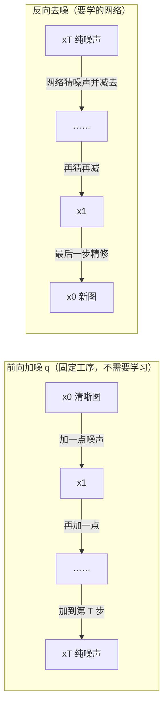
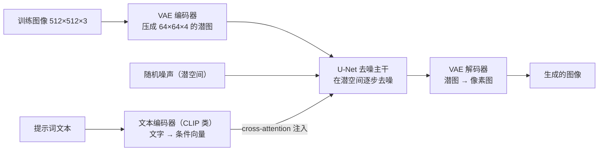

# 扩散模型（Diffusion）

> **一句话理解**：先把图像一步步加噪打成"纯噪声碎屑"，再训练一个网络学会从任意噪声状态里把噪声认出来；生成时从纯噪声出发一步步去噪，图像像从雾里慢慢浮现。

[⬆️ 返回总目录](../../../README.md) · [⬆️ 返回本篇](../README.md) · [⬅️ 返回本章目录](./README.md)

| 属性 | 说明 |
|------|------|
| 难度 | ⭐⭐⭐⭐（高阶） |
| 所属分支 | 生成与多模态 |
| 前置知识 | [生成模型全景](./01-生成模型全景.md)（VAE 的潜空间概念会被复用）；[PyTorch快速上手](../../3-深度学习/04-深度学习基础/03-PyTorch快速上手.md) |

---

## 📌 这一节解决什么问题

GAN 的痛点上一页领教过了：两个网络互相博弈，训练像走钢丝，模式崩塌说来就来。工业界需要的是**训练稳定、多样性好、还能听懂文字指令**的生成模型。

Diffusion（扩散模型）的思路来自一个反直觉的观察：**破坏比创造容易得多**。把一张图加噪毁掉，谁都会；而"从噪声里恢复一张图"虽然难，但可以拆成几百个"每次只恢复一点点"的小步骤——每个小步骤简单到能用一个普通网络学会。于是训练变成一个平平无奇的回归问题（猜噪声），没有任何博弈，稳定性碾压 GAN。2020 年 DDPM 问世后，这条路线迅速接管了图像生成，Stable Diffusion 等文生图工具皆由此而来。

## 🌱 通俗理解

把图像想成一尊**雕像**：

- **前向过程（加噪）**：把雕像一步步敲成碎屑——每一步只敲掉一点，敲一千步后彻底成一堆均匀的碎末（纯噪声）。这一步不需要学习，纯粹是破坏，过程完全可控、可复现；
- **反向过程（去噪）**：从一堆碎屑出发，一步步把它复原成雕像。一步复原是天方夜谭，但"每一步只把碎屑整理得稍微有序一点"是可以学的手艺。

学去噪的手艺人（神经网络）练的是一门朴素功夫：**给你一堆半乱不乱的碎屑，告诉你这是敲了 300 步的状态，请猜出"上一次敲掉的是哪些碎屑"**。猜得越准，往回复原得越好。生成 = 从纯碎屑开始，把这门手艺倒着执行一千次，雕像（图像）便渐渐显形。

和 GAN 的"军备竞赛"比，Diffusion 更像**临摹练习**：每次随机抽一尊雕像、随机敲到某个进度，然后考网络"猜敲掉的部分"——单一目标、监督明确、想不稳都难。

## 📋 举个例子

把一张 8×8 的"笑脸"图按固定步长加噪 3 步（**简化演示**：真实模型用约 1000 步、每步噪声量极小；下面的数字是一次随机抽样的示意值，每次运行都会不同）。

加噪规则（每步 $\beta = 0.3$）：$x_t \approx 0.84 \times x_{t-1} + 0.55 \times \epsilon$，其中 $\epsilon$ 是每个像素独立抽的标准正态噪声。

原始图 $x_0$（1 = 黑色笔划，0 = 白色背景）：

```text
0 0 0 0 0 0 0 0
0 1 1 0 0 1 1 0
0 1 1 0 0 1 1 0
0 0 0 0 0 0 0 0
0 1 0 0 0 0 1 0
0 0 1 0 0 1 0 0
0 0 0 1 1 0 0 0
0 0 0 0 0 0 0 0
```

加噪 1 步后的 $x_1$（保留两位小数）：

```text
 0.44 -0.12  0.31  0.05 -0.62  0.27  0.49 -0.08
 0.21  1.02  0.67 -0.13  0.35  0.91  1.25 -0.40
-0.33  0.85  1.10  0.18 -0.52  0.74  0.59  0.06
-0.25  0.15 -0.41  0.60  0.02 -0.37  0.53  0.19
 0.32  0.97 -0.21  0.43 -0.15  0.28  0.88 -0.33
 0.11 -0.44  1.05  0.24 -0.58  0.79  0.13 -0.26
-0.36  0.22  0.47  1.13  0.82 -0.19  0.35 -0.51
 0.28 -0.17  0.05  0.39 -0.44  0.16 -0.28  0.61
```

看两点：原本是 1 的位置数值整体偏高（信号还在），原本是 0 的位置被噪声抬离了 0。继续往下走 2 步会怎样？

<details>
<summary>📊 展开完整算例：第 2、3 步的数值变化</summary>

加噪 2 步后的 $x_2$（$x_2 \approx 0.84 \times x_1 + 0.55 \times \epsilon_2$）：

```text
 0.05 -0.92  0.71 -0.33  1.02 -0.18 -0.66  0.55
 0.83  0.24  1.35 -0.61 -0.09  1.12  0.47 -1.18
-1.05  0.98  0.32  0.87 -0.44 -1.32  0.91  0.16
 0.42 -1.27  0.19  0.66 -0.87  1.08 -0.35  0.73
-0.19  1.42 -0.88  0.51  0.94 -0.26  0.17 -1.01
 0.67  0.08 -0.53  1.21 -1.44  0.85  0.39 -0.72
-0.81  1.09 -0.28  0.94  1.33 -0.66  0.52 -1.36
 0.34 -0.49  1.16 -0.75  0.28  0.61 -1.22  0.45
```

加噪 3 步后的 $x_3$：

```text
 1.32 -0.87  0.44 -1.51  0.76  1.18 -0.35  0.92
-0.61  1.78 -1.24  0.83 -1.05  0.37  1.56 -0.44
 0.98 -1.42  1.67 -0.28 -1.83  1.05  0.52 -1.17
-1.36  0.59  1.23  0.35  1.71 -0.92  1.08 -0.63
 0.47 -1.18  1.85 -0.74  0.22 -1.59  0.81  1.42
-1.72  1.31 -0.45  1.63  0.58 -1.09  1.94 -0.36
 1.14 -0.68 -1.31  0.42  1.27 -1.55  0.33  0.98
-0.53  1.61 -0.96  1.38 -0.47  0.71 -1.28  0.55
```

观察趋势：**第 1 步**肉眼还能认出笑脸的轮廓（1 的位置明显偏亮）；**第 2 步**只有隐约的痕迹；**第 3 步**已和随机噪声难以区分——眼睛基本失效，但统计学上"原本为 1 的区域均值仍略高"，这丝微弱的规律正是去噪网络要抓的东西。真实模型走约 1000 步，最后一步得到的就是纯标准正态噪声。

</details>

## 🧠 核心原理

### 整体流程



### 逐步拆解

**1. 前向过程：每一步只撒一点高斯噪声**

$$
q(x_t \mid x_{t-1}) = \mathcal{N}\big(x_t;\ \sqrt{1-\beta_t}\, x_{t-1},\ \beta_t \mathbf{I}\big)
$$

> 👉 **人话**：每一步把图像稍微"调暗"一点（乘 $\sqrt{1-\beta_t}$），再撒上一层方差为 $\beta_t$ 的高斯噪声。$\beta_t$ 是提前定好的小数字（比如从 0.0001 慢慢涨到 0.02），整个破坏工序没有任何要学的东西。

而且前向有闭式解——不用真的一步步加，可以从 $x_0$ 一步跳到任意 $x_t$：

$$
x_t = \sqrt{\bar{\alpha}_t}\, x_0 + \sqrt{1-\bar{\alpha}_t}\, \epsilon, \qquad \epsilon \sim \mathcal{N}(0, \mathbf{I})
$$

> 👉 **人话**：$\bar{\alpha}_t$ 是各步 $\alpha_t = 1-\beta_t$ 的累乘，衡量"信号还剩多少"。训练时随机抽一个步数 $t$，用这行公式直接算出 $x_t$——省去循环，这是 Diffusion 训练高效的关键。

**2. 为什么用"噪声"而不是别的破坏方式**

前向过程是一条马尔可夫链（Markov Chain）——每一步只依赖上一步。因为每步的扰动都是**小步的高斯噪声**，整条链的数学性质特别好：任意时刻 $x_t$ 的分布有解析式（上面的闭式解）、加噪与去噪的方差关系有公式可推。人话版：**把"从噪声画一张图"的悬崖，切成了几百级每一级都很矮的台阶**——每级台阶上"该修什么"都变得简单可学。

**3. 训练目标：猜噪声的 MSE**

$$
\mathcal{L} = \mathbb{E}_{x_0,\, \epsilon,\, t}\Big[\big\|\epsilon - \epsilon_\theta(x_t,\, t)\big\|^2\Big]
$$

> 👉 **人话**：训练循环三步走——随机抽一张图 $x_0$、随机抽一个步数 $t$、随机撒一份噪声 $\epsilon$ 算出 $x_t$；然后考网络："这个 $x_t$ 里我撒的是哪份噪声？"损失就是预测噪声和真噪声的均方差。**没有博弈、没有判别器，就是一个再普通不过的回归问题**——这是它训练稳定的根源。

**4. 采样：一步步去噪几十步**

从纯高斯噪声出发，每步用网络估出噪声、减掉一大半，再补回一点点随机（保持分布正确），循环往复。原版 DDPM 走 1000 步，借助采样加速技巧通常压到 20~50 步——步数是**质量与延迟的旋钮**。

**5. 条件生成：文本怎么进来**

- 文本先过文本编码器变成一组向量，在去噪网络的**交叉注意力（Cross-Attention）**层注入——去噪的每一步都"看一眼"提示词再决定怎么修（注意力的机制见[第 7 章 · Transformer 与注意力机制](../../4-专业方向/07-自然语言处理与LLM/02-Transformer与注意力机制.md)）；
- **分类器自由引导（CFG，Classifier-Free Guidance）**一句话：每步把"有提示"和"无提示"的去噪结果各算一遍，沿（有 − 无）的方向外推——相当于告诉模型"**按提示的力度再大一点**"，代价是多一次前向计算。

### Stable Diffusion 三件套

直接在像素上做扩散太贵（512×512×3 ≈ 78 万维）。Stable Diffusion 的答案是"先压缩、再扩散"：



- **VAE**：把像素压到低维潜空间（Latent Space），扩散全部在潜空间进行，算力省下一个数量级——第 01 页的 VAE 没有过时，它成了 Diffusion 的"省电模式"；
- **U-Net**：去噪主干网络，负责"看噪声、看步数、看提示词，猜该去掉什么"；
- **文本编码器（CLIP 类）**：把文字变成条件向量——这个编码器正是下一页多模态的主角。

### 为什么 Diffusion 击败了 GAN

| 维度 | GAN | Diffusion |
|------|-----|-----------|
| 训练稳定性 | 双网络博弈，易振荡、易崩 | 单一回归损失，非常稳 |
| 多样性 | 模式崩塌风险高 | 覆盖分布，多样性好 |
| 可控性 | 条件控制要专门设计 | 文本条件 + CFG 天然可控 |
| 生成速度 | 一步前向，快 | 多步迭代，慢（靠蒸馏/少步采样补救） |
| 典型伪影 | 锐利但有纹理伪影 | 整体更干净、伪影少 |

<details>
<summary>🔍 展开：30 步采样的每一步大致发生什么</summary>

用"修雕像"的比喻过一遍 30 步采样（步数是示意）：

- **第 1~5 步（纯碎末期）**：画面仍是均匀噪声，去噪网络做的是"确定大方向"——构图、大色块、物体大致位置在这一阶段定型；
- **第 6~20 步（成形期）**：主体轮廓与主要细节逐步清晰，背景纹理跟进；提示词的引导（CFG）主要在这些步骤发力，权重削得最狠；
- **第 21~28 步（精修期）**：局部细节——毛发、文字、边缘锐度——被逐层"抛光"，大结构基本不再变动；
- **第 29~30 步（收尾）**：最后一步不再补随机噪声，做一次干净的确定性去噪，潜图交给 VAE 解码成像素图。

这就是为什么采样步数不能无限砍：步数太少，"成形期"被压缩，物体容易畸形或细节缺失；太多则收益递减、延迟白白变长。

</details>

## 💻 动手试试

一个可跑的玩具 Diffusion：在 2D 点云（环形分布）上训练去噪 MLP，采样时从高斯噪声逐步去噪还原分布——DDPM 的训练与采样骨架俱全。

```python
import torch
import torch.nn as nn

torch.manual_seed(0)

# 目标分布：中心 (2,2)、半径 2 的环形点云
def sample_real(n):
    ang = torch.rand(n) * 2 * torch.pi
    r = 2.0 + 0.1 * torch.randn(n)
    return torch.stack([r * torch.cos(ang), r * torch.sin(ang)], dim=1) + 2.0

T = 100
betas = torch.linspace(1e-4, 0.02, T)        # 每一步加多少噪声（预先定好）
alphas = 1.0 - betas
abar = torch.cumprod(alphas, dim=0)          # 累乘得到每个时刻"信号剩余量"

# 去噪网络：输入（带噪样本 x_t, 时间步 t），输出预测的噪声
class Denoiser(nn.Module):
    def __init__(self):
        super().__init__()
        self.temb = nn.Embedding(T, 1)
        self.net = nn.Sequential(nn.Linear(3, 64), nn.ReLU(),
                                 nn.Linear(64, 64), nn.ReLU(), nn.Linear(64, 2))
    def forward(self, x, t):
        tfeat = self.temb(t).squeeze(1) / T          # 把步数变成特征
        return self.net(torch.cat([x, tfeat[:, None]], dim=1))

model = Denoiser()
opt = torch.optim.Adam(model.parameters(), lr=1e-3)

for step in range(3000):
    x0 = sample_real(128)                            # 随机抽真样本
    t = torch.randint(0, T, (128,))                  # 随机抽步数
    eps = torch.randn(128, 2)                        # 随机撒噪声
    xt = abar[t].sqrt()[:, None] * x0 + (1 - abar[t]).sqrt()[:, None] * eps  # 一步到位加噪
    loss = ((model(xt, t) - eps) ** 2).mean()        # 目标：把撒的噪声猜出来
    opt.zero_grad(); loss.backward(); opt.step()

# 采样：从纯噪声出发，一步步去噪
with torch.no_grad():
    x = torch.randn(1000, 2)
    for t in reversed(range(T)):
        eps_hat = model(x, torch.full((1000,), t))   # 猜噪声
        x = (x - (1 - alphas[t]).sqrt() * eps_hat) / alphas[t].sqrt()  # 减掉
        if t > 0:
            x = x + betas[t].sqrt() * torch.randn(1000, 2)             # 补一点随机

print("生成点均值:", x.mean(0).tolist())                     # 应接近 [2.0, 2.0]
print("到中心平均距离:", (x - 2).norm(dim=1).mean().item())   # 应接近 2.0（环半径）
```

预期输出：生成点落在环形上（均值 ≈ (2, 2)，到中心距离 ≈ 2.0）。把 `sample_real` 换成双峰、月牙等任意分布重训，模型都能学着还原——这就是"Diffusion 是通用分布学习器"的直观体验。

## 🖱️ 动手玩

> 🕹️ **延伸玩一玩**：[Hugging Face Spaces](https://huggingface.co/spaces) 上的 Stable Diffusion 在线 demo——搜索 "Stable Diffusion" 挑一个排队少的，输入一段提示词（如 "a cat astronaut, digital art"）即可在线出图。试试同一提示词改 CFG 强度（7.5 → 15），直观感受"按提示的力度再大一点"是什么效果。

## 🔗 在知识树中的位置

- **上游**：[生成模型全景](./01-生成模型全景.md)——四流派框架与 VAE 潜空间；[Transformer 与注意力机制](../../4-专业方向/07-自然语言处理与LLM/02-Transformer与注意力机制.md)——cross-attention 条件注入的来源；
- **下游**：[多模态模型](./04-多模态模型.md)——文生图的文本条件正是 CLIP 编码器；[生产实战](./99-生产实战.md)——文生图工具落地的完整流程；
- **横向对比**：与 GAN 的优劣对比见上表；一句话总结——**GAN 用博弈换锐度，Diffusion 用步数换稳定**。

## ⚠️ 常见误区

- **误区一**："反向去噪是前向加噪的物理逆运算" → 不是。前向是固定的加噪工序，反向是**训练出来的神经网络**在猜噪声——去噪能力完全是学出来的；
- **误区二**："采样步数越多效果无限好" → 边际收益递减，超过必要步数只是白白增加延迟；生产上常用 20~30 步加蒸馏方案压延迟；
- **误区三**："Diffusion 只能生成图像" → 音频、视频、分子结构、动作序列……凡是有"分布"的地方都有人在用扩散建模。

## 📝 小结与自测

**要点回顾**

- 前向：小步高斯加噪的马尔可夫链，把图毁成纯噪声，无需学习、有闭式解；
- 训练：随机（图、步数、噪声），让网络用 MSE 猜噪声——纯回归，稳定；
- 采样：从纯噪声出发逐步去噪，步数是质量与延迟的旋钮；
- 条件：文本经 cross-attention 每步注入；CFG 把"按提示的力度"调大；
- Stable Diffusion 三件套：VAE 压潜空间 + U-Net 去噪 + 文本编码器给条件。

**自测一下**（点击展开答案）

<details>
<summary>问题 1：为什么说 Diffusion 的训练比 GAN 稳定？</summary>

Diffusion 的训练目标是单一的回归损失（猜对撒进去的噪声），有明确的监督信号，不存在两个网络互相追逐的博弈，也就没有振荡和模式崩塌这类博弈失衡病。

</details>

<details>
<summary>问题 2：Stable Diffusion 里的 VAE 和第 01 页讲的 VAE 是什么关系？</summary>

同一个东西的两种用法：第 01 页里 VAE 自己当生成模型（压缩—重建—采样）；在 Stable Diffusion 里它退居幕后做"压缩器/解压器"——把像素压进潜空间让扩散在低维进行，最后再解码回像素，大幅节省算力。

</details>

## 📚 延伸阅读

- 论文：Ho et al., *Denoising Diffusion Probabilistic Models (DDPM)*（2020），[arXiv:2006.11239](https://arxiv.org/abs/2006.11239)
- 论文：Rombach et al., *High-Resolution Image Synthesis with Latent Diffusion Models*（2022，Stable Diffusion 的论文），[arXiv:2112.10752](https://arxiv.org/abs/2112.10752)
- 论文：Ho & Salimans, *Classifier-Free Diffusion Guidance*（2022），[arXiv:2207.12598](https://arxiv.org/abs/2207.12598)
- 博客：Lilian Weng, *What are Diffusion Models?*——扩散模型数学推导图解，[lilianweng.github.io](https://lilianweng.github.io/posts/2021-07-11-diffusion-models/)

---

[⬅️ 上一页：对抗生成网络GAN](./02-对抗生成网络GAN.md) · [返回本章目录](./README.md) · [下一页：多模态模型 ➡️](./04-多模态模型.md)
