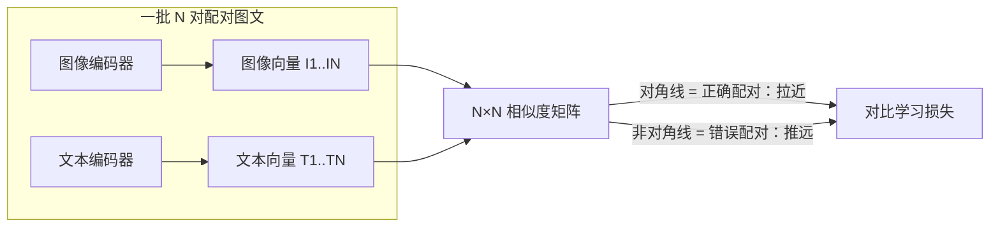

# 多模态模型

> **一句话理解**：把文字、图片、音频、视频这些不同形态的信息放进同一个"语义空间"，让模型跨模态理解与生成——看图能说话，听文能画图，以文能搜图。

[⬆️ 返回总目录](../../../README.md) · [⬆️ 返回本篇](../README.md) · [⬅️ 返回本章目录](./README.md)

| 属性 | 说明 |
|------|------|
| 难度 | ⭐⭐⭐⭐（高阶） |
| 所属分支 | 生成与多模态 |
| 前置知识 | [扩散模型Diffusion](./03-扩散模型Diffusion.md)；[词向量与embedding](../../4-专业方向/07-自然语言处理与LLM/01-词向量与embedding.md) |

---

## 📌 这一节解决什么问题

前几页的生成模型一次只吃一种数据：Diffusion 吃图（和一小段文字条件），LLM 吃文字。但人类从不这么割裂地认识世界——看到一张图会脱口而出描述，读到一段话脑中会浮现画面。

让机器跨模态，卡在一个硬问题上：**一张图是几百万个像素，一句话是几十个 token，量纲、长度、结构完全不同，怎么比较"这张图"和"这句话"谁跟谁是一回事？** 这就是多模态的核心难题：如何把不同模态（Modality，信息形态）映射进**同一个语义空间**。

CLIP 在 2021 年给出了第一个大规模可用的答案：不手工设计映射规则，而是用**海量图文对 + 对比学习**，让模型自己学出对齐。此后文生图、以文搜图、看图对话在此地基上爆发——本页讲清这块地基和它撑起的生态。

## 🌱 通俗理解

把不同模态想成**不同国家的语言**：中文、英文、法文的文字长得毫无相似之处，但"猫"这个词在三种语言里指向同一只动物。沟通的办法不是让所有人学完所有语言，而是建一本**统一的"意义词典"**：每种语言的词都翻译成同一套中立的"意义编号"。

CLIP 干的就是这件事：图像编码器把图变成一个向量，文本编码器把句子变成一个向量，**训练目标只有一句话——配对的图文向量要靠近，不配对的要远离**。几亿对图文"对答案"练下来，两个空间就对齐了：猫的照片和"一只猫"这句话的向量自动靠近，和"一辆汽车"自动远离。

这呼应了全书的"万物向量"主线：[词向量](../../4-专业方向/07-自然语言处理与LLM/01-词向量与embedding.md)把词变成向量、推荐系统的[双塔模型](../../4-专业方向/08-推荐系统/03-双塔模型与向量召回.md)把用户和商品各自变成向量再配对——CLIP 就是"图文版双塔"，思路一脉相承：**语义相近的东西，向量就应该相近**。

## 📋 举个例子

文本 = **"一只猫"**，与 3 张候选图算余弦相似度（玩具数字示意，真实 CLIP 向量是 512 维以上）：

| 候选图 | 内容 | 余弦相似度（玩具示意） | 判定 |
|--------|------|------------------------|------|
| 图 A | 橘猫趴在窗台 | **0.87** | 最像"一只猫" |
| 图 B | 柴犬吐舌头 | 0.41 | 不太像 |
| 图 C | 红色跑车 | 0.12 | 基本不像 |

这个打分表本身就是两个产品：**跨模态检索**（拿"一只猫"从百万图库里捞出图 A）和**零样本（Zero-shot）分类**——把候选类别名都写成句子（"一张猫的照片""一张狗的照片""一张汽车的照片"），哪句与图相似度最高就归哪类，**不需要为这个分类任务训练任何新模型**。

<details>
<summary>🔍 展开：多模态 LLM 答图片题的内部流程</summary>

你给 GPT-4V / Gemini 类模型发一张图问"这是什么品种的猫？"，内部大致走了四步：

1. **视觉编码**：视觉编码器（常用 CLIP 系或同类 ViT）把图切成小方块（patch），每块编成一个向量——图变成一串"视觉特征"；
2. **token 化**：一个投影层把这些视觉向量翻译成 LLM 认识的"视觉 token"——图被写成一种"外语单词"拼成的序列；
3. **拼进上下文**：视觉 token 和你打的文字 token 拼成同一条上下文，对 LLM 来说，那张图就是前面多出来的一段"话"；
4. **照常生成**：LLM 逐 token 生成回答，和纯文本对话没有本质区别。

关键在 1~2 步的"翻译质量"：图里的细节（文字、小物体、空间关系）翻译丢了，后面的大脑再强也答不对。

</details>

## 🧠 核心原理

### 整体流程



### 逐步拆解

**1. CLIP：用对比学习对齐图文**

CLIP（Contrastive Language-Image Pre-training）拿约 4 亿对"网络图片 + 配文"训练。每批 N 对图文过两个编码器，算出 N×N 相似度矩阵，损失只要求**对角线赢过整行整列**：

$$
\mathcal{L} = -\frac{1}{N}\sum_{i=1}^{N}\log\frac{\exp\big(\text{sim}(I_i, T_i)/\tau\big)}{\sum_{j=1}^{N}\exp\big(\text{sim}(I_i, T_j)/\tau\big)}
$$

> 👉 **人话**：一批 256 对图文摆上桌，正确配对要在 256×256 的记分表里"赢过"所有错误配对——把对的拉近、把错的推远。$\tau$ 是温度系数，控制"赢多少才算赢"。练完之后，两个编码器输出的向量就活在同一个语义空间里，可以直接比距离。

**2. 零样本分类：不用训练的分类器**

类别名单现写成句子（"一张猫的照片"……），与待分类图逐一算相似度，取最大。分类能力来自预训练见过的海量概念，**下游零标注、零训练**——换一批类别名就换一个分类器，这是 CLIP 最惊艳的用法。

**3. 文生图：正是第 03 页的三件套**

[扩散模型](./03-扩散模型Diffusion.md)页里的文本编码器就是 CLIP 类模型——**文生图系统 = CLIP（懂文字）+ 扩散 U-Net（会画画）+ VAE（压算力）**。"一只戴宇航员头盔的猫"先变成条件向量，再去引导去噪。

**4. 视频生成（一句话）**

视频生成 ≈ 给 Diffusion 加上时间维度、对连续帧联合去噪；Sora 类模型的野心不止"生成视频"，而是当"世界模拟器"——通过预测下一帧来学习物理规律。

**5. 多模态大模型：视觉编码器 + LLM 大脑**

GPT-4V / Gemini 类"看图对话"模型 = 视觉编码器（把图变成视觉 token）+ LLM 大脑（把视觉 token 当普通上下文处理），内部流程见上面折叠框。

**6. 应用场景清单**

| 场景 | 干什么 | 背后技术 |
|------|--------|----------|
| 看图说话 / 看图问答 | 给图配文、答图片题 | 多模态大模型 |
| 文生图 / 图生图 | 提示词出图、风格改写 | CLIP + Diffusion |
| 视频理解 | 视频摘要、内容审核 | 多模态大模型 / 视频编码器 |
| 跨模态检索 | 以文搜图、以图搜图 | CLIP 向量 + 向量数据库 |

## 💻 动手试试

用 numpy 玩一个玩具 CLIP：手工设定几张"图"和几句话的向量，算相似度矩阵，体验"配对拉近、错配推远"的机制。

```python
import numpy as np

# 玩具设定：embedding 只有 4 维（真实 CLIP 是 512+ 维）
# 三张图的"图像向量"（现实中由视觉编码器算出，这里手工设定语义）
imgs = np.array([
    [0.9, 0.1, 0.0, 0.0],   # 图A：橘猫
    [0.0, 0.1, 0.9, 0.0],   # 图B：汽车
    [0.1, 0.8, 0.1, 0.9],   # 图C：海滩日落
])
# 三句话的"文本向量"（现实中由文本编码器算出）
texts = np.array([
    [0.8, 0.2, 0.1, 0.1],   # "一只猫"
    [0.1, 0.2, 0.8, 0.1],   # "一辆汽车"
    [0.2, 0.7, 0.0, 0.8],   # "海滩上的日落"
])
labels = ["一只猫", "一辆汽车", "海滩上的日落"]

def cosine(a, b):
    return a @ b / (np.linalg.norm(a) * np.linalg.norm(b))

# 相似度矩阵：第 i 行第 j 列 = 图 i 与句子 j 的相似度
sim = np.array([[cosine(i, t) for t in texts] for i in imgs])
print("          " + "  ".join(f"{l:>10}" for l in labels))
for i, row in enumerate(sim):
    print(f"图{'ABC'[i]}    " + "  ".join(f"{v:10.3f}" for v in row))

best = sim.argmax(axis=1)
print("每张图最匹配的句子:", [labels[b] for b in best])
# 预期：图A→"一只猫"，图B→"一辆汽车"，图C→"海滩上的日落"（对角线最大）
# CLIP 训练做的事，就是不断调整这些向量，让对角线尽量大、非对角线尽量小
```

## 🖱️ 动手玩

> 🕹️ **延伸玩一玩**：[Embedding Projector](https://projector.tensorflow.org)——把上万真实词向量投影到 2D/3D，亲眼看"语义空间"里国王—女王、猫—狗的聚类关系。本章的图文 embedding 是同一思想的跨模态版本：好的空间里，"猫的图片"和"猫这个词"会被投影到近处。

## 🔗 在知识树中的位置

- **上游**：[词向量与embedding](../../4-专业方向/07-自然语言处理与LLM/01-词向量与embedding.md)——"万物向量"主线的源头；[双塔模型与向量召回](../../4-专业方向/08-推荐系统/03-双塔模型与向量召回.md)——双塔配对架构的推荐系统版本；[扩散模型Diffusion](./03-扩散模型Diffusion.md)——文生图的另一半；
- **下游**：[前沿技术地图](./05-前沿技术地图.md)——多模态是世界模型与具身智能的地基；[生产实战](./99-生产实战.md)——文生图工具落地；
- **横向对比**：对比学习（拉近/推远）vs 扩散（加噪/去噪）vs 对抗（造假/鉴定）——三种"用矛盾学表征"的哲学。

## ⚠️ 常见误区

- **误区一**："CLIP 真正'看懂'了图" → CLIP 学到的是**对齐**（哪句话配哪张图），不是深度理解——数物体数量、理解复杂空间关系（"红方块上的蓝球"）这类组合推理仍是弱项；
- **误区二**："多模态就是图 + 文" → 音频、视频、3D 结构、传感器信号都是模态；自动驾驶的激光雷达 + 摄像头 + 地图融合也是多模态问题；
- **误区三**："零样本 = 零标注零成本" → 零样本指**下游任务**不用新标注，预训练本身吞下了亿级图文对——便宜的是使用，昂贵的是地基。

## 📝 小结与自测

**要点回顾**

- 多模态核心难题：把不同形态的信息映射进同一语义空间；
- CLIP = 图文双塔 + 对比学习（配对拉近、错配推远），是"万物向量"主线的跨模态落地；
- 零样本分类：类别名写成句子直接比相似度，无需训练新模型；
- 文生图 = CLIP（懂文字）+ 扩散（会画画）+ VAE（压算力）；
- 多模态大模型 = 视觉编码器（图 → 视觉 token）+ LLM 大脑。

**自测一下**（点击展开答案）

<details>
<summary>问题 1：CLIP 和推荐系统的双塔模型哪里像、哪里不像？</summary>

像：都是"两个编码器各自编码、在向量空间配对打分"的双塔架构，训练思想都是把该配对的拉近。不像：CLIP 配的是图文（跨模态），双塔配的是用户和商品（同属推荐场景）；且 CLIP 用超大规模互联网图文对做预训练，目标是通用语义对齐而非点击率。

</details>

<details>
<summary>问题 2：为什么说 CLIP 是文生图系统的"翻译官"？</summary>

扩散模型只会去噪、不懂文字；文本编码器把"一只戴头盔的猫"翻译成条件向量，经 cross-attention 送到去噪的每一步。没有这个翻译官，模型只能无条件地"随机画画"。

</details>

## 📚 延伸阅读

- 论文：Radford et al., *Learning Transferable Visual Models From Natural Language Supervision (CLIP)*（2021），[arXiv:2103.00020](https://arxiv.org/abs/2103.00020)
- 论文：Alayrac et al., *Flamingo: a Visual Language Model for Few-Shot Learning*（2022），[arXiv:2204.14198](https://arxiv.org/abs/2204.14198)
- 博客：OpenAI, *CLIP: Connecting Text and Images*——官方介绍图文，[openai.com](https://openai.com/index/clip/)

---

[⬅️ 上一页：扩散模型Diffusion](./03-扩散模型Diffusion.md) · [返回本章目录](./README.md) · [下一页：前沿技术地图 ➡️](./05-前沿技术地图.md)
