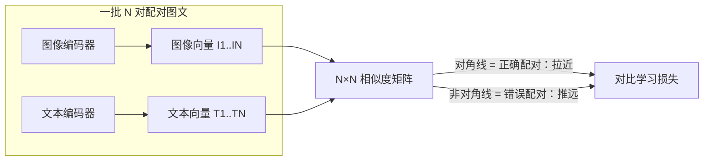
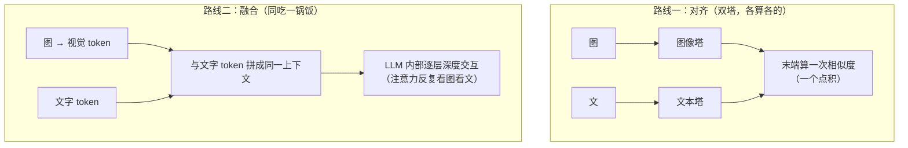
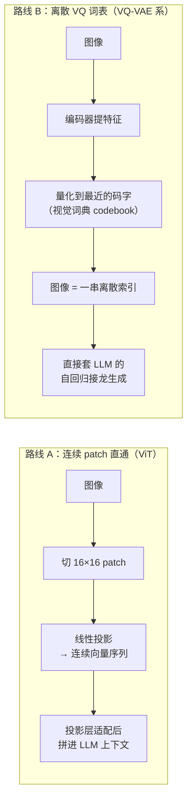
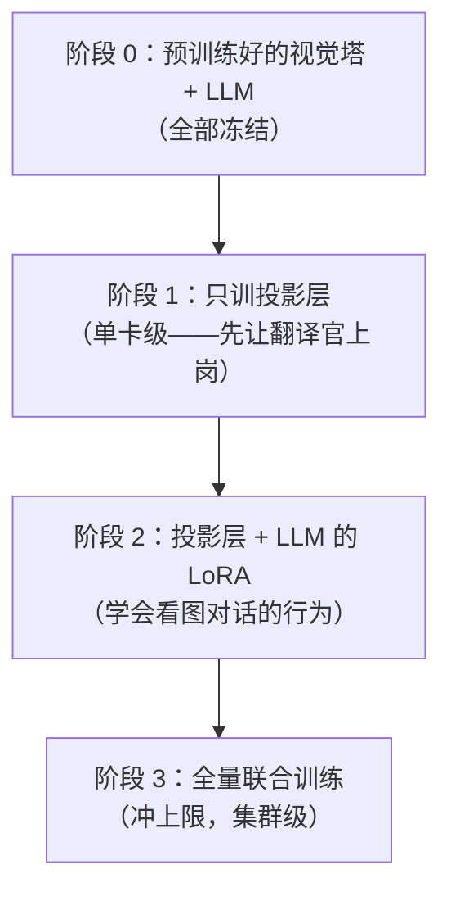

# 多模态模型

> **一句话理解**：把文字、图片、音频、视频这些不同形态的信息放进同一个"语义空间"，让模型跨模态理解与生成——看图能说话，听文能画图，以文能搜图。

[⬆️ 返回总目录](../../../README.md) · [⬆️ 返回本篇](../README.md) · [⬅️ 返回本章目录](./README.md)

| 属性 | 说明 |
|------|------|
| 难度 | ⭐⭐⭐⭐（高阶） |
| 所属分支 | 生成与多模态 |
| 前置知识 | [扩散模型Diffusion](./03-扩散模型Diffusion.md)；[词向量与embedding](../../4-专业方向/07-自然语言处理与LLM/01-词向量与embedding.md) |

---

## 📌 这一节解决什么问题

前几页的生成模型一次只吃一种数据：Diffusion 吃图（和一小段文字条件），LLM 吃文字。但人类从不这么割裂地认识世界——看到一张图会脱口而出描述，读到一段话脑中会浮现画面。

让机器跨模态，卡在一个硬问题上：**一张图是几百万个像素，一句话是几十个 token，量纲、长度、结构完全不同，怎么比较"这张图"和"这句话"谁跟谁是一回事？** 这就是多模态的核心难题：如何把不同模态（Modality，信息形态）映射进**同一个语义空间**。

CLIP 在 2021 年给出了第一个大规模可用的答案：不手工设计映射规则，而是用**海量图文对 + 对比学习**，让模型自己学出对齐。此后文生图、以文搜图、看图对话在此地基上爆发。本页讲四层东西：对齐的机制（对比学习 InfoNCE 的完整公式）、两条技术路线（对齐 vs 融合）、视觉信息进 LLM 的接线方式（视觉 token 化），以及生产上最头疼的问题——**多模态幻觉**。

## 🌱 通俗理解

把不同模态想成**不同国家的语言**：中文、英文、法文的文字长得毫无相似之处，但"猫"这个词在三种语言里指向同一只动物。沟通的办法不是让所有人学完所有语言，而是建一本**统一的"意义词典"**：每种语言的词都翻译成同一套中立的"意义编号"。

CLIP 干的就是这件事：图像编码器把图变成一个向量，文本编码器把句子变成一个向量，**训练目标只有一句话——配对的图文向量要靠近，不配对的要远离**。几亿对图文"对答案"练下来，两个空间就对齐了：猫的照片和"一只猫"这句话的向量自动靠近，和"一辆汽车"自动远离。

这呼应了全书的"万物向量"主线：[词向量](../../4-专业方向/07-自然语言处理与LLM/01-词向量与embedding.md)把词变成向量、推荐系统的[双塔模型](../../4-专业方向/08-推荐系统/03-双塔模型与向量召回.md)把用户和商品各自变成向量再配对——CLIP 就是"图文版双塔"，思路一脉相承：**语义相近的东西，向量就应该相近**。

但"对齐"不等于"理解"。词典能让两国人找到同一个词条，却不能让他们围绕这个词条**深入讨论**——"猫的爪子在前腿还是后腿更灵活"这种推理，需要两边信息真正**搅在一起**算，而不只是"排在附近"。对齐与融合的分野（核心原理第 3 节）就是从这个直觉展开的。

## 📋 举个例子

文本 = **"一只猫"**，与 3 张候选图算余弦相似度（玩具数字示意，真实 CLIP 向量是 512 维以上）：

| 候选图 | 内容 | 余弦相似度（玩具示意） | 判定 |
|--------|------|------------------------|------|
| 图 A | 橘猫趴在窗台 | **0.87** | 最像"一只猫" |
| 图 B | 柴犬吐舌头 | 0.41 | 不太像 |
| 图 C | 红色跑车 | 0.12 | 基本不像 |

这个打分表本身就是两个产品：**跨模态检索**（拿"一只猫"从百万图库里捞出图 A）和**零样本（Zero-shot）分类**——把候选类别名都写成句子（"一张猫的照片""一张狗的照片""一张汽车的照片"），哪句与图相似度最高就归哪类，**不需要为这个分类任务训练任何新模型**。

<details>
<summary>📊 展开手算：一个 batch=3 的对比学习"记分表"</summary>

设 batch 里有 3 对图文，编码后算出 3×3 相似度矩阵（数值为玩具示意，正对角线是正确配对）：

```text
              "一只猫"  "一辆汽车"  "海滩日落"
橘猫照片        0.87      0.15       0.22
汽车照片        0.12      0.85       0.30
日落海景        0.25      0.33       0.88
```

对比学习要的是：**每一行、每一列的最大值都落在对角线上**。以第一行为例做 softmax（当作 3 选 1 的分类）：$e^{0.87}, e^{0.15}, e^{0.22} \approx 2.39, 1.16, 1.25$，归一化后正确配对概率 $\approx 2.39/4.80 \approx 0.50$。按自然对数，这一行的损失是 $-\ln 0.50 \approx 0.69$——正确项只拿到一半"概率质量"，还有一半错付给了负例，模型有明确的改进动力。

注意损失怎么变小：要么把 0.87 推得更高（拉近正例），要么把 0.15、0.22 压低（推远负例）。**两项拉力同时存在**，这就是"配对拉近、错配推远"的数学形态。真实 CLIP 的 batch 是几千对——每行是从几千个候选里选对，负例多、任务难，学出来的空间才细。

</details>

<details>
<summary>🔍 展开：多模态 LLM 答图片题的内部流程</summary>

你给 GPT-4V / Gemini 类模型发一张图问"这是什么品种的猫？"，内部大致走了四步：

1. **视觉编码**：视觉编码器（常用 CLIP 系或同类 ViT）把图切成小方块（patch），每块编成一个向量——图变成一串"视觉特征"；
2. **token 化**：一个投影层把这些视觉向量翻译成 LLM 认识的"视觉 token"——图被写成一种"外语单词"拼成的序列；
3. **拼进上下文**：视觉 token 和你打的文字 token 拼成同一条上下文，对 LLM 来说，那张图就是前面多出来的一段"话"；
4. **照常生成**：LLM 逐 token 生成回答，和纯文本对话没有本质区别。

关键在 1~2 步的"翻译质量"：图里的细节（文字、小物体、空间关系）翻译丢了，后面的大脑再强也答不对。

</details>

## 🧠 核心原理

### 整体流程



### 逐步拆解

**1. CLIP：用对比学习对齐图文——InfoNCE 完整公式**

CLIP（Contrastive Language-Image Pre-training）拿约 4 亿对"网络图片 + 配文"训练。每批 N 对图文过两个编码器，算出 N×N 相似度矩阵，损失采用对比学习家族的 InfoNCE（Info Noise-Contrastive Estimation，信息噪声对比估计），且**双向对称**（图找文 + 文找图各算一遍）：

$$
\mathcal{L} = -\frac{1}{2N}\sum_{i=1}^{N}\Bigg[\log\frac{\exp\big(\text{sim}(I_i, T_i)/\tau\big)}{\sum_{j=1}^{N}\exp\big(\text{sim}(I_i, T_j)/\tau\big)} \;+\; \log\frac{\exp\big(\text{sim}(T_i, I_i)/\tau\big)}{\sum_{j=1}^{N}\exp\big(\text{sim}(T_j, I_j)/\tau\big)}\Bigg]
$$

> 👉 **人话**：一批 N 对图文摆上桌，每个方向（图找文、文找图）都要在 N×N 的记分表里"赢过"所有错误配对——分子是正确配对的得分，分母是同一行（或列）所有候选的得分总和，形式上就是一个以 $\tau$ 为温度的 softmax 交叉熵。**配对拉近、错配推远**，两句话被这一个公式说完。

三个决定训练质量的设计点：

- **负例来自 batch 内部**：分母里的 $N-1$ 个错误配对不需要额外构造——同一批的其他图文对天然就是负例（业内称 in-batch negatives）。这带来一个工程推论：**batch 越大，负例越多，任务越难，学出的空间越细**——CLIP 用数万对的大 batch，一半是为了负例池。这与[第 8 章 · 双塔模型](../../4-专业方向/08-推荐系统/03-双塔模型与向量召回.md)用 batch 内负采样训练召回塔是同一个技巧，只是模态从"用户—商品"换成了"图—文"；
- **温度 $\tau$ 的作用**：相似度除以 $\tau$ 再进 softmax，$\tau$ 控制"赢多少才算赢"。$\tau$ 小 → 分布尖锐 → "难负例"（相似但配错的候选）被罚得更狠，梯度集中在最难的样本上；$\tau$ 太小 → 训练不稳（少数样本垄断梯度）；$\tau$ 太大 → 分布平坦 → 学不动。CLIP 把 $\tau$ 设为**可学习参数**（初始化 0.07），让模型自己找锐度；
- **为什么要双向对称**：单向（只图找文）会让文本侧"塌"到几个热门向量上；双向各出一份约束，两个空间都被拉住。

<details>
<summary>🧮 展开推导：温度 τ 的梯度视角——为什么"难负例"主导学习</summary>

softmax 交叉熵对 logits 的梯度有极简形式。设该行 softmax 输出为 $p_j$（每个候选的当前概率）、正确配对为 one-hot 的 $y_j$，则损失对第 $j$ 个 logit 的梯度：

$$
\frac{\partial \mathcal{L}}{\partial \text{logit}_j} = p_j - y_j
$$

> 👉 **人话**：每个候选的"拉力" = 它当前的概率 − 它该有的概率。正确配对（$y_j=1$）被往概率 1 拉，所有负例被往概率 0 推。温度的作用机制在此显形：$\tau$ 越小 softmax 越尖——**已经推远的"易负例"（$p_j \approx 0$）几乎不再产生梯度（$p_j - 0 \approx 0$），而"难负例"（相似度接近正例、$p_j$ 仍不小）贡献了几乎全部推力**。这就是"温度小 = 梯度集中在难样本"的机制版；也是 τ 太小训练不稳的原因——一两个难负例包揽全部梯度，方向剧烈抖动。

</details>

<details>
<summary>⚠️ 展开：in-batch 负例的坑——"假负例"</summary>

batch 内负例便宜，但有一个统计暗坑：**同批的图文可能碰巧语义相近**（两批不同的"猫趴窗台"图文进了同一个 batch），对比学习会把它们当负例推开——这类样本叫**假负例（False Negative）**。

- **后果**：把本该靠近的语义硬推开，空间出现"同类撕裂"——同类图片的向量被拉到两个角落；
- **症状**：检索结果里偶发"明显同类却不出现"的漏召；batch 越小越严重（撞车概率高）；
- **缓解**：加大 batch（撞车占比相对下降）、按图文相似度预筛掉疑似同义对、或改用带过滤的负采样策略。

👉 **人话**：让全班同学互相配对练习时，难免有两个人的搭档其实早认识——被硬拆开还不许说话。班越大（batch 越大），这种"冤案"占比越低。

</details>

**2. 零样本分类的推理细节：prompt 模板为什么有效**

类别名单现写成句子（"一张猫的照片"……），与待分类图逐一算相似度，取最大。分类能力来自预训练见过的海量概念，**下游零标注、零训练**——换一批类别名就换一个分类器，这是 CLIP 最惊艳的用法。

模板（Prompt Template）这个细节比看上去重要：

- **为什么不用裸类别名**：文本编码器预训练时见的是**自然语言配文**（"a golden retriever catching a frisbee in the park"），裸词 "cat" 是这个分布之外的退化输入——编码出的向量落在训练时很少出现的区域，打分不可靠；"a photo of a cat." 把类别词包装回熟悉的分布，打分立刻稳定；
- **模板集成（Prompt Ensemble）**：用几十个模板（"a photo of a {}." / "a black and white photo of a {}." / "a centered satellite photo of a {}."……）各编一次、取文本向量平均——不同模板覆盖不同视觉风格，平均后鲁棒性明显提升（CLIP 论文在 ImageNet 上靠 80 个模板集成提升数个百分点，量级经验参考）；
- **模板是免费的领域适配**：做医学图分类，模板写 "an ultrasound photo of a {}"；做手绘分类，写 "a doodle of a {}"——不改任何权重，零样本性能就能追近甚至赶上专门微调的小模型（视任务而定）。

**零样本的成立条件与失效边界**（什么时候敢用、什么时候会翻车）：

| 条件 | 表现 |
|------|------|
| 概念在预训练分布内（成立） | 类别名对应的概念在互联网图文里高频出现（猫、汽车、地标）→ 打分可靠 |
| 概念分布外（失效） | 专业细粒度类别（某型号零件、罕见病种）、新造词 → 打分退化为噪声，需 few-shot 示例或微调 |
| 视觉风格分布内（成立） | 自然照片最稳 |
| 视觉风格分布外（部分失效） | 速写、X 光、红外等——模板能部分补偿（"an X-ray of a {}"），超出太多仍失效 |
| 任务形态（结构性失效） | "更像 A 还是 B"这类整体判别可靠；**计数、精细空间关系、组合推理**（见误区一）不可靠——这是对齐路线的结构短板，不是调参能救的 |

> 👉 **人话**：CLIP 的零样本是"靠见多识广认东西"，不是"靠推理懂东西"。见过就认识，没见过就瞎猜——用零样本前先问一句：这个概念它可能在几亿张网络图里见过吗？

**3. 对齐 vs 融合：多模态的两条路线**

"把图文放进同一空间"有两种深度截然不同的做法：



| 路线 | 代表架构 | 强项 | 弱项 | 适用场景 |
|------|----------|------|------|----------|
| 对齐（双塔） | CLIP 类 | 向量可预存离线算 → 亿级图库检索毫秒级；零样本开箱即用；训练/部署便宜 | 两塔之间只有"末端一次点积"，没有跨模态深层交互——组合推理（"红方块上的蓝球"）是弱项 | 检索、零样本分类、给扩散模型当条件编码器 |
| 融合（交互） | GPT-4V / Gemini 类、Flamingo 类 | 视觉 token 进 LLM 上下文，每层注意力都能"图文对照" → 深推理、看图答题、图表理解 | 计算贵（每层都要 attend 视觉 token）、需大规模联合训练、无法预存向量做亿级检索 | VQA、看图对话、文档/图表理解 |

> 👉 **人话**：对齐是"两个翻译各译一份，最后对一下页码"；融合是"把两种语言印在同一页上，逐句讨论"。前者快而浅，适合找（检索）；后者慢而深，适合懂（推理）。**生产系统常两条腿走路**：用双塔从亿级库里粗筛出几十条，再用融合模型精读 rerank——和推荐系统"召回 + 精排"（第 8 章）的结构一模一样。

**4. 视觉 token 化两条路：连续 patch 直通 vs 离散 VQ 词表**

"图怎么变成 LLM 能吃的 token"有两种思路：

| | ViT patch 直通 | VQ 离散词表（VQ-VAE 系） |
|---|---|---|
| 做法 | 图切 16×16 patch → 线性投影成**连续向量**序列（[第 5 章 · ViT](../../4-专业方向/05-计算机视觉/03-ViT视觉Transformer.md) 的做法），投影层把向量翻译进 LLM 维度 | VQ-VAE 一句话——学一本"视觉词表"（codebook），每个 patch 被量化到最近的"视觉单词"，图变成一串**离散索引** |
| 与 LLM 的关系 | 视觉 token 作为连续输入嵌入拼进上下文（GPT-4V 类融合路线的做法） | 图像成了"另一种语言的词表"，可直接套 LLM 的**下一词预测**自回归生成（DALL·E 初代 / Parti 类文生图的底层） |
| 优点 | 保信息（连续、无量化损失）、端到端 | 与语言模型的生成范式无缝衔接，能逐 token 自回归画图 |
| 代价/痛点 | 不能直接用"预测下一个离散词"的生成范式 | 量化丢信息；词表大小与质量是硬瓶颈 |

> 👉 **人话**：一条路把图当"连续的口供"直接塞进大脑；另一条路先给万物编一本"视觉词典"，把图写成离散词条。理解任务多用前者（信息全），生成任务里后者能白嫖 LLM 的接龙范式（可生成）。



**5. 多模态幻觉的新形态**

文本 LLM 会"一本正经地胡说"，多模态模型把幻觉搬进了视觉场景，且更隐蔽：

- **物体存在性幻觉**：图里根本没有鸟，描述却说"一只海鸥掠过屋顶"——根源是**语言先验压过视觉证据**（海边照片"通常"有海鸥，模型按先验脑补）；
- **关系幻觉**：图里确实有人有杯子，但"拿杯子的人"说成了左边那位（实际在右边）——小物体、空间关系是视觉编码的弱项，LLM 用语言合理性"圆"了过去；
- **症状诊断**：问"图里有什么"描述丰富生动，问"图里第三个人手里是什么"立刻露馅；把图放大、裁剪后答案改变——说明视觉信号弱、先验在主导。

**缓解一览**（没有银弹，生产上多层叠加）：

| 手段 | 机理 | 层面 |
|------|------|------|
| 更高分辨率/更多视觉 token | 小物体、密集场景的信息量先补够 | 输入 |
| grounding 式训练 | 描述必须"框"出对应区域，逼模型看图说话 | 训练 |
| 视觉对比解码类方法 | 生成时压低"不看图也说得出的内容"的权重，抬高真正依赖视觉的 token | 解码 |
| 事后校验 | 用检测/grounding 模型反查描述里的物体是否真的在图里 | 系统 |

**6. 模态接线的训练策略：冻结 → 适配 → 联合的阶梯**

把视觉塔接到 LLM 上，训练成本和风险随"动多少参数"递增，实践走的是一条阶梯：

| 阶段 | 训什么 | 冻什么 | 量级 | 用途 |
|------|--------|--------|------|------|
| 1. 投影层对齐 | 只训投影层（连接器，几张矩阵/小型 Q-Former 类模块） | 视觉塔、LLM 全冻 | 最便宜（可单卡/数小时级） | 先保证"翻译官"能把图译成 LLM 懂的话 |
| 2. +LoRA 适配 | 投影层 + LLM 的 LoRA | 视觉塔仍冻 | 中等 | 指令微调主流做法：学会"看图对话"的行为 |
| 3. 联合全量 | 全部解冻（或最后才解冻视觉塔） | 无 | 最贵（集群级） | 冲上限；视觉侧也随任务精调 |

> 👉 **人话**：为什么不一步到位全解冻？两个原因——**贵**（全量训练成本上一个数量级）和**灾难性遗忘**：LLM 一开始拿到的视觉信号很糟，若立刻让它全力去适应，会"为了学会看图而忘了说话"。先冻住大脑、只训翻译官；翻译顺畅了再松动大脑；最后才考虑连眼睛一起精调。阶梯的本质是**让每个阶段只解决一个矛盾**。



**7. 视频生成（一句话）与场景清单**

视频生成 ≈ 给 Diffusion 加上时间维度、对连续帧联合去噪；Sora 类模型的野心不止"生成视频"，而是当"世界模拟器"——通过预测下一帧来学习物理规律。

| 场景 | 干什么 | 背后技术 |
|------|--------|----------|
| 看图说话 / 看图问答 | 给图配文、答图片题 | 多模态大模型（融合路线） |
| 文生图 / 图生图 | 提示词出图、风格改写 | CLIP + Diffusion |
| 视频理解 | 视频摘要、内容审核 | 多模态大模型 / 视频编码器 |
| 跨模态检索 | 以文搜图、以图搜图 | CLIP 向量 + 向量数据库（对齐路线） |
| 图文 rerank | 检索结果的精读排序 | 融合模型给双塔结果二次打分 |

**多模态系统失效模式速查**（生产排查表）：

| 症状 | 常见病因 | 诊断 | 补救 |
|------|----------|------|------|
| 检索"一词多义"翻车（搜"苹果"全是水果，用户要手机） | 对齐空间里多义词被压成一个点 | 用该词的多个义项文本向量互比相似度，若挤在一起即中招 | 提示词补上下文（"苹果手机产品图"）；或查询侧改用融合模型改写 |
| 领域图检索失灵（艺术画/工业件查不到） | 视觉分布外的图编码不可靠 | 用领域内图 + 自然图各测一组，看打分是否分层 | 用领域模板/少样本调文本侧，或领域内微调投影层 |
| "看图说话"细节全靠编 | 幻觉（语言先验压过视觉证据） | 问图里具体小物体/位置，答案与放大裁剪后不一致 | 提高输入分辨率、grounding 训练、视觉对比解码 |
| 接线后回答风格大变、语言能力下降 | 跳阶训练（跳过投影层对齐直接动 LLM） | 冻视觉塔只测纯文本任务，看是否回退 | 退回阶段 1 重训投影层，LoRA 学习率减半 |

### 📐 数学深潜：InfoNCE 的梯度 = p − y——对比学习与 softmax 分类的完全同构

**严格陈述**。对一个查询 $q$、正例 $d^+$ 与负例集合 $\{d^-\}$，InfoNCE 损失为：

$$
\mathcal{L} = -\log \frac{\exp\big(s(q, d^+)/\tau\big)}{\sum_{j}\exp\big(s(q, d_j)/\tau\big)}, \qquad d_j \in \{d^+ \cup \{d^-\}\}
$$

记 logits $z_j = s(q, d_j)/\tau$、softmax 输出 $p$、目标 $y$ = 正例位的 one-hot，则 **InfoNCE 与 softmax 交叉熵逐符号相同**（$-\sum_j y_j \log p_j$），于是继承同一条梯度恒等式（[第 7 章 · 02 页数学深潜](../../4-专业方向/07-自然语言处理与LLM/02-Transformer与注意力机制.md)的三步推导在此一字适用）：

$$
\frac{\partial \mathcal{L}}{\partial z_j} = p_j - y_j,
\qquad
\frac{\partial \mathcal{L}}{\partial s_j} = \frac{p_j - y_j}{\tau},
\qquad
\frac{\partial \mathcal{L}}{\partial \theta} = \sum_j \frac{p_j - y_j}{\tau}\cdot\frac{\partial s_j}{\partial \theta}
$$

（$\theta$ 为两个编码器的任何参数。）

> 👉 **人话**：把相似度除以温度后当 logits、把"正例所在位"当 one-hot 答案——对比学习就是一道 softmax 多选题。它的梯度同样是"当前概率 − 应有概率"，只是多了一层温度：**温度以 $1/\tau$ 的倍率直接放大打分空间的梯度**，同时决定概率分布多尖、梯度集中在哪些候选上。

<details>
<summary>🧮 展开完整推导：同构的建立 + 链式到编码器 + 数值算例（不跳步）</summary>

**第 1 步：认出同构。** 令 $z_j = s(q,d_j)/\tau$，则 InfoNCE 的分式恰是 $\text{softmax}(z)$ 在正例位的取值 $p^+$。于是：

$$
\mathcal{L} = -\log p^+ = -\sum_j y_j \log p_j \quad (y_j = \mathbb{1}[d_j = d^+],\ \textstyle\sum_j y_j = 1)
$$

——与 softmax 交叉熵完全同一表达式，唯一的差别是"类别表"换成了"本批候选"。

**第 2 步：继承梯度恒等式。** 按 [第 7 章 02 页](../../4-专业方向/07-自然语言处理与LLM/02-Transformer与注意力机制.md)深潜的三步推导（softmax 雅可比 $p_i(\delta_{ij}-p_j)$ → 链式穿过 $\log$ → 用 $\sum y = 1$ 收尾），逐字得到 $\frac{\partial \mathcal{L}}{\partial z_j} = p_j - y_j$。各项之和为 $\sum p_j - \sum y_j = 0$——推力与拉力永远平衡，梯度不改变"总概率质量"，只重新分配。

**第 3 步：链式到相似度与编码器。** $z_j = s_j/\tau$ 给 $\frac{\partial z_j}{\partial s_j} = \frac{1}{\tau}$，故 $\frac{\partial \mathcal{L}}{\partial s_j} = \frac{p_j - y_j}{\tau}$；再对 $\theta$（图像塔、文本塔的参数）走链式法则即得第三条式子——**编码器收到的每份梯度都是某个候选的 $(p_j - y_j)$，全体共享一个 $1/\tau$ 的总放大器**。

**第 4 步：数值算例——温度怎么"点名"。** 设三个候选（正例第一），相似度 $s = [2.0,\ 1.9,\ 0.1]$（第二个是难负例，只差 0.1）：

| | $p$ | 正例梯度 $|p_1 - 1|$ | 难负例梯度 $p_2$ | 易负例梯度 $p_3$ | 难负例占负例推力 |
|---|---|---|---|---|---|
| $\tau = 1$ | $[0.487,\ 0.440,\ 0.073]$ | 0.513 | 0.440 | 0.073 | 86% |
| $\tau = 0.2$ | $[0.622,\ 0.377,\ 0.0000]$ | 0.378 | $0.377/0.2 = 1.89$ | $\approx 0$ | **≈100%** |

读数：温度从 1 降到 0.2，易负例被彻底"消音"（$p_3 \to 0$，梯度归零），难负例的打分空间梯度反而放大到 1.89——**温度小 = 梯度集中在最像的负例上且力度更大**；同时"已经学会的行"（$p^+ \to 1$）整体梯度趋零，不再说话。

</details>

**几何解释**（配图）：梯度向量 $p - y$ 躺在候选的单纯形里，温度决定它把质量往哪搬：

```text
三个候选的概率单纯形：

        正例(该在这)                 τ 小（分布尖）
          ★ ____________              ★←●（p 已贴近 y，梯度小；
         /              ↖                只剩难负例在挨推）
        /    τ 大（分布平） ●
       ● ← p（离 y 远，梯度大；           ● = 当前 p
         三家被推拉的力度都不可忽略）      ★ = 目标 y

温度的作用 = 单纯形上的"聚焦旋钮"：
τ 大 → p 平铺 → 人人有梯度（含易负例，浪费且噪声大）
τ 小 → p 尖锐 → 只有难负例与正例在交换概率质量
```

**反例与边界**：

- **假负例把 y 标错**：同批碰巧语义相近的"负例"其实该是正例（$y_j$ 该是 1 却写 0），梯度 $p_j - y_j$ 便是负号——**往错误方向硬推**（上文"假负例"折叠框的机制版）；温度越小，这份错误推力越集中；
- **可学习温度有自毁倾向**：$\tau \to 0$ 时梯度按 $1/\tau$ 爆炸，优化器若把 $\tau$ 推向零会训练崩溃——实践对可学习 $\tau$ 加下限（log 空间参数化即自带此效果）；
- **负例数量换梯度方差**：候选数 $N$ 越多，每行softmax分母越大、单负例梯度越小但方向更准（更接近真实分布的对比）——大 batch 不只是"更多练习"，是**降低单步梯度噪声**；
- **与分类的一点真差别**：分类的类别表固定闭合，InfoNCE 的"类别"是每批流动的开放集合——所以它的梯度解释为"与当下这批对手竞争"，而不是"学会 K 个固定类"。

> 👉 **一句人话**：InfoNCE 就是"softmax 多选题 + 温度滤镜"——梯度还是那句话"预测减答案"，温度决定把火力集中在最像的对手身上；第 7 章与本章在梯度这一层原是一家。

## 💻 动手试试

用 numpy 玩一个玩具 CLIP：手工设定几张"图"和几句话的向量，算相似度矩阵，再把 InfoNCE 损失亲手算一遍——体验"配对拉近、错配推远"和温度的作用。

```python
import numpy as np

# 玩具设定：embedding 只有 4 维（真实 CLIP 是 512+ 维）
# 三张图的"图像向量"（现实中由视觉编码器算出，这里手工设定语义）
imgs = np.array([
    [0.9, 0.1, 0.0, 0.0],   # 图A：橘猫
    [0.0, 0.1, 0.9, 0.0],   # 图B：汽车
    [0.1, 0.8, 0.1, 0.9],   # 图C：海滩日落
])
# 三句话的"文本向量"（现实中由文本编码器算出）
texts = np.array([
    [0.8, 0.2, 0.1, 0.1],   # "一只猫"
    [0.1, 0.2, 0.8, 0.1],   # "一辆汽车"
    [0.2, 0.7, 0.0, 0.8],   # "海滩上的日落"
])
labels = ["一只猫", "一辆汽车", "海滩上的日落"]

def cosine(a, b):
    return a @ b / (np.linalg.norm(a) * np.linalg.norm(b))

# 相似度矩阵：第 i 行第 j 列 = 图 i 与句子 j 的相似度
sim = np.array([[cosine(i, t) for t in texts] for i in imgs])
print("          " + "  ".join(f"{l:>10}" for l in labels))
for i, row in enumerate(sim):
    print(f"图{'ABC'[i]}    " + "  ".join(f"{v:10.3f}" for v in row))

best = sim.argmax(axis=1)
print("每张图最匹配的句子:", [labels[b] for b in best])
# 预期：对角线最大（图A→"一只猫"……）——CLIP 训练做的事就是
# 不断调整两组向量，让对角线尽量大、非对角线尽量小

# ---- 再进一步：亲手算 InfoNCE（图找文方向），看温度 τ 的作用 ----
def softmax(x):
    e = np.exp(x - x.max(axis=1, keepdims=True))   # 减最大值防溢出
    return e / e.sum(axis=1, keepdims=True)

diag = np.arange(3)                                # 正确答案在对角线
for tau in [1.0, 0.1]:
    logits = sim / tau                             # 相似度除以温度 = logits 放大 1/tau 倍
    p_correct = softmax(logits)[diag, diag]        # 每行"选中正确句子"的概率
    loss = -np.log(p_correct).mean()               # InfoNCE（单向）
    print(f"τ={tau:>4}: 正确配对概率 {np.round(p_correct, 3)} → 损失 {loss:.3f}")
# 预期：τ=1.0 时正确概率约 [0.5x, 0.4x, 0.5x]，损失约 0.6~0.8；
#       τ=0.1 时分布变尖，对齐好的矩阵正确概率→接近 1，损失→接近 0
```

> 🧪 **改什么参数、看什么变化**：① 把 $\tau$ 改成 0.01——分布极尖：配对好的行损失≈0，配错的行损失爆炸，体会"温度小 = 梯度全压最难样本"；② 把图 C 的向量改成 `[0, 0, 0.9, 0.1]`（和"汽车"文本几乎平行）——它那一行的损失将主导整个 batch，这正是"难负例"的含义；③ 把双向的另一半（文找图方向，对矩阵按列做 softmax）补上——就是正文完整公式里的对称损失。

## 🔥 炼丹小灶

> 🔥 **炼丹小灶**：图文对齐类模型的工业起点配方——
> - 配方：对比预训练 lr≈1e-5~5e-5（大 batch 优化器，如 LARS/Lion 类）、可学习温度初始化 0.07、batch 尽量大（万级起步才有足够的负例池）；下游对齐微调只动投影层、lr≈1e-4；
> - 玄学：零样本突然变差先查**模板**（换一组模板集成常常白捡几个点）；检索质量怪异查**假负例**（同类内容是否被硬推开）；融合模型"看图变笨"退回阶段 1 重训投影层；
> - ⚠️ 以上是经验参考值，不是圣旨；换数据分布请重新炼。

## 🖱️ 动手玩

> 🕹️ **延伸玩一玩**：[Embedding Projector](https://projector.tensorflow.org)——把上万真实词向量投影到 2D/3D，亲眼看"语义空间"里国王—女王、猫—狗的聚类关系。本章的图文 embedding 是同一思想的跨模态版本：好的空间里，"猫的图片"和"猫这个词"会被投影到近处。

## 🔗 在知识树中的位置

- **上游**：[词向量与embedding](../../4-专业方向/07-自然语言处理与LLM/01-词向量与embedding.md)——"万物向量"主线的源头；[双塔模型与向量召回](../../4-专业方向/08-推荐系统/03-双塔模型与向量召回.md)——双塔配对与 in-batch 负采样的推荐系统版本；[扩散模型Diffusion](./03-扩散模型Diffusion.md)——文生图的另一半；[ViT 视觉 Transformer](../../4-专业方向/05-计算机视觉/03-ViT视觉Transformer.md)——视觉编码器的骨架；
- **下游**：[前沿技术地图](./05-前沿技术地图.md)——多模态是世界模型与具身智能的地基；[生产实战](./99-生产实战.md)——文生图工具落地；
- **横向对比**：对比学习（拉近/推远）vs 扩散（加噪/去噪）vs 对抗（造假/鉴定）——三种"用矛盾学表征"的哲学；对齐 vs 融合的两条路线之争，则是"双塔结构"在多模态时代的延续与深化。

## 🎓 深度视角

本页的两条路线（对齐/融合）在 2023 年后被一个更根本的问题重新洗牌：**视觉能力到底是"接上去的"还是"长出来的"**。对拼接线（late fusion：先训好语言塔，再把视觉信号翻译后拼进上下文）工程可控、能复用存量 LLM，但天花板焊死在"翻译官"（投影层）的带宽上——正文诊断过的"细节靠脑补"，病根多数在接线处；原生多模态（early fusion：从预训练第一天起，图文就在同一批数据、同一组损失里）没有这道窄腰，代价是训练复杂度、数据配比玄学，以及"每加一种模态就可能全量重训"的成本。这不是学术趣味题：它决定"视觉是不是 LLM 的一等公民"，也决定下一代基座换代时各家要付多少学费。

第二个真实取舍：**视觉 token 数量是"理解深度"与"上下文成本"的换算率**。高分辨率 = 细节 = token 爆炸——一张高清图轻松吃掉上千 token，长上下文的算力账（第 05 页访存分析）立刻见红；动态分辨率、token 压缩与剪枝都在这条约束下讨生活。"看得细"与"算得起"的平衡点至今逐模型逐场景手调——这是[第 5 章 · ViT](../../4-专业方向/05-计算机视觉/03-ViT视觉Transformer.md) 的 patch 化与[第 7 章](../../4-专业方向/07-自然语言处理与LLM/02-Transformer与注意力机制.md)的上下文经济学在多模态里的正面相撞。

**高级深问**（点击展开）

<details>
<summary>问题 1：为什么 CLIP 的计数与空间关系能力系统性弱？是缺陷还是选择？</summary>

是训练目标的**结构性选择**，不是 bug。InfoNCE 只要求"整图与整句的全局匹配"——一批图文对里把对角线的分数赢上去就够，梯度里从不需要"左/右/3 个"这类元素级对应关系；表征于是向"词袋"（bag-of-words）漂移：知道图里有猫和红毯，不知道猫在毯子上还是毯子下。融合模型逐层交叉注意力，对应关系是每层都要用的原料，自然长出来。判断口径：需要元素级对应（计数、空间、属性绑定）的任务别指望纯对齐塔——要么上融合，要么换 grounding 类专门模型。

</details>

<details>
<summary>问题 2：原生多模态与对拼接线，工程账到底怎么算？</summary>

对拼：复用预训练 LLM 与视觉塔，接线便宜（正文训练阶梯）、升级快（换更好的 LLM 即换脑）；天花板在投影层带宽与两塔预训练分布的错配。原生：单次训练同时定死语言与视觉能力，理论上互相成就（文本知识直接约束视觉概念），但任何一环出问题——数据配比、模态干扰、稳定性——都是全量损失，迭代周期与算力门槛高一个量级。2024–2026 的实际走向是两条线**互相渗透**：对拼阵营不断扩大联合训练的比例（从只训投影层走到全量解冻），原生阵营也在预训练里保留纯文本/纯视觉的阶段——"早融合 vs 晚融合"正在从二选一变成连续旋钮。

</details>

<details>
<summary>问题 3：多模态幻觉为什么比纯文本幻觉更难治？</summary>

因为它的**证据通道天生比语言先验弱**。纯文本幻觉是"检索不到就用先验补"；多模态多了一层：视觉证据要先经过编码与 token 化两次有损压缩才到达 LLM——小物体、空间关系在压缩里就丢了，LLM 拿到的输入里**根本没有反证**。所以正文的缓解手段各堵一段：提分辨率/加 token 是"把证据送进来"，grounding 训练是"逼模型引用证据"，对比解码是"压低无证据也能说的话"，事后校验是"用外部眼睛复核"——四层各管一段，缺一层就漏。没有单点解药的根源：幻觉不是模型的一处损坏，而是"有损感知 + 强语言先验"这个结构的必然泄漏。

</details>

## 🔬 SOTA 演进（2023–2026）

- **原生多模态（早期融合）vs 对拼接线（late fusion）之争**：2023 年前主流是"CLIP 视觉塔 + 投影层 + 预训练 LLM"的对拼范式；2024 年起原生多模态（图文从头联合预训练，视觉不是外挂而是一等训练目标）成为旗舰模型的标配主张，争论焦点从"能不能看图"升级为"视觉与语言是否共享同一套概念系统"。工程现状见上面深问 2——两条线在互相渗透，远未收口。
- **视觉 token 化（VQ 路线近期演进，一句话）**：VQ 词表从"大码本"走向残差量化（多层小码本叠加）与无查找表量化（把码字约束在隐式格点上，LFQ（Lookup-Free Quantization）类方案），码本利用率与训练稳定性的老瓶颈被持续缓解——但理解侧主流仍是连续 embedding 直通，VQ 的主场在生成侧（能套自回归接龙），详见[专题页](./06-进阶专题-生成模型前沿.md)的路线之争。

## ❓ 开放问题

1. **模态数据配比有理论吗？** 图文对、纯文本、视频、OCR 各占多少，目前全是消融出来的经验数；配比错了轻则偏科、重则模态互相挤压（学看图忘了说话），没有原则性答案。
2. **"看懂了"的判据是什么？** 现有基准混着语言先验红利（不看图也能答对不少）；构造"必须看图才答得出"且不被刷题污染的评测，是多模态评测的圣杯，仍未拿下。
3. **视觉 token 化的最优粒度？** patch 大小、层次化压缩、动态分辨率各有甜点但没有理论最优——"一张图值多少 token"本质是信息论问题，目前只有工程答案。
4. **原生路线会赢到什么程度？** 算力无限时早融合大概率占优；现实算力下，"对拼 + 渐进扩大联合训练"的性价比路线能撑多久，取决于两派下一代模型的对决，无定论。

## ⚠️ 常见误区

- **误区一**："CLIP 真正'看懂'了图" → CLIP 学到的是**对齐**（哪句话配哪张图），不是深度理解——数物体数量、理解复杂空间关系（"红方块上的蓝球"）这类组合推理仍是弱项（对齐路线的结构性短板，融合路线为解决它而生）；
- **误区二**："多模态就是图 + 文" → 音频、视频、3D 结构、传感器信号都是模态；自动驾驶的激光雷达 + 摄像头 + 地图融合也是多模态问题；
- **误区三**："零样本 = 零标注零成本" → 零样本指**下游任务**不用新标注，预训练本身吞下了亿级图文对——便宜的是使用，昂贵的是地基；
- **误区四**："幻觉是模型'说谎'" → 幻觉是**语言先验与视觉证据的博弈失衡**：模型在视觉信号弱的地方用"世界上通常怎样"补位——它是结构现象，不是品德问题，缓解要靠输入（更高清）、训练（grounding）、解码（对比解码）多层叠加；
- **误区五**："给 LLM 接上视觉编码器就完事了" → 接线方式（对齐/融合）、token 化路线（连续/VQ）、训练阶梯（冻结→适配→联合）三件事都会根本性地决定最终能力与成本；
- **误区六**："融合模型全面强于对齐模型，一步到位上融合" → 任务形态决定选型：纯检索/粗筛场景里双塔又快又省（向量可预存），盲目上融合模型把延迟和成本抬一个量级、精度未必涨——"粗筛用对齐、精读用融合"的分工才是常态。

## 📝 小结与自测

**要点回顾**

- 多模态核心难题：把不同形态的信息映射进同一语义空间；
- CLIP = 图文双塔 + 对比学习；InfoNCE 是"softmax 交叉熵"形态：分子正例得分、分母全行候选——**负例来自 batch 内部，batch 越大负例越多、空间学得越细**；温度 $\tau$ 控制锐度（难负例的惩罚力度），CLIP 让它可学习；
- 零样本分类：类别名写成模板句直接比相似度；模板有效因为"把类别词包装回文本编码器熟悉的分布"；模板集成 = 免费的领域适配；
- 两条路线：对齐（双塔、末端一次点积：检索/零样本，快而浅）vs 融合（视觉 token 进 LLM 逐层交互：深推理，慢而深）——生产常"双塔粗筛 + 融合精排"；
- 视觉 token 化两条路：ViT patch 连续直通（保信息）vs VQ 离散词表（能套自回归接龙生成）；
- 多模态幻觉新形态：物体存在性幻觉、关系幻觉；缓解靠输入/训练/解码/校验多层叠加；
- 模态接线训练阶梯：只训投影层 → +LoRA → 全量联合；阶梯的本质是每阶段只解决一个矛盾（先翻译、再对话、最后精调）；
- in-batch 负例的暗坑是假负例（同批语义相近对被硬推开）：batch 越大撞车占比越低；多模态系统排障先查"检索翻车/幻觉/接线跳阶"三类症状（失效模式速查表）；
- 文生图 = CLIP（懂文字）+ 扩散（会画画）+ VAE（压算力）；多模态大模型 = 视觉编码器（图 → 视觉 token）+ LLM 大脑。

**自测一下**（点击展开答案）

<details>
<summary>问题 1：CLIP 和推荐系统的双塔模型哪里像、哪里不像？</summary>

像：都是"两个编码器各自编码、在向量空间配对打分"的双塔架构，训练思想都是把该配对的拉近，且都用 batch 内负例构造负样本。不像：CLIP 配的是图文（跨模态），双塔配的是用户和商品（同属推荐场景）；且 CLIP 用超大规模互联网图文对做预训练，目标是通用语义对齐而非点击率。

</details>

<details>
<summary>问题 2：为什么说 CLIP 是文生图系统的"翻译官"？</summary>

扩散模型只会去噪、不懂文字；文本编码器把"一只戴头盔的猫"翻译成条件向量，经 cross-attention 送到去噪的每一步。没有这个翻译官，模型只能无条件地"随机画画"。

</details>

<details>
<summary>问题 3：InfoNCE 里温度 τ 变小，训练行为会发生什么变化？</summary>

相似度除以 τ 后 logits 放大 1/τ 倍，softmax 分布变尖："容易的负例"（相似度本就低的）几乎不再产生梯度，"难负例"（相似度接近正例的）贡献全部梯度。τ 过小会导致少数难样本垄断梯度、训练震荡；τ 过大分布平坦、缺乏区分压力。CLIP 的处理是把 τ 设为可学习参数，让优化自己找平衡。

</details>

<details>
<summary>问题 4：手机上要实现"拍照搜同款商品"（百万级图库），和"看图写小红书文案"，分别选哪条路线？为什么？</summary>

搜同款选**对齐（双塔）**：商品图向量可以离线预存，用户拍照在线编码一次、向量库里毫秒级比距离，百万级图库只有双塔扛得住。写文案选**融合**：要理解商品细节、卖点并组织成吸引人的语言，需要视觉信息与语言在 LLM 内部逐层深度交互，末端一次点积给不了这种推理深度。两者常组合：先双塔检索，再融合模型精读。

</details>

<details>
<summary>问题 5：把视觉塔接到 LLM 时，为什么推荐"先只训投影层"而不是一步全量解冻？</summary>

两个原因：成本与灾难性遗忘。全量联合训练成本上一个数量级；且训练初期视觉 token 质量差，LLM 若立刻全力适应，会"为了学会看图而忘了说话"（纯文本能力回退）。正确顺序：冻结大脑只训翻译官（投影层）→ 翻译顺畅后再用 LoRA 松动 LLM → 最后才考虑连视觉塔一起全量精调——阶梯的本质是每个阶段只解决一个矛盾。

</details>

## 📚 延伸阅读

- 论文：Radford et al., *Learning Transferable Visual Models From Natural Language Supervision (CLIP)*（2021），[arXiv:2103.00020](https://arxiv.org/abs/2103.00020)
- 论文：Oord et al., *Representation Learning with Contrastive Predictive Coding*（2018，InfoNCE 的出处），[arXiv:1807.03748](https://arxiv.org/abs/1807.03748)
- 论文：van den Oord et al., *Neural Discrete Representation Learning (VQ-VAE)*（2017），[arXiv:1711.00937](https://arxiv.org/abs/1711.00937)
- 论文：Alayrac et al., *Flamingo: a Visual Language Model for Few-Shot Learning*（2022），[arXiv:2204.14198](https://arxiv.org/abs/2204.14198)
- 博客：OpenAI, *CLIP: Connecting Text and Images*——官方介绍图文，[openai.com](https://openai.com/index/clip/)

---

[⬅️ 上一页：扩散模型Diffusion](./03-扩散模型Diffusion.md) · [返回本章目录](./README.md) · [下一页：前沿技术地图 ➡️](./05-前沿技术地图.md)
