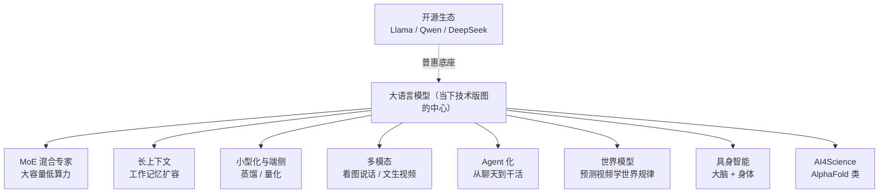

# 前沿技术地图

> **一句话理解**：一页看懂 2024–2026 年 AI 技术趋势——每个条目给一段直觉和"为什么重要"，再配一套辨别 hype 的土办法，让"追前沿"变成有地图的旅行。

[⬆️ 返回总目录](../../../README.md) · [⬆️ 返回本篇](../README.md) · [⬅️ 返回本章目录](./README.md)

| 属性 | 说明 |
|------|------|
| 难度 | ⭐⭐⭐（较难） |
| 所属分支 | 生成与多模态 |
| 前置知识 | [大语言模型LLM全景](../../4-专业方向/07-自然语言处理与LLM/04-大语言模型LLM全景.md)；本章[多模态模型](./04-多模态模型.md) |

---

## 📌 这一节解决什么问题

读到这里，知识树的"已长成部分"你基本走完了。但这个领域的麻烦在于：**树还在疯长**——每隔几周就有新架构、新模型刷屏，通稿一个比一个激动。两个相反的坑都存在：一头扎进去每天刷论文，被信息洪流淹死；或者干脆不看了，半年后发现行业换了底盘。

本页的解法是给一张**以 LLM 为中心的趋势地图**：每个条目只讲一段直觉 + 为什么重要，让你建立"哪个方向在发生什么"的轮廓感；真要深入时，再顺藤摸瓜。同时给一套**辨别 hype 的三条土办法**——前沿信息里噪声远多于信号，过滤能力比阅读量更值钱。

**本页是新技术蓄水池**：重要的新架构（如 JEPA 类）先在此登记，内容成熟后独立成页成章（见贡献指南扩展机制）。

## 🌱 通俗理解

把 AI 技术版图想成一座**正在扩建的城市**：老城区（CNN、Transformer）已经建好，导游手册（前十一章）足够详尽；而新城区每年冒出好几片——有的三年后成了市中心（如 Diffusion），有的烂尾了（历史上的不少"下一代架构"）。

对游客（学习者）来说，聪明的策略不是把每片新城区都跑遍，而是：**先看城市总平面图（本页），认出几条主干道（大趋势），再挑一块真正感兴趣的去深逛（顺着链接进各章）**。至于售楼处发的小广告（通稿），先按"三条土办法"验一验货。

## 📋 举个例子

用"辨别 hype 三条土办法"套一个真实套路走一遍。场景：某新模型 M 发布，通稿声称"**刷爆 20 个基准，全面超越主流闭源模型，推理能力接近人类专家**"。

| 检查项 | 土办法 | 查到的实际情况 | 判断 |
|--------|--------|------------------|------|
| 1. 看基准不看通稿 | 找论文附录的原始表格和测试条件 | 基准提升集中在 3 个，其余小幅波动；测试集疑似混入训练数据（污染） | 大打折扣 |
| 2. 看开源可复现 | 找代码、权重、第三方复现 | 无代码无权重，"即将开源"；社区无法复现 | 继续扣分 |
| 3. 看真实落地 | 找真实用户和场景 | 只有精剪 demo 视频，无产品、无 API、无企业接入 | 存疑 |

**结论**：标记为"观望"，等代码、第三方复现和真实用户三者至少来一个再更新判断。三条全不过的"突破"，历史命中率很低；反过来，三条全过的新技术（代码开放、基准扎实、有人真用），才是值得投入学习时间的。

## 🧠 核心原理

### 整体流程



### 逐步拆解（2024–2026 趋势条目）

**1. MoE 混合专家（Mixture of Experts）：分诊台**

直觉：医院不请全院专家看每个病人，而是**分诊台把病人派给对口的少数医生**。MoE 模型里有一个路由器（Router），每个 token 只激活全部参数中的一小块"专家"：

$$
y = \sum_{i \in \text{TopK}(g(x))} g_i(x)\cdot \mathrm{Expert}_i(x)
$$

> 👉 **人话**：路由器 $g$ 给每个专家打分，只有前 k 个（通常 1~2 个）真正干活——**参数总量很大（容量大），每次计算很少（算力省）**。为什么重要：它把"模型变大"和"推理变贵"解耦了，是当代大模型在算力墙下继续扩容的主流方案。

**2. 长上下文：工作记忆扩容的代价**

直觉：上下文窗口从几千 token 扩到百万级，像给模型做"工作记忆扩容手术"——能一口气读完整本书、整个代码库。为什么重要：长文档理解、大项目代码分析、"把全部资料塞进提示词"的玩法都靠它。代价：注意力计算量随长度至少线性甚至平方增长，且"塞得进"不等于"用得好"——长上下文中间段的信息容易被忽略（所谓"迷失在中间"），稀疏注意力、外推位置编码等工程都在围绕这个问题打转。

**3. 小型化与端侧：让模型住进手机**

直觉：**蒸馏（Knowledge Distillation）= 大教小**——让小模型模仿大模型的输出，把"阅历"压缩进小身体；**量化（Quantization）= 精度换内存**——把 32 位浮点的权重压成 8 位/4 位整数，模型瘦身几倍、效果掉一点。为什么重要：端侧运行意味着隐私（数据不出设备）、离线可用、零延迟零 API 费——细节见[第 4 章 · 推理与部署](../../3-深度学习/04-深度学习基础/05-推理与部署.md)。

**4. 世界模型（World Model）：看视频学物理**

直觉：与其让模型背下互联网文本，不如让它**看海量视频、预测接下来会发生什么**——要预测准，就得隐式学会物理规律（球会落地、液体会流动）。**JEPA / V-JEPA 路线**的一句话介绍：不预测像素、预测抽象表征——"别学画下一帧的每个像素，学抓住'下一秒会发生什么'的本质"，绕开了逐像素预测的算力黑洞。为什么重要：视频生成、具身智能、自动驾驶都需要"懂物理"的内核。**按本库扩展机制，此类新架构先在本页登记，成熟后独立成页成章。**

**5. 具身智能（Embodied AI）：大脑 + 身体**

直觉：给大模型这颗"大脑"接上机器人"身体"——看懂环境、听懂指令、控制机械臂干活。为什么重要：多模态感知 + 规划 + 控制在同一系统里闭环，是 AI 从"打字员"走向"劳动者"的关键一步，也是世界模型的天然试验场。

**6. AI4Science：AlphaFold 一句话**

直觉：AlphaFold 把"预测蛋白质三维结构"从需要数年的实验缩到分钟级计算，横扫结构生物学。为什么重要：它证明了"用基础模型 + 海量科学数据"能直接产出科学发现，同款配方正在复制到材料、气象、数学等领域。

**7. Agent 化：从聊天到干活**

直觉：用户要的不是一个聊天框，而是一个**能规划步骤、调用工具、检查结果、失败重试的干活的系统**——查资料、订机票、改代码。为什么重要：模型能力只有变成"行动"才产生生产力；这一方向的完整展开见[第 7 章 · RAG 与 Agent](../../4-专业方向/07-自然语言处理与LLM/06-RAG与Agent.md)。

**8. 开源生态：普惠底座**

直觉：Llama、Qwen、DeepSeek 等开源/开放权重模型让"用得起顶级模型"从奢望变成标配。为什么重要：本页所有趋势的扩散速度都被开源放大——小团队、研究者、个人都能拿到接近前沿的底盘，创新不再被少数 API 门口卡住。

### 如何跟进前沿

<details>
<summary>🔍 展开：三个值得放进收藏夹的信息源</summary>

- **arXiv**（[arxiv.org](https://arxiv.org)）：论文第一现场，cs.CL / cs.CV / cs.LG 三个板块按需订阅。技巧：只看标题和摘要做初筛，一天能扫几百篇；
- **Hugging Face Papers**（[huggingface.co/papers](https://huggingface.co/papers)：带社区投票和配套开源实现的论文列表——**有高票又有实现**的论文，价值密度远高于纯通稿；
- **优质博主 / 长文作者**：如 Lilian Weng（lilianweng.github.io）这类"深且慢"的技术长文——前沿信息按天计价，但高质量的理解按年保值，两种节奏都要有。

</details>

辨别 hype 三条土办法（已在上面例子中演示）：**看基准不看通稿、看开源可复现、看真实落地**。

## 💻 动手试试

用 numpy 玩一个玩具 MoE 路由器，体会"参数很多、每次算得很少"：

```python
import numpy as np

rng = np.random.default_rng(0)
d, n_experts = 8, 4

# 4 个"专家"：各自擅长不同领域的子网络（这里用随机矩阵模拟）
experts = [rng.normal(size=(d, d)) for _ in range(n_experts)]
# 路由器：一个线性层给每个 token 的"专家偏好"打分
W_router = rng.normal(size=(d, n_experts))

tokens = rng.normal(size=(3, d))          # 3 个输入 token
for i, x in enumerate(tokens):
    scores = x @ W_router                 # 对 4 个专家打分
    top = scores.argmax()                 # 只选 1 个专家（Top-1 路由）
    out = x @ experts[top]                # 只有被选中的专家真正计算
    used = 1 / n_experts
    print(f"token{i}：专家得分 {np.round(scores, 2)} → 只激活专家 {top}"
          f"（{n_experts} 个专家只用了 {used:.0%} 的算力）")
# 预期：每个 token 激活的专家编号各不相同——负载由路由器动态分配
```

## 🔗 在知识树中的位置

- **上游**：[大语言模型LLM全景](../../4-专业方向/07-自然语言处理与LLM/04-大语言模型LLM全景.md)——本页地图的中心节点；本章[多模态模型](./04-多模态模型.md)——多模态是世界模型与具身智能的地基；
- **下游**：无固定下游——**本页是全库新技术的蓄水池**，重要新架构先在此登记，成熟后按贡献指南扩展机制独立成页成章；
- **横向对比**：[推理与部署](../../3-深度学习/04-深度学习基础/05-推理与部署.md)——小型化/量化趋势的工程主场；[RAG 与 Agent](../../4-专业方向/07-自然语言处理与LLM/06-RAG与Agent.md)——Agent 化趋势的专题页。

## ⚠️ 常见误区

- **误区一**："追前沿 = 每天读论文" → 先建地图感（本页这类总览），再按需深入；信息按天计价，理解按年保值；
- **误区二**："参数越大越先进" → MoE、蒸馏、量化这些主流方向恰恰在**把"有效能力"和"参数量/计算量"解耦**——评价模型看基准和落地，不看体重秤；
- **误区三**："没听说 = 不重要" → JEPA 类路线在大众媒体上声量很小，但可能是下一代架构的候选——这正是"蓄水池"页存在的理由。

## 📝 小结与自测

**要点回顾**

- 八大趋势：MoE、长上下文、小型化与端侧、世界模型（JEPA 类）、具身智能、AI4Science、Agent 化、开源生态；
- 共同底色：在算力墙下"把能力与计算解耦"，并让模型从语言走向感知与行动；
- 辨别 hype 三条：看基准不看通稿、看开源可复现、看真实落地；
- 本页是新技术蓄水池：新架构先登记，成熟后独立成页成章。

**自测一下**（点击展开答案）

<details>
<summary>问题 1：MoE 为什么能"大容量、低算力"？</summary>

因为路由器让每个 token 只激活 Top-k 个专家（常为 1~2 个）：总参数可以堆得很大（知识容量大），但单次前向真正参与计算的只是其中一小块（算力省）。容量与计算被解耦。

</details>

<details>
<summary>问题 2：JEPA 路线与"逐像素预测视频"的世界模型路线，核心分歧是什么？</summary>

预测目标不同：逐像素路线要求模型画出下一帧的每个像素（算力大、易被纹理细节拖累）；JEPA 路线不预测像素、预测抽象表征——在"语义/概念层"预测下一刻会发生什么，绕开像素级的算力与冗余。

</details>

## 📚 延伸阅读

- 论文库：[arXiv](https://arxiv.org)——cs.CL / cs.CV / cs.LG，前沿论文第一现场
- 论文投票站：[Hugging Face Papers](https://huggingface.co/papers)——高票 + 有开源实现的论文优先看
- 博客：Lilian Weng, [lilianweng.github.io](https://lilianweng.github.io)——高质量技术长文，理解按年保值的典范

---

[⬅️ 上一页：多模态模型](./04-多模态模型.md) · [返回本章目录](./README.md) · [下一页：生产实战 ➡️](./99-生产实战.md)
