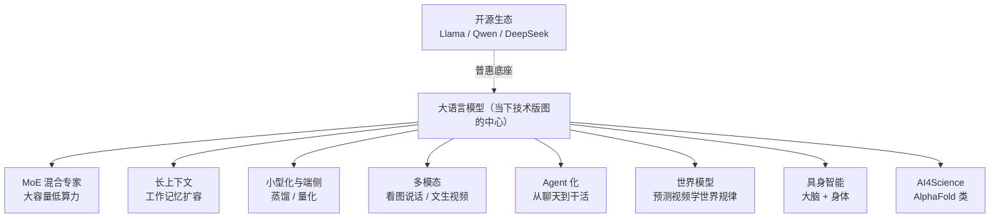
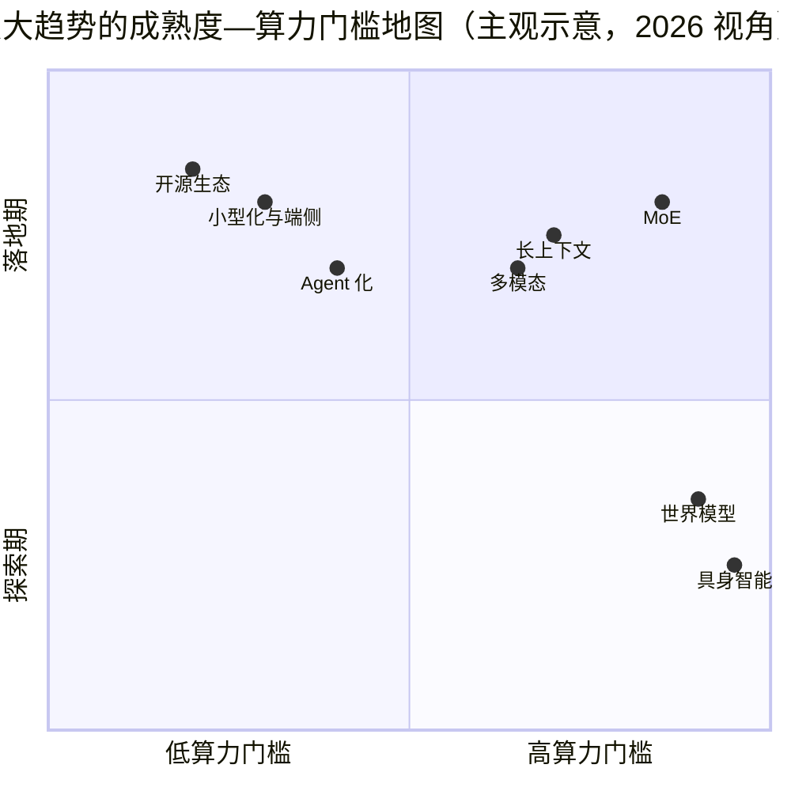

# 前沿技术地图

> **一句话理解**：一页看懂 2024–2026 年 AI 技术趋势——每个条目给一段直觉 + 一层机理（它靠什么起作用、又会在哪里失灵），再配一套辨别 hype 的方法，让"追前沿"变成有地图的旅行。

[⬆️ 返回总目录](../../../README.md) · [⬆️ 返回本篇](../README.md) · [⬅️ 返回本章目录](./README.md)

| 属性 | 说明 |
|------|------|
| 难度 | ⭐⭐⭐（较难） |
| 所属分支 | 生成与多模态 |
| 前置知识 | [大语言模型LLM全景](../../4-专业方向/07-自然语言处理与LLM/04-大语言模型LLM全景.md)；本章[多模态模型](./04-多模态模型.md) |

---

## 📌 这一节解决什么问题

读到这里，知识树的"已长成部分"你基本走完了。但这个领域的麻烦在于：**树还在疯长**——每隔几周就有新架构、新模型刷屏，通稿一个比一个激动。两个相反的坑都存在：一头扎进去每天刷论文，被信息洪流淹死；或者干脆不看了，半年后发现行业换了底盘。

本页的解法是给一张**以 LLM 为中心的趋势地图**：每个条目讲"直觉 + 为什么重要 + **机理一层**"——这一层是本页的深度所在，让你不只记住名词，还能说出"它靠什么起作用、不加某个部件为什么会坏"；真要深入时，再顺藤摸瓜。同时给一套**辨别 hype 的三步流程**（表格化）——前沿信息里噪声远多于信号，过滤能力比阅读量更值钱。

**本页是新技术蓄水池**：重要的新架构（如 JEPA 类）先在此登记，内容成熟后独立成页成章（见贡献指南扩展机制）。

## 🌱 通俗理解

把 AI 技术版图想成一座**正在扩建的城市**：老城区（CNN、Transformer）已经建好，导游手册（前十一章）足够详尽；而新城区每年冒出好几片——有的三年后成了市中心（如 Diffusion），有的烂尾了（历史上的不少"下一代架构"）。

对游客（学习者）来说，聪明的策略不是把每片新城区都跑遍，而是：**先看城市总平面图（本页），认出几条主干道（大趋势），再挑一块真正感兴趣的去深逛（顺着链接进各章）**。至于售楼处发的小广告（通稿），先按"三步流程"验一验货。

再看一眼这批新城区的**城市规划图纸**会发现一个共同主题：老城区的地价（算力）越来越贵，所以新片区的图纸几乎都在干同一件事——**把"能力"和"计算"拆开**：MoE 拆参数和算力、蒸馏拆知识和体积、量化拆精度和内存、长上下文拆记忆和成本。记住这条主线，下面八个条目就不是散落的名词，而是同一股力量在不同方向上的出口。

## 📋 举个例子

用"辨别 hype 三步流程"套一个真实套路走一遍。场景：某新模型 M 发布，通稿声称"**刷爆 20 个基准，全面超越主流闭源模型，推理能力接近人类专家**"。

| 检查项 | 土办法 | 查到的实际情况 | 判断 |
|--------|--------|------------------|------|
| 1. 看基准不看通稿 | 找论文附录的原始表格和测试条件 | 基准提升集中在 3 个，其余小幅波动；测试集疑似混入训练数据（污染） | 大打折扣 |
| 2. 看开源可复现 | 找代码、权重、第三方复现 | 无代码无权重，"即将开源"；社区无法复现 | 继续扣分 |
| 3. 看真实落地 | 找真实用户和场景 | 只有精剪 demo 视频，无产品、无 API、无企业接入 | 存疑 |

**结论**：标记为"观望"，等代码、第三方复现和真实用户三者至少来一个再更新判断。三步全不过的"突破"，历史命中率很低；反过来，三步全过的新技术（代码开放、基准扎实、有人真用），才是值得投入学习时间的。

## 🧠 核心原理

### 整体流程





（坐标为主观示意，且整张图会随年份向右上方漂移——它的价值在**相对位置**：越靠右上越"既贵又没落地"，学习投入前先看左下角。）

### 逐步拆解（2024–2026 趋势条目，每个条目多挖一层机理）

**1. MoE 混合专家（Mixture of Experts）：分诊台 + 为什么必须"摊派"**

直觉：医院不请全院专家看每个病人，而是**分诊台把病人派给对口的少数医生**。MoE 模型里有一个路由器（Router），每个 token 只激活全部参数中的一小块"专家"：

$$
y = \sum_{i \in \text{TopK}(g(x))} g_i(x)\cdot \mathrm{Expert}_i(x)
$$

> 👉 **人话**：路由器 $g$ 给每个专家打分，只有前 k 个（通常 1~2 个）真正干活——**参数总量很大（容量大），每次计算很少（算力省）**。它把"模型变大"和"推理变贵"解耦了，是当代大模型在算力墙下继续扩容的主流方案。

**机理层：不加负载均衡，专家就会"贫富分化"**。路由器的初始偏好天然不均匀，而训练会形成自增强回路：某专家被多选一点 → 训练信号多一点 → 变强一点 → 下次被更偏爱——几轮滚雪球后少数专家吃掉几乎全部 token，其余专家**饿死**（拿不到梯度、永久闲置），MoE 名存实亡，退化成"参数虚胖的稠密小模型"。解法是给路由加一项**负载均衡辅助损失（Load Balancing Loss）**：

$$
\mathcal{L}_{\text{bal}} = E \sum_{i=1}^{E} f_i \cdot P_i
$$

> 👉 **人话**：$E$ 是专家总数，$f_i$ 是实际分给专家 $i$ 的 token 比例（计数，不可导），$P_i$ 是路由器给专家 $i$ 的平均概率（可导）。乘积的妙处在于**借可导的 $P_i$ 把不可导的 $f_i$ 带进梯度**：专家 $i$ 拿的流量越多（$f_i$ 大），压低它路由概率的推力就越强；全部均匀时 $\mathcal{L}_{\text{bal}} = E\cdot\sum (1/E)(1/E) = 1/E$，是理论最小值。权重通常很小（0.01 量级，经验参考）——太大会把路由器逼成"绝对平均"，专家就白专了。工程上还常配**容量因子**（每个专家设硬上限，溢出 token 走残差直通）作双保险。

<details>
<summary>🧮 展开：容量因子与专家分布的工程账</summary>

- **容量因子（Capacity Factor）**：每个专家一步最多接 $C = \text{因子} \times (\text{token 数}/E)$ 个 token，超出的**直接丢弃走残差直通**（相当于"这个 token 本层不加工"）。作用：稳住显存与步时——没有上限时，一个热门专家可能把整卡显存吃爆；
- **溢出率**：被丢弃 token 的占比是 MoE 训练的重要监控量——持续偏高说明负载均衡没调好或容量因子太紧（溢出相当于白丢了这层的专家计算）；
- **专家并行（Expert Parallelism）**：总参数太大放不下单卡，专家被切到不同卡上，路由器把 token "寄"到对应卡——通信开销随专家数上升，所以 MoE 的扩展效率是"省算力、费通信"的交换。

👉 **人话**：均衡损失管"分得匀"，容量因子管"单个专家别爆仓"，专家并行管"人多库房也多"。三者合起来，MoE 才能真的兑现"大容量低算力"的支票。

</details>

**2. 长上下文：工作记忆扩容的代价 + 位置编码怎么外推**

直觉：上下文窗口从几千 token 扩到百万级，像给模型做"工作记忆扩容手术"——能一口气读完整本书、整个代码库。为什么重要：长文档理解、大项目代码分析、"把全部资料塞进提示词"的玩法都靠它。代价：注意力计算量随长度至少线性甚至平方增长，且"塞得进"不等于"用得好"——长上下文中间段的信息容易被忽略（所谓"迷失在中间"），稀疏注意力等工程都在围绕这个问题打转。

**机理层：RoPE 缩放**。Transformer 的位置编码（RoPE，旋转位置编码）靠"旋转角度"表达相对位置，训练只见过 8k 长度的模型，8k 之外的角度组合是没见过的外星输入。两种扩法一句话级：

- **位置插值（PI）**：把位置序号按比例压缩进已见区间——地图等比例缩小，百万 token 挤进 8k 的"市区图"，需少量微调；
- **NTK-aware 缩放**：不改序号、改频率——高频分量（管局部相邻关系）保持原样，低频分量（管长程关系）波长拉长，往往少调甚至免调即可外推。

> 👉 **人话**：插值是"把整张图缩小塞进旧地图"；NTK 是"保留近处刻度精度、只拉伸远处的比例尺"。前者稳妥费微调，后者省事但边界情形更玄。

<details>
<summary>🧮 展开：长上下文 vs RAG——同一需求的两条路，怎么选</summary>

"让模型用到海量资料"有两条路：把资料全塞进上下文（长上下文），或外挂检索按需取用（RAG，见[第 7 章 · RAG 与 Agent](../../4-专业方向/07-自然语言处理与LLM/06-RAG与Agent.md)）。生产上不是二选一，而是按账本配比：

| 维度 | 长上下文（全塞进去） | RAG（按需检索） |
|------|----------------------|-----------------|
| 成本 | 随上下文长度线性/平方涨，且**每次请求都要重算** | 检索便宜；只重算取回的片段 |
| 时延 | 首 token 延迟随长度显著增加 | 检索毫秒级，通常更快 |
| 信息完整性 | 理论上"全都在场"，跨章节全局推理占优 | 取回不全就答错——检索质量是新瓶颈 |
| "迷失在中间" | 长上下文中段信息利用率低（注意力对开头结尾偏心） | 片段短，每条都被充分读 |
| 知识更新 | 换资料 = 换上下文（或重训/长上下文微调） | 换库即生效，天然适合高频更新 |

👉 **人话**：资料**小而稳**（一份合同、一个代码文件）→ 长上下文直接塞；资料**大而多变**（全网知识、百万文档库）→ RAG 为主；两者常组合——RAG 取回的小批量再放进长上下文里做全局推理。

</details>

**3. 小型化与端侧：让模型住进手机 + 蒸馏到底在传什么**

直觉：**蒸馏（Knowledge Distillation）= 大教小**——让小模型模仿大模型的输出，把"阅历"压缩进小身体；**量化（Quantization）= 精度换内存**——把 32 位浮点的权重压成 8 位/4 位整数，模型瘦身几倍、效果掉一点。为什么重要：端侧运行意味着隐私（数据不出设备）、离线可用、零延迟零 API 费——工程细节见[第 4 章 · 推理与部署](../../3-深度学习/04-深度学习基础/05-推理与部署.md)。

**机理层：logit 蒸馏的公式与温度继承**。蒸馏不是让小模型抄"标准答案"，而是抄"大模型的犹豫"：

$$
\mathcal{L} = \underbrace{T^2 \cdot \mathrm{KL}\big(\mathrm{softmax}(z_t / T)\ \big\|\ \mathrm{softmax}(z_s / T)\big)}_{\text{logit 蒸馏项}} + \underbrace{\mathrm{CE}(y,\ z_s)}_{\text{普通分类项}}
$$

> 👉 **人话**：$z_t$、$z_s$ 是老师/学生的原始打分（logit），$T$ 是温度。one-hot 标签只说"这是猫"，老师的软分布会说"猫 90%、狗 8%、鱼 2%"——**狗和鱼之间的远近关系，就是 one-hot 丢掉、软分布保留的"暗知识"**。温度 $T$ 升高把分布焐软、让长尾关系浮出水面；训练时学生用与老师**相同的 $T$**，乘 $T^2$ 是补偿"软化导致的梯度缩小"。蒸馏形态的谱系：logit 蒸馏（本公式）→ 特征蒸馏（对齐中间层表征）→ 数据蒸馏（老师造数据喂学生）——当代小模型炼成的常见路径。

**4. 世界模型（World Model）：看视频学物理 + JEPA 的哲学分歧**

直觉：与其让模型背下互联网文本，不如让它**看海量视频、预测接下来会发生什么**——要预测准，就得隐式学会物理规律（球会落地、液体会流动）。为什么重要：视频生成、具身智能、自动驾驶都需要"懂物理"的内核。**按本库扩展机制，此类新架构先在本页登记，成熟后独立成页成章。**

**机理层：预测像素 vs 预测抽象表征**。逐像素路线（视频生成模型一系）要求模型画出下一帧的每个像素；JEPA / V-JEPA 路线**不预测像素、预测抽象表征**——预测器只负责在"表征空间"里预测下一帧的样子，表征由一个缓慢更新（EMA）的目标编码器定义。LeCun 一系反对像素预测的理由：像素里绝大部分是与决策无关的细节（光照变化、纹理噪声、背景晃动），逐像素预测等于**把模型容量浪费在建模不可预测也不重要的噪声上**——"智能体需要知道杯子会不会掉下来，不需要知道掉下来时每片反光"。

> 👉 **人话**：考试考"明天会发生什么"，逐像素路线要求你把明天整幅画面画到像素级；JEPA 路线只要求你说对"杯子会摔碎"这个**要点**。前者逼真但容量花在布景上，后者省容量但"表征空间"没有像素那样的天然监督，训练和评测都更难——这是它声量小、研究价值高的原因。

世界模型三条路线一张表：

| 路线 | 预测什么 | 强项 | 痛点 |
|------|----------|------|------|
| 逐像素（视频生成一系） | 下一帧每个像素 | 画面逼真、可直接当生成产品卖 | 容量耗在纹理光影等不可预测细节上；物理规律只是"副产品" |
| 表征预测（JEPA / V-JEPA 一系） | 下一帧的抽象表征 | 容量集中在"会发生什么"；对噪声天然鲁棒 | 表征空间缺天然监督，训练稳、评测难，产品化远 |
| 混合（生成 + 判别/表征目标多任务） | 像素与抽象目标兼修 | 两条路线的折中实验场 | 目标怎么配平是门玄学 |

### 趋势失效边界速查（本页地图的"使用说明书"）

| 趋势 | 什么时候不灵 |
|------|--------------|
| MoE | 小规模模型（专家数少、总参数小）收益微弱还添复杂度；专家分布下溢出率高时等于白搭 |
| 长上下文 | 中段信息利用率衰减；任务真正需要的是"精准检索"而非"全在场"时，RAG 更便宜 |
| 蒸馏 | 老师没有的能力传不过去（天花板是老师）；跨模态/跨架构蒸馏的暗知识对齐仍是难题 |
| 量化 | 极低比特（2bit 级）对激活异常值敏感，效果掉得非线性；小模型比大模型更怕量化 |
| 世界模型 | 逐像素路线物理上"像但不守恒"（杯子穿过桌子）；表征路线离可控可用的产品还有距离 |
| 具身智能 | sim2real 三道裂缝没有弥合前，仿真里的成功率不能外推到真机 |
| Agent | 长链条错误累积：单步 95% 成功率 × 20 步 ≈ 36% 全链成功率——步数多的任务仍是硬骨头 |
| 开源生态 | 顶级闭源模型的能力前沿通常仍领先一个身位；License 条款差异大，商用前逐份核对 |

**5. 具身智能（Embodied AI）：大脑 + 身体 + sim2real 的三道坎**

直觉：给大模型这颗"大脑"接上机器人"身体"——看懂环境、听懂指令、控制机械臂干活。为什么重要：多模态感知 + 规划 + 控制在同一系统里闭环，是 AI 从"打字员"走向"劳动者"的关键一步，也是世界模型的天然试验场。

**机理层：sim2real（仿真到现实）为什么难**。策略几乎都在仿真里训练（便宜、可无限试错），但仿真到真机之间横着三道系统性裂缝：

| 裂缝 | 仿真里 | 现实里 |
|------|--------|--------|
| 物理 | 摩擦/接触/材质是理想化模型 | 微小的动力学偏差累积成大偏差，"仿真冠军"真机摔跟头 |
| 感知 | 干净、完整、无延迟的传感器 | 噪声、遮挡、光照变化、传感器延迟 |
| 执行 | 理想化的电机指令 | 回差、控制延迟、机械磨损 |

> 👉 **人话**：缓解三板斧——**域随机化**（训练时把摩擦、质量、光照当随机变量大范围扫，逼策略学到对参数不敏感的鲁棒解）、**真机微调**（仿真预训练 + 真机少量精调）、**遥操作采数据**（人操纵真机收集演示，供模仿学习）。为什么不用纯真机训练？回合免费的是仿真，真机每小时都在烧钱和冒险。

**6. AI4Science：AlphaFold 一句话**

直觉：AlphaFold 把"预测蛋白质三维结构"从需要数年的实验缩到分钟级计算，横扫结构生物学。为什么重要：它证明了"用基础模型 + 海量科学数据"能直接产出科学发现，同款配方正在复制到材料、气象、数学等领域。机理层一句话：蛋白质折叠的本质是"氨基酸序列 → 能量最低的稳定构型"，AlphaFold 用注意力机制在序列上做全局推理 + 几何先验，把这个映射学到了接近实验精度——它是"第 7 章注意力机制"在科学数据上的一次教科书级移植。

**7. Agent 化：从聊天到干活**

直觉：用户要的不是一个聊天框，而是一个**能规划步骤、调用工具、检查结果、失败重试的干活的系统**——查资料、订机票、改代码。为什么重要：模型能力只有变成"行动"才产生生产力；这一方向的完整展开见[第 7 章 · RAG 与 Agent](../../4-专业方向/07-自然语言处理与LLM/06-RAG与Agent.md)。机理层一句话：Agent 的可靠性瓶颈往往不在单步智力而在**长链条的错误累积**——每步 95% 的成功率，串 20 步只剩约 36%；所以工程重心在"校验、重试、护栏"，和第 01 页自回归"误差累积"是同一头怪兽。

**8. 开源生态：普惠底座**

直觉：Llama、Qwen、DeepSeek 等开源/开放权重模型让"用得起顶级模型"从奢望变成标配。为什么重要：本页所有趋势的扩散速度都被开源放大——小团队、研究者、个人都能拿到接近前沿的底盘，创新不再被少数 API 门口卡住。机理层一句话：开源模型的竞争维度从"只有最强"变成"同代际下谁的可微调性、License 友好度、工具链生态更好"——这也是 MoE/蒸馏/量化这些"降本技术"在开源侧被卷到极致的原因（大家拿到的底盘相近，成本成为主战场）。

**9. 端侧推理的真相：卡在访存，不在算力**

把"小型化与端侧"再往深挖一层——一个反直觉但重要的机理：**LLM 逐 token 解码是访存受限（Memory-bound）而非算力受限**。每生成一个 token，都必须把**全部权重**从显存搬进计算单元一次；每 token 的计算量（乘加次数）与搬运量同量级，算术强度极低——GPU 的计算单元大量空转等数据。

一笔账（数量级实算）：7B 参数模型 fp16 权重 ≈ 14 GB；显存带宽 1 TB/s 的卡，每 token 至少 $14\ \text{GB} / 1\ \text{TB/s} = 14\ \text{ms}$，**理论上限约 70 token/s——无论这颗芯片的峰值算力多强**。由此推出三条提速路径，全部围绕"少搬、摊薄"：

| 路径 | 机理 | 效果来源 |
|------|------|----------|
| 量化（fp16→4bit） | 权重变小，每 token 搬运量 ÷4 | 访存上限直接 ×4（这也是端侧量化提速比"省内存"更本质的原因） |
| 批处理 | 一次读权重同时服务多个请求 | 把"每 token 必读一遍权重"的成本摊到整批上 |
| 投机解码 | 小模型打草稿、大模型一次验证多份草稿 | 多个 token 共享一次大模型权重搬运 |

> 👉 **人话**：解码时的 GPU 像一个厨子，每做一道菜（token）都要把整间仓库（权重）巡一遍——**瓶颈不是炒菜的手速（算力），是巡仓库的腿（带宽）**。想快，要么仓库瘦身（量化），要么一趟多送几份单（批处理、投机解码）。

补一个容易混淆的边界：LLM 推理其实分两阶段，**受限类型不同**——**预填充（Prefill，一次性读入全部提示词）是算力受限**（这一步是并行的大矩阵乘，计算密度高）；**解码（Decode，逐 token 生成）才是访存受限**。所以"长提示 + 短回答"的任务（摘要、分类）主要贵在 prefill，"短提示 + 长回答"的任务（写作、代码）主要贵在 decode——优化前先看任务形态卡在哪一半，别用错药。

### 辨别 hype 的方法论（三步流程表格化）

| 步骤 | 看什么 | 红旗（扣分项） | 加分项 |
|------|--------|----------------|--------|
| 1. 查原始基准 | 论文/技术报告附录的原始表格、评测条件、误差线 | 只给通稿不给表；提升集中在少数基准；测试集疑似混入训练数据（污染） | 多基准一致提升、给置信区间、有消融实验 |
| 2. 查可复现性 | 代码、权重、第三方复现 | "即将开源"反复画饼；只有精剪 demo | 权重当天放出；社区已有独立复现 |
| 3. 查真实使用 | 独立用户评测、实际产品/工作流接入 | 讨论全是通稿转发；找不到真实用户 | 有人写失败案例分析；有生产环境接入 |

执行要点：**三步按顺序走，第一步不过就别急着激动**（基准不扎实，后两步无从谈起）；判断结论写成"三选一"——`跟进`（三步全过）/`观望`（部分过，等补齐）/`跳过`（通稿级证据）；给"观望"项设个复查时间（如一个月后回头看），避免拖着变成永远的悬案。

### 如何跟进前沿

<details>
<summary>🔍 展开：三个值得放进收藏夹的信息源</summary>

- **arXiv**（[arxiv.org](https://arxiv.org)）：论文第一现场，cs.CL / cs.CV / cs.LG 三个板块按需订阅。技巧：只看标题和摘要做初筛，一天能扫几百篇；
- **Hugging Face Papers**（[huggingface.co/papers](https://huggingface.co/papers)）：带社区投票和配套开源实现的论文列表——**有高票又有实现**的论文，价值密度远高于纯通稿；
- **优质博主 / 长文作者**：如 Lilian Weng（lilianweng.github.io）这类"深且慢"的技术长文——前沿信息按天计价，但高质量的理解按年保值，两种节奏都要有。

</details>

**信息源的阅读节奏**（两个频率档位，别混着刷）：

| 频率 | 信息源 | 目的 |
|------|--------|------|
| 每天 10 分钟 | arXiv 标题/摘要扫描 | 保持"出现了什么"的轮廓感，不深读 |
| 每月 1~2 次 | 高票论文精读 + 长文博客 | 把轮廓变成理解——按年保值的沉淀在这里 |

<details>
<summary>📋 展开：把三步流程变成一次 10 分钟例行检查（可直接抄的清单）</summary>

对每个刷屏的"突破"，按顺序过四条，任何一条卡住就停：

1. [ ] 找到**原始论文/技术报告**了吗？（连报告都没有、只有通稿 → 跳过，标记一个月后复查）
2. [ ] 打开**附录表格**：提升是全面还是个别基准？有没有测试集污染说明？有没有消融实验？
3. [ ] 搜**代码/权重**：放出了吗？第三方复现了吗？（搜"模型名 + reproduce / fail"）
4. [ ] 找**真实用户**：独立评测、失败案例讨论、生产接入痕迹（有大厂接入 ≠ 你能用，但至少排除"只有精剪 demo"）

结论三选一写下来：`跟进`（进学习清单）/ `观望`（写明在等什么：等代码？等复现？等下个版本？）/ `跳过`（写一句理由，防止半年后同款包装再来一遍）。

> 👉 **人话**：这套检查的价值不在"聪明"，在**留痕**——把判断写下来，一个月后回头对答案，你的 hype 雷达才会越校越准。

</details>

## 💻 动手试试

两个小实验，分别把"MoE 贫富分化"和"蒸馏的暗知识"摸到手。

**实验一：玩具 MoE 路由器 + 观察"偏心"如何自增强**

```python
import numpy as np

rng = np.random.default_rng(0)
d, n_experts = 8, 4

# 4 个"专家"：各自擅长不同领域的子网络（这里用随机矩阵模拟）
experts = [rng.normal(size=(d, d)) for _ in range(n_experts)]
# 路由器：一个线性层给每个 token 的"专家偏好"打分
W_router = rng.normal(size=(d, n_experts))

tokens = rng.normal(size=(3, d))          # 3 个输入 token
for i, x in enumerate(tokens):
    scores = x @ W_router                 # 对 4 个专家打分
    top = scores.argmax()                 # 只选 1 个专家（Top-1 路由）
    out = x @ experts[top]                # 只有被选中的专家真正计算
    used = 1 / n_experts
    print(f"token{i}：专家得分 {np.round(scores, 2)} → 只激活专家 {top}"
          f"（{n_experts} 个专家只用了 {used:.0%} 的算力）")
# 预期：每个 token 激活的专家编号各不相同——负载由路由器动态分配

# ---- 再看一步：1000 个 token 的路由分布（贫富差距检查）----
def route_dist(W, n=1000):
    counts = np.zeros(n_experts, dtype=int)
    for x in rng.normal(size=(n, d)):
        counts[np.argmax(x @ W)] += 1
    return counts

counts = route_dist(W_router)
print("各专家接到的 token 数:", counts, "→ 最忙专家占比 {:.0%}".format(counts.max() / 1000))

# 模拟"自增强"：把某列乘 1.2（假设专家 0 略强、被路由器略偏爱）
W_biased = W_router.copy(); W_biased[:, 0] *= 1.2
counts2 = route_dist(W_biased)
print("轻微偏置后:", counts2, "→ 最忙专家占比 {:.0%}".format(counts2.max() / 1000))
# 预期：专家 0 的占比明显上升——初始的小偏心被放大，
# 正文中"负载均衡损失"要对抗的就是这条自增强回路
```

**实验二：蒸馏温度——亲眼看"暗知识"浮现**

```python
import numpy as np

def softmax(x):
    e = np.exp(x - x.max()); return e / e.sum()

z_teacher = np.array([8.0, 1.0, 0.5, -1.0])   # 老师对 4 个类的原始打分（logit）
for T in [1.0, 4.0]:
    print(f"T={T}: 老师的软分布 {np.round(softmax(z_teacher / T), 3)}")
# 预期：T=1 → [0.998, 0.001, 0.001, 0.000]，接近 one-hot，类间关系看不见
#       T=4 → 约 [0.70, 0.12, 0.11, 0.07]，"第二可能的类"浮出水面——这就是暗知识
```

> 🧪 **改什么参数、看什么变化**：① 实验一把偏置系数从 1.2 加到 1.5——流量进一步向专家 0 集中，直观感受"不加均衡损失的雪球"；② 实验 把老师打分改成 `[8, 7.9, 0.5, -1]`（前两类几乎平手）——T=1 仍是碾压，T=4 时两者接近 50:50，体会温度对"难分类边界"的暴露作用；③ 把 T 调到 10——分布过于平坦，类间差异又被抹平：温度过高暗知识同样丢失。

## 🔗 在知识树中的位置

- **上游**：[大语言模型LLM全景](../../4-专业方向/07-自然语言处理与LLM/04-大语言模型LLM全景.md)——本页地图的中心节点；本章[多模态模型](./04-多模态模型.md)——多模态是世界模型与具身智能的地基；[分布式训练与模型规模](../../3-深度学习/04-深度学习基础/04-分布式训练与模型规模.md)——MoE 等扩容路线的算力背景；
- **下游**：无固定下游——**本页是全库新技术的蓄水池**，重要新架构先在此登记，成熟后按贡献指南扩展机制独立成页成章；
- **横向对比**：[推理与部署](../../3-深度学习/04-深度学习基础/05-推理与部署.md)——小型化/量化趋势与访存瓶颈的工程主场；[RAG 与 Agent](../../4-专业方向/07-自然语言处理与LLM/06-RAG与Agent.md)——Agent 化趋势的专题页。

## ⚠️ 常见误区

- **误区一**："追前沿 = 每天读论文" → 先建地图感（本页这类总览），再按需深入；信息按天计价，理解按年保值；
- **误区二**："参数越大越先进" → MoE、蒸馏、量化这些主流方向恰恰在**把"有效能力"和"参数量/计算量"解耦**——评价模型看基准和落地，不看体重秤；
- **误区三**："MoE 省算力是白捡的" → 它依赖负载均衡损失这类精心设计的约束，否则专家"贫富分化"会让大参数变成死参数；均衡权重调不好还会伤害专家分工（均衡过度 = 强迫均匀）；
- **误区四**："端侧推理慢是因为芯片算力弱" → 逐 token 解码主要卡在**访存带宽**：7B fp16 模型在 1TB/s 带宽的卡上理论上限约 70 token/s，算力再强也突破不了这堵墙——提速要靠量化/批处理/投机解码这些"少搬权重"的手段；
- **误区五**："没听说 = 不重要" → JEPA 类路线在大众媒体上声量很小，但可能是下一代架构的候选——这正是"蓄水池"页存在的理由；
- **误区六**："蒸馏就是把同款模型压小" → 跨家族蒸馏（老师与学生的架构、模态差异大）时软分布难以对齐，暗知识传递效率大打折扣——"大教小"最顺的场景是同架构不同规模，跨架构要谨慎评估。

## 📝 小结与自测

**要点回顾**

- 八大趋势：MoE、长上下文、小型化与端侧、多模态、世界模型（JEPA 类）、具身智能、AI4Science、Agent 化，外挂一个开源生态底座；共同底色是"把能力与计算解耦"（MoE 拆参数与算力、蒸馏拆知识与体积、量化拆精度与内存、长上下文拆记忆与成本）；
- 机理层要点：MoE 靠负载均衡损失对抗"路由自增强回路"（$\mathcal{L}_{bal}=E\sum f_iP_i$ 借可导的 $P_i$ 带动不可导的 $f_i$）；长上下文靠 RoPE 缩放（插值压缩 vs NTK 拉频率）外推；蒸馏用温度 $T$ 焐软老师的分布、把类间"暗知识"传给学生；JEPA 与像素预测的分歧是"在哪个空间预测未来"；sim2real 的三道裂缝（物理/感知/执行）靠域随机化等弥合；LLM 解码卡在访存带宽而非算力（7B/16bit/1TB/s ≈ 70 token/s 上限）；
- 辨别 hype 三步流程：查原始基准 → 查可复现性 → 查真实使用；结论写成跟进/观望/跳过，观望项设复查时间；把判断留痕，雷达才会越校越准；
- 工程配套层：MoE 的容量因子/专家并行、长上下文与 RAG 的取舍表（小而稳塞上下文、大而多变走检索）、蒸馏的三种形态（logit/特征/数据）——每个趋势都有"什么时候不灵"的失效边界（速查表）；
- 阅读节奏分档：每天 10 分钟扫标题保轮廓感，每月 1~2 次精读做沉淀——信息按天计价，理解按年保值。
- 本页是新技术蓄水池：新架构先登记，成熟后独立成页成章。

**自测一下**（点击展开答案）

<details>
<summary>问题 1：MoE 为什么能"大容量、低算力"？不加负载均衡损失会发生什么？</summary>

容量与计算解耦：路由器让每个 token 只激活 Top-k 个专家（常为 1~2 个），总参数可以堆得很大（知识容量大），单次前向只算一小块（算力省）。不加均衡损失时路由存在自增强回路——被偏爱一点的专家得到更多训练、变得更强、被更偏爱——最终少数专家吃掉全部流量、其余饿死，MoE 退化为参数虚胖的稠密小模型。均衡损失 $E\sum f_i P_i$ 借可导的路由概率 $P_i$ 把实际流量占比 $f_i$ 带进梯度，流量越多的专家被压得越狠，维持摊派。

</details>

<details>
<summary>问题 2：蒸馏公式里的温度 T 在干什么？为什么学生训练时要乘 T²？</summary>

T 把老师的 logits 焐软：T=1 时最优类的概率接近 1（形同 one-hot），长尾类之间的远近关系（暗知识）看不见；T 升高后分布变软，"第二可能的类"浮出水面。乘 $T^2$ 是补偿——softmax 被温度软化后梯度量级按 $1/T^2$ 缩小，不补这一项，蒸馏项相对普通交叉熵项就几乎失去话语权。

</details>

<details>
<summary>问题 3：JEPA 路线与"逐像素预测视频"的世界模型路线，核心分歧是什么？</summary>

预测目标所在的空间不同：逐像素路线要求模型画出下一帧的每个像素（逼真但算力巨大，且像素里大量与决策无关的细节如光照纹理会消耗模型容量）；JEPA 路线在表征空间预测下一刻的抽象状态（预测器输出的是目标编码器定义的表征），把容量集中在"会发生什么"而非"画面长什么样"。代价是表征空间缺少像素级的天然监督，训练稳定性与评测难度更高。

</details>

<details>
<summary>问题 4：为什么说 LLM 解码"卡在访存不在算力"？用一个数字说明，并给出两条提速路径。</summary>

每生成一个 token 都要把全部权重从显存读一遍：7B 模型 fp16 权重约 14 GB，在 1 TB/s 带宽的卡上每 token 至少 14 ms，理论上限约 70 token/s——与芯片峰值算力无关。提速路径：量化（4bit 权重使搬运量 ÷4）、批处理（一次读权重服务整批请求摊薄成本）、投机解码（多 token 共享一次大模型权重搬运），共同思想是"少搬、摊薄"。

</details>

<details>
<summary>问题 5：同一个"把海量资料给模型用"的需求，什么情况选长上下文、什么情况选 RAG？给出两条判断依据。</summary>

一看**资料规模与更新频率**：资料小而稳（单份合同、一个代码文件）直接塞长上下文，全局推理完整；资料大而多变（百万文档、高频更新），RAG 按需检索便宜且换库即生效。二看**任务形态**：需要跨章节全局综合的长链推理，长上下文占优；需要精准事实命中，RAG 检索质量是关键瓶颈。生产常态是组合：RAG 取回的小批量片段，放进长上下文里做全局推理。

</details>

## 📚 延伸阅读

- 论文库：[arXiv](https://arxiv.org)——cs.CL / cs.CV / cs.LG，前沿论文第一现场
- 论文投票站：[Hugging Face Papers](https://huggingface.co/papers)——高票 + 有开源实现的论文优先看
- 社区盲测榜单：[LMArena](https://lmarena.ai)（原 LMSYS Chatbot Arena）——真实用户匿名对战投票，是"查真实使用"这步的快捷入口（注意：用户偏好 ≠ 你的场景表现，仍要自测）
- 论文：Shazeer et al., *Outrageously Large Neural Networks: The Sparsely-Gated Mixture-of-Experts Layer*（2017，负载均衡损失的出处），[arXiv:1701.06538](https://arxiv.org/abs/1701.06538)
- 论文：Hinton et al., *Distilling the Knowledge in a Neural Network*（2015，温度蒸馏的出处），[arXiv:1503.02531](https://arxiv.org/abs/1503.02531)
- 论文：LeCun, *A Path Towards Autonomous Machine Intelligence*（2022，JEPA 哲学的系统阐述），[openreview.net](https://openreview.net/forum?id=BZ5a1r-kVsf)
- 博客：Lilian Weng, [lilianweng.github.io](https://lilianweng.github.io)——高质量技术长文，理解按年保值的典范

---

[⬅️ 上一页：多模态模型](./04-多模态模型.md) · [返回本章目录](./README.md) · [下一页：生产实战 ➡️](./99-生产实战.md)
