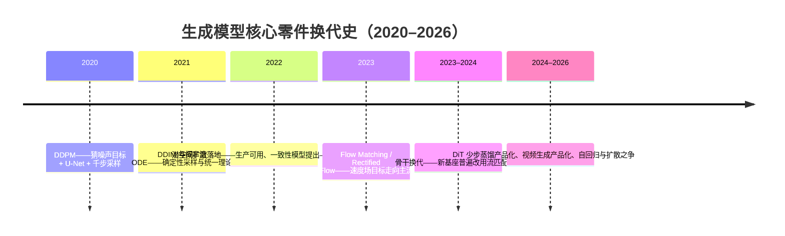
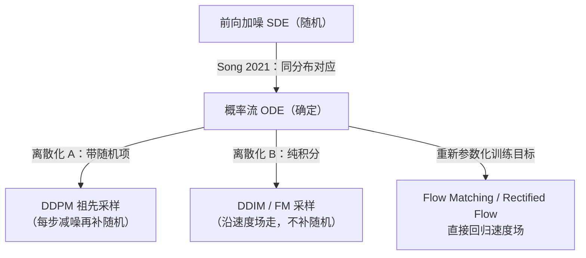
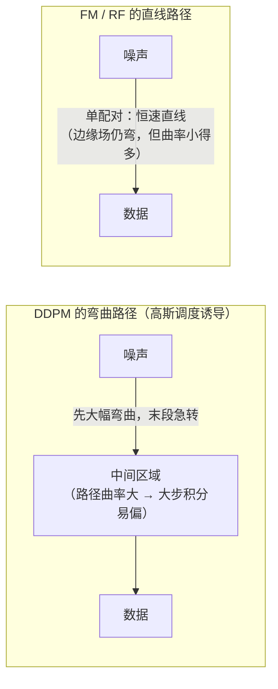
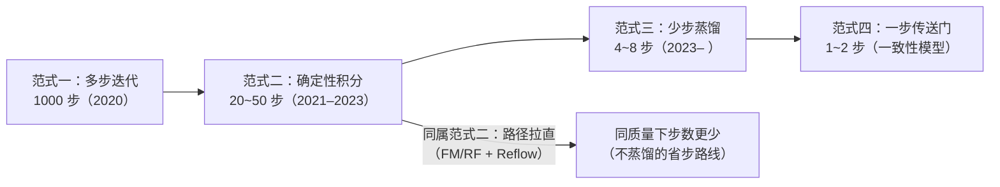
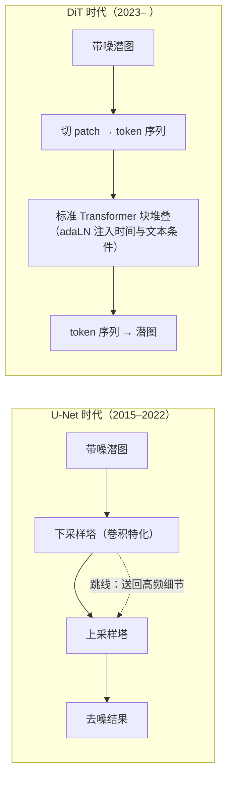
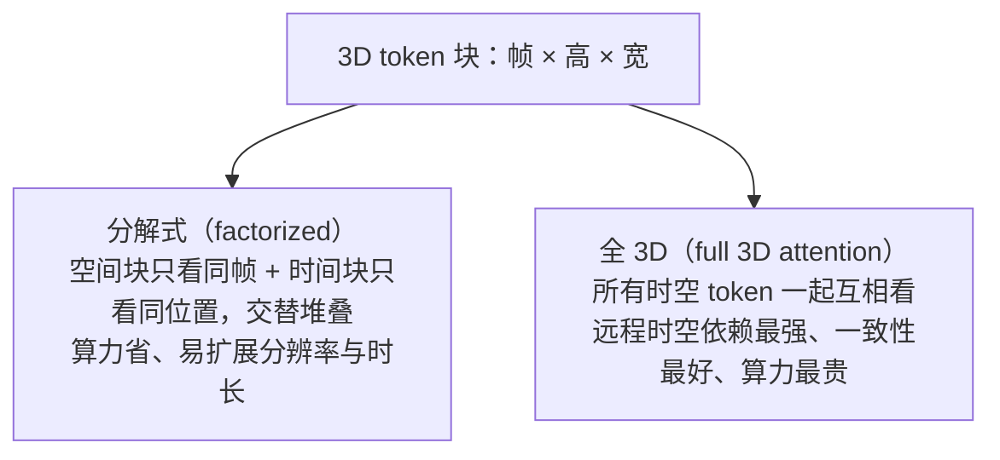

# 进阶专题：生成模型前沿

> **一句话理解**：2023 年以来，图像与视频生成换了三件核心零件——训练目标（猜噪声 → 学速度场）、骨干网络（U-Net → Transformer）、采样方式（几十步 → 蒸馏到几步）——本页把这三件零件拆开讲透，再摊开"自回归 vs 扩散"的路线之争与三个没有答案的开放问题。

[⬆️ 返回总目录](../../../README.md) · [⬆️ 返回本篇](../README.md) · [⬅️ 返回本章目录](./README.md)

| 属性 | 说明 |
|------|------|
| 难度 | ⭐⭐⭐⭐（高阶） |
| 所属分支 | 生成与多模态 |
| 前置知识 | [扩散模型Diffusion](./03-扩散模型Diffusion.md)（本页的直接地基）；[多模态模型](./04-多模态模型.md)；[Transformer 与注意力机制](../../4-专业方向/07-自然语言处理与LLM/02-Transformer与注意力机制.md) |

---

## 📌 这一节解决什么问题

第 03 页结束在一个 2022 年的世界：DDPM 训练目标、U-Net 骨干、DDIM 把采样压到 20~50 步。但 2023–2026 年生产级生成模型几乎把每件核心零件都换了一遍，而且换法出人意料——**不是发明新家族，而是把老家族的零件逐个重造**：

- **训练目标换血**：新一代文生图基座普遍不再"猜噪声"，改学一个"速度场"（Velocity Field，每一点该往哪搬、搬多快）——Flow Matching / Rectified Flow 路线。为什么改？改了什么、没改什么？
- **骨干换代**：去噪网络从服役八年 U-Net 换成纯 Transformer（DiT，Diffusion Transformer）。图明明不是序列，为什么换成序列机器反而赢了？
- **步数坍缩**：几十步迭代被蒸馏到 4~8 步甚至 1~2 步，实时生成成为可能。蒸馏到底蒸掉了什么？
- **模态扩张**：同样的配方加上时间轴就成了视频生成，并引出"世界模拟器"的叙事。
- **路线之争**：GPT 式的"下一个 patch 预测"在图像生成上回归，与扩散正面对垒——两条路线各自押注了什么？

本页是第 03/04 页的"续集"：不再从零讲扩散，而是讲**扩散怎么变成今天的样子**。一条主线贯穿全页：**2023 年以来的所有换代，本质都是"向 LLM 技术栈靠拢"**——目标函数变简单了（更像普通回归）、骨干变统一了（就是 Transformer）、接口变 token 化了（图像、视频都是序列）——生成侧与理解侧的技术栈在合流（[第 05 页](./05-前沿技术地图.md)深度视角讲过这层趋势）。

## 🌱 通俗理解

三件新零件，三个比喻：

- **学速度场（Flow Matching）= 从"蒙眼下山"换成"学一条直达车道"**。DDPM 的去噪像蒙着眼在雾里下山，每步只能凭脚下坡度挪一小步，还得故意晃一晃（随机注入）保持方向正确；Flow Matching 直接学一张"导航地图"——从噪声平原上任何一点出发，告诉你**直奔数据山谷的速度向量**。路直了，同样的油门就能少停几站（少步采样）。
- **DiT = 给生成模型换装 LLM 的发动机**。U-Net 是为图像手工打造的专用发动机（卷积、跳线，处处是"图像特化"）；DiT 把它换成 LLM 同款的标准 Transformer——单看某个零件未必更强，但**整条生产线（训练框架、并行策略、推理优化、_scaling 曲线）全部与 LLM 共用**，规模化起来便宜一个量级。
- **蒸馏 = 老师傅把几十道工序压成两道**。50 步采样的模型像一位每道工序都不能省的老师傅；一致性蒸馏让徒弟观察"老师傅从任何中间状态直达成品"的过程，学会两步出活——快了十倍，但徒弟的火候（多样性、细节）终究是学出来的近似，不是原厂。

视频生成本页只加一个比喻：**给 Diffusion 装上时间轴**——把"去噪一张图"变成"去噪一段时空"，难点从"画得像"升级为"动得对"（帧与帧要一致，物理要讲道理）。

## 📋 举个例子

**手算一个 Flow Matching 的训练样本（1 维）**。设数据端样本 $x_1 = 3.0$（真实数据），噪声端抽样 $x_0 = -0.5$（标准正态抽一次），直线路径插值：

| $t$ | 位置 $x_t = (1-t)\,x_0 + t\,x_1$ | 训练目标（速度）$x_1 - x_0$ |
|-----|----------------------------------|------------------------------|
| 0.0 | $-0.5$（纯噪声端） | $3.5$ |
| 0.3 | $0.7\times(-0.5) + 0.3\times 3.0 = 0.55$ | $3.5$ |
| 0.7 | $0.3\times(-0.5) + 0.7\times 3.0 = 1.95$ | $3.5$ |
| 1.0 | $3.0$（数据端） | $3.5$ |

看两个关键性质：**其一，目标是常数**——对这一对 $(x_0, x_1)$ 来说，无论 $t$ 取多少，回归目标都是 $3.5$，统计性质不随时间步漂移（对照第 03 页：DDPM 的噪声目标虽也是标准正态，但有效权重随调度剧烈变化）；**其二，路径是直线**——单条轨迹上欧拉积分走几步都不偏（直线怎么走都在线上），弯曲只来自"无数配对平均"之后的边缘场，误差天然小。这两个性质就是"训练更稳、采样更快"的全部来源，机理在第 2 节展开。

<details>
<summary>📊 展开：步数—质量 trade-off 曲线的直觉（没有图，用表说话）</summary>

把"采样步数"从多到少滑一遍（以未蒸馏的潜空间扩散/流模型为参照，量级为经验参考）：

| 采样步数 | 质量（未蒸馏模型） | 质量来源与症状 |
|----------|--------------------|----------------|
| 1000 → 50 | 几乎无损 | 边际收益递减区：多走的步基本白走 |
| 50 → 20 | 轻微下降 | DDIM 类确定性采样的舒适区；生产常用区间 |
| 20 → 8 | 明显下降（细节糊、结构偶尔崩） | "拐点区"：直线化好的模型（FM/RF）在这里比 DDPM 家族明显抗跌 |
| 8 → 2 | 断崖（未蒸馏基本不可用） | 每步跨度太大，欧拉积分脱离速度场的局部有效范围 |
| 2 → 1 | — | 只有蒸馏过的模型能站住：一致性模型/强蒸馏模型的领地 |

三条直觉：① 曲线不是线性而是"缓—缓—陡—崖"，**部署选步数实质是在拐点区找性价比**；② 蒸馏的作用是把整条曲线**向左平移**（同样质量需要更少步数），代价是曲线右端（多步区）不再增长甚至略降——蒸掉的是"精修上限"；③ FM/RF 训练的模型曲线整体更靠左（路径更直，同样步数积分误差更小）——"训练目标的选择"最终在**部署成本**上兑现。

</details>

## 🧠 核心原理

### 整体流程



本页七节：连续时间视角（把 DDPM 和 FM 缝在同一张 ODE 图上）→ Flow Matching → 少步蒸馏 → DiT → 视频生成 → 路线之争 → 开放问题。

### 1. 连续时间视角：DDPM 和 Flow Matching 是同一头大象

第 03 页的扩散是**离散**的：$T=1000$ 步、每步一个 $\beta_t$。把步长趋于零，离散链收敛成连续的**随机微分方程**（SDE，Stochastic Differential Equation）——前向加噪的连续版：

$$
dx = -\frac{1}{2}\,\beta(t)\,x\,dt + \sqrt{\beta(t)}\,dw
$$

> 👉 **人话**：把"每步加一点噪"焊成连续流动：$dw$ 是布朗运动（无穷细碎的随机抖动），$\beta(t)$ 控制抖动的强度——之前那张 $\beta$ 表就是这条连续曲线的离散采样点。

随机过程难以精确反向，但 2021 年（Song 等人的 score-SDE 工作）证明了一个关键定理：**任何扩散 SDE 都有一个同分布的确定性对应物——概率流 ODE**（Probability Flow ODE）：

$$
\frac{dx}{dt} = f(x, t) - \frac{1}{2}\,g^2(t)\,\nabla_x \log p_t(x)
$$

> 👉 **人话**：虽然扩散的正向是随机的，但它每一步"把分布变成什么样"是确定的；于是存在一条确定性的流（ODE），沿它走能把噪声分布**搬运**到数据分布——轨迹上的随机性被"平均"进了流场里。$\nabla_x \log p_t(x)$ 叫分数（score），就是第 03 页网络学的东西换了个写法。

这里埋着本页最重要的连接：第 03 页的 $\epsilon_\theta$ 与 score 是同一个对象的两件衣服——

$$
\epsilon_\theta(x_t, t) \approx -\sqrt{1-\bar{\alpha}_t}\,\nabla_x \log p_t(x_t)
$$

> 👉 **人话**："猜噪声"的网络和"估计分数"的网络只差一个随时间变化的缩放系数——DDPM 的噪声目标、DDIM 的确定采样、后面 FM 的速度场，训练的其实是**同一个概率流的三个坐标系**。

于是得到统一图景：



**DDPM 和 Flow Matching 都是概率流 ODE 的离散化**——区别只在：DDPM 从"加噪链"出发推导目标（绕了一步），FM 直接对"从噪声到数据的搬运路径"设计目标（一步到位）。下一节把 FM 讲透。

<details>
<summary>🧮 展开推导：DDIM 的更新式就是概率流 ODE 的欧拉一步</summary>

把第 03 页 DDIM 的更新式（$\sigma_t = 0$ 的确定版）抄过来，用 $\hat{x}_0 = \big(x_t - \sqrt{1-\bar\alpha_t}\,\epsilon_\theta\big)/\sqrt{\bar\alpha_t}$ 改写：

$$
x_{t-1} = \sqrt{\bar\alpha_{t-1}}\;\hat{x}_0 + \sqrt{1-\bar\alpha_{t-1}}\;\epsilon_\theta(x_t, t)
$$

> 👉 **人话**：这一步干的事——先用网络猜出"干净图的估计" $\hat{x}_0$，再按**下一时刻的信噪比**重新混合出 $x_{t-1}$。混合系数由 $\bar\alpha$ 序列决定，这正是概率流 ODE 里 $f(x,t)$ 与 $g(t)$ 的离散采样。

再把它与欧拉积分对照：FM 的采样是 $x_{t+\Delta} = x_t + v_\theta(x_t,t)\,\Delta$，一步 = 位置 + 速度 × 步长；上式整理后同样是"位置 +（由 $\hat x_0$ 与 $\epsilon_\theta$ 线性组合出的）有效速度 × 步长"。**同一个 ODE，两套记号**——DDIM 里那句"轨迹近似一条概率流 ODE"（第 03 页）在连续时间极限下就是严格等式。这也是为什么 FM 模型可以直接借用 DDIM 一系的所有积分器（欧拉、Heun、DPM-Solver 类）：被积对象换了名字，积分学没换。

三种参数化的"翻译词典"（都是同一个量的不同衣服；$\hat{x}$ 统一记"干净图估计"，FM 一侧 $t=1$ 为数据端）：

| 参数化 | 网络输出 | 与 $\hat{x}$ 的换算 | 出场 |
|--------|----------|------------------------|------|
| 噪声 $\epsilon_\theta$ | 当初撒的噪声 | $\hat{x} = (x_t - \sqrt{1-\bar\alpha_t}\,\epsilon_\theta)/\sqrt{\bar\alpha_t}$ | DDPM |
| 分数 $s_\theta$ | $\nabla_x \log p_t(x)$ 的估计 | 与 $\epsilon_\theta$ 差一个时变缩放（上文公式） | score-SDE |
| 速度 $v_\theta$ | $\frac{dx_t}{dt}$ | $\hat{x} = x_t + (1-t)\,v_\theta$（条件速度下精确；边缘速度下是近似） | FM / RF |

> 👉 **人话**：写代码时换个参数化，网络、数据、训练循环几乎不用动——换的是"考题"和"答题卡的坐标系"。理解了这张词典，读任何新论文都能先把它的目标函数翻译回这三者之一。

</details>

**边界说明（反例与边界）**。本节的统一图景建立在三个"理想化"上，逐条看它们在哪里漏：

- **同分布等价假设"精确的 score"**：概率流 ODE 的严格等价要求网络输出恰好是 $\nabla_x \log p_t(x)$；现实中 $\epsilon_\theta$ 是有限数据、有限容量下的**近似**——沿"近似速度场"积分，得到的是某个近旁分布的样本，而非精确的 $p_{\text{data}}$。误差多大？理论只能给上界形状、给不了实用数值，最终仍靠人评与少步采样检查兜底；
- **连续时间 + 无限步积分**：欧拉一步是离散化近似，步长（采样步数）压得太狠，积分脱离速度场的局部有效范围——上文"8→2 步断崖"正是这条边界的工程显影；
- **$\epsilon \leftrightarrow$ score 换算系数只在真实前向下精确**：系数 $-\sqrt{1-\bar\alpha_t}$ 用的是**调度定义的**理论边缘分布；一旦数据分布或调度末端没走到位（第 03 页线性调度的偏色问题），换算本身就带偏。反过来说，这也解释了为什么"换参数化"不改变本质、但"换调度/权重"会真实改变模型行为——前者是坐标系，后者是分布本身。

### 2. Flow Matching / Rectified Flow：直接学"搬运速度"

**核心思想**。生成 = 把简单分布（标准高斯）搬运成数据分布。设想一条连接两端的**时间参数化路径** $x_t$：$t=0$ 时在噪声 $x_0$，$t=1$ 时在数据 $x_1$。最简单的选择是直线：

$$
x_t = (1-t)\,x_0 + t\,x_1, \qquad x_0 \sim \mathcal{N}(0, I),\;\; x_1 \sim p_{\text{data}},\;\; t \sim \mathcal{U}[0, 1]
$$

> 👉 **人话**：在噪声和数据之间拉一条直线，$t$ 是这条线上的进度条——**路径本身就是"调度器"**，不再需要 $\beta$ 表和 $\bar{\alpha}$ 累乘。

这条直线上每个点的**条件速度**（对时间的导数）恰好是恒定的：

$$
u_t(x_t \mid x_0, x_1) = \frac{d x_t}{d t} = x_1 - x_0
$$

> 👉 **人话**：沿直线匀速前进，速度就是"终点减起点"——一个与 $t$ 无关的常向量。训练目标于是朴素到不像话：**回归这个速度**。

$$
\mathcal{L}_{\text{FM}} = \mathbb{E}_{t,\; x_0,\; x_1}\Big[\big\| v_\theta(x_t,\, t) - (x_1 - x_0) \big\|^2\Big]
$$

> 👉 **人话**：随机抽时间 $t$、抽一对（噪声，数据）、在线上插值出 $x_t$，考网络"这一点的搬运速度是多少"——和第 03 页的"猜噪声"三步走完全同构，只是考题从"我撒的噪声"换成了"我的速度"。

<details>
<summary>🧮 展开推导：为什么回归"单个配对的速度"，学到的却是"真正的边缘速度场"？（CFM 定理）</summary>

疑问是自然的：网络在单个 $(x_0, x_1)$ 配对上回归速度，但配对有无穷多种选法（哪个噪声配哪个数据都行），会不会学出一个"平均出来的错误场"？

答案是不会，这正是 Flow Matching 的理论核心——条件流匹配（Conditional Flow Matching，CFM）定理（Lipman 等人）。设 $p_t(x_t \mid x_0, x_1)$ 是条件路径诱导的分布，$p_t(x) = \int p_t(x \mid x_0, x_1)\, p(x_0)\, p_{\text{data}}(x_1)\, dx_0\, dx_1$ 是边缘分布。定义**边缘速度场**为条件速度的条件期望：

$$
v_t(x) = \mathbb{E}_{x_0,\, x_1 \,\mid\, x_t = x}\big[u_t(x \mid x_0, x_1)\big]
$$

> 👉 **人话**：站在点 $x$ 上环顾四周——所有"恰好路过这里"的（噪声，数据）配对，把它们的速度向量平均一下，就是这个点的集体流向。

定理说的是两件事：其一，这个 $v_t$ 恰好是**生成边缘分布 $p_t$ 的速度场**（沿它积分，$p_0$ 被搬运到 $p_1$）；其二，最小化上面那个"对单个配对回归"的损失，其最优解就是 $v_t$——因为 MSE 回归的最优解正是条件期望。

$$
\arg\min_\theta\; \mathbb{E}\big\| v_\theta(x_t, t) - u_t \big\|^2 = \mathbb{E}\big[\,u_t \,\big|\, x_t\,\big] = v_t(x_t)
$$

> 👉 **人话**：MSE 回归有个老性质——"平均猜"就是"最优猜"。对落在同一点的所有（噪声，数据）组合取平均速度，得到的正是能搬运整个分布的真速度场。**所以对配对回归不会学偏：单看一对是直线，平均出来是弯曲的集体流场，而后者才是采样时真正沿着的路。** 这也解释了 2 维直觉：两个数据点对应的直线路径在中间区域交叉，网络在交叉点输出的是"往两边分流"的平均速度——流场自动分岔，不需要人工设计。

顺带一提：DDPM 的训练（第 03 页推导二）本质是同一个定理在"高斯弯曲路径"下的特例——条件目标从 $x_1 - x_0$ 换成随调度缩放的噪声，边缘场相应弯曲。**同一棵定理树，两种路径选择。**

</details>

**为什么训练更稳？** 三个具体原因，全部可以对照第 03 页：

- **目标统计性质与 $t$ 解耦**：直线路径下每个配对的目标是常数 $x_1 - x_0$（期望 0、方差随数据尺度定），网络在所有时刻面对同样"温和"的回归目标；DDPM 的噪声目标虽也是标准正态，但经过调度权重 $\frac{\beta_t^2}{2\sigma_t^2\alpha_t(1-\bar\alpha_t)}$ 的放大缩小后，不同 $t$ 的有效梯度尺度差异巨大——FM 把这个失真源整个删除；
- **超参面收缩**：没有 $\beta$ 表（线性/余弦之争消失）、没有 $\bar\alpha$ 累乘、没有"哪一步权重该扔"的设计题——路径即调度，直线即默认；
- **损失就是裸 MSE**：与 DDPM"扔权重后才稳"殊途同归——FM 从第一天就把目标设计对了。

**为什么采样更快？** 路径直 → 边缘流场弯曲程度低 → 欧拉积分大步走也不离谱。直觉版：在盘山公路（DDPM 的弯曲路径）上开车，步子大了冲出弯道；在直道上开，两三大步就到。**Rectified Flow 的"再整流"（Reflow）**再补一刀：用训好的模型生成一批（噪声 → 成品）配对，在这批"模型自己的轨迹"上重训速度场——路径进一步拉直，理论上可逐轮逼近"两步采样即高保真"。代价是每轮 reflow 都要一次完整生成 + 重训，生产上常只做一两轮。

**一句话 SOTA**：2023 年起，Stable Diffusion 3 一线及其后的主流开源文生图基座普遍把训练目标改为 Rectified Flow / Flow Matching（SD3 技术报告还顺带验证了：直线插值路径 + 对中间时段加权采 $t$，优于传统调度）——**"猜噪声"从默认目标变成了遗产目标**。



<details>
<summary>🧮 展开手算：条件速度 ≠ 边缘速度——"平均"在哪一步发生</summary>

1 维玩具：数据分布是两个点 $\{+1, -3\}$（各一半概率），噪声抽一次 $x_0 = 0$。可能的配对与条件速度：

| 配对 | 直线路径 | 条件速度 $u = x_1 - x_0$ |
|------|----------|--------------------------|
| A：噪声 0 → 数据 $+1$ | $x_t = t$ | $+1$ |
| B：噪声 0 → 数据 $-3$ | $x_t = -3t$ | $-3$ |

在 $t = 0.5$ 处：配对 A 的位置是 $+0.5$（速度 $+1$），配对 B 的位置是 $-1.5$（速度 $-3$）——两个位置**不重叠**，各管各的速度，没有"平均"发生。真正有趣的是换一个噪声抽样：$x_0 = +0.5$ 时，配对 A'（→ $+1$）速度 $+0.5$，路径 $x_t = 0.5 + 0.5t$；配对 B'（→ $-3$）速度 $-3.5$，路径 $x_t = 0.5 - 3.5t$。在 $t=0.1$ 处，A' 的位置 $0.55$、B' 的位置 $0.15$——**两条路径在早段互相贴近但方向相反**（一个 +0.5 一个 −3.5）。网络在早段的狭窄公共区里，必须对"落在这的两种人"按出现概率输出平均速度——这就是 CFM 定理里那个条件期望：**条件速度是每个配对私有的，边缘速度是路口处的加权平均，采样时真正跟随的是后者**。

👉 **人话**：单看一列火车是直线的，但全国的铁路网（把所有火车画在一张图上）是弯曲分岔的——FM 网络学的是铁路网，不是某一列车。

</details>

**两个边界说明**（FM 不是无条件的更好）：

- **配对是设计选择**：上面默认"噪声和数据独立配对"（谁跟谁拼直线全凭抽样）。独立配对的直线路径会大量交叉穿越低密度区域；**最优传输（Optimal Transport，OT）配对**——让"离得近的噪声配离得近的数据"——能减少交叉、进一步压低边缘场曲率，是 FM 家族的常见增强项。代价：mini-batch 内解 OT 有额外开销，且只是批内近似；
- **直线不总最优**：当数据分布"绕"（流形弯曲、多峰不连通）时，强行直线会让边缘场在中间时刻变化剧烈，反而需要更多积分步——此时弯曲但"匀"的路径可能积分更友好。**"路径直 → 步数少"是统计倾向，不是定理**；生产上以少步采样的实测质量为准（炼丹小灶的"少步人检"由此而来）。

| | DDPM（第 03 页） | Flow Matching / Rectified Flow |
|---|---|---|
| 数学对象 | 离散加噪链 / 反向 SDE | 概率流 ODE 的速度场 |
| 训练目标 | 猜噪声 $\epsilon$（加权 MSE） | 回归速度 $x_1 - x_0$（裸 MSE） |
| 目标统计性质 | 经调度权重缩放，随 $t$ 剧烈变化 | 单配对内与 $t$ 无关（常数） |
| 调度器 | $\beta$ 表是核心超参 | 路径即调度（直线为默认） |
| 采样通道 | 祖先采样（随机）或 DDIM（确定） | ODE 积分（默认确定） |
| 少步表现 | 拐点区较早（约 20 步起） | 路径直，同质量步数更少 |
| 共同本质 | 都是概率流 ODE 的离散化（第 1 节） | 同左 |

### 3. 少步采样与蒸馏加速：把 50 步压进 4 步

FM 把曲线拉直只能省步到一定程度；**蒸馏**（Distillation）走另一条路：不改训练分布，改"采样路径"——让一个小/快的学生学会复现大/慢老师在少步内的效果。

**一致性模型（Consistency Model）**是这条路线的代表（Song 等人，2023）。它的想法不再是"沿轨迹积分"，而是学一个**传送门**：

$$
f_\theta(x_t,\, t) = f_\theta(x_{t'},\, t') \qquad \forall\; t, t' \in [\epsilon, 1]\text{（同一条 ODE 轨迹上）}
$$

> 👉 **人话**：同一条生成轨迹上的**任何**中间状态，都被映射到同一个终点（数据端）。学会这个"自洽"（self-consistency）约束，模型就能从任意噪声一步跳到成品——采样不再走楼梯，直接坐电梯。

训练用**自蒸馏**（Self-Distillation）：老师就是模型自己（指数滑动平均 EMA 版）——先用当前模型沿 ODE 从 $x_t$ 走一小步到 $x_{t'}$，要求学生 $f_\theta(x_t, t)$ 输出等于老师从 $x_{t'}$ 出发的输出 $f_{\theta^-}(x_{t'}, t')$。边界条件钉住一端（$f_\theta(x_\epsilon, \epsilon) = x_\epsilon$，靠近数据端不动点），整个函数就被"缝合"到一步可达。

> 👉 **人话**：老师傅（EMA 版自己）先示范"从这一小段楼梯走两步能到哪"，徒弟学会"从楼梯任何位置直接跳到楼底"——示范和模仿用的都是同一个网络，故称自蒸馏。能两步就用两步（一步质量略逊，加一步精修是常见用法）。

**扩散蒸馏谱系（一句话级）**：渐进蒸馏（Progressive Distillation，2022——步数逐轮减半：50→25→12→…）；**LCM 类**（Latent Consistency Model，2023——把一致性蒸馏搬进潜空间扩散，并把 CFG 一起蒸馏进权重，4~8 步出图进入实用区）；此后各家少步方案多在这两条脉络上组合。共同代价：**多样性收缩、多步精修上限降低、CFG 权重语义漂移**（蒸馏后再调 $w$，手感与原模型不同，需重标定）。



<details>
<summary>🧮 展开：为什么蒸馏会收缩多样性？CFG 又是怎么被"蒸"进去的？</summary>

**多样性收缩的机理**：蒸馏给学生的监督是"起点 → 终点"（或"轨迹点 → 终点"）的**端点对**，老师多步轨迹里"沿途的犹豫"（同一个起点在不同随机性下会走向不同终点、同一个中间状态附近的小邻域内有多个走向）在端点对里被压扁。学生为了最小化回归误差，最优解是预测**条件平均终点**——而平均，恰恰是消灭多样性的操作（与第 01 页"L2 最优解是条件平均所以糊"同源，只是从像素轴搬到了轨迹轴）。症状：蒸馏版同提示词多次采样，差异明显变小；补救：蒸馏数据里保留随机性（不同 seed 的轨迹端点都喂）、或蒸馏时加大温度类扰动。

**CFG 蒸馏的一句话机理**：原模型每步要跑两遍（条件 + 无条件，第 03 页）才能外推；LCM 类蒸馏把"外推后的等效方向"直接作为学生的回归目标——推理时一次前向，等效 CFG 已烘进权重。代价即上文"语义漂移"：$w$ 不再是推理时可调的连续旋钮，甜点区间整体搬家。

</details>

**步数—质量的取舍表**（工程视角，经验参考）：

| 方案 | 步数 | 延迟 | 质量 | 多样性 | 适用 |
|------|------|------|------|--------|------|
| 原模型多步 | 20~50 | 慢 | 上限最高 | 最好 | 离线生成、冲质量 |
| FM/RF 未蒸馏少步 | 8~20 | 中 | 拐点区内优于 DDPM 系 | 好 | 交互式生成 |
| LCM 类蒸馏 | 4~8 | 快 | 可用、细节略损 | 略降 | 实时预览、草稿迭代 |
| 一致性模型一步 | 1~2 | 极快 | 风格可用、精细结构弱 | 明显收缩 | 端侧、超高吞吐 |

<details>
<summary>🧮 展开：渐进蒸馏与一致性蒸馏的机理对比——两条少步路线其实压缩的东西不同</summary>

- **渐进蒸馏压的是"轨迹"**：老师走两步，学生一步走到老师两步的落点——步数逐轮减半（50→25→12→…）。学生始终还是在"沿轨迹积分"，只是步长越来越大；极限是一步，但每一轮都继承上一轮的误差，误差像接力棒传递；
- **一致性蒸馏压的是"轨迹到映射的关系"**：不再走轨迹，直接学"轨迹上任意点 → 轨迹终点"的函数——一步到位从训练目标层面成立，误差不再沿步数接力，但函数要在一个网络里同时编码"所有时刻的所有轨迹"，容量压力更大；
- **工程选择直觉**：要 8 步左右、质量贴近原模型——渐进蒸馏系（LCM 类）常更稳；要 1~2 步、接受风格化折损——一致性路线；两者也可叠加（先一致性再精调）。共同提醒：蒸馏的收益以"原模型的轨迹质量"为天花板——垃圾进、垃圾出，先把基座炼好再谈蒸馏。

</details>

### 4. DiT：去噪骨干的 Transformer 换代

DiT（Diffusion Transformer，2022 论文提出、2023 年起成为新基座标配）做的事一句话：**把去噪网络从 U-Net 换成纯 Transformer，把图当 token 序列处理**。



**为什么换？两个理由，一软一硬。**

- **软理由：与 LLM 技术栈统一**（工程账）。Transformer 骨干意味着：序列并行、张量并行等分布式训练设施直接复用（[第 3 章 · 分布式训练](../../3-深度学习/04-深度学习基础/04-分布式训练与模型规模.md)）；FlashAttention 类推理优化直接可用；同一套代码框架同时训练语言和图像；视频不过是"更长的序列"（下一节）。U-Net 时代的每项视觉专用优化都是一次性投资，DiT 把这些投资全部摊薄到整个 LLM 生态里。
- **硬理由：scaling 特性**（科学账）。DiT 论文的核心实验发现：固定算力预算下，**加大 Transformer（深度/宽度）持续降低 FID，且缩放曲线平滑可预测**——这与 LLM 的 scaling law 同构。U-Net 在放大时收益递减更早、调参更玄（卷积结构与跳线的配比强依赖人工经验）；Transformer 的"放大"就是"加深加宽"，没有结构风水学。

**两个关键部件，各一句话**：

- **patch 化**：图切成小方块、线性投影成 token 序列——和 [第 5 章 · ViT](../../4-专业方向/05-计算机视觉/03-ViT视觉Transformer.md) 一模一样，分辨率与序列长度从此可以自由换算（视频同理：时空体素切 patch）；
- **adaLN 条件注入**（Adaptive Layer Normalization，自适应层归一化）：时间步 $t$ 与文本条件的 embedding 经小 MLP 生成缩放/平移系数，逐层"调制"LayerNorm 的输出——条件像**每层的总闸**，而不是拼进序列里的"客人"（cross-attention 则两种角色都有人用，大模型常两者兼施）。DiT 论文还带出一个训练稳定细节：调制分支末端用一个零初始化的门（adaLN-Zero）——训练初期各块近似恒等映射，深堆叠也能平稳起步。

<details>
<summary>🧮 展开工程账：DiT 把生成问题变成了"多长的序列"</summary>

Token 数是 DiT 系一切成本的第一变量（经验量级）：

- **图像**：256×256 图经 VAE 压到 32×32 潜图，按 patch=2 切是 $16\times16=256$ 个 token；512×512 约 1024 个；注意力开销按 token 数平方涨——分辨率翻倍，注意力贵 16 倍；
- **视频**：一帧 256 token、16 帧就是 4096+ token，还没算文本条件 token——这就是下一节"分解式注意力"存在的理由：全 3D 注意力在 4096 token 上是 $1.6\times10^7$ 对交互，分解式能把它拆小一个量级；
- **换算关系**：U-Net 时代成本随分辨率的变化是"分塔、分段"的复杂函数；DiT 时代变成一条干净公式（序列长度 → 注意力/前向开销），容量规划、显存估算、价格模型都跟着变简单——**工程可预测性本身就是换代红利**。

👉 **人话**：DiT 时代问"这模型多大"不再先问参数量，而是先问"一张图/一段视频变成多长的序列"——序列长度就是新的分辨率。

</details>

**换代的代价**（失效边界）：U-Net 的卷积与跳线是强**归纳偏置**（Inductive Bias，结构里预装的"图像先验"：局部性、平移等变），小数据、小算力下它反而赢；DiT 扔掉这些先验，靠规模补——**数据不够、算力不到，DiT 打不过精心调过的 U-Net**。这印证了一个更广的规律（呼应[第 7 章](../../4-专业方向/07-自然语言处理与LLM/04-大语言模型LLM全景.md)的 Transformer 叙事）：先验换规模，规模到了先验就是负资产。

### 5. 视频生成：给 Diffusion 装上时间轴

视频 = 图 + 时间，但时间轴带来的**计算与一致性**问题是乘法级的：一秒视频几十帧，token 数直接乘几十，且帧间必须"动得讲道理"（同一物体不能闪烁变形）。三个工程要点：

**时空注意力的两种设计（一句话级）**：



- **分解式（factorized）**：注意力分两种块交替——空间块只让同一帧内的 token 互相看，时间块只让同一位置的跨帧 token 互相看——算力省、易扩展分辨率/时长，是多数开源模型的选择；
- **全 3D（full 3D attention）**：所有时空 token 一起互相看——远程时空依赖建模最强、一致性最好，但算力随总 token 数平方涨，旗舰级闭源系统更用得起。

取舍本质是注意力预算的分配：分解式把 $O((hwT)^2)$ 拆成 $O(T\cdot h^2w^2) + O(hw\cdot T^2)$（$h, w$ 空间尺寸、$T$ 帧数），全 3D 不拆。

**因果卷积与自回归帧生成**。要让模型"逐帧/逐段生成"（而非一次去噪整段视频），需要**时间因果性**：卷积核在时间维上只能看过去、不能看未来（因果卷积，Causal Convolution——时间左对齐的卷积核），注意力则加因果掩码。于是模型在训练时单次前向就能学"预测下一帧/下一段"——这正是 DDPM 思想之外、另一条视频生成主干：**自回归视频**——先生成第一帧（或给首帧图），再一段接一段接龙，序列可无限延长；代价是误差沿时间累积（第 01 页曝光偏差的视频版），长镜头容易"越播越走样"。两条主干并排看：

| | 扩散/流式视频（整段联合去噪） | 自回归视频（逐帧/逐段接龙） |
|---|---|---|
| 生成单位 | 一次生成整段（几秒的时空 token 块） | 帧或短片段，因果条件在前面 |
| 时长上限 | 受训练长度限制，延长需专门设计 | 序列外推，理论上"想多长画多长" |
| 误差行为 | 段内联合修正，一致性好 | 沿时间累积，长镜头漂移 |
| 与 LLM 设施 | 需自己的采样栈 | 与 next-token 栈同构（第 6 节之争的视频版） |
| 常见用法 | 文生视频主力 | 首帧条件续写、流式/交互场景 |

工程上两条主干大量混用：扩散式系统也常用"滑动窗口逐段去噪 + 前段条件"来延长时长；自回归系统常在每段内部用扩散头并行细化（见第 6 节混合路线）。首帧/末帧条件、关键帧插值、运动强度控制这些产品级旋钮，则是在两条主干之上共享的条件工程。

**世界模拟叙事**。视频生成被赋予的宏大叙事：要逐帧预测得逼真，模型必须隐式学会物理（球会落地、液体会流动）——视频生成模型即"世界模拟器"（World Simulator）。这条叙事与 [第 05 页](./05-前沿技术地图.md)世界模型三路线表的第一行是同一件事，那里也记了它的反方论据：**像素预测的容量大量花在与"物理"无关的布景（光照、纹理）上，且"画得像"不等于"懂规律"**——杯子穿桌而过的穿帮帧在主流系统中并不罕见。这个争论没有结论，但工程后果是真实的：物理一致性已成为 2025–2026 年视频生成的竞争焦点（第 05 页 SOTA 小节）。两个可检验的观察点：① 穿帮类型在变吗——从"物体消失/闪现"（完全不懂）到"接触/摩擦细节错"（懂了一部分）的迁移，是"隐式物理"在积累的证据；② 可控性在升吗——"让这个球向左弹"能不能稳定执行，是"模拟器"从修辞变成工具的分水岭。

### 6. 自回归 vs 扩散：图像生成的路线之争（2024–2025）

GPT 用"下一个 token 预测"统一了语言；图像生成能不能也这么干？2024–2025 年，这条老问题借新证据重新开战：

- **自回归一方**：图像经 VQ 编码成离散 token（第 04 页 VQ 路线），Transformer 逐 patch 接龙生成——"GPT 式 next-patch 预测"在图像上的回归；其近年在生成质量上的快速进步（含"下一尺度预测"类改进——先画低分辨率整图、再逐级细化，缓解逐 patch 从左到右的生硬顺序）让路线之争重新有了悬念；
- **扩散/流一方**：FM + DiT + 蒸馏的组合在 2023–2025 年贡献了绝大多数顶级文生图/视频系统。

| 维度 | 自回归（next-patch 接龙） | 扩散 / Flow Matching |
|------|--------------------------|----------------------|
| 训练信号 | 每 token 一个监督信号，单向因果 | 每张图每个 $t$ 都是一次监督，全图联合——**信号密度高** |
| 修正能力 | 画完的 patch 不能回头改，误差累积（曝光偏差） | 每步全图联合更新，早期错后期能捞 |
| 连续值建模 | 需 VQ 量化（有损：码本即天花板） | 天然连续，无量化损失 |
| 可变分辨率 / 长序列 | 序列范式天然外推（多长生成多长） | 需专门设计（位置编码、训练分辨率策略） |
| 与 LLM 统一 | **完全同栈**：同一套训练/推理/采样设施 | 需要另一套采样栈（步数、调度、蒸馏） |
| 似然 | 可精确计算（能报困惑度式指标） | 只能下界估计 |
| 推理时计算 | 采样温度/搜索天然可调 | 步数即算力旋钮（蒸馏后受限） |

**自回归方的最强论据**：统一性——语言、图像、视频走同一个"下一 token"接口，一个模型一种损失，模型内部可以自由跨模态共享计算（这直接呼应"原生多模态"路线，第 04 页 SOTA 小节）；序列外推能力让长视频、任意分辨率成为"自然属性"而非"专门工程"。

**扩散方的最强论据**：训练效率与修正能力——每张图在每个噪声水平都提供监督，数据利用率高一个量级；迭代修正让"全图结构先定、细节后修"天然成立，而自回归的"从左上角画到右下角"要在早期就为远处结构埋伏笔。加上无量化损失，同等算力下质量长期领先。

**2025–2026 的现状与合流**：图像生成侧扩散/FM 仍占质量优势，但自回归阵营进步快且握有"与 LLM 同栈"的战略价值；更值得注意的是**混合路线**兴起——自回归负责全局结构/逐段推进、扩散头负责并行细化每段内容——两边都在把对方的优点偷过来。这场争论短期不会收口，它本质是在问：**"预测下一个 token"是通往通用智能的唯一必经之路，还是恰好最适合语言的一条好路？**——这个问题在第 05 页世界模型（像素 vs 表征预测）那里还会再遇到一次。

<details>
<summary>🔍 展开：混合路线的两种嫁接方式</summary>

- **AR 骨干 + 扩散头（"接龙 + 填空"）**：自回归模型逐段推进全局结构，但每段内容不再用离散词表接龙，而是交给一个小扩散/流模型并行生成——AR 出骨架、扩散长肌肉。收益：避开 VQ 量化天花板（段落内容是连续生成），保留序列外推能力（段数想加就加）；
- **扩散整体 + AR 逐段（"成段去噪 + 接龙续段"）**：视频侧常见——每段用扩散整段生成保证段内一致性，段与段之间用因果条件接龙保证叙事连续。收益：段内质量是扩散级，时长突破单段限制。
- 两种嫁接共同暴露的事实：**两条路线的强项分别住在不同的粒度上**（全局推进 vs 局部填充），混合不是折中主义，而是分工。

</details>

**怎么读这场争论（三个观察点）**：① 看**训练效率**的硬数字（同等算力下的生成质量）——这是扩散方的护城河；② 看**接口统一度**的进展（一套训练/推理设施覆盖多少模态）——这是自回归方的护城河；③ 警惕"某模型惊艳 demo = 路线获胜"——按[第 05 页](./05-前沿技术地图.md)三步流程验基准、复现与真实使用，路线之争的"战报"里 hype 密度历来最高。

### 7. ❓ 开放问题：三个没有答案的难题

**难题一：生成的"理解"幻觉——能画对，不代表理解。** 生成模型能画出逼真的玻璃杯折射、水波干涉，但它"知道"折射定律吗？两派证据相持不下：支持"有理解"的一方指出，模型能画出训练集从未有过的组合（"宇航员骑自行车在海底"），说明学到了可组合的概念而非死记像素；反对的一方掏出穿帮帧——镜子里的文字乱码、杯子穿过桌面、投篮的手六根手指——规律性错误恰恰暴露模型学到的是**外观统计**而非**因果规律**。判别实验（如何严格区分"背下了世界的样子"与"学会了世界的规律"）本身仍方法论空白。工程含义已经先到：把生成模型当"物理引擎"用于机器人仿真，穿帮即事故。

**难题二：评测的根本难题——尺子本身是坏的。** FID 的四个硬伤（特征偏纹理、样本量敏感、只看集合不看单图、检测不了记忆）与人评的不可扩展（贵、慢、主观、被提示词与界面带偏）在[第 01 页 SOTA 小节](./01-生成模型全景.md)已详细拆过——这里只补一层系统性后果：**尺子坏 → 竞赛失真**。模型间 0.5 的 FID 差异常在指标噪声之内；展示图可以千挑万选（cherry-pick 无从审计）；"跑分通胀"比判别模型时代更难识破。没有一把公认的好尺子之前，这条赛道上的所有"超越"都要按本页之前的 hype 三步流程（第 05 页）打折扣。

**难题三：可控性的理论缺口。** CFG 这类外推引导**为什么有效**（分布上在做能量锐化？训练分布外推为何常常不炸？）、有效边界在哪（$w$ 的甜点区 3~7.5 为什么是经验值不是定理），至今没有理论——实践中"调 CFG"更像炼丹而不是应用定律。更深一层："可控性"本身缺乏形式化定义——怎样度量"模型对指令的服从度"？编辑操作（改背景保主体）的理论保真边界在哪？这些缺口意味着**生成模型的"方向盘"目前是手感，不是力学**——这也是全章反复出现的主题（第 03 页开放问题 2、本页难题三、第 04 页幻觉）在可控性维度的投影。

### 本页失效边界速查表

| 技术 | 什么时候不灵 / 代价 |
|------|---------------------|
| Flow Matching / RF | 数据分布"绕"时直线路径反而曲率大，少步优势缩水；直线→少步是统计倾向不是定理，须实测少步质量 |
| Reflow | 每轮一次完整生成 + 重训，只做一两轮就到收益递减区 |
| 一致性模型 / 一步蒸馏 | 多样性明显收缩、多步精修上限降低、CFG 语义漂移要重标定 |
| LCM 类少步蒸馏 | 同上；且与 ControlNet 类控制外挂叠加时，控制强度需整体重调 |
| DiT | 小数据小算力下打不过带归纳偏置的 U-Net——先验换规模，规模不到别硬换 |
| 分解式时空注意力 | 跨大时空跨度的依赖（长镜头一致性）建模弱于全 3D，需靠层数/时间块加密补 |
| 自回归视频 | 误差沿时间累积，长镜头漂移；段间叙事一致性靠条件工程硬扛 |
| 混合路线 | 两套栈的维护成本都在：训练管线复杂、消融归因困难 |

## 💻 动手试试

在第 02/03 页的同一个**环形点云**上训一个玩具 Rectified Flow——四十几行，与第 03 页的玩具 DDPM 直接对照：没有 $\beta$ 表、没有累乘、没有"补随机噪声"，采样是纯欧拉积分。

```python
import torch
import torch.nn as nn

torch.manual_seed(0)

# 与第 02/03 页同一个"环形点云"——方便逐项对比两种生成器
def sample_real(n):
    ang = torch.rand(n) * 2 * torch.pi
    r = 2.0 + 0.1 * torch.randn(n)
    return torch.stack([r * torch.cos(ang), r * torch.sin(ang)], dim=1) + 2.0

# 速度场网络 v(x, t)：输入（位置 x，时间 t），输出该点的搬运速度
class VelocityNet(nn.Module):
    def __init__(self):
        super().__init__()
        self.temb = nn.Sequential(nn.Linear(1, 32), nn.SiLU(), nn.Linear(32, 32))
        self.net = nn.Sequential(nn.Linear(2 + 32, 128), nn.SiLU(),
                                 nn.Linear(128, 128), nn.SiLU(), nn.Linear(128, 2))
    def forward(self, x, t):
        return self.net(torch.cat([x, self.temb(t[:, None])], dim=1))

model = VelocityNet()
opt = torch.optim.Adam(model.parameters(), lr=1e-3)

for step in range(3001):
    x1 = sample_real(256)                     # 数据端（t=1）
    x0 = torch.randn(256, 2)                  # 噪声端（t=0）
    t = torch.rand(256)                       # 连续时间 t ∈ [0,1]：没有 β 表
    xt = (1 - t)[:, None] * x0 + t[:, None] * x1   # 直线路径插值
    target = x1 - x0                          # 条件速度：每个配对恒定，不随 t 变
    loss = ((model(xt, t) - target) ** 2).mean()
    opt.zero_grad(); loss.backward(); opt.step()
    if step % 1000 == 0:
        print(f"step {step:4d} | 速度回归 MSE = {loss.item():.4f}")   # 应降到 2 以下

# 采样：欧拉积分 N 步——注意没有"补随机噪声"这行，纯 ODE 通道
with torch.no_grad():
    x = torch.randn(1000, 2)
    N = 10
    for i in range(N):
        t = torch.full((1000,), i / N)
        x = x + model(x, t) / N               # 沿学到的速度场走一小步
print("生成点均值:", x.mean(0).tolist())                      # 应接近 [2.0, 2.0]
print("到中心平均距离:", (x - 2).norm(dim=1).mean().item())   # 应接近 2.0（环半径）
```

预期输出：MSE 持续下降；生成点均匀落在环形上（均值 ≈ (2, 2)，到中心距离 ≈ 2.0）——与第 03 页玩具 DDPM 的 100 步祖先采样达成同样效果，这里只用 10 步确定性积分。

**实验二：亲眼看见"条件速度"如何平均成"边缘速度"**（纯 numpy，不训练）——CFM 定理的数值版：

```python
import numpy as np

rng = np.random.default_rng(42)

# 数据端：环形上抽 2000 个点；噪声端：标准正态抽 2000 个点
ang = rng.uniform(0, 2 * np.pi, 2000)
x1 = np.stack([2 + 2 * np.cos(ang) + 0.1 * rng.standard_normal(2000),
               2 + 2 * np.sin(ang) + 0.1 * rng.standard_normal(2000)], axis=1)
x0 = rng.standard_normal((2000, 2))  # 噪声端：2000×2 标准正态

t = 0.5
xt = (1 - t) * x0 + t * x1          # 直线路径上的位置
u = x1 - x0                          # 每个配对的条件速度

# 把 t=0.5 时刻的空间切成网格，统计每格内"条件速度的平均"= 该位置的边缘速度
step = 0.5
print(f"{'格子中心':>12} {'样本数':>6} {'平均速度（=边缘速度）':>22}")
for gx in np.arange(-2, 6.1, step * 2):
    for gy in np.arange(-2, 6.1, step * 2):
        m = (np.abs(xt[:, 0] - gx) < step) & (np.abs(xt[:, 1] - gy) < step)
        if m.sum() >= 20:            # 样本够多才可信
            v = u[m].mean(axis=0)
            print(f"({gx:5.1f},{gy:5.1f}) {m.sum():>6}   ({v[0]:6.2f}, {v[1]:6.2f})")

# 预期：每个格子的平均速度都不同、且大体指向"数据环所在的方向"——
# 没有任何单个配对的恒定速度长这样：边缘速度是路口处的加权平均，
# FM 网络学的正是这张"分岔地图"（CFM 定理：对配对回归 = 学到它）
```

> 🧪 **改什么参数、看什么变化**：① 把 `t` 改成 0.1 与 0.9 对比——早段（噪声区）格子稀、平均速度小而散；晚段（数据区）格子密、速度趋零（快到终点）——边缘速度场随时间变化，这就是实验一 ② 里"t 固定 0.5 训练会崩"的数值解释；② 把数据端换成单点 $\{(2,2)\}$（`x1 = np.tile([2,2], (2000,1))`）——所有配对速度高度一致，边缘≈条件，体会"数据越简单、直线越真"；③ 网格统计里把 `m.sum() >= 20` 降到 3——平均速度开始剧烈抖动：**边缘速度是统计量，样本不足时网络学到的就是这些抖动**（这也是 FM 要大 batch 的微观理由之一）。

> 🧪 **改什么参数、看什么变化**：① 把采样步数 `N` 从 10 依次改成 4、2——质量逐渐下降但明显比第 03 页实验 ④（祖先采样跳步）抗跌：**路径更直，少步积分更稳**的亲身版；② 训练时把 `t` 固定成 `torch.full((256,), 0.5)`——loss 照样降得动，但采样立刻崩：单配对目标虽与 $t$ 无关，**边缘速度场**却强烈依赖 $t$（不同时刻"人流方向"不同），网络必须知道现在几点；③ 把路径从直线改成先弯后直（如 $x_t = x_0 + t^2 (x_1 - x_0)$，同时速度目标相应变为 $2t(x_1-x_0)$）——照常能训，体会"路径是设计选择，直线只是最简默认"；④ 训两轮"再整流"：用第一轮模型把 5000 个噪声点积到数据端，得到配对 $(x_0, \hat{x}_1)$，在其上重训——采样 2 步的质量肉眼变好（Reflow 的玩具版）。

## 🔥 炼丹小灶

> 🔥 **炼丹小灶**：Flow Matching / DiT 系模型的工业起点配方——
> - 配方：AdamW lr≈1e-4 量级、权重用 EMA（采样一律用 EMA 版）、$t$ 采样对中间时段加权（如 logit-normal——中间时刻最难，多采几刀）、大 batch + bf16；条件注入 adaLN 与 cross-attention 常并用；采样 Euler 20~50 步起步，要低延迟先试 LCM 类蒸馏而非硬砍步数；
> - 玄学：FM 训练曲线"平静得可疑"——平稳 ≠ 好，**必须定期做少步采样人检**（8 步出图看结构）；蒸馏后 CFG 手感漂移，甜点区要在蒸馏版上重标定，不能沿用原模型的 $w$；
> - ⚠️ 以上是经验参考值，不是圣旨；换数据集请重新炼。

## 🖱️ 动手玩

> 🕹️ **延伸玩一玩**：[Hugging Face Spaces](https://huggingface.co/spaces) 搜索 "flow matching"——社区有多款交互 demo 可拖参数看"直线路径 vs 高斯路径"的采样差异；再配合第 03 页的 Stable Diffusion demo，同一提示词下对比"20 步 vs 4 步（LCM 类）"的画质差——本页第 3 节的 trade-off 表就有了实物版。

## 🔗 在知识树中的位置

- **上游**：[扩散模型Diffusion](./03-扩散模型Diffusion.md)——概率流、CFG、潜空间三件套是本页地基；[多模态模型](./04-多模态模型.md)——视觉 token 化与 VQ 路线（第 6 节之争的一翼）；[Transformer 与注意力机制](../../4-专业方向/07-自然语言处理与LLM/02-Transformer与注意力机制.md)——DiT 的全部零件；[ViT 视觉 Transformer](../../4-专业方向/05-计算机视觉/03-ViT视觉Transformer.md)——patch 化的直接出处；
- **下游**：[生产实战](./99-生产实战.md)——少步蒸馏与成本账本直接决定部署选型；[第 5 章 · 推理与部署](../../3-深度学习/04-深度学习基础/05-推理与部署.md)——蒸馏/量化是少步之外的另一半提速栈；
- **横向对比**：本页第 6 节（自回归 vs 扩散）与[第 05 页](./05-前沿技术地图.md)世界模型的"像素 vs 表征"之争是同一问题的两个切面——**"预测什么、在哪个空间预测、用什么接口统一"**；第 7 章的 LLM 是这场之争里"自回归一翼"在语言侧的全盛形态。

## ⚠️ 常见误区

- **误区一**："Flow Matching 是取代扩散的新家族" → 不是新家族，是**同一概率流的新训练目标与新离散化**（第 1 节的统一图）；FM 训的模型仍然是"从噪声到数据的迭代生成器"，与 DDPM 可逐项翻译（对比表）；
- **误区二**："FM 采样快是因为网络算得快" → 网络一次前向的开销没变；快来自**路径直**（积分误差小 → 同质量步数少）。网络快靠的是 DiT 的工程栈，两件事常被混为一谈；
- **误区三**："蒸馏只是把原模型压小，效果应该等价" → 蒸馏改变的是**采样路径**（从"多步精修"换到"少步直达"），训练分布没变，但多样性收缩、多步上限下降、CFG 语义漂移——蒸馏版与原版是**两个行为不同的模型**，不是同一模型的压缩包；
- **误区四**："DiT 比 U-Net 先进，所以任何场景都该换" → DiT 赢在 scaling 特性与技术栈复用；小数据、小算力场景下 U-Net 的卷积归纳偏置反而占优——"先验换规模"，规模不到换不动；
- **误区五**："视频生成模型已经是世界模拟器" → 这是叙事不是结论：像素级预测的容量大量花在布景上，穿帮帧（穿模、镜中乱码）说明学到的是外观统计而非物理规律——当作"物理引擎"使用前先看第 5 节的争论与第 05 页三路线表；
- **误区六**："自回归 vs 扩散已经分出胜负" → 语言侧自回归全盛、图像生成侧扩散/FM 占优、视频与多模态侧正在合流（混合路线）——争论的本质（"下一 token 预测是否通往通用智能的唯一路径"）远未收口。

## 📝 小结与自测

**要点回顾**

- 连续时间统一图景：前向加噪 SDE 有同分布的概率流 ODE；DDPM（随机/确定采样）与 Flow Matching 都是这条 ODE 的离散化——ε-预测、score、速度场是同一对象的三个坐标系；
- Flow Matching：直线路径 $x_t=(1-t)x_0+t x_1$ + 回归速度 $x_1-x_0$；CFM 定理保证"对单个配对回归 = 学到边缘速度场"；训练更稳（目标与 $t$ 解耦、无调度超参）、采样更快（路径直，积分误差小；Reflow 再拉直）；
- 少步路线：一致性模型学"轨迹上任意点到同一终点"的传送门（自蒸馏 + 边界条件），1~2 步生成；LCM 类把蒸馏搬进潜空间并连 CFG 一起蒸（4~8 步实用）；代价是多样性收缩与 CFG 语义漂移；步数—质量曲线是"缓—缓—陡—崖"，蒸馏把曲线左移；
- DiT：U-Net→Transformer 的换代赢在两点——与 LLM 技术栈统一（软理由）与平滑的 scaling 特性（硬理由）；patch 化承接 ViT，adaLN 用缩放/平移把条件做成"每层总闸"；代价是丢掉卷积归纳偏置，小规模反而吃亏；
- 视频生成：时空注意力有分解式（省算力）与全 3D（强一致）两设计；因果卷积/因果掩码支撑自回归逐段生成（误差沿时间累积）；"世界模拟器"叙事与"外观统计"批评并存；
- 路线之争：自回归押注统一接口与序列外推（但受 VQ 量化与误差累积拖累），扩散押注训练信号密度与全图迭代修正（但采样栈独立、似然不可算）；2024–2025 现状是图像侧扩散占优、混合路线兴起、语言侧自回归全盛；
- 三个开放问题：能画对 ≠ 理解（概念组合证据 vs 穿帮帧反证）；评测尺子本身是坏的（FID 四硬伤 + 人评不可扩展 + 跑分通胀）；可控性缺理论（CFG 为何有效无定论、"可控"无形式化定义）。

**自测一下**（点击展开答案）

<details>
<summary>问题 1：用一句话向同事解释 Flow Matching 和 DDPM 的关系。</summary>

同一个概率流 ODE 的两种离散化与两种训练目标：DDPM 从加噪链出发推到"猜噪声"，Flow Matching 直接在"噪声到数据的直线路径"上回归速度——换的是坐标系与路径，不是模型家族。

</details>

<details>
<summary>问题 2：FM 的回归目标为什么比 DDPM 的噪声目标"更稳"？给出两个具体原因。</summary>

其一，目标统计性质与 $t$ 解耦：直线路径下每对 $(x_0, x_1)$ 的目标恒为 $x_1 - x_0$，而 DDPM 的目标要乘随调度剧烈变化的权重（不同时刻有效梯度尺度悬殊）；其二，超参面收缩：没有 $\beta$ 表、$\bar\alpha$ 累乘与权重设计题，路径即调度，损失是裸 MSE。

</details>

<details>
<summary>问题 3：一致性模型靠什么约束做到一步生成？"自蒸馏"里的老师是谁？</summary>

靠自洽性约束：同一条 ODE 轨迹上任意中间状态映射到同一终点 $f_\theta(x_t,t)=f_\theta(x_{t'},t')$，加上数据端边界条件钉住不动点——所以从任意噪声一步直达数据。老师是模型自己的 EMA 版：老师沿 ODE 从 $x_t$ 走到 $x_{t'}$，学生被要求在 $x_t$ 一步给出同样输出。

</details>

<details>
<summary>问题 4：DiT 换掉 U-Net 的两个核心理由是什么？代价是什么？</summary>

软理由：与 LLM 技术栈统一——分布式训练、推理优化、代码框架全部复用，视频只是更长的序列；硬理由：scaling 特性平滑可预测（加大模型持续降 FID），U-Net 放大时收益递减更早且结构调参玄。代价是丢掉卷积/跳线的归纳偏置，小数据小算力下反而打不过精调的 U-Net——先验换规模，规模到了先验是负资产。

</details>

<details>
<summary>问题 5：自回归与扩散各自的"最强论据"是什么？为什么说这场争论短期内不会结束？</summary>

自回归最强论据是统一性：与 LLM 完全同栈（同一套下一 token 训练/推理设施），序列天然外推到任意分辨率与长视频，且能算精确似然；扩散最强论据是训练效率与修正能力：每张图在每个噪声水平都提供监督（信号密度高），全图联合迭代让早期错误后期能捞，且无 VQ 量化损失。不会结束的原因：它本质在问"下一 token 预测是否通往通用智能的唯一路径"——这是世界观分歧而非工程分歧，且两侧都在吸收对方优点（混合路线），边界持续移动。

</details>

<details>
<summary>问题 6：为什么说"能画对玻璃杯折射"不能证明模型"理解"折射？怎样区分"外观统计"与"规律理解"？</summary>

因为生成逼真只需要输出落在"真实图像分布"的高密度区——这可以靠记忆与局部统计相关达成，不要求掌握因果规律。区分的试金石是**组合泛化与反事实**：画出训练集没有的组合（支持理解）vs 规律性穿帮（镜中文字乱码、杯子穿桌——暴露只学了外观）。目前两类证据都大量存在，严格的判别实验方法论还是空白——这正是"理解幻觉"作为开放问题的含义。

</details>

## 📚 延伸阅读

- 论文：Song et al., *Score-Based Generative Modeling through Stochastic Differential Equations*（2021，概率流 ODE 与统一理论的出处），[arXiv:2011.13456](https://arxiv.org/abs/2011.13456)
- 论文：Lipman et al., *Flow Matching for Generative Modeling*（2023，CFM 定理的出处），[arXiv:2210.02747](https://arxiv.org/abs/2210.02747)
- 论文：Liu, Gong & Liu, *Flow Straight and Fast: Learning to Generate and Transfer Data with Rectified Flow*（2022，直线路径与 Reflow），[arXiv:2209.03003](https://arxiv.org/abs/2209.03003)
- 论文：Esser et al., *Scaling Rectified Flow Transformers for High-Resolution Image Synthesis*（2024，Stable Diffusion 3 的技术报告：RF 目标 + DiT 骨干 + logit-normal 时间采样的大规模验证），[arXiv:2403.03206](https://arxiv.org/abs/2403.03206)
- 论文：Song, Dhariwal, Chen & Sutskever, *Consistency Models*（2023，一步生成的开创工作），[arXiv:2303.01469](https://arxiv.org/abs/2303.01469)
- 论文：Luo et al., *Latent Consistency Models*（2023，潜空间一致性蒸馏），[arXiv:2310.04378](https://arxiv.org/abs/2310.04378)
- 论文：Salimans & Ho, *Progressive Distillation for Fast Sampling*（2022，步数逐轮减半的蒸馏谱系源头），[arXiv:2202.00512](https://arxiv.org/abs/2202.00512)
- 论文：Peebles & Xie, *Scalable Diffusion Models with Transformers (DiT)*（2023，骨干换代与 scaling 实验），[arXiv:2212.09748](https://arxiv.org/abs/2212.09748)
- 博客：Lilian Weng, *What are Diffusion Models?*（第 03 页已列，本页读它时重点看与 score/SDE 的衔接），[lilianweng.github.io](https://lilianweng.github.io/posts/2021-07-11-diffusion-models/)

---

[⬅️ 上一页：前沿技术地图](./05-前沿技术地图.md) · [返回本章目录](./README.md) · [下一页：语音与音频 ➡️](./07-语音与音频.md)
