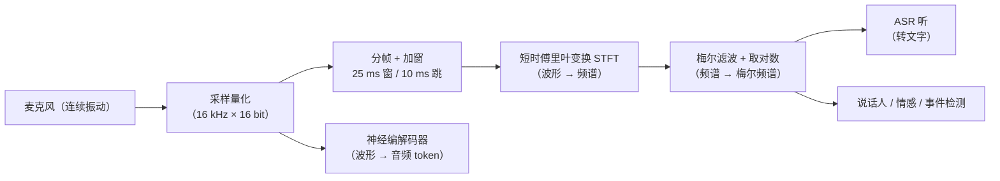
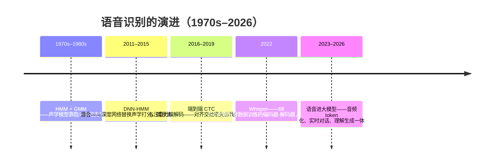
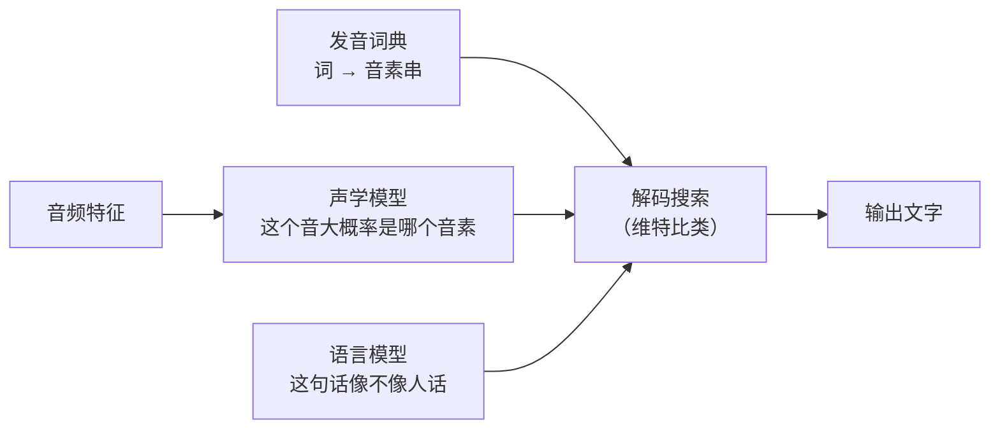
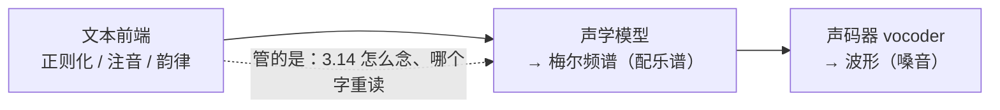
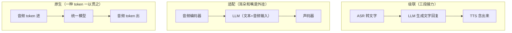

# 语音与音频

> **一句话理解**：声音是一维振动波，机器"听"之前要先把波形变成类似人耳的时频表示（梅尔频谱），"说"则要反过来把文字变回波形——本页讲清这两条管线，以及语音正在如何与 LLM 合流成"能听会说"的大模型。

[⬆️ 返回总目录](../../../README.md) · [⬆️ 返回本篇](../README.md) · [⬅️ 返回本章目录](./README.md)

| 属性 | 说明 |
|------|------|
| 难度 | ⭐⭐⭐（较难） |
| 所属分支 | 生成与多模态 |
| 前置知识 | [多模态模型](./04-多模态模型.md)（音频作为模态的定位）；[Transformer 与注意力机制](../../4-专业方向/07-自然语言处理与LLM/02-Transformer与注意力机制.md)（编码器-解码器结构） |

---

## 📌 这一节解决什么问题

全书走到这里，文字有第 7 章的 LLM，图像有第 5 章的 CNN/ViT 与本章的生成模型，唯独"耳朵"一直没开专页——但语音恰恰是人机交互门槛最低的通道：说话比打字快三倍量级，且开车、做饭时双手被占用，语音是唯一可行的接口。第 04 页把音频列为模态之一，却只讲了图文对齐；本页补上这块拼图。

语音处理之所以自成一派，是因为它同时踩中了三个"文本没有"的困难：

- **信号是连续波形且长度可变**：一句话可能 2 秒也可能 20 秒，没有"固定输入长度"这回事；
- **信息是帧级时序**：按语音标准配置，每秒要处理约 100 帧（frame，短时分析窗口），序列长度是同等内容文本的几十倍——"谁在什么时候说了什么音"是逐帧铺开的；
- **对齐边界天然模糊**：一段 3 秒的音频对应 8 个字，但**没有任何人知道第 37 帧对应哪个字**——发音器官是连续滑动的，音与音之间没有清晰的分界线。这个"输入输出长度不等、对齐未知"的问题贯穿了语音识别三十年。

本页的路线：先搞清"语音到底是什么"（波形 → 采样 → 频谱 → 梅尔频谱），再沿两条主线讲"听"（ASR，自动语音识别）与"说"（TTS，语音合成），最后看语音与 LLM 如何合流——音频被切成 token 之后，"下一 token 预测"这台发动机直接开进了语音世界。

## 🌱 通俗理解

四个比喻，对应本页四块内容：

- **波形 → 频谱 = 耳朵拆和弦**。钢琴按下 C 和弦，空气里传的是一维振动，但你的耳朵自动把它拆成 do、mi、sol 三个音——因为耳蜗就是一排不同位置敏感不同频率的"毛细胞"。让机器模仿耳朵，就是频谱分析：横轴时间、纵轴频率，颜色深浅表示能量。采样就是给声音"拍快照"：每秒拍 16000 张，快照密到一定程度，连续的波就能无损还原。
- **梅尔刻度 = 人耳的对数尺**。100 Hz 变到 200 Hz，你听着是"明显的音高跳跃"；1000 Hz 变到 1100 Hz，同样的 100 Hz，你几乎听不出差别——人耳这把尺子低频处刻度密、高频处刻度疏，且整体近似对数。梅尔（mel）刻度就是把"你感觉到的音高距离"标成均匀刻度的尺子。
- **ASR = 请了一位听写员**。经典做法像请了三位分工的听写员：一位只管"听音"（这个音大概是 /a/ 吧）、一位查词典（/a/ + /m/ + /a/……是"阿妈"？）、一位懂语法（上下文里该是"阿玛"）——三人接力，谁错一步后面全错。端到端做法是请一位全懂的同传：音频进、文字出，中间不接力。
- **TTS = 配音演员的两步走**。先在心里想好抑扬顿挫、哪里停顿、哪个字重读（声学特征，好比"配乐谱"），再用嗓子把谱子唱出来（声码器，vocoder，就是"嗓音合成器"）。

## 📋 举个例子

**一笔数字化账单**：60 秒、16 kHz 采样、16 bit 量化的单声道语音 =

| 表示 | 数据量（60 秒） | 相当于"每秒多少信息单元" |
|------|-----------------|--------------------------|
| 原始波形 | 16000 × 2 字节 × 60 ≈ **1.9 MB** | 16000 个采样点/秒 |
| 梅尔频谱（80 滤波器 × 98 帧/秒） | ≈ 1.9 MB（float32） | 80 × 98 ≈ 7840 个数/秒 |
| 对应文本（约 240 字） | ≈ 240 个汉字 ≈ 数百 token | **2~5 个 token/秒** |

看最后一列：从波形到文字，信息单元压缩了**约四个数量级**。这笔账解释了本页所有技术选择的动机——中间表示（梅尔频谱）不是为了省存储（没省多少），而是为了把"每秒 16000 个点"变成"每秒近百帧、每帧几十个数"的可学习结构；而端到端识别的本质，就是在做这场跨越四个数量级的**序列压缩翻译**。

**梅尔刻度的直观算例**：用标准换算式（下节给出）计算三个频率：

| 频率变化 | 赫兹差 | 梅尔差 | 听感 |
|----------|--------|--------|------|
| 100 → 200 Hz | +100 | **+133** | 明显升调 |
| 1000 → 1100 Hz | +100 | **+64** | 勉强听得出 |
| 4000 → 4100 Hz | +100 | **+24** | 基本无感 |

同样的 100 赫兹，在人耳这把尺上差出五倍多——这就是"感知线性"的反面教材：**赫兹不是为人耳设计的单位，梅尔才是**。

**帧怎么来的**：语音标配"25 毫秒窗、10 毫秒跳"——每帧覆盖 16000 × 0.025 = 400 个采样点，相邻帧起点差 160 个点，于是每秒约 (16000 − 400)/160 + 1 ≈ **98 帧**。为什么不逐点分析？因为发音器官（舌头、嘴唇）约 10~30 毫秒才挪一次位置，10 毫秒内信号近似不变（短时平稳假设）——比这更细的粒度全是噪声。

<details>
<summary>📊 展开：为什么偏偏是 25 ms / 10 ms？</summary>

窗长的两难：窗太长（如 200 ms），一帧里混进好几个音，频率分辨率高但时间分辨率糊成一片；窗太短（如 2 ms），时间看得清但每一帧内周期数不够、频率估不准——这是**时频不确定性原理**（窗越短，可分辨的频率越模糊）的直接后果。25 ms 是"音素持续 50~200 ms、基频 80~400 Hz 的人声"这两个约束下的甜点区，10 ms 跳距则保证快的音（爆破音 /t/ 只有 20~30 ms）至少被两三帧覆盖。改动它（如 40 ms 窗）不是不行，但梅尔滤波器组、模型帧率、与预训练模型对齐（Whisper 系列按 25 ms 窗提特征）都要跟着改——生产上"25/10"是生态默认值，改前先想想为什么要跟整个生态作对。

</details>

## 🧠 核心原理

### 整体流程



本页五节：第 1 节讲透上图中"采样到梅尔"这条公共地基（含数学深潜）；第 2、3 节分讲 ASR 与 TTS 两条主线的演进；第 4 节讲音频 token 化与 LLM 合流；第 5 节收拢失败模式。

### 1. 语音是什么：从波形到梅尔频谱

**采样：连续世界的离散化**。声波是连续的气压变化，录音设备每 $f_s$ 次每秒测一次幅度。奈奎斯特-香农采样定理说，想无损保留最高频率为 $f_{\max}$ 的声音，采样率必须满足：

$$
f_s \geq 2 f_{\max}
$$

> 👉 **人话**：想看清最快的手指晃动，快门至少要它晃动频率的两倍——否则高频会"伪装"成低频（混叠，aliasing），录进去就再也分不开了。所以电话音质用 8 kHz（保住 300~3400 Hz 的人声频段，牺牲音乐）、语音识别用 16 kHz（保住到 8 kHz，塞音与摩擦音更清楚）、CD 音质用 44.1 kHz（保住人耳 20 kHz 上限）。

**分帧加窗与 STFT**。对每一帧做离散傅里叶变换，得到这一帧的频谱：

$$
X(k) = \sum_{n=0}^{N-1} x(n)\, w(n)\, e^{-j 2\pi k n / N}
$$

> 👉 **人话**：拿一个窗函数 $w$（两端平滑归零的"窗框"）截出 25 毫秒，问"这一小段里都混了哪些频率、各有多响"——把时间轴上的一帧翻译成频率轴上的一列能量。逐帧做过去，就得到"时间 × 频率"的能量图，即语谱图。

**梅尔滤波**。把频率轴换算到梅尔刻度，再铺一组三角滤波器：

$$
m = 2595 \log_{10}\Big(1 + \frac{f}{700}\Big)
$$

> 👉 **人话**：这是 1937 年心理声学实验拟合出来的经验公式——把"物理频率"换算成"人耳感觉的音高"。在梅尔轴上等距铺 80 个三角滤波器，等效于在人耳最敏感的低频区铺得密、高频区铺得疏：**对耳朵重要的地方量得细，耳朵听不出的地方量得粗**。

**语音 vs 文本的处理差异**——这张表是本页的"世界观"，后面所有架构差异都源于它：

| 维度 | 文本（第 7 章） | 语音（本页） |
|------|----------------|--------------|
| 输入形态 | 离散 token，词表几万~十几万 | 连续波形 → 离散化为帧/滤波器组 |
| 序列长度 | 每秒 2~5 token | 每秒约 98 帧 × 80 维（≈文本的千倍） |
| 长度可变性 | 有，但幅度小（10~1000 token） | 极端（0.5 秒~1 小时） |
| 对齐 | token 与语义一一对应 | 帧与文字**多对一且边界未知** |
| 冗余 | 低（每个 token 都载信息） | 高（相邻帧高度相关；相位、精确波形对语义贡献小） |
| 噪声 | 错字、口语 | 加性噪声、混响、口音、多说话人、信道畸变 |

### 📐 数学深潜：为什么人耳尺度是梅尔——把"感知线性"写进公式

**严格陈述**。梅尔刻度（mel scale）由 Stevens、Volkmann 与 Newmann 在 1937 年通过心理声学实验测得：让听者调节一个参考音的频率，直到主观音高差等于标准间隔，把所有"等主观音高距"的频率点标出来，得到一条单调递增的凹曲线。其标准拟合式（HTK 工具包采用）即上节的 $m = 2595\log_{10}(1 + f/700)$。所谓"感知线性"指：**在梅尔轴上等距的两段，主观音高差相等**——低频区 100→200 Hz 与中频区 1000→1200 Hz 在梅尔轴上的距离被"矫正"为可比。

**完整推导：等距梅尔网格回换 Hz 后如何"低密高疏"**。把上式反解：

$$
f = 700\Big(10^{m/2595} - 1\Big)
$$

> 👉 **人话**：给你"感觉上的等距"，反算"物理上该在哪"——下面用 0~4000 Hz 铺 4 个滤波器走一遍全过程。

<details>
<summary>🧮 展开完整推导：五步铺一个梅尔滤波器组（数字全对得上）</summary>

**第 1 步：算两端点的梅尔值。** $m(80) = 2595\log_{10}(1 + 80/700) \approx 123$；$m(4000) = 2595\log_{10}(6.714) \approx 2146$。

**第 2 步：在梅尔轴上等距取 5 个点。** 区间 $[123, 2146]$ 四等分：$123,\ 629,\ 1135,\ 1640,\ 2146$。

**第 3 步：逐点换回 Hz。** 用反解式 $f = 700(10^{m/2595} - 1)$：

| 梅尔点 | 629 | 1135 | 1640 | 2146 |
|--------|-----|------|------|------|
| 对应 Hz | **522** | **1215** | **2300** | **4000** |

加上左端 80 Hz，五个边缘频率为 $80,\ 522,\ 1215,\ 2300,\ 4000$ Hz。

**第 4 步：相邻三点做一个三角滤波器。** 滤波器 $i$ 在中心 $c_i$ 处权重为 1，向两侧线性降到 0（在 $c_{i-1}$ 与 $c_{i+1}$ 处）。逐帧功率谱乘以权重、求和，得到该滤波器的能量。

**第 5 步：读结果。** 换回 Hz 后的间距为 $442,\ 693,\ 1085,\ 1700$——**等距的梅尔网格，翻译回物理频率后间距逐段扩大近四倍**。对照"错误做法"：直接在 Hz 轴等距四分（$80,\ 1060,\ 2040,\ 3020,\ 4000$），第一个滤波器一口吞掉 80~1060 Hz 的全部信息——而那正是基频与前两个共振峰（人声辨识度的主要载体）所在的区域。

**验证感知线性**：$m(1000) = 2595\log_{10}(2.429) \approx 1000$（1000 Hz ≈ 1000 mel，公式自洽）；而 $m(100) \approx 150$，$m(200) \approx 283$，差 133；$m(1000) \to m(1100)$ 只差 64——正文中那张"同样 +100 Hz、听感差五倍多"的表由此而来。

</details>

**几何解释**：梅尔变换是对频率轴的**非线性重参数化**——把一条"对数形"的弯曲坐标拉直。画在数轴上：

```text
Hz 轴：  80 --- 500 ------ 1200 --------- 2300 ------------- 4000
          ↑间距小                    ↑间距越来越大（物理等距时信息分布却前密后疏）
mel 轴： 123 ------ 629 ------ 1135 ------ 1640 ------ 2146
          ↑等距：主观音高被"均匀化"，基频与共振峰区获得与高频同等的刻度密度
```

生理根源：耳蜗基底膜是一排按位置调频的带通滤波器（临界频带，critical band），低频处带宽几十 Hz、高频处几百 Hz——梅尔滤波器组"低密高疏"的三角窗，正是这排生物滤波器的工程模仿。

**反例与边界**：

- **它是 1937 年小样本实验的拟合曲线，不是定理**：常数 700 与 2595 是拟合值，不同实现（HTK 式 vs Slaney 式）数值不同、结果有微差——工程上"两种 mel"并不互通，对齐预训练模型时必须用它的那套；
- **感知线性 ≠ 音乐线性**：音乐转调与和弦分析讲究"等比频率"（八度 = 频率翻倍），纯对数轴（如 CQT 常量 Q 变换）比 mel 更合适——音乐任务别无脑套 ASR 的梅尔谱；
- **梅尔刻度对齐的是"音高"，不是"可懂度"**：ASR 用梅尔谱更多是历史惯性与经验最优，没人证明过它对识别精度最优；
- **STFT + 梅尔丢掉了相位**：滤波器组只保留各频带能量，波形"何时振动到哪"的信息被扔掉。语音识别敢扔相位，因为人耳对相位也相对不敏感、语义主要载在频谱包络上；但**声源定位**（双耳时间差）等任务恰恰靠相位——对它们，梅尔谱不是好表示。

> 👉 **一句人话**：梅尔刻度 = 把物理频率换算成人耳"感觉的音高"，在感觉轴上铺均匀刻度——耳朵哪里细、我们就量哪里。

### 2. 语音识别 ASR：从三级流水线到端到端



**经典三级流水线**：



三个模块各自训练、各管一段：声学模型（Acoustic Model）打分"这帧像哪个音素"，发音词典（Lexicon）把词拆成音素串，语言模型（Language Model）打分"这个词序像不像人话"，解码器在三者乘积的空间里搜索最优路径。

> 👉 **人话**：像三位专家接力——听音的、查词典的、懂语法的。痛点也正在接力上：任何一级的假设错了（词典没收录新词、语言模型领域不匹配），错误沿流水线级联放大；且三个模块的目标各自为政，没有人为"最终转录正确率"整体负责。

**端到端第一次破局：CTC**。Connectionist Temporal Classification（连接主义时序分类，Graves 等人 2006）解决的正是本页开头那个"对齐未知"难题。它允许网络**每帧都输出**（音素或空白符 ϵ），再用折叠规则把帧级输出折叠成文字：先合并相邻重复、再去掉空白。训练时不再需要任何帧级标注，损失函数自己把"所有能折叠成正确答案的路径"概率加起来：

$$
\mathcal{L}_{\text{CTC}} = -\log \sum_{\pi \in \mathcal{B}^{-1}(y)} P(\pi \mid x)
$$

> 👉 **人话**：$x$ 是音频帧序列，$y$ 是目标文字，$\mathcal{B}$ 是折叠规则，$\mathcal{B}^{-1}(y)$ 是"所有折叠后恰好等于 $y$ 的帧级路径"。一句话：**不逼模型指出第几帧是哪个字，只要所有可能对齐方式的总概率高就行**——对齐的不确定性被吸收进损失函数内部。

<details>
<summary>🧮 展开算例：3 帧识别一个字——正常 / 极端 / 失败三种情况（数字可手算）</summary>

字母表只有 {猫, ϵ}，输入 3 帧、目标标签"猫"。全部 $2^3 = 8$ 条路径的折叠结果：

| 路径 | 折叠过程 | 结果 | 合法？ |
|------|----------|------|--------|
| 猫猫猫 | 去重复 → 猫 | 猫 | ✓ |
| 猫猫ϵ | 去重复 → 猫ϵ → 去空白 → 猫 | 猫 | ✓ |
| 猫ϵ猫 | 无相邻重复 → 去空白 → **猫猫** | 猫猫 | ✗ |
| 猫ϵϵ | → 猫 | 猫 | ✓ |
| ϵ猫猫 | → 猫 | 猫 | ✓ |
| ϵ猫ϵ | → 猫 | 猫 | ✓ |
| ϵϵ猫 | → 猫 | 猫 | ✓ |
| ϵϵϵ | → 空 | （无输出） | ✗ |

- **正常情况**：6/8 条路径合法——网络不必押注某一条对齐，多条路都通向"猫"，梯度温和；
- **极端情况**：目标改成"猫猫"（同字重复），合法路径只剩 **1/8**（只有"猫ϵ猫"能折叠出两个猫）——**空白符的存在意义在此显形：它是隔开重复字符的唯一手段**。重复内容越多，合法路径越稀少，CTC 学起来越吃力；
- **失败情况**：输入只有 2 帧、目标"猫猫"——最短合法路径"猫ϵ猫"需要 3 帧，2 帧时合法路径数为 **0**，$\mathcal{L} \to \infty$，训练直接崩溃。**CTC 的硬边界：输入帧数必须不少于（标签 token 数 + 必要的空白符数）**。实践中靠下采样过猛（编码器把 98 帧/秒压到 25 帧/秒）输出长标签（密集标点、逐字时间戳）时就会撞上这条边界，症状是特定长样本 loss 尖刺。

</details>

CTC 的条件独立假设（各帧输出互相不看对方）与"没有内在语言模型"是它的两个结构性短板——注意力编解码路线应运而生：LAS/Conformer 类模型把 ASR 变成"语音到文字的**序列到序列翻译**"（编码器压音频、解码器自回归吐字、注意力对齐），语言知识长进了解码器里，识别准确率随之上一个台阶；工程上常见 CTC 与注意力联合训练互相拴住（对齐快 + 语义强）。

**Whisper 路线：数据换鲁棒**。2022 年 OpenAI 的 Whisper 把思路从"改架构"转到"换数据"：从互联网抓取**68 万小时**带字幕的弱标注音频（标注带噪声：字幕错、时间不齐），用编码器-解码器 + 多任务训练（识别、语音翻译、时间戳、语言检测一锅炖）。关键洞察与 LLM 同源（[第 7 章 · LLM 全景](../../4-专业方向/07-自然语言处理与LLM/04-大语言模型LLM全景.md)的"吃下整个互联网"）：**当数据规模足够大，模型能"看穿"标注噪声，弱标注反而提供了人工精标永远到不了的覆盖面**——口音、噪声、专业领域的长尾在真实互联网字幕里全有。代价是推理偏慢（自回归解码逐 token 吐字），催生了此后各种蒸馏/加速版本。

| | 经典三级 | CTC | 注意力编解码 | Whisper 式海量弱监督 |
|---|---|---|---|---|
| 对齐处理 | 显式 HMM 状态 | 损失内折叠 | 注意力隐式学 | 注意力隐式学 |
| 语言知识 | 外挂语言模型 | 无（需外挂） | 内在解码器 | 内在 + 海量字幕语料 |
| 数据需求 | 各模块独立标 | 帧对齐免标（相对省） | 成对音频-文本 | **弱标注可无限扩** |
| 鲁棒性 | 差（模块级联） | 中 | 中 | **强（噪声口音见得多）** |
| 典型痛点 | 词典/级联误差 | 重复字符、条件独立 | 训练不稳、贪快易跳字 | 推理慢、幻觉复述 |

### 3. 语音合成 TTS：先想调子，再发声音

**两段式是骨架**：



- **文本前端**：把"3.14"、"2026年"、"。”、"卡壳的多音字"变成可念的音素与韵律标记——看似琐碎，中文场景尤其致命（"重庆重量"四个字两套读音）；
- **声学模型**：从音素序列预测梅尔频谱（自回归逐帧生成，Tacotron 2 类；或非自回归一次出全帧，FastSpeech 2 类，快且稳）；
- **声码器**：从梅尔谱还原波形。梅尔谱没有相位，声码器要"无中生有"地补出相位——从 Griffin-Lim 迭代逼近（机器味重），到 WaveNet 自回归逐采样点生成（以慢换真），再到 HiFi-GAN 类对抗生成（快且真，正是[第 02 页 GAN](./02-对抗生成网络GAN.md) 在波形上的应用）。

**端到端神经 TTS** 的演进一句话谱系：Tacotron 2 证明"注意力学梅尔谱 + 神经声码器"能到录音室质感 → FastSpeech 2 去自回归化解决"跳字漏读"与速度 → VITS 把[第 01 页](./01-生成模型全景.md)的 VAE 与流模型搬进来，文本直接到波形一步完成、训练推理一体。

**声音克隆（Voice Cloning）一句话**：用几秒到几十秒的参考音频提取"音色身份"（说话人嵌入，或直接在大规模多说话人数据上预训练后少样本微调，VALL·E 类工作把它做成"给大模型听 3 秒、它接着用这个声音念课文"——音频 token 化 + 下一 token 预测，第 4 节的主角提前出场）。它一面是配音/无障碍工具，一面是深度伪造诈骗的原料（第 02 页 Deepfake 风险的音频版），商用产品普遍叠加"仅本人授权可克隆"的声纹验证。

### 4. 语音与 LLM 的合流：当声音变成 token

**音频 token 化 = 把语音切块当 token**。神经编解码器（SoundStream、EnCodec 类）用残差向量量化（RVQ：多层码本叠加，第一层记粗轮廓、后面层层记残差）把每秒波形压成几十~上百个离散 token——语音从"每秒 16000 个采样点"变成"每秒几十个词"。这一步之后，LLM 的全部 machinery 原样可用：**语音成了"另一种外语"，下一 token 预测这台发动机直接开进来**。这与[第 04 页](./04-多模态模型.md)视觉 token 化的 VQ 路线、[第 06 页](./06-进阶专题-生成模型前沿.md)自回归 vs 扩散之争是同一个故事的语音版。

**语音对话系统的三种架构**：



级联可以每段独立优化、逐段排障，但三段延迟叠加，且**语气、笑叹、迟疑这些副语言信息在"转成文字"那一步就全丢了**——用户激动地说"没事"，文字只有两个字。原生路线把听说收进一个 token 空间，延迟与副语言两头都赢，代价是评估难（没有中间文字可查）、训练数据工程复杂。

**实时对话的延迟挑战**。人类对话的轮换间隔约 200~300 毫秒（心理语言学经典测量，经验参考）——超过一秒才接话，人就觉得"卡"。级联链路里 ASR 判定"说完了没"（VAD，Voice Activity Detection，语音活动检测，一句话：判断当前有没有人在说话、该不该开始接话）往往就要吃掉几百毫秒，再算上 LLM 首 token 与 TTS 首音频，很容易超标。原生模型的头两个工程红利正是：流式输入边听边算、首音频延迟进入数百毫秒量级。**全双工**（full-duplex，一句话：模型同时听与说、允许随时打断）是 2024 年以来实时语音产品的标配形态——它要求模型学会"对方停顿是在思考还是说完了"这种对话的微观节奏，而这恰恰是最难的（开放问题第 3 条）。

### 5. 失败模式速查（生产排查表）

| 症状 | 常见病因 | 诊断 | 补救 |
|------|----------|------|------|
| 特定口音/方言词错率暴涨 | 训练分布覆盖不足 | 按口音/地域分组统计词错率 | 针对性增补数据微调；语言/口音检测前端分流 |
| 嘈杂环境（商场、车载）雪崩 | 加性噪声压制语音频段 | 对比信噪比分层的测试集 | 训练加噪增广（SpecAugment 类频域遮挡）；前端降噪级联 |
| 远场（会议室）识别糊 | 混响 + 多说话人重叠 | 说话人分离（diarization）后再识别的中间结果抽查 | 阵列麦克风波束成形；先分离后识别 |
| 专有名词/新产品名总错 | 词表外长尾 | 看替换错误是否集中于实体名 | 热词偏置（解码时加权）；领域微调；后处理纠错 |
| 长录音越到后面越漂 | 流式模型上下文有限/时间戳漂移 | 分段边界对齐检查 | 分段 + 边界重叠；定期重置状态 |
| "识别更准了"但下游指标不动 | WER 与下游目标没对齐（见下） | 抽查替换错误的**位置**而非数量 | 按下游任务定制评估（实体级/意图级错误率） |

**词错率（WER）与下游任务的对齐问题**。WER 定义：

$$
\text{WER} = \frac{S + D + I}{N}
$$

> 👉 **人话**：替换（S）、删除（D）、多插入（I）的字数总和，除以参考文本总字数 N——识别圈的"标准分数线"。

但 WER 低不等于下游好用，两个典型错位：其一，**错误的位置比数量更重要**——把"三点开会"识别成"四点开会"（WER 12.5%）与把语气词"嗯"多识别一个（WER 同样 12.5%），对日历助理是天壤之别；其二，**格式与标点不在 WER 考核内**——数字（"3.14"vs"三点一四"）、大小写、标点错乱对下游信息抽取是硬伤，逐字 WER 却毫无感觉。生产选型时，先定下游指标（实体准确率、意图分类准确率），再拿 WER 当代理指标——顺序不能反。

## 💻 动手试试

纯 numpy：亲手把一段合成"人声"变成梅尔能量，验证深潜里那张滤波器表格。

```python
import numpy as np

# 合成信号：基频 220 Hz + 五个递减谐波，模拟声带振动的基本形态
fs = 16000                      # 采样率 16 kHz
t = np.arange(int(fs * 0.5)) / fs
f0 = 220.0
sig = sum((1.0 / k) * np.sin(2 * np.pi * f0 * k * t) for k in range(1, 6))

# 分帧：取第一帧（400 采样点 = 25 ms）加汉宁窗后做功率谱
frame = sig[:400] * np.hanning(400)
spec = np.abs(np.fft.rfft(frame)) ** 2        # 201 个频点的功率（0~8000 Hz）
freqs = np.fft.rfftfreq(400, 1 / fs)

# 梅尔换算（深潜里的 HTK 式公式）
hz_to_mel = lambda f: 2595 * np.log10(1 + f / 700)
mel_to_hz = lambda m: 700 * (10 ** (m / 2595) - 1)

# 在梅尔轴上等距取 5 点、换回 Hz 铺 3 个三角滤波器
edges = mel_to_hz(np.linspace(hz_to_mel(80), hz_to_mel(4000), 5))
print("滤波器边缘(Hz):", np.round(edges, 1))
# 预期：[ 80. 522. 1215. 2300. 4000.]——等距梅尔网格回换 Hz 后"低密高疏"

energy = []
for i in range(3):
    lo, cen, hi = edges[i], edges[i + 1], edges[i + 2]
    tri = np.maximum(0, np.minimum((freqs - lo) / (cen - lo),
                                   (hi - freqs) / (hi - cen)))
    energy.append((spec * tri).sum())          # 滤波器内功率求和

total = sum(energy)
print("三个滤波器能量占比:", [f"{e / total:.1%}" for e in energy])
# 预期：第一个（约 80~1215 Hz）占比最高——基频 220 及其低次谐波都在这
```

> 🧪 **改什么参数、看什么变化**：① 把 `f0` 从 220 改成 440——能量峰值从滤波器一迁往滤波器二，"高一个八度"在梅尔轴上只是挪一格；② 把 `edges` 改成 `np.linspace(80, 4000, 5)`（Hz 轴直接等距）——低频挤成一团，第一个滤波器独吞大部分能量，对比体会两种刻度的差别；③ 把 `fs` 改成 8000 重算——4000 Hz 以上没有频点了（奈奎斯特减半），若原信号含 5 kHz 分量会折回低频处冒出一个假峰（混叠）。

<details>
<summary>🧮 展开实验：用程序枚举 CTC 的合法路径（正文算例的机器版）</summary>

```python
from itertools import product

def collapse(path):                # CTC 折叠：先去相邻重复，再去空白
    out, prev = [], None
    for s in path:
        if s != prev and s != "ϵ":
            out.append(s)
        prev = s
    return "".join(out)

paths = ["".join(p) for p in product("猫ϵ", repeat=3)]      # 3 帧全部 8 条路径
for label in ["猫", "猫猫"]:
    n = sum(collapse(p) == label for p in paths)
    print(f"3 帧、目标 {label}：{n}/8 条合法路径")
# 预期：猫 → 6/8；猫猫 → 1/8（重复字必须用 ϵ 隔开，只剩"猫ϵ猫"一条活路）

paths2 = ["".join(p) for p in product("猫ϵ", repeat=2)]     # 只有 2 帧
print("2 帧、目标 猫猫：", sum(collapse(p) == "猫猫" for p in paths2), "/4")
# 预期：0/4——帧数不够标签长，合法路径不存在，CTC 损失发散（正文失败情况）
```

> 🧪 改 `repeat=4` 看目标"猫猫"的合法路径数回升到多少（枚举数一下：哪些路径折叠出两个猫）——体会"帧冗余越多、对齐自由度越大"。

</details>

## 🔥 炼丹小灶

> 🔥 **炼丹小灶**：语音任务工业起点配方——
> - 配方：ASR 微调首选开源预训练模型（Whisper 类）+ LoRA（rank 8~32、lr 1e-5~5e-5 量级）、训练数据加噪增广（SpecAugment 频率/时间遮挡）常开；TTS 别从零训，声码器直接用开源预训练件，只精调声学模型；
> - 玄学：口音场景 loss 正常降但词错率不动，先查数据里目标口音占比（常常是分布问题不是模型问题）；热词总错先试解码偏置再考虑微调；TTS"偶尔跳字漏读"是注意力对齐的老毛病，换非自回归结构常比调参管用；
> - ⚠️ 以上是经验参考值，不是圣旨；换数据分布请重新炼。

## 🖱️ 动手玩

> 🕹️ **延伸玩一玩**：[Hugging Face Spaces](https://huggingface.co/spaces) 搜索 "whisper" 或 "text to speech"——社区有大量在线 demo：对着 ASR demo 用方言、隔远一点、放点背景音乐各录一句，亲眼看词错率怎么退化（本页第 5 节的表就有了实物版）；再在 TTS demo 里输入同一句话配不同情感参数，听韵律怎么变。

## 🔗 在知识树中的位置

- **上游**：[多模态模型](./04-多模态模型.md)——音频作为模态的定位、对齐 vs 融合路线；[Transformer 与注意力机制](../../4-专业方向/07-自然语言处理与LLM/02-Transformer与注意力机制.md)——编码器-解码器与自回归生成；[对抗生成网络 GAN](./02-对抗生成网络GAN.md)——GAN 声码器与 Deepfake 音频；[RNN 与 LSTM](../../4-专业方向/06-时间序列/02-RNN与LSTM.md)——深度学习时代的第一个序列建模利器（时序章节与语音同源）；
- **下游**：[生产实战](./99-生产实战.md)——语音能力进入产品时的选型与成本账；[可信AI](./08-可信AI.md)——声音克隆滥用与语音诈骗的防御，正是下一页的题材；
- **横向对比**：音频 token 化 ↔ 视觉 token 化（[第 04 页](./04-多模态模型.md) VQ 路线）：都是"连续信号 → 离散词表 → 白嫖 LLM 接龙范式"，差别在音频多一层 RVQ 残差码本、序列短一个量级。

## 🎓 深度视角

**真实取舍一：级联与原生之间隔着的不只是延迟**。级联的每一层都可以单独换供应商、单独压测、单独回滚——出了问题看中间文字就能定位；原生的"端到端"把听说挤进一个黑盒，副语言信息保住了、延迟降下来了，但**中间表示消失了**：没有转写文本可审计，合规与排障都要重新发明工具（比如从对齐头里"抠"出伪转写）。2026 年的工程现状是两种架构并存——客服质检类场景（要文本留痕）级联仍是主流，消费级助手（要体验）原生占优——**"要不要中间表示"本质是"产品要可审计还是要低延迟"**，不是技术先进性问题。

**真实取舍二：采样率是一道"选择题"不是"越多越好"**。16 kHz 对 ASR 够用（8 kHz 以上主要承载摩擦音细节），却装不下音乐与情感声学的精细结构；提到 44.1 kHz，模型序列长度与算力跟着翻近三倍，识别精度却几乎不动。采样率的选型实质是**先想清楚要保留信号的哪部分语义**——这与"要不要保相位""要不要原始波形端到端"是同一道题的三种问法。

**高级深问**（点击展开）

<details>
<summary>问题 1：ASR 为什么敢扔掉相位？扔了相位的梅尔谱靠什么保住可懂度？</summary>

因为语音的语义信息高度集中在**频谱包络**（各频带能量的轮廓，由声道形状决定——你发 /a/ 和 /i/ 时舌位不同，共振峰位置不同）与**基频轨迹**（声带振动，决定音高语调）里，而相位主要影响波形的具体形状，对"听清是哪个字"贡献很小——心理声学的经典结论是听觉系统对相位的敏感度远低于对幅度谱的敏感度。这也是为什么语谱图（幅度谱）能被训练师用来教说话（可视化包络），而"只给相位、幅度抹平"的声音人耳几乎认不出内容。边界：这个"敢扔"是任务相关的——声源定位（双耳相位差/时间差）、音频修复（相位失真听感"发闷"）恰恰要相位，那些任务另起表示（复数谱、波形端到端）。

</details>

<details>
<summary>问题 2：语音大模型的"涌现"为什么比文本晚了好几年？</summary>

瓶颈不在架构而在数据。互联网把万亿 token 的文本白送给了 LLM，而"带转写标注的音频"天然稀缺——人工转写一小时音频要数小时工时，纯标注路线永远追不上文本的量级。破局正是 Whisper 式**弱监督**：互联网字幕是"免费的脏标注"，规模换质量，一举把训练数据抬到数十万小时量级；再往后音频 token 化让"无标注音频"本身（自监督预训练，wav2vec 2.0/HuBERT 类）也能当燃料。看懂这条"数据工程先于模型工程"的时间线，就能预判下一个模态（视频、机器人动作序列）的剧本：先找到那个模态的"互联网字幕"。

</details>

## 🔬 SOTA 演进（2023–2026）

- **开源 ASR 的多语言效果（一句话）**：Whisper 类开源模型用一个模型覆盖近百种语言（覆盖程度参差），在多数常用语言的公开测试集上接近或超过此前逐语言专门训练的系统，且对噪声与口音的鲁棒性明显更好——弱监督 + 规模的红利至今仍是开源生态的默认起点。
- **语音基础模型（一句话）**：从 wav2vec 2.0 / HuBERT 的自监督预训练（无标注音频当燃料），到把识别、翻译、合成塞进一个多任务模型的统一语音模型（USM、SeamlessM4T 类），语音在重演 NLP 的"预训练-适配"与"基础模型"剧本。
- **实时语音助手产品化（一句话）**：2024 年起 GPT-4o 类端到端语音对话把"听完再说"的级联延迟压到数百毫秒量级（经验参考），可打断、带语气的实时语音成为旗舰产品的标配能力，"对话节奏感"（轮换、迟疑、笑声）第一次成为模型要学的对象。

## ❓ 开放问题

1. **音频 token 的最优粒度是什么？** 码率（每秒 token 数）高则保真、低则省算力——但"多少码率开始丢语义"没有理论，只有逐任务的工程甜点；RVQ 层数、码本大小的搜索全靠消融。
2. **副语言理解怎么评测？** 语气、情绪、讽刺、"说没事但明显在生气"——没有像 WER 那样的公认尺子，人评贵且难重复，这个空白直接拖慢产品迭代。
3. **全双工的轮换机制该"学出来"还是"写出来"？** 把对话节奏交给模型从数据里学（灵活但不可控），还是用规则状态机管住（可控但僵硬）——当前产品两种做法混用，没有定论；更深的问法是：轮换本质上是"语义理解"还是"运动控制"。

## ⚠️ 常见误区

- **误区一**："采样率越高识别越好" → 语音可懂度集中在 8 kHz 以下，16 kHz 之后加采样率只加算力不加精度；先问任务需要保留哪个频段（正文取舍二）；
- **误区二**："梅尔频谱是客观的物理表示" → 它是 1937 年人耳心理声学实验的拟合，常数都是拟合值、实现有派系（深潜反例第一条）——它是"工程化的人耳"，不是"客观的信号"；
- **误区三**："CTC 就是端到端，从此没有对齐问题" → CTC 只是把对齐**藏进损失函数**（对全部合法路径求和），对齐不确定性还在，且带着硬边界（帧数 ≥ 标签长、重复字要空白隔开）；
- **误区四**："声音克隆需要录几个小时音" → 零样本克隆只要几秒参考音频；配套的风险认知（诈骗、冒充）与产品防御（声纹授权、水印）得跟上（下一页展开）；
- **误区五**："WER 降了下游一定受益" → 错误的位置与格式比数量更要命，先定下游指标再拿 WER 当代理（第 5 节）；
- **误区六**："实时语音助手就是 ASR+LLM+TTS 拼起来" → 级联拼装丢副语言、延迟叠加超标；"能打断、懂语气"的原生路线已经是不同的物种，选型前先看产品要可审计还是要低延迟。

## 📝 小结与自测

**要点回顾**

- 语音三困难：连续波形长度可变、每秒约百帧的帧级时序、帧与文字对齐未知——一切架构演进都在回应它们；
- 公共地基：采样定理（$f_s \geq 2f_{\max}$）→ 25 ms/10 ms 分帧加窗 → STFT → 梅尔滤波取对数；梅尔刻度把物理频率换算成感知音高（$m = 2595\log_{10}(1+f/700)$），等梅尔距 = 等主观音高距；
- ASR 演进：三级流水线（声学+词典+语言，级联误差）→ CTC（对全部合法折叠路径求和，对齐不确定性进损失；空白符隔重复字；帧数硬边界）→ 注意力编解码（ASR 变序列翻译，语言知识内化）→ Whisper（68 万小时弱监督，规模换鲁棒）；
- TTS 骨架：文本前端 → 声学模型出梅尔谱 → 声码器补相位出波形（Griffin-Lim → WaveNet → GAN 声码器）；声音克隆几秒起步；
- 合流：神经编解码器 + RVQ 把语音切成 token，LLM 的下一 token 预测直接可用；级联（可审计）vs 原生（低延迟、保副语言）；VAD 判断接话时机、全双工允许打断，轮换节奏是实时对话的隐形难点；
- 失败模式：口音/噪声/远场是分布覆盖问题；WER 与下游错位——错误位置与格式比数量更要命。

**自测一下**（点击展开答案）

<details>
<summary>问题 1：为什么语音识别普遍用 16 kHz 采样、25 ms 窗 10 ms 跳？两句话说明每个数字的来历。</summary>

16 kHz 源于采样定理：人声可懂度集中在 8 kHz 以下，$f_s \geq 2f_{\max}$ 给到 16 kHz 就够，再高只加算力；25/10 ms 源于短时平稳：发音器官 10~30 ms 才变一次姿态，25 ms 窗内信号近似平稳、帧间 10 ms 跳保证快的音至少被两三帧覆盖——更细的粒度是噪声，更粗的粒度会混音。

</details>

<details>
<summary>问题 2：3 帧输入、目标标签"猫猫"，CTC 有几条合法路径？这个数字暴露了 CTC 的哪两个特性？</summary>

只有 1 条（"猫ϵ猫"）。暴露两点：其一，空白符是隔开重复字符的唯一手段（没有它，"猫猫"折叠后只剩一个"猫"）；其二，合法路径数随重复内容骤减、随帧冗余增多而回升——当帧数少于"标签长 + 必要空白"时合法路径数为零、损失发散，这是 CTC 的硬边界（编码器过度下采样输出密集标签时就会撞上）。

</details>

<details>
<summary>问题 3：同样 +100 Hz，为什么 100→200 Hz 听得出、4000→4100 Hz 听不出？用梅尔公式算给同事看。</summary>

$m(100)\approx150$、$m(200)\approx283$，差 133 mel；而 $m(4000)\approx2146$、$m(4100)\approx2170$，差仅 24 mel——同样的物理频率差，感知差五倍多。梅尔刻度就是把这把"感觉的尺子"拉直：等梅尔距 = 等主观音高距，所以梅尔滤波器组把刻度密度花在耳朵最敏感的低频。

</details>

<details>
<summary>问题 4：级联与原生语音对话架构各自的护城河与死穴是什么？</summary>

级联护城河：每段可独立优化/压测/回滚，有中间文本可审计（合规、质检场景刚需）；死穴：三段延迟叠加易超人类 200~300 ms 的轮换预期，副语言（语气、笑叹）在转文字一步全丢。原生护城河：同一 token 空间端到端，延迟数百毫秒级、副语言保留；死穴：无中间表示可查，评估与排障工具要重新发明，训练数据工程复杂。选型本质是"要可审计还是要低延迟"。

</details>

<details>
<summary>问题 5：你的客服语音机器人换了新 ASR，WER 从 12% 降到 9%，但工单意图分类准确率没动。列出两个最可能的原因。</summary>

其一，WER 降在下游不敏感的地方（语气词、口头禅的删除/插入），而意图关键词（"退款""改地址"）的替换错误没降——按错误位置分层统计（实体级错误率）而不是总数；其二，格式/标点/数字规范化与 WER 无关却直接影响下游解析（"三.14"vs"3 点 14"），旧 ASR 的后处理规则换了模型后不再匹配。先对齐下游指标再谈选型。

</details>

## 📚 延伸阅读

- 论文：Stevens, Volkmann & Newmann, *A Scale for the Measurement of the Psychological Magnitude of Pitch*（1937，JASA——梅尔刻度的出处，心理声学原始文献）
- 论文：Graves et al., *Connectionist Temporal Classification: Labelling Unsegmented Sequence Data with Recurrent Neural Networks*（2006，ICML——CTC 的出处）
- 论文：Chan et al., *Listen, Attend and Spell*（2015，注意力编解码 ASR 的代表），[arXiv:1508.01211](https://arxiv.org/abs/1508.01211)
- 论文：Gulati et al., *Conformer: Convolution-augmented Transformer for Speech Recognition*（2020），[arXiv:2005.08100](https://arxiv.org/abs/2005.08100)
- 论文：Park et al., *SpecAugment*（2019，加噪增广的经典配方），[arXiv:1904.08779](https://arxiv.org/abs/1904.08779)
- 论文：Radford et al., *Robust Speech Recognition via Large-Scale Weak Supervision (Whisper)*（2022），[arXiv:2212.04356](https://arxiv.org/abs/2212.04356)
- 论文：Shen et al., *Natural TTS Synthesis by Conditioning WaveNet on Mel Spectrogram Predictions (Tacotron 2)*（2017），[arXiv:1712.05884](https://arxiv.org/abs/1712.05884)
- 论文：Kong et al., *HiFi-GAN*（2020，GAN 声码器代表），[arXiv:2006.04558](https://arxiv.org/abs/2006.04558)
- 论文：Kim et al., *Conditional Variational Autoencoder with Adversarial Learning for End-to-End Text-to-Speech (VITS)*（2021），[arXiv:2106.06103](https://arxiv.org/abs/2106.06103)
- 论文：Zeghidour et al., *SoundStream*（2021，神经音频编解码器），[arXiv:2107.03312](https://arxiv.org/abs/2107.03312)；Défossez et al., *High Fidelity Neural Audio Compression (EnCodec)*（2022），[arXiv:2210.13438](https://arxiv.org/abs/2210.13438)
- 论文：Wang et al., *Neural Codec Language Models are Zero-Shot Text to Speech Synthesizers (VALL·E)*（2023，音频 token + LLM 做零样本克隆），[arXiv:2301.02111](https://arxiv.org/abs/2301.02111)

---

[⬅️ 上一页：进阶专题：生成模型前沿](./06-进阶专题-生成模型前沿.md) · [返回本章目录](./README.md) · [下一页：可信AI ➡️](./08-可信AI.md)
