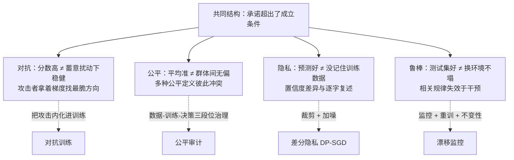
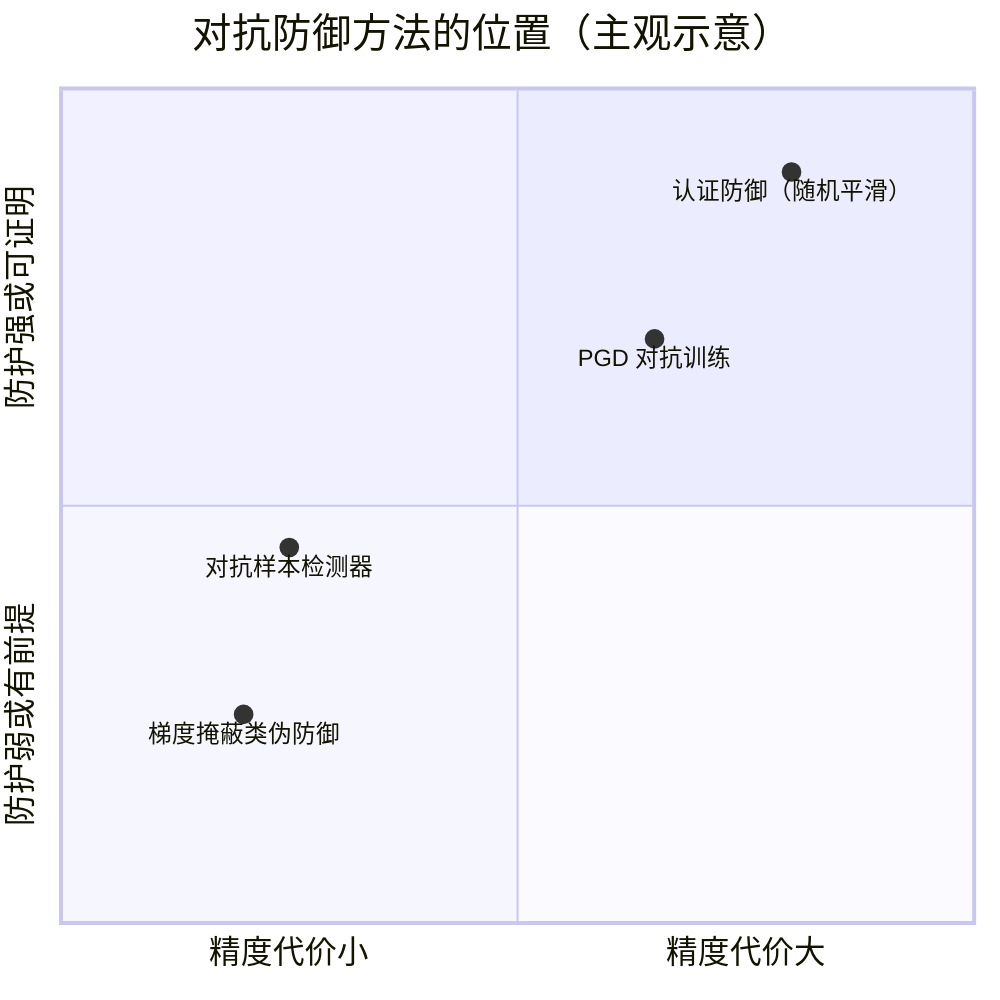

# 可信AI

> **一句话理解**：前面各章都在问"平均情况下模型有多准"，这一页问"最坏情况下模型会不会翻车"——对抗样本、公平性、隐私、分布偏移四类风险，是四种"考卷之外的考题"，本页把它们串成一条线：模型的承诺，永远超出它成立的前提。

[⬆️ 返回总目录](../../../README.md) · [⬆️ 返回本篇](../README.md) · [⬅️ 返回本章目录](./README.md)

| 属性 | 说明 |
|------|------|
| 难度 | ⭐⭐⭐⭐（高阶） |
| 所属分支 | 生成与多模态（跨章专题） |
| 前置知识 | [经典 ML 理论高地](../../2-经典机器学习/03-机器学习/08-进阶专题-经典ML理论高地.md)（分布偏移与"承诺何时作废"）；[微调与对齐](../../4-专业方向/07-自然语言处理与LLM/05-微调与对齐.md)（LLM 安全与对齐税）；[对抗生成网络GAN](./02-对抗生成网络GAN.md)（"对抗"一词的另一含义） |

---

## 📌 这一节解决什么问题

全书到本章为止，评价模型的主流方式是"在某个测试集上打分"：准确率、mAP、困惑度、FID。但 2016 年之后，四类"测试集分数解释不了"的事故反复上演：

- 研究者给熊猫照片加一层人眼完全看不见的噪声，分类器改口"长臂猿"（置信度 99%）——**对抗样本**：有人蓄意优化输入时，模型不堪一击；
- 招聘/信贷/量刑工具被发现对特定人群系统性更苛刻，且这种苛刻藏在"校准得很好"的分数里——**公平性**：平均指标掩盖了结构性的差别对待；
- 攻击者只需查询模型的输出概率，就能以高准确率判断"这条记录在不在训练集里"，大模型甚至能被诱导逐字复述训练语料——**隐私**：模型会"记住"并泄露它读过的数据；
- 训练时 95 分的风控模型上线三个月掉到 80 分，因为客群、渠道、经济环境都变了——**分布偏移**：测试集是昨天的世界，部署是明天的世界。

这四件事不属于任何单章——它们是全书各章模型的**公共底线**，所以放在全书最后一章做跨章收束。它们的共同结构一眼看穿：**每一条都对应一种"隐含承诺的破灭"**——分数高 ≠ 蓄意扰动下稳健、平均准 ≠ 群体间无偏、预测好 ≠ 没背下数据、测试集好 ≠ 换环境不塌。本页前四节分讲四类风险（各含机理与小算例），第五节给出统一视角与跨章地图。

## 🌱 通俗理解

四个生活类比，一个总纲：

- **对抗样本 = 专挑盲区打的陷阱题**。学生平均 90 分，不代表他考不倒——出一道针对他知识死角的题就能让他自信地答错。模型同理：贴一张打印小贴纸，摄像头把停车标志认成限速牌——不是"眼神差"，是有人**拿着梯度当放大镜**专找它最脆的方向下手。
- **公平性 = 平均分掩盖的结构性不及格**。全班平均 80 分很好看，但若男生组 95、女生组 65，"平均"就是一句废话。更糟的是尺子本身可能歪：同一把"风险分尺子"对不同人群的刻度含义不同（下文小例子演示）。
- **隐私 = 老师背下了你的答案**。阅卷无数的老师看到某道题的某种解法，能脱口而出"这是我班学生写的"——因为他**记住**了。模型也一样：训练时见过与没见过的样本，它给出的置信度有系统差异，攻击者拿这个差异就能反查"你是不是训练集里的人"。
- **分布偏移 = 城里学的车技上山路翻车**。不是技术不行，是**考卷换了**。第 3 章[理论高地](../../2-经典机器学习/03-机器学习/08-进阶专题-经典ML理论高地.md)已把这件事的数学拆过，本页从"可信"的角度再收一次。
- **总纲**：这四件事都是"保险柜说明书只承诺了平均情况"——卖保险柜的说"我们的柜子平均很难撬开"，这句话对蓄意攻击者、对特定型号的锁、对明天出现的新撬棍，全都不可信。

## 📋 举个例子

**算例一（对抗）：一步扰动手算翻转**。线性模型 $f(x) = w^\top x$，$w = (1.0,\ 0.5)$，输入 $x = (2.0,\ -1.0)$，打分 $= 1.5 > 0$ 判正类。攻击者每维只许动 $\varepsilon = 0.1$，怎么打最狠？沿权重符号方向：$\delta = \varepsilon \cdot \text{sign}(w) = (0.1,\ 0.1)$，新打分 $= 1.5 + 0.15 = 1.65$——被推离边界 **0.15 = $\varepsilon \|w\|_1$**。二维里这不算什么；但把维度加到 784（一张 28×28 的灰度图），每维权重平均绝对值只有 0.05（训练过的网络第一层的常见量级，示意），则 $\|w\|_1 \approx 39$，同样 $\varepsilon = 0.1$ 的打分变化 $\approx 3.9$——足以把任何"置信但不夸张"的判断推过界（sigmoid 从 0.82 抬到 0.995）。**每维只动了 10%，合起来翻盘**：这就是"高维小扰动累积"的全部含义。

**算例二（公平）：完美校准的模型如何系统性亏待一个群体**。信贷场景，模型输出"违约概率"分，阈值 0.5 拒贷。两组各 900 人，组内违约率不同（A 组 1/3，B 组 1/2——现实中常来自历史结构性差异）；分数只有两档（0.6 高风险 / 0.2 低风险），且**在两组内都完美校准**（0.6 分的人确实 60% 违约，两组皆然——模型没有偷偷加歧视项）：

| | 高风险（0.6） | 低风险（0.2） | 校准检查 | 拒贷率 | 真阳性率 TPR | 假阳性率 FPR |
|---|---|---|---|---|---|---|
| A 组（违约率 1/3） | 300 人（违约 180） | 600 人（违约 120） | 180/300=0.6 ✓ 120/600=0.2 ✓ | 33% | 180/300 = **0.60** | 120/600 = **0.20** |
| B 组（违约率 1/2） | 675 人（违约 405） | 225 人（违约 45） | 405/675=0.6 ✓ 45/225=0.2 ✓ | **75%** | 405/450 = **0.90** | 270/450 = **0.60** |

同一把校准尺子、同一个阈值：B 组被拒率 75% 对 A 组 33%，B 组的"冤枉率"（FPR）是 A 组三倍。想让两组 FPR 相等？只能给 B 组单独调阈值——于是 B 组的 0.6 分不再对应 60% 违约率，**校准被破坏**。校准与错误率均等**不可能同时成立**（机理与证明见第 2 节），这不是工程没做好，是数学上的死结。

**算例三（隐私）：加噪买"上限保险单"**。数据集里有 100 人患某病，直接发布"计数 = 100"等于把每个人的信息交出去一点。差分隐私的做法：发布"计数 + 拉普拉斯噪声（尺度 1）"。有/无任何一个特定的人，真值只差 1（100 vs 101），而任何答案的概率比被压在 $e^1 \approx 2.72$ 倍以内——比如答案恰好是 100.0：数据集真值 100 时密度 0.5、真值 101 时 0.18，比值恰为 $e$。噪声尺度 1 对"百人级"统计九牛一毛（典型误差 ≈1.4 人），对"5 人小群体"却要命（误差占 28%）——**保护与精度的账，逐群体不一样**。

## 🧠 核心原理

### 整体流程



### 1. 对抗样本：高维空间的小扰动累积

**定义**。给定模型 $f$ 与扰动预算 $\varepsilon$，对抗样本是满足 $\|\delta\|_\infty \leq \varepsilon$（每维改动不超过 $\varepsilon$）且 $f(x) \neq f(x+\delta)$ 的输入——人眼分不出 $x$ 与 $x+\delta$，模型却换了答案。

### 📐 数学深潜（一）：线性解释与 FGSM——为什么"看不见的扰动"能翻盘

**严格陈述**。Goodfellow 等人 2014 年的线性假说（Linear Explanation of Adversarial Examples）：**对抗脆弱性主要不是深度非线性的怪异产物，而是高维线性的必然结果**——在线性模型上，$\ell_\infty$ 约束内的最优扰动方向就是 $\varepsilon\,\text{sign}(w)$，产生的打分变化为 $\varepsilon \|w\|_1$；维度越高，$\|w\|_1$ 越大，"每维微扰"累积成的"整体漂移"越可观。快速梯度符号法（FGSM，Fast Gradient Sign Method）把这一洞察推广到一般网络：沿损失对输入的梯度**符号**走一步。

$$
x_{\text{adv}} = x + \varepsilon \cdot \text{sign}\big(\nabla_x \mathcal{L}(x, y)\big)
$$

> 👉 **人话**：问损失函数"往哪个方向挪输入能让模型最难受"，只取方向不取步长、每维固定走 $\varepsilon$——一步到位的偷袭。

<details>
<summary>🧮 展开完整推导：从约束优化到一行公式（含高维数值账）</summary>

**第 1 步：线性模型的最优扰动。** 打分变化 $\Delta = w^\top \delta$，约束 $|\delta_i| \leq \varepsilon$。优化可逐维分解：$w_i \delta_i$ 在 $\delta_i = \varepsilon\,\text{sign}(w_i)$ 时取最大，于是

$$
\max_{\|\delta\|_\infty \leq \varepsilon} w^\top \delta = \varepsilon \sum_i |w_i| = \varepsilon \|w\|_1
$$

> 👉 **人话**：每一维都顺着权重的符号方向推——所有小推力同向叠加，总效果是"权重绝对值总和 × 扰动幅度"。正文的二维手算（0.15 = 0.1 × 1.5）就是这条式子。

**第 2 步：推广到非线性网络。** 损失一阶泰勒展开 $\mathcal{L}(x+\delta) \approx \mathcal{L}(x) + \nabla_x \mathcal{L}^\top \delta$——把第 1 步的 $w$ 换成 $\nabla_x \mathcal{L}$，同样的优化给出 FGSM。一步近似当然不精确，于是有迭代版 PGD（投影梯度下降，Madry 等人 2017）：

$$
x^{(t+1)} = \Pi_{\|\delta\|_\infty \leq \varepsilon}\Big(x^{(t)} + \alpha\, \text{sign}\big(\nabla_x \mathcal{L}(x^{(t)}, y)\big)\Big)
$$

> 👉 **人话**：小步多走、每步拉回 $\varepsilon$ 盒内（$\Pi$ 是投影）——"反复试探找最疼的地方"，是评估鲁棒性的标准强攻击。

**第 3 步：高维数值账。** 设 $d = 784$（28×28 灰度图），每维权重 $|w_i|$ 平均 0.05：$\|w\|_1 \approx 784 \times 0.05 = 39.2$。$\varepsilon = 0.1$（图像取值 0~1 时典型的"肉眼无感"幅度）给出打分漂移 $\approx 3.9$。对照：两类打分差原本 1.5，sigmoid 置信度 0.82；被推到 5.4 后 0.995——**从"比较确定"到"斩钉截铁地错"**。而扰动的欧氏范数只有 $\varepsilon\sqrt{d} \approx 2.8$，且每一维都没超过 10%——"小扰动"与"大翻转"在高维不矛盾，因为**效果按 $\|w\|_1$（随维度线性）累积，感知按逐维幅度（不随维度）衡量**，两把尺子在高维彻底分道扬镳。

</details>

**几何解释**：决策边界是 $d-1$ 维超平面，$\varepsilon$ 盒是 $d$ 维立方体——盒内的点到边界的最短路几乎总在"贴着 sign(w) 的角"方向上：

```text
二维（容易被直觉骗）：
        决策边界
           ‖        ● x（离边界远，安全）
           ‖   ↗ ε 盒内最远可达点（角上）——二维里多数点离边界不算近
    ―――――――+―――――――

高维（真实世界）：
  每一维都有"贴边"的自由度 → 盒的 2^d 个角里总有一批穿过边界
  → 输入几乎总在某个方向上"一步之遥"——维数越高，逃不掉
```

**反例与边界**：

- **线性解释是假说不是定理**：它解释了"为什么容易攻击"，但后来研究发现非线性行为也重要——FGSM 一步对深层网络只是粗瞄，C&W 类优化攻击（最小化满足翻转的扰动）能找到更小的扰动；
- **特征视角的反驳**（Ilyas 等人 2019）：对抗样本可能不是 bug——高维数据中存在"非鲁棒特征"（与标签真实相关、预测力货真价实、但对扰动敏感的模式），模型用它们没错，只是这些特征在分布外不堪一击——脆弱性与泛化能力部分同源，这动摇了"修复脆弱性总无代价"的直觉（下文权衡的理论根基）；
- **"不可察觉"依赖人为度量**：$\ell_\infty$ 距离小 ≠ 感知距离小（旋转 1° 感知无害但像素距离巨大；反之某些 $\ell_\infty$ 小的扰动在高对比纹理上其实可察）——"什么算同一个输入"至今没有公认答案，攻击预算 $\varepsilon$ 的选择本质上是这个哲学问题的工程化；
- **评估陷阱**：用弱攻击（如一步 FGSM）测试防御会得出"防住了"的假象；2018 年 Athalye 等人证明当时多数"防御"实为**梯度掩蔽**（把梯度藏起来让攻击者找不到方向，攻击者换黑盒/迁移攻击照样破）——评估鲁棒性必须用自适应强攻击。

> 👉 **一句人话**：高维空间里，"每处只改一点"与"整体改很多"不矛盾——小扰动按维度数累积成大杠杆，FGSM 就是拿着这根杠杆的符号方向一步撬翻模型。

**与 GAN 的"对抗"辨析**——同一个词，两件事：

| | GAN 的对抗（[第 02 页](./02-对抗生成网络GAN.md)） | 对抗样本的对抗（本页） |
|---|---|---|
| 博弈双方 | 生成器 vs 判别器（两个网络） | 攻击者 vs 模型（人对网络） |
| 优化变量 | 双方**参数**（$\theta_G, \theta_D$ 交替更新） | **输入** $x$（模型参数冻结） |
| 发生阶段 | 训练时 | 推理时攻击；对抗训练把攻击搬进训练 |
| 目的 | 越博弈越强（提升生成质量） | 暴露/修补脆弱性 |
| 一句话 | 练内功 | 挨打，以及学着挨打 |

**防御困境：对抗训练与鲁棒-精度权衡**。目前唯一经受住强攻击检验的经验防御是对抗训练——把攻击内化进训练目标：

$$
\min_\theta\ \mathbb{E}_{(x,y)}\Big[\max_{\|\delta\|_\infty \leq \varepsilon} \mathcal{L}\big(f_\theta(x+\delta),\, y\big)\Big]
$$

> 👉 **人话**：内层让攻击者用 PGD 把每个训练样本推到最惨，外层让模型在这些"最惨样本"上仍答对——先挨最狠的打，再学会不倒。这与 RLHF 里"红队找出坏案例 → 回流训练"（[第 7 章 · 微调与对齐](../../4-专业方向/07-自然语言处理与LLM/05-微调与对齐.md)）是同一套 min-max 骨架。

代价写在纸上：**鲁棒过拟合风险与鲁棒-精度权衡**。干净精度可依赖"脆弱特征"（微妙纹理等真实相关），鲁棒模型必须放弃它们、只依赖对扰动不变的"稳健特征"——Tsipras 等人 2018 年证明这两个目标**可以数学上冲突**（存在天然数据分布，最优干净分类器与最优鲁棒分类器不同）。经验量级（参考）：大规模视觉模型对抗训练后干净精度常见掉 5~10 个百分点。另一条路是**认证防御**（随机平滑类：对输入加随机化、取多数票，能给出"半径 r 内保证不变"的数学证明）——用覆盖率换证明，可保证的半径常小于实际攻击半径。防御方法的整体格局：



**LLM 时代：同一结构换了战场**。越狱（jailbreak）与提示注入（prompt injection）本质上就是"对输入 token 的对抗优化"——攻击者不再改像素，改的是提示词前缀、伪指令、藏在网页/文档里的注入文本；而防御的演化也复刻视觉时代剧本：攻击→回流训练→新攻击（详见[第 7 章](../../4-专业方向/07-自然语言处理与LLM/05-微调与对齐.md)对齐一节与本章[生产实战](./99-生产实战.md)的内容安全漏斗）。

### 2. 公平性：当"公平"的定义彼此打架

**公平不是一个定义，是一族互相冲突的定义**：

| 定义 | 一句话陈述 | 适用直觉 |
|------|-----------|----------|
| 群体均等（Demographic Parity） | 各群体的正预测率相同 | "录用比例应接近人口比例" |
| 机会均等（Equalized Odds） | 各群体 TPR 与 FPR 都相同 | "冤枉好人的概率、放过坏人的概率，群体间一致" |
| 校准（Calibration） | 分数 = 概率，群体内也成立 | "打 70 分的人确实 70% 会违约，对谁都一样" |
| 反事实公平（Counterfactual Fairness） | 只改敏感属性、其他不变，结论不应变 | "如果她是男性，同一份申请会被拒吗" |

**核心冲突：校准与机会均等不可能同时成立**（当各组基率不同时）。开头的算例二已经用具体数字演示：两组内完美校准 + 同一阈值 ⇒ B 组 FPR 是 A 组三倍。这不是数据不干净，是**定理级的不可能**（Chouldechova 2017；Kleinberg 等人 2016）。

<details>
<summary>🧮 展开证明：为什么必然冲突（四行代数，接着算例二的记号）</summary>

设组 $g$ 的违约基率 $b_g$，模型分数两档 $\{0.6, 0.2\}$ 且组内校准；记 $m_g$ 为组 $g$ 中被打 0.6 分的比例。贝叶斯一翻（校准给出 $P(Y{=}1 \mid s{=}0.6, g) = 0.6$）：

$$
\text{TPR}_g = P(s{=}0.6 \mid Y{=}1, g) = \frac{0.6\, m_g}{b_g},
\qquad
\text{FPR}_g = P(s{=}0.6 \mid Y{=}0, g) = \frac{0.4\, m_g}{1 - b_g}
$$

> 👉 **人话**：给定基率 $b_g$ 与校准分数，两个错误率都被 $m_g$ 唯一钉死——没有自由度可言。代入算例二：A 组 $m{=}1/3, b{=}1/3$ 得 TPR 0.6、FPR 0.2；B 组 $m{=}0.75, b{=}0.5$ 得 0.9、0.6，与表中逐数吻合。

机会均等要求两组 TPR、FPR 都相等：

$$
\frac{m_A}{b_A} = \frac{m_B}{b_B}
\quad\text{且}\quad
\frac{m_A}{1-b_A} = \frac{m_B}{1-b_B}
\;\Longrightarrow\;
\frac{b_A}{1-b_A} = \frac{b_B}{1-b_B}
\;\Longrightarrow\;
b_A = b_B
$$

基率不同的两组（$b_A \neq b_B$）无解——校准与机会均等必弃其一。$\blacksquare$

> 👉 **人话**：两条"等式要求"联立后只剩下"两组基率必须相等"这一个出口——而现实里基率就是不等，所以数学把门焊死了：你只能选一头，没有两全。

**工程含义**：选择"弃哪个"不是数学问题，是社会与法律选择（信贷场景监管常要求"分数可解释且校准"，司法场景舆论常要求"错误率群体一致"）——数学的作用是把选择题摆上桌面，而不是替你选。

</details>

**偏见从哪来：一条会自我加强的链条**。


三个典型入口：**采样偏差**（训练数据是"有信用记录的人"，而某个群体历史上被排斥在金融体系外）；**代理变量**（删掉"性别"字段没用——邮编、消费品类通过相关性把性别"猜"回来，这恰是[第 11 章](../../4-专业方向/11-因果推断/01-相关不等于因果.md)"相关不等于因果"的伦理版）；**标签选择**（用"被逮捕"当"犯罪"的代理，而执法本身有偏向）。

**缓解的三段位**（各一句话）：训练前（重加权/重采样——治数据分布）、训练中（公平正则、对抗式去除敏感信息——给损失加约束）、训练后（分组阈值/分组校准——只动决策规则）。各自的坑：分组阈值 = 对不同群体用不同标准，在多数法域是显性差别对待，合规风险反过来；正则化伤精度；治本永远在数据与标签定义那一端。监管侧也在把这件事写成义务（欧盟 AI Act 类高风险系统条款、国内算法备案与生成式服务管理办法均有相应要求），公平审计正在从"学术美德"变成"上线材料"。

### 3. 隐私：模型记住了什么

**成员推断（Membership Inference，一句话）**：攻击者拿模型的输出（置信度、损失分布）训练一个小分类器，就能高准确率判断"这条数据在不在训练集里"——因为模型**记住了训练数据**：过拟合让成员样本的置信度系统性更高、损失更低，这个温差就是指纹（Shokri 等人 2017）。对 LLM 更进一步的是**提取攻击**：模型能被诱导逐字复述训练语料中的罕见片段（隐私保护研究里经典的"金丝雀实验"：往训练语料插一句哨兵文本，训后测试模型能否吐出它）——Carlini 等人由此证明神经网络存在**非预期记忆**，且记忆量随模型规模与重复次数增长。

### 📐 数学深潜（二）：差分隐私——用噪声买一份"上限保险单"

**严格陈述**。随机化机制 $M$ 满足 $(\varepsilon, \delta)$-差分隐私（Differential Privacy, DP），若对任意**相邻数据集** $D \sim D'$（恰好相差一条记录）与任意输出集合 $S$：

$$
P\big[M(D) \in S\big] \leq e^{\varepsilon} \, P\big[M(D') \in S\big] + \delta
$$

> 👉 **人话**：无论攻击者看到什么输出，"某个人在不在库里"这件事对答案的影响被压在 $e^\varepsilon$ 倍以内——保险公司式的承诺：不保证你绝对安全，但**白纸黑字写出最坏情况的赔偿上限**。

<details>
<summary>🧮 展开完整推导：拉普拉斯机制的证明 + 数值验证 + 组合性质</summary>

**第 1 步：机制设计。** 计数查询 $f(D)=$"患病人数"的敏感度 $\Delta f = 1$（加减一人，答案最多变 1）。拉普拉斯机制：

$$
M(D) = f(D) + \text{Lap}\Big(\frac{\Delta f}{\varepsilon}\Big),
\qquad
\text{Lap}(b)\text{ 的密度 } p(z) = \frac{1}{2b} e^{-|z|/b}
$$

> 👉 **人话**：往答案里掺一把对称的尖峰噪声，噪声尺度 = 敏感度 ÷ 隐私预算——$\varepsilon$ 越小（越隐私），掺得越多。

**第 2 步：证明满足 $\varepsilon$-DP。** 对任意输出 $z$，两数据集上的密度比（注意 $|f(D) - f(D')| \leq \Delta f = 1$）：

$$
\frac{p_D(z)}{p_{D'}(z)}
= \exp\Big(\frac{|z - f(D')| - |z - f(D)|}{b}\Big)
\leq \exp\Big(\frac{|f(D) - f(D')|}{b}\Big)
\leq e^{\Delta f / b} = e^{\varepsilon}
$$

> 👉 **人话**：三角不等式保证密度比永远压在 $e^\varepsilon$ 之下——定义里的 $S$ 无论多刁钻（攻击者可以选最有利的那条证据），比值上限不变。这就是"可证明"三个字的分量。

**第 3 步：数值验证（接着例子节的数）**。$\varepsilon = 1$、$b = 1$，真值 100 vs 101（差一个人）。看答案 $z = 100$：$p_D = 0.5$、$p_{D'} = e^{-1}/2 \approx 0.184$，比值恰为 $e \approx 2.718$——上限被顶满；看 $z = 100.5$：两侧密度相等，比值 1。**有的答案更指向"有这个人"，有的完全中立，但没有一个答案能超过 $e$ 倍底气**。

**第 4 步：组合性质——预算是会花完的。** 同一数据集上做 $k$ 次各自 $\varepsilon$-DP 的查询，串行组合定理给出总体 $\varepsilon_{\text{总}} \leq k\varepsilon$：信息一点点漏，预算一点点烧。这是 DP 框架最实用的性质——**隐私成为可记账的资源**（现代实现用 RDP（Rényi 差分隐私）记账器把组合损失算得更省）。反过来它也是最大的痛点：一次训练数十万步梯度更新，没有 DP-SGD 的精细分析，预算早就爆表。

**第 5 步：DP-SGD 一句话**。把"加噪查询"搬到训练上：每条样本的梯度先裁剪到范数 $C$（把单条记录的敏感度钉死），再对批内求和加高斯噪声——训出的模型整体满足 $(\varepsilon, \delta)$-DP（Abadi 等人 2016）。

</details>

**概率解释**：$e^\varepsilon$ 是**似然比上限**——观测到任何输出后，你对"某人在不在训练集"这两个假设的后验赔率，最多被改变 $e^\varepsilon$ 倍。$\varepsilon = 1$：赔率最多翻不到三倍（泄露一点）；$\varepsilon = 0.01$：几乎不变（几乎没泄露）；$\varepsilon = 10$：$e^{10} \approx 22027$ 倍——"数学上 DP、实际上近乎裸奔"。

**反例与边界**：

- **$\varepsilon$ 没有公认"安全线"**：不同大型机构公开使用的 $\varepsilon$ 差出几个数量级，纯数学只保证"越小越好"的单调性，"多少算安全"是政策问题；
- **$\delta \neq 0$ 是个诚实的漏洞声明**：它承认机制以 $\delta$ 的概率完全不受约束（密码学意义上的小概率灾难），实践中 $\delta$ 取远小于数据集大小倒数的量级；
- **DP 保护成员身份，不保护自愿公开的内容**：你发布过的推文、填过的问卷，DP 管不了；它也不抹去群体层面的统计规律——"该群体平均违约率更高"这类结论仍然可以推出；
- **精度代价分布不均**：同一把噪声，大群体的统计被噪声淹没得少、小群体被淹得多（算例三：误差 1.4 对 100 是 1.4%，对 5 是 28%）——**差分隐私与公平性会相互作用**，小群体往往两头受伤（深度视角展开）。

> 👉 **一句人话**：差分隐私 = 明码标价地卖信息——每份统计答案都掺一点噪声，换来"任何一个人被重新识别的风险，永远压在 $e^\varepsilon$ 这个上限内"的可证明承诺。

**联邦学习：数据不动，模型动**。端侧设备只用本地数据算梯度、上传梯度由服务器聚合平均（FedAvg，McMahan 等人 2017），原始数据不出设备——这是**合规动机**（数据出域限制）驱动的设计。但它**不自动等于隐私**：**梯度本身会泄密**——深度泄露（Deep Leakage from Gradients，Zhu 等人 2019）证明可以优化一个"虚拟样本"使其梯度与真实上传梯度一致，从而反推出训练样本内容；规模化攻击还能从梯度中批量提取训练文本（对 LLM 微调场景尤其致命）。工程上的完整拼图是三件套：联邦（数据不出域）+ DP-SGD（梯度加噪，防反推）+ 安全聚合（服务器只见噪声化总和，不见单端梯度）；另附两笔常被低估的账——通信轮次多（移动网络下缓慢）、设备异构与掉队者拖慢同步。

### 4. 分布偏移与鲁棒性：考卷变了

第 3 章[理论高地](../../2-经典机器学习/03-机器学习/08-进阶专题-经典ML理论高地.md)专题五已把分布偏移的工具箱（监控、重要性加权、DRO、不变学习）系统拆过——本节只做两件事：给它接上"可信"的视角，再立两块跨章路标。

**三种偏移一句话级**：协变量偏移（$P(X)$ 变了：客群年轻化）、标签偏移（$P(Y)$ 变了：疫情期患病率）、概念偏移（$P(Y|X)$ 变了：同一个"频繁转账"特征，在新的诈骗模式下含义反转）。共同症状：模型在**新世界里自信地错**（校准系统性失真），而离线分数毫无预警。

**OOD 泛化的因果视角（跨章路标一）**。为什么"换个环境就塌"？因为纯相关模型学到的是**特定环境里**的关联，而偏移的本质常常是**环境被干预**（政策变了、渠道换了——正是[第 11 章 · 相关不等于因果](../../4-专业方向/11-因果推断/01-相关不等于因果.md)的第一课）。要扛住偏移，得依赖"干预下仍稳定"的**不变机制**：视觉里的经典例子是"雪地里的哈士奇"——分类器学的其实是背景雪（捷径特征，spurious shortcut），雪一化就现原形；因果表征学习的目标是让模型只用"狗的形态特征"这类稳定特征（详见[第 11 章 · 因果 ML](../../4-专业方向/11-因果推断/03-进阶专题-因果ML.md)，包括不变学习 IRM 路线的承诺与落差）。一句话：**分布偏移问"为什么塌"，因果回答"学什么才不塌"**。

**LLM 时代的新形态（跨章路标二）**。训练-评测数据污染（基准题泄进训练语料，分数虚高——评估侧的"偏移"）、知识截止（部署在时间维度上的分布偏移）、以及生成模型自己污染下一代训练数据（合成内容回流）。这与[第 7 章](../../4-专业方向/07-自然语言处理与LLM/04-大语言模型LLM全景.md)的幻觉问题、[第 04 页](./04-多模态模型.md)的多模态幻觉共享同一个深层结构：**模型对"训练分布之外"的行为没有承诺，但产品经常默认它有**。

**统一视角表**——四类风险，一种读法：

| | 谁在"攻击" | 承诺破在哪 | 审计方法 | 经典缓解（及代价） |
|---|---|---|---|---|
| 对抗 | 蓄意优化输入的攻击者 | "分数高"被 ℓ∞ 扰动击穿 | 强攻击评估（PGD/自适应红队） | 对抗训练（干净精度降）；认证防御（可证半径小） |
| 公平 | 结构性偏差（无主动攻击者） | "平均准"掩盖群体差异 | 分组指标 + 不可能性认知 | 三段位缓解（各伤一头：合规/精度/数据工程） |
| 隐私 | 好奇的查询者/提取攻击 | "预测好"不等于"没记忆" | 成员推断自测、提取测试 | DP-SGD（精度降且小群体更伤）；联邦+安全聚合（防梯度反推） |
| 偏移 | 环境本身（无人为恶意） | "测试集好"过时 | 漂移监控（PSI/KS）+ 新世界标签抽样 | 重训（贵）；不变学习（理论美、工业渗透有限） |

## 💻 动手试试

**实验一：亲手攻翻自己训的模型**（纯 numpy，二十步看懂 FGSM 与 PGD）：

```python
import numpy as np

rng = np.random.default_rng(0)
# 线性可分的二维数据（与边界留出边际，干净精度可达 100%）
X = rng.normal(0, 1, (200, 2))
y = (X @ np.array([2.0, -1.5]) > 0.5).astype(float)
sigmoid = lambda z: 1 / (1 + np.exp(-z))

w, b = np.zeros(2), 0.0
for step in range(10000):                      # 梯度下降训练逻辑回归（训到完全分开）
    p = sigmoid(X @ w + b)
    g_w, g_b = X.T @ (p - y) / len(y), np.mean(p - y)   # 梯度 = p - y（老朋友了）
    w, b = w - 0.1 * g_w, b - 0.1 * g_b
clean = ((sigmoid(X @ w + b) > 0.5) == y).mean()
print(f"训练完成：loss 降到 {-(y*np.log(sigmoid(X@w+b)+1e-12)+(1-y)*np.log(1-sigmoid(X@w+b)+1e-12)).mean():.4f}，干净精度 {clean:.1%}")
# 预期：干净精度 100%

def attack(eps, steps=1, alpha=None):
    Xa = X.copy()
    alpha = alpha if alpha else eps
    for _ in range(steps):
        p = sigmoid(Xa @ w + b)
        gx = (p - y)[:, None] * w              # 损失对输入的梯度 ∂L/∂x
        Xa = np.clip(Xa + alpha * np.sign(gx), X - eps, X + eps)  # 走一步并投影回 ε 盒
    return Xa

for name, kw in [("FGSM ε=0.5", dict(eps=0.5)),
                 ("PGD-10 ε=0.5", dict(eps=0.5, steps=10, alpha=0.1))]:
    acc = ((sigmoid(attack(**kw) @ w + b) > 0.5) == y).mean()
    print(f"{name}: 精度 {acc:.1%}")
# 预期：双双雪崩到 45% 上下——线性模型上 FGSM 一步已是精确最优（深潜一第 1 步），
#       所以 PGD 只能打平；换非线性网络（叠几层隐层）后 PGD 才显著更强
```

> 🧪 **改什么参数、看什么变化**：① 把 `eps` 从 0.1 扫到 1.0——精度单调雪崩，但**离决策边界近的样本最先倒**（打印被翻转样本的 $|w^\top x|$ 验证）；② 把训练轮数从 2000 降到 50（欠拟合）再攻——欠拟合模型反而更难被"置信地"攻翻（打得过界但翻不彻底），体会"过拟合程度与可攻击性的正相关"；③ 玩具版对抗训练：把 `attack(0.5)` 的样本并入训练集重训（目标标签不变），再测干净与攻击精度——鲁棒精度回升、干净边界变"胖"，这就是深潜一 min-max 公式的十行实现。

**实验二：亲眼看懂 ε**（拉普拉斯机制的上限验证）：

```python
import numpy as np
rng = np.random.default_rng(1)

true_A, true_B = 100, 101        # 两个相邻数据集：有无某一个人
eps = 1.0
b = 1.0 / eps                    # 拉普拉斯尺度 = 敏感度 1 / ε

# 第一步（解析）：任意答案 z 处两个机制的密度比——拉普拉斯密度可直接手算
z = np.linspace(96, 105, 901)
ratio = np.exp((np.abs(z - true_B) - np.abs(z - true_A)) / b)   # 密度比 = exp((|z-101|-|z-100|)/b)
print(f"任意答案的密度比上限 = {ratio.max():.3f}，理论上限 e^ε = {np.e**eps:.3f}")
# 预期：2.718 = 2.718——上限恰好顶满（在远离真值的尾部取得）——这就是"可证明"的手算版

# 第二步（蒙特卡洛）：两个机制给出的答案肉眼几乎无法区分
ans_A = true_A + rng.laplace(0, b, 50000)
ans_B = true_B + rng.laplace(0, b, 50000)
print(f"真值 100 的答案分布：均值 {ans_A.mean():.2f}，典型误差 ±{ans_A.std():.2f}")
print(f"真值 101 的答案分布：均值 {ans_B.mean():.2f}，典型误差 ±{ans_B.std():.2f}")
# 预期：两组答案的波动范围（±1.4）远大于 1 的真值差——差一个人，几乎认不出

# 精度账：同一尺度噪声，大小群体感受完全不同
print("百人级计数的典型误差:", round(np.sqrt(2) * b, 2))     # ≈1.4：可忽略
print("5 人小群体的误差占比:", f"{np.sqrt(2) * b / 5:.0%}")  # ≈28%：被噪声淹没
```

> 🧪 **改什么参数、看什么变化**：① 把 `eps` 改成 0.1——密度比上限压到 $e^{0.1}\approx1.1$（几乎不泄露），但噪声尺度变 10、典型误差 ±14，小群体统计彻底报废——隐私-精度的滑杆亲手拨一次；② 把 `eps` 改成 10——上限 $e^{10} \approx 22027$，两组答案几乎确定可分——体会"数学上 DP、实际上裸奔"；③ 把查询从"计数"换成"均值"（敏感度随取值范围变化），重推 $b = \Delta f/\varepsilon$ 里该填什么——敏感度分析是 DP 工程的第一步。

## 🔥 炼丹小灶

> 🔥 **炼丹小灶**：可信三件套的工业起点配方——
> - 配方：对抗训练用 PGD-7~10 步、ε 按数据集惯例（视觉常见 2~8/255 区间），预期鲁棒精度天然比干净低一截（掉 10~30 个点是常态，经验参考）；DP-SGD 用现成库（Opacus 类），裁剪范数 C 与噪声乘子从 noise multiplier ≈ 1.0 起步，ε 必须用记账器算、别手算别拍脑袋；公平性先和业务/法务定指标（"要校准还是要错误率均等"），再动模型；
> - 玄学：鲁棒精度上不去先查 ε 是否设得过大（跟"打不还手的对手"比武不算赢）；DP 训练 loss 尖刺常是裁剪范数太小（梯度被拦腰斩）；公平指标全绿但业务翻车，九成是选错了公平定义（回看不可能性）；
> - ⚠️ 以上是经验参考值，不是圣旨；换场景请重新炼。

## 🖱️ 动手玩

> 🕹️ **延伸玩一玩**：[Embedding Projector](https://projector.tensorflow.org)——把真实词向量投到 2D，搜索 nurse / engineer / doctor / receptionist，看它们在"性别轴"（he-she 方向）两侧的分布——偏见的几何直观：它不是某个词的错，是整个空间被数据拧了一个角度。
> 🕹️ **再玩一个**：[Seeing Theory](https://seeing-theory.brown.edu) 的概率章节——拖动噪声分布的参数看分布如何变形，这就是差分隐私里那把拉普拉斯噪声的形状与手感。

## 🔗 在知识树中的位置

- **上游**：[经典 ML 理论高地](../../2-经典机器学习/03-机器学习/08-进阶专题-经典ML理论高地.md)——"模型的承诺是什么、何时作废"这条主线（分布偏移专题五）；[模型评估与调优](../../2-经典机器学习/03-机器学习/07-模型评估与调优.md)——离线分数的可信度是本页的地基；[神经网络是怎么炼成的](../../3-深度学习/04-深度学习基础/01-神经网络是怎么炼成的.md)——曾在开放问题里预告过"对抗样本研究"，本页兑现；
- **跨章勾连（本页的正题）**：
  - [第 5 章 · 计算机视觉](../../4-专业方向/05-计算机视觉/README.md)——对抗样本的出生地与重灾区，[CNN](../../4-专业方向/05-计算机视觉/01-CNN卷积神经网络.md) 与 [ViT](../../4-专业方向/05-计算机视觉/03-ViT视觉Transformer.md) 正是被攻击与被防御的对象；
  - [第 7 章 · LLM](../../4-专业方向/07-自然语言处理与LLM/README.md)——[幻觉机理](../../4-专业方向/07-自然语言处理与LLM/04-大语言模型LLM全景.md)（无对抗者也自信地错）、[越狱与对齐税](../../4-专业方向/07-自然语言处理与LLM/05-微调与对齐.md)（LLM 版攻防）；
  - [第 3 章](../../2-经典机器学习/03-机器学习/08-进阶专题-经典ML理论高地.md)——分布偏移的理论与工具箱（本页第 4 节的直接上游）；
  - [第 11 章 · 因果推断](../../4-专业方向/11-因果推断/README.md)——[相关不等于因果](../../4-专业方向/11-因果推断/01-相关不等于因果.md)（偏移为何发生）与[因果 ML 的不变表征](../../4-专业方向/11-因果推断/03-进阶专题-因果ML.md)（学什么才不塌）；
- **下游**：[生产实战](./99-生产实战.md)——内容安全漏斗、双水印与合规清单正是"可信"在 AIGC 产品里的落地件；[语音与音频](./07-语音与音频.md)——声音克隆冒充与语音诈骗是本页风险清单的音频条目；
- **横向对比**：四类风险同构（承诺-条件-审计-缓解），但"攻击者模型"强度不同——偏移没有恶意（环境自然变化）、公平的"攻击者"是历史结构、隐私与对抗才有人蓄力 optimize——攻击者越强，防御的理论保证越难给。

## 🎓 深度视角

**真实取舍一：防御者天然处于劣势，且这不是技术问题**。攻击者只需找到**一个**洞，防御者要堵住**所有**洞——不对称性写在博弈结构里（与密码学的处境同构）。由此推出的工程纪律比任何具体技术都重要：**鲁棒性评估必须用你能找到的最强自适应攻击**（第 1 节的"梯度掩蔽"教训），任何"防住了 FGSM"式的报告都应默认不成立。同理，安全是**过程不是状态**：红队持续跑、攻击案例持续回流训练、指标持续监控——这与[生产实战](./99-生产实战.md)的内容安全漏斗"每级单独上报报警线"是同一条纪律。

**真实取舍二：可信三属性会互相打架**。差分隐私的噪声对小群体伤害更大（算例三）——保护隐私可能**加剧**不公平；对抗训练让模型依赖不同特征子集，群体错误率分布随之改变——鲁棒可能重塑公平；公平正则与 DP 噪声又都咬精度。成熟的立场是：把三件事当成**一个三目标优化**来披露（每次安全/隐私升级，附上精度与分组指标的影响报告），而不是三个独立按钮——宣称"三赢"的方案，代价多半被记在了不在场的某个群体账上。

**高级深问**（点击展开）

<details>
<summary>问题 1：为什么"删掉敏感属性"防不了偏见？</summary>

因为模型会用剩余特征把敏感属性**重建**出来——邮编与收入相关、消费记录与性别相关、口音与地域相关（语音任务尤甚）。这不是模型作恶，是高维相关性的必然：只要敏感属性与有用特征存在统计关联，删字段只是把"直接使用"变成"通过代理变量间接使用"。因果视角的诊断（第 11 章）：真正的问题不是"用了性别"，而是"性别通过非因果路径影响了标签"。工程正解：代理变量审计（用剩余特征预测敏感属性，预测得准就说明代理存在）+ 在决策路径上做因果干预式的去偏，而不是指望删字段这种一劳永逸的开关。

</details>

<details>
<summary>问题 2：成员推断为什么"总能得手"？什么时候它其实攻不动？</summary>

机理一句话：过拟合 ⟹ 成员样本损失系统性偏低 ⟹ 这个温差就是可学习的指纹。由此直接读出它失手的条件——模型**不过拟合**时温差消失：模型足够小、正则足够强、或训练数据相对于容量足够多，成员推断准确率会跌向 50%（等于瞎猜）。这给出了一个反直觉的统一视角：**成员推断攻击同时是最好的泛化诊断器**——攻得手，说明模型记了；攻不动，说明模型学的是分布。生产上跑一遍成员推断自测，比只看训练/验证损失差更能暴露"记忆化程度"（对 LLM 还要加做逐字提取测试）。

</details>

<details>
<summary>问题 3：LLM 时代的"可信"比传统 ML 多了哪几件？</summary>

三件半。其一，**对齐税与安全-有用权衡**（[第 7 章](../../4-专业方向/07-自然语言处理与LLM/05-微调与对齐.md)）：更安全常更啰嗦更谨慎，代价被记在体验账上；其二，**评估面爆炸**：传统模型的输入空间虽大但同构，LLM 的攻击面是自然语言全空间——越狱变体无限，穷举测试不可能，红队只能采样覆盖（深度视角一的"过程不是状态"由此更紧迫）；其三，**生成物的滥用与溯源**：水印、内容标识（[99 页](./99-生产实战.md)的双水印与 AI 生成标识合规清单）成为可信的新条目——可信从"模型行为"扩展到"模型产物"；最后的半件：训练数据本身的合规（版权、隐私、污染）成为新的风险层，向上游移动。

</details>

## 🔬 SOTA 演进（2023–2026）

- **LLM 安全评估（一句话）**：公开安全基准上的拒绝率被各家模型快速刷高，但"基准分数高"与"真实攻击下安全"的落差是 2025–2026 年的共识性痛点——评测集污染、越狱形态快速演化（多模态注入、编码混淆），安全评估本身成了研究热点，"跑分安全"普遍不被单独采信。
- **红队测试实践（一句话）**：从人工众包走向"LLM 辅助自动化红队"——用模型批量生成攻击提示、按危害聚类、把有效攻击回流成对齐训练数据，已成大模型上线流程的标配环节（与本页第 1 节的 min-max 骨架同构）。
- **对抗鲁棒性现状（一句话）**：视觉基准上 PGD 对抗训练成为标准评估基线、攻防方法学趋于成熟，但"感知意义上不可察觉"的扰动度量仍无共识、认证防御的可保证半径仍明显小于经验防御的抗性——鲁棒性研究从"能不能防"转入"防的代价与边界"。

## ❓ 开放问题

1. **防御者能否摆脱结构性劣势？** 认证防御给出数学保证但半径小；经验防御强但永远面对新攻击。是否存在"可证明且实用"的中间地带，尚无答案。
2. **ε 的"安全线"谁来定？** 差分隐私给出的是相对承诺（越小越隐私），但"多小才算够"涉及威胁模型与价值判断——技术上完美的机制，可能毁在一个拍脑袋的 ε 上；这是等待跨学科（统计×法律×伦理）回答的问题。
3. **公平的定义冲突如何制度化？** 不可能性定理摆上桌面后，每个高风险 AI 系统都要显式选择"弃哪个定义"——监管开始要求文档化这种选择（欧盟 AI Act 类条款、国内算法备案），但"选择本身如何被审计与问责"仍在摸索。
4. **合成数据的可信悖怎么破？** 生成模型缓解数据稀缺（隐私、长尾），又制造污染与模型自噬（合成内容回流下一代训练集）——同一技术同时是本页第 3、4 节问题的药与病。

## ⚠️ 常见误区

- **误区一**："对抗样本说明模型太笨/太脆弱，是个待修复的 bug" → 线性解释（深潜一）说明它是高维统计学习的伴随现象；特征视角进一步说明"脆弱特征"本身有真实预测力——脆弱性与泛化部分同源，修复有代价（鲁棒-精度权衡），不是免费补丁；
- **误区二**："删掉性别/种族字段就公平了" → 代理变量会把它猜回来（深问 1）；公平问题出在数据生成机制与决策目标，不出在那一个字段上；
- **误区三**："差分隐私就是加噪声" → 噪声只是手段，灵魂是**敏感度分析 + 预算记账 + 组合定理**那套"上限承诺"；随手加噪声既不量化也不可证，还可能既泄密又毁精度；
- **误区四**："联邦学习 = 隐私保护" → 联邦只保证"原始数据不出设备"，梯度本身可被反推出训练样本（深度泄露）；隐私要靠 DP 与安全聚合兜底；
- **误区五**："存在唯一正确的公平定义，选它就行" → 校准与错误率均等在基率不同时数学上不可兼得（第 2 节证明）；任何"我们做到了公平"的宣称背后都藏着一个没明说的选择；
- **误区六**："模型更鲁棒 = 模型更准，两头都赚" → 对抗训练的干净精度普遍下降（经验掉 5~10 个点是常态），DP 噪声伤精度且小群体更伤——可信的每一项都要付账，没付账的账单多半在别处等着。

## 📝 小结与自测

**要点回顾**

- 统一结构：四类风险（对抗/公平/隐私/偏移）都是"承诺超出成立条件"——分别击穿"分数高""平均准""没记忆""测试集好"四个隐含承诺；攻击者强度依次减弱（蓄意攻击者→历史结构→好奇者→无人，环境自变）；
- 对抗样本：高维下每维 ε 的小扰动按 $\|w\|_1$ 累积成大漂移（线性解释）；FGSM = $\varepsilon\,\text{sign}(\nabla_x \mathcal{L})$ 一步偷袭，PGD 迭代加强；与 GAN 的"对抗"（参数博弈练内功 vs 输入攻击挨打）是两回事；对抗训练 min-max 是唯一扛住强攻击的经验防御，代价是鲁棒-精度权衡（可数学冲突）；LLM 越狱/提示注入是同一结构的语言版；
- 公平性：一族互相冲突的定义；组内校准 + 基率不同 ⇒ 错误率均等必被破坏（四行代数可证）；偏见来自"历史→数据→模型→决策→反馈"链条（采样偏差/代理变量/标签选择）；缓解三段位各伤一头；
- 隐私：成员推断利用"过拟合温差"（它同时是记忆化诊断器）；差分隐私 = 敏感度/ε 标定的噪声 + $e^\varepsilon$ 似然比上限承诺 + 可记账的预算组合；联邦学习"数据不动模型动"，但梯度可被反推，需 DP-SGD + 安全聚合补全；
- 分布偏移：三种类型（协变量/标签/概念）；OOD 的因果视角——相关失效于干预，学不变机制才不塌（第 11 章路线）；LLM 时代新形态是污染、知识截止与合成数据回流；
- 工程纪律：用最强自适应攻击评估、隐私预算用记账器、公平先定指标再动模型、可信三属性当一个三目标优化来披露。

**自测一下**（点击展开答案）

<details>
<summary>问题 1：用一句话向产品经理解释"为什么看不见的噪点能骗过 99% 置信度的模型"。</summary>

模型的决定是几十万个数字加权投票的结果，攻击者每处只改 10%，但所有改动**同一个方向**——几十万份微小推力按权重绝对值总和累积成足以翻盘的一击；人眼逐像素看（每处都没变化），模型按加权和看（总和变了很多）——两把尺子在高维彻底分家。

</details>

<details>
<summary>问题 2：两组贷款申请者违约基率不同（1/3 vs 1/2），模型在两组内都校准。证明你无法同时做到"两组假阳性率相等"与"保持校准"。</summary>

组内校准时，$m_g$（组内被打高风险分的比例）唯一决定错误率：$\text{TPR}_g = 0.6 m_g/b_g$、$\text{FPR}_g = 0.4 m_g/(1-b_g)$。两组 FPR 相等要求 $m_A/(1-b_A) = m_B/(1-b_B)$，TPR 相等要求 $m_A/b_A = m_B/b_B$，两式联立推出 $b_A = b_B$——与基率不同的前提矛盾（正文四行证明 + 具体数字表）。

</details>

<details>
<summary>问题 3：ε=1 的拉普拉斯机制下，"有/无张三"两个数据集给出同一个答案 100.0 的概率最多差几倍？ε=10 呢？各说明什么？</summary>

ε=1：至多 $e^1 \approx 2.72$ 倍——观测任何答案后对"张三在不在"的判断底气最多翻不到三倍，算轻度泄露；ε=10：至多 $e^{10} \approx 22027$ 倍——攻击者可以几乎确定地反推，"数学上满足 DP、实际上近乎裸奔"。ε 的数值才有意义，"我们做了 DP"这句话本身不构成安全声明。

</details>

<details>
<summary>问题 4：联邦学习的部署方宣称"数据不出设备，所以隐私无忧"。给出反驳与补救。</summary>

反驳：上传的**梯度**携带训练样本信息——深度泄露证明可以优化虚拟输入使其梯度匹配真实梯度，反推出样本内容；对 LLM 微调，规模化攻击可批量提取训练文本。补救三件套：DP-SGD（裁剪 + 加噪，从源头限制单样本影响）、安全聚合（服务器只见总和不见单端）、配合成员推断自测与提取测试做持续审计。

</details>

<details>
<summary>问题 5：为什么说"模型抗住了 FGSM"不能作为鲁棒性证据？正确姿势是什么？</summary>

FGSM 是一阶近似的一步攻击，弱攻击防不住时固然脆弱，防住了也说明不了什么——常见假象是"梯度掩蔽"：防御使梯度失真（不可导、饱和、随机化），白盒一步攻击找不到方向，看似防住，攻击者换 PGD 多步、黑盒迁移或自适应改造即破（Athalye 等人 2018 年批量击穿了此类"防御"）。正确姿势：用自适应的强攻击（攻击者完整了解防御机制并针对性改造）评估，报告最坏情况而非平均情况。

</details>

<details>
<summary>问题 6：你的团队要给模型加差分隐私，负责人说"小群体正好需要更多保护，DP 对他们是好事"。哪里不对？</summary>

DP 的精度代价**不均匀**：同一尺度噪声，大群体统计被淹没得少（计数 100 误差 1.4），小群体被淹没得多（计数 5 误差 28%）——最需要被统计看见的小群体，恰恰是 DP 后最容易被噪声抹掉的。正确做法：披露 DP 前后的分组指标变化（三目标思维），小群体可考虑单独预算或与安全聚合等手段组合，而不是默认"隐私保护普惠无害"。

</details>

## 📚 延伸阅读

- 论文：Goodfellow, Shlens & Szegedy, *Explaining and Harnessing Adversarial Examples*（2014，线性解释与 FGSM 的出处），[arXiv:1412.6572](https://arxiv.org/abs/1412.6572)
- 论文：Madry et al., *Towards Deep Learning Models Resistant to Adversarial Attacks*（2017，PGD 与对抗训练），[arXiv:1706.06083](https://arxiv.org/abs/1706.06083)
- 论文：Tsipras et al., *Robustness May Be at Odds with Accuracy*（2018，鲁棒-精度权衡的理论），[arXiv:1805.12152](https://arxiv.org/abs/1805.12152)
- 论文：Ilyas et al., *Adversarial Examples Are Not Bugs, They Are Features*（2019，特征视角），[arXiv:1905.02175](https://arxiv.org/abs/1905.02175)
- 论文：Athalye, Carlini & Wagner, *Obfuscated Gradients Give a False Sense of Security*（2018，伪防御的系统击穿），[arXiv:1802.00420](https://arxiv.org/abs/1802.00420)
- 论文：Hardt, Price & Srebro, *Equality of Opportunity in Supervised Learning*（2016，机会均等），[arXiv:1610.02413](https://arxiv.org/abs/1610.02413)
- 论文：Chouldechova, *Fair Prediction with Disparate Impact*（2017，公平不可能性定理之一），[arXiv:1703.00056](https://arxiv.org/abs/1703.00056)
- 论文：Kleinberg, Mullainathan & Raghavan, *Inherent Trade-Offs in the Fair Determination of Risk Scores*（2016，校准与错误率均衡的冲突），[arXiv:1609.05807](https://arxiv.org/abs/1609.05807)
- 论文：Shokri et al., *Membership Inference Attacks Against Machine Learning Models*（2017），[arXiv:1610.05820](https://arxiv.org/abs/1610.05820)
- 论文：Carlini et al., *The Secret Sharer: Evaluating and Testing Unintended Memorization in Neural Networks*（2018，金丝雀实验与非预期记忆），[arXiv:1802.08232](https://arxiv.org/abs/1802.08232)
- 专著：Dwork & Roth, *The Algorithmic Foundations of Differential Privacy*（2014，DP 的系统教材，含拉普拉斯机制与组合定理）
- 论文：Abadi et al., *Deep Learning with Differential Privacy（DP-SGD）*（2016），[arXiv:1607.00133](https://arxiv.org/abs/1607.00133)
- 论文：McMahan et al., *Communication-Efficient Learning of Deep Networks from Decentralized Data（FedAvg）*（2016），[arXiv:1602.05629](https://arxiv.org/abs/1602.05629)
- 论文：Zhu, Liu & Han, *Deep Leakage from Gradients*（2019，梯度反推攻击），[arXiv:1906.08935](https://arxiv.org/abs/1906.08935)

---

[⬅️ 上一页：语音与音频](./07-语音与音频.md) · [返回本章目录](./README.md) · [下一页：生产实战 ➡️](./99-生产实战.md)
