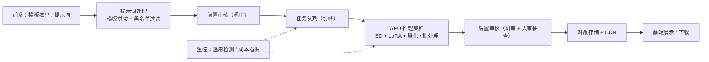
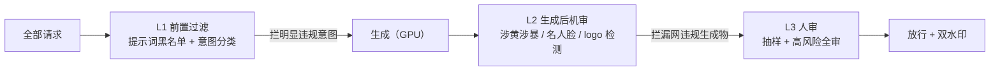

# 生产实战：AIGC 功能上线全流程

> **一句话理解**：课本上讲的是"模型怎么炼"，真实上线时一大半工夫花在选型算账、内容安全和工作流打磨上——以电商平台的文生图素材工具为例，走一遍从 0 到 1。

[⬆️ 返回总目录](../../../README.md) · [⬆️ 返回本篇](../README.md) · [⬅️ 返回本章目录](./README.md)

| 属性 | 说明 |
|------|------|
| 难度 | ⭐⭐⭐（较难） |
| 所属分支 | 生成与多模态 |
| 前置知识 | 本章全部正文 |

---

## 🏭 一个真实项目从 0 到 1

场景：某电商平台的**文生图素材工具**——设计同学为大促活动出 banner、商品详情页配图，人工出一张图平均 2 小时；目标是"模型出初稿 + 人工微调"压到 **10 分钟一张**，让设计同学的人均日产图量翻数倍。

先看用户视角的"10 分钟"是怎么花掉的（这决定了后面所有工程决策的优先级）：

| 时间点 | 用户在做什么 | 系统在干什么 |
|--------|--------------|--------------|
| 0~1 分钟 | 在表单里选商品、风格、场景、构图 | 拼装结构化提示词，黑名单校验 |
| 1~2 分钟 | 提交，看进度条 | 机审 → 入队 |
| 2~4 分钟 | 等待（刷会儿别的） | GPU 采样 20~30 步出 4 张候选图 |
| 4~5 分钟 | 挑 1 张，微调文字/局部 | 后置机审 → 存储上 CDN |
| 5~10 分钟 | 下载导入设计稿微调 | 记录采纳数据，回流评估 |

也就是说，**模型推理只占用户等待时间的几分钟，剩下的时间全花在提示词、审核和排队上**——这正是 AIGC 产品"模型只占一半、工程占一半"的直观写照。

团队配置（小而典型的阵容）：1 名算法工程师（管 LoRA 与推理优化）、1 名后端（管队列/审核/存储链路）、1 名产品或设计接口人（管模板与风格库）、法务与审核团队按需介入——三四个人就能把第一版撑起来，这也是 AIGC 工具近年遍地开花的原因。

分阶段拆解（"做什么、花多久、常见卡点"）：

- **需求定义**：和设计负责人对齐硬指标——出图时间 2 小时 → 10 分钟、初稿采纳率（多少图被留下而不是重做）、商品还原度（不能画错商品外观）。**先定"采纳率"再谈"效果分"，业务只认前者**；
- **数据**：不需要从零训练大模型。LoRA 微调（Low-Rank Adaptation，低秩适配）准备 200~500 张品牌风格图（历史 banner、官方产品图），设计同学挑选打标，1~2 周整理完；商品实拍图直接由业务库提供；
- **设备与算力**：PoC 阶段 1 张 24GB 显存级别的卡就能跑推理 + LoRA 训练（LoRA 训练单卡数小时/个）；上线后按峰值 QPS 估卡数（算账公式见下方"成本工程"），云租起步、稳定后再谈自建。经验参考：单张该档位云端 GPU 月成本在数百到一千美元量级，出图量上来后自部署单图成本远低于调 API；
- **算法选型**：见下方对比表——量大 + 品牌风格 + 商品图不出域，结论是**开源 Stable Diffusion 自部署 + LoRA**；
- **训练炼丹**：LoRA 从 rank 8~64、几百到几千步起步试；每个 checkpoint 固定一批测试提示词回测，用小工具记录"rank / 步数 / 学习率 → 采纳率"，避免炼出说不清来源的好丹；
- **评估**：离线 = 人工美观度评审 + 一致性测试（同一商品多轮生成，外观是否稳定）；线上 = 采纳率、平均修改次数、人均日产图量。**离线分好看但线上采纳率不动，说明评错了方向**；
- **部署**：推理优化三板斧——量化（fp16 起步，激进可试 int8）、批处理（把并发请求攒批喂 GPU）、步数压缩（20~30 步采样 + 蒸馏类加速方案）；服务化配套：队列削峰、失败自动重试、常用模板结果缓存；
- **监控与迭代**：盯三类指标——
  - **滥用**：敏感提示词命中率、单账户异常流量（有人拿你的商用工具批量产灰色内容，是最常见的翻车现场）；
  - **成本**：每图成本 = GPU 小时 / 出图数，做成看板并设报警线；大促前按活动量级预留扩容；
  - **质量回归**：抽样人审打分 + 采纳率趋势——模型、LoRA、采样参数任何一项变更后，都要确认这两条曲线没有悄悄往下掉。

  LoRA 风格库按活动节奏持续扩充，每次大促后复盘"哪些风格被反复使用"，下线僵尸风格。

  三个看板的具体指标与报警线（经验参考，量级按业务调）：

| 看板 | 盯什么指标 | 常见报警线 |
|------|-----------|------------|
| 滥用 | 敏感提示词命中率、单账户请求量、L1/L2 拦截量 | 单账户超日常 P99 的 5~10 倍；某级拦截量环比暴涨 |
| 成本 | 每图成本、GPU 利用率、缓存命中率 | 每图成本周环比 +30%；利用率 < 40%（烧钱）或 > 90%（该扩容） |
| 质量回归 | 抽样人审均分、采纳率趋势、重生成率 | 人审均分或采纳率周环比下滑超 5 个百分点即回查最近变更 |

**内容安全是贯穿全程的一条线**（AIGC 产品区别于普通功能的部分）——多级漏斗设计见下文专节。

**上线前检查单**（内部自用的那种，过一条勾一条）：

- [ ] 机审对涉黄涉暴/名人脸/侵权 logo 的拦截率与误杀率达标，人审抽查通道就位；
- [ ] 可见水印 + 隐式溯源水印全量生效，能追溯到生成请求；
- [ ] 提示词黑名单可热更新（大促期间热点敏感词变得很快）；
- [ ] 法务过审：训练数据授权范围、生成物版权条款、用户协议里的 AIGC 声明（见"版权与合规清单"）；
- [ ] 队列有削峰和降级预案（GPU 打满时优先保付费用户/核心活动）；
- [ ] 每图成本、采纳率、滥用命中率三个看板已接报警；
- [ ] 回滚方案：LoRA/模型版本可一键切回上一版。

📋 展开一个真实的迭代故事（按常见情况复现的示意）

上线第一周，设计同学反馈最多的问题是"**商品总是变形**"——同一个水杯，四次生成四种壶嘴。排查发现：用户输入的提示词往往只有商品名，模型自由发挥空间太大。

修复三连：① 表单化输入（商品、风格、场景、构图分开选），由系统拼装成结构化提示词；② 接入 ControlNet——用商品实拍图的轮廓/线稿作为条件，锁住外形与构图，只让模型发挥材质与背景（原理见下文"一致性问题的 ControlNet 原理"）；③ 商品图走"图生图低重绘"通道而非纯文生图。

一个月后数据（示意）：初稿采纳率从约 30% 提到 60%+，出图时间稳定在 10 分钟以内。**教训：用户不会写提示词，别指望他们写——把提示词工程做成产品的一部分。**

## 💰 成本工程：并发、队列、缓存的数字账本

AIGC 服务成本的估算不是拍脑袋，有一条可以写进评审 PPT 的公式：

$$
\text{所需 GPU 数} \approx \frac{\text{峰值出图 QPS} \times \text{单图 GPU 秒}}{\text{目标利用率} \times \text{单卡}} \quad(\text{再留 } 20\text{~}30\%\text{ 冗余})
$$

**一笔示范账（数字为经验参考量级）**：峰值 3 图/秒（大促前夜）、单图 GPU 时间 2 秒（24GB 级卡、批 4、25 步、512~1024px、fp16），目标利用率 70%：

$$
\frac{3 \times 2}{0.7} \approx 8.6 \ \Rightarrow\ \text{约 9 张卡，留冗余取 11~12 张}
$$

配套的三个工程数字：

| 项 | 目标/量级（经验参考） | 为什么 |
|----|------------------------|--------|
| GPU 利用率 | 批处理拉满后 **60~80%** 为健康区 | 低于 40%：批太小或编排空转，钱在烧；长期高于 90%：该扩容或限流了，否则高峰直接雪崩 |
| 队列水位 | 利用率逼近 90% 时等待时间**非线性暴涨** | 排队论的基本脾气：利用率越接近 100%，平均等待时间越陡——所以容量按"峰值 QPS 下利用率不超过 70%"规划，而不是按 95% 硬贴 |
| 缓存命中率 | 常见 **30~60%** | 同模板 + 同参数的重复请求直接回放预生成结果；大促前把热门模板批量预热，实打实省 GPU |

每图成本 = （卡租 + 人力分摊 + 审核/存储/CDN）÷ 出图数，做成看板指标、按周复盘——否则月底账单教做人。

🧮 展开一次大促容量的完整推演（用上面的公式走一遍，数字为经验参考量级）

背景：大促 D-7 开始预热，运营计划 3 天内产出 5 万张活动图，高峰集中在大促前夜 4 小时。

1. **估峰值 QPS**：5 万张 ÷ 3 天 ≈ 1.7 万张/天，但流量不均匀——假设 40% 压在前夜 4 小时：2 万张 ÷ 14400 秒 ≈ **1.4 图/秒**，再乘 1.5 的突发系数 ≈ **2 图/秒**（用户会反复生成挑图，实际请求数可能是出图数的 2~3 倍，按"每请求出 4 图"折算）；
2. **单图 GPU 时间**：24GB 级卡、批 4、25 步、1024px、fp16——实测口径约 2 秒/图（先在压测环境跑出来，别抄别人家的数）；
3. **代入公式**：$2 \times 2 / 0.7 \approx 5.7$ → 约 6 张卡，留 30% 冗余 → **8 张卡**；
4. **缓存修正**：大促模板高度集中，热门参数组合预热缓存命中率可冲 40%+ → 实际 GPU 压力降到约 5 张卡当量，但扩容决策仍按 8 张做——缓存万一没命中，不能让大促翻车；
5. **成本**：8 张该档位云卡 × 大促周期 1 周 ≈ 数百到一千美元量级（比临时撞限流便宜得多），活动后缩容回 2~3 张。

👉 **人话**：容量推演的顺序是"业务量 → 峰值 QPS → 单图耗时 → 卡数 → 缓存折减 → 冗余"。每一步都留余量，因为大促没有第二次机会。

**降级与优先级策略**（GPU 打满时的预案，提前配好而不是现场想）：

| 预案 | 触发条件 | 效果 |
|------|----------|------|
| 优先级队列 | 队列水位 > 80% | 付费/核心活动请求优先出队，其他排队 |
| 降采样档位 | GPU 利用率持续 > 90% | 新请求自动降到 512px / 20 步，吞吐近乎翻倍 |
| 关闭候选图 | 极端水位 | 每请求从 4 图降为 2 图，直接减半负载 |
| 停止非核心风格 | 运维开关 | 只保留主推模板，LoRA 加载也省显存换卡时间 |

💰 展开完整成本账本（数量级估算，经验参考）

假设日均出图 1 万张、每张采样 25 步、分辨率 1024×1024：

- **调 API 路线**：按主流文生图 API 定价每图几美分到十几美分计，日成本约 $500~1500 量级，月成本万美元级——且品牌风格只能靠提示词硬凑，一致性差；
- **自部署路线**：单张 24GB 级 GPU 按批处理 + 量化优化后每小时出图数百张估算，日需 1 万张约需几张卡在峰值时段满载；月成本 = 卡租 + 分摊人力，通常在数千美元量级；
- **隐性成本别忘了**：审核体系（机审 API 调用费 + 人审工时）、存储与 CDN、以及一位能维护推理服务的工程师——小规模时这些比 GPU 还贵；
- **结论形状**：日出图千张以下，API 通常更划算；稳定过万张且有品牌/隐私诉求，自部署的单图成本优势才开始覆盖工程投入。

（以上均为行业常见量级的经验参考，具体数字随型号、地区、议价变化很大——算账方法比结论重要。）

## 🛡️ 内容安全：多级漏斗

单点审核挡不住生成内容的多样性风险，生产系统用**漏斗**层层拦截——每级负责一类风险、各有一个量级概念（拦截率均为经验参考量级，取决于类目和阈值松紧）：

| 层级 | 手段 | 拦什么 | 拦截量级（经验参考） | 成本 |
|------|------|--------|----------------------|------|
| L1 前置 | 提示词黑名单 + 轻量分类器 | 明显违规意图（涉政涉黄涉暴、名人名、竞品词） | 明显违规请求的大头（八成以上） | 毫秒级、几乎免费——**最便宜的拦截发生在 GPU 之前** |
| L2 生成后机审 | 图像分类器组（涉黄涉暴 / 人脸比对 / logo 检测） | 漏网的违规生成物、变体绕过（谐音、拆字） | L1 漏网的绝大多数 | 秒级延迟、按图计费的 API 成本 |
| L3 人审 | 抽样 + 高风险通道全审 | 边界案例、机审拿不准的、申诉复核 | 抽样率常见 1~5%，高风险类目全审 | 最贵，人时计费 |

漏斗设计的两条纪律：**每级都有误杀**，必须给用户和业务方留申诉/白名单通道，否则 L1 一个过宽的正则就能把正常商品词全灭；**层级之间要留监控断点**——每级的拦截量单独上报，某一级突然放量（如热点事件引爆一批新敏感词）能在看板上第一时间看到。

**版权与合规的边界问题清单**（上线前和法务过一遍，每条都可能变成产品文案里的一句"暂不支持"）：

- [ ] **训练/微调数据授权**：LoRA 用的品牌风格图是否有商用授权范围？混入的第三方素材（字体、logo、明星脸）出库前清了吗？
- [ ] **开源模型 License**：所用底模与社区 LoRA 的商用条款逐一看过吗（开源 ≠ 可任意商用，各家条款差异很大）？
- [ ] **生成物版权归属**：用户生成图的归属条款写进用户协议了吗？平台是否有使用权？（各国对 AI 生成内容可版权性的口径仍在演化，2026 年时点仍需按辖区个案确认）
- [ ] **肖像权与名人**：能否生成真人风格/换脸？多数商用产品的答案是干脆禁止（黑名单 + L2 人脸比对双保险）；
- [ ] **风格模仿边界**："模仿某画家/某 IP 的画风"的请求怎么处理——法律边界模糊，产品侧建议白名单化（只放行自有风格库）；
- [ ] **AI 生成内容标识**：可见水印 + 隐式溯源水印是否满足所在市场的透明度义务（中国《生成式人工智能服务管理暂行办法》、欧盟 AI Act 均有相应要求，按部署地区逐条核对）；
- [ ] **数据留存与追溯**：生成请求、参数、结果能按需追溯吗（配合隐式水印定位滥用源头）？

## 🧩 一致性问题：ControlNet 的原理一段

迭代故事里提到用 ControlNet 锁住商品外形——它的原理值得单独一段（第 03 页的三件套在此长出一个配件）：

**做法**：把 Stable Diffusion 那个 U-Net 编码器（下采样部分）复制一份"影子副本"，影子接收条件图（商品实拍图的线稿/轮廓/深度图/姿态关键点），影子的各层输出经过**零初始化的 1×1 卷积**，逐层加回到主 U-Net 对应层的输出上。训练时**冻结主模型、只训影子**。

**为什么这样就能锁构图**：零初始化保证训练开局时影子贡献恒为 0——模型行为和原版完全一致，不会一上来就把预训练能力冲垮；随着训练推进，条件信号逐渐学会"接管"画面的结构决策。效果上，构图、轮廓、姿态这些**低频结构由条件图钉死**，材质、光影、风格这些**高频细节仍由提示词和模型自由发挥**——正好对应电商场景"外形不能错、背景随便美"的需求。

👉 一句话：**冻结原模型 + 加旁路 + 零初始化起步**——这套"旁路注入"思路也是多数可控生成方案（参考图引导、区域控制类）的共同骨架。

## 🧭 场景选型表

| 场景 | 推荐 | 理由 | 不推荐 |
|------|------|------|--------|
| 小团队 PoC、量小、求快 | 调 API（DALL·E / Midjourney 类） | 零运维、按量付费、当天上线 | 自建 GPU 集群（运维成本吞掉收益） |
| 量大 + 品牌风格 + 数据敏感 | 开源 SD 自部署 + LoRA | 可控可微调、单图成本低、数据不出域 | 纯 API（风格难控、商品图出域） |
| 视频级需求 | 云 GPU 集群或专用视频 API | 视频生成算力巨大，自建门槛极高 | 单卡自部署 |
| 个人开发者 / 学生练手 | 本地 ComfyUI 或免费云端算力 | 零成本跑通全流程，学完本章即可上手 | 一上来就租集群（钱包撑不住） |

选型不是一次性的：**从 API 起步验证需求、量起来后迁自部署降本**，是这类产品最常见的演进路径——别在第一天就为想象中的流量买单。

**API vs 自部署的核心对比**（做决策时对着打分）：

| 维度 | 调 API | 开源自部署 |
|------|--------|------------|
| 前期成本 | 近乎为零，按图计费（每图几美分到几十美分量级，看分辨率/模型） | 工程投入数周起步 + GPU 采购/租赁 |
| 单位成本 | 量越大越肉疼 | 量越大越便宜（经验参考：稳定大量后单图成本可低一个量级） |
| 隐私 | 数据出域（商品图、提示词都过别人的服务器） | 数据全程不出域 |
| 可控性 | 风格/一致性受限于 API 能力 | LoRA 微调品牌风格、ControlNet 控构图，深度可控 |
| 版权 | 仔细读服务条款（生成物归属、商用范围各家不同） | 自主可控，但训练数据来源要自己合规 |

## 📊 A/B 评估：AIGC 功能的特殊性

上线后"新 LoRA 好还是旧 LoRA 好""25 步还是 30 步"都要靠实验回答，但 AIGC 的 A/B 有三个特殊性，直接照搬传统功能实验会翻车：

1. **输出随机性大**：同一提示词两次生成差异巨大——必须固定随机种子 + 每个变体多采样（如每提示词出 4 图取均质），否则测的是噪声不是版本差异；
2. **质量高度主观**："哪张图好"没有客观指标——人工双盲评审 + 分维度打分是标配，行为指标（采纳率、修改次数、重生成率）比问卷更硬；
3. **分布漂移快**：大促前后提示词分布完全不同——实验分层（日常/大促流量分开看），避免"大促流量淹没日常结论"。

**人工评分维度表**（双盲、每图 ≥3 名评审、报告评审一致性）：

| 维度 | 评什么 | 5 分锚点 | 1 分锚点 |
|------|--------|----------|----------|
| 审美 | 构图、光影、质感 | 可直接商用 | 明显畸形/脏乱 |
| 提示词遵从 | 画的要素是不是要求的 | 全部要素齐全、无多余 | 缺要素或画错对象 |
| 商品/主体还原 | 与实物的外观一致性 | 细节级一致（颜色/比例/材质） | 明显变形、张冠李戴 |
| 细节质量 | 文字、手部、边缘伪影 | 无可辨伪影 | 手指崩坏/文字乱码 |
| 可用性 | 距离"能用"还差几步 | 直接可用 | 需完全重做 |

## 🧰 真实工具链

| 环节 | 常用工具 | 一句话点评 |
|------|----------|-----------|
| 推理框架 | diffusers / ComfyUI | diffusers 适合工程集成进服务；ComfyUI 适合设计同学拖节点试风格，试好了再固化成管线 |
| 风格微调 | LoRA / Kohya 类训练脚本 | 几百张图、单卡数小时，品牌风格首选方案 |
| 条件控制 | ControlNet 系列 | 线稿/深度/姿态锁构图，商品还原的救命稻草 |
| 训练数据管理 | 表单 + 对象存储 + 版本号 | 几百张图的量级别上重型平台，版本号和出处记录比平台重要 |
| 提示词与模板管理 | 模板库 + 命题记录 | 模板即资产：哪个模板采纳率高，是设计团队持续复用的经验沉淀 |
| 内容审核 | 云厂商内容安全 API + 人审后台 | 机审拦掉大头，人审兜边界案例；名人脸/logo 有专门模型 |
| 监控 | 云监控 + 成本标签 | 每图成本一定要算成看板指标，否则月底账单教做人 |

## 💣 踩坑实录

- **坑 1（一致性）**：同款商品每次生成长得都不一样 → 用 ControlNet 以商品实拍图/线稿为条件锁住外形，构图提示词权重调低——详见迭代故事与 ControlNet 原理段；
- **坑 2（延迟体验）**：采样 20~30 步要 5~15 秒，用户以为页面卡死 → 队列 + 进度条 + 异步通知；有条件上中间步预览（去噪到一半就能给个模糊图），体感完全不同；
- **坑 3（提示词质量）**：开放输入框收到的提示词惨不忍睹 → 模板化提示词工程：表单收集结构化意图，系统拼装专业提示词，普通用户根本不该被要求会写 prompt；
- **坑 4（版权）**：训练集里混入明星脸/竞品 logo → 数据入库前过一遍审核，生成端加黑名单 + 机审双保险，法务条款先于功能上线；
- **坑 5（风格库治理）**：几十个 LoRA 风格堆在一起，设计同学不知道该用哪个、旧风格悄悄失效 → 风格库要有命名规范、示例图和负责人，定期下线无人使用的风格包，"风格库治理"和代码仓库治理一个道理；
- **坑 6（成本失明）**：只盯 GPU 账单，忘了机审 API、人审工时、CDN 三笔隐性账 → 每图成本公式把四项全装进去，周报复盘——见过"GPU 省了 30%、总成本反升"的怪事，病根都在隐性项；
- **坑 7（漏斗无断点）**：三层审核全部串成一个黑盒指标"拦截率" → 每级单独上报。某次热点事件 L1 拦截量暴涨 10 倍没人发现，人审队列直接被打爆——漏斗的每一级都要有自己的报警线。

## 🗣️ 炼丹师大实话

> "AIGC 产品的护城河最后往往不是模型，是审核、版权和工作流。"——模型三个月一换代，今天引以为傲的出图质量明天就是行业地板价；真正沉淀下来的是内容安全体系、合规边界和把"不会写提示词的用户"服务好的工作流。全书至此收官：从一行梯度下降到一套上线产品，中间隔着的正是这十几章的内容——愿你炼丹顺利 🎉

---

[⬅️ 上一页：可信AI](./08-可信AI.md) · [返回本章目录](./README.md) · 🎉 全书完 · [返回总目录](../../../README.md)
