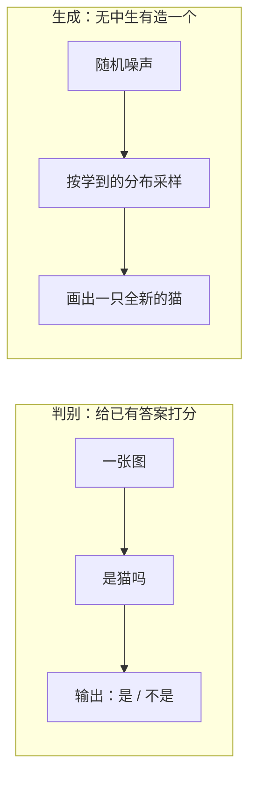
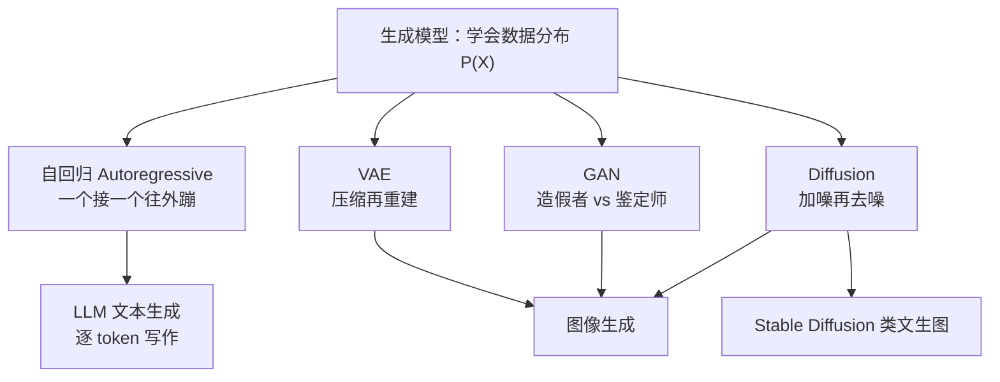

# 第 12 章：生成模型与多模态 🎨（创造）

> 前面各章里，模型都在"理解与判断"：判断这张图是不是猫、预测明天的销量、判断哪封邮件是垃圾邮件。本章换一个方向——让模型**创造**：自己画出一只猫、写一段文字、生成一段视频。我们会横向比较生成模型的四大流派（自回归 / VAE / GAN / Diffusion），深入当今图像生成的两大主角 GAN 与 Diffusion，再看文字与图像如何被放进同一个语义空间（CLIP 与多模态大模型），最后用一张前沿技术地图收束全书。生成模型是"理解世界"到"创造内容"的分水岭，也是 AIGC 时代的发动机。

[⬆️ 返回总目录](../../../README.md) · [⬆️ 返回本篇](../README.md)

## 🗺️ 判别 vs 生成：本章的第一道门

一句话区分：**判别模型（Discriminative Model）判断"这是什么"，生成模型（Generative Model）自己"造一个出来"**。

- 判别 = 判断这张图是不是猫；
- 生成 = 自己画出一只猫。

这组对比我们在[第 3 章 · 机器学习全景](../../2-经典机器学习/03-机器学习/01-机器学习全景.md)的"判别 vs 生成"小节打过照面，本章把它推向深处：判别学的是 $P(Y|X)$，生成学的是数据本身的分布 $P(X)$——后者难得多，因为相当于要记住"整个世界长什么样"。（图神经网络等其他专业方向与本章无直接前置关系，读本章不需要先读它们。）

## 🌳 生成模型家族树

容易忽略的一点：**LLM 逐 token 写文章，本身就是生成模型**——文本也是一种"数据分布"，详见[第 7 章 · 大语言模型 LLM 全景](../../4-专业方向/07-自然语言处理与LLM/04-大语言模型LLM全景.md)。本章重点讲图像侧的三大流派 VAE / GAN / Diffusion，它们先在[生成模型全景](./01-生成模型全景.md)里同台比一比，再分页深挖。

## 📖 推荐阅读顺序

| 顺序 | 页面 | 难度 | 一句话说明 |
|------|------|------|-----------|
| 1 | [生成模型全景](./01-生成模型全景.md) | ⭐⭐⭐⭐ | 判别 vs 生成、VAE 细节、四流派总览对比 |
| 2 | [对抗生成网络GAN](./02-对抗生成网络GAN.md) | ⭐⭐⭐⭐ | 造假者与鉴定师的博弈、模式崩塌、演化史 |
| 3 | [扩散模型Diffusion](./03-扩散模型Diffusion.md) | ⭐⭐⭐⭐ | 加噪去噪、Stable Diffusion 三件套 |
| 4 | [多模态模型](./04-多模态模型.md) | ⭐⭐⭐⭐ | CLIP 图文对齐、零样本分类、多模态大模型 |
| 5 | [前沿技术地图](./05-前沿技术地图.md) | ⭐⭐⭐ | 2024–2026 趋势一页看懂，附辨别 hype 土办法 |
| 收官 | [生产实战](./99-生产实战.md) | ⭐⭐⭐ | 电商文生图素材工具从 0 到 1 |

## 🎯 读完本章你应该能

- 说清判别模型与生成模型在"学什么"上的本质区别（$P(Y|X)$ vs $P(X)$）；
- 讲出 VAE / GAN / Diffusion / 自回归四大流派各自的直觉原理与优缺点；
- 解释 GAN 为什么难训（模式崩塌），以及 Diffusion 为什么能后来居上；
- 描述 CLIP 如何把图和文放进同一个语义空间，多模态大模型怎么"看图说话"；
- 面对"新模型刷屏"，有一套自己的辨别 hype 的检查办法。

## 🔗 与其他章节的关系

- **前置章节**：[第 7 章 · 自然语言处理与 LLM](../../4-专业方向/07-自然语言处理与LLM/README.md)——LLM 是最重要的自回归生成模型，文生图的文本条件也依赖这一章的词向量与注意力机制；
- **前置章节**：[第 5 章 · 计算机视觉](../../4-专业方向/05-计算机视觉/README.md)——图像生成大量借用视觉网络的编码器与卷积结构；
- **后续章节**：全书正文到此完结 🎉 新技术按贡献指南的扩展机制先登记到本章前沿地图，成熟后独立成页成章。

---

[⬅️ 上一章：第 11 章：因果推断](../../4-专业方向/11-因果推断/README.md) · 🎉 全书完 · [返回总目录](../../../README.md)
