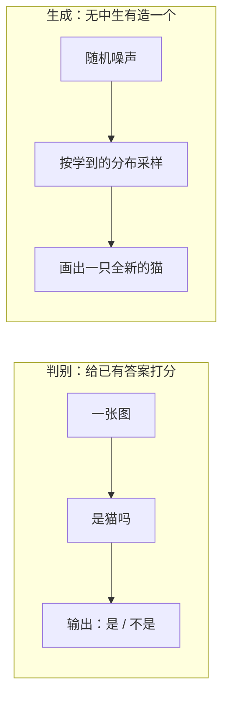
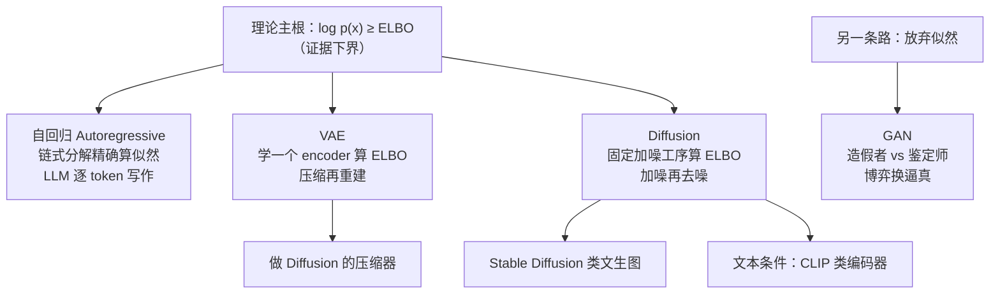

# 第 12 章：生成模型与多模态 🎨（创造）

> 前面各章里，模型都在"理解与判断"：判断这张图是不是猫、预测明天的销量、判断哪封邮件是垃圾邮件。本章换一个方向——让模型**创造**：自己画出一只猫、写一段文字、生成一段视频。我们会横向比较生成模型的四大流派（自回归 / VAE / GAN / Diffusion），给出一条把它们缝起来的**统一理论线（ELBO）**，深入当今图像生成的两大主角 GAN 与 Diffusion 的完整机理，再看文字与图像如何被放进同一个语义空间（CLIP 与多模态大模型），最后用一张前沿技术地图收束全书。生成模型是"理解世界"到"创造内容"的分水岭，也是 AIGC 时代的发动机。

[⬆️ 返回总目录](../../../README.md) · [⬆️ 返回本篇](../README.md)

## 🗺️ 判别 vs 生成：本章的第一道门

一句话区分：**判别模型（Discriminative Model）判断"这是什么"，生成模型（Generative Model）自己"造一个出来"**。

- 判别 = 判断这张图是不是猫；
- 生成 = 自己画出一只猫。

这组对比我们在[第 3 章 · 机器学习全景](../../2-经典机器学习/03-机器学习/01-机器学习全景.md)的"判别 vs 生成"小节打过照面，本章把它推向深处：判别学的是 $P(Y|X)$，生成学的是数据本身的分布 $P(X)$——后者难得多，因为相当于要记住"整个世界长什么样"。（图神经网络等其他专业方向与本章无直接前置关系，读本章不需要先读它们。）

## 🌳 生成模型家族树：四个分支 + 一条理论主根

容易忽略的两点：**其一，LLM 逐 token 写文章，本身就是生成模型**——文本也是一种"数据分布"，详见[第 7 章 · 大语言模型 LLM 全景](../../4-专业方向/07-自然语言处理与LLM/04-大语言模型LLM全景.md)。**其二，四大流派不是四门独立手艺**——自回归直接精确分解似然，VAE 和 Diffusion 都在优化同一个证据下界（ELBO，只是"辅助分布 $q$"一个学出来、一个固定），GAN 则干脆放弃似然改打博弈。这条统一主线在[生成模型全景](./01-生成模型全景.md)里用公式缝起来，是理解后面三页的钥匙。

## 📖 推荐阅读顺序

| 顺序 | 页面 | 难度 | 一句话说明 |
|------|------|------|-----------|
| 1 | [生成模型全景](./01-生成模型全景.md) | ⭐⭐⭐⭐ | 判别 vs 生成、自回归链式分解、VAE 重参数化与 ELBO 推导、**统一视角：VAE 与 Diffusion 同根于 ELBO**、四流派"生成路径"总表 |
| 2 | [对抗生成网络GAN](./02-对抗生成网络GAN.md) | ⭐⭐⭐⭐ | 极小极大博弈、最优判别器与 JS 散度推导、非饱和损失与梯度消失机理、模式崩塌的博弈论解释、WGAN/谱归一化、**训练健康度读法表** |
| 3 | [扩散模型Diffusion](./03-扩散模型Diffusion.md) | ⭐⭐⭐⭐ | 前向闭式公式推导、**从 ELBO 推出猜噪声 MSE**、DDPM vs DDIM、CFG 公式与权重效果表、U-Net 跳线、噪声调度、潜空间算力账、失效模式速查 |
| 4 | [多模态模型](./04-多模态模型.md) | ⭐⭐⭐⭐ | InfoNCE 完整公式与温度、零样本分类的模板原理、**对齐 vs 融合两条路线**、视觉 token 化（patch/VQ）、多模态幻觉、模态接线训练阶梯 |
| 5 | [前沿技术地图](./05-前沿技术地图.md) | ⭐⭐⭐ | 2024–2026 八大趋势各带一层机理（MoE 均衡损失/蒸馏温度/JEPA 分歧/访存瓶颈）、辨别 hype 三步流程表 |
| 收官 | [生产实战](./99-生产实战.md) | ⭐⭐⭐ | 电商文生图素材工具从 0 到 1：成本账本公式、内容安全多级漏斗、版权清单、ControlNet 原理、A/B 评估维度表 |

## 🎯 读完本章你应该能

- 说清判别模型与生成模型在"学什么"上的本质区别（$P(Y|X)$ vs $P(X)$）；
- 讲出 VAE / GAN / Diffusion / 自回归四大流派各自的直觉原理、优缺点与**生成路径**（一次解码/两步重建/对抗博弈/逐步去噪）；
- 用 ELBO 这条主线把 VAE 与 Diffusion 串成一个故事（学 $q$ vs 固定 $q$），并解释自回归为何能算精确似然、GAN 为何放弃似然；
- 解释 GAN 为什么难训（JS 散度在不相交分布下的零梯度、模式崩塌的博弈论根源），看 loss 曲线能读出训练健康度；
- 解释 Diffusion 为什么稳（变分界化简为回归）、怎么提速（DDIM）、怎么控（CFG 与调度）、为什么快（潜空间算力账）；
- 描述 CLIP 如何用对比学习对齐图文、零样本为什么靠模板、对齐与融合路线各适合什么任务、多模态幻觉从哪来；
- 对 2024–2026 前沿趋势说出"一层机理"（如 MoE 为何要均衡损失、端侧为何卡在访存），并有自己辨别 hype 的三步流程。

## 🔗 与其他章节的关系

- **前置章节**：[第 7 章 · 自然语言处理与 LLM](../../4-专业方向/07-自然语言处理与LLM/README.md)——LLM 是最重要的自回归生成模型，文生图的文本条件也依赖这一章的词向量与注意力机制；
- **前置章节**：[第 5 章 · 计算机视觉](../../4-专业方向/05-计算机视觉/README.md)——图像生成大量借用视觉网络的编码器、卷积结构与 ViT 骨架；
- **前置章节**：[第 8 章 · 推荐系统](../../4-专业方向/08-推荐系统/README.md)的双塔模型——CLIP 的图文对齐与它的训练技巧一脉相承（第 04 页反复回呼）；
- **后续章节**：全书正文到此完结 🎉 新技术按贡献指南的扩展机制先登记到本章前沿地图，成熟后独立成页成章。

---

[⬅️ 上一章：第 11 章：因果推断](../../4-专业方向/11-因果推断/README.md) · 🎉 全书完 · [返回总目录](../../../README.md)
