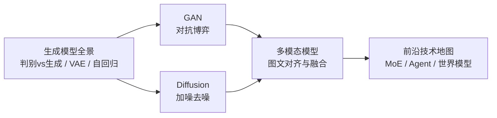

# 第五篇 · 前沿与融合 🎨

> **让机器"创造"。** 本篇站在前面所有内容之上：生成模型要用深度学习，文生图要同时懂视觉与语言，多模态是"看见"与"读写"的合流，前沿地图则帮你持续跟上这个领域的变化。读到这里，全书的线索汇成一句话——从理解世界到创造内容。

[⬆️ 返回总目录](../../README.md)

## 📑 本篇包含的章节

| 章 | 标题 | 能力 | 一句话定位 |
|----|------|------|-----------|
| 12 | 🎨 [生成模型与多模态](./12-生成模型与多模态/README.md) | 创造 | 生成全景、GAN、Diffusion、多模态、前沿技术地图 |

> 📌 各章正文讲完原理后，均配有**进阶专题页**（见各章导览的阅读顺序表）与「99-生产实战」收官页。

## 🧭 篇内逻辑

第 12 章内部递进：先横向比较生成模型的四大流派（判别 vs 生成、VAE / 自回归），再深入当今两大主角 GAN 与 Diffusion，然后看不同模态如何被对齐到同一空间（CLIP 与多模态大模型），最后用一张前沿地图收束全书、指向未来——**这张地图也是全库新技术的蓄水池**（新模型先在此登记，成熟后独立成页成章，见贡献指南的扩展机制）。

## 🔗 在全书中的位置

- **上承**：[第四篇 · 专业方向](../4-专业方向/README.md)——本篇融合其中多个方向，尤其依赖第 5 章（视觉）与第 7 章（NLP 与 LLM）。
- **下启**：全书正文到此完结 🎉 之后的内容按 [CHANGELOG](../../CHANGELOG.md) 的 Backlog 持续生长：术语表、论文精读、英文版……

---

[⬆️ 返回总目录](../../README.md) · 🎉 全书完
