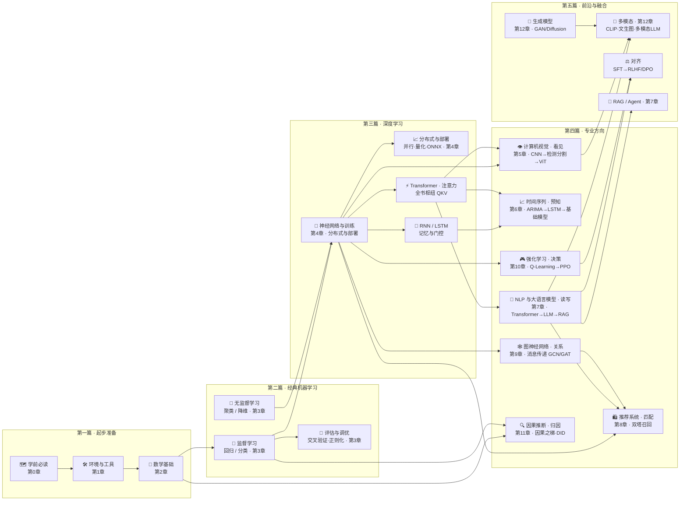

# 🌳 知识树总导航

> 一页看全书：先看全景图，再逐章展开页面清单，点击直达任意页面。
> [⬆️ 返回总目录](../README.md) · [🗺️ 阅读路线](../ROADMAP.md) · [🤝 贡献指南](../CONTRIBUTING.md)

---

## 一图看全书

箭头方向 = 依赖方向（下游建立在上游之上）；**第四篇七个方向大致平行、可按需选读**——但视觉前沿（ViT）、现代时序、推荐与图的多处内容会用到第 7 章的 Transformer，具体依赖见各页顶部"前置知识"；**Transformer 与向量（embedding）是两大枢纽**（图中 RNN/Transformer 作为通用机制画在地基层，详细页面见第 6/7 章）。

---

## 逐章导航（点击展开页面清单）

### 第一篇 · 起步准备 —— 会读本库 · 装好环境 · 数学语言包

<b>🗺️ 第 0 章 · 学前必读</b> ⭐ —— 怎么用这套知识库

页面七步结构怎么读、三种读法、学习方法与 FAQ。

| 页面 | 难度 | 类型 |
|------|------|------|
| [本章导览](./1-起步准备/00-学前必读/README.md) | ⭐ | 导览 |

<b>🛠️ 第 1 章 · 环境与工具</b> ⭐ —— Python 环境、数据集与工具链

三种环境方案、常用数据集清单、Git 与实验管理工具链，按需查阅。

| 页面 | 难度 | 类型 |
|------|------|------|
| [本章导览](./1-起步准备/01-环境与工具/README.md) | ⭐ | 导览 |
| [开发环境搭建](./1-起步准备/01-环境与工具/01-开发环境搭建.md) | ⭐ | 正文 |
| [数据集与工具链](./1-起步准备/01-环境与工具/02-数据集与工具链.md) | ⭐ | 正文 |
| [生产实战：团队工程化日常](./1-起步准备/01-环境与工具/99-生产实战.md) | ⭐⭐ | 收官 |

<b>📐 第 2 章 · 数学基础</b> ⭐⭐ —— 线代 / 微积分 / 概率，AI 够用版

只讲 AI 用得到的数学，建立"知道去哪查"的印象，用到再回看。

| 页面 | 难度 | 类型 |
|------|------|------|
| [本章导览](./1-起步准备/02-数学基础/README.md) | ⭐ | 导览 |
| [为什么要学数学](./1-起步准备/02-数学基础/01-为什么要学数学.md) | ⭐ | 正文 |
| [线性代数](./1-起步准备/02-数学基础/02-线性代数.md) | ⭐⭐ | 正文 |
| [微积分与梯度](./1-起步准备/02-数学基础/03-微积分与梯度.md) | ⭐⭐ | 正文 |
| [概率与统计](./1-起步准备/02-数学基础/04-概率与统计.md) | ⭐⭐ | 正文 |
| [生产实战：工作用多少数学](./1-起步准备/02-数学基础/99-生产实战.md) | ⭐⭐ | 收官 |

### 第二篇 · 经典机器学习 —— 数据 → 模型 → 评估 的世界观

<b>🤖 第 3 章 · 机器学习</b> ⭐⭐ —— 回归、分类、聚类、集成、调优

含判别 vs 生成、过拟合初讲与完整工作流；表格数据至今的主力方法。前置：第 2 章。

| 页面 | 难度 | 类型 |
|------|------|------|
| [本章导览](./2-经典机器学习/03-机器学习/README.md) | ⭐ | 导览 |
| [机器学习全景](./2-经典机器学习/03-机器学习/01-机器学习全景.md) | ⭐⭐ | 正文 |
| [线性回归](./2-经典机器学习/03-机器学习/02-线性回归.md) | ⭐⭐ | 正文 |
| [逻辑回归与分类](./2-经典机器学习/03-机器学习/03-逻辑回归与分类.md) | ⭐⭐ | 正文 |
| [决策树与集成学习](./2-经典机器学习/03-机器学习/04-决策树与集成学习.md) | ⭐⭐ | 正文 |
| [支持向量机](./2-经典机器学习/03-机器学习/05-支持向量机.md) | ⭐⭐⭐ | 正文 |
| [聚类与降维](./2-经典机器学习/03-机器学习/06-聚类与降维.md) | ⭐⭐ | 正文 |
| [模型评估与调优](./2-经典机器学习/03-机器学习/07-模型评估与调优.md) | ⭐⭐⭐ | 正文 |
| [进阶专题：经典 ML 理论高地](./2-经典机器学习/03-机器学习/08-进阶专题-经典ML理论高地.md) | ⭐⭐⭐⭐ | 专题 |
| [生产实战：表格数据项目 0→1](./2-经典机器学习/03-机器学习/99-生产实战.md) | ⭐⭐ | 收官 |

### 第三篇 · 深度学习 —— 神经网络地基 · 训练进阶 · 推理部署

<b>🧠 第 4 章 · 深度学习基础</b> ⭐⭐⭐ —— 原理、训练、PyTorch、分布式、部署

从神经网络原理到 PyTorch 训练模板，再到模型规模分级、分布式训练与推理部署。前置：第 3 章。

| 页面 | 难度 | 类型 |
|------|------|------|
| [本章导览](./3-深度学习/04-深度学习基础/README.md) | ⭐ | 导览 |
| [神经网络是怎么炼成的](./3-深度学习/04-深度学习基础/01-神经网络是怎么炼成的.md) | ⭐⭐⭐ | 正文 |
| [训练一个模型的完整流程](./3-深度学习/04-深度学习基础/02-训练一个模型的完整流程.md) | ⭐⭐⭐ | 正文 |
| [PyTorch 快速上手](./3-深度学习/04-深度学习基础/03-PyTorch快速上手.md) | ⭐⭐ | 正文 |
| [分布式训练与模型规模](./3-深度学习/04-深度学习基础/04-分布式训练与模型规模.md) | ⭐⭐⭐ | 正文 |
| [推理与部署](./3-深度学习/04-深度学习基础/05-推理与部署.md) | ⭐⭐⭐ | 正文 |
| [进阶专题：大规模训练工程](./3-深度学习/04-深度学习基础/06-进阶专题-大规模训练工程.md) | ⭐⭐⭐⭐ | 专题 |
| [生产实战：DL 项目全生命](./3-深度学习/04-深度学习基础/99-生产实战.md) | ⭐⭐ | 收官 |

### 第四篇 · 专业方向 —— 七大方向七种能力：看见·预知·读写·匹配·关系·决策·归因

<b>👁️ 第 5 章 · 计算机视觉（看见）</b> ⭐⭐⭐ —— CNN、检测分割、ViT

让机器读懂图像：卷积直觉、三大任务、视觉 Transformer。前置：第 4 章。

| 页面 | 难度 | 类型 |
|------|------|------|
| [本章导览](./4-专业方向/05-计算机视觉/README.md) | ⭐ | 导览 |
| [CNN 卷积神经网络](./4-专业方向/05-计算机视觉/01-CNN卷积神经网络.md) | ⭐⭐⭐ | 正文 |
| [视觉三大任务](./4-专业方向/05-计算机视觉/02-视觉三大任务.md) | ⭐⭐⭐ | 正文 |
| [ViT 视觉 Transformer](./4-专业方向/05-计算机视觉/03-ViT视觉Transformer.md) | ⭐⭐⭐⭐ | 正文 |
| [进阶专题：视觉前沿](./4-专业方向/05-计算机视觉/04-进阶专题-视觉前沿.md) | ⭐⭐⭐⭐ | 专题 |
| [生产实战：缺陷检测项目](./4-专业方向/05-计算机视觉/99-生产实战.md) | ⭐⭐ | 收官 |

<b>📈 第 6 章 · 时间序列（预知）</b> ⭐⭐⭐ —— ARIMA、LSTM、现代时序

让机器预测未来：统计方法 → 循环网络 → 注意力与基础模型。前置：第 4 章。

| 页面 | 难度 | 类型 |
|------|------|------|
| [本章导览](./4-专业方向/06-时间序列/README.md) | ⭐ | 导览 |
| [时间序列分析入门](./4-专业方向/06-时间序列/01-时间序列分析入门.md) | ⭐⭐ | 正文 |
| [RNN 与 LSTM](./4-专业方向/06-时间序列/02-RNN与LSTM.md) | ⭐⭐⭐ | 正文 |
| [现代时间序列模型](./4-专业方向/06-时间序列/03-现代时间序列模型.md) | ⭐⭐⭐⭐ | 正文 |
| [进阶专题：序列建模前沿](./4-专业方向/06-时间序列/04-进阶专题-序列建模前沿.md) | ⭐⭐⭐⭐ | 专题 |
| [生产实战：销量预测落地](./4-专业方向/06-时间序列/99-生产实战.md) | ⭐⭐ | 收官 |

<b>💬 第 7 章 · NLP 与大语言模型（读写）</b> ⭐⭐⭐⭐ —— 当代主线

词向量 → Transformer → 架构细节 → LLM 全景 → 微调对齐 → RAG 与 Agent。前置：第 4 章。

| 页面 | 难度 | 类型 |
|------|------|------|
| [本章导览](./4-专业方向/07-自然语言处理与LLM/README.md) | ⭐ | 导览 |
| [词向量与 embedding](./4-专业方向/07-自然语言处理与LLM/01-词向量与embedding.md) | ⭐⭐⭐ | 正文 |
| [Transformer 与注意力机制](./4-专业方向/07-自然语言处理与LLM/02-Transformer与注意力机制.md) | ⭐⭐⭐⭐ | 正文 |
| [Transformer 架构细节与变体](./4-专业方向/07-自然语言处理与LLM/03-Transformer架构细节与变体.md) | ⭐⭐⭐⭐ | 正文 |
| [大语言模型 LLM 全景](./4-专业方向/07-自然语言处理与LLM/04-大语言模型LLM全景.md) | ⭐⭐⭐⭐ | 正文 |
| [微调与对齐 SFT/RLHF/DPO](./4-专业方向/07-自然语言处理与LLM/05-微调与对齐.md) | ⭐⭐⭐⭐ | 正文 |
| [RAG 与 Agent](./4-专业方向/07-自然语言处理与LLM/06-RAG与Agent.md) | ⭐⭐⭐ | 正文 |
| [进阶专题：LLM 训练与推理全栈](./4-专业方向/07-自然语言处理与LLM/07-进阶专题-LLM训练与推理全栈.md) | ⭐⭐⭐⭐ | 专题 |
| [生产实战：LLM 应用落地](./4-专业方向/07-自然语言处理与LLM/99-生产实战.md) | ⭐⭐⭐ | 收官 |

<b>🛍️ 第 8 章 · 推荐系统（匹配）</b> ⭐⭐⭐ —— 协同过滤、双塔召回、排序

万物向量检索的工业主场：从"人以群分"到毫秒级百万物品召回。前置：第 4、7 章。

| 页面 | 难度 | 类型 |
|------|------|------|
| [本章导览](./4-专业方向/08-推荐系统/README.md) | ⭐ | 导览 |
| [推荐系统全景](./4-专业方向/08-推荐系统/01-推荐系统全景.md) | ⭐⭐ | 正文 |
| [协同过滤与矩阵分解](./4-专业方向/08-推荐系统/02-协同过滤与矩阵分解.md) | ⭐⭐⭐ | 正文 |
| [双塔模型与向量召回](./4-专业方向/08-推荐系统/03-双塔模型与向量召回.md) | ⭐⭐⭐⭐ | 正文 |
| [排序模型](./4-专业方向/08-推荐系统/04-排序模型.md) | ⭐⭐⭐ | 正文 |
| [进阶专题：大规模推荐系统](./4-专业方向/08-推荐系统/05-进阶专题-大规模推荐系统.md) | ⭐⭐⭐⭐ | 专题 |
| [生产实战：推荐系统上线](./4-专业方向/08-推荐系统/99-生产实战.md) | ⭐⭐ | 收官 |

<b>🕸️ 第 9 章 · 图神经网络（关系）</b> ⭐⭐⭐ —— 消息传递、GCN/GAT

让机器理解"连接"：社交网络、分子、风控团伙。前置：第 4 章。

| 页面 | 难度 | 类型 |
|------|------|------|
| [本章导览](./4-专业方向/09-图神经网络/README.md) | ⭐ | 导览 |
| [图数据入门](./4-专业方向/09-图神经网络/01-图数据入门.md) | ⭐⭐ | 正文 |
| [GNN 核心模型](./4-专业方向/09-图神经网络/02-GNN核心模型.md) | ⭐⭐⭐⭐ | 正文 |
| [进阶专题：GNN 深水区](./4-专业方向/09-图神经网络/03-进阶专题-GNN深水区.md) | ⭐⭐⭐⭐ | 专题 |
| [生产实战：风控中的图方案](./4-专业方向/09-图神经网络/99-生产实战.md) | ⭐⭐ | 收官 |

<b>🎮 第 10 章 · 强化学习（决策）</b> ⭐⭐⭐ —— Q-Learning、DQN、PPO

试错中学会行动，也是 RLHF 的地基。前置：第 4 章。

| 页面 | 难度 | 类型 |
|------|------|------|
| [本章导览](./4-专业方向/10-强化学习/README.md) | ⭐ | 导览 |
| [强化学习入门](./4-专业方向/10-强化学习/01-强化学习入门.md) | ⭐⭐⭐ | 正文 |
| [深度强化学习](./4-专业方向/10-强化学习/02-深度强化学习.md) | ⭐⭐⭐⭐ | 正文 |
| [进阶专题：RL 进阶](./4-专业方向/10-强化学习/03-进阶专题-RL进阶.md) | ⭐⭐⭐⭐ | 专题 |
| [生产实战：RL 落地版图](./4-专业方向/10-强化学习/99-生产实战.md) | ⭐⭐ | 收官 |

<b>🔍 第 11 章 · 因果推断（归因）</b> ⭐⭐⭐ —— 因果之梯、DID、因果发现

分清"相关"与"因为"：实验设计与 observational 补救方法。前置：第 2、3 章。

| 页面 | 难度 | 类型 |
|------|------|------|
| [本章导览](./4-专业方向/11-因果推断/README.md) | ⭐ | 导览 |
| [相关不等于因果](./4-专业方向/11-因果推断/01-相关不等于因果.md) | ⭐⭐⭐ | 正文 |
| [因果推断方法工具箱](./4-专业方向/11-因果推断/02-因果推断方法工具箱.md) | ⭐⭐⭐⭐ | 正文 |
| [进阶专题：因果 ML](./4-专业方向/11-因果推断/03-进阶专题-因果ML.md) | ⭐⭐⭐⭐ | 专题 |
| [生产实战：投放效果评估](./4-专业方向/11-因果推断/99-生产实战.md) | ⭐⭐ | 收官 |

### 第五篇 · 前沿与融合 —— 创造：生成模型与多模态

<b>🎨 第 12 章 · 生成模型与多模态（创造）</b> ⭐⭐⭐⭐ —— GAN、Diffusion、多模态

从判别到生成：四大流派 → GAN 与 Diffusion 细讲 → 多模态对齐 → 前沿技术地图（新技术蓄水池）。前置：第 4、5、7 章。

| 页面 | 难度 | 类型 |
|------|------|------|
| [本章导览](./5-前沿与融合/12-生成模型与多模态/README.md) | ⭐ | 导览 |
| [生成模型全景](./5-前沿与融合/12-生成模型与多模态/01-生成模型全景.md) | ⭐⭐⭐⭐ | 正文 |
| [对抗生成网络 GAN](./5-前沿与融合/12-生成模型与多模态/02-对抗生成网络GAN.md) | ⭐⭐⭐⭐ | 正文 |
| [扩散模型 Diffusion](./5-前沿与融合/12-生成模型与多模态/03-扩散模型Diffusion.md) | ⭐⭐⭐⭐ | 正文 |
| [多模态模型](./5-前沿与融合/12-生成模型与多模态/04-多模态模型.md) | ⭐⭐⭐⭐ | 正文 |
| [前沿技术地图](./5-前沿与融合/12-生成模型与多模态/05-前沿技术地图.md) | ⭐⭐⭐ | 正文 |
| [进阶专题：生成模型前沿](./5-前沿与融合/12-生成模型与多模态/06-进阶专题-生成模型前沿.md) | ⭐⭐⭐⭐ | 专题 |
| [生产实战：AIGC 产品上线](./5-前沿与融合/12-生成模型与多模态/99-生产实战.md) | ⭐⭐⭐ | 收官 |

---

## 三条贯穿全书的主线

学完单章后，沿这三条线复习能"串珠成链"：

1. **向量主线（万物皆可 embedding）**：[线性代数的点积](./1-起步准备/02-数学基础/02-线性代数.md) → [词向量](./4-专业方向/07-自然语言处理与LLM/01-词向量与embedding.md) → [双塔召回](./4-专业方向/08-推荐系统/03-双塔模型与向量召回.md) → [RAG 检索](./4-专业方向/07-自然语言处理与LLM/06-RAG与Agent.md) → [CLIP 多模态对齐](./5-前沿与融合/12-生成模型与多模态/04-多模态模型.md)
2. **注意力主线（现代 AI 的枢纽）**：[注意力机制](./4-专业方向/07-自然语言处理与LLM/02-Transformer与注意力机制.md) → [架构细节与变体](./4-专业方向/07-自然语言处理与LLM/03-Transformer架构细节与变体.md) → [ViT 进军视觉](./4-专业方向/05-计算机视觉/03-ViT视觉Transformer.md) → [注意力进时序](./4-专业方向/06-时间序列/03-现代时间序列模型.md) → [GAT 图注意力](./4-专业方向/09-图神经网络/02-GNN核心模型.md)
3. **生产主线（从原理到落地）**：每章收官的 [99-生产实战](./1-起步准备/01-环境与工具/99-生产实战.md) 系列：真实项目 0→1 的数据 / 算力 / 算法选型、工具链与踩坑实录

---

## 动手玩（需克隆到本地）

`playground/` 目录下的五个交互实验是**本地运行的 HTML**——GitHub 网页打开只会显示源码，请克隆仓库后本地双击体验，无依赖、零构建（入口页 `playground/index.html`）：

| 实验 | 对应章节 |
|------|----------|
| 🔥 梯度下降炼丹炉 | 第 2 章微积分 / 第 4 章训练 |
| 👀 注意力热力图 | 第 7 章 Transformer |
| 🔬 卷积核滑动可视化 | 第 5 章 CNN |
| 🌀 扩散去噪实验室 | 第 12 章 Diffusion |
| 🌀 动态知识树 | 全书总览 |

---

[⬆️ 返回总目录](../README.md)
