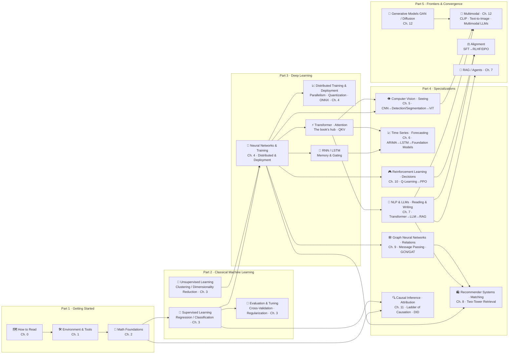

# 🌳 AI Model Knowledge Tree

### A from-zero-to-one knowledge system for AI models · Plain-language analogies + diagrams + runnable code

> 🌐 English edition (pilot). [中文完整版](../README.md)
>
> **Pilot scope**: this batch translates the homepage, the roadmap, the knowledge-tree navigation, and Part 1 (Getting Started). **The complete book lives in the [Chinese main edition](../README.md) (中文)** — pages not yet translated are linked straight to their Chinese originals, marked "(中文)".


> **No walls of formulas, no chasing hype: explain every model with analogies and diagrams, then ground every concept with runnable code.**
> Systematic like a textbook, browsable like an encyclopedia — every concept hangs on one shared knowledge tree.

---

## 📖 Introduction

**The *AI Model Knowledge Tree* is an open-source, plain-language knowledge base of AI models**, written for you if you know a little Python and want to build a systematic understanding of AI. The book is organized in three levels — **Part → Chapter → Page** — and covers the full spectrum from math foundations to frontier large models:

| Dimension | What you get |
|------|------|
| **Structure** | 5 parts · 13 chapters · 80+ pages: Getting Started → Classical Machine Learning → Deep Learning → seven specializations (Vision / Time Series / NLP & LLMs / Recommenders / Graphs / Reinforcement Learning / Causality) → Frontiers & Convergence |
| **Every page** | One seven-step structure: the problem it solves → an intuitive analogy → 📋 a worked example with real numbers → diagram-first principles (every formula gets a plain-English one-liner) → runnable code → common pitfalls and collapsible self-checks |
| **Every chapter** | Closes with a **Production Notes** page: a real 0→1 project's data / compute / algorithm choices, a scenario-based selection table, the actual toolchain, and a record of pitfalls hit along the way |
| **Interactive** | 🎮 Playground: an interactive knowledge tree, a gradient-descent lab, an attention heatmap — double-click locally and play |
| **Extensible** | New techniques are grafted onto the tree through a three-level mechanism: register on the frontier map → graduate to a standalone page → a standalone chapter (JEPA-style world models already have reserved slots) |

## 🗺️ Knowledge Tree

[](./docs/knowledge-tree.md)

> 🖱️ **Click the image above to open the [knowledge-tree master navigation](./docs/knowledge-tree.md)** — a panoramic dependency graph + per-chapter page lists + direct links, usable right on the GitHub web page.

- 📋 **[Knowledge-tree master navigation](./docs/knowledge-tree.md)** (recommended entry): the whole book's dependencies in one graph + collapsible per-chapter page lists + three threads running through the book;
- 🖼️ **Quick view**: the mermaid knowledge tree below shows dependency directions at a glance;
- 🌀 **Interactive version (optional, run locally)**: `../playground/knowledge-tree.html` provides a draggable knowledge tree. Note that GitHub web pages do not render HTML (you'll see the source); clone the repo and double-click the file locally to explore it.

---

## ✨ What kind of knowledge base is this?

| Common pain point | How this repo handles it |
|----------|------------|
| Material opens with formula derivations and scares readers off | Every model **builds intuition first with a real-life analogy** (descending a mountain for gradient descent, an open-book exam for RAG, a counterfeiter vs. a detective for GANs), and every formula comes with a plain-English one-liner |
| Online content is fragmented — you learn a lot but can't connect it | Everything grows on **one knowledge tree**: every page states its upstream/downstream dependencies, and chapters cross-link to each other |
| You understand it but can't use it | Every page ships **minimal runnable code** + common pitfalls + collapsible self-checks, so you can verify every concept hands-on |
| You learned the theory, but freeze on real projects | Every chapter closes with a **"99-production-notes"** page: a real project from 0 to 1 — data/compute/algorithm selection, a scenario decision table, the real toolchain, and a record of pitfalls actually stepped in |
| Diagrams are all the same generic flowcharts | Diagrams are chosen to fit the content: **timelines / selection quadrants / budget pie charts / git-flow diagrams**, plus the interactive **playground** |
| Tech moves so fast that tutorials rot in three months | The structure is designed to **extend**: new techniques first enter the "frontier technology map" reservoir, then graduate into a standalone page, then a chapter (see the [contributing guide](../CONTRIBUTING.md) (中文) for the process) |

## 🧭 Organization: five parts in progression, one cognitive through-line

The book is organized in three levels (**Part → Chapter → Page**); the five parts build on one another, and Part 4's seven tracks correspond to seven "abilities" of a machine:

```
Part 1  Getting Started          Learn to read this book · set up tools · pack your math kit      (Ch. 0–2)
   ↓
Part 2  Classical Machine Learning   The data → model → evaluation worldview                    (Ch. 3)
   ↓
Part 3  Deep Learning            Neural network foundations · training · inference & deployment  (Ch. 4)
   ↓
Part 4  Specializations          Seeing (5 Vision) · Forecasting (6 Time Series) · Reading/writing (7 NLP/LLM)
                                 · Matching (8 Recommenders/two-tower) · Relations (9 Graphs) · Decisions (10 RL) · Attribution (11 Causality)
   ↓
Part 5  Frontiers & Convergence  Creation (12 generative & multimodal), standing on everything above
```

## 🌳 The global knowledge tree



**How to read this tree**: arrows point along dependencies; **Part 4's seven tracks are roughly parallel — pick what you need** — although the vision frontier (ViT), modern time series, and parts of recommenders and graphs rely on Chapter 7's Transformer (each page states its exact prerequisites at the top); **causal inference is a cross-cutting methodology**; **Transformer and vector representations (embeddings) are the two hubs** — the former leads to LLMs / modern time series / vision frontiers, while the latter strings together word vectors → two-tower retrieval → RAG search → multimodal alignment (in the diagram, RNN/Transformer are drawn as general mechanisms in Part 3's foundation layer; their detailed pages live in Chapters 6/7).

## 📚 Table of Contents

### [Part 1 · Getting Started 🧭](./docs/1-getting-started/README.md) — sharpen your tools first (Ch. 0–2)

| Chapter | Title | Contents | Difficulty |
|----|------|------|------|
| 0 | 🗺️ [How to Read This Book](./docs/1-getting-started/00-how-to-read/README.md) | How to use this knowledge base | ⭐ |
| 1 | 🛠️ [Environment & Tools](./docs/1-getting-started/01-environment-tools/README.md) | Python environments, datasets, and toolchains | ⭐ |
| 2 | 📐 [Math Foundations](./docs/1-getting-started/02-math/README.md) | Linear algebra / calculus / probability & statistics — the "enough for AI" version | ⭐⭐ |

### [Part 2 · Classical Machine Learning 🤖](../docs/2-经典机器学习/README.md) (中文) — methods of the old world (Ch. 3)

🚧 Translation in progress — read [Part 2 in the Chinese main edition](../docs/2-经典机器学习/README.md) (中文).

### [Part 3 · Deep Learning 🧠](../docs/3-深度学习/README.md) (中文) — foundations of the new world (Ch. 4)

🚧 Translation in progress — read [Part 3 in the Chinese main edition](../docs/3-深度学习/README.md) (中文).

### [Part 4 · Specializations 🌐](../docs/4-专业方向/README.md) (中文) — seven tracks, seven abilities (Ch. 5–11)

🚧 Translation in progress — read [Part 4 in the Chinese main edition](../docs/4-专业方向/README.md) (中文).

### [Part 5 · Frontiers & Convergence 🎨](../docs/5-前沿与融合/README.md) (中文) — making machines create (Ch. 12)

🚧 Translation in progress — read [Part 5 in the Chinese main edition](../docs/5-前沿与融合/README.md) (中文).

**Companion files**: [🌳 Knowledge-tree master navigation](./docs/knowledge-tree.md) · [🗺️ Knowledge map & reading routes](./ROADMAP.md) · [🤝 Contributing guide](../CONTRIBUTING.md) (中文) · [📝 Changelog](../CHANGELOG.md) (中文) · [📐 Writing template](../templates/模型讲解模板.md) (中文) · [📓 Hands-on notebooks](../notebooks/README.md) (中文) · [📜 Paper close-reading series](../papers/README.md) (中文)

## 🚀 Quick Start

**Option 1: read online** (zero setup) — click into any chapter from the table of contents above; all diagrams render natively on GitHub.

**Option 2: the docs site** (automatic once GitHub Pages is enabled) — pushes to the `main` branch automatically build and deploy to `https://lizhengzhong20-sketch.github.io/model_learning/`: full-text search, light/dark mode, and a **playable online playground** (to build locally: `pip install mkdocs-material && python tools/build_site.py`; enable it in the repo's Settings → Pages by choosing "GitHub Actions").

**Option 3: clone locally**:

```bash
git clone https://github.com/lizhengzhong20-sketch/model_learning.git
```

For local reading we recommend VS Code with the *Markdown Preview Mermaid Support* extension — all diagrams and formulas will then render correctly.

## 🔬 What a content page looks like

Every page follows the same structure, keeping quality consistent:

```
📌 What problem does it solve → 🌱 Intuition (everyday analogy, zero formulas)
→ 📋 A worked example (walked through with concrete numbers; long computations collapsible)
→ 🧠 Core principles (mermaid diagrams + formulas, each with a plain-English one-liner)
→ 💻 Try it yourself (runnable code + expected output) → 🔥 Practitioner's corner (industry recipes and dark arts)
→ 🖱️ Playground (links to interactive experiments / classic tools)
→ 🔗 Where it sits on the knowledge tree (upstream/downstream jumps) → ⚠️ Common pitfalls
→ 📝 Recap & self-check (click to reveal answers) → 📚 Further reading
```

The **clarity trio** is a hard requirement on every page: a concrete example (walked through with numbers), diagrams (one diagram, one idea for core concepts), and interaction (collapsible worked derivations, playable experiment links).

The top of each page shows difficulty ⭐ / branch / prerequisites, and the bottom has **previous / next** page navigation — it reads as smoothly as a textbook.

## 🏭 Every chapter's finale: Production Notes

Once a chapter finishes the theory, its last page is always `99-production-notes.md`, answering "**how is this actually done in production**":

- One real project from 0 to 1: requirements → data → hardware & compute → algorithm selection → training → evaluation → deployment → monitoring & iteration;
- A scenario selection table (different choices under different budgets/latencies/data volumes), the real toolchain (tools called by their real names), a pitfall log, and straight talk from practitioners;
- Tools and numbers reflect common industry practice and rule-of-thumb magnitudes — no invented "insider details".

## 🎮 The playground (clone locally to play)

> ⚠️ GitHub web pages **do not render HTML** (clicking through shows only source code). To try the experiments below, **clone the repo and double-click locally** — single files, no dependencies, no build step:

| Experiment | File | What you can do |
|------|------|--------|
| 🔥 Gradient Descent Lab | `../playground/gradient-descent.html` | Drag learning rate and momentum; watch the ball roll downhill, cross pits, or fly out of the valley when its step is too big; compare SGD / Momentum / Adam |
| 👀 Attention Heatmap | `../playground/attention.html` | Type any sentence and see how the attention weight matrix is computed and what it looks like |
| 🔬 Sliding Convolution Kernel | `../playground/conv.html` | Watch a 3×3 kernel slide across an image pixel by pixel: window pixels, an editable kernel, feature maps generated live; image upload supported |
| 🌀 Diffusion Denoising Lab | `../playground/diffusion.html` | Forward noise shatters the distribution, reverse steps sculpt it back; drag the timestep to inspect each step and the noise schedule |
| 🌀 Interactive Knowledge Tree | `../playground/knowledge-tree.html` | Drag nodes, focus a dependency chain, search to locate (entry page: `../playground/index.html`) |

The 🖱️ "Playground" sections in content pages link to these same experiments — they also need to be opened locally.

## 📈 Progress & Plans

**Completed**

- [x] Five-part, thirteen-chapter framework + 50+ content pages (see the table of contents above)
- [x] Global knowledge tree, reading routes, and a production-notes finale page for every chapter
- [x] v0.2 deepening pass: every page now explains mechanisms in four layers (intuition → math → assumptions → failure boundaries) + fully collapsible derivations + failure-mode analysis (13k → 21k+ lines)
- [x] v0.3 maximum depth: **11 advanced special-topic pages** (large-scale training / full-stack LLM / recommendation engineering / generative frontiers…) + three patches per page (🎓 depth view / 🔬 SOTA evolution / ❓ open questions) + **62 📐 math deep-dive modules** (in the derivation style of *Understanding Deep Learning*, covering every page) (21k → 33k+ lines)
- [x] v0.4 audit fixes and gap-filling: practical notebooks for 11 chapters, 9 new pages closing content gaps (KNN / feature engineering / probabilistic graphical models / speech / trustworthy AI / RL panorama / hierarchical forecasting / GraphRAG / 3D vision), open-source infrastructure (CI / glossary / dual licensing / citation)
- [x] Unified writing template, extension mechanism, and contribution process

**Backlog** (pick one up — see the [CHANGELOG](../CHANGELOG.md) (中文))

- [x] Repo-wide glossary [GLOSSARY.md](../GLOSSARY.md) (中文) (first release: Chinese-English pairs + one-line explanations, continuously extended)
- [ ] Jupyter notebooks accompanying each chapter (in progress — see [notebooks/](../notebooks/README.md) (中文))
- [x] Classic paper close-reading series, all 15 published (Attention is All You Need / ResNet / Adam / word2vec / BERT / GPT-3 / InstructGPT / DPO / LoRA / GAN / DDPM / CLIP / GCN / DQN+PPO / XGBoost — see [papers/](../papers/README.md) (中文))
- [x] New playground experiments: diffusion denoising and a sliding-convolution visualizer
- [ ] English edition (`en/` directory) — 🚧 in progress: this pilot covers the homepage, roadmap, knowledge tree, and Part 1 (Getting Started)

## 🤝 Contributing & Acknowledgements

This repo evolves through **small commits, continuous pushes**: every revision of a concept or new page follows the rules in [CONTRIBUTING.md](../CONTRIBUTING.md) (中文) and gets pushed. You're welcome to join at the same cadence — fixing typos, adding new models, or opening new tracks all count; **the registration and extension process for new techniques** is also described in the contributing guide.

**Contributors**:

<a href="https://github.com/lizhengzhong20-sketch/model_learning/graphs/contributors">
  
</a>

If this knowledge base helps you, a ⭐ Star is appreciated.

## 📄 License

- **Code** (tools / playground / code in content pages): [MIT](../LICENSE)
- **Text and figures** (docs, etc.): [CC BY-SA 4.0](../LICENSE-CONTENT) (attribution + share-alike; please link back to this repo when citing)

© 2026 model_learning contributors
