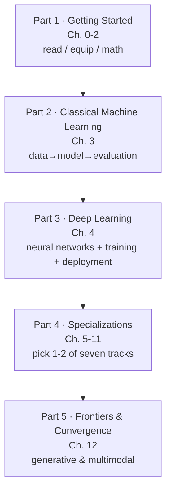

# 🗺️ Knowledge Map & Reading Routes

> 🌐 English edition (pilot). [中文完整版](../ROADMAP.md)

This map answers three questions: **How is the content organized? In what order should you read it? Where should readers with different goals enter?**
Use it together with the knowledge tree on the [README](./README.md).

---

## 🧭 General reading principles

1. **There is only one main line**: Getting Started → Classical Machine Learning → Deep Learning → Specializations → Frontiers & Convergence. Every other connection is a side branch.
2. **You don't need to finish the math first**: on your first pass through Chapter 2, just learn *where to look things up*; **come back when a later chapter actually uses it**.
3. **Code must be run, not just read**: never stop at reading each page's "Try it yourself" section — run it, change one parameter, and watch how the result changes.
4. **The knowledge tree is a map, not a to-do list**: skimming is allowed, lookups on demand are allowed.
5. **After each chapter's main text, don't skip the closing "Production Notes" page**: it maps the theory onto real workflows — selection, compute, tooling, and pitfalls all live there.

---

## 📊 The five-part progression map



| Part | Chapters | Positioning | You're done when… |
|----|----|------|-----------|
| [Part 1 · Getting Started](./docs/1-getting-started/README.md) | 0–2 | Learn to use this repo, set up the environment, pack your math kit | You can run a sklearn example end-to-end on your own; you know the intuitions behind gradients, matrix multiplication, and conditional probability |
| [Part 2 · Classical Machine Learning](../docs/2-经典机器学习/README.md) (中文) | 3 | Build the complete "data → model → evaluation" loop | You can take a tabular dataset through regression + classification and evaluate it correctly |
| [Part 3 · Deep Learning](../docs/3-深度学习/README.md) (中文) | 4 | Understand the full neural-network training process; know the basics of model-scale tiers, distributed training, and inference/deployment | You can hand-write a training loop for an MLP; you can say when you need multiple GPUs and when you need quantization |
| [Part 4 · Specializations](../docs/4-专业方向/README.md) (中文) | 5–11 | Pick 1–2 of seven tracks as needed | You can follow the main body of papers/projects in your track and reproduce an entry-level project |
| [Part 5 · Frontiers & Convergence](../docs/5-前沿与融合/README.md) (中文) | 12 | Generative models and multimodality, standing on the whole book | You can clearly explain "pretraining→SFT→RLHF", RAG, and the principles of GANs and Diffusion |

---

## 🚀 Three ways to read

### Route A: build a global picture (skim the trunk)

```
00 How to Read → 02 Math Foundations (read "Why learn math" + each page's "Intuition" section)
→ 03 Machine Learning (four pages closely: panorama / linear regression / logistic regression / evaluation & tuning; skim the rest)
→ 04 Deep Learning Basics → 07 NLP & LLMs (README → Transformer → LLM panorama)
→ 12 Generative & Multimodal (README → frontier technology map)
```

For: product managers, managers, and operators who need to understand what the algorithms team is saying — and anyone who wants the panorama before deciding where to go deep.

### Route B: read systematically (the complete route)

```
Part 1 → Part 2 → Part 3 → Part 4 (pick 1–2 tracks) → Part 5

Track selection guide:
- Working with images → Ch. 5 Computer Vision
- Business forecasting / operations analytics → Ch. 6 Time Series + Ch. 11 Causal Inference
- Text / LLM applications → Ch. 7 NLP & LLMs (all of it) + Ch. 12
- Search / recommendations / personalization → Ch. 8 Recommender Systems + Ch. 9 Graph Neural Networks
- Decision-making / games / robotics → Ch. 10 Reinforcement Learning
```

For: readers who want a complete AI knowledge system. Every page's "Try it yourself" is worth running.

### Route C: go straight to LLMs (if you have the basics)

```
All of Ch. 7 NLP & LLMs (focus: 02 Transformer → 03 architecture details → 04 LLM panorama → 05 fine-tuning & alignment → 06 RAG & Agents)
→ Ch. 10 Reinforcement Learning (only the intro page + the RLHF-related parts of deep RL)
→ Ch. 12 (GAN → Diffusion → multimodal → frontier map)
```

For: readers who already know Python and basic machine learning and want to move into large models.

---

## 📖 Study advice

1. **The Feynman technique**: after finishing each page, close the file and explain the "Intuition" section in your own words — wherever you stumble is what you don't understand yet.
2. **Self-check every page**: actually answer the "Self-check" at the bottom; answers are folded inside `<details>` blocks.
3. **Experiment by tweaking code**: change the learning rate / number of layers / data size in the examples and watch the results shift — that's how you build a feel; the interactive experiments in `../playground/` let you drag sliders to build intuition.
4. **Let output drive input**: after finishing a chapter, write a summary — or submit a revision to this repo directly following [CONTRIBUTING.md](../CONTRIBUTING.md) (中文).
5. **Don't insist on mastering everything in one pass**: the value of a knowledge tree is knowing *where things are and how they relate*. First pass: the main line. Second pass: the details.

---

## 🧭 Model-selection cheat sheet ("which model should I start with?")

| Your problem | Starting model | Upgrade path | Details |
|----------|----------|----------|------|
| Predicting a number from tabular data (sales/price/ratings) | LightGBM / linear regression | Feature engineering → GBDT tuning; if strongly time-based, move to Ch. 6 | [Ch. 3](../docs/2-经典机器学习/03-机器学习/README.md) (中文) |
| Classifying tabular data (churn/default/clicks) | Logistic regression → LightGBM | Calibration → multi-objective → the Ch. 8 ranking stack | [Ch. 3](../docs/2-经典机器学习/03-机器学习/README.md) (中文) |
| Image classification / detection / segmentation | Fine-tune a pretrained CNN/ViT (transfer learning) | Data augmentation → detection frameworks → edge deployment | [Ch. 5](../docs/4-专业方向/05-计算机视觉/README.md) (中文) |
| Forecasting over time (demand/load/metrics) | Statistical baseline + LightGBM lag features | LSTM → Transformer forecasters; hierarchical reconciliation | [Ch. 6](../docs/4-专业方向/06-时间序列/README.md) (中文) |
| Text understanding / generation / QA | LLM API + prompt engineering | RAG → fine-tuning (LoRA) → self-hosting | [Ch. 7](../docs/4-专业方向/07-自然语言处理与LLM/README.md) (中文) |
| Personalized recommendations / similarity search | ItemCF baseline → two-tower retrieval | Multi-source recall → ranking models → the full pipeline | [Ch. 8](../docs/4-专业方向/08-推荐系统/README.md) (中文) |
| Relational data (social / molecules / fraud) | Graph features + GBDT | GCN/GAT → heterogeneous graphs → temporal graphs | [Ch. 9](../docs/4-专业方向/09-图神经网络/README.md) (中文) |
| Sequential decisions / control | Rule-based baseline → Q-Learning (when simulation exists) | DQN/PPO → offline RL; for alignment, RLHF | [Ch. 10](../docs/4-专业方向/10-强化学习/README.md) (中文) |
| "Did it actually work?" (policy/campaign evaluation) | A/B experiments | When experiments are impossible: DID/PSM/synthetic control → uplift | [Ch. 11](../docs/4-专业方向/11-因果推断/README.md) (中文) |
| Generating content (images/text/audio) | Start with an API | Self-host open-source Diffusion + LoRA styling | [Ch. 12](../docs/5-前沿与融合/12-生成模型与多模态/README.md) (中文) |

> Rules of thumb: **always start from the simplest baseline** ("baseline first", Ch. 3's production page); deep learning wins clearly only with large data and raw signals (images/text/audio); in any project, nail down the evaluation protocol before writing code.

## 🛠️ Practice-project ladder (progressive stages)

1. **Beginner**: Titanic survival prediction (Kaggle) — the full Ch. 3 workflow: cleaning → baseline → features → tuning → submission
2. **Consolidate**: MNIST handwritten digits — run the Ch. 4 training template, then compare Ch. 5's CNN against an MLP on sklearn digits
3. **Track project** (pick one by interest):
   - Vision: defect detection on a small factory/medical dataset (Ch. 5 production page route)
   - Time series: weather or sales forecasting for one city + rolling backtests (Ch. 6 production page route)
   - NLP: build a minimal RAG over your own document collection (Ch. 7 page 06 + notebook ch07)
   - RecSys: run two-tower retrieval + Recall@K on the MovieLens dataset (Ch. 8 + notebook ch08)
4. **Capstone**: productionize your practice project — add an evaluation set, experiment tracking, deploy as an API, write a retrospective (tick off every item on each chapter's production checklist)

---

[⬆️ Back to contents](./README.md)
