# Chapter 0: How to Read This Book 🗺️

> 🌐 English edition (pilot). [中文完整版](../../../../docs/1-起步准备/00-学前必读/README.md)

> This chapter covers no models at all — just one thing: **how to get the most out of this knowledge base**. By the end you'll know how to read every page, where to enter the knowledge tree, and where to look when you're stuck — and only then decide whether to install an environment (Chapter 1) and how much math to brush up (Chapter 2).

[⬆️ Back to contents](../../../README.md) · [⬆️ Back to this part](../README.md)

## 🧭 What this knowledge base is · and is not

| It is ✅ | It is not ❌ |
|--------|-----------|
| **A textbook + encyclopedia**: systematic like a textbook, and browsable on demand like a dictionary | A bootcamp course: no schedules, no daily check-ins, and no "finish in N days" promises |
| **A knowledge tree**: every concept states its upstream/downstream dependencies, and chapters cross-link freely | A paper collection: it never assumes you've read the original papers, and every formula comes with a plain-English one-liner |
| **A practice ground**: every page ships minimal runnable code, common pitfalls, and collapsible self-checks | A question bank or hype aggregator: it isn't written for memorizing trivia, and it doesn't chase this week's trending topic |

In one sentence: **it's a map, not a to-do list**. A map lets you take detours, cut corners, and turn back on the spot — as long as you always know where you are and where you're going.

## 📖 How to read a content page

Every topic page in this repo looks the same, and the section order is the recommended reading order:

```mermaid
graph LR
    A["📌 What problem it solves"] --> B["🌱 Intuition"]
    B --> C["📋 A worked example"]
    C --> D["🧠 Core principles"]
    D --> E["💻 Try it yourself"]
    E --> F["🔥 Practitioner's corner"]
    F --> G["🖱️ Playground"]
    G --> H["🔗 On the knowledge tree"]
    H --> I["⚠️ Common pitfalls"]
    I --> J["📝 Recap & self-check"]
    J --> K["📚 Further reading"]
```

| Section | What it does | Read it on the first pass? |
|------|--------|--------------|
| 📌 What problem it solves | The pain before this technique existed, and its core idea | Must-read — spend half a minute deciding whether this page matters to you |
| 🌱 Intuition | Everyday analogies + plain language, zero formulas | Must-read — intuition before formulas |
| 📋 A worked example | Walked through with concrete numbers or a small scenario | Must-read — this is how abstract concepts land |
| 🧠 Core principles | mermaid diagrams + formulas, each formula with a plain-English one-liner | Fine to save for the second pass; long derivations are collapsed |
| 💻 Try it yourself | Minimal runnable code + expected output | Strongly recommended to actually run it |
| 🔥 Practitioner's corner | Common starting recipes and rules of thumb from industry | Skim it as field experience |
| 🖱️ Playground | Links to playground experiments or classic interactive tools | Worth opening and dragging a couple of sliders |
| 🔗 On the knowledge tree | What's upstream, where it leads, what sits beside it | Use it to plan routes and review |
| ⚠️ Common pitfalls | Typical misunderstandings and corrections | Focus here when reviewing or before interviews |
| 📝 Recap & self-check | Key points + collapsed-answer self-test | Must-do — if you can't explain it, you don't get it yet |
| 📚 Further reading | Papers, courses, blogs | For when you want to dig deeper |

**Core advice: on the first pass, read only 📌 → 🌱 → 📋 to figure out "what is this page about"; save formulas and derivations for the second pass, and run the code as you go.** The top of each page shows a difficulty rating, branch, and prerequisites; the bottom has previous/next navigation — it reads as smoothly as a textbook.

## 🚦 Three reading routes — one will fit you

Readers with different goals enter the tree differently. Here's the one-line overview; complete routes (including how to pick a track) are in the [🗺️ Knowledge Map & Reading Routes](../../../ROADMAP.md):

- **Route A · Build a global picture**: skim the trunk — How to Read → each Math Foundations page's "Intuition" section → the ML panorama → Deep Learning Basics → the LLM panorama → the frontier map. For product, management, and operations folks who need to follow what the algorithms team is saying.
- **Route B · Read systematically**: read Parts 1 through 5 in order, picking one or two of Part 4's seven tracks based on your goals. For readers who want a complete AI knowledge system — every page's "Try it yourself" is worth running.
- **Route C · Go straight to LLMs**: if you already know Python and basic machine learning, enter directly through Chapter 7 (NLP & LLMs), then circle back for reinforcement learning and generative models. For readers moving into large models.

## 🎯 Four study rules

1. **The Feynman technique**: after finishing each page, close the file and explain the "Intuition" section in your own words — wherever the explanation stumbles is what you haven't understood.
2. **Always run the code**: never just read the "Try it yourself" section. Running it once and matching the expected output is the cheapest correctness check there is.
3. **Tweak parameters and experiment**: change the learning rate, depth, or data size in the examples and run again — a feel for models comes from "what happens when I change this", not from "I've seen it".
4. **Let output drive input**: after finishing a chapter, write a summary, or submit a revision to this repo — whatever you can't write down is where your foundation is still shaky.

## ❓ FAQ

My math is weak — can I still read this?

**Yes.** The book assumes only a little Python, and every formula arrives with a plain-English one-liner. On your first pass through Chapter 2, all you need is a "know where to look it up" impression; later parts tell you to **come back when a concept is actually used**. What really trips people up usually isn't the math — it's skipping the analogies and examples. Read 🌱 and 📋 first, then return to the formulas.

Do I have to read from Chapter 0 to Chapter 12 in order?

**No.** The knowledge tree is a map, not a to-do list. The main line (Getting Started → Classical Machine Learning → Deep Learning → Specializations → Frontiers & Convergence) suits systematic learners; readers in a hurry can just pick a route from the three in the [ROADMAP](../../../ROADMAP.md). One reminder: when skipping around, glance at the "prerequisites" line at the top of each page — patch gaps as you find them rather than grinding through.

Will the content be updated? What about how fast the field moves?

**Yes.** This repo evolves through small commits and continuous pushes; every change is recorded in `CHANGELOG.md` at the repo root. New techniques land through the three-level extension process in the contributing guide: first registered in Chapter 12's "frontier technology map", then promoted to a standalone page, then a chapter — **things are only ever appended, never torn down**, so links you've bookmarked won't break.

## 🤝 How to help improve it

Spotted a typo, code that won't run, or a model we're missing? All welcome:

- **Small fixes**: open a PR directly — fixing typos, links, or adding examples all count as contributions;
- **New content**: follow the templates and process in the [🤝 contributing guide](../../../../CONTRIBUTING.md) (中文); one commit does one thing;
- **Not sure about an idea**: open an Issue to discuss first, then write.

This repo is open knowledge sharing — **every reader could be the next co-author**.

---

🚉 This is the start of the book (no previous chapter) · [Back to contents](../../../README.md) · [Next: Chapter 1: Environment & Tools ➡️](../01-environment-tools/README.md)
