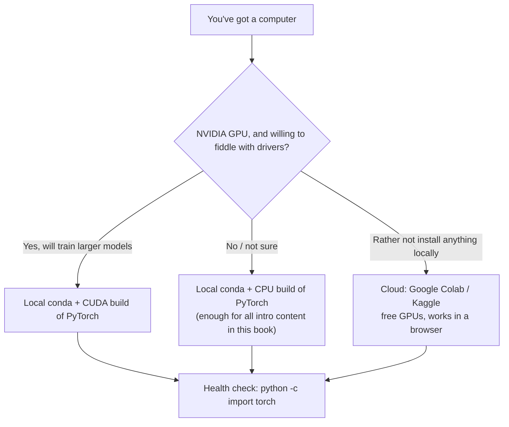

# Setting Up Your Development Environment

> 🌐 English edition (pilot). [中文完整版](../../../../docs/1-起步准备/01-环境与工具/01-开发环境搭建.md)

> **One-sentence summary**: carve out a clean, isolated "test plot" on your own machine (or on free cloud compute) — install Python and PyTorch so that every page of this book has somewhere to run.

[⬆️ Back to contents](../../../README.md) · [⬆️ Back to this part](../README.md) · [⬅️ Back to chapter contents](./README.md)

| Attribute | Notes |
|------|------|
| Difficulty | ⭐ (not hard, but detail-heavy — just follow along; for errors, look them up in the quick-reference table at the end) |
| Branch | General foundations |
| Prerequisites | None |

---

## 📌 What problem does this page solve

The first tiger blocking the road when learning AI is usually not the math — it's the environment setup.

The most common way it goes wrong: installing packages straight into the system Python. Today project A wants version 1.x of some library, tomorrow project B wants 2.x; they fight each other, and eventually the whole Python install is left half-broken — uninstalling and reinstalling costs more effort than learning the models. Deep learning adds another layer: GPU, driver, CUDA, and PyTorch versions all have to line up; with any one link out of place, the code runs on someone else's machine and errors on yours.

This page's approach is "isolate first, install second": give each project its own independent test plot via a virtual environment, pick one install route that matches your hardware, then verify the result with a single command.

## 🌱 Intuition

Think of environment setup as starting a vegetable garden:

- **A virtual environment = a separate plot of land**: project A's plot gets chemical fertilizer, project B's plot gets organic — no cross-contamination; if one plot goes to waste, throw out that plot and start over, which hurts far less than reinstalling the OS.
- **conda = the gardener's toolbox for opening plots**: open a new plot on a whim (`conda create`), step in and out of any plot anytime (`activate` / `deactivate`), list all your plots (`env list`).
- **Colab / Kaggle = ready-made rented plots**: irrigation system included (GPUs) and pre-installed tools (PyTorch and friends) — move in with your bags, open a browser and get to work; the catch is the land isn't yours — remember to move your files back home in time.

## 📋 A worked example

Scenario: a brand-new Windows PC, goal: go from zero to a working `import torch`. The full command sequence is just this:

```bash
# ① After installing Miniconda, open "Anaconda Prompt (miniconda3)" from the Start menu, create a test plot named ai
conda create -n ai python=3.10 -y
# ② Step into this test plot (activate it before every future use)
conda activate ai
# ③ Point pip at the Tsinghua mirror permanently (one-time setup; speeds up every later download — mainly useful in mainland China)
pip config set global.index-url https://pypi.tuna.tsinghua.edu.cn/simple
# ④ Install the CPU build of PyTorch (the choice if you have no NVIDIA GPU / just want to start learning)
pip install torch torchvision
# ⑤ Health check: if it prints the version numbers, the environment is good
python -c "import torch; print(torch.__version__); print(torch.cuda.is_available())"
```

Expected output (CPU build): something like `2.x.x+cpu` and `False` — **seeing `+cpu` means the install worked**; `False` only means "no GPU in use right now", it is not an error.

<details>
<summary>📊 Expand the full walkthrough: what happens at each step and what the output looks like</summary>

**Step ① `conda create -n ai python=3.10 -y`**
The screen lists the packages to be installed (python, pip, etc.); `-y` means auto-confirm. It ends with `done.`.

**Step ② `conda activate ai`**
The `(base)` prefix at the start of your prompt becomes `(ai)` — this prefix tells you "which plot you're standing in". Leave with `conda deactivate`.

**Step ③ `pip config set global.index-url ...`**
Prints `Writing to C:\Users\<you>\AppData\Roaming\pip\pip.ini` — it writes "download via the Tsinghua mirror from now on" into the config file. Do it once, done forever.

**Step ④ `pip install torch torchvision`**
Downloads and installs several hundred MB of packages. With the mirror switched, the speed difference is clearly visible; if the download breaks midway, just rerun the same command.

**Step ⑤ `python -c "import torch; ..."`**
Prints two lines: the first is the PyTorch version (e.g. `2.x.x+cpu`), the second `False` (a CPU build has no CUDA — normal). No red Traceback anywhere means the environment works.

**If you want the CUDA build at step ④** (with an NVIDIA GPU): first generate the command from the official selector (see the "Playground" section), something like `pip install torch torchvision --index-url https://download.pytorch.org/whl/cuXXX` — whatever the official site currently shows is authoritative.

</details>

## 🧠 Core principles

### The overall flow

First, a multiple-choice question: which route fits your hardware and needs?



### Comparing the options: three mainstream routes

| Option | Barrier | Compute | Pros | Limits |
|------|------|------|------|------|
| Local conda / venv | Install Miniconda once | Your own CPU / GPU | Set up once, use for years; files stay local and under your control; closest to a real work environment | Slow training without a GPU; debugging is on you |
| Google Colab | A Google account | Free GPU (T4-class, per current policy), paid upgrades available | Zero install, PyTorch preinstalled; smoothest for notebooks | Access can be unstable from mainland China; idle sessions get reclaimed — save files to Drive or GitHub promptly |
| Kaggle Notebooks | A Kaggle account | Free weekly GPU hours (~30 h, per current policy) | Huge datasets one click away; community notebooks to learn from | Competition-oriented; less flexible custom environments than local |

### Step by step

#### 1. Minimal Miniconda install (Windows-focused)

- **Download**: get the Windows 64-bit installer from the official Miniconda page (docs.conda.io); accept the defaults all the way through (the "Just Me" install is the least trouble).
- **Entry point**: after installing, find **Anaconda Prompt (miniconda3)** in the Start menu — this is where you'll type commands from now on; it ships with conda. Don't use the system PowerShell for conda directly (unless you've run `conda init`).
- **Verify**: `conda --version` printing something like `conda 24.x.x` means success.
- **The four everyday commands**:

```bash
conda create -n env_name python=3.10   # open a new plot
conda activate env_name                # step into that plot
conda deactivate                       # go back to base
conda env remove -n env_name           # abandon the whole plot (if it's broken, toss it — don't fight it)
```

<details>
<summary>🧮 Expand: two pit-saving details for the Windows install</summary>

1. **Keep the install path free of non-ASCII characters and spaces**: the default path (under your user directory) is usually fine; a custom path containing spaces or non-ASCII characters is the classic source of inexplicable errors.
2. **conda init**: to use `conda` directly in PowerShell / Git Bash, run `conda init` once and then reopen the terminal; if conda isn't recognized right after installing, nine times out of ten the terminal wasn't reopened.

</details>

#### 2. Switching pip to a faster mirror: one command

```bash
pip config set global.index-url https://pypi.tuna.tsinghua.edu.cn/simple
```

This is Tsinghua University's PyPI mirror. Set once, effective forever — the difference is plainly visible when downloading multi-hundred-MB packages like torch. To revert to the default: `pip config unset global.index-url`.

#### 3. Jupyter Lab essentials

```bash
pip install jupyterlab
jupyter lab        # opens your browser automatically on startup
```

The two traps beginners hit most:

- **Pick the right kernel**: the kernel shown at the top-right of each notebook must be your environment's name (e.g. `ai`), otherwise `import torch` fails with "module not found" — the notebook is probably still attached to the base environment.
- **Make the environment show up in Jupyter** (optional): `python -m ipykernel install --user --name ai`.
- **Shutting down**: after closing the browser tab, go back to the terminal and press `Ctrl + C` to stop the server.

#### 4. Installing PyTorch: CPU or CUDA?

First answer one question: **how large are the models you'll train?** The book's intro examples (MLPs, small CNNs) run fine on CPU; you only need a GPU for larger vision models or for fine-tuning large language models.

- **CPU build**: `pip install torch torchvision`. Small download, works out of the box — the right first choice.
- **CUDA build**: first run `nvidia-smi` in a terminal — output means the GPU driver is fine, and the top-right corner shows the highest CUDA version the driver supports; then generate the command from the official "Start Locally" selector for your setup (something like `--index-url https://download.pytorch.org/whl/cuXXX`; whatever the official site currently shows is authoritative).
- **Verify the GPU build**: `torch.cuda.is_available()` returns `True`, and `torch.cuda.get_device_name(0)` prints your GPU's name.

## 💻 Try it yourself

```python
# env_check.py — environment health-check script: confirm Python and PyTorch are installed
import sys
import torch

print("Python :", sys.version.split()[0])    # the version you picked when creating the env, e.g. 3.10.x
print("PyTorch:", torch.__version__)         # the CPU build looks like 2.x.x+cpu
print("CUDA   :", torch.cuda.is_available()) # False on a CPU build — that's normal

x = torch.arange(6).reshape(2, 3)            # a quick tensor op while we're at it
print(x)
# Expected output:
# Python : 3.10.x
# PyTorch: 2.x.x+cpu
# CUDA   : False
# tensor([[0, 1, 2],
#         [3, 4, 5]])
```

If all four lines print and the last one is that 2×3 matrix, your environment can run every intro example in this book.

## 🔥 Practitioner's corner

> 🔥 **Practitioner's corner**: field-tested environment wisdom —
> - The recipe: for a new project, fix "a mainstream stable Python + CPU torch" and get it running first; upgrade to the CUDA build only once you know you need a GPU. Never install project packages into the base environment.
> - The dark arts: when an environment breaks, delete and rebuild the whole thing (`conda env remove`) — usually faster than debugging dependency by dependency; for environments unused for a long time, run the health-check script before touching them; for driver problems, the ancient art of rebooting genuinely works.
> - ⚠️ The above is field experience, not gospel; on a new machine, re-check everything against the official commands.

## 🖱️ Playground

> 🕹️ [PyTorch official install selector](https://pytorch.org/get-started/locally/) — pick OS, package manager, and compute type, and it generates the current install command; check here before installing any CUDA build.
> 🕹️ [Google Colab](https://colab.research.google.com) — a zero-install taste: create a notebook, menu "Runtime → Change runtime type → GPU", and `import torch` just works — feel the joy of someone else having set up the environment for you.

## 🔗 Where this page sits on the knowledge tree

- **Upstream**: this chapter's [README](./README.md) (chapter map and usage); no knowledge prerequisites for this page.
- **Downstream**: [Datasets & toolchains](../../../../docs/1-起步准备/01-环境与工具/02-数据集与工具链.md) (中文) — with the environment ready, go pick up data; Chapter 4's [PyTorch Quick Start](../../../../docs/3-深度学习/04-深度学习基础/03-PyTorch快速上手.md) (中文) — what this page installs is precisely the ticket for it; [Production Notes](../../../../docs/1-起步准备/01-环境与工具/99-生产实战.md) (中文) — how teams manage environments.
- **Parallel pages**: sits alongside [Chapter 2: Math Foundations](../02-math/README.md) in Getting Started — one hands you the hardware, the other the language.

## ⚠️ Common pitfalls

- **Pitfall 1**: "Always install the newest Python" → freshly released Python versions may not be supported yet by PyTorch and friends; a mainstream stable release that's been out a year or two, with a mature ecosystem, causes far less grief.
- **Pitfall 2**: "Mixing conda and pip is fine" → installing half your packages through each in the same environment tangles the dependency graph hopelessly; the common practice is conda for environments + pip for packages, with one primary tool per environment.
- **Pitfall 3**: "`torch.cuda.is_available()` returning False means I installed it wrong" → you probably installed the CPU build in the first place (version string contains `+cpu`); that's perfectly fine for this book's intro content — not a fault.
- **Pitfall 4**: "Installing packages into base is harmless" → base is conda's own kitchen garden; mess it up and even conda itself may stop working; always open a new environment for a new project.

**Error quick-reference table** (use together with the pitfalls above):

| Error keyword | Typical appearance | Most likely cause | What to do |
|-----------|----------|-----------|--------|
| Version conflict | `ResolutionImpossible`, `dependency resolver` warnings | Two packages require different versions of the same dependency | Reinstall into a brand-new environment; or pin one package's version as the error suggests; never stew every library into one environment |
| CUDA unavailable | `torch.cuda.is_available()` is False; or `Torch not compiled with CUDA enabled` | You installed the CPU build; or the driver is too old; or CUDA and PyTorch versions mismatch | CPU build installed → reinstall the CUDA build via the official command if you need it; GPU present → check the driver with `nvidia-smi`, then align the command on the official selector |
| Slow download / timeout | `Read timed out`, a crawling or frozen progress bar | The default download source is far away | Run the mirror command above and retry; for huge packages add `--timeout 600` |
| conda not found | `conda: command not found` | Wrong terminal, or the terminal wasn't reopened after installing | On Windows open "Anaconda Prompt" from the Start menu; or run `conda init` and reopen the terminal |

## 📝 Recap & self-check

**Key points**

- Virtual environments isolate each project's dependencies — the root-cure for "environment hell";
- Three routes: local conda (the long-term workhorse), Colab / Kaggle (free GPUs, zero install);
- One command switches pip to the Tsinghua mirror — a night-and-day download speed difference;
- The CPU build of PyTorch runs every intro example in this book; install the CUDA build per the official command when you actually need a GPU.

**Self-check** (click to reveal answers)

<details>
<summary>Question 1: Why give every project its own virtual environment instead of sharing one?</summary>

Dependency isolation: different projects may require different versions of the same library, and sharing guarantees conflicts. With isolation, a broken environment only means deleting and rebuilding that one environment — other projects are untouched, and the system Python even less so.

</details>

<details>
<summary>Question 2: No NVIDIA GPU on my computer — can I still learn from this book?</summary>

Yes. The CPU build of PyTorch covers every intro example; experiments that do need a GPU can run on Google Colab's or Kaggle's free compute; a local GPU only becomes a hard requirement when training larger models.

</details>

## 📚 Further reading

- Official tutorial: [PyTorch official install guide (Start Locally)](https://pytorch.org/get-started/locally/) — the final authority on install commands
- Official docs: [Miniconda official page](https://docs.conda.io/en/latest/miniconda.html) — downloads and per-platform install instructions
- Cloud practice: [Google Colab](https://colab.research.google.com) · [Kaggle Notebooks](https://www.kaggle.com/code)

---

[⬅️ Previous page: Chapter 1 contents](./README.md) · [Back to chapter contents](./README.md) · [Next page: Datasets & toolchains ➡️](../../../../docs/1-起步准备/01-环境与工具/02-数据集与工具链.md) (中文)
