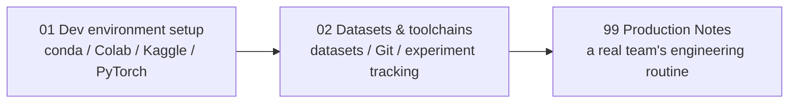

# Chapter 1: Environment & Tools 🛠️

> 🌐 English edition (pilot). [中文完整版](../../../../docs/1-起步准备/01-环境与工具/README.md)

> The toolbox chapter. No models here — it answers "where do the weapons come from": set up an environment that can run every piece of code in this book, and get to know a batch of practice datasets and handy tools. **Consult this chapter as needed** — set the environment up once, then return whenever necessary; no need to read it front to back like a content page.

[⬆️ Back to contents](../../../README.md) · [⬆️ Back to this part](../README.md)

## 🗺️ This chapter's knowledge tree

## 🧰 How to use this chapter

- **Never set up an environment before**: read page 01 in order, type the commands along, and once `import torch` works you've graduated;
- **Your environment is broken**: jump straight to the "error quick-reference table" on page 01 and treat the symptom;
- **Looking for datasets / learning Git**: go directly to page 02 — it's a ready-to-use checklist;
- **Curious how companies actually work**: read the closing page 99 for a real team's engineering routine.

## 📖 Recommended reading order

| Order | Page | Difficulty | In one sentence |
|------|------|------|-----------|
| 1 | [Setting up the dev environment](./01-setup.md) | ⭐ | Three options compared + one command sequence from zero to a working `import torch` |
| 2 | [Datasets & toolchains](../../../../docs/1-起步准备/01-环境与工具/02-数据集与工具链.md) (中文) | ⭐ | A practice-dataset checklist + a minimal Git workflow + experiment tracking in one sentence |
| Finale | [Production Notes](../../../../docs/1-起步准备/01-环境与工具/99-生产实战.md) (中文) | ⭐⭐ | A real ML team's engineering routine — from personal scripts to disciplined collaboration |

> ⚠️ **Freshness warning**: environment content is the fastest-aging part of this book — install commands, mirror URLs, and free-compute policies all change. The commands here reflect the time of writing; **when actually installing, follow the official docs**; whenever the two disagree, trust the official docs.

## 🎯 After this chapter you should be able to

- Install a Python environment on your machine, isolated from other projects, and run `import torch` successfully;
- Explain when local conda/venv, Google Colab, and Kaggle each fit;
- Know where to find practice datasets, and complete a minimal Git cycle of "edit → record → push";
- Understand why "pin versions, keep records" is the baseline of teamwork (see the closing page).

## 🔗 Relation to other chapters

- **Prerequisite**: [Chapter 0: How to Read This Book](../00-how-to-read/README.md) — first learn to use this knowledge base, then come back for the gear.
- **Upcoming**: [Chapter 2: Math Foundations](../02-math/README.md) — with the environment ready, pick up the math kit on the way; also Chapter 4's [PyTorch Quick Start](../../../../docs/3-深度学习/04-深度学习基础/03-PyTorch快速上手.md) (中文) — the PyTorch you install in this chapter is exactly the ticket for that page.

---

[⬅️ Previous: Chapter 0: How to Read This Book](../00-how-to-read/README.md) · [Back to contents](../../../README.md) · [Next: Chapter 2: Math Foundations ➡️](../02-math/README.md)
