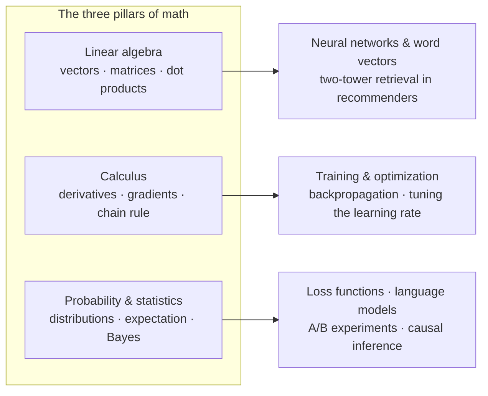

# Chapter 2: Math Foundations 📐

> 🌐 English edition (pilot). [中文完整版](../../../../docs/1-起步准备/02-数学基础/README.md)

> This chapter is not a math textbook — it's a **quick-reference map of "the math AI actually uses"**. Every step of training a model — feeding data in, computing the loss, adjusting parameters, evaluating results — has a mathematician standing behind it: linear algebra, functions, calculus, probability & statistics. After this chapter you won't need to derive theorems; you only need to **keep calm at the sight of symbols, know what each step computes, and know where to look when something errors**.

[⬆️ Back to contents](../../../README.md) · [⬆️ Back to this part](../README.md)

## 🗺️ This chapter's knowledge tree

Three mathematical tributaries, each flowing into different later chapters — this graph is the "hidden math thread" running through the whole book:

- **Linear algebra**: how data is represented, how similarity is computed, how transformations are batched — every layer of a neural network is a matrix multiplication;
- **Calculus**: which direction to nudge a parameter, and by how much — the core action of training is descending against the gradient;
- **Probability & statistics**: how to measure "likelihood" and "confidence" — loss functions, language models, and experiment evaluation all come from here.

## 🔬 Math → models: where each tool lands, formula included

This table is the chapter's ledger. The right-hand columns aren't vague "you'll need this in some chapter" talk — they show **the exact line of a real model's formula where the math tool lands**. You don't need to understand it now; just get familiar with the faces. When you later bump into a recognizable symbol in a later chapter, come back here and match it up.

| Math tool | Its line | Where it lands in a model | Landing pages |
|----------|-----------|------------------|----------|
| Dot product | $s(q,k) = q\cdot k / \sqrt{d}$ | Attention: scoring "which word should look at which"; two-tower retrieval: scoring "user × item" | [Transformer & attention](../../../../docs/4-专业方向/07-自然语言处理与LLM/02-Transformer与注意力机制.md) (中文), [Two-tower models & vector retrieval](../../../../docs/4-专业方向/08-推荐系统/03-双塔模型与向量召回.md) (中文) |
| Matrix multiplication | $h = Wx + b$ | Every layer of a neural network: a batch of inputs times a weight matrix, plus a bias | [How neural networks are made](../../../../docs/3-深度学习/04-深度学习基础/01-神经网络是怎么炼成的.md) (中文) |
| Derivatives & the chain rule | $\frac{\partial L}{\partial w} = \frac{\partial L}{\partial h}\cdot\frac{\partial h}{\partial w}$ | Backpropagation: the slope of the loss w.r.t. hundreds of millions of parameters, layer by layer | [The complete model-training workflow](../../../../docs/3-深度学习/04-深度学习基础/02-训练一个模型的完整流程.md) (中文) |
| Gradient | $w \leftarrow w - \eta\,\nabla L$ | The line where the optimizer updates parameters (the heart of all training code) | [Calculus & gradients](../../../../docs/1-起步准备/02-数学基础/03-微积分与梯度.md) (中文) |
| Projection & least squares | $\hat{w} = (X^TX)^{-1}X^Ty$ | The closed-form solution of linear regression: projecting the answer onto the space spanned by the features | [Linear regression](../../../../docs/2-经典机器学习/03-机器学习/02-线性回归.md) (中文) |
| Eigenvalues / SVD | $A = U\Sigma V^T$ | PCA finds the "principal directions" for dimensionality reduction; matrix factorization completes the rating matrix | [Clustering & dimensionality reduction](../../../../docs/2-经典机器学习/03-机器学习/06-聚类与降维.md) (中文), [Collaborative filtering & matrix factorization](../../../../docs/4-专业方向/08-推荐系统/02-协同过滤与矩阵分解.md) (中文) |
| Norms | $\lVert x\rVert_2 = \sqrt{\textstyle\sum_i x_i^2}$ | kNN distances, weight decay shrinking parameters, embedding normalization | [Model evaluation & tuning](../../../../docs/2-经典机器学习/03-机器学习/07-模型评估与调优.md) (中文) |
| softmax & conditional probability | $P(w_t \mid w_{<t})$ | Language models: given the context, output "a distribution over the next word", then sample | [LLM panorama](../../../../docs/4-专业方向/07-自然语言处理与LLM/04-大语言模型LLM全景.md) (中文) |
| Cross-entropy | $L = -\sum_i y_i \log \hat{p}_i$ | The loss function of classification and language models (derived from maximum likelihood) | [Probability & statistics](../../../../docs/1-起步准备/02-数学基础/04-概率与统计.md) (中文), [Logistic regression & classification](../../../../docs/2-经典机器学习/03-机器学习/03-逻辑回归与分类.md) (中文) |
| Bayes | $P(A\mid B) \propto P(B\mid A)\,P(A)$ | Spam filtering; in causal inference, "re-weighing after controlling for confounders" | [Causal inference toolbox](../../../../docs/4-专业方向/11-因果推断/02-因果推断方法工具箱.md) (中文) |
| Hypothesis testing | $\text{p-value} = P(\text{a difference at least this large}\mid\text{no real difference})$ | A/B experiments: deciding whether "+0.2% is real" | [Model evaluation & tuning](../../../../docs/2-经典机器学习/03-机器学习/07-模型评估与调优.md) (中文) |

Three ways to use it:

- **Forward**: the sections of this chapter break each row down to nothing but +, −, ×, ÷ — it's normal if the formulas don't fully click yet;
- **Backward**: later, when a step of some model confuses you, look up here which branch of math it uses, then go back to that section to patch up;
- **Composed**: generative models (e.g. diffusion's "add noise, then denoise") use no new math either — just compositions of these same tools: Gaussian distributions + gradients + matrix operations stacked layer upon layer.

## 📏 The "good enough" three-level strategy

Learning math for AI is not a math degree — first decide which level you're training for:

| Level | Signature ability | Covered here? |
|------|-----------|----------|
| ① Aware | Seeing a formula, you know what each symbol is and what the step computes — no panic | ✅ Primary focus |
| ② Able | You can turn a business goal into a loss, modify code, and read errors to locate problems | ✅ Primary focus |
| ③ Fluent | You can derive formulas, prove properties, and invent new methods | ❌ Out of scope for this book |

This repo targets the first two levels: **first connect "aware" and "able"; leave the third for later, on demand.**

## 📖 Recommended reading order

| Order | Page | Difficulty | In one sentence |
|------|------|------|-----------|
| 1 | [Why learn math](../../../../docs/1-起步准备/02-数学基础/01-为什么要学数学.md) (中文) | ⭐ | Follow one model training run and see which math each step uses |
| 2 | [Linear algebra](../../../../docs/1-起步准备/02-数学基础/02-线性代数.md) (中文) | ⭐⭐ | Vectors, dot products, matrix multiplication — the common currency of the AI world |
| 3 | [Calculus & gradients](../../../../docs/1-起步准备/02-数学基础/03-微积分与梯度.md) (中文) | ⭐⭐ | A derivative is a sensitivity; training is descending against the gradient |
| 4 | [Probability & statistics](../../../../docs/1-起步准备/02-数学基础/04-概率与统计.md) (中文) | ⭐⭐ | Update beliefs from evidence; make decisions under uncertainty |
| Finale | [Production Notes](../../../../docs/1-起步准备/02-数学基础/99-生产实战.md) (中文) | ⭐⭐ | How much math the job actually uses: the spectrum, the scenarios, the tools |

> Don't grind through line by line on the first pass: skim to build the "know where to look it up" impression; later chapters tell you to **come back when a concept is actually used** — that in itself is the most efficient way to learn this math.

## 🎯 After this chapter you should be able to

- See symbols like Σ, ∂, ∇ without a racing heart, knowing what each is saying;
- Have computed, with your own hands, one dot product, two steps of gradient descent, and one Bayesian update (all just arithmetic);
- Name which branch of math backs each of the four stages of "training a model", and point at the table above to name the formula line where each tool lands;
- Judge, against the closing page's role spectrum, how deep your target direction really needs the math to go.

## 🔗 Relation to other chapters

- **Prerequisite**: [Chapter 1: Environment & Tools](../01-environment-tools/README.md) — with a working environment, you can verify every example in this chapter yourself;
- **Upcoming**: [Chapter 3: Machine Learning](../../../../docs/2-经典机器学习/03-机器学习/README.md) (中文) — from there on, math symbols take the stage in force, and you'll keep coming back to this chapter.

---

[⬅️ Previous: Chapter 1: Environment & Tools](../01-environment-tools/README.md) · [Back to contents](../../../README.md) · [Next: Chapter 3: Machine Learning ➡️](../../../../docs/2-经典机器学习/03-机器学习/README.md) (中文)
