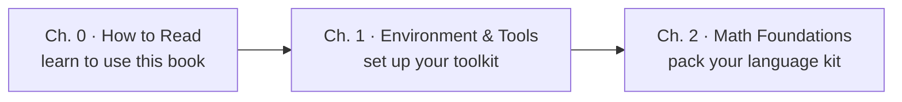

# Part 1 · Getting Started 🧭

> 🌐 English edition (pilot). [中文完整版](../../../docs/1-起步准备/README.md)

> **A workman must first sharpen his tools.** This part takes care of three things before the real work begins: learning to read this knowledge base (Chapter 0), setting up your toolkit (Chapter 1), and packing your math language kit (Chapter 2). They are the gateway to every part that follows.

[⬆️ Back to contents](../../README.md)

## 📑 Chapters in this part

| Chapter | Title | In one sentence |
|----|------|-----------|
| 0 | 🗺️ [How to Read This Book](./00-how-to-read/README.md) | How to use this knowledge base: page structure, reading methods, common questions |
| 1 | 🛠️ [Environment & Tools](./01-environment-tools/README.md) | Python environments, Jupyter, handy datasets, and toolchains |
| 2 | 📐 [Math Foundations](./02-math/README.md) | Linear algebra / calculus / probability & statistics — only the parts AI actually uses |

> 📌 After each chapter's main text, you'll also find **advanced special-topic pages** (see each chapter overview's reading-order table) and a "99-production-notes" closing page.

## 🧭 How this part fits together

- Read **Chapter 0** first — ten minutes to learn how this repo is organized and how to read it;
- **Chapter 1** is consult-as-needed — set the environment up once, then come back whenever you need it;
- **Chapter 2** doesn't need to be finished: on the first pass, just build a "know where to look it up" impression; later parts tell you to **come back when a concept is actually used**.

## 🔗 Where this part sits in the book

- **Upstream**: none — this is the starting point.
- **Downstream**: [Part 2 · Classical Machine Learning](../../../docs/2-经典机器学习/README.md) (中文) — with the gear packed, you formally enter the world of models.

---

[⬆️ Back to contents](../../README.md)
