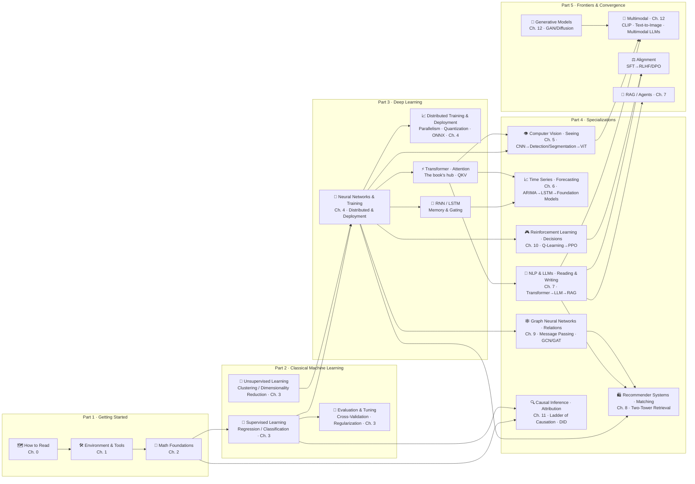

# 🌳 Knowledge Tree — Master Navigation

> 🌐 English edition (pilot). [中文完整版](../../docs/知识树.md)

See the whole book on one page: start with the panoramic graph, then expand each chapter's page list and jump straight to any page.
[⬆️ Back to contents](../README.md) · [🗺️ Reading routes](../ROADMAP.md) · [🤝 Contributing guide](../../CONTRIBUTING.md) (中文)

> 🚧 **Translation status**: only Part 1 (Getting Started) has been translated so far. Chapters still in translation are marked below and link to the [Chinese main edition](../../docs/知识树.md) (中文).

---

## The whole book at a glance

Arrow direction = dependency direction (downstream builds on upstream); **Part 4's seven tracks are roughly parallel — pick what you need** — although the vision frontier (ViT), modern time series, and parts of recommenders and graphs rely on Chapter 7's Transformer (each page states its exact prerequisites at the top); **Transformer and vector representations (embeddings) are the two hubs** (in the diagram, RNN/Transformer are drawn as general mechanisms in the foundation layer; their detailed pages live in Chapters 6/7).

---

## Chapter-by-chapter navigation (click to expand page lists)

### Part 1 · Getting Started — learn to read this book · set up tools · pack your math kit

<b>🗺️ Chapter 0 · How to Read This Book</b> ⭐ — how to use this knowledge base

How the seven-step page structure works, three reading routes, study methods, and an FAQ.

| Page | Difficulty | Type |
|------|------|------|
| [Chapter overview](./1-getting-started/00-how-to-read/README.md) | ⭐ | Overview |

<b>🛠️ Chapter 1 · Environment & Tools</b> ⭐ — Python environments, datasets, and toolchains

Three environment options, a list of handy datasets, and the Git/experiment-tracking toolchain — consult as needed.

| Page | Difficulty | Type |
|------|------|------|
| [Chapter overview](./1-getting-started/01-environment-tools/README.md) | ⭐ | Overview |
| [Setting up the dev environment](./1-getting-started/01-environment-tools/01-setup.md) | ⭐ | Core |
| [Datasets & toolchains](../../docs/1-起步准备/01-环境与工具/02-数据集与工具链.md) (中文) | ⭐ | Core |
| [Production Notes: engineering day-to-day in a real team](../../docs/1-起步准备/01-环境与工具/99-生产实战.md) (中文) | ⭐⭐ | Finale |

<b>📐 Chapter 2 · Math Foundations</b> ⭐⭐ — linear algebra / calculus / probability, the "enough for AI" version

Only the math AI actually uses — build a "know where to look it up" impression now, come back later when needed.

| Page | Difficulty | Type |
|------|------|------|
| [Chapter overview](./1-getting-started/02-math/README.md) | ⭐ | Overview |
| [Why learn math](../../docs/1-起步准备/02-数学基础/01-为什么要学数学.md) (中文) | ⭐ | Core |
| [Linear algebra](../../docs/1-起步准备/02-数学基础/02-线性代数.md) (中文) | ⭐⭐ | Core |
| [Calculus & gradients](../../docs/1-起步准备/02-数学基础/03-微积分与梯度.md) (中文) | ⭐⭐ | Core |
| [Probability & statistics](../../docs/1-起步准备/02-数学基础/04-概率与统计.md) (中文) | ⭐⭐ | Core |
| [Production Notes: how much math the job actually uses](../../docs/1-起步准备/02-数学基础/99-生产实战.md) (中文) | ⭐⭐ | Finale |

### Part 2 · Classical Machine Learning — the data → model → evaluation worldview

<b>🤖 Chapter 3 · Machine Learning</b> ⭐⭐ — regression, classification, clustering, ensembles, tuning

Covers discriminative vs. generative, a first look at overfitting, and the complete workflow; still the workhorse for tabular data. Prerequisite: Chapter 2.

🚧 Translation in progress — read the [Chinese original](../../docs/2-经典机器学习/03-机器学习/README.md) (中文).

### Part 3 · Deep Learning — neural network foundations · training · inference & deployment

<b>🧠 Chapter 4 · Deep Learning Basics</b> ⭐⭐⭐ — principles, training, PyTorch, distributed, deployment

From neural-network principles to a PyTorch training template, up to model-scale tiers, distributed training, and inference/deployment. Prerequisite: Chapter 3.

🚧 Translation in progress — read the [Chinese original](../../docs/3-深度学习/04-深度学习基础/README.md) (中文).

### Part 4 · Specializations — seven tracks, seven abilities: seeing · forecasting · reading & writing · matching · relations · decisions · attribution

<b>👁️ Chapter 5 · Computer Vision (Seeing)</b> ⭐⭐⭐ — CNN, detection & segmentation, ViT

Making machines understand images: convolution intuition, the three major tasks, vision Transformers. Prerequisite: Chapter 4.

🚧 Translation in progress — read the [Chinese original](../../docs/4-专业方向/05-计算机视觉/README.md) (中文).

<b>📈 Chapter 6 · Time Series (Forecasting)</b> ⭐⭐⭐ — ARIMA, LSTM, modern forecasters

Making machines predict the future: statistical methods → recurrent networks → attention and foundation models. Prerequisite: Chapter 4.

🚧 Translation in progress — read the [Chinese original](../../docs/4-专业方向/06-时间序列/README.md) (中文).

<b>💬 Chapter 7 · NLP & Large Language Models (Reading & Writing)</b> ⭐⭐⭐⭐ — today's main line

Word vectors → Transformer → architecture details → LLM panorama → fine-tuning & alignment → RAG and Agents. Prerequisite: Chapter 4.

🚧 Translation in progress — read the [Chinese original](../../docs/4-专业方向/07-自然语言处理与LLM/README.md) (中文).

<b>🛍️ Chapter 8 · Recommender Systems (Matching)</b> ⭐⭐⭐ — collaborative filtering, two-tower retrieval, ranking

The industrial home of vector retrieval: from "birds of a feather" to retrieving millions of items in milliseconds. Prerequisites: Chapters 4, 7.

🚧 Translation in progress — read the [Chinese original](../../docs/4-专业方向/08-推荐系统/README.md) (中文).

<b>🕸️ Chapter 9 · Graph Neural Networks (Relations)</b> ⭐⭐⭐ — message passing, GCN/GAT

Making machines understand "connections": social networks, molecules, fraud rings. Prerequisite: Chapter 4.

🚧 Translation in progress — read the [Chinese original](../../docs/4-专业方向/09-图神经网络/README.md) (中文).

<b>🎮 Chapter 10 · Reinforcement Learning (Decisions)</b> ⭐⭐⭐ — Q-Learning, DQN, PPO

Learning to act through trial and error — also the foundation of RLHF. Prerequisite: Chapter 4.

🚧 Translation in progress — read the [Chinese original](../../docs/4-专业方向/10-强化学习/README.md) (中文).

<b>🔍 Chapter 11 · Causal Inference (Attribution)</b> ⭐⭐⭐ — ladder of causation, DID, causal discovery

Telling "correlation" apart from "because": experimental design and observational rescue methods. Prerequisites: Chapters 2, 3.

🚧 Translation in progress — read the [Chinese original](../../docs/4-专业方向/11-因果推断/README.md) (中文).

### Part 5 · Frontiers & Convergence — creation: generative models and multimodality

<b>🎨 Chapter 12 · Generative Models & Multimodality (Creation)</b> ⭐⭐⭐⭐ — GAN, Diffusion, multimodal

From discriminative to generative: four schools → GAN and Diffusion in depth → multimodal alignment → the frontier technology map (a reservoir for new techniques). Prerequisites: Chapters 4, 5, 7.

🚧 Translation in progress — read the [Chinese original](../../docs/5-前沿与融合/12-生成模型与多模态/README.md) (中文).

---

## Three threads running through the book

After finishing individual chapters, revisiting along these three threads strings the beads into a chain:

1. **The vector thread (everything can be an embedding)**: [dot products in linear algebra](../../docs/1-起步准备/02-数学基础/02-线性代数.md) (中文) → [word vectors](../../docs/4-专业方向/07-自然语言处理与LLM/01-词向量与embedding.md) (中文) → [two-tower retrieval](../../docs/4-专业方向/08-推荐系统/03-双塔模型与向量召回.md) (中文) → [RAG retrieval](../../docs/4-专业方向/07-自然语言处理与LLM/06-RAG与Agent.md) (中文) → [CLIP multimodal alignment](../../docs/5-前沿与融合/12-生成模型与多模态/04-多模态模型.md) (中文)
2. **The attention thread (the hub of modern AI)**: [the attention mechanism](../../docs/4-专业方向/07-自然语言处理与LLM/02-Transformer与注意力机制.md) (中文) → [architecture details & variants](../../docs/4-专业方向/07-自然语言处理与LLM/03-Transformer架构细节与变体.md) (中文) → [ViT enters vision](../../docs/4-专业方向/05-计算机视觉/03-ViT视觉Transformer.md) (中文) → [attention in time series](../../docs/4-专业方向/06-时间序列/03-现代时间序列模型.md) (中文) → [GAT graph attention](../../docs/4-专业方向/09-图神经网络/02-GNN核心模型.md) (中文)
3. **The production thread (from principles to deployment)**: the [99-production-notes](../../docs/1-起步准备/01-环境与工具/99-生产实战.md) (中文) series closing every chapter: a real project's data / compute / algorithm choices from 0→1, the toolchain, and a pitfall log

---

## Playground (clone the repo to play locally)

The five interactive experiments under [`playground/`](../../playground/index.html) are **locally-run HTML** — GitHub web pages will only show their source code. Clone the repo and double-click to play: no dependencies, no build step (entry page: `../../playground/index.html`):

| Experiment | Related chapters |
|------|----------|
| 🔥 Gradient Descent Lab | Ch. 2 calculus / Ch. 4 training |
| 👀 Attention Heatmap | Ch. 7 Transformer |
| 🔬 Sliding Convolution Kernel | Ch. 5 CNN |
| 🌀 Diffusion Denoising Lab | Ch. 12 Diffusion |
| 🌀 Interactive Knowledge Tree | whole-book overview |

---

[⬆️ Back to contents](../README.md)
