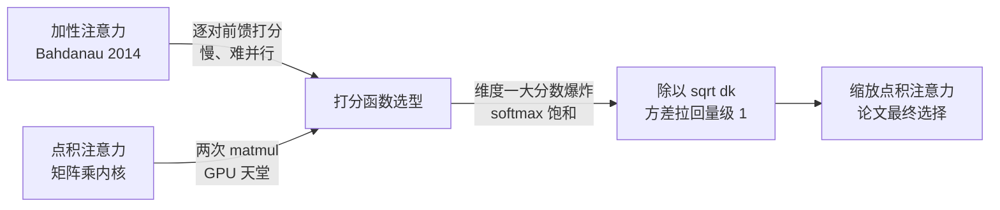
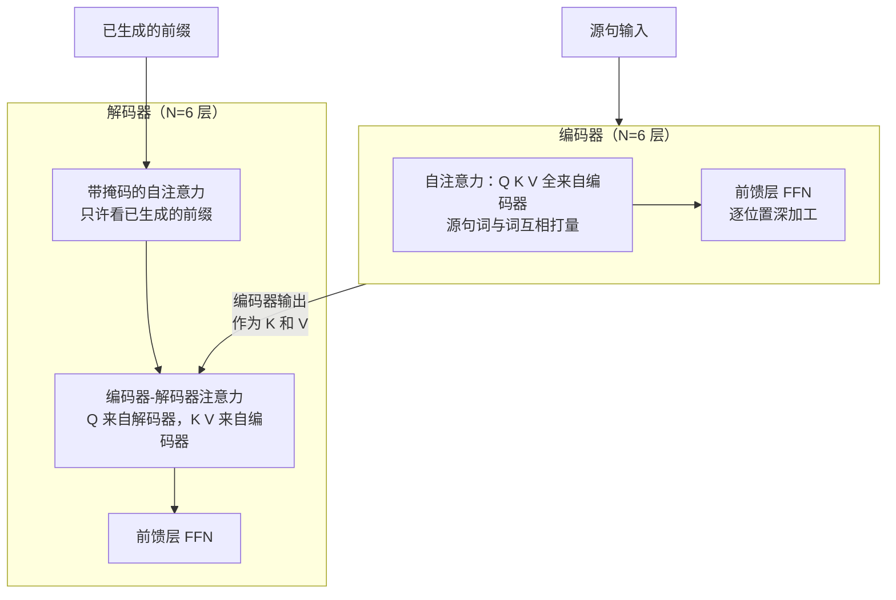
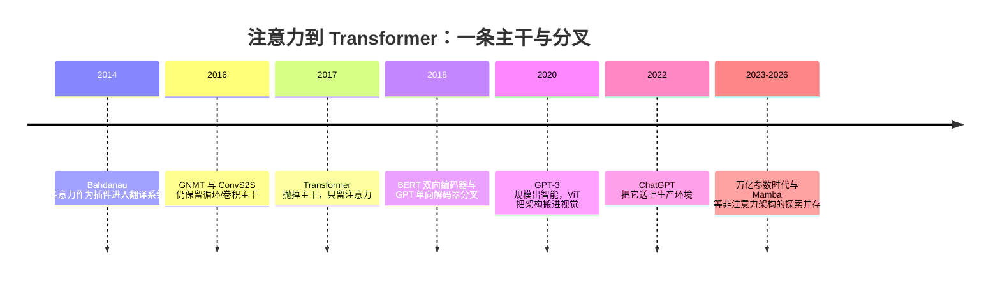

# 📜 精读 01 · Attention Is All You Need——递归的退场，并行的登基

> **一句话理解**：2017 年，Google 的八位作者用一篇标题挑衅的论文证明——处理序列，"每个词直接看所有词"（注意力）可以**完全取代**"一个词等一个词"（递归）；训练从此全面并行，现代 AI 的架构基座就此落成。

[⬆️ 返回总目录](../README.md) · [⬅️ 返回论文专栏](./README.md)

**本页路线图**：核心思想（递归为何可以删）→ 五个机制（注意力选型 / 位置编码 / 三种用法 / 复杂度表 / 训练配方）→ 实验解读（28.4 BLEU 证明了什么、没证明什么）→ 后世影响与争议 → 与本库正文的对接。与[主页](../docs/4-专业方向/07-自然语言处理与LLM/02-Transformer与注意力机制.md)的分工：那边讲"怎么算"，这边讲"论文为什么这么选"。

---

## 📌 论文速览

| 项 | 内容 |
|------|------|
| 标题 | Attention Is All You Need（《注意力就是你所需要的一切》） |
| 作者与机构 | Ashish Vaswani, Noam Shazeer, Niki Parmar, Jakob Uszkoreit, Llion Jones, Aidan N. Gomez, Łukasz Kaiser, Illia Polosukhin——Google Brain / Google Research（其中一位作者当时在多伦多大学） |
| 年份与出处 | 2017 年 6 月提交 arXiv（[1706.03762](https://arxiv.org/abs/1706.03762)），发表于 NeurIPS 2017 |
| 解决什么 | 循环网络（RNN/LSTM）处理序列时的串行瓶颈：无法并行训练、长距离信息传递路径长、堆不大堆不深 |
| 关键数字 | 英→德 28.4 BLEU（big，超过此前所有系统）；base 训练成本 $3.3\times10^{18}$ FLOPs，约为 GNMT 集成的 1/50 |
| 一句话地位 | Transformer 开山之作；BERT、GPT、ViT 乃至今天几乎所有大模型的共同架构祖先 |

---

## 🌱 一句话核心思想

**递归不是序列建模的必需品——两两配对的注意力才是。**

先把历史摆正：注意力**不是**这篇论文发明的。2014 年 Bahdanau 等人已经把注意力作为"插件"装进编码器-解码器翻译系统，让解码器每一步回看源句；到 2016、2017 年，GNMT、ConvS2S 等系统里注意力已是常客。但所有这些系统都保留着一个"主干"——要么循环，要么卷积——注意力只是主干上的附属品。本文的激进之处在标题本身：**把主干扔掉，只留注意力**。整个编码器、解码器里再无任何递归或卷积结构，只剩注意力层与前馈层的堆叠。

为什么敢扔？论文第 3.1 节给了一个干净的计算账（本页"机制三"逐格推导）：自注意力的**顺序操作数（Sequential Operations）是 O(1)**——序列里任意两个词的比较彼此独立，可以全部塞进 GPU 一次算完；而循环网络必须一步一步来，第 100 个词等前 99 个。更妙的是**任意两位置间的最大路径长度（Maximum Path Length）也是 O(1)**——第 1 个词和第 1000 个词之间只隔一次注意力，梯度不必穿越千层传话游戏。GPU 时代，"用平方级计算量换全并行 + 短路径"是一笔大赚的交易。

结果：WMT14 英德翻译 28.4 BLEU（超过此前所有已发表系统，包括集成模型），训练成本只有对手的几分之一；而这套架构与翻译无关的"骨架"——注意力 + 前馈 + 残差 + 归一化——后来被证明换掉任务就能长成 BERT、GPT 和视觉 Transformer。**论文解决的是翻译，顺手解决的是整个深度学习的架构问题。**

## 📋 举个例子：一句话在两种流水线上的命运

拿 5 个词的句子 ["猫", "追", "球", "滚", "了"]，各画一条**计算依赖线**（谁能同时算、谁必须排队）：

```text
循环网络（串行）                    自注意力（并行）
h1 = f(词1)                        所有 q·k 打分：25 个词对（含自己看自己）同时进行
  ↓ 等 h1                          所有 softmax 行：同时进行
h2 = f(h1, 词2)                    输出混合 AV：一次大矩阵乘
  ↓ 等 h2                          ──────────────────────
h3 = f(h2, 词3)                    一步之内，5 个词的新表示全部产出
  ↓ 等 h3
h4 = f(h3, 词4)
  ↓ 等 h4
h5 = f(h4, 词5)
```

数一下"必须排队的轮次"：左边 5 轮（词 5 还得等前 4 个），右边 1 轮（所有词对两两独立）。句子从 5 词变 50 词，左边排队 50 轮，右边仍是一轮大矩阵乘（矩阵大了 10 倍，但 GPU 吃矩阵乘恰好吃到满载）。这就是"复杂度表第三列（顺序操作 $O(1)$）"落到工程上的样子：**不是算得更少，而是算得同时**。反向传播同理：梯度的回传路径 RNN 要沿时间步走 $n$ 趟，注意力一步直连。

> 👉 **人话**：RNN 像流水线作坊（前一件不完工，后一件不能开工），Transformer 像大厅里所有人同时两两握手。握手次数确实多了（$n^2$ 次），但握手同时进行——只要大厅（GPU）够大，"同时"完胜"排队"。


---

## 🧠 方法精读

### 前史对照：注意力从"插件"到"主干"

理解本文贡献的最快方式，是把它放回 2014~2017 的系统对照表里——每一代都在问同一个问题："序列的主干用什么？"

| 系统（年份） | 序列主干 | 注意力的角色 | 训练能否全并行 |
|--------------|----------|--------------|----------------|
| Bahdanau 等（2014） | 双向 RNN 编码器 + RNN 解码器 | 解码器每步回看源句的**附加装置** | 否（主干串行） |
| GNMT（2016，Google） | 深 LSTM 堆叠 | 同上，多堆几层 | 否 |
| ConvS2S（2017，Facebook） | 卷积编码器-解码器 | 辅助模块 | 部分（卷积可并行，但层数受感受野牵制） |
| **本文 Transformer（2017）** | **无（注意力即主干）** | 唯一的序列混合机制 | **是**（顺序操作 O(1)） |

> 👉 **人话**：前几代都是"主干扛序列、注意力打补丁"；本文把主干的活全部交给注意力——头一次，**整个编码器/解码器里没有任何一步计算依赖"上一步的输出"**。GPU 是并行机器，喂给它串行任务就是浪费；这篇论文是第一篇"从硬件的视角重新设计架构"的代表作。

本书的[Transformer 主页](../docs/4-专业方向/07-自然语言处理与LLM/02-Transformer与注意力机制.md)已经把缩放点积注意力的矩阵推导完整走过一遍（含逐形状算例）。本页换成**论文原文的视角**：论文怎么写公式、怎么论证取舍、怎么训出来——五个点：注意力形式的选择、位置编码、多头的三种用法、复杂度表、训练配方。两页互为对照，不重复展开。

### 记号翻译：论文 → 本书

| 论文记号 | 含义 | 本书记号 | 备注 |
|----------|------|----------|------|
| $n$ | 序列长度 | $n$ | 一致 |
| $d_{\text{model}}$ | 模型/词向量维度 | $d$ | 本书用单字母 $d$ |
| $d_k, d_v$ | 每个头的 Query/Key 与 Value 维度 | 统一并入 $d_k$ | 论文里 $d_k = d_v = 64$；本书讲解时合并以免记号爆炸 |
| $h$ | 头数 | $h$ | 一致 |
| $d_{ff}$ | 前馈层中间维度 | FFN 中间维度 | base 为 2048 = 4·$d_{\text{model}}$，论文原文的默认配比 |
| $W^Q, W^K, W^V, W^O$ | 四个投影矩阵 | 同名 | 完全一致（本书直接沿用论文记号） |
| $\mathrm{PE}_{(pos, 2i)}$ | 位置编码 | 位置向量 | 本书只讲"加一个位置向量"的直觉，正弦公式在[主页](../docs/4-专业方向/07-自然语言处理与LLM/02-Transformer与注意力机制.md) |
| $lrate$ | 学习率（调度函数） | $\eta$ / lr | 见"机制四" |

> 👉 **人话**：这本书的 Transformer 记号本来就是从这篇论文继承的，翻译工作量很小——真正的差异在**视角**：主页从"读懂架构"出发，本页从"论文为什么这么选"出发。

### 机制一：注意力形式的选择——为什么是"缩放点积"而不是别的

论文 3.2.1 节开门见山比较两类注意力：**加性注意力（Additive Attention）**（Bahdanau 2014：用一个前馈网络算兼容度）与**点积注意力（Dot-Product Attention）**。结论只有一句但分量十足：两者理论复杂度相近，**点积在实践中快得多、省内存得多**——因为点积就是两次矩阵乘法，高度优化的 GPU 矩阵乘内核直接可用；加性注意力的逐对前馈计算没有这等待遇。

选了点积，才引出那个著名的除法：

$$
\text{Attention}(Q, K, V) = \text{softmax}\!\left(\frac{QK^{\top}}{\sqrt{d_k}}\right)V
$$

> 👉 **人话**：所有 Query 与所有 Key 两两点积打分，除以 $\sqrt{d_k}$ 防止分数随维度爆炸，softmax 变成百分比，再按百分比加权混合 Value——每个位置得到一份"按需调配"的新表示。

论文对 $\sqrt{d_k}$ 的论证（原 3.2.1 节脚注推理，本书[主页](../docs/4-专业方向/07-自然语言处理与LLM/02-Transformer与注意力机制.md)已完整推导方差为 $d_k$）给的是一句话版本：$d_k$ 大时点积方差大，softmax 会过早饱和进 one-hot、梯度消失，所以除以 $\sqrt{d_k}$ 把方差拉回量级 1。**$d_k = 64$ 时不缩放与加性注意力打平，缩放后显著更好**——论文原文承认这是经验事实，理论解释（方差推导）是"事后合理化"的一部分，这也是读论文的好教材：先有 work 的实验，再有讲得通的数学。



### 机制二：位置编码——注意力天生"脸盲"，必须补课

这是论文 3.5 节的内容，也是读架构图时最容易被略过的一块。先把问题说死：**注意力对输入顺序完全无感**。打分只看 $\mathbf{q}_i^{\top}\mathbf{k}_j$ 的内容，不看 $i,j$ 谁前谁后——把"我打猫"三个词的顺序打乱送进去，每个词拿到的注意力混合结果一模一样（行跟着换位而已）。循环网络靠时间步自带顺序，注意力把这个信息扔了，就得**手工加回去**：论文的做法是给每个位置造一个 $d_{\text{model}}$ 维向量，直接**加**到词向量上（不是拼接），再进第一层：

$$
PE_{(pos,\,2i)} = \sin\!\left(\frac{pos}{10000^{2i/d_{\text{model}}}}\right), \qquad PE_{(pos,\,2i+1)} = \cos\!\left(\frac{pos}{10000^{2i/d_{\text{model}}}}\right)
$$

> 👉 **人话**：每个位置拿到一串"多级时钟"读数——偶数维放 sin、奇数维放 cos，不同维度对以不同速率旋转（维度对 $i$ 的频率是 $10000^{-2i/d}$，波长从 $2\pi$ 一路拉长到约 $10000 \cdot 2\pi \approx 6.3$ 万个位置）。位置 1 和位置 10001 的读数既不相同（短钟面区分开了），又"长得像"（长钟面几乎没动）——一套向量同时编码了绝对位置与远近感。

**为什么选三角函数而不是可学习的位置向量？** 论文给的是**假设**而非证明（原文口径大意）：对固定偏移 $k$，$PE_{pos+k}$ 可以写成 $PE_{pos}$ 的线性函数（旋转矩阵），作者推测这让模型容易学到"相对位置"类的关系；且正弦可以**外推到训练时从没见过的更长序列**（可学习向量表没有第 $n_{\max}+1$ 行）。而消融又显示：换成可学习位置嵌入，开发集 25.7 对正弦的 25.8——**几乎无差别**。所以"正弦更好"不成立，成立的是"正弦不差、还能外推"——这是一个按偏好（还有工程上的省参数）而非实验优势做的选择。

```text
维度对 i：   0        64       128      192     255
波长：     6.28     62.8     628      6 283   ≈62 800（位置数）
           ↑秒针                                    ↑最慢的钟面
位置 0：   sin0=0   sin0=0   sin0=0   ...    sin0=0   ← 每个位置一行"时钟读数"
位置 1：   sin1=0.84 ...
位置 7：   sin7=0.66 ...
```

（波长每 64 个维度放大 10 倍——$10000^{64/256} = 10$；从 6.28 到约 6.3 万，跨四个数量级的"多级时钟"。）

> 👉 **人话**：一个词的最终输入 = 词义（词向量）+ 门牌号（位置编码）。后世的 RoPE（旋转位置编码）把这个"旋转"思路做得更彻底（在注意力内积里直接旋转 Q/K），但"给无序的集合补上顺序"这第一课，是这篇论文教的（延伸见[架构变体页](../docs/4-专业方向/07-自然语言处理与LLM/03-Transformer架构细节与变体.md)）。

### 机制三：多头注意力的三种用法——论文架构图的文字还原

多头公式（与主页一致，此处只摆论文原版形态）：

$$
\text{MultiHead}(Q,K,V) = \text{Concat}(\text{head}_1, \dots, \text{head}_h)\,W^{O}, \qquad \text{head}_i = \text{Attention}(QW_i^{Q},\; KW_i^{K},\; VW_i^{V})
$$

> 👉 **人话**：把 $d_{\text{model}}$ 维向量切成 $h$ 份（base 模型 512 维切 8 份、每头 64 维），每份独立做一遍小注意力，再把 8 份输出拼回来投影——"切分而不是复制"，参数量与算力几乎不变（主页有逐形状账）。

论文真正值得精读的是 3.2.3 节：**同一个多头模块在架构里出现三次，角色完全不同**——这是读原架构图最容易糊掉的地方：



1. **编码器自注意力**：Q、K、V 同源，双向——每个词可以看到全句所有词（BERT 继承的就是这个）；
2. **解码器掩码自注意力**：同源但加**因果掩码（Causal Mask）**——把"未来位置"的打分设为 $-\infty$，softmax 后权重为 0，保证生成第 $t$ 个词时只看前 $t-1$ 个（GPT 继承的就是这个）；
3. **编码器-解码器交叉注意力**：Q 来自解码器上一子层，K、V 来自**编码器最终输出**——这是 Bahdanau 注意力在翻译里的传统角色，也是现代多模态模型（视觉编码器供 K/V、语言解码器出 Q）的直系原型。

一张表把三次用法并排看清（读源码时按这张表对号入座）：

| 用法 | Q 来自 | K、V 来自 | 方向 | 谁继承了这个形态 |
|------|--------|-----------|------|------------------|
| 编码器自注意力 | 编码器 | 编码器 | 双向 | BERT（理解类） |
| 解码器掩码自注意力 | 解码器 | 解码器（只看前缀） | 单向（因果） | GPT（生成类） |
| 编码器-解码器交叉注意力 | 解码器 | **编码器** | 跨序列 | 原始翻译模型、多模态解码器（如图文模型） |


> 👉 **人话**：一个注意力模块 = "拿 Q 去 K 里找相关的、从 V 里取信息"。三次用法只是换 Q/K/V 的供货方：全句供自己（编码器）、只供前缀（解码器掩码）、跨语言供对方（交叉）。

**掩码的小算例**：3 个词的解码，第 2 个词的 Query 打分向量为 $[2.0,\; 1.5,\; 3.0]$，掩码把第 3 位设为 $-\infty$：softmax 输入变成 $[2.0,\; 1.5,\; -\infty]$，指数化后第三项为 $e^{-\infty}=0$，归一化得 $[0.62,\; 0.38,\; 0.00]$——未来彻底零权重，且其余权重自动放大。

### 机制四：复杂度表（论文 Table 1）逐格推导

论文 Table 1 是全文被引用最多的表之一，值得自己推一遍而不是背结论。设序列长 $n$、表示维度 $d$（即 $d_{\text{model}}$）、卷积核宽 $k$、受限注意力窗口 $r$：

| 层类型 | 每层复杂度 | 顺序操作数 | 最大路径长度 | 本格怎么来的 |
|--------|-----------|-----------|-------------|--------------|
| 自注意力 | $O(n^2 \cdot d)$ | $O(1)$ | $O(1)$ | $n^2$ 个词对，每对点积耗 $d$；所有词对互相独立 |
| 循环 | $O(n \cdot d^2)$ | $O(n)$ | $O(n)$ | $n$ 个时间步步步相依，每步一个 $d \times d$ 级矩阵乘 |
| 卷积（不堆叠） | $O(k \cdot n \cdot d^2)$ | $O(1)$ | $O(\log_k n)$ | 感受野每层乘 $k$，$k^L \ge n$ 需 $L = \log_k n$ 层 |
| 受限自注意力 | $O(r \cdot n \cdot d)$ | $O(1)$ | $O(n/r)$ | 每词只看邻域 $r$ 个词 |

> 👉 **人话**：三件事被分开算了——**总算力**（一列）、**能不能并行**（顺序操作数）、**信息要走几跳**（路径长度）。自注意力前两列全优，第三列并列最优；代价全押在第一列的 $n^2$ 上。

**用 $d = 512$ 代三个场景（正常 / 临界 / 极端），亲手感受攻守易形**：

- ✅ **正常（短句，$n = 30$）**：自注意力 $30^2 \times 512 \approx 4.6 \times 10^5$ 次乘法；循环 $30 \times 512^2 \approx 7.9 \times 10^6$——自注意力便宜 **17 倍**，还白送全并行。论文说"当 $n < d$ 时自注意力比循环便宜"，翻译任务平均句长正落在这区间，这就是它选型的底气；
- ⚠️ **临界（$n = d = 512$）**：$n^2 d = n d^2$，两者打平；
- ❌ **极端（长文档，$n = 10^5$）**：自注意力 $10^{10} \times 512 \approx 5 \times 10^{12}$，循环 $10^5 \times 512^2 \approx 2.6 \times 10^{10}$——循环便宜约 **200 倍**（虽然串行），且 $n^2$ 的注意力矩阵（$10^{10}$ 个分数）根本存不下。论文自己在 Table 1 里就列了"受限自注意力"一行并展望它——**长上下文的痛点是论文自知的，不是后人发现的**（后世解法见[架构变体页](../docs/4-专业方向/07-自然语言处理与LLM/03-Transformer架构细节与变体.md)）。

<details>
<summary>🧮 展开看：第三列"最大路径长度"的两格怎么算（卷积的 log_k 与受限注意力的 n/r）</summary>

**卷积为什么是 $O(\log_k n)$。** 一层核宽 $k$ 的卷积，感受野扩大 $k$ 倍；堆 $L$ 层后感受野 $k^L$。要覆盖全长 $n$：

$$
k^L \ge n \;\;\Longrightarrow\;\; L \ge \log_k n
$$

代数：$k = 3$、$n = 10^5$，$\log_3 10^5 = \ln 10^5/\ln 3 \approx 11.51/1.099 \approx 10.5$——需要约 **11 层**，首尾两词的信息才能"见面"。这就是卷积网络越深、远处信息路径越长的账：它没有 $n$ 那么惨，但仍是 $n$ 的对数倍，而自注意力是**常数 1**。

**受限注意力为什么是 $O(n/r)$。** 窗口 $r$ 内一步可达；要传 $n$ 就得跳 $n/r$ 次（每跳前进 $r$）。代数：$r = 256$、$n = 10^5$，路径长约 $10^5/256 \approx 391$ 跳——介于全注意力（1）与循环（$n$）之间。

**这一列为什么重要**：路径长度 ≈ 梯度回传要经过的"传话游戏"跳数——信息论意义上它决定**长依赖学起来的难度**（路径越长、稀释与衰减越多）。Transformer 在"任意两词一步直连"这件事上至今无对手，这是它统治长上下文的底层原因之一；而第一列（总算力）是它永恒的原罪。**记住这个不对称：注意力赢在路径、痛在总量。**

</details>


### 机制五：训练配方——warmup 调度的完整推导

论文第 5.3 节的训练细节里藏着一个此后所有 Transformer 训练都要抄的公式——**Noam 调度器**：

$$
lrate = d_{\text{model}}^{-0.5} \cdot \min\left(step^{-0.5},\; step \cdot warmup^{-1.5}\right), \qquad warmup = 4000
$$

> 👉 **人话**：学习率先随步数**线性升温**（前 4000 步，第二个分支占优），4000 步后按步数**平方根衰减**（第一个分支占优）——开局小步探路，中段火力全开，收尾越来越细。

<details>
<summary>🧮 展开推导：两段曲线在哪相交、峰值是多少（手算可验）</summary>

**第一步：找交点。** 令两分支相等：

$$
step^{-0.5} = step \cdot warmup^{-1.5} \;\;\Longrightarrow\;\; warmup^{1.5} = step^{1.5} \;\;\Longrightarrow\;\; step = warmup
$$

学习率峰值恰在 $step = warmup = 4000$ 处取得。

**第二步：算峰值（base 模型，$d_{\text{model}} = 512$）。**

$$
lrate_{\max} = \frac{1}{\sqrt{512 \times 4000}} = \frac{1}{\sqrt{2\,048\,000}} \approx \frac{1}{1431} \approx 7.0 \times 10^{-4}
$$

> 👉 **人话**：峰值学习率约 $7\times10^{-4}$——base 模型实际跑的数，与今天 Transformer 训练日志里常见的峰值量级同一家族；换成 big 模型（1024 维），同一公式自动给出约 $4.9\times10^{-4}$：**模型越宽、步子越小，$\sqrt{d_{\text{model}}}$ 因子自带按宽度缩放**。

**第三步：验证两段形态（各取一点）。**

- 升温段 $step = 1000$：线性分支 $1000 / 4000^{1.5} = 1000 / 252\,982 \approx 3.95\times10^{-3}$，衰减分支 $1000^{-0.5} = 3.16\times10^{-2}$，取小者 $3.95\times10^{-3}$，乘 $512^{-0.5} \approx 0.0442$ 得 $lrate \approx 1.75\times10^{-4}$——约为峰值的 1/4，**线性**升温（$\propto step$）；
- 衰减段 $step = 100\,000$（base 训练终点）：衰减分支 $100\,000^{-0.5} = 3.16\times10^{-3}$，线性分支 $100\,000/252\,982 = 0.395$，取小者 $3.16\times10^{-3}$，得 $lrate \approx 1.40\times10^{-4}$——约为峰值的 1/5。

**第四步：跨规模迁移的伏笔。** 同一公式换 $d_{\text{model}}$ 即自校准（见上方人话），这是 $\mu$ 参数化（Maximal Update Parametrization）等"超参随规模迁移"理论出现之前的朴素先驱——2017 年的一个 $\sqrt{d}$ 因子，预演了 2020 年代大模型训练最关心的问题（进阶见[大规模训练工程](../docs/3-深度学习/04-深度学习基础/06-进阶专题-大规模训练工程.md)）。

</details>

**为什么要 warmup？论文一个字没解释**——只有一句"线性升温"。事后解释主要两条（本书[训练流程页](../docs/3-深度学习/04-深度学习基础/02-训练一个模型的完整流程.md)的深问二有完整分析）：① 论文用 Adam（$\beta_2 = 0.98$），训练初期二阶矩 $v_t$ 样本太少、估计偏小，步长被动放大，warmup 给统计量留"攒样本"的时间；② 论文用后置归一化（Post-LN），初始几步注意力输出尺度不稳、梯度又大又乱。两条都指向同一动作：**前几千步别迈大步**。

其余训练配方一表收齐（论文 5.3 节 + Table 3 的配置列）：

| 项 | base | big |
|----|------|-----|
| 层数 $N$ / $d_{\text{model}}$ / $d_{ff}$ / 头数 | 6 / 512 / 2048 / 8 | 6 / 1024 / 4096 / 16 |
| 参数量 | 65M | 213M |
| 优化器 | Adam（$\beta_1 = 0.9$，$\beta_2 = 0.98$，$\varepsilon = 10^{-9}$） | 同左 |
| Dropout | 0.1 | 0.3 |
| 训练步数 / 硬件 / 时长 | 100K 步，8 卡 P100，约 12 小时 | 300K 步，8 卡 P100，约 3.5 天 |
| 推理技巧 | 束搜索宽度 4、长度惩罚 $\alpha = 0.6$；**对最后若干个检查点做权重平均**（base 平均最后 5 个，big 平均最后 20 个） | 同左 |

> 👉 **人话**：注意三处"祖传配方"的源头——$\beta_2 = 0.98$ 而非默认 0.999（对机器翻译的梯度统计更稳）、label smoothing $\varepsilon_{ls} = 0.1$（**伤害困惑度但提升 BLEU**，论文原话：模型学得"更不确定"，翻译更准）、checkpoint 平均（一份免费涨点，后世训练几乎必抄）。

> 🔥 **炼丹小灶（经验参考，不是圣旨）**：这份 2017 年的作业里，活到今天训练任何 Transformer 都默认照抄的有四件——warmup（现代配方多为峰值 lr 的前 0.5%~5% 步数）、$\beta_2$ 偏小（0.95~0.98，对早期梯度噪声更稳）、label smoothing 0.1（分类/翻译头通用）、checkpoint 平均（推理免费涨点，代价只是多存几个检查点）；已被替换的有两件——Post-LN 换 Pre-LN 系（深堆叠稳定性）、束搜索在开放生成里常被直接贪心/采样取代（翻译之外的任务不需要束）。抄作业之前知道**哪些还成立**，才算读进去了。

---

## 📊 实验解读

### 证明了什么

**主表（论文 Table 2，WMT14 机器翻译，BLEU 越高越好；训练成本按浮点运算量估计）**：

| 系统 | 英→德 BLEU | 英→法 BLEU | 英→德成本（FLOPs） |
|------|-----------|-----------|-------------------|
| GNMT + RL（单模型） | 24.6 | 39.92 | $2.3 \times 10^{19}$ |
| ConvS2S（单模型） | 25.16 | 40.46 | $9.6 \times 10^{18}$ |
| GNMT + RL（集成） | 26.30 | 41.16 | $1.8 \times 10^{20}$ |
| ConvS2S（集成） | 26.36 | 41.29 | $7.7 \times 10^{19}$ |
| **Transformer（base）** | **27.3** | 38.1 | $3.3 \times 10^{18}$ |
| **Transformer（big）** | **28.4** | 41.8 | $2.3 \times 10^{19}$ |

三条确凿结论：

1. **单模型打过集成**：big 单模型 28.4 BLEU 超过此前所有已发表系统（包括 GNMT、ConvS2S 的集成），英→德领先第二名（ConvS2S 集成 26.36）约 2 BLEU——在当年 BLEU 竞赛里这是断层优势；
2. **成本反着算**：base 用约 $3.3\times10^{18}$ FLOPs（不到 ConvS2S 单模型的四成、GNMT 集成的五十分之一）拿到 27.3，"更快更省更强"三者同时成立——这在对比表里极少见；
3. **英→法 41.8 的口径注意**：摘要与 Table 2 写 41.8，正文 6.1 节某处写 41.0，论文内部小有出入——精读时以表格为准（这也是"读原论文而非二手转述"的价值：转述从不告诉你这些）；
4. **架构不止会翻译**：论文第 6.3 节还做了一个小规模的英语成分句法分析实验（WSJ 语料，4 层 Transformer）且结果有竞争力——这是"架构可迁移"的第一个微弱信号，但规模小、影响有限，真正的泛化证明是次年的 BERT 与 GPT 给出的。

**读 Table 2 的两个坑**：

- **FLOPs ≠ 墙钟时间**：训练成本那两列是论文按公式估的浮点运算量，不是实测时间；论文另给了实测（base 12 小时、big 3.5 天，均在 8 卡 P100 上）。引用成本时别把两者混着说；
- **base 的英→法（38.1）其实低于 GNMT 单模型（39.92）**：小模型并没有全面碾压——"Transformer 又快又强"说的是它同成本下的性价比与 big 模型的上限，不是每个配置都赢。

### 没证明什么

- **只测了机器翻译**。没有语言建模、摘要、问答、任何理解类任务——"这套架构通用"是 BERT/GPT 时代**回填**的结论，不是本文的实验事实；
- **没有证明"注意力就是全部理解"**。标题是修辞：论文证明的是"在 WMT14 上不需要递归/卷积也能到 SOTA"。注意力自身的可解释性，论文只以一句"可能更可解释"轻轻带过——后来的"注意力权重 ≠ 解释"之争（Jain & Wallace, 2019）说明这半句尤其不能当真；
- **长序列问题自知而未解**：$n^2$ 复杂度在 Table 1 里已经亮出来（受限注意力一行），但本文没有任何长序列实验——上下文长度是 2018 年之后才爆发的战场；
- **消融都在小模型 + 验证集上做**（base 模型、newstest2013 开发集），效应量 0.5~1 BLEU 量级；这些结论外推到百倍大的模型（如"头数 8 最好"）未必成立；
- **成本对比的口径要审**：对手（GNMT、ConvS2S）的训练 FLOPs 是论文按各自公开信息折算的，硬件代际与实现优化并不对齐——"便宜几分之一"是量级判断，不是同等条件下的受控实验。

### 关键消融怎么读（论文 Table 3，base 模型，开发集基准 4.92 PPL / 25.8 BLEU）

| 消融项 | 数字 | 怎么读 |
|--------|------|--------|
| 头数 $h$ | 1 头 24.9（−0.9）；4 头 25.5；16 头 25.8；**32 头 25.4（−0.4）** | 多头有真实收益，但**不是越多越好**——32 头时每头只剩 16 维，打分噪音上升。别把"8 头"当圣旨，读成"512/8 = 64 维每头是当时的甜点" |
| 键维度 $d_k$ | $d_k = 16$：25.1；32：25.4（基准 64：25.8） | 缩小 $d_k$（省算力）有代价，注意力容量打不满 |
| Dropout | 0：24.6；0.1：25.8；0.2：25.5 | 论文原话"dropout 对避免过拟合非常有效"——2017 年的最强正则手段 |
| Label smoothing | $\varepsilon = 0$：PPL 4.67 / BLEU 25.3；0.2：PPL 5.47 / BLEU 25.7 | 训练目标（PPL）与评价指标（BLEU）**背离**：平滑伤困惑度但助翻译——单一指标选模型的经典陷阱 |
| 位置编码 | 学到的嵌入 25.7 vs 正弦 25.8 | **几乎无差别**。论文选正弦的理由（可能外推到更长序列）是偏好而非实验结论——后来多数实现直接用可学习/旋转位置编码 |

### 深问两则（读实验时常被问到的）

**问 1：label smoothing 为什么伤困惑度（PPL）却涨 BLEU？**

答：两个指标量的是不同的东西。PPL 量的是**概率校准**——真实下一个词上的概率质量够不够；平滑强行把 $1-\epsilon$ 的质量留在真词上（$\epsilon = 0.1$ 分给全词表），PPL 必然变差。BLEU 量的是**离散决策**——beam search 选出的序列好不好；过度的自信会让束搜索早早锁死在次优翻译上，平滑压掉了这份过度自信，决策反而更稳。教训一句话：**训练目标与评价指标可以合法地背离，选模型前先想清楚你优化的到底是哪个**。

**问 2：消融说"学到的位置嵌入与正弦无差"，后来为什么大家改用可学习/RoPE？**

答：无差别结论有两个隐含限定——base 规模、当年的序列长度（几十词）。可学习嵌入在大模型与长训练里没有明显劣势、实现更简单（一张查表）；RoPE 则把位置信息装进 Q/K 内积，换来了更好的长度外推性质（后世演进，超出本文范围）。消融表的"无差别"只担保它测过的区间——超区间的外推要靠新实验，这是读一切消融表的通用纪律。


> 👉 **人话**：消融表教的事比数字多——① "有没有用"要看**和谁比**（1 头 vs 8 头是 −0.9 BLEU，8 vs 16 只差 0.3）；② 结论都带**模型规模脚注**（base 上做的）；③ 有些项（位置编码）的结论是"无所谓"，这同样有价值——它告诉你可以按工程喜好选。

<details>
<summary>🎓 精读自测（先自己答，再对答案）</summary>

1. **注意力机制是这篇论文发明的吗？** 不是。2014 年 Bahdanau 等已在翻译系统里用它；本文的贡献是**删掉递归/卷积主干、只留注意力**，并证明这样训得更快更好。
2. **多头是"复制 8 份完整注意力"吗？** 不是。512 维切成 8 份、每头 64 维各自做小注意力再拼回——参数与算力几乎不变（详见[主页](../docs/4-专业方向/07-自然语言处理与LLM/02-Transformer与注意力机制.md)的形状账）。
3. **warmup 的两个事后解释是什么？** ① Adam 二阶矩 $v_t$ 初期样本少、估计偏小，步长被动放大；② Post-LN 下初期注意力输出尺度不稳、梯度又大又乱。论文原文只说"线性升温"，未解释原因。
4. **"Self-Attention 复杂度 $O(n^2 d)$、循环 $O(nd^2)$，谁便宜？** 取决于 $n$ 与 $d$ 谁大：$n < d$ 时自注意力便宜（短句常态），$n > d$ 时反转（长文档）。判卷标准是 $n$ 与 $d$ 的相对大小，不是绝对。
5. **正弦位置编码被消融证明更好吗？** 没有。学到嵌入 25.7 vs 正弦 25.8，几乎无差；选正弦是"可能外推到更长序列"的偏好加省参数，不是实验优势。

</details>

### 精读笔记：这篇论文的论证结构值得学

把它当写作与论证的样板拆一拆，是本页的最后一项"方法"：

- **Table 1 是正文第一张表**——复杂度表排在一切实验结果之前。这个安排本身就是论点：本文的主张是"并行性 + 短路径"，证据链从**计算结构**出发，BLEU 只是随后兑现的果。多数架构论文把性能表放最前，本文反着来——值得写论文的人揣摩；
- **承认边界的分寸感**：长序列 $n^2$ 问题、正弦编码"可能外推"的假设属性、base 英→法不如对手——论文都明写。后来被无限转述的"Attention is all you need"其实是**标题的修辞**，正文从未声称注意力万能；
- **附录承担了消融的全部重量**：正文 11 页 + 附录若干页，Table 3 及编码实验都在附录——读 arXiv 论文不翻附录，等于只读了一半。


---

## 🔁 后世影响



- **架构基座地位**：BERT（编码器侧）、GPT 全系（解码器侧）、T5（完整编码器-解码器）、ViT（把图像切块当"词"）、CLIP、Whisper、AlphaFold 2 的 Evoformer……2018 年以来的主流模型几乎都能映射回本文的"注意力 + 前馈 + 残差 + 归一化"乐高。引用量长年位居计算机科学论文最前列（公开引用数据可查，量级按十万计）；
- **被论文"顺带"定下的行业习惯**：warmup 调度、label smoothing、checkpoint 平均、$\beta_2 = 0.98$——今天训练任何 Transformer 都还在抄这份 2017 年的作业；
- **后续修正的三个方向**（都站在它肩上而非推翻它）：① 后置归一化（Post-LN）换前置归一化（Pre-LN）让千层可训（[架构变体页](../docs/4-专业方向/07-自然语言处理与LLM/03-Transformer架构细节与变体.md)）；② $n^2$ 注意力的效率战场——稀疏/线性注意力、FlashAttention 的 IO 感知实现；③ 2023 年后 Mamba 等状态空间模型证明"递归可以卷土重来"（与循环网络不同的是可并行训练），说明标题的"all you need"终归是历史阶段的口号。

---

## 🔗 在本库中的位置

- 主读页：[Transformer 与注意力机制](../docs/4-专业方向/07-自然语言处理与LLM/02-Transformer与注意力机制.md)——缩放点积的完整矩阵推导、$\sqrt{d_k}$ 的方差证明、多头切分的参数账在那一页；本页补论文原文的复杂度表、三种注意力用法与训练配方；
- 进阶：[Transformer 架构细节与变体](../docs/4-专业方向/07-自然语言处理与LLM/03-Transformer架构细节与变体.md)（Pre/Post-LN、长上下文、KV Cache）；
- 同专栏互链：[精读 03 · Adam](./03-Adam.md)——本文训练配方的优化器一侧（$\beta_2$ 与 warmup 的机理在那篇的机制二里推导）；[精读 02 · ResNet](./02-ResNet.md)——本文每个子层都在用的残差连接的出处；
- 工程视角：[大规模训练工程](../docs/3-深度学习/04-深度学习基础/06-进阶专题-大规模训练工程.md)（warmup 与训练稳定性）、[LLM 训练与推理全栈](../docs/4-专业方向/07-自然语言处理与LLM/07-进阶专题-LLM训练与推理全栈.md)；
- 🎮 动手玩：本库[注意力热力图实验](../playground/attention.html)；外部推荐 [Transformer Explainer](https://poloclub.github.io/transformer-explainer/)（浏览器里逐层展开一个真模型）、[The Illustrated Transformer（Jay Alammar 的经典图解）](http://jalammar.github.io/illustrated-transformer/)。

---

## 🎒 读完带走三句话

1. **它的贡献不是发明注意力，而是删掉主干**：注意力早在 2014 年就是翻译系统的常客；本文证明"只留注意力"训练更快（顺序操作 O(1)）、效果更好（28.4 BLEU）——创新常常在减法里；
2. **效率论证与精度论证同样硬**：Table 1 复杂度表放在全文第一位，$n^2 d$ 对 $nd^2$ 的账、任意两位置一步直连的路径账，是这套架构统治 GPU 时代的理论底座；
3. **训练配方与架构同等重要**：warmup、$\beta_2 = 0.98$、label smoothing、checkpoint 平均——这篇论文的"第 5.3 节"被后世抄了快十年；读架构论文，别只看图；
4. **消融表的"无差别"与"有差别"都要读**：位置编码无差（按工程喜好选）、头数太多有差（32 头降 0.4 BLEU）——知道哪里可以躺平，才知道精力该花在哪。

---

[⬅️ 返回专栏目录](./README.md) · [下一页：精读 02 · ResNet ➡️](./02-ResNet.md)

## 📚 延伸阅读

- 原论文：[Attention Is All You Need（arXiv:1706.03762）](https://arxiv.org/abs/1706.03762)——正文 11 页、附录含消融全表，值得读原文；
- 中译与导读：网上流传多个中译本与逐段导读，质量参差——建议只作辅助，关键数字回原文核对（本页 41.8/41.0 的口径问题就是例证）；
- 前史：[Neural Machine Translation by Jointly Learning to Align and Translate（Bahdanau et al., 2014, arXiv:1409.0473）](https://arxiv.org/abs/1409.0473)——注意力插件化的起点；
- 直系后代：[BERT（arXiv:1810.04805）](https://arxiv.org/abs/1810.04805)、[Language Models are Few-Shot Learners（GPT-3, arXiv:2005.14165）](https://arxiv.org/abs/2005.14165)、[ViT（arXiv:2010.11929）](https://arxiv.org/abs/2010.11929)、[T5（arXiv:1910.10683）](https://arxiv.org/abs/1910.10683)（编码器-解码器形态的现代集大成）；
- 冷静剂：[Attention is not Explanation（Jain & Wallace, 2019, arXiv:1902.10186）](https://arxiv.org/abs/1902.10186)——对"注意力权重可解释"这一论文附带宣称的最有力质疑；
- 逐行实现：[The Annotated Transformer（Harvard NLP）](https://nlp.seas.harvard.edu/2018/04/03/attention.html)——论文代码级注解，读完本页再读它最顺；
- 官方代码线索：论文脚注指向的 `tensor2tensor` 库（GitHub 上可查）——第一次"论文与可运行代码同日发布"的示范，也是它扩散如此之快的工程原因之一。
