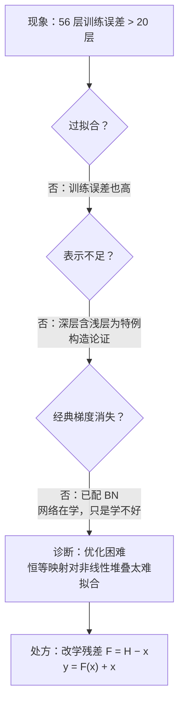
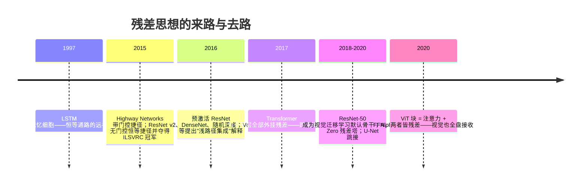

# 📜 精读 02 · Deep Residual Learning——退化问题的发现与"+1"的数学

> **一句话理解**：2015 年，MSRA 的四位作者发现了一个反常事实——网络加深，训练误差**反而升高**；他们用一个"抄近道"的恒等支路修好了它，从此 152 层网络可以训练，残差连接成为一切深层网络的默认零件。

[⬆️ 返回总目录](../README.md) · [⬅️ 返回论文专栏](./README.md)

**本页路线图**：核心思想（退化问题的发现故事）→ 四个机制（梯度推导 / 退化诊断 / 捷径与瓶颈块的工程账 / 从块到 152 层的全貌）→ 实验解读（3.57% 的口径、证明了什么没证明什么）→ 后世影响与争议 → 与本库正文的对接。与[CNN 主页](../docs/4-专业方向/05-计算机视觉/01-CNN卷积神经网络.md)的分工：那边给"+1 高速公路"的直觉，这边给论文视角的完整推导与边界。

---

## 📌 论文速览

| 项 | 内容 |
|------|------|
| 标题 | Deep Residual Learning for Image Recognition（《图像识别的深度残差学习》） |
| 作者与机构 | Kaiming He（何恺明）、Xiangyu Zhang（张祥雨）、Shaoqing Ren（任少卿）、Jian Sun（孙剑）——微软亚洲研究院（MSRA） |
| 年份与出处 | 2015 年 12 月提交 arXiv（[1512.03385](https://arxiv.org/abs/1512.03385)），CVPR 2016 获最佳论文奖 |
| 解决什么 | 网络加深后的**退化问题（Degradation Problem）**：训练误差随深度上升——不是过拟合，是"训不动" |
| 关键数字 | 集成 top-5 错误率 3.57%（ILSVRC 2015 冠军）；单模型 152 层 4.49%（val）；CIFAR 上 1202 层可训 |
| 论文奖项 | CVPR 2016 最佳论文奖 |
| 一句话地位 | 残差连接让百层网络可训；ILSVRC 2015 冠军（top-5 错误率 3.57%）；今天从 CNN 到 Transformer 的每个块里都有它 |

---

## 🌱 一句话核心思想

**如果浅层网络已经够好，加深的最坏结果应该是"不变差"——除非网络被改成学"增量"而不是学"全量"。**

这篇论文最动人的不是公式（公式只有一行），而是第 1 节讲的那个**发现故事**。2015 年的处境是：批归一化（Batch Normalization, BN）刚发明，梯度消失这个经典借口已经被大幅削弱——有了 BN，几十层的"普通网络（Plain Net）"也能开始收敛了。于是何恺明团队做了一件朴素的事：把网络从 20 层加到 56 层，看会不会更好。结果**翻车了**：56 层的训练误差和测试误差都比 20 层高（论文图 1）。这在数学上非常尴尬——存在一个显然的"不动脑解法"：把 56 层网络的前 20 层设为训练好的 20 层网络，**后 36 层全部学成恒等映射**（输入原样传到输出），深网络至少能追平浅网络。退化意味着：这个解在假设空间里躺着，**随机梯度下降（SGD）却找不到它**。

问题的根子在于"学全量"这件事本身。设一层（或一个块）的期望映射是 $\mathcal{H}(x)$，普通网络让这层参数直接去拟合 $\mathcal{H}(x)$。当最优解"接近恒等"时（深层网络的常见情形——大部分层只需微调上一层的输出），逼着几层非线性层去拟合恒等映射，对 SGD 是难事。论文的改写只有一步：**让网络去拟合残差 $\mathcal{F}(x) := \mathcal{H}(x) - x$，再把残差加回来**：

$$
y = \mathcal{F}(x, \{W_i\}) + x
$$

> 👉 **人话**：原来每层要"重写整句话"，现在只需"在原稿上打批注"。要恒等？批注写空白（$\mathcal{F} = 0$）即可——**学零比学恒等容易得多**，因为把权重推小就近似零，而多层非线性精确复现恒等很难。

一个必须先说清的边界：**残差连接不是这篇论文第一个发明的捷径**。LSTM（1997）的记忆细胞、Highway Networks（2015，Srivastava 等，带门控的捷径）都是思想近亲；ResNet 的贡献是**无门控的纯恒等捷径 + 一组说服力极强的实验**（ImageNet、COCO 多项第一、152 层可训）——简单到没有理由不用，所以它成了默认，Highway 网络没有。

**"残差"这个词的来历（顺便记牢数学）**：统计学里"残差（Residual）"指观测值减去模型预测值剩下的部分。这里反过来用：让卷积分支去预测"期望输出减输入"剩下的部分 $\mathcal{F}(x) = \mathcal{H}(x) - x$，故名残差学习。什么时候这个形式最值钱？当 $\mathcal{H}(x)$ 接近恒等（深层常态）时，$\mathcal{F}$ 接近零——**目标函数的"地形"从"精确拟合一个复杂映射"变成"在零附近小修小补"**，损失面更平滑，SGD 更容易走。

**失效边界先挂出来（后面实验会给证据）**：① 浅层（≤20 层）几乎无收益；② 小数据 + 极深 = 过拟合（1202 层之败）；③ 捷径必须"干净"——任何加在捷径上的多余操作都会削弱它（续作证明）。一个机制的三条边界，比它的公式更该背下来。

## 📋 举个例子：一个残差块的前向手算

拿 2 维输入走一遍最小残差块（数字取整，手算可验）。设块内 $\mathcal{F}(x) = W_2\,\mathrm{ReLU}(W_1 x)$（偏置省略）：

$$
x = \begin{bmatrix} 1 \\ 2 \end{bmatrix},\quad
W_1 = \begin{bmatrix} 1 & 0 \\ 0 & 1 \end{bmatrix},\quad
W_2 = \begin{bmatrix} 0 & 0 \\ 0 & -0.1 \end{bmatrix}
$$

- **分支**：$W_1 x = [1, 2]$；$\mathrm{ReLU}$ 不动正数 → $[1, 2]$；$W_2$ 作用后 $\mathcal{F}(x) = [0, -0.2]$；
- **捷径**：恒等直通 $[1, 2]$；
- **输出**：$y = \mathcal{F}(x) + x = [1, 1.8]$。

> 👉 **人话**：这个块"想说的话"只有一点——把第二维往回收 $0.2$，第一维原封不动。**普通网络的层必须复述整句话（输出 $[1, 1.8]$ 全靠自己拟合）；残差网络的层只说增量（$[0, -0.2]$），原句由捷径复述**。增量小说"学零"，增量大说"大改"——表达同一族函数，优化的难度天差地别。

```text
              ┌──→ [ 3×3 conv → BN → ReLU ] ─→ [ 3×3 conv → BN ] ─→ F(x) ─┐
   x ────────┤                                                        (+) ─→ ReLU ─→ y
              └──────────────────── 恒等捷径（identity）──────────────┘
   （维度变化处的捷径换 1×1 卷积投影；50 层以上的块换 1×1→3×3→1×1 瓶颈型）
```


---

## 🧠 方法精读

本书第 5 章[CNN 主页](../docs/4-专业方向/05-计算机视觉/01-CNN卷积神经网络.md)给过残差梯度的"+1 高速公路"直觉；本页给论文视角的完整推导：先推梯度（这是它 work 的数学本体），再推"为什么退化不是过拟合也不是表示不足"（论文的核心论证），最后是捷径与瓶颈块的工程账。

### 记号翻译：论文 → 本书

| 论文记号 | 含义 | 本书记号 | 备注 |
|----------|------|----------|------|
| $\mathcal{H}(x)$ | 若干层期望拟合的底层映射 | "这一层想学到的变换" | 本书主页不显式使用，直接讲直觉 |
| $\mathcal{F}(x, \{W_i\})$ | 残差函数（需要拟合的部分） | $F(x)$（"批注/补丁"） | 本书简化掉参数集合记号 |
| $y = \mathcal{F}(x) + x$ | 残差块输出 | 同式 $y = F(x) + x$ | 一字不差，本书沿用 |
| $W_s$ | 维度不匹配时捷径上的投影（1×1 卷积） | （主页未展开） | 见"机制三" |
| plain net | 无残差连接的普通堆叠网络 | 普通网络 | 论文对照物 |

### 机制一：残差梯度的完整推导——那个"+1"到底是什么

**命题**：对 $y = \mathcal{F}(x) + x$，损失 $\mathcal{L}$ 对输入 $x$ 的梯度为

$$
\frac{\partial \mathcal{L}}{\partial x} = \frac{\partial \mathcal{L}}{\partial y}\cdot\left(\frac{\partial \mathcal{F}}{\partial x} + 1\right)
$$

> 👉 **人话**：梯度分成两条路回来——一条穿过 $\mathcal{F}$ 分支（该分支没学好、梯度为零也不影响），一条**原样直通**（系数恰为 1，不衰减不放大）。梯度回传永远有一条"高速公路"。

<details>
<summary>🧮 展开完整推导：链式法则逐步写 + 连乘 $L$ 块后的形态（不跳步）</summary>

**第 1 步：单块求导。** 设第 $\ell$ 个残差块输入为 $x_\ell$、输出 $x_{\ell+1} = \mathcal{F}_\ell(x_\ell) + x_\ell$。$\mathcal{F}$ 与恒等支路是**并联求和**，链式法则对求和逐项展开：

$$
\frac{\partial \mathcal{L}}{\partial x_\ell} = \frac{\partial \mathcal{L}}{\partial x_{\ell+1}} \cdot \frac{\partial x_{\ell+1}}{\partial x_\ell} = \frac{\partial \mathcal{L}}{\partial x_{\ell+1}} \cdot \left(\frac{\partial \mathcal{F}_\ell}{\partial x_\ell} + \mathbf{I}\right)
$$

（向量情形下 $\mathbf{I}$ 是单位矩阵，标量情形就是 1——这就是"+1"的出处。）

**第 2 步：具体到两层卷积块。** 论文的基本块是 $\mathcal{F}(x) = W_2\,\sigma\big(W_1 x\big)$（$\sigma$ 为 ReLU，偏置省略），则

$$
\frac{\partial \mathcal{F}}{\partial x} = W_2^{\top}\,\mathrm{diag}\big(\sigma'(W_1 x)\big)\,W_1
$$

三项里只要有一项接近零（权重小、或 ReLU 处于死区 $\sigma' = 0$），整个 $\partial\mathcal{F}/\partial x \to 0$——但梯度式里还有 $+\mathbf{I}$ 兜底。**普通网络没有这个兜底**：$\partial x_{\ell+1}/\partial x_\ell = \partial\mathcal{F}/\partial x_\ell$，一项为零，后面所有层的信息全断。

**第 3 步：连乘 $L$ 个块。** 从第 $\ell$ 层回传到第 $L$ 层：

$$
\frac{\partial \mathcal{L}}{\partial x_\ell} = \frac{\partial \mathcal{L}}{\partial x_L} \prod_{i=\ell}^{L-1}\left(\mathbf{I} + \frac{\partial \mathcal{F}_i}{\partial x_i}\right)
$$

普通网络的对应式是连乘 $\prod_i \partial\mathcal{F}_i/\partial x_i$——每块乘子的模可以大于或小于 1，深度一大概率上要么指数衰减（梯度消失）要么爆炸，SGD 需要极精心的初始化与归一化才能维持平衡。

**第 4 步：把乘积展开——梯度里藏着 $2^L$ 条路径。** 以两个块为例：

$$
(\mathbf{I} + A)(\mathbf{I} + B) = \mathbf{I} + A + B + AB
$$

四项恰好对应四条回传路径：全程直通、只走块 1、只走块 2、两块都走。$L$ 个块展开就是 $2^L$ 项、$2^L$ 条路径——这正是后来 Veit 等（2016）"残差网络 behaves like 浅层路径的集成"一文的观察起点（见"后世影响"）。当各 $\mathcal{F}$ 分支较小时，**短路径项（$\mathbf{I}$、单项 $A$、$B$）占主导**，梯度行为近似一个浅网络。

**第 5 步：数值对比（正常 / 极端 / 失败三情况）。** 取每块乘子的标量近似 $f' = \partial\mathcal{F}/\partial x$，深度 $L = 50$：

| 情况 | 每块乘子（普通网） | 50 层连乘 | 每块乘子（残差网） | 50 层连乘 |
|------|------------------|-----------|-------------------|-----------|
| ✅ 正常：分支有效 $f' = 0.9$ | 0.9 | $0.9^{50} \approx 0.005$（衰减 190 倍） | $1+0.9=1.9$ | $1.9^{50} \approx 6\times10^{13}$（放大——须靠 BN/初始化控幅） |
| ⚠️ 极端：分支很小 $f' = 0.1$ | 0.1 | $10^{-50}$（彻底消失） | $1.1$ | $1.1^{50} \approx 117$（可控的温和放大） |
| ❌ 失败：分支死亡 $f' = 0$（死区 ReLU / 未训练） | 0 | $0$（梯度全断） | $1$ | $1$（**无损直通**） |

读表的关键：残差不是"让梯度变大的魔法"，而是**把"乘子可能为 0"改写成"乘子约为 1"**——最坏情况从"断流"变成"原样通过"。放大侧的失控风险（正常行的 $6\times10^{13}$）由 BN 与初始化压制，这就是为什么 ResNet 论文的块内顺序是 conv→BN→ReLU（BN 站在乘法链上控幅）。

**路径计数的直观账（对应第 4 步的展开式）**：$L$ 块的梯度表达式展开后是 $2^L$ 条路径之和——

| 深度 $L$ | 2 | 5 | 20 | 50 |
|----------|---|---|----|----|
| 路径数 $2^L$ | 4 | 32 | 约 100 万 | 约 $10^{15}$ |

其中"直通全程"的路径 1 条、"只绕一个块"的 $L$ 条——**绝大多数路径只穿过极少数块**。当分支都较小时，梯度几乎全部由短路径搬运：一个 50 层的残差网络，优化起来更像"一堆耦合的有效浅网络"而不是"50 层的深网络"。这就是退化消失的另一半直觉，也是"深可训"与"浅路径"两种解释能并存的原因。


</details>

### 机制二：退化问题不是过拟合，也不是表示不足——论文的核心论证

这是全文逻辑最漂亮的一段，值得像读侦探小说一样读。三条证据链：

1. **不是过拟合**：过拟合的特征是训练误差低、测试误差高；而 plain-56 对 plain-20 是**训练误差也高**（论文图 1，CIFAR-10）。模型没有"背题过度"，是"题都没学会"；
2. **不是表示不足**：由"构造论证"——浅层网络是深层网络的特例（深层把多余层设为恒等即可），深网络的最优可达误差**不会高于**浅网络。表示能力只多不少，问题出在**优化器找不到那个解**；

   把构造论证落到数字上更直观：拿训好的 18 层网络装配 34 层——前 18 层照抄权重，剩下 8 个基本块（16 层卷积）全部"学恒等"，34 层的误差就**至多等于** 18 层的。可 SGD 实测找不到这个解（机制二的分析解释了为什么"学恒等"难）。**解存在 ≠ 解可达**，退化问题正是这两个概念之间裂缝的名字；
3. **不是经典梯度消失**：这些 plain 网络全部配了 BN（BN 后前向信号方差稳定），34 层的 plain 网络训练全程**训练误差高于** 18 层（ImageNet 验证：plain-18 top-1 错误率 27.94%，plain-34 为 28.54%——更深更差贯穿训练始终）。梯度能传（网络在学），只是学得不如浅层好。



> 👉 **人话**：论文排除了所有"模型有罪"的嫌疑，最后锁定"训练方式有罪"——让 SGD 去逼近恒等映射是逆水行舟，那就把船掉个头：恒等变成默认值，网络只需学"偏离恒等多远"。

<details>
<summary>🧮 展开分析：为什么普通卷积块几乎学不出精确恒等（本页推演）</summary>

"构造论证"说深层网络**存在**一个追平浅层的解（多余层 = 恒等）。这里从结构上看看，一个普通卷积块（conv → BN → ReLU）想精确实现恒等映射有多难——**难到几乎不可能**：

- **ReLU 砍掉半壁江山**：$\mathrm{ReLU}(x) = \max(0, x)$ 对负输入输出 0。恒等映射要求负数原样通过，而任何"卷积 → ReLU"的串联都把负值削平——除非负方向永远不出现（真实特征图做不到）。数学上，ReLU 复合块能表达的恒等只存在于"输入恒非负"的测度缩小的子空间里；
- **BN 强行改写分布**：批归一化把每通道输出拉回零均值。恒等映射的输出分布等于输入分布——只要输入分布不是零均值（通常不是），BN 之后就不可能等于恒等，除非 γ、β 精确学到"反归一化"回去（等于先压平再复原，多绕两步弯路，优化器得自己发现这条路）；
- **对比残差块**：以上两个障碍都只作用于 $\mathcal{F}$ 分支。捷径这条加法通道**不经过 ReLU 也不经过 BN**，恒等是它的**默认行为**——$\mathcal{F}$ 输出零即可，而"输出零"只需权重偏小（ReLU 的 0 输出天然 plentiful）。

三句话总结：普通块实现恒等 = "过五关"（绕过 ReLU 的削负、BN 的重标定、还要卷积核凑出单位阵）；残差块实现恒等 = "分支闭嘴"。**残差的胜利是参数化的胜利：把希望网络做的事，做成结构里的默认值。**

</details>


**一个读数据时容易漏的细节**：ResNet-18 的 top-1 错误率是 27.88%，plain-18 是 27.94%——**浅层时残差几乎没用**。残差的价值随深度才显现（34 层：24.52% vs 28.54%，差距 4 个点）。这个模式给所有调参者提了个醒：**一个机制的价值要在它针对的痛点场景里量**——你的网络只有三四层，抄 ResNet 配方不会有奇迹。

### 机制三：捷径的工程账——维度不匹配、投影、瓶颈块

**维度不匹配**：当 $\mathcal{F}$ 分支改变了通道数/分辨率（步长 2 下采样），$x$ 与 $\mathcal{F}(x)$ 形状对不上，加不了。论文比较三种方案（ResNet-34，top-1/top-5 验证错误率，10-crop 测试）：

| 方案 | 做法 | 错误率 | 参数 |
|------|------|--------|------|
| A | 零填充（新通道补零），捷径无参数 | 25.03 / 7.76 | 0 |
| B | 捷径上放 1×1 卷积 $W_s$（学习投影） | 24.52 / 7.46 | 少量 |
| C | 所有捷径（含维度相同的）都用投影 | 24.19 / 7.40 | 多 |

结论（论文 4.1 节）：投影**有用但不大**（A→C 累计约 0.8 个点），"恒等捷径已经够好，投影的额外参数与显存不划算"——所以 50/101/152 层配置只在维度变化处用 1×1 投影。**这是一个"为简洁牺牲半分精度"的著名决策**：后来的实现（包括 torchvision 的默认 ResNet）沿用的正是方案 B。

> 读表提示：三行数字的差距不到 1 个点——这个消融的结论不是"哪种最好"，而是"**捷径怎么接都行，恒等最省**"。论文把结论落在方向性判断而非最优解上，这是它经得起时间的原因之一：如果当年钉死"处处投影（C）最优"，今天的默认实现会又贵又复杂。

**瓶颈块（Bottleneck）**：50 层以上把基本块 $3\times3 \to 3\times3$ 换成 $1\times1 \to 3\times3 \to 1\times1$——先降维、再卷积、再升维。为什么？拿 256 通道输入算一笔参数账：

- 直配方案：$3\times3$ 卷积 256→256：$9 \times 256 \times 256 = 589{,}824$ 个参数；
- 瓶颈方案：$1\times1$ 降到 64（$16{,}384$）+ $3\times3$ 卷积 64→64（$36{,}864$）+ $1\times1$ 升回 256（$16{,}384$）= $69{,}632$ 个参数。

$$
\frac{589{,}824}{69{,}632} \approx 8.5
$$

> 👉 **人话**：先用 1×1 卷积把 256 通道"压缩"到 64（信息瓶颈），让昂贵的 3×3 卷积在低维空间里做，再升回去——参数省 8.5 倍，感受野增长照旧。**深度是靠"每块更便宜"买来的**：ResNet-152 的参数量（60M 量级）反而小于 VGG-19（144M 量级），层数却翻了 8 倍。


**训练配方（论文 3.4 节，ImageNet）**：SGD，batch 256，动量 0.9，权重衰减 $10^{-4}$；学习率从 0.1 起，误差平台期除以 10，最多 $6\times10^5$ 次迭代；不用 Dropout；BN 放在卷积后、激活前；数据增强用尺度抖动（短边在 256~480 随机）+ 224×224 裁剪。CIFAR-10 上另有一个细节：batch 128，**学习率先从 0.01 暖身到 0.1** 再按计划衰减——残差网络也要 warmup，只是比 Transformer 温和得多。

> 🔥 **炼丹小灶（经验参考，不是圣旨）**：今天复现或微调 ResNet 系的社区默认与论文配方已有多处不同——学习率随 batch 线性放大（lr 0.1 × batch/256）、阶梯衰减换余弦退火、前 3~5 个 epoch warmup、增强加 RandomResizedCrop/翻转（可选 mixup、cutmix）；自己的数据集微调：先冻结骨干只训分类头，再解冻 stage4 用 1e-4 量级小步。论文配方是 2015 年的最优解，**架构活到了今天，训练配方一直在换血**——分清"论文说的"与"现在做的"，是精读的价值之一。

### 机制四：从块到 152 层——全貌、参数账与"一份骨干，三处冠军"

**堆叠规则**（论文 Table 1 的 50/101/152 层配置）：卷积块按"阶段（Stage）"分组，每个阶段内分辨率不变、块数加倍时通道数翻倍；**降采样发生在每个阶段的第一块**（3×3 卷积步长 2），这正是维度变化、需要 1×1 投影捷径的位置。全网络没有任何全连接巨层——特征图经**全局平均池化（Global Average Pooling）**直接压成一个向量接 softmax 分类头。对比 AlexNet/VGG 尾部动辄上百兆参数的全连接层，这是"参数去哪了"的另一半答案：**全在卷积里，且以深度而非宽度增长**。

拿 ResNet-50 把架构表逐行读出来（论文 Table 1 的口径，读任何实现源码都对得上）：

| 段 | 输出特征图 | 通道数 | 块数（瓶颈型） | 说明 |
|----|-----------|--------|----------------|------|
| conv1 | 112×112 | 64 | —— | 7×7 卷积、步长 2，后接 3×3 最大池化 |
| stage 1 | 56×56 | 256 | 3 | 第一个块做投影捷径（通道 256←64 对不上） |
| stage 2 | 28×28 | 512 | 4 | 每进一段：分辨率减半、通道翻倍 |
| stage 3 | 14×14 | 1024 | 6 | |
| stage 4 | 7×7 | 2048 | 3 | |
| 收官头 | 1×1 | 2048→1000 | —— | 全局平均池化 + 一个线性层 |

> 👉 **人话**：一张 224×224 的图，一路"分辨率减半、通道翻倍"五次，最后每通道压成一个数、接全连接出 1000 类——**金字塔式的信息压缩**。ResNet-101/152 只是把表里各段块数加多（4→23 块的差异），宏观骨架不变；这也是它成为"白板骨干"的原因：一张表写完，谁都能实现。

**参数与算力账（论文口径）**：

| 网络 | 参数量 | FLOPs | 备注 |
|------|--------|-------|------|
| VGG-19 | 144M 级（常引口径） | 19.6 GFLOPs | 论文原文用于对比 |
| ResNet-50 | —— | **3.8 GFLOPs** | 论文 Table 1 原数 |
| ResNet-152 | —— | **11.3 GFLOPs** | 论文 4.1 节原话：152 层仍比 VGG-16/19（15.3/19.6 GFLOPs）便宜 |
| CIFAR 版 ResNet-20/56/110/1202 | 0.27M / 0.85M / 1.7M / 19.4M | —— | 论文 Table 6：1202 层才 19.4M 参数——瓶颈块让"深"很便宜 |

> 👉 **人话**：152 层、深 8 倍于 VGG，总算力反而更低——深度的性价比是"每块瘦"换来的。这张账单是 ResNet 能被工业界秒收的真正原因：不是"能到 3.57%"，而是"到 3.57% 的同时更便宜"。

**同一份骨干，三个赛道冠军（论文第 5~6 节）**：把 ImageNet 预训练的 ResNet 换个头接进检测/定位框架（Faster R-CNN 等），在 PASCAL VOC 2007 上 mAP 从 VGG-16 的 73.2 提到 76.4（加 COCO 预训练到 85.6）；COCO 检测 mAP@[.5,.95] 从 21.2 提到 27.2（ResNet-101，相对提升约 28%）；ImageNet 定位 top-5 错误率 9.0%（VGG 为 25.3%）——三项全部第一。这是**迁移学习在视觉界第一次成建制地展示威力**，也把 ResNet-50/101 钉在了"默认骨干"的位置上，一钉十年。


---

## 📊 实验解读

### 证明了什么

**ImageNet 单模型（验证集，论文 Table 3/4，错误率越低越好）**：

| 网络 | 深度 | top-1 | top-5（单模型） |
|------|------|-------|----------------|
| plain（无残差） | 18 | 27.94% | — |
| plain（无残差） | 34 | 28.54% | 10.02% |
| ResNet | 18 | 27.88% | — |
| ResNet | 34 | 24.52% | 7.46% |
| ResNet（瓶颈块） | 50 | 20.74% | 5.25% |
| ResNet（瓶颈块） | 101 | 19.87% | 4.60% |
| ResNet（瓶颈块） | **152** | **19.38%** | **4.49%** |

外加历史性的一幕：**六个不同深度的模型集成（提交时只有两个 152 层），ILSVRC 2015 测试集 top-5 错误率 3.57%**，夺得冠军——相比 2014 年冠军 GoogLeNet 的 6.7% 上下（公开可比口径）、2012 年 AlexNet 的 16.4%，是一场跨越。且 4.49% 的**单模型**已优于此前所有集成系统。

三条确凿结论：

1. **退化问题被消除**：加残差后，18→34→50→101→152 的验证错误率**单调下降**——"越深越好"第一次在百层尺度上成立；
2. **152 层可以训练**（且过拟合没有失控）：这是"训得动"的直接证据；
3. **加深的收益在递减**：101→152 只有 0.11 个点（top-1）。论文没有掩饰这一点——残差打开了深度之门，但没承诺深度免费。

**3.57% 这个数怎么读**：它是**测试集**、**多模型集成**的口径——与表中验证集、单模型、10-crop 的数字**不可直接混比**。正确的三层读法：单模型 152 层 4.49%（val）→ 六模型集成压到 3.57%（test）→ 与历史冠军对比时统一用测试集口径（GoogLeNet 2014 约 6.7%、AlexNet 2012 约 16.4%，均为公开可比量级）。引用时标清口径，是对数字最基本的礼貌。

**实验设计的阶梯（值得学的一手）**：论文的实验顺序是"CIFAR-10 先做架构消融 → ImageNet 主战场 → 检测/定位迁移收尾"。小数据集便宜、迭代快，把"块怎么设计"的问题先在那里回答掉；ImageNet 只回答"规模上还成不成立"；最后用检测/定位证明骨干通用性。**三层漏斗，每层只回答一个问题**——方法只有一行公式，功夫全在论证，这正是它成为精读经典的另一半原因。

### 没证明什么

- **没给理论**。论文自己说得很坦白（大意）：残差为什么 work，"没有深层理论"，本文提供现象与构造。为什么恒等捷径优于门控（Highway）、优于缩放，没有分析——He 等 2016 年的续作才补上部分分析（见"后世影响"）；
- **152 层不是"层数极限"的正确读法**：CIFAR-10 上的 1202 层实验显示**训练依然收敛**（优化不是问题），但测试错误率 7.93% 反而高于 110 层的 6.43%——**过拟合**回来了。残差解决的是"训不动"，没有解决"小数据上太深会背题"；收益递减 + 数据上限，决定了"无限加深"不可行；
- **plain-110 的错误率论文没有给出数字**（原文注明 CIFAR 上 plain-110 错误率超过 60%、图中不显示）——对照实验在极端深度一侧是"没法跑"而非"跑了个大数"，读引用这个事实的二手文献时要留意口径；
- **机制与 BN 绑定**：所有实验里残差与 BN 同时出现，"单独残差、无 BN 能否救百层网络"本文没有消融——BN 在这里既是共变量也是功臣；
- **历史对比的口径**：与 VGG/GoogLeNet 的算力、精度对比取自各自论文，并未在同一代码库、同一训练配方下重训对打——"更便宜更准"是跨论文口径的量级判断；
- **只治"训不动"，不治"学不好"**：对任务本身很难（数据噪声大、标签错）的场景，加深加残差都无济于事——架构解决的是优化通路的通畅，不是信息的有无。

### 关键消融怎么读

| 消融项 | 数字 | 怎么读 |
|--------|------|--------|
| 捷径选项 A/B/C | 25.03 → 24.52 → 24.19（top-1） | 收益 0.8 个点且递减；论文选 B 是**工程取舍**而非最优解——"简洁"本身是可复现性的一部分 |
| 深度扫描（CIFAR-10） | 20：8.75%，32：7.51%，44：7.17%，56：6.97%，110：6.43%，1202：7.93% | 前 110 层单调改善，1202 反弹——**优化与泛化是两件事**，残差只包前者 |
| 块型（ImageNet） | 34 层用基本块、50+ 用瓶颈块 | 换瓶颈块的动机是**每层成本**，不是精度——读架构论文要分清"为精度改"与"为算力改" |
| 训练时长（CIFAR） | 各网固定 64k 迭代 | 深网没有靠"训更久"翻身——退化不是收敛慢，是收敛后的终点更高（这正是诊断的关键对照） |

### 深问五则（读这篇论文时最常被追问的）

**问 1：既然残差只是让"深"可训，那为什么不直接把浅网络加宽？**

答：加宽确实有效（后来的 Wide ResNet 证明了这一点），但宽与深不是等价货币。深度买到的是**特征的层级复用**——高层特征组合低层特征，组合数随深度指数增长而参数只线性增长（直觉版推导见[神经网络页](../docs/3-深度学习/04-深度学习基础/01-神经网络是怎么炼成的.md)的"深度高效"深潜）；宽度买到的是单层容量，只线性增长。残差的意义在于：**它把"深度"这张长期无法兑现的支票变成了现金**——此后"加深"成为默认操作，宽深折中（如后来的 ConvNeXt 设计）才有讨论的余地。

**问 2：投影捷径（选项 C）明明最好，为什么论文只用 B？**

答：C 处处投影，多了参数、显存与计算，换来 34 层上约 0.3 个点的收益，且论文观察到这个收益**不随深度继续放大**（50/101/152 的对比里没有再现明显优势）。更深的顾虑是：捷径一旦带上学到的变换，"+1 保底通道"就不再是严格的恒等——He 等 2016 年的续作证明捷径上的任何额外操作（缩放、门控、1×1 卷积）都会让极深网络的误差回升。**选 B/C 不是在选精度，是在选"保底通道的纯度"**。

**问 3：ResNet 和 Highway Networks 差一个门控，为什么结局差这么多？**

答：Highway 的捷径带门控 $y = T(x)\cdot H(x) + (1-T(x))\cdot x$——信息能过多少要靠学习的门 $T$ 决定，梯度通道仍会被门控系数缩放；ResNet 的捷径**无门控、恒等于 1**。门控多出的参数与不稳定性，在极深场景里是净负担。这是"少即是多"的教科书案例：**一个结构要成为默认组件，额外成本必须趋近于零**。

**问 4：论文为什么不用 Dropout？**

答：论文明确写了"不用 Dropout，靠 BN"——BN 自带的噪声（batch 统计的随机性）已经有正则效果，再叠 Dropout 在卷积网络上常表现为**双重正则互相打架**（训练更慢、精度未必升）。后来密集连接（DenseNet）等工作沿用此原则。教训不是"Dropout 没用"，而是**正则手段要看已有组件的隐性正则在不在位**。

**问 5：残差块的输出处为什么也有一个 ReLU（$y = \mathrm{ReLU}(\mathcal{F}(x) + x)$），这不会破坏恒等捷径吗？**

答：会"打折"，这正是续作（arXiv:1603.05027）抓出的点：加法之后紧跟的 ReLU 让捷径不再是纯恒等（负值仍被削），极深时误差回升；预激活版把 BN/ReLU 全部挪到分支内、加法之后什么都不做，恒等通道才完全干净。原版论文在 152 层内没出大事（BN 控幅 + 深度未到极限），但"捷径上不能有任何多余操作"这条军规，是被这处细节反推出来的——**读原始架构时留意这些"小习惯"，它们常是下一代改进的入口**。

### 精读笔记：把"反常现象"放在第一张图

这篇论文的论证结构值得单独学：**图 1 画的不是方法，而是失败**——56 层 plain 网络的训练/测试误差曲线双双高于 20 层。先立一个"所有现有理论解释不了的怪事"，排除法过一遍（不是过拟合、不是表示不足、不是经典梯度消失），再给结构性的最小修改（加一条捷径），最后用 152 层的单调改善收尾。这种"现象 → 诊断 → 最小手术 → 大规模验证"的写法，比"提出方法 → 涨点"的流水账论证强度高一个量级——写自己论文时值得照抄的模板。

<details>
<summary>🎓 精读自测（先自己答，再对答案）</summary>

1. **退化问题是过拟合吗？** 不是。过拟合的训练误差应该更低；这里 56 层的**训练误差也更高**——是优化问题，不是记忆问题。
2. **残差块的反向传播公式里，"+1"从哪来？** $x_{\ell+1} = \mathcal{F}(x_\ell) + x_\ell$ 对 $x_\ell$ 求导得 $\partial\mathcal{F}/\partial x_\ell + \mathbf{I}$——并联加法的恒等支路贡献了 $\mathbf{I}$（即标量情形的 +1）。
3. **把 50 层块的每层乘子从 $f'$ 改成 $1+f'$，梯度一定变大吗？** 不一定（$f' \in (-1, 0)$ 时反而变小）。保证的是**下界行为**：分支死亡（$f' = 0$）时乘子恰为 1 而不是 0——保底通道，不是放大器。
4. **ResNet-18 与 plain-18 几乎打平，说明什么？** 残差的价值随深度显现；浅层场景收益为零——"抄架构"之前先确认自己落在它针对的痛点区间。
5. **1202 层输给 110 层，推翻残差了吗？** 没有。它证明的是：优化问题已解（1202 层能收敛），剩下的是**泛化**（小数据 + 19.4M 参数过拟合）——残差从没承诺过解决泛化。
6. **为什么 1×1 卷积能当"投影捷径"？** 它对每个像素位置做一次线性组合（通道维的矩阵乘），形状转换（通道数变、分辨率减半时配合步长 2）一步完成，参数最少——捷径上的换乘电梯，越简单越好。
7. **瓶颈块为什么 1×1 → 3×3 → 1×1？** 先降通道（便宜）、再做 3×3 的重活、再升回来。256 通道直配 3×3 要约 59 万参数，瓶颈方案约 7 万——深度是靠"每块更便宜"买来的。

</details>


---

## 🔁 后世影响



- **默认零件地位**：今天你随手写一个 `nn.Sequential` 之外的任何现代网络——CNN、Transformer、U-Net、图网络、扩散模型 UNet 骨干——块内都有 `x + F(x)` 的身影。[Transformer 主页](../docs/4-专业方向/07-自然语言处理与LLM/02-Transformer与注意力机制.md)那句"原稿加批注"的类比，源头就在这篇论文；
- **人物注脚**：一作何恺明当时是 MSRA 的实习研究员（清华博士在读），此后先后任职于 Facebook AI Research 与 MIT——这篇"实习期作品"是深度学习十年引用榜的头名之一（公开引用数据可查，量级按二十万计）；
- **续作补完的理论拼图**：① He 等《Identity Mappings in Deep Residual Networks》（arXiv:1603.05027）证明捷径必须是"干净"的恒等——一旦在捷径上加缩放/门控/激活，误差立刻上升，给出了"为什么无门控更好"的分析；② Veit 等（arXiv:1605.06431）从机制一第 4 步的 $2^L$ 条路径出发，主张残差网络近似"许多浅网络的集成"，删掉单个块只掉一点精度——优化视角与集成视角之争至今没有终审判决，但两者都承认：**梯度高速公路是表象，"易于优化的参数化"是本质**；
- **同族变体**：DenseNet（拼接式更密的连接）、随机深度（训练时随机丢弃残差块——侧面支持集成解释）、ResNeXt（分组卷积）、Wide ResNet（加宽优于加深）；[视觉前沿页](../docs/4-专业方向/05-计算机视觉/04-进阶专题-视觉前沿.md)有全景；
- **生产环境的常青树**：直到今天，ResNet-50 仍是工业界"第一块白板骨干"——推理优化最充分、量化兼容性最好、结构简单到任何框架都能跑；许多生产系统选它不是因为它最强，而是因为它**最没有惊喜**（精度、延迟、显存的行为都可预测）。一篇 2015 年的论文能让 2020 年代的产线继续放心使用，这就是"默认组件"的含义；
- **争议与反思**：① 残差救的是优化，不是泛化——1202 层的过拟合是这篇论文自己给出的最诚实的一页；② 与 BN 的纠缠使"归因"长期不干净；③ "更深"在视觉分类上早已不是主旋律（数据规模与预训练才是），ResNet 的现代遗产不是"152 层"，而是**"恒等捷径"这个可移植的构件**。

> 🎮 动手玩：把一个残差块删掉试试。在你自己的小实验里注释掉（置零）某个残差分支，精度通常只掉一点点——这正是 Veit 等"浅路径集成"解释的可复现体验；对照地，把捷径拿掉再训，深网络立刻退化。一加一减，胜过读十遍推导。

---

## 🔗 在本库中的位置

- 主读页：[CNN 卷积神经网络](../docs/4-专业方向/05-计算机视觉/01-CNN卷积神经网络.md)（残差块在 CNN 语境的直觉与"+1 高速公路"简版推导，本页是其论文视角展开）；
- 数学根基：[神经网络是怎么炼成的](../docs/3-深度学习/04-深度学习基础/01-神经网络是怎么炼成的.md)（反向传播与链式法则、深度为什么难训——机制一的推导前置知识全在此）；
- 延伸：[视觉前沿](../docs/4-专业方向/05-计算机视觉/04-进阶专题-视觉前沿.md)、[ViT](../docs/4-专业方向/05-计算机视觉/03-ViT视觉Transformer.md)（残差在 Transformer 里的形态）；
- 🎮 动手玩：本库[卷积核滑动实验](../playground/conv.html)；外部推荐 [CNN Explainer](https://poloclub.github.io/cnn-explainer/)；
- 同专栏互链：[精读 01 · Transformer](./01-Attention-Is-All-You-Need.md)——Transformer 每个子层外挂的残差，正是本文的"恒等捷径"跨架构移植；[精读 03 · Adam](./03-Adam.md)——本文训练配方的优化器一侧（SGD+动量在那里被 Adam 系取代，但视觉界至今常回来）。

---

## 🎒 读完带走三句话

1. **先有反常，后有方法**：56 层打不过 20 层的"退化"才是论文的真正起点——构造论证（深层含浅层为特例）把它钉死在优化问题上，残差是这个诊断的自然处方；
2. **残差是保底通道，不是放大器**：$\partial\mathcal{L}/\partial x = \partial\mathcal{L}/\partial y\,(\partial\mathcal{F}/\partial x + 1)$ 里的 $+1$ 保证"分支死了梯度也活着"；乘积展开的 $2^L$ 条路径说明它在优化意义上更像浅网络集成；
3. **它赢在"简单到没有理由不用"**：无门控、无参数、一行代码——加上 ImageNet/COCO/VOC 三线验证与更低的算力账单，从此成为一切深网的默认零件；
4. **三条失效边界同样值钱**：浅层无收益、小数据极深会过拟合（1202 层之败）、捷径必须干净（加 ReLU 都算破坏）——知道边界，抄作业才不抄出事故。

---

[⬅️ 上一页：精读 01 · Attention Is All You Need](./01-Attention-Is-All-You-Need.md) · [返回专栏目录](./README.md) · [下一页：精读 03 · Adam ➡️](./03-Adam.md)

## 📚 延伸阅读

- 原论文：[Deep Residual Learning for Image Recognition（arXiv:1512.03385）](https://arxiv.org/abs/1512.03385)；
- 同组前置：[Delving Deep into Rectifiers（He 初始化, arXiv:1502.01852）](https://arxiv.org/abs/1502.01852)——残差块的初始化理论；一作后来的代表作之一：[MAE（arXiv:2111.06377）](https://arxiv.org/abs/2111.06377)——骨架仍是残差思想的延续；
- 理论续作：[Identity Mappings in Deep Residual Networks（arXiv:1603.05027）](https://arxiv.org/abs/1603.05027)；
- 机制解释：[Residual Networks Behave Like Ensembles of Shallow Paths（arXiv:1605.06431）](https://arxiv.org/abs/1605.06431)；
- 同期先驱：[Highway Networks（arXiv:1505.00387）](https://arxiv.org/abs/1505.00387)；密集变体：[DenseNet（arXiv:1608.06993）](https://arxiv.org/abs/1608.06993)；
- 家族补遗：[Stochastic Depth（arXiv:1603.09382）](https://arxiv.org/abs/1603.09382)（训练时随机丢块）、[Wide ResNet（arXiv:1605.07146）](https://arxiv.org/abs/1605.07146)（加宽路线）、[ConvNeXt（arXiv:2201.03545）](https://arxiv.org/abs/2201.03545)（用现代配方重铸 ResNet）。
