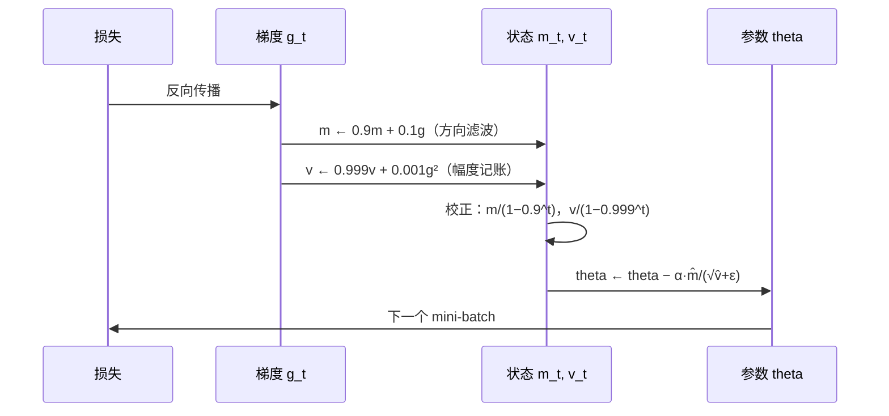
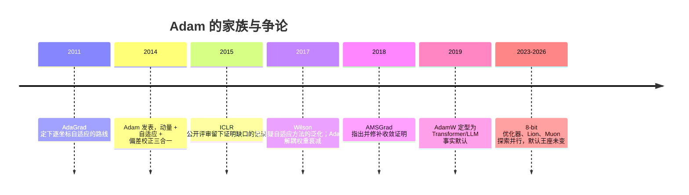

# 📜 精读 03 · Adam——给每个参数发一双合脚的鞋

> **一句话理解**：2014 年，两位博士生（Kingma 与 Ba）把"动量"与"自适应学习率"两股线拧成一股，配上一个此前被忽视的"偏差校正"，得到了至今仍是默认的优化器——Adam。

[⬆️ 返回总目录](../README.md) · [⬅️ 返回论文专栏](./README.md)

**本页路线图**：核心思想（两条线拧成一股）→ 五个机制（算法本体 / 偏差校正 / 收敛性 / 演进链 / 稀疏梯度与工程配方）→ 实验解读（证明了什么、没证明什么、消融怎么读）→ 影响与三大争议 → 与本库正文的对接。与[训练流程页](../docs/3-深度学习/04-深度学习基础/02-训练一个模型的完整流程.md)的分工：那边讲"盲人下山"的直觉与 AdamW 差异，这边给论文的完整推导与收敛性内幕。

---

## 📌 论文速览

| 项 | 内容 |
|------|------|
| 标题 | Adam: A Method for Stochastic Optimization（Adam：一种随机优化方法；名字来自 **Ada**ptive **M**oment estimation，自适应矩估计） |
| 作者与机构 | Diederik P. Kingma（阿姆斯特丹大学）、Jimmy Lei Ba（多伦多大学）——投稿时均为博士生 |
| 年份与出处 | 2014 年 12 月 22 日首次提交 arXiv（[1412.6980](https://arxiv.org/abs/1412.6980)），此后修订 9 个版本；ICLR 2015 发表 |
| 解决什么 | 随机梯度下降对所有参数用同一个步长——梯度稀疏、各维度尺度悬殊、目标非平稳时又慢又难调 |
| 关键数字 | 默认 $\alpha = 0.001$、$\beta_1 = 0.9$、$\beta_2 = 0.999$、$\epsilon = 10^{-8}$；每参数额外两个状态量；单步更新量硬上界 $\alpha$ |
| 附带贡献 | AdaMax 变体（$\ell_\infty$ 版）与一套凸情形后悔度分析（后有勘误，见机制三） |
| 一句话地位 | 深度学习默认优化器；训练今天所有大语言模型的 AdamW 是它的直系修订版 |

---

## 🌱 一句话核心思想

**步长不该全局一刀切，而该按每个参数自己的"信噪比"发放：梯度方向稳定的参数大步走，梯度纯是噪音的参数原地等。**

Adam 之前，优化器改良有两条独立的线。一条是**动量线**：SGD + Momentum 把历史梯度做指数滑动平均，抵消震荡分量、保留一致分量——解决"狭长山沟里来回撞壁"。另一条是**自适应线**：AdaGrad（2011）给每个参数累计历史梯度平方和，梯度一直很大的参数自动小步、梯度稀疏的参数自动大步——解决"各维度尺度悬殊"，但它把平方和**无限累加**，训练后期学习率趋近于零，在稠密梯度上会"冻死"；RMSProp（Hinton 在 Coursera 课程讲义里提出，从未正式发表）把累加改成**指数滑动平均**，只记近期幅度，救活了自适应线——代价是没有发表物、也没有理论。

Adam 的工作就是拧麻绳：一阶矩（梯度的滑动平均，= 动量）提供**方向**，二阶矩（梯度平方的滑动平均，= RMSProp 的幅度基线）提供**分母**，更新式为 $\eta \cdot \hat{m}/\sqrt{\hat{v}}$——分子分母一约，步长自动落在 $[0, \eta]$ 区间：梯度完全一致时约等于 $\eta\,\mathrm{sign}(g)$（满步），梯度纯是零均值噪音时约等于 0（不动）。再补上全文最容易被忽略的**偏差校正（Bias Correction）**：滑动平均在头几步样本太少、严重偏向零，除以 $(1-\beta^t)$ 把它拉回无偏——这一行小改动修掉了"开局步子失控"的隐患（也埋下了 warmup 的伏笔）。

论文的一句话卖点清单（摘要原意）：实现简单、计算高效、内存开销小（每参数多存两个状态）、对梯度的对角缩放不变、适合大规模数据/参数、天然处理非平稳目标与稀疏梯度、超参通常无需精调——**每一条都在后来十几年的工程实践里被反复兑现**，这大概是深度学习史上"摘要写得最像真话"的论文之一。

两位作者也值得一提：Kingma 前一年刚以变分自编码器（VAE，2013）改变了生成模型的方向，Ba 两年后与合作者提出层归一化（Layer Normalization, 2016）—— Transformer 的两个基石组件（LN + Adam）后脚都踩在这位作者的后续工作上。深度学习工具箱的"基础设施层"，是被极少数人反复重写的。

## 📋 举个例子：三个坐标，同一步，三种命运

一个极小的模型有 3 个参数，某一步各自的梯度是 $g_A = 10$、$g_B = 10^{-4}$、$g_C = 10$，且**历史一直如此**（A、C 信号稳定，B 天生梯度微弱，比如一个很少被触发的嵌入行）。看统一学习率 $\eta = 0.1$ 的 SGD 与 Adam（$\eta = 0.1$）各走多大一步：

| 坐标 | 梯度 | SGD 步长 | Adam 步长（$\hat m/\sqrt{\hat v}$ 稳态） | 谁更合理 |
|------|------|----------|------------------------------------------|----------|
| A | 10 | 1.0 | $\approx 0.1$（= $\eta\,\mathrm{sign}$） | Adam：梯度虽大但**方向稳定**，按信噪比只该拿标准步 |
| B | $10^{-4}$ | $10^{-5}$ | $\approx 0.1$ | Adam：梯度小而**稳定**（稀疏但每次都同向），慢走就是浪费 |
| C | 10（但历史上 $\pm 10$ 随机） | 1.0（当下看） | $\approx 0.05\,\eta$ 或更小 | Adam：梯度大而**纯噪音**，大步只会来回撞 |

> 👉 **人话**：SGD 只看"这一步梯度多大"，Adam 看"方向稳不稳"。同一份数值 $|g| = 10$，在 A 那里是信号、在 C 那里是噪音——**统一步长无法区分这两者，信噪比步长天然会**。这就是"给每个参数发一双合脚的鞋"的全部含义。

---

## 🧠 方法精读

本书第 4 章[训练流程页](../docs/3-深度学习/04-深度学习基础/02-训练一个模型的完整流程.md)已从"盲人下山"视角讲过动量、Adam 的直觉与 AdamW 的差异公式；本页给论文视角：算法本体逐行读、偏差校正的完整推导、收敛性分析的框架直觉。

### 记号翻译：论文 → 本书

| 论文记号 | 含义 | 本书记号 | 备注 |
|----------|------|----------|------|
| $\alpha$ | 步长（stepsize） | $\eta$（学习率 lr） | 同一个东西；论文默认 $\alpha = 0.001$ |
| $\theta_t$ | 第 $t$ 步参数 | $w$（权重） | |
| $g_t = \nabla_\theta f_t(\theta_{t-1})$ | 第 $t$ 步梯度 | $\nabla L$ | 随机目标的小批量梯度 |
| $m_t$ | 一阶矩（梯度均值估计） | 动量/速度（记号撞车！） | **警告**：本书第 4 章动量小节用 $v$ 表示速度，而 Adam 论文的 $v_t$ 是二阶矩——读论文时务必分清 |
| $v_t$ | 二阶矩（梯度平方均值估计） | —— | 见上：与"速度"无关 |
| $\hat{m}_t, \hat{v}_t$ | 偏差校正后的矩估计 | $\hat{m}, \hat{v}$ | 本书沿用 |
| $\beta_1, \beta_2, \epsilon$ | 衰减率与数值稳定项 | 同名 | 默认 $0.9,\; 0.999,\; 10^{-8}$ |

### 机制一：算法本体逐行读——步长就是信噪比

Adam 的完整更新（论文 Algorithm 1，逐行还原）：

$$
\begin{aligned}
m_t &= \beta_1 m_{t-1} + (1-\beta_1)\, g_t && \text{（一阶矩：梯度的指数滑动平均）}\\[2pt]
v_t &= \beta_2 v_{t-1} + (1-\beta_2)\, g_t^2 && \text{（二阶矩：梯度平方的指数滑动平均，逐坐标）}\\[2pt]
\hat{m}_t &= \frac{m_t}{1-\beta_1^t}, \qquad \hat{v}_t = \frac{v_t}{1-\beta_2^t} && \text{（偏差校正）}\\[2pt]
\theta_t &= \theta_{t-1} - \alpha \cdot \frac{\hat{m}_t}{\sqrt{\hat{v}_t} + \epsilon} && \text{（更新）}
\end{aligned}
$$

> 👉 **人话**：第一步问"最近的梯度平均指向哪"（$m$，方向）；第二步问"最近的梯度平均有多大"（$v$，分母基线）；第三步把头几步的统计偏差修正掉；第四步按"方向/幅度"的比值走——这个比值就是**信噪比**。

**为什么说步长落在 $[0, \alpha]$？** 逐坐标看两种极端：

- **信号满格**：梯度恒为 $g$（方向大小都不变）$\Rightarrow \hat{m}_t \to g$，$\sqrt{\hat{v}_t} \to |g|$，更新 $= \alpha \cdot g/|g| = \alpha\,\mathrm{sign}(g)$——**满步长**，与梯度本身多大无关；
- **纯噪音**：梯度 $\pm g$ 等概率出现（零均值）$\Rightarrow \hat{m}_t \to 0$，$\sqrt{\hat{v}_t} \to |g|$，更新 $\to 0$——**原地不动**。

> 👉 **人话**：Adam 不在乎梯度"多响"，只在乎梯度"多一致"。这正好对症 Transformer 的梯度生态：嵌入层梯度稀疏（一个 batch 只碰少数词）、注意力层稠密、各层量级差几个数量级——统一步长必然顾此失彼，按信噪比发步长各得其所。

**三情况小算例（标量参数，$\beta_1=0.9$，$\beta_2=0.999$，手算可验）**：

一步 Adam 在代码里的完整流水线（对照任何框架的 `optimizer.step()`）：

🧮 展开小算例：第一步 = sign 更新；信号满格 vs 纯噪音（第二步就分道扬镳）

**第 0 步：$t=1$，验证"第一步永远是 $\alpha\,\mathrm{sign}(g_1)$"。** 设 $g_1 = 10$：

- $m_1 = 0.1 \times 10 = 1$，$\hat{m}_1 = 1/(1-0.9) = 10 = g_1$ ✔（校正后恰好还原真值）
- $v_1 = 0.001 \times 100 = 0.1$，$\hat{v}_1 = 0.1/(1-0.999) = 100 = g_1^2$ ✔
- 更新 $= -\alpha \cdot 10/\sqrt{100} = -\alpha$

梯度换成 $10^{-4}$，同样得更新 $= -\alpha$（分子 $10^{-4}$、分母 $10^{-4}$）。**第一步的步长与梯度量级无关，恒为 $\alpha$**——这就是"信噪比步长"的极端体现：只要信号一致，再微弱也满步走。

**第 1 步：信号满格（$g_1 = g_2 = 10$）。**

- $m_2 = 0.9 \times 1 + 0.1 \times 10 = 1.9$，$\hat{m}_2 = 1.9/(1-0.81) = 1.9/0.19 = 10$ ✔
- $v_2 = 0.999 \times 0.1 + 0.001 \times 100 = 0.1999$，$\hat{v}_2 = 0.1999/(1-0.998001) = 100.0$ ✔
- 更新 $= -\alpha \cdot 10/10 = -\alpha$——继续满步。

**第 2 步：纯噪音（$g_1 = 10, g_2 = -10$）。**

- $m_2 = 0.9 \times 1 - 0.1 \times 10 = -0.1$，$\hat{m}_2 = -0.1/0.19 \approx -0.53$（真实均值 0，估计很接近）✔
- $v_2 = 0.1999$，$\hat{v}_2 = 100$（平方不分正负，幅度照记）
- 更新 $= -\alpha \times (-0.53)/10 \approx +0.053\,\alpha$——**步长缩到满步的 5%**。

三行对照：同一坐标、同样 $|g|=10$ 的梯度，"方向一致"拿满步 $\alpha$，"方向随机"只拿 $0.05\alpha$——Adam 的全部性格浓缩在这一对比里。若不做偏差校正，第一步的分母是 $\sqrt{v_1} = \sqrt{0.1} \approx 0.316$，更新 $= -0.1 \times 1/0.316 \approx -0.32\alpha$？不对——分子同样未校正：$-\alpha \cdot 1/0.316 \approx -3.16\alpha$，**步长超标 3 倍多**；对二阶矩更致命：$\hat{v}$ 未校正时第一步除以 $\sqrt{1-\beta_2} \approx 0.032$，等效步长放大约 **31 倍**。头几步步子失控，正是 warmup 存在的理由（见机制三末尾与[训练流程页](../docs/3-深度学习/04-深度学习基础/02-训练一个模型的完整流程.md)深问二）。

### 机制二：偏差校正的完整推导——为什么除以 $(1-\beta^t)$

**命题**：若各步梯度独立同分布、均值 $\mu$，则 $m_t$ 的期望不等于 $\mu$，而是 $(1-\beta_1^t)\,\mu$；除以 $(1-\beta_1^t)$ 后无偏。

🧮 展开完整推导：几何权重求和（不跳步）

**第 1 步：把递推解开成加权和。** $m_t = \beta_1 m_{t-1} + (1-\beta_1) g_t$ 逐层代入（$m_0 = 0$）：

$$
m_t = (1-\beta_1)\sum_{i=1}^{t} \beta_1^{\,t-i}\, g_i
$$

即第 $t$ 步梯度权重 $1-\beta_1$、上一步权重 $(1-\beta_1)\beta_1$、再上一步 $(1-\beta_1)\beta_1^2$……按几何级数衰减（$\beta_1 = 0.9$ 时新梯度占 10%，历史占 90%）。

**第 2 步：权重求和。**

$$
\sum_{i=1}^{t}(1-\beta_1)\beta_1^{\,t-i} = (1-\beta_1)\,\frac{1-\beta_1^t}{1-\beta_1} = 1-\beta_1^t
$$

**权重加起来不是 1**，缺口是 $\beta_1^t$——$m_0 = 0$ 这个"冷启动"偷偷吃掉了 $\beta_1^t$ 的权重（直观：递推从零出发，零没有信息但占了股份）。

**第 3 步：取期望。** $\mathbb{E}[m_t] = (1-\beta_1^t)\,\mu \ne \mu$——系统性偏小。除以 $(1-\beta_1^t)$ 修复。对 $v_t$ 同理（把 $g_i$ 换成 $g_i^2$、$\beta_1$ 换成 $\beta_2$）。

**第 4 步：感受校正量的衰减（$\beta_1 = 0.9$ 与 $\beta_2 = 0.999$ 对照）。**

| $t$ | $1-\beta_1^t$（$\beta_1{=}0.9$） | 校正倍数 | $1-\beta_2^t$（$\beta_2{=}0.999$） | 校正倍数 |
|-----|------|------|------|------|
| 1 | 0.1 | 10× | 0.001 | **1000×** |
| 10 | 0.651 | 1.54× | 0.00995 | 100× |
| 100 | ≈0.99997 | ≈1× | 0.0952 | 10.5× |
| 1000 | ≈1 | 1× | 0.632 | 1.58× |
| 10000 | ≈1 | 1× | ≈0.99995 | ≈1× |

两个读数：① **一阶矩校正几步内就失效**（10 步后只剩 1.5 倍），二阶矩校正要拖上千步——因为 $\beta_2 = 0.999$ 的"记忆长度"约 $1/(1-\beta_2) = 1000$ 步；② 校正倍数就是"统计量还差多远成熟"，这正是 warmup 的数学影子：前几百到几千步，$v$ 的估计远未成熟，干脆把 $\alpha$ 也压低陪它一起等。

**边界与反例**：无偏性依赖"梯度分布平稳"（均值 $\mu$ 恒定）。真实训练中梯度分布剧烈非平稳（损失面在动、学习率在变），$\hat{m}$ 并不严格无偏——偏差校正是"把最离谱的系统性偏差修掉"，不是精确统计。

> 👉 **人话**：滑动平均刚启动时"履历太薄"，算出来的均值天然偏小；除以权重缺口 $(1-\beta^t)$ 相当于按"有效样本数"折算——一个动作，把冷启动从隐患变成校正项。

🧮 展开推导：动量还是免费的方差缩减（为什么 m̂ 抗噪）

**命题**：设各步梯度独立、零均值、方差 $\sigma^2$（纯噪音场景），则一阶矩滑动平均的方差是单步梯度的 $\dfrac{1-\beta_1}{1+\beta_1}$ 倍。

**推导**（复用机制二的权重形式 $m_t = (1-\beta_1)\sum_{i=1}^{t}\beta_1^{t-i} g_i$，取 $t$ 大到权重归一近似成立）：

$$
\mathrm{Var}(m_t) = (1-\beta_1)^2 \sum_{i=1}^{t} \beta_1^{2(t-i)}\, \mathrm{Var}(g_i) = \sigma^2\,(1-\beta_1)^2 \cdot \frac{1}{1-\beta_1^2} = \sigma^2 \cdot \frac{1-\beta_1}{1+\beta_1}
$$

**代数**：$\beta_1 = 0.9$ 时缩减系数 $= 0.1/1.9 \approx 0.053$——**噪音方差降到十九分之一**（标准差约降至 23%）。这就是"动量=低通滤波"的数学本体：一致信号（均值）保留、随机信号（波动）互相抵消。

**代价与边界**：平滑窗口越长越抗噪，但也越"迟钝"——方向真变时（损失面转弯），$m$ 要花约 $1/(1-\beta_1) = 10$ 步才转过向来。$\beta_1 = 0.9$ 是"十步记忆"的甜点，不是理论最优；训练后期快到谷底时，惯性反而害事（过冲），这正是"动量也要配学习率衰减"的原因之一。

> 👉 **人话**：动量把"醉酒走路"（每步随机）变成"清醒走路"（短期的坚定方向）——清醒的代价是转弯慢半拍。

### 机制三：收敛性分析——论文证了什么，后来又破了什么

论文第 2 节给了理论分析，框架是**在线凸优化（Online Convex Optimization）的后悔度（Regret）**：

$$
R_T = \sum_{t=1}^{T} f_t(\theta_t) - \sum_{t=1}^{T} f_t(\theta^\star)
$$

> 👉 **人话**：后悔度 = "我一步步走出来的总损失"减去"事后诸葛亮（最优固定参数）的总损失"。若 $R_T/T \to 0$，意味着平均来看你和最优解没有差距——这是凸问题下优化器"靠谱"的标准证书。

论文证到的大意（定理 2~4，技术细节本页不复刻）：在梯度有界、$\beta_1,\beta_2 \in [0,1)$、步长按 $\alpha_t = \alpha/\sqrt{t}$ 递减等假设下，Adam 的期望后悔度为 $O(\sqrt{T})$——与当时在线凸优化的最优界同阶。论文据此称 Adam"收敛"。这段分析给后人的直觉价值有三：① Adam 可看作"逐坐标的自适应对角预条件（Preconditioning）"，等效于在重参数化的更圆的损失面上做近似 SGD；② 证明要求步长衰减——呼应实践中"必须配调度"；③ 每步额外开销只有常数级的两个状态，理论"轻"是它工程受欢迎的前提。

**但这段证明后来被证明有洞**，这是精读本文绕不开的一课：ICLR 2015 公开评审中就有评审人指出收敛证明存在缺口（论文九个版本的修订史里可见痕迹）；2018 年 Reddi、Kale、Kumar 在 ICLR 论文《On the Convergence of Adam and Beyond》中给出一个**凸的反例**——一个两坐标的简单线性问题上，Adam 可以被驱动到发散，根源是 $v_t$ 是滑动平均、**可以随时间变小**（某坐标梯度长期缺席后 $v$ 衰减，分母变小、有效步长被动放大，恰好在最不该大步的时刻加速）；他们提出的修正 AMSGrad 把分母改成历史最大值 $\hat{v}_t = \max(\hat{v}_{t-1}, v_t)$，只增不减，恢复收敛保证。

> 👉 **人话**：原版证明漏了"分母会自己缩水"这个口子；AMSGrad 给分母加了个棘轮——只会变紧不会变松。有趣的是工程界几乎没人换用 AMSGrad：深度学习本来就是非凸问题，凸证书对实践的指导本就有限——**理论破洞没有推翻工程共识**，这本身是"理论与实践各管一段"的最佳案例。

### 机制四：演进链——AdaGrad → RMSProp → Adam → AdamW

"每个变体解决了前者的什么痛点"（[训练流程页](../docs/3-深度学习/04-深度学习基础/02-训练一个模型的完整流程.md)的 SOTA 表有 2023 年后的延伸）：

| 优化器 | 年份 | 二阶矩怎么记 | 解决了什么 | 留下什么 |
|--------|------|--------------|-----------|----------|
| SGD | — | 不记 | — | 隐式正则、泛化常最好 |
| AdaGrad | 2011 | **无限累加** $\sum g^2$ | 稀疏梯度自适应步长 | 稠密梯度后期学习率归零"冻死" |
| RMSProp | ~2012（课程讲义，未正式发表） | **指数滑动平均** | 修"冻死" | 没有发表物；无动量、无校正 |
| **Adam** | 2014 | 滑动平均（= RMSProp 分母） | 加一阶矩动量 + 偏差校正，集大成 | L2 正则与自适应分母**耦合**（下述） |
| AdamW | 2017/2019 | 同 Adam | **解耦权重衰减** | 成为大模型时代事实默认 |

**耦合问题一行看懂**：把 L2 正则 $\lambda\theta$ 加进梯度后，Adam 的更新分母会把这个惩罚项也除以 $\sqrt{\hat{v}}$——历史梯度大的坐标 $\sqrt{\hat{v}}$ 大、正则被除小，**惩罚力度在参数之间不一致**。设两个坐标 $v_A = 1$、$v_B = 100$：有效正则强度相差 $\sqrt{100}/\sqrt{1} = 10$ 倍。AdamW 的修法是把衰减从梯度里拿出来、直接在参数上按比例收缩：$\theta_t = \theta_{t-1} - \alpha\,\hat{m}_t/(\sqrt{\hat{v}_t}+\epsilon) - \alpha\lambda\,\theta_{t-1}$（详见[训练流程页](../docs/3-深度学习/04-深度学习基础/02-训练一个模型的完整流程.md)的 AdamW 公式小节）。

🧮 展开小算例：AdaGrad 是怎么"冻死"的（Adam 分母的动机演示）

AdaGrad 的分母是历史平方的**无限累加**：$G_t = \sum_{i=1}^t g_i^2$，步长 $\eta\, g_t/\sqrt{G_t}$。设某稠密坐标每步梯度恒为 1：

| 步数 $t$ | $G_t = t$ | 步长 $\eta/\sqrt{G_t}$ | 相对首步 |
|----------|-----------|------------------------|----------|
| 1 | 1 | $\eta$ | 100% |
| 100 | 100 | $0.1\,\eta$ | 10% |
| 10 000 | 10 000 | $0.01\,\eta$ | 1% |
| 1 000 000 | 10⁶ | $0.001\,\eta$ | 0.1% |

梯度一点没变小，步长却自己缩到千分之一——训练在损失面上"假装收敛"。RMSProp 把累加换成滑动平均（等效"只记最近约 $1/(1-\beta_2)$ 步"），$G$ 稳定在 $|g|^2$ 附近，步长不再无端衰减：

$$
v_t = \beta_2 v_{t-1} + (1-\beta_2) g_t^2 \;\;\xrightarrow{\text{稳态}}\;\; v \approx \mathbb{E}[g^2] \quad(\text{不再随 } t \text{ 增长})
$$

> 👉 **人话**：AdaGrad 的账本只进不出，越记越厚、步子越迈越小；RMSProp/Adam 的账本"定期折旧"，只反映近期行情。但滑动平均也带来了新问题——**账本可以变薄**（梯度长期缺席后 $v$ 衰减、分母变小、步长被动放大），这正是后来 AMSGrad 反例抓住的口子（见机制三）。

### 机制五：稀疏梯度与 ε 的位置——论文里两处容易被略过的设计

**稀疏梯度：Adam 血统里的第一场景。** AdaGrad 最初就是为稀疏在线学习设计的，Adam 继承了这份基因。嵌入层（Embedding Layer）是最典型场景：一个 batch 只碰少数词，其余几万行的梯度**这一步严格为零**。此时：

- 统一学习率的 SGD 对零梯度行**什么也不做**——对；但对刚被碰到的行，又按全局步长猛走——不一定对；
- Adam 的 $v_t$ 记录的是"该行**被碰到时**的梯度幅度"（零梯度不更新 $v$：$v_t = \beta_2 v_{t-1} + 0$ 只是衰减），分母反映的是该行自己的行情——**每行按自己的活跃节奏配步长**。论文 6.1 节的结论"稀疏场景 $\beta_2$ 要更靠近 1"，翻译过来：某行每 5000 步才被碰一次，二阶矩的"记忆窗口" $1/(1-\beta_2)$ 至少要盖过这个间隔，否则 $v$ 在两次触碰之间已衰减殆尽、分母过小、一碰就迈大步。Transformer 的嵌入层与输出层正是这种负载——**Adam 系在大模型上的统治地位，从基因里就写好了**。

**$\epsilon$ 放在根号外面**：Adam 写作 $\hat{m}/(\sqrt{\hat{v}} + \epsilon)$ 而非 $\hat{m}/\sqrt{\hat{v} + \epsilon}$。论文 2.1 节指出这个写法配合 $|\hat{m}| \le \sqrt{\hat{v}}$（柯西不等式的均值版本，直流分量不超均方根）给出**每步更新量的硬上界**：

$$
\left|\Delta \theta_t\right| \le \alpha \cdot \frac{\sqrt{\hat{v}_t}}{\sqrt{\hat{v}_t} + \epsilon} \;\approx\; \alpha \quad\Longrightarrow\quad \text{任何一步、任何坐标，步长不超过 } \alpha
$$

> 👉 **人话**：无论梯度多炸、$v$ 多小，单步移动被 $\alpha$ 兜住——这是"失控保护丝"。工程上它也解释了为什么低精度训练（fp16/bf16）常要调大 $\epsilon$：$\hat v$ 小到与 $\epsilon$ 同量级时，这个保险丝实际在决定步长，精度不够会把保险丝烧毛。经验参考：fp32 用默认 $10^{-8}$，fp16 训练常放大到 $10^{-6} \sim 10^{-4}$ 量级（具体按实现与任务调）。

**AdaMax（论文自带的变体，一段话版）**：把二阶矩换成 $\ell_\infty$ 范数的指数滑动最大 $u_t = \max(\beta_2 u_{t-1}, |g_t|)$，更新为 $\theta_t = \theta_{t-1} - \alpha\, \hat{m}_t / u_t$——分母从"均方根"换成"近期最大值"，对离群梯度更鲁棒，且论文指出其步长上界放宽到 $\alpha/(1-\beta_1^t)$。实践中用得远少于 Adam 本尊，但它是"分母可以换范数"这一设计自由度的示范（同族思路后来在 Lion 等符号系优化器里再次出现）。

---

## 📊 实验解读

### 证明了什么

论文的实验矩阵（第 5~6 节）：MNIST 上的**逻辑回归**（不同初始学习率扫描）、MNIST 上的多层全连接网络（不同隐藏层配置）、CIFAR-10 上的卷积网络，以及变分自编码器等非凸任务，对比对象为 SGD（含动量）、AdaGrad、RMSProp（部分含 DDGM 等变体）。主线结论（曲线可查原文）：

1. **收敛快且稳**：同样训练步数下 Adam 的训练损失下降最快；逻辑回归上"最快的 SGD 配置"也追不上默认超参的 Adam；
2. **对初始学习率鲁棒**：$\alpha \in [10^{-4}, 10^{-2}]$ 量级内 Adam 表现平稳，而 SGD 的最优区间窄得多（各任务的图 1~2 系列）；
3. **超参可迁移**：$\beta_1 = 0.9$、$\beta_2 = 0.999$ 在所有任务上都不是明显坏点（论文第 6 节对 $\beta_1, \beta_2$ 做了网格，结论是接近默认即可；稀疏梯度场景 $\beta_2$ 需更靠近 1）；
4. **每步开销可忽略**：每参数只多两个状态量，一步更新为常数时间——内存翻三倍（参数 + 两个状态）换来免调参，这笔账工业界算得很乐意。

> 🔥 **炼丹小灶（经验参考，不是圣旨）**：现代默认起步配方——通用小模型：Adam，$\eta = 10^{-3}$，其余默认；Transformer/LLM：AdamW，$\eta$ 约 $10^{-4} \sim 3\times10^{-4}$，权重衰减 0.01~0.1，warmup 0.5%~5% 步数后余弦衰减，梯度裁剪 1.0；稀疏/嵌入主导的任务可把 $\beta_2$ 降到 0.95~0.98 换取更快响应；低精度训练记得审视 $\epsilon$（见机制五）。这些数字都不是论文给的——2014 年的论文只负责任地给了 $\alpha = 10^{-3}$ 这一个起点。

### 没证明什么

- **没有证明泛化更好**。论文实验的主体指标是**训练损失收敛曲线**，不是测试精度对比；"Adam 找到的解泛化常不如 SGD+动量"是三年后 Wilson 等（2017）系统研究（以及后续大量争论）才浮出水面的事实——见下节；
- **没有碰过 Transformer / 大模型**。2014 年还没有 Transformer（2017）、更没有 GPT（2018）；Adam 在大模型上的统治地位是后来的工程选择回填的历史，本文的实验对象最大到 CIFAR-10 卷积网络；
- **理论假设与实际负载脱节**：收敛证保证的是凸问题 + 递减步长；真实使用是非凸 + 常数步长 + warmup + 权重衰减——证书的适用范围和使用场景几乎不相交（且证明本身后来被发现有洞，见机制三）；
- **$\epsilon$ 的作用被轻描淡写**：论文把它列为数值稳定项，但后来大量实践发现 $\epsilon$ 在低精度训练（fp16/bf16）与大 batch 场景里是需要认真调的实用超参，而非"默认不动"；
- **对照物不完整**：RMSProp 从未正式发表、没有标准配置，论文对照的是它的若干变体（DDGM 等）而非"原教旨 RMSProp"——公平性上有天然缺口；SGD 的对照也未与"精心调度的 SGD+动量"（后来 Wilson 2017 用的那种）对齐；
- **"默认超参即最优"是幸存者叙述**：$\alpha = 10^{-3}$ 的普适性建立在"当时的任务规模"上——到了大模型与超大 batch 时代，$\eta$、$\beta_2$、$\epsilon$ 全都要重调（本页炼丹小灶），默认值只是起点不是结论。

### 关键消融怎么读（对超参实验的三条读法）

| 消融项 | 论文口径 | 怎么读 |
|--------|----------|--------|
| 初始 $\alpha$ 扫描 | $10^{-4}$ 到 $10^0$ 量级（各图） | 读"**平台宽度**"而不是"峰值高度"：Adam 的曲线簇挤在一起 = 鲁棒；SGD 的曲线簇散开 = 敏感——优化器论文比"最好能多好"更该比"最差会多差" |
| $\beta_1$ 扫描 | 0.5~0.99 区间 | 各任务几乎一条平线 → 动量衰减率不值得调，抄 0.9（方差缩减系数 $(1-\beta_1)/(1+\beta_1)$ 的推导见机制二的折叠块） |
| $\beta_2$ 扫描 | 0.99~0.9999 区间 | 稀疏梯度下要靠近 1 → 二阶矩是"幅度记忆"，记忆长度 $1/(1-\beta_2)$ 要盖过梯度出现的间隔（嵌入层某词几千步才被碰一次，记忆就得几千步） |
| 任务矩阵 | 逻辑回归 / 全连接 / 卷积 / 非凸 | 结论跨负载稳定才是"鲁棒"的证据——单一任务上的最优配置说服力有限 |

> 👉 **人话**：消融读出的是"**哪些超参可以躺平（$\beta_1$、$\beta_2$），哪些必须盯紧（$\alpha$ 与调度）**"——这直接决定了后来框架把 $\alpha$ 做成调度器、其余三个写死成默认值的工程惯例。

🎓 精读自测（先自己答，再对答案）

1. **Adam 的第一步长是多少？** 恰为 $\alpha\,\mathrm{sign}(g_1)$——偏差校正后 $\hat{m}_1 = g_1$、$\hat{v}_1 = g_1^2$，分子分母恰好约掉。与梯度量级无关。
2. **不做偏差校正，第一步会发生什么？** 分母只剩 $\sqrt{v_1} = \sqrt{(1-\beta_2)}\,|g_1| \approx 0.032|g_1|$，等效步长约 $\alpha/0.032 \approx 31.6\alpha$——超标 31 倍。这就是 warmup 与偏差校正各管一半的"开局不稳"。
3. **梯度大但纯噪音的坐标，Adam 走多大步？** $\hat m \to 0$、$\sqrt{\hat v} \to |g|$，步长趋于 0——信噪比步长对"响亮的噪音"自动免疫。
4. **Wilson 2017 说了什么？AMSGrad 修了什么？** 前者：自适应方法测试精度常逊于调好的 SGD+动量（泛化之争）；后者：$v_t$ 可随时间变小导致有效步长被动放大，凸情形有不收敛反例，修法是 $\hat v_t = \max(\hat v_{t-1}, v_t)$ 只增不减。
5. **Adam 与 AdamW 的一字之差在哪？** 权重衰减不再混进梯度（避免被 $\sqrt{\hat v}$ 逐坐标除成不一致的惩罚），而是每步直接按 $\alpha\lambda\theta$ 收缩参数。

### 深问三则（面试与实战高频）

**问 1：为什么 Adam 对 Transformer 格外重要，视觉卷积却长期偏爱 SGD？**

答：负载的梯度生态不同。Transformer：嵌入层稀疏（词表大、每步只碰少数行）、注意力/FFN 稠密、各层量级差几个数量级——对角自适应正好逐坐标对症；卷积网络：梯度稠密且量级相对均匀，SGD+动量 + 好的调度已经够用，且省两个状态量的显存、泛化常略优。**优化器没有普适最优，只有与梯度生态的匹配**（本页机制五 + [训练流程页](../docs/3-深度学习/04-深度学习基础/02-训练一个模型的完整流程.md)深问一互补）。

**问 2：既然第一步就是 $\mathrm{sign}$ 更新、稳态也是"信噪比×$\alpha$"，为什么还要 $\epsilon$？**

答：$\epsilon$ 只在 $\sqrt{\hat v} \to 0$ 时登场——梯度长期为零的坐标（冻结层、未触发的嵌入行）突然被碰到，$v$ 接近零会让除法爆炸。它把步长上界钉在 $\alpha$（机制五的硬上界），是保险丝不是调味料；但保险丝太粗（$\epsilon$ 偏大）也会让小梯度坐标拿不到应有的步长——低精度训练里这个权衡真实存在。

**问 3：Adam 的收敛证保证的是凸问题，深度学习是非凸的——那理论还有用吗？**

答：有用，但用法要变。凸情形的后悔度证书保证的是"算法不会在最简单的设定里翻车"，它是后续一切扩展（AdamW、AMSGrad、分布式变体）分析的地基；对非凸实践，它提供的是**设计直觉**（为什么步长要衰减、为什么 $\beta_2$ 影响稀疏负载）。正确的态度：不拿凸证书当深度学习的性能保证，也不因"非凸"就扔掉整套分析框架。

**问 4：AMSGrad 修好了证明，为什么工业界几乎没人换用？**

答：三层原因。① 棘轮分母 $\max(\hat v_{t-1}, v_t)$ 在"梯度幅度真实下降"的场景（损失面进入更平区域）里会**拒绝调小步长**，收尾精修反而变差；② 反例是为凸在线学习构造的，深度学习的非凸负载里"分母缩水导致发散"并不常见；③ 换优化器要重验全部配方（调度、warmup、正则），期望收益覆盖不了重验成本。这是一个"理论正确 ≠ 工程正确"的活标本——和 ResNet 精读里"证明破洞没推翻工程共识"是同一课的两面。

### 版本史小注：一篇论文改了九版

arXiv 页面记录了这篇论文从 v1（2014-12-22）到 v9（2017-01-30）共九个版本——横跨两年多，ICLR 2015 发表后仍在修订。可查的事实只有各版日期；具体改了什么（实验补充、表述修正、评审意见的回应）未逐版公开记录，但九版的存续本身说明两件事：① 这篇论文是在公开评审的火里淬出来的（ICLR 2015 的 Open Review 记录至今可查，收敛证明的争议在那里就有踪迹）；② 引用时**务必引最新版**——早期版本的公式与实验和终稿有出入，是精读翻车的常见坑。

---

## 🔁 后世影响

- **默认优化器的统治**：从 GPT、BERT 到今天几乎所有开源大模型，训练日志里的优化器一栏清一色 AdamW。Adam 的一阶/二阶矩状态（每参数 2 份 fp32 状态）也直接塑造了分布式训练的显存账本——优化器状态分片（ZeRO 系列）的出发点就是切这三倍内存（见[分布式训练页](../docs/3-深度学习/04-深度学习基础/04-分布式训练与模型规模.md)）；
- **大模型时代的配套工程**：状态量太贵，于是围绕它长出一整层优化器基础设施——状态量化到 8bit 的 8-bit Adam 系（省 75% 状态显存）、Kahan 求和抵消低精度舍入误差、分布式优化器把状态与梯度分片到不同设备。这些都不改 Adam 的数学骨架，只改它的"记账方式"——**一个 2014 年的算法，账本至今在被重新发明**（[LLM 全栈页](../docs/4-专业方向/07-自然语言处理与LLM/07-进阶专题-LLM训练与推理全栈.md)有全貌）；
- **三大争议，各有下文**：① **泛化之争**（Wilson et al., 2017：在多个视觉任务上自适应方法测试误差系统性高于精调的 SGD+动量；后续研究部分归因于自适应方法停在"更尖"的极小值、且可用学习率调度部分追平——[训练流程页](../docs/3-深度学习/04-深度学习基础/02-训练一个模型的完整流程.md)深问一有三层拆解）；② **证明之争**（AMSGrad 反例，见机制三——凸证书破了，工程没塌）；③ **正则之争**（AdamW 解耦权重衰减，一行改动修复系统性偏差，如今没人再裸用"Adam+L2"）；
- **它的名字成了方法范式**：矩估计 + 逐坐标缩放的思想被搬到各处——Adamax（论文自带的 $\ell_\infty$ 版变体：二阶矩换成指数滑动最大值，步长上界 $\alpha/(1-\beta_1)$）、Nadam（Nesterov 动量版）、8-bit Adam（状态量化到 8bit）、Lion（符号更新版）等；2024 年以来 Muon 等新优化器在中小规模语言模型上报告更快收敛（见[训练流程页](../docs/3-深度学习/04-深度学习基础/02-训练一个模型的完整流程.md) SOTA 表），但"到终点的期望成本"这一 Adam 立下的评价标准，依然是所有挑战者必须先过的关；
- **反思**：Adam 的胜利常被总结为"更好"——更准确的说法是"**更省**"：省调参、省收敛时间、对坏负载宽容。在算力昂贵、人才更贵的真实约束下，"开箱即用的 95 分"击败了"精心调教的 98 分"。这是工程史上反复上演的剧情，也是读这篇论文最该带走的一条元经验。

---

## 🎒 读完带走三句话

1. **步长即信噪比**：$\alpha\,\hat{m}/\sqrt{\hat{v}}$ 让"方向一致的坐标拿满步、纯噪音的坐标原地等"——Adam 的全部性格浓缩在一个比值里，第一步恒为 $\alpha\,\mathrm{sign}(g)$ 是它最锋利的注脚；
2. **偏差校正是被忽视的主角**：几何权重求和的缺口 $(1-\beta^t)$ 解释了冷启动的系统性偏小；不做校正，头几步的等效步长超标约 31 倍——warmup 与校正各修一半的"开局不稳"；
3. **证明与工程各管一段**：凸后悔度证书破了（AMSGrad 反例）工程没塌，泛化之争吵了多年 AdamW 也没退位——**默认优化器的地位是"到终点的期望成本"挣来的，不是理论证出来的**。

---

## 🔗 在本库中的位置

- 主读页：[训练一个模型的完整流程](../docs/3-深度学习/04-深度学习基础/02-训练一个模型的完整流程.md)——优化器直觉、动量收敛分析（$\kappa$ 开方推导）、AdamW 公式与"为什么 warmup 对 Adam 格外重要"的深问，与本页机制一~三互补；
- 显存与分布式：[分布式训练与模型规模](../docs/3-深度学习/04-深度学习基础/04-分布式训练与模型规模.md)（优化器状态的显存账）、[大规模训练工程](../docs/3-深度学习/04-深度学习基础/06-进阶专题-大规模训练工程.md)（训练稳定性）；
- 应用侧：[LLM 训练与推理全栈](../docs/4-专业方向/07-自然语言处理与LLM/07-进阶专题-LLM训练与推理全栈.md)（大模型训练配方的 AdamW 实战）；
- 同专栏互链：[精读 01 · Transformer](./01-Attention-Is-All-You-Need.md)——它训练配方里的 $\beta_2 = 0.98$ 与 warmup，正是本页机制二（偏差校正）与机制五（稀疏梯度）在大模型上的第一次亮相；
- 🎮 动手玩：本库[梯度下降炼丹炉](../playground/gradient-descent.html)——切到 Adam 对比 SGD，亲眼看自适应步长在狭长山沟里的差别。

---

[⬅️ 上一页：精读 02 · ResNet](./02-ResNet.md) · [返回专栏目录](./README.md) · [下一页：精读 04 · word2vec ➡️](./04-word2vec.md)

## 📚 延伸阅读

- 原论文：[Adam: A Method for Stochastic Optimization（arXiv:1412.6980）](https://arxiv.org/abs/1412.6980)——注意版本史（v1 2014-12-22 至 v9 2017-01-30），引用请用最新版；
- 前史：[AdaGrad（Duchi, Hazan & Singer, 2011, arXiv:1107.5903）](https://arxiv.org/abs/1107.5903)；RMSProp 无正式论文，出处是 Hinton 的 Coursera 课程《Neural Networks for Machine Learning》第 6 讲讲义（网上可查）；
- 泛化之争：[The Marginal Value of Adaptive Gradient Methods（Wilson et al., 2017, arXiv:1705.08292）](https://arxiv.org/abs/1705.08292)——对线（支持 Adam 一方）的代表包括后续大量"调度补齐后差距消失"的实证研究，争论细节可从本文的引用网络顺藤摸瓜；
- 解耦权重衰减：[Decoupled Weight Decay Regularization（AdamW, arXiv:1711.05101）](https://arxiv.org/abs/1711.05101)；
- 收敛证明修补：[On the Convergence of Adam and Beyond（Reddi et al., ICLR 2018, OpenReview）](https://openreview.net/forum?id=ryQu7f-RZ)；
- 大规模配套：[ZeRO（arXiv:1910.02054）](https://arxiv.org/abs/1910.02054)（优化器状态分片）、[LARS（arXiv:1708.03888）](https://arxiv.org/abs/1708.03888)（大 batch 分层自适应）、[Lion（arXiv:2302.06675）](https://arxiv.org/abs/2302.06675)（符号更新路线，进化搜索所得）。
