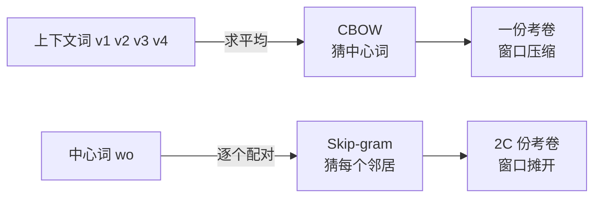
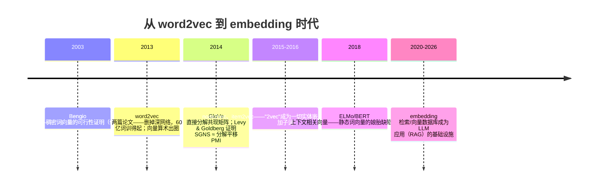

# 📜 精读 04 · word2vec——"看朋友圈识人"的向量思想起点

> **一句话理解**：2013 年，Google 的 Mikolov 团队为了把神经语言模型**训得更快**，把网络删到只剩一张嵌入表——结果意外发现：高质量的词向量不需要深度网络，一个"猜邻居"的小游戏加上海量文本就够了。

> **读法提示**：本页数字多为论文自建任务的口径（题解见"数字口径须知"）；想先看"国王−男人+女人≈王后"的几何直觉，请直接跳[词向量主页](../docs/4-专业方向/07-自然语言处理与LLM/01-词向量与embedding.md)——本页管论文，那边管数学。

[⬆️ 返回总目录](../README.md) · [⬅️ 返回论文专栏](./README.md)

**本页路线图**：核心思想（代理任务学表示的范式反转让）→ 四个机制（加速账 / SGNS 目标与负采样 / 层次 softmax / 类比评测协议）→ 实验解读（55% vs 23% 证明了什么、自建测试集的边界）→ 后世影响与争议 → 与本库正文的对接。与[词向量主页](../docs/4-专业方向/07-自然语言处理与LLM/01-词向量与embedding.md)的分工：那边证"SGNS≈分解平移 PMI"，这边讲论文本身怎么算账、怎么评测、哪些锅是娘胎里的。

**数字口径须知（免得读串）**：本页所有百分比均为论文自建类比任务的 **top-1 精确命中**口径；"60 亿词"指 Google News 语料的 token 量；训练成本"天数 × 核数"是 DistBelief 分布式框架的记账口径（与今天单卡 GPU 小时不可直接换算）；两篇论文（1301.3781 与 1310.4546）的表格编号各自独立，本页引用时标明出处。

---

## 📌 论文速览

| 项 | 内容 |
|------|------|
| 标题 | Efficient Estimation of Word Representations in Vector Space（《词向量空间表示的高效估计》） |
| 作者与机构 | Tomas Mikolov、Kai Chen、Greg Corrado、Jeffrey Dean——Google |
| 年份与出处 | 2013 年 1 月提交 arXiv（[1301.3781](https://arxiv.org/abs/1301.3781)）；在 NIPS 2013 深度学习工作坊（Workshop）报告；负采样等细节来自同年续作（arXiv:1310.4546，NIPS 2013） |
| 解决什么 | 神经语言模型（NNLM）训练太慢：10 年前的嵌入质量不错但算不起，无法用到十亿词级语料 |
| 关键数字 | 语义类比 55%（skip-gram）对 23%（NNLM，同数据同维度）；60 亿词训得起；高质量向量单机 CPU 不到一天 |
| 附带贡献 | 词向量算术（king − man + woman ≈ queen）与自建类比评测集（8,869 语义 + 10,675 句法题） |
| 一句话地位 | 词向量/embedding 时代的开端；"预训练 + 迁移"范式进入 NLP 的第一块基石 |

---

## 🌱 一句话核心思想

**词的含义，是"预测上下文"这个任务的副产品——你甚至不需要一个真正的深网络来学它。**

2013 年之前的路线是 Bengio 等 2003 年的**神经语言模型（NNLM, Neural Probabilistic Language Model）**：输入前 $N$ 个词的 one-hot，过共享的嵌入查表，再过一个带非线性激活的隐藏层，最后 softmax 预测下一个词。它证明了"稠密向量可以承载语义"，但有两个昂贵器官：**非线性隐藏层**（每个训练样本都要算一遍矩阵乘 + 激活）与**softmax 输出层**（要对整个词表——几十万词——逐一算分）。RNNLM（Mikolov 自己 2010 年的代表作）换成了循环结构，输出层的大头照旧。结果就是：训练费到"用不起"——本文里作为基线的 RNNLM，在单颗 CPU 上训了约 8 周。

Mikolov 团队的动机本来很工程：**把 NNLM 加速到能吃 60 亿词**。加速的手段说出来有点黑色幽默——**做减法**：把非线性隐藏层整个删掉（模型只剩嵌入查表与点积，成为"对数线性"模型），softmax 用层次结构或负采样绕开。架构退化到几乎不剩"神经网络"，质量却不降反升：在论文自建的类比测试集上，skip-gram 的语义类比准确率 55%，而同等数据下 NNLM 只有 23%（下文实验节详表）。

**这背后是一次范式反转让**：2003~2012 年的主流叙事是"更好的语言模型 → 顺带得到更好的词向量"；word2vec 把箭头掉头——**词向量本身就是要学的东西，语言建模只是个廉价的借口**（代理任务）。训练目标不是把句子预测好，而是逼每个词"为了猜对邻居"而把自己的搭配规律压进向量。这一"代理任务学表示"的思想，后来在 BERT（完形填空）、GPT（预测下一词）、对比学习里反复重演——word2vec 是它的第一次大规模成功。

## 📋 举个例子：一句话能榨出多少训练信号

skip-gram 与 CBOW 的"训练信号量"差多少？拿一句话数一遍就懂了。窗口半径 2，句子 ["小猫", "追着", "球", "滚", "出去"]：

```text
         窗口半径 2
小猫  追着 [ 球 ] 滚  出去
       └────┤────┘
   邻居：小猫、追着、滚、出去（4 个）
```

- **skip-gram**：以"球"为中心，生成 4 个独立训练对——（球→小猫）、（球→追着）、（球→滚）、（球→出去）。全句 5 个位置共约 **16~20 个对**（边界处窗口截断）；
- **CBOW**：把 4 个邻居的向量**平均成一个向量**去猜"球"——同一个窗口只产出 **1 个训练样本**，全句约 5 个。

> 👉 **人话**：同样一句话，skip-vec 的 skip-gram 榨出的训练信号约是 CBOW 的"窗口大小"倍（本例 4 倍），且每个对都要求中心词**单独**迁就一个邻居——向量被迫更"专"（语义类比受益）；CBOW 把邻居搅拌平均，学的是"这片的平均氛围"——句法模式更稳，细粒度语义被平均稀释。这就是实验表里"skip-gram 语义 55% / CBOW 24%，CBOW 句法 64% / skip-gram 59%"不对称的成本来源：**信号密度换信号广度**。


顺带说清两个名字：**CBOW（Continuous Bag-of-Words，连续词袋）**用上下文猜中心词（完形填空）；**Skip-gram（跳字模型）**反过来，用中心词猜上下文。论文的实验结论是 skip-gram 在语义类比如鱼得水（向量更"专"），CBOW 训练更快、句法类比更稳——两条路线并存至今。

---

## 🧠 方法精读

本书第 7 章[词向量主页](../docs/4-专业方向/07-自然语言处理与LLM/01-词向量与embedding.md)已证明本次精读最深刻的一件事：**SGNS 隐式地低秩分解一张平移过的 PMI 矩阵**（Levy & Goldberg 2014 的结论，该页有完整推导）。本页补论文视角：这笔"加速账"怎么算、SGNS 目标怎么推、层次 softmax 长什么样。

### 记号翻译：论文 → 本书

两个架构的目标对照（CBOW 一并摆上，公式细节以 skip-gram 为主——它是后世的主角）：

$$
\text{CBOW：}\; \max \log P\!\Big(w_o \,\Big|\, \textstyle\sum_{w \in \text{window}(o)} \mathbf{v}_w\Big), \qquad \text{Skip-gram：}\; \max \sum_{c \in \text{window}(o)} \log P(c \mid w_o)
$$

> 👉 **人话**：CBOW 是"邻居们投票猜中心"（上下文向量求和后预测）；skip-gram 是"中心词挨个点名邻居"。一个把窗口压缩成一份考卷，一个把窗口拆成 $2C$ 份考卷——训练信号密度之差由此而来（见上节算例）。



| 论文记号 | 含义 | 本书记号 | 备注 |
|----------|------|----------|------|
| $v_w$ | 词 $w$ 的**输入**向量（中心词侧） | $\mathbf{v}_w$ | 一致（本书沿用） |
| $v'_c$ | 词 $c$ 的**输出**向量（上下文侧） | $\mathbf{u}_c$ | 论文用撇号区分两套表；本书换字母，避免撇号在网页公式里看不清 |
| $W$, $W'$ | 输入/输出嵌入矩阵 | $W$, $C$（共现矩阵分解语境） | 每个词有两个向量：当中心词用一个、当邻居用另一个 |
| $N$ | 窗口/上下文长度 | 窗口大小 | 论文取 1~10 可调 |
| $V$ | 词表大小 | $|V|$ 或词表 | 论文实验到 100 万词 |
| $C$ | CBOW/SG 公式里的窗口合并参数 | —— | 本书不引入 |
| $Q$ | 每训练例计算量 | —— | 论文 Table 1 的记账记号 |

> 👉 **人话**：一个词两副面孔——"我是主角时用什么向量"（输入向量）与"我是别人的邻居时用什么向量"（输出向量）。类比任务只用输入向量表；两套表的存在是 SGNS≈PMI 分解推导里的关键自由度。

### 机制一：加速账——从 NNLM 的两个器官到"全部删掉"

论文 Table 1 用每训练例计算量 $Q$ 给各家模型记账。逐项看 NNLM 的三段（沿用论文参数记号：窗口 $N$、嵌入维 $D$、隐藏维 $H$、词表 $V$）：

- **嵌入查表**：$N$ 个 one-hot 各取一行嵌入，便宜（只做行选取）；
- **非线性隐藏层**：矩阵乘 + 激活，成本正比于 $N \times D \times H$；
- **softmax 输出层**：对全词表算分，成本正比于 $H \times V$——**$V$ 是几十万到一百万，这是最大的一头**。

$$
\text{NNLM：} Q \approx \underbrace{N D H}_{\text{隐藏层}} + \underbrace{H V}_{\text{softmax 全词表}}\;, \qquad \text{word2vec：} Q \approx \underbrace{N D}_{\text{查表+点积}} + \underbrace{\text{目标词相关的少量成本}}_{\text{HS 或负采样}}
$$

> 👉 **人话**：word2vec 的手术两刀——**砍掉隐藏层**（嵌入查表本质是线性操作，$N$ 个词向量取平均/逐个点积，没有矩阵大乘法），**砍掉全词表 softmax**（层次 softmax 把 $V$ 压成 $\log V$；负采样更狠，只碰 $k+1$ 个词）。两刀下去，"神经网络"几乎不剩，但语义质量反而涨——本文最反直觉的发现。

论文 Table 1 的结构化对照（复杂度大头逐个点名，符号按论文惯例）：

| 模型 | 隐藏层项 | 输出层项 | 砍掉它们后剩什么 |
|------|----------|----------|------------------|
| NNLM | $N \times D \times H$（非线性层） | $H \times V$（全词表） | 都在——两个大头全背 |
| RNNLM | $H \times H$（循环层） | $H \times V$（全词表） | 都在——外加串行 |
| CBOW/Skip-gram + 层次 softmax | 无 | $D \times \log V$（树路径） | 查表 + 路径判断 |
| CBOW/Skip-gram + 负采样 | 无 | $D \times (k+1)$（$k$ 常 5~20） | 查表 + 几个点积 |

> 👉 **人话**：把这张表横着读——NNLM 的 $H \times V$ 项里 $V$ 是 $10^5 \sim 10^6$，而负采样把它换成 $k+1$（十几）：**每个训练样本的输出层成本降了约五个数量级**。砍掉的两个器官分别对应"模型容量"与"归一化"，砍完为什么没塌？因为容量由海量数据补、归一化由负采样的"局部二分类"近似补——这正是"代理任务"设计哲学的精髓。

**实价对账（论文 Table 5/6 的口径：训练成本记为"天数 × CPU 核数"）**：

| 模型 | 数据/维度 | 类比总分 | 成本 |
|------|-----------|----------|------|
| RNNLM（基线） | —— | 个位数语义准确率 | 单 CPU 约 8 周 |
| NNLM | 60 亿词 / 100 维 | 50.8% | 14 × 180（天数×核） |
| **Skip-gram（分布式）** | 60 亿词 / 1000 维 | **65.6%** | **2.5 × 125（天数×核）** |
| CBOW 单卡级 | 7.83 亿词 / 300 维，1 个 epoch | 33.6% | 0.3 天 |

> 👉 **人话**：60 亿词训到 65.6%，成本约为 NNLM 同任务的 1/80（按天数×核数粗折算）；而"质量过得去的向量"用单机 CPU **不到一天**就能拿到（论文用 16 亿词训出高质量向子的说法）——这两个数字把词向量从"实验室藏品"变成了"人人可下载的资产"。

**300 维为什么装得下一个百万词表的语义？（维度账的直觉）** 直觉担忧：100 万个词、300 维，会不会太挤？账要这么算：语义不是百万个自由方向，而是**几百到几千个可辨识的关系维度**（类别、性别、时态、地名关联……）；两个词的区分不需要独占维度，只需要在 300 维空间里占据不同的**区域**。概率论的类似结论（Johnson–Lindenstrauss 引理一族）说：高维空间里 $n$ 个点的两两距离结构，可以被压缩到 $O(\log n)$ 维还大致保住——$n = 10^6$ 时 $\log$ 量级也就几十维。word2vec 的实验扫描（Table 2：300→600→1000 维收益递减）从经验侧给了同一个答案：**300 维之后，瓶颈已经不是容量而是数据与目标**。


### 机制二：SGNS 目标函数——完整形式、梯度与小算例

skip-gram 负采样（SGNS, Skip-Gram with Negative Sampling）对每个"中心词 $w$ + 真邻居 $c_o$"对，采 $k$ 个噪声词 $w_1, \dots, w_k$（按噪声分布 $P_n$），最大化：

$$
\mathcal{L} = \log \sigma\!\big(\mathbf{u}_{c_o}^{\top}\mathbf{v}_w\big) + \sum_{i=1}^{k} \mathbb{E}_{w_i \sim P_n}\Big[\log \sigma\!\big(-\mathbf{u}_{w_i}^{\top}\mathbf{v}_w\big)\Big]
$$

> 👉 **人话**：一道二选一的选择题——"真邻居"这一对，把打分 $\mathbf{u}^{\top}\mathbf{v}$ 推向"相关"（sigmoid 输出趋近 1）；$k$ 个"随机路人"对，把打分推向"不相关"。真样本相吸、负样本相斥，几亿次之后，共现关系就被压进了点积几何里。$\sigma(x) = 1/(1+e^{-x})$ 是 sigmoid 函数。

**出处脚注（精读必备的诚实）**：负采样、噪声分布取 unigram 的 0.75 次幂、高频词降采样、短语打包（如"New York"合成一个词）这些"配方"，出自同年的续作[《Distributed Representations of Words and Phrases and their Compositionality》（arXiv:1310.4546）](https://arxiv.org/abs/1310.4546)；1301.3781 正文主推的是层次 softmax。两篇是一套思想的前后篇，工程实现（含 Gensim、PyTorch 教程）默认的正是续作配方——引用时别把负采样安到第一篇头上。

<details>
<summary>🧮 展开推导：SGNS 梯度与一维小算例（手算可验）</summary>

**第 1 步：对中心词向量 $\mathbf{v}_w$ 求梯度。** 记打分 $s = \mathbf{u}^{\top}\mathbf{v}_w$。用链式法则，$\sigma'(s) = \sigma(s)(1-\sigma(s))$：

- 正样本项：$\dfrac{\partial \log\sigma(s_o)}{\partial \mathbf{v}_w} = \big(1 - \sigma(s_o)\big)\,\mathbf{u}_{c_o}$
- 负样本项（$i$）：$\dfrac{\partial \log\sigma(-s_i)}{\partial \mathbf{v}_w} = -\sigma(s_i)\,\mathbf{u}_{w_i}$（注意 $1-\sigma(-s) = \sigma(s)$）

> 读法：正样本的"拉力"乘以 $(1-\sigma)$——已经很确定相关就不再拉；负样本的"推力"乘以 $\sigma$——已经确定无关就不再推。**训练信号随"学没学会"自动衰减**，这是交叉熵家族的共性。

**第 2 步：一维算例走一步。** 取标量世界：$v = 0$，真邻居 $u_o = +1$，一个负样本 $u_n = -1$，学习率 0.1。

- 初始打分 $s_o = v \cdot u_o = 0$，$\sigma(0) = 0.5$；$s_n = 0$，$\sigma(0) = 0.5$；
- 梯度：$\partial\mathcal{L}/\partial v = (1-0.5)(+1) - 0.5\,(-1) = +0.5 + 0.5 = +1.0$；
- 更新：$v \leftarrow 0 + 0.1 \times 1.0 = 0.1$；
- 验收：新 $s_o = 0.1$，$\sigma(0.1) \approx 0.525$（"相关"概率从 0.5 升到 0.525 ✔）；新 $s_n = -0.1$，$\sigma(-s_n) = \sigma(0.1) \approx 0.525$（"无关"概率从 0.5 升到 0.525 ✔）。**一次更新同时抬高了两个目标**——$v$ 既被拉向真邻居，也被推离负样本（$u_n$ 在负方向，$v$ 正向移动即远离它）。

**第 3 步：三情况感受"练什么成什么"。**

| 情况 | 场景 | SGNS 学到什么 |
|------|------|----------------|
| ✅ 正常 | "猫"常与"狗/宠物/喂"共现 | 高 PMI 词对打分被推向正，向量空间里聚成"宠物区" |
| ⚠️ 极端 | 高频虚词"的"与万物共现 | PMI 被全局频率稀释，打分目标不低不高——这正是续作引入高频词降采样的原因 |
| ❌ 失败 | 从未共现过的词对（共现为 0） | 目标函数对它们**没有任何直接约束**，值由低秩结构隐式插值——冷门词对的互信息最先被牺牲 |

**第 4 步：为什么是"unigram 的 0.75 次幂"。** 纯按频率采样会让"的/是"霸占负样本名额（模型花全部精力学"的 与 X 无关"，浪费）；0.75 次幂压平分布——高频词份额下降、低频词份额相对上升。指数本身是超参，续作报告 0.75 在其评测上表现最好；没有理论最优值。

**第 5 步：配套的高频词降采样（同样出自续作 1310.4546）。** 高频词不仅抢负样本名额，还会作为**中心词**刷出海量低信息量的训练对。续作给出的丢弃概率形式（$f(w)$ 为词频，$t$ 为阈值，常取 $10^{-5}$ 量级）：

$$
P_{\text{丢弃}}(w) = 1 - \sqrt{\frac{t}{f(w)}} \quad (f(w) > t \text{ 时；否则不丢弃})
$$

代三个数：高频虚词 $f = 10^{-2}$ → $1 - \sqrt{10^{-3}} \approx 1 - 0.032 = 96.8\%$ 丢弃；普通词 $f = 10^{-4}$（$> t$）→ $1 - \sqrt{0.1} \approx 68\%$ 丢弃；低频词 $f \le 10^{-5}$ → 保留。效果是**双端的**：既省算力（高频词贡献了不成比例的计算量），又提质（续作报告语义类比精度明显上升——高频虚词的共现把向量空间拖向"句法噪音"）。这是典型的"数据预处理正则"：一行公式，比任何模型改动都便宜。


</details>

### 机制三：层次 softmax——把 100 万词的考试变成 20 道判断题

第一篇论文的主武器。把词表按词频建一棵**霍夫曼树（Huffman Tree）**：每个词是叶子，高频词离根近、编码短。预测某词 = 从根走到对应叶子，沿途每个内部节点做一次二分类（sigmoid 判断"往左还是往右"），内部节点各挂一个输出向量 $\mathbf{u}'_n$：

$$
P(w \mid c) = \prod_{n \in \text{path}(w)} \sigma\big(\pm\, \mathbf{u}_n'^{\top}\mathbf{v}_c\big)
$$

> 👉 **人话**：全词表 softmax 是"在一百万个选项里做一道大题"；层次 softmax 是"沿树走 20 步、每步答一道是/非题"——路径长 $\approx \log_2 10^6 \approx 20$，高频词的编码更短（"的"可能三步就到），**频繁的判断更便宜**，这本身就是按信息论直觉设计的加速。

<details>
<summary>🧮 展开小算例：一棵 8 词的霍夫曼树怎么把概率算出来（手算可验）</summary>

设 8 个词按频率排好，霍夫曼编码（示意）："的"=00、"是"=01、"猫"=100、"河狸"=1111……以中心词 $\mathbf{v}_c$ 预测"猫"（编码 100，路径：根 → 右 → 左 → 叶）：

$$
P(\text{猫}\mid c) = \sigma(+\mathbf{u}'_{n_1}{}^{\top}\mathbf{v}_c)\cdot \sigma(-\mathbf{u}'_{n_2}{}^{\top}\mathbf{v}_c)\cdot \sigma(+\mathbf{u}'_{n_3}{}^{\top}\mathbf{v}_c)
$$

代玩具数：设三次判断的打分分别为 $2, 1, 1$（按编码方向定号）——$\sigma(2) \approx 0.881$，$\sigma(-1) \approx 0.269$，$\sigma(1) \approx 0.731$：

$$
P(\text{猫}\mid c) = 0.881 \times 0.269 \times 0.731 \approx 0.173
$$

三个要点：① **概率自动归一**——全词表所有叶子的路径概率之和恰为 1（二叉树每个节点的左右概率互补），这是负采样没有的性质（负采样只是 softmax 的随机近似，不保证归一）；② **高频词短路**——"的"两步到叶，训练中它作为目标的计算量只有低频词的一半以下；③ **代价是相关性偏差**——编码由**词频**决定而非语义，相近的词不一定路径相近，梯度结构上天然偏向频率层级（负采样没有这层偏置，这可能也是它在类比任务上胜出的隐性原因之一，本页分析，供参考）。

</details>


```text
                    (根)
                  /      \
            code 0        code 1
             /  \          /  \
        高频词区  中频区   ...
        "的" ← 3 步
                        "河狸" ← 约 20 步（低频，路径长）
```

两种砍法怎么选？工程上有个清晰的分工：**负采样向"质量"倾斜**（skip-gram + 负采样成为类比任务标配），**层次 softmax 向"频率自适应 + 理论完备"倾斜**（保持概率归一化，负采样只是它的一个随机近似）。这个"多路 softmax 替代品"的问题在推荐系统里原样复发（[第 8 章](../docs/4-专业方向/08-推荐系统/README.md)的负采样家族）——机制同源，值得互看。

### 机制四：类比任务怎么算——"国王 − 男人 + 女人"的评测协议

论文最出圈的结论"词向量能做算术"，背后是一套精确的评测协议（论文第 4 节）：

1. **题库**：5 类语义题 + 9 类句法题，共 **8,869 道语义 + 10,675 道句法**——注意，这套题是作者自建的（这是"没证明什么"一节的关键伏笔）。类别构成（论文 Table 2 的口径）：语义侧——首都-国家（常见国）、首都-国家（全部国）、货币、城市-州、家族关系；句法侧——形容词-副词、反义词、比较级、最高级、现在分词、过去式、名词复数、动词复数、国籍词等。每类数百到数千题，全部由"词对关系模板"自动生成（如 *巴黎:法国 :: 东京:日本*）；
2. **答题公式**：给定向量三元组 $a, b, c$（如 国王、男人、女人），计算

$$
\text{答案} = \arg\max_{w \in V \setminus \{a,b,c\}} \; \cos\big(\mathbf{v}_w,\; \mathbf{v}_b - \mathbf{v}_a + \mathbf{v}_c\big)
$$

> 👉 **人话**："从国王里减去男人的成分、加上女人的成分，看全词表里谁离这个合成点最近（不许答题目里的三个原词）"。答对计 1 分，**精确 top-1**，没有部分分。

3. **论文自己的示例（Table 8 的口径）**：用 300 维 skip-gram（7.83 亿词训练）做"关系平移"，命中的例子如 *Italy − France + Paris → Rome*（同型：*Japan − France + Paris → Tokyo*）、*big − bigger + colder → cold*、*Einstein − scientist + Messi → midfielder*；论文同时坦白：这类"人眼看很对"的例子在严格 top-1 协议下的整体命中率约 60% 上下——**向量算术是统计倾向，不是可靠运算**。
4. 关于最著名的"king − man + woman ≈ queen"配距离数字的表格：它出自同作者 2013 年另一篇短文《Linguistic Regularities in Continuous Space Word Representations》（Mikolov, Yih & Zweig，ACL 2013）——第一篇论文的表格只给"最近词"不给距离。引用数字时认准出处，是精读的基本功。

---

## 📊 实验解读

### 证明了什么

**主对比（论文 Table 3：同一语料 LDC 320M 词、统一 640 维向量，语义/句法类比准确率 %）**：

| 模型 | 语义 | 句法 | MSR 相似度测试集 |
|------|------|------|------------------|
| RNNLM（80 隐藏单元） | 9 | 36 | 35 |
| NNLM（先行架构） | 23 | 53 | 47 |
| CBOW | 24 | 64 | 61 |
| **Skip-gram** | **55** | 59 | 56 |

**规模收益（论文 Table 6：DistBelief 分布式训练，60 亿词，1000 维）**：

| 模型 | 语义 | 句法 | 总分 | 成本（天数×核） |
|------|------|------|------|----------------|
| NNLM（100 维） | 34.2 | 64.5 | 50.8 | 14 × 180 |
| CBOW（1000 维） | 57.3 | 68.9 | 63.7 | 2 × 140 |
| **Skip-gram（1000 维）** | **66.1** | 65.1 | **65.6** | 2.5 × 125 |

三条确凿结论：

1. **语义类比的代际跳跃**：同一语料同一维度，skip-gram 语义 55% 对 NNLM 的 23%——这不是调参调出来的 2 个点，是架构级的跨越（CBOW 只到 24%，说明"方向反着猜"才是关键变量）；
2. **规模有效**：60 亿词 + 1000 维把 skip-gram 语义推到 66.1%——数据与维度双吃（Table 2 还显示：小语料 24M 词只有 24.0%，783M 涨到 50.4%，维度 300→600 也涨）；
3. **成本坍缩**：同样的 60 亿词，NNLM 14×180、skip-gram 2.5×125——快了一个数量级还多，质量反超。"好东西"第一次同时是"便宜货"。

**Table 3（同数据对照）的正确读法**：这张表是全文最干净的一张——**统一语料（3.2 亿词）、统一维度（640）、统一训练预算**，只变模型。三个读数：① RNNLM→NNLM→CBOW 的语义分从 9→23→24 爬行，skip-gram 一步跳到 55——**量级差异，不是噪声**；② 句法列四个模型全在 36~64 区间——句法信息浅层特征就能抓到（共现统计层面），语义才是分水岭；③ MSR 相似度列 CBOW（61）反超 skip-gram（56）——"相似度"与"类比"量的是两种几何（邻近 vs 平移），一个模型可以只擅长一半。**控制变量的表才有资格下重结论**，这是它比"各自论文里各报各的"更有说服力的原因。

### 没证明什么

- **评测集是自造的**：5 语义 + 9 句法类别全部由作者设计，题目来源、干扰项难度都没有外部基准背书（当年也确实没有）；"55% vs 23%"是**在这套题上的**差距，不是"语义理解能力"的普适结论；
- **top-1 协议很苛刻、结论很脆**：换用 top-k 或相似度加权，数字大幅变动；论文自己说人工挑的漂亮例子在严格协议下约 60%——向量算术更接近"有噪声的插值"而非"语义运算器"（几何边界见[词向量主页](../docs/4-专业方向/07-自然语言处理与LLM/01-词向量与embedding.md)的平行四边形失效算例）；
- **没有下游任务验证**：全文没有把词向量接进任何真实 NLP 系统（分词、句法、翻译都没有）——"对下游有用"是后续数年大量工作补的课；
- **理论解释缺位**：为什么"猜邻居"能学出线性可类比的几何？论文没有回答（那是 2014 年 Levy & Goldberg 的 SGNS≈PMI 工作，见下）；
- **一词多义、词序、未登录词（OOV）三个娘胎缺陷**（主页已展开）在本文中完全未处理——它们各自引出了后来的路（fastText 的子词、ELMo/BERT 的上下文相关向量）；
- **词表截断的暗坑**：词表限到 100 万高频词，低频词直接没有向量；类比评测的词对也全部落在高频区——**评测集天然回避了低频词的质量问题**，"整体向量质量"被系统性高估（本页分析）；
- **训练对独立性的简化**：窗口内的 (中心, 邻居) 对被当作独立样本反复抽样，同一句话被计数多次——统计推断的意义上样本相关，方差被低估；这不影响工程效果，但引用"X 亿训练样本"时要明白它的口径；
- **类比题模板的后续争议**：2016 年起有后续研究系统质疑类比任务的稳定性（扰动词表、换距离度量都会大幅改变结论）——本文用它立标杆没有错，但把类比精度当"语义理解"的单一指标，在今天是过时做法。

### 关键消融怎么读（论文的规模/维度扫描）

| 消融项 | 数字（Table 2 等） | 怎么读 |
|--------|--------------------|--------|
| 训练数据 24M → 783M 词（CBOW 300/600 维） | 24.0% → 50.4%（总分） | **数据量是最陡的曲线**——word2vec 的成功一半在"能吃下大语料"这件事本身，另半个教训是：小语料上换算法不如换数据 |
| 维度 300 → 600 → 1000 | 总分递增但放缓 | 维度收益递减；300 维此后成为事实标准（GloVe、fastText 默认同款）——工程折中定型 |
| CBOW vs skip-gram | 语义 24 vs 55、句法 64 vs 59 | 两种方向各有优势面：skip-gram 每个（中心,邻居）对都是独立训练信号，语义细粒度好；CBOW 把窗口平均了，句法模式学得快——**没有全能冠军，只有任务取向** |
| 窗口与训练轮数 | 1 epoch 已到全程约九成收益 | 增量收益大头在前期——工程上"先跑一轮看指标"是合法策略，不必一次拉满 |

> 👉 **人话**：这份消融给后世的真正遗产是**预算分配观**：先喂够数据、再谈维度、最后才谈算法花样——这个优先级在今天训练 embedding 时依然是金科玉律。

<details>
<summary>🎓 精读自测（先自己答，再对答案）</summary>

1. **word2vec 是"深度学习"吗？** 严格说不是——删掉隐藏层后模型只剩嵌入查表与点积，是（对数）线性模型。它的胜利恰恰来自"去深度化"：表示学习的收益大头在目标与数据，不在网络深度（2013 年的珍贵教训）。
2. **一个词为什么有两个向量（$\mathbf{v}$ 与 $\mathbf{u}$）？** 一个当中心词用（输入表）、一个当邻居用（输出表）。SGNS≈PMI 分解 $W C^{\top} \approx M$ 恰好需要两套因子；类比任务只用输入表。
3. **负采样 $k$ 越大越好吗？** 不是。最优解处打分 $\approx \mathrm{PMI} - \log k$——$k$ 是整表平移量，负样本越多"及格线"越高；$k$ 过大时低互信息词对全部学成"负样本行为"，细粒度关系被抹平（[主页](../docs/4-专业方向/07-自然语言处理与LLM/01-词向量与embedding.md)深潜有完整证明）。
4. **负采样出自第一篇论文吗？** 不是。1301.3781 主推层次 softmax；负采样、unigram^0.75、高频降采样、短语打包都出自续作 1310.4546——引用要认准出处。
5. **类比评测为什么"不许答题目里的三个原词"？** $\mathbf{v}_b - \mathbf{v}_a + \mathbf{v}_c$ 离 $\mathbf{v}_a$ 等原词往往很近（尤其是高维空间里"国王"与合成向量夹角很小），不排除则测试被"复读机"行为刷分，量不出"平移关系"。
6. **"训 1 个 epoch 就够了吗"？** 基本够：论文 Table 5 里 1 epoch 的 skip-gram（49.2%）已拿到 3 epoch（53.3%）的约九成收益——工程上"先跑一轮看指标、再决定加预算"有论文背书。

</details>

### 与直系后继的对表：一条被反复重写的路线

| 方法（年份） | 训练信号 | 解决了 word2vec 的什么 | 没解决什么 |
|--------------|----------|------------------------|------------|
| word2vec（2013） | 猜邻居（局部窗口） | 开创 | 多义、顺序盲、OOV |
| GloVe（2014） | 分解全局共现矩阵 | 全局统计更高效地利用（且理论上与 SGNS 殊途同归） | 同上三条 |
| fastText（2016） | 猜邻居 + **子词 n-gram** | OOV 与形态丰富语言（拼错词、词根变形可组合出向量） | 多义、顺序盲 |
| ELMo（2018）/ BERT（2018+） | 上下文相关的预测任务 | **多义**（同一词在不同句中向量不同）；顺带把"预训练"推向全网络 | 成本暴涨一个量级，检索友好度下降 |

> 👉 **人话**：读这张表的正确姿势是看"每一代只修一个缺陷"——工程演化的最小步骤原则。娘胎三缺陷用了五年、三代模型才逐个解决，而且代价清晰（成本、复杂度、可解释性的轮番上涨）。**没有一个后续工作是"全面更好"，只有"修了你最痛的那条"**——这也是评估任何新 embedding 方法时该问的问题：它修哪条，付出什么。

### 深问四则（向量算术与选型追问）

**问 1："国王 − 男人 + 女人 ≈ 女王"是硬运算还是软规律？**

答：软规律。它是共现统计的几何影子：当成对替换（他/她、国王/王后）在语料里几乎不改变上下文分布时，"性别"这一关系就沉淀为一个近似恒定的平移方向；只要关系词对上下文的扰动不均匀（"法国→巴黎"与"中国→北京"的语料分布差异巨大）、或多义词把向量拖向折中点，平移就会失准——这就是论文自己承认"严格协议下约 60%"的原因。**把它当"有噪声的插值工具"用（如检索扩展、冷启动推荐）是聪明的；把它当"语义运算器"宣传是过度解读**。

**问 2：为什么类比任务只用输入向量 $\mathbf{v}$，不用输出向量 $\mathbf{u}$？**

答：两套表各自完整地"活了一生"：$\mathbf{v}_w$ 是 $w$ 作为**主体**的表示（被预测时被引用），$\mathbf{u}_w$ 是 $w$ 作为**宾语/邻居**的表示（预测别人时当分母）。SGNS≈PMI 的分解里两者乘积才是互信息，单独每套都只是"半个因子"。经验上输入向量质量更稳定（输出向量的更新只发生在被采为正/负样本时），所以下游一律用 $\mathbf{v}$——但两套向量**相加**常比单套更稳（社区老技巧），正是"两个半因子拼回一个"的直觉用法。

**问 3：静态词向量后来输给了 BERT，word2vec 的思想死了吗？**

答：没死，换了宿主。三个去向：① **架构层**：每个 Transformer 的第一层仍是嵌入查表——同一张表，只是训练信号从"猜邻居"升级成"完形填空/下一词"，表随上下文动态调制（多义问题就此解决）；② **任务层**：item2vec、node2vec 等实体嵌入在推荐与图场景仍是主力（实体没有"上下文词"那么强的多义性，静态表够用）；③ **检索层**：现代 RAG 的向量数据库本质是"embedding + 最近邻"——word2vec 定下的"语义 = 向量空间中的邻近"公理，至今是整个检索时代的地基。

**问 4：今天开始一个新项目，还应不应该从 word2vec 起步？**

答：分场景。**该用**：冷启动、CPU 级预算、需要可解释与稳定、实体本身低多义（SKU、歌曲、作者）——Gensim 十分钟出结果，性价比无敌。**不该用**：任务核心是理解句子/段落（静态向量平均掉词序，先天残废）、领域词高度多义（医学"细胞"）、追求 SOTA 精度——直接上句子级预训练模型（sentence-transformers 系）。判断口诀：**你嵌入的是"实体"还是"用法"**——实体用静态表，用法要上下文。


---

## 🔁 后世影响



- **"2vec"命名法与实体嵌入产业**：node2vec（图节点）、item2vec（推荐物品）、para2vec、graph2vec……"给实体学嵌入"从一个 NLP 技术升格为**通用表示学习范式**——今天推荐系统的双塔、向量数据库、RAG 检索，源头都在这（[推荐系统章](../docs/4-专业方向/08-推荐系统/README.md)、[RAG 与 Agent](../docs/4-专业方向/07-自然语言处理与LLM/06-RAG与Agent.md)）；
- **"预训练表示"的开端**：在无标注语料上先学通用表示、再迁移到下游——这个范式在 2013 年叫"下载 word2vec 向量"，在 2018 年叫 BERT，在 2020 年叫 GPT-3。变的只是表示器和代理任务，**思想是同一条**；
- **人物注脚**：一作 Mikolov 的本行恰是被本文"降维打击"的 RNNLM（他 2010~2012 年的系列工作曾是语言建模的主流路线之一），2012 年加入 Google 后转身做加速、做出 word2vec，2014 年去了 Facebook AI——**最懂旧路线极限的人，才是拆掉它最快的人**。Jeffrey Dean 的署名则透露了另一个事实：这个项目动用了 Google 的分布式基础设施（DistBelief），"简单模型 + 巨大算力"从一开始就是它的基因；
- **理论补完**：Levy & Goldberg（2014）证明 SGNS 隐式分解平移 PMI 矩阵（$\mathbf{u}_c^{\top}\mathbf{v}_w \approx \mathrm{PMI}(w,c) - \log k$）——一举解释了三件事：word2vec 与 GloVe（直接分解共现矩阵）殊途同归、负采样数 $k$ 是整表平移量、以及"预测式 vs 计数式"之争的虚妄（推导见[词向量主页](../docs/4-专业方向/07-自然语言处理与LLM/01-词向量与embedding.md)的数学深潜）；
- **争议与反思**：① 语义类比被媒体与部分论文过度解读为"AI 懂语义"——它是共现统计的几何影子，离"理解"很远（论文自己那句 60% 的坦白常被忽略）；② 静态向量的三大娘胎缺陷（多义、顺序盲、OOV）用了五年才被上下文相关向量（ELMo → BERT）系统修复——静态 embedding 并未消失，它退守到"轻量、可解释、检索友好"的场景（向量检索的第一代基石就是它）；③ Mikolov 的动机是加速 RNNLM，成果却杀死了"用深网络学词向量"这条线——**研究里最值钱的常常不是你想找的东西**。

---

## 🔗 在本库中的位置

- 主读页：[词向量与 embedding](../docs/4-专业方向/07-自然语言处理与LLM/01-词向量与embedding.md)——分布式假设的直觉、"国王−男+女"算例、SGNS≈平移 PMI 分解的完整证明（本页机制二的目标函数正是那页推导的起点）、CBOW/skip-gram 代码；
- 顺着走：[Transformer 与注意力机制](../docs/4-专业方向/07-自然语言处理与LLM/02-Transformer与注意力机制.md)（Transformer 的第一层仍是嵌入查表——word2vec 的直系遗产）；[RAG 与 Agent](../docs/4-专业方向/07-自然语言处理与LLM/06-RAG与Agent.md)（embedding 检索的现代战场）；
- 跨章同源：[推荐系统](../docs/4-专业方向/08-推荐系统/README.md)（负采样家族与双塔嵌入）；
- 🕹️ 动手玩：[TensorFlow Embedding Projector](https://projector.tensorflow.org)——浏览器里降维可视化真实词向量（可加载官方 Google News 词向量，亲手做类比算术）；
- 同专栏互链：[精读 01 · Transformer](./01-Attention-Is-All-You-Need.md)——其第一层嵌入查表的"祖师爷"在本页；[精读 05 · BERT](./05-BERT.md)——把"猜邻居"升级成"完形填空"的下一步，静态向量的三缺陷在那里逐个被修。

> 🔥 **炼丹小灶（经验参考，不是圣旨）**：今天自己训 embedding（Gensim / text2vec / sentence-transformers 微调）的默认起步——语料宁大勿精（先上量再清洗）；维度 100~300 起步（数据 <1 亿词不必上 1000）；负采样 $k$ 取 5~20、窗口按任务选（句法 2~5、语义 5~10）；高频降采样阈值 $10^{-5} \sim 10^{-4}$；**先跑 1 个 epoch 看类比/相似度指标，再决定加预算**——2013 年论文给出的"数据 > 维度 > 算法"优先级，至今没被推翻。

---

### 读这篇论文的三个技巧（可迁移的精读方法）

1. **盯住"成本表"**：本文最有说服力的表不是精度表，是复杂度/耗时表（$Q$ 与"天数×核数"）——一项技术在精度之外的第二条生命线是"用得起吗"。读任何系统论文，先找它的成本口径；
2. **查评测集的身世**：8,869 + 10,675 道类比题是作者自建的——发现"测试集与作者利益一致"时，把结论的置信度自动打八折，再去找**独立后续验证**（本文的后续验证很充分：GloVe 论文的复测、Levy & Goldberg 的理论解释、工业界大量复刻）；
3. **分清姊妹篇**：第一篇（1301.3781）给架构与类比现象，第二篇（1310.4546）给负采样配方与短语处理——工程实现默认抄第二篇。读成对出现的论文时先画清贡献边界，引用才不会张冠李戴。

## 🎒 读完带走三句话

1. **表示可以是副产品**：把"预测邻居"当借口、把海量文本当燃料，语义几何自己长出来——代理任务学表示的范式从这里开始，BERT/GPT 只是换了更贵的借口；
2. **好东西常常是减出来的**：删掉隐藏层、绕开全词表 softmax，速度快一个数量级、质量反升——先问"哪个器官最贵、它真的必要吗"，再问"该加什么"；
3. **向量算术是统计倾向不是运算器**：严格协议下约 60% 的命中、多义失效、跨语料不可比——用它的邻近性（检索、推荐），别神化它的运算性（"AI 会推理"）；
4. **评测集是谁造的，比分数是多少更重要**：8,869 + 10,675 道自建题撑起了"语义类比"的江山，也埋下了"口径自定"的软肋——读论文先查评测集身世，是本页教的最省钱的防坑术。

---

[⬅️ 上一页：精读 03 · Adam](./03-Adam.md) · [返回专栏目录](./README.md) · [下一页：精读 05 · BERT ➡️](./05-BERT.md)

## 📚 延伸阅读

- 原论文：[Efficient Estimation of Word Representations in Vector Space（arXiv:1301.3781）](https://arxiv.org/abs/1301.3781)——10 页短文，两小时能读完原文，强烈建议亲自读一遍；
- 向量算术的定量表格：Mikolov, Yih & Zweig, *Linguistic Regularities in Continuous Space Word Representations*, ACL 2013（短文，无 arXiv 编号，ACL Anthology 可查）；
- 前后篇（负采样/降采样配方）：[Distributed Representations of Words and Phrases and their Compositionality（arXiv:1310.4546）](https://arxiv.org/abs/1310.4546)；
- 思想源头：Bengio et al., *A Neural Probabilistic Language Model*, JMLR 2003（[官方全文](https://www.jmlr.org/papers/v3/bengio03a.html)）；
- 理论解释：[Neural Word Embedding as Implicit Matrix Factorization（Levy & Goldberg, 2014, arXiv:1402.3722）](https://arxiv.org/abs/1402.3722)；
- 计数式对照：GloVe（Pennington, Socher & Manning, EMNLP 2014，[项目页](https://nlp.stanford.edu/projects/glove/)）；子词扩展：[fastText（arXiv:1607.04606）](https://arxiv.org/abs/1607.04606)；
- 血脉去向：[ELMo（arXiv:1802.05365）](https://arxiv.org/abs/1802.05365)（上下文向量的第一步）、[node2vec（arXiv:1607.00653）](https://arxiv.org/abs/1607.00653)（"2vec"思想在图上的开枝散叶）。
